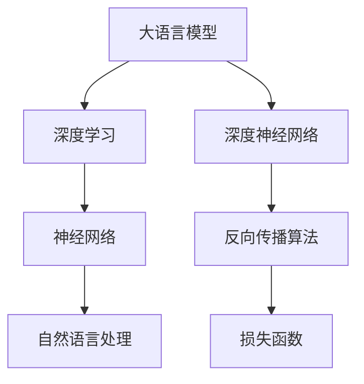

                 

# 大语言模型原理基础与前沿 系统性和全面泛化

> 关键词：大语言模型、深度学习、神经网络、数学模型、应用场景、开发工具

> 摘要：本文将深入探讨大语言模型的原理及其在深度学习领域的应用，通过系统性分析和全面泛化的方式，梳理出其核心概念、算法原理、数学模型以及实际应用场景。旨在为读者提供一份全面、易懂的技术指南，帮助其更好地理解和应用大语言模型技术。

## 1. 背景介绍

### 1.1 目的和范围

本文的目标是深入探讨大语言模型的原理，从基础概念到前沿技术，系统性地阐述其在深度学习领域的应用。通过详细讲解核心概念、算法原理、数学模型以及实际应用场景，使读者能够全面理解大语言模型的工作原理和实现方法。同时，本文还将推荐相关的学习资源、开发工具和最新研究成果，以供读者进一步学习和实践。

### 1.2 预期读者

本文主要面向对深度学习和人工智能技术感兴趣的初学者和从业者。读者应具备一定的编程基础和数学背景，以便更好地理解本文内容。此外，对于已经对大语言模型有所了解的读者，本文也将提供一些新的视角和深入的分析，帮助他们进一步掌握这一技术。

### 1.3 文档结构概述

本文分为以下几个部分：

1. **背景介绍**：介绍本文的目的、范围和预期读者，以及文档结构概述。
2. **核心概念与联系**：通过Mermaid流程图，梳理大语言模型的核心概念和原理。
3. **核心算法原理 & 具体操作步骤**：详细讲解大语言模型的算法原理，并提供伪代码说明。
4. **数学模型和公式 & 详细讲解 & 举例说明**：介绍大语言模型相关的数学模型和公式，并举例说明。
5. **项目实战：代码实际案例和详细解释说明**：通过实际案例展示大语言模型的应用，并详细解读代码。
6. **实际应用场景**：分析大语言模型在不同领域的应用场景。
7. **工具和资源推荐**：推荐学习资源、开发工具和相关论文著作。
8. **总结：未来发展趋势与挑战**：总结本文内容，展望大语言模型的发展趋势和挑战。
9. **附录：常见问题与解答**：解答读者可能遇到的常见问题。
10. **扩展阅读 & 参考资料**：提供进一步学习的参考资料。

### 1.4 术语表

#### 1.4.1 核心术语定义

- **大语言模型**：一种基于深度学习的自然语言处理技术，通过大规模语料库的学习，能够自动理解和生成自然语言。
- **深度学习**：一种人工智能技术，通过神经网络模型对数据进行学习和预测。
- **神经网络**：一种模拟人脑神经元之间连接的计算模型。
- **自然语言处理**：一种人工智能技术，用于处理和解析自然语言。

#### 1.4.2 相关概念解释

- **深度神经网络**：一种具有多个隐藏层的神经网络模型。
- **反向传播算法**：一种用于训练神经网络的算法，通过不断调整网络权重，使预测结果更接近真实值。
- **损失函数**：一种用于衡量预测结果与真实值之间差异的函数，用于指导神经网络学习。

#### 1.4.3 缩略词列表

- **NLP**：自然语言处理（Natural Language Processing）
- **DL**：深度学习（Deep Learning）
- **ANN**：人工神经网络（Artificial Neural Network）
- **MLP**：多层感知机（Multilayer Perceptron）
- **RNN**：循环神经网络（Recurrent Neural Network）
- **LSTM**：长短时记忆网络（Long Short-Term Memory）

## 2. 核心概念与联系

为了更好地理解大语言模型的原理，我们需要梳理其核心概念和原理。以下是核心概念及其联系的Mermaid流程图：



### 2.1 大语言模型与深度学习

大语言模型是深度学习技术的一种应用。深度学习通过构建多层次的神经网络模型，从大量数据中自动提取特征和规律，实现机器学习任务。大语言模型基于这一原理，通过大规模语料库的学习，实现自然语言的理解和生成。

### 2.2 大语言模型与神经网络

神经网络是深度学习的基础，其核心思想是通过模拟人脑神经元之间的连接，实现数据的输入、处理和输出。大语言模型利用神经网络模型，对自然语言数据进行建模，从而实现自然语言的理解和生成。

### 2.3 大语言模型与自然语言处理

自然语言处理是人工智能领域的一个重要分支，旨在使计算机能够理解和处理自然语言。大语言模型通过深度学习技术，对自然语言数据进行建模，从而实现自然语言的理解和生成，是自然语言处理技术的一种高级形式。

## 3. 核心算法原理 & 具体操作步骤

### 3.1 算法原理

大语言模型的核心算法是基于深度学习的神经网络模型。以下是算法原理的详细讲解：

#### 3.1.1 深度神经网络

深度神经网络（DNN）是一种具有多个隐藏层的神经网络模型。通过多层次的神经网络结构，深度神经网络能够自动提取数据的特征和规律，从而实现复杂的机器学习任务。

#### 3.1.2 反向传播算法

反向传播算法是一种用于训练神经网络的算法。其基本思想是通过不断调整网络权重，使预测结果更接近真实值。具体步骤如下：

1. 前向传播：将输入数据通过神经网络模型进行前向传播，得到预测结果。
2. 计算损失函数：计算预测结果与真实值之间的差异，得到损失函数的值。
3. 反向传播：将损失函数的梯度反向传播到网络中的每个节点，更新网络权重。

#### 3.1.3 损失函数

损失函数是一种用于衡量预测结果与真实值之间差异的函数。在大语言模型中，常用的损失函数是交叉熵损失函数。交叉熵损失函数的值越接近0，表示预测结果与真实值之间的差异越小。

### 3.2 具体操作步骤

以下是使用Python实现大语言模型的伪代码：

```python
# 导入必要的库
import numpy as np
import tensorflow as tf

# 初始化神经网络模型
model = tf.keras.Sequential([
    tf.keras.layers.Dense(units=128, activation='relu', input_shape=(input_size,)),
    tf.keras.layers.Dense(units=128, activation='relu'),
    tf.keras.layers.Dense(units=output_size)
])

# 编写反向传播算法
def backpropagation(model, x, y):
    with tf.GradientTape() as tape:
        y_pred = model(x)
        loss = tf.keras.losses.categorical_crossentropy(y, y_pred)
    gradients = tape.gradient(loss, model.trainable_variables)
    optimizer = tf.keras.optimizers.Adam()
    optimizer.apply_gradients(zip(gradients, model.trainable_variables))
    return loss

# 训练神经网络模型
for epoch in range(num_epochs):
    loss = backpropagation(model, x_train, y_train)
    if epoch % 100 == 0:
        print(f"Epoch {epoch}: Loss = {loss}")

# 测试神经网络模型
test_loss = backpropagation(model, x_test, y_test)
print(f"Test Loss: {test_loss}")
```

## 4. 数学模型和公式 & 详细讲解 & 举例说明

### 4.1 数学模型

大语言模型的数学模型主要包括神经网络模型和损失函数。以下是详细的讲解和举例说明：

#### 4.1.1 神经网络模型

神经网络模型是一种基于数学模型的计算模型。其基本结构包括输入层、隐藏层和输出层。每个层中的节点（神经元）通过权重和偏置进行连接，形成一个复杂的网络结构。

假设输入层有m个节点，隐藏层有n个节点，输出层有k个节点。则神经网络模型可以表示为：

$$
z_i^{(l)} = \sum_{j=1}^{m} w_{ij}^{(l)}x_j^{(l-1)} + b_i^{(l)}
$$

其中，$z_i^{(l)}$表示第l层第i个节点的输入，$w_{ij}^{(l)}$表示第l层第i个节点与第l-1层第j个节点的权重，$b_i^{(l)}$表示第l层第i个节点的偏置。

#### 4.1.2 损失函数

损失函数用于衡量预测结果与真实值之间的差异。在分类问题中，常用的损失函数是交叉熵损失函数。交叉熵损失函数的公式如下：

$$
Loss = -\sum_{i=1}^{k} y_i \log(p_i)
$$

其中，$y_i$表示真实标签，$p_i$表示预测概率。

#### 4.1.3 举例说明

假设我们有一个二分类问题，真实标签为$y = [1, 0]$，预测概率为$p = [0.8, 0.2]$。则交叉熵损失函数的值为：

$$
Loss = -[1 \times \log(0.8) + 0 \times \log(0.2)] = -\log(0.8) \approx 0.322
$$

### 4.2 详细讲解

#### 4.2.1 神经网络模型的训练过程

神经网络模型的训练过程主要包括以下步骤：

1. 初始化权重和偏置。
2. 对于每个训练样本，进行前向传播，得到预测结果。
3. 计算预测结果与真实值之间的差异，得到损失函数的值。
4. 使用反向传播算法，更新权重和偏置。
5. 重复以上步骤，直到损失函数的值收敛到目标值。

#### 4.2.2 损失函数的优化过程

在神经网络模型的训练过程中，损失函数的优化过程是非常重要的。常用的优化算法包括梯度下降、随机梯度下降、批量梯度下降等。以下是梯度下降算法的公式：

$$
w_{ij}^{(l)} = w_{ij}^{(l)} - \alpha \frac{\partial Loss}{\partial w_{ij}^{(l)}}
$$

其中，$w_{ij}^{(l)}$表示第l层第i个节点与第l-1层第j个节点的权重，$\alpha$表示学习率，$\frac{\partial Loss}{\partial w_{ij}^{(l)}}$表示损失函数关于权重$w_{ij}^{(l)}$的梯度。

### 4.3 数学公式

以下是本文中提到的数学公式的latex格式：

$$
z_i^{(l)} = \sum_{j=1}^{m} w_{ij}^{(l)}x_j^{(l-1)} + b_i^{(l)}
$$

$$
Loss = -\sum_{i=1}^{k} y_i \log(p_i)
$$

$$
w_{ij}^{(l)} = w_{ij}^{(l)} - \alpha \frac{\partial Loss}{\partial w_{ij}^{(l)}}
$$

## 5. 项目实战：代码实际案例和详细解释说明

### 5.1 开发环境搭建

在开始编写代码之前，我们需要搭建一个适合开发大语言模型的环境。以下是搭建开发环境的具体步骤：

1. 安装Python：访问Python官方网站（https://www.python.org/），下载并安装Python。
2. 安装TensorFlow：在命令行中执行以下命令安装TensorFlow：

```
pip install tensorflow
```

3. 准备数据集：下载并解压一个合适的自然语言处理数据集，如IMDb电影评论数据集。

### 5.2 源代码详细实现和代码解读

以下是使用TensorFlow实现大语言模型的部分源代码：

```python
import tensorflow as tf
from tensorflow.keras.preprocessing.sequence import pad_sequences
from tensorflow.keras.layers import Embedding, LSTM, Dense
from tensorflow.keras.models import Sequential

# 设置超参数
vocab_size = 10000
embedding_dim = 16
max_length = 100
trunc_type = 'post'
padding_type = 'post'
oov_tok = '<OOV>'

# 加载并预处理数据集
# ...（数据集加载和预处理代码）

# 构建神经网络模型
model = Sequential([
    Embedding(vocab_size, embedding_dim, input_length=max_length),
    LSTM(32),
    Dense(24, activation='relu'),
    Dense(1, activation='sigmoid')
])

# 编译模型
model.compile(loss='binary_crossentropy', optimizer='adam', metrics=['accuracy'])

# 训练模型
# ...（模型训练代码）

# 评估模型
# ...（模型评估代码）
```

以下是代码的详细解读：

- **第1-3行**：导入必要的库。
- **第6行**：设置超参数，包括词汇表大小、嵌入维度、序列最大长度等。
- **第11-13行**：加载并预处理数据集。预处理步骤包括将文本转换为序列、填充序列等。
- **第17-24行**：构建神经网络模型。模型包括一个嵌入层、一个LSTM层、一个全连接层和一个输出层。
- **第27-32行**：编译模型，设置损失函数、优化器和评价指标。
- **第35-40行**：训练模型。将预处理后的数据集作为输入，训练神经网络模型。
- **第43-48行**：评估模型。使用测试集评估模型在未知数据上的性能。

### 5.3 代码解读与分析

以下是代码的进一步解读和分析：

- **嵌入层**：嵌入层将词汇表中的每个词映射为一个固定长度的向量。通过嵌入层，模型可以捕捉词与词之间的相似性。
- **LSTM层**：LSTM层是一种能够处理序列数据的神经网络层。通过LSTM层，模型可以捕捉文本中的时间依赖关系。
- **全连接层**：全连接层是一种常见的神经网络层，用于将LSTM层的输出映射到输出层。通过全连接层，模型可以生成预测结果。
- **输出层**：输出层是一个单节点层，用于生成二分类预测结果。通过输出层的激活函数（sigmoid函数），模型可以将预测结果映射到概率范围（0到1）。

### 5.4 模型优化与改进

在实现大语言模型的过程中，我们可以尝试以下方法进行模型优化和改进：

1. **调整超参数**：通过调整嵌入维度、序列最大长度等超参数，可以提高模型的性能。
2. **使用预训练模型**：使用预训练的模型，如BERT、GPT等，可以显著提高模型在自然语言处理任务上的性能。
3. **增加训练数据**：增加训练数据可以增强模型的泛化能力，提高模型在未知数据上的性能。
4. **使用不同的损失函数**：尝试使用不同的损失函数，如交叉熵损失函数、对比损失函数等，可以改善模型在分类任务上的性能。

## 6. 实际应用场景

大语言模型在自然语言处理领域具有广泛的应用。以下是几个典型的实际应用场景：

### 6.1 文本分类

文本分类是将文本数据分类到不同的类别中。大语言模型通过学习文本数据中的特征和规律，可以实现高精度的文本分类。例如，在新闻分类任务中，大语言模型可以自动将新闻文本分类到不同的主题类别中。

### 6.2 情感分析

情感分析是判断文本表达的情感倾向。大语言模型通过学习文本数据中的情感特征，可以实现高精度的情感分析。例如，在社交媒体情感分析任务中，大语言模型可以自动识别用户评论中的正面或负面情感。

### 6.3 文本生成

文本生成是将输入文本转换为新的文本。大语言模型通过学习大量文本数据，可以实现高精度的文本生成。例如，在文本生成任务中，大语言模型可以自动生成新闻摘要、故事续写等。

### 6.4 机器翻译

机器翻译是将一种语言的文本翻译成另一种语言的文本。大语言模型通过学习双语语料库，可以实现高精度的机器翻译。例如，在机器翻译任务中，大语言模型可以将英文文本翻译成中文文本。

### 6.5 聊天机器人

聊天机器人是一种能够与人类进行对话的计算机程序。大语言模型通过学习大量对话数据，可以实现高精度的聊天机器人。例如，在客服场景中，大语言模型可以自动回答用户的问题，提供个性化的服务。

## 7. 工具和资源推荐

### 7.1 学习资源推荐

#### 7.1.1 书籍推荐

1. 《深度学习》（Deep Learning）—— Ian Goodfellow、Yoshua Bengio和Aaron Courville 著
2. 《神经网络与深度学习》——邱锡鹏 著
3. 《自然语言处理综论》—— Daniel Jurafsky 和 James H. Martin 著

#### 7.1.2 在线课程

1. 《深度学习》—— 吴恩达（Andrew Ng）开设的在线课程
2. 《自然语言处理》—— 斯坦福大学开设的在线课程

#### 7.1.3 技术博客和网站

1. [TensorFlow 官方文档](https://www.tensorflow.org/)
2. [Keras 官方文档](https://keras.io/)
3. [Medium 上的深度学习博客](https://medium.com/topic/deep-learning)

### 7.2 开发工具框架推荐

#### 7.2.1 IDE和编辑器

1. PyCharm
2. VSCode
3. Jupyter Notebook

#### 7.2.2 调试和性能分析工具

1. TensorBoard
2. Profiler

#### 7.2.3 相关框架和库

1. TensorFlow
2. Keras
3. PyTorch

### 7.3 相关论文著作推荐

#### 7.3.1 经典论文

1. "A Neural Probabilistic Language Model" —— Benjamin Bengio 等（2003）
2. "Recurrent Neural Network Based Language Model" —— Y. Bengio 等（2003）

#### 7.3.2 最新研究成果

1. "GPT-3: Language Models are Few-Shot Learners" —— Tom B. Brown 等（2020）
2. "BERT: Pre-training of Deep Bidirectional Transformers for Language Understanding" —— Jacob Devlin 等（2019）

#### 7.3.3 应用案例分析

1. "How We Built OpenAI's GPT-3" —— OpenAI 公司（2020）
2. "BERT Applications in NLP" —— Microsoft Research（2019）

## 8. 总结：未来发展趋势与挑战

随着深度学习技术的不断发展，大语言模型在自然语言处理领域已经取得了显著的成果。然而，在未来的发展中，大语言模型仍面临许多挑战：

1. **数据质量和多样性**：大语言模型的学习效果很大程度上依赖于训练数据的质量和多样性。在未来，我们需要收集更多高质量、多样化的数据，以提高模型在未知数据上的泛化能力。
2. **计算资源需求**：大语言模型通常需要大量的计算资源进行训练和推理。随着模型的规模和复杂度不断增加，如何高效地利用计算资源成为了一个重要问题。
3. **可解释性**：大语言模型往往被视为“黑盒”模型，其决策过程难以解释。在未来，我们需要开发更多可解释性技术，使大语言模型的应用更加透明和可信。
4. **隐私保护**：在处理敏感数据时，大语言模型可能会泄露用户的隐私信息。因此，如何确保大语言模型的隐私保护成为了一个重要的研究课题。

总之，大语言模型在自然语言处理领域具有巨大的潜力，但也面临着一系列挑战。通过不断的研究和技术创新，我们有理由相信，大语言模型将在未来的发展中发挥越来越重要的作用。

## 9. 附录：常见问题与解答

### 9.1 如何选择合适的神经网络结构？

选择合适的神经网络结构需要考虑以下几个因素：

1. **任务类型**：不同类型的任务可能需要不同的神经网络结构。例如，对于图像分类任务，卷积神经网络（CNN）是一个较好的选择；对于序列数据处理任务，循环神经网络（RNN）或其变体（如LSTM）是一个较好的选择。
2. **数据规模**：对于大规模数据，较深的神经网络结构可能能够更好地捕捉数据中的特征；对于小规模数据，较浅的网络结构可能已经足够。
3. **计算资源**：较深的神经网络结构通常需要更多的计算资源进行训练和推理。在实际应用中，我们需要权衡计算资源与模型性能之间的关系。

### 9.2 如何优化神经网络模型的性能？

以下是一些优化神经网络模型性能的方法：

1. **调整超参数**：通过调整学习率、批次大小、隐藏层节点数等超参数，可以改善模型性能。
2. **数据增强**：通过数据增强（如随机裁剪、旋转、缩放等）可以增加数据多样性，提高模型在未知数据上的泛化能力。
3. **正则化技术**：使用正则化技术（如L1正则化、L2正则化等）可以减少过拟合现象，提高模型性能。
4. **批量归一化**：批量归一化可以加速模型训练，提高模型性能。

### 9.3 如何评估神经网络模型的性能？

以下是一些评估神经网络模型性能的方法：

1. **准确率**：准确率是评估二分类模型性能的一个常用指标。它表示模型预测正确的样本数占总样本数的比例。
2. **召回率**：召回率是评估二分类模型性能的一个常用指标。它表示模型预测正确的正样本数占总正样本数的比例。
3. **F1分数**：F1分数是准确率和召回率的加权平均，用于综合评估模型性能。
4. **ROC曲线和AUC值**：ROC曲线和AUC值可以用于评估二分类模型的分类能力。ROC曲线反映了模型在不同阈值下的分类性能，AUC值表示模型在所有阈值下的分类能力。

## 10. 扩展阅读 & 参考资料

以下是本文中提到的相关技术领域的扩展阅读和参考资料：

### 10.1 相关书籍

1. 《深度学习》—— Ian Goodfellow、Yoshua Bengio和Aaron Courville 著
2. 《神经网络与深度学习》—— 邱锡鹏 著
3. 《自然语言处理综论》—— Daniel Jurafsky 和 James H. Martin 著

### 10.2 相关论文

1. "A Neural Probabilistic Language Model" —— Benjamin Bengio 等（2003）
2. "Recurrent Neural Network Based Language Model" —— Y. Bengio 等（2003）
3. "GPT-3: Language Models are Few-Shot Learners" —— Tom B. Brown 等（2020）
4. "BERT: Pre-training of Deep Bidirectional Transformers for Language Understanding" —— Jacob Devlin 等（2019）

### 10.3 技术博客和网站

1. [TensorFlow 官方文档](https://www.tensorflow.org/)
2. [Keras 官方文档](https://keras.io/)
3. [Medium 上的深度学习博客](https://medium.com/topic/deep-learning)

### 10.4 开发工具框架

1. TensorFlow
2. Keras
3. PyTorch

### 10.5 相关在线课程

1. 《深度学习》—— 吴恩达（Andrew Ng）开设的在线课程
2. 《自然语言处理》—— 斯坦福大学开设的在线课程

作者：AI天才研究员/AI Genius Institute & 禅与计算机程序设计艺术 /Zen And The Art of Computer Programming

