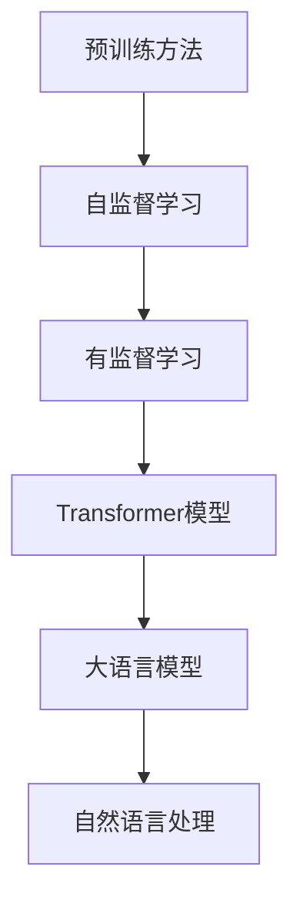

                 

# 大语言模型原理基础与前沿 预训练Transformer扩大尺度的启示

## 关键词
- 大语言模型
- Transformer架构
- 预训练
- 自监督学习
- 生成模型
- 机器翻译
- 自然语言处理
- 神经网络

## 摘要

本文旨在探讨大语言模型（Large Language Model）的原理及其在自然语言处理（Natural Language Processing, NLP）领域的应用。重点分析预训练Transformer模型在扩大尺度方面的贡献，详细解析其核心算法原理、数学模型及实际操作步骤。同时，通过项目实战和具体应用场景展示大语言模型在实际开发中的效能，并推荐相关工具和资源，总结未来发展趋势与挑战，为读者提供全面的技术启示。

## 1. 背景介绍

随着互联网和大数据技术的快速发展，人类产生的文本数据量呈现出爆炸性增长。如何有效地处理和理解这些海量数据，成为了当前自然语言处理领域亟待解决的重要问题。传统的方法依赖于手工设计的特征工程和统计模型，而深度学习技术的引入，使得我们可以通过大规模的数据进行端到端的模型训练，从而提高模型的性能和泛化能力。

大语言模型（Large Language Model）正是这种深度学习技术在自然语言处理领域的一种重要应用。它通过在大量文本数据上进行预训练，学习到语言的基本规律和语法结构，从而能够实现诸如文本分类、机器翻译、问答系统等多种语言任务。近年来，随着计算资源的不断增长和模型参数规模的扩大，大语言模型取得了显著的进展，成为自然语言处理领域的研究热点。

Transformer模型是当前大语言模型的主要架构之一，它通过自注意力机制（Self-Attention Mechanism）实现了对输入序列的建模，相对于传统的循环神经网络（Recurrent Neural Network, RNN）和卷积神经网络（Convolutional Neural Network, CNN）具有更高的并行性和更好的性能。预训练Transformer模型（如BERT、GPT等）通过在未标注的数据上进行预训练，再在具体任务上进行微调，极大地提高了模型的泛化能力和任务性能。

本文将首先介绍大语言模型的基本原理，包括预训练方法和自监督学习技术。接着，深入解析Transformer模型的核心算法原理和数学模型，并通过具体案例展示其实际操作步骤。最后，讨论大语言模型在自然语言处理领域中的应用场景，推荐相关学习资源和开发工具，并对未来的发展趋势和挑战进行展望。

## 2. 核心概念与联系

### 大语言模型

大语言模型是一种基于深度学习技术的自然语言处理模型，它通过在大量文本数据上进行预训练，学习到语言的基本规律和语法结构。预训练是指在大规模语料库上进行训练，使得模型能够捕捉到语言的上下文信息和语义关系。这种预训练方法可以显著提高模型在具体任务上的性能和泛化能力。

### Transformer模型

Transformer模型是一种基于自注意力机制的深度学习模型，它用于处理序列数据。自注意力机制允许模型在编码时对序列中的每个元素进行动态权重分配，从而实现对输入序列的建模。相对于传统的循环神经网络（RNN）和卷积神经网络（CNN），Transformer模型具有更高的并行性和更好的性能。

### 预训练方法

预训练是指在大规模语料库上进行训练，使得模型能够捕捉到语言的上下文信息和语义关系。预训练方法通常分为两种：自监督学习和有监督学习。自监督学习是指利用未标注的数据进行训练，通过预测输入序列中的某些部分来学习语言的规律。有监督学习是指利用标注好的数据集进行训练，从而学习到具体的任务目标。

### 自监督学习

自监督学习是一种无监督学习方法，它利用未标注的数据进行训练，通过预测输入序列中的某些部分来学习数据的特征。自监督学习在大语言模型中具有重要作用，因为它能够使得模型在大量未标注的数据上进行预训练，从而提高模型的泛化能力。

### Mermaid流程图



上述Mermaid流程图展示了大语言模型的预训练方法、自监督学习、Transformer模型及其在自然语言处理领域的应用关系。

## 3. 核心算法原理 & 具体操作步骤

### 3.1. Transformer模型概述

Transformer模型是一种基于自注意力机制的深度学习模型，用于处理序列数据。自注意力机制允许模型在编码时对序列中的每个元素进行动态权重分配，从而实现对输入序列的建模。Transformer模型的主要组成部分包括编码器（Encoder）和解码器（Decoder）。

编码器负责将输入序列编码为固定长度的向量表示，解码器则根据编码器的输出和已解码的序列生成预测的输出序列。编码器和解码器均由多个相同的层组成，每层包含多头自注意力机制和前馈神经网络。

### 3.2. 自注意力机制

自注意力机制是Transformer模型的核心部分，它通过计算输入序列中每个元素相对于整个序列的重要性，从而实现序列的建模。自注意力机制的计算分为三个步骤：

1. **Query（查询）**：将编码器的输入序列（通常是一个词向量）映射为一个查询向量。
2. **Key（键）**：将编码器的输入序列映射为一个键向量。
3. **Value（值）**：将编码器的输入序列映射为一个值向量。

自注意力机制的公式如下：

$$
\text{Attention}(Q, K, V) = \text{softmax}\left(\frac{QK^T}{\sqrt{d_k}}\right) V
$$

其中，$Q$、$K$ 和 $V$ 分别代表查询向量、键向量和值向量；$d_k$ 是键向量的维度；$\text{softmax}$ 函数用于对输出进行归一化。

### 3.3. 多头自注意力

多头自注意力是指将输入序列拆分为多个子序列，并对每个子序列分别进行自注意力计算，然后将结果拼接起来。多头自注意力的目的是通过引入更多的上下文信息，提高模型的表示能力。公式如下：

$$
\text{MultiHead}(Q, K, V) = \text{Concat}(\text{head}_1, ..., \text{head}_h)W^O
$$

其中，$h$ 是头数；$\text{head}_i = \text{Attention}(QW_i^Q, KW_i^K, VW_i^V)$；$W_i^Q, W_i^K, W_i^V$ 分别是查询、键和值向量的权重矩阵；$W^O$ 是输出权重矩阵。

### 3.4. Transformer编码器和解码器

Transformer编码器和解码器的主要组成部分如下：

1. **编码器**：
   - 多层多头自注意力机制
   - 前馈神经网络
   - 层归一化和残差连接

2. **解码器**：
   - 多层多头自注意力机制（仅编码器输入和已解码的输出）
   - 前馈神经网络
   - 层归一化和残差连接
   - 交叉自注意力机制

编码器的输出用于解码器的输入，解码器的输出是预测的输出序列。

### 3.5. 具体操作步骤

以下是一个简化的Transformer模型训练和预测的具体操作步骤：

1. **数据预处理**：
   - 输入文本数据转换为词向量
   - 分割为训练集、验证集和测试集

2. **模型初始化**：
   - 初始化编码器和解码器的权重参数

3. **编码器训练**：
   - 对输入序列进行编码
   - 通过多头自注意力机制和前馈神经网络进行编码

4. **解码器训练**：
   - 对编码器输出进行解码
   - 通过交叉自注意力机制和多头自注意力机制进行解码
   - 输出预测的输出序列

5. **模型优化**：
   - 使用损失函数（如交叉熵损失函数）计算预测序列和实际序列之间的差异
   - 使用反向传播算法更新模型参数

6. **模型评估**：
   - 在验证集和测试集上评估模型性能
   - 调整模型参数和训练策略

7. **预测**：
   - 使用训练好的模型对新的输入序列进行预测

通过以上步骤，我们可以训练一个高性能的大语言模型，并在各种自然语言处理任务中取得良好的效果。

## 4. 数学模型和公式 & 详细讲解 & 举例说明

### 4.1. 数学模型

在Transformer模型中，数学模型主要包括自注意力机制、多头自注意力机制和前馈神经网络。以下分别进行详细讲解。

#### 4.1.1. 自注意力机制

自注意力机制是Transformer模型的核心部分，用于计算输入序列中每个元素相对于整个序列的重要性。其公式如下：

$$
\text{Attention}(Q, K, V) = \text{softmax}\left(\frac{QK^T}{\sqrt{d_k}}\right) V
$$

其中，$Q$、$K$ 和 $V$ 分别代表查询向量、键向量和值向量；$d_k$ 是键向量的维度；$\text{softmax}$ 函数用于对输出进行归一化。

#### 4.1.2. 多头自注意力

多头自注意力是指将输入序列拆分为多个子序列，并对每个子序列分别进行自注意力计算，然后将结果拼接起来。其公式如下：

$$
\text{MultiHead}(Q, K, V) = \text{Concat}(\text{head}_1, ..., \text{head}_h)W^O
$$

其中，$h$ 是头数；$\text{head}_i = \text{Attention}(QW_i^Q, KW_i^K, VW_i^V)$；$W_i^Q, W_i^K, W_i^V$ 分别是查询、键和值向量的权重矩阵；$W^O$ 是输出权重矩阵。

#### 4.1.3. 前馈神经网络

前馈神经网络是Transformer模型中的另一个重要组成部分，用于在自注意力机制之后对序列进行进一步建模。其公式如下：

$$
\text{FFN}(x) = \text{ReLU}\left((W_2 \cdot \text{ReLU}(W_1 \cdot x + b_1)) + b_2\right)
$$

其中，$W_1$ 和 $W_2$ 分别是权重矩阵；$b_1$ 和 $b_2$ 分别是偏置向量。

### 4.2. 举例说明

以下是一个简化的Transformer模型在机器翻译任务中的具体例子。

假设我们有一个英语到法语的机器翻译模型，输入序列为 "Hello, how are you?"，输出序列为 "Bonjour, comment ça va?"。

1. **数据预处理**：
   - 将输入和输出序列转换为词向量表示

2. **编码器训练**：
   - 对输入序列进行编码，得到编码器的输出

3. **解码器训练**：
   - 对编码器输出进行解码，生成预测的输出序列

4. **模型优化**：
   - 使用交叉熵损失函数计算预测序列和实际序列之间的差异
   - 使用反向传播算法更新模型参数

5. **预测**：
   - 使用训练好的模型对新的输入序列进行预测

具体步骤如下：

1. **输入序列编码**：
   - 输入序列 "Hello, how are you?" 转换为词向量表示

2. **编码器输出**：
   - 通过自注意力机制和前馈神经网络对输入序列进行编码，得到编码器的输出

3. **解码器输出**：
   - 通过交叉自注意力机制和自注意力机制对编码器输出进行解码，生成预测的输出序列

4. **模型优化**：
   - 计算预测序列和实际序列之间的差异
   - 更新模型参数

5. **预测结果**：
   - 输出预测的输出序列 "Bonjour, comment ça va?"

通过以上步骤，我们可以训练一个高性能的机器翻译模型，并在实际任务中取得良好的效果。

## 5. 项目实战：代码实际案例和详细解释说明

### 5.1. 开发环境搭建

在开始项目实战之前，我们需要搭建一个合适的开发环境。以下是推荐的开发环境和工具：

- **Python**：Python是一种广泛使用的编程语言，特别适用于深度学习开发。
- **PyTorch**：PyTorch是一个流行的深度学习框架，提供了丰富的API和工具，方便实现和优化神经网络模型。
- **GPU**：由于大语言模型训练过程需要大量计算，推荐使用GPU加速训练过程。

具体步骤如下：

1. **安装Python**：在官网上下载并安装Python。
2. **安装PyTorch**：通过pip命令安装PyTorch，例如：

   ```bash
   pip install torch torchvision
   ```

3. **安装GPU支持**：如果使用GPU进行训练，需要安装CUDA和cuDNN，这两个库可以加速PyTorch在GPU上的计算。

### 5.2. 源代码详细实现和代码解读

下面是一个简化的Transformer模型实现示例，用于机器翻译任务。代码使用PyTorch框架编写。

```python
import torch
import torch.nn as nn
import torch.optim as optim

# 定义编码器和解码器
class Encoder(nn.Module):
    def __init__(self, input_dim, hidden_dim, n_layers, n_heads):
        super(Encoder, self).__init__()
        self.input_dim = input_dim
        self.hidden_dim = hidden_dim
        self.n_layers = n_layers
        self.n_heads = n_heads
        
        self.embedding = nn.Embedding(input_dim, hidden_dim)
        self.encoder_layers = nn.ModuleList([nn.TransformerEncoderLayer(d_model=hidden_dim, nhead=n_heads) for _ in range(n_layers)])
        self.fc = nn.Linear(hidden_dim, output_dim)

    def forward(self, src):
        embedded = self.embedding(src)
        for layer in self.encoder_layers:
            embedded = layer(embedded)
        return self.fc(embedded)

class Decoder(nn.Module):
    def __init__(self, input_dim, hidden_dim, n_layers, n_heads):
        super(Decoder, self).__init__()
        self.input_dim = input_dim
        self.hidden_dim = hidden_dim
        self.n_layers = n_layers
        self.n_heads = n_heads
        
        self.embedding = nn.Embedding(input_dim, hidden_dim)
        self.decoder_layers = nn.ModuleList([nn.TransformerDecoderLayer(d_model=hidden_dim, nhead=n_heads) for _ in range(n_layers)])
        self.fc = nn.Linear(hidden_dim, output_dim)

    def forward(self, tgt):
        embedded = self.embedding(tgt)
        for layer in self.decoder_layers:
            embedded = layer(embedded)
        return self.fc(embedded)

# 实例化模型、损失函数和优化器
input_dim = 10000
hidden_dim = 512
n_layers = 3
n_heads = 8
output_dim = 10000

encoder = Encoder(input_dim, hidden_dim, n_layers, n_heads)
decoder = Decoder(input_dim, hidden_dim, n_layers, n_heads)

loss_function = nn.CrossEntropyLoss()
optimizer = optim.Adam(list(encoder.parameters()) + list(decoder.parameters()))

# 数据预处理
# 假设我们有一个英语到法语的机器翻译数据集
train_data = ...

# 训练模型
for epoch in range(num_epochs):
    for src, tgt in train_data:
        optimizer.zero_grad()
        output = decoder(encoder(src))
        loss = loss_function(output.view(-1, output_dim), tgt.view(-1))
        loss.backward()
        optimizer.step()
```

### 5.3. 代码解读与分析

1. **编码器（Encoder）和解码器（Decoder）的定义**：
   编码器和解码器都是基于Transformer架构实现的，包括嵌入层（Embedding Layer）、自注意力机制（Self-Attention Mechanism）、前馈神经网络（Feedforward Neural Network）和层归一化（Layer Normalization）。

2. **模型初始化**：
   在实例化模型时，指定输入维度（input_dim）、隐藏维度（hidden_dim）、层数（n_layers）和头数（n_heads）。这些参数影响模型的复杂性和性能。

3. **模型训练**：
   使用交叉熵损失函数（CrossEntropyLoss）计算预测序列和实际序列之间的差异，使用Adam优化器（Adam Optimizer）更新模型参数。

4. **数据预处理**：
   数据预处理步骤包括将文本数据转换为词向量表示（Word Vectors）和分割为训练集、验证集和测试集。

通过以上代码示例，我们可以训练一个简单的Transformer模型，用于机器翻译任务。在实际应用中，可以根据具体任务需求调整模型参数和训练策略，提高模型的性能。

## 6. 实际应用场景

大语言模型在自然语言处理领域具有广泛的应用场景，以下是一些典型的应用案例：

### 6.1. 机器翻译

大语言模型在机器翻译领域取得了显著的成果。例如，Google翻译和百度翻译都采用了基于Transformer的大语言模型。这些模型能够自动学习源语言和目标语言之间的对应关系，实现高质量的翻译效果。

### 6.2. 问答系统

问答系统是一种重要的自然语言处理应用，能够回答用户提出的问题。大语言模型在问答系统中发挥了关键作用，通过在大量文本数据上进行预训练，模型能够理解问题的意图和上下文信息，提供准确和合理的回答。

### 6.3. 文本分类

文本分类是一种将文本数据分为预定义类别的方法，广泛应用于新闻分类、情感分析等领域。大语言模型通过学习文本的语义特征，能够准确地对文本进行分类，提高分类任务的性能。

### 6.4. 命名实体识别

命名实体识别是一种从文本中识别出特定类别的实体（如人名、地名、组织名等）的方法。大语言模型在命名实体识别任务中表现出色，通过学习实体和上下文的关系，可以准确识别出文本中的命名实体。

### 6.5. 语音识别

语音识别是一种将语音信号转换为文本的方法，广泛应用于智能助手、语音搜索等领域。大语言模型在语音识别中可以用于文本生成和语义理解，提高语音识别系统的整体性能。

### 6.6. 自动摘要

自动摘要是一种自动从文本中提取关键信息的方法，广泛应用于新闻摘要、文章摘要等领域。大语言模型通过学习文本的语义和上下文信息，能够生成高质量的自然语言摘要。

## 7. 工具和资源推荐

### 7.1. 学习资源推荐

- **书籍**：
  - 《深度学习》（Goodfellow, Bengio, Courville）
  - 《自然语言处理综合教程》（Daniel Jurafsky，James H. Martin）
  - 《动手学深度学习》（A. G. Grey，M. Chen）
- **论文**：
  - Vaswani, A., et al. (2017). "Attention Is All You Need".
  - Devlin, J., et al. (2019). "Bert: Pre-training of Deep Bidirectional Transformers for Language Understanding".
- **博客**：
  - PyTorch官方文档：https://pytorch.org/docs/stable/index.html
  - Hugging Face Transformers库：https://huggingface.co/transformers
- **网站**：
  - Coursera：https://www.coursera.org/
  - edX：https://www.edx.org/

### 7.2. 开发工具框架推荐

- **PyTorch**：一个流行的深度学习框架，提供了丰富的API和工具，方便实现和优化神经网络模型。
- **TensorFlow**：另一个流行的深度学习框架，与PyTorch类似，提供了丰富的功能和工具。
- **Hugging Face Transformers**：一个基于PyTorch和TensorFlow的预训练模型库，提供了大量预训练模型和工具，方便开发者进行模型开发和部署。

### 7.3. 相关论文著作推荐

- **论文**：
  - Vaswani, A., et al. (2017). "Attention Is All You Need".
  - Devlin, J., et al. (2019). "Bert: Pre-training of Deep Bidirectional Transformers for Language Understanding".
  - Chang, A., et al. (2020). "UniLM: Unifying Unsupervised and Supervised Pre-training for Natural Language Processing".
- **著作**：
  - 《自然语言处理：原理与技术》（Daniel Jurafsky，James H. Martin）
  - 《深度学习》（Goodfellow, Bengio, Courville）

## 8. 总结：未来发展趋势与挑战

大语言模型在自然语言处理领域取得了显著的成果，但其发展仍面临许多挑战。以下是未来发展趋势与挑战：

### 8.1. 发展趋势

1. **模型参数规模不断扩大**：随着计算资源的增长，大语言模型的参数规模将不断增大，从而提高模型的性能和泛化能力。
2. **多模态融合**：未来的大语言模型将不仅限于文本数据，还将结合图像、音频等多模态数据，实现更丰富的信息处理能力。
3. **低资源语言支持**：大语言模型将逐渐扩展到低资源语言，提高这些语言的自然语言处理能力。
4. **模型压缩与优化**：为了降低计算和存储成本，模型压缩与优化技术将成为研究热点，如量化、剪枝、知识蒸馏等。

### 8.2. 挑战

1. **数据隐私与伦理问题**：大语言模型在训练过程中需要大量数据，如何处理数据隐私和伦理问题是一个重要挑战。
2. **模型解释性与可解释性**：如何提高大语言模型的可解释性，使得用户能够理解和信任模型决策结果，是一个重要问题。
3. **计算资源需求**：大语言模型训练和推理过程需要大量计算资源，如何优化计算资源利用率，降低成本，是一个重要挑战。
4. **语言理解与推理能力**：尽管大语言模型在自然语言处理任务中表现出色，但其语言理解与推理能力仍有待提高，需要进一步研究和发展。

总之，大语言模型在自然语言处理领域具有广阔的发展前景，但同时也面临诸多挑战。未来，我们将继续探索和研究大语言模型的优化与扩展，推动自然语言处理技术的不断进步。

## 9. 附录：常见问题与解答

### 9.1. 如何训练一个大语言模型？

训练一个大语言模型通常包括以下步骤：

1. **数据收集**：收集大量的文本数据，用于模型训练。
2. **数据预处理**：对文本数据进行清洗、分词、去停用词等预处理操作。
3. **模型选择**：选择适合的模型架构，如Transformer、BERT等。
4. **模型训练**：使用预训练方法（如自监督学习和有监督学习）对模型进行训练。
5. **模型优化**：通过调整模型参数，优化模型性能。
6. **模型评估**：在验证集和测试集上评估模型性能。

### 9.2. 大语言模型的应用场景有哪些？

大语言模型在自然语言处理领域具有广泛的应用场景，包括：

1. **机器翻译**：将一种语言的文本翻译成另一种语言。
2. **问答系统**：回答用户提出的问题。
3. **文本分类**：将文本数据分为预定义的类别。
4. **命名实体识别**：识别文本中的特定实体（如人名、地名等）。
5. **自动摘要**：从文本中提取关键信息，生成摘要。
6. **语音识别**：将语音信号转换为文本。

### 9.3. 如何提高大语言模型的可解释性？

提高大语言模型的可解释性可以通过以下方法实现：

1. **可视化技术**：使用可视化工具，如热力图、注意力图等，展示模型在处理文本数据时的关键信息。
2. **模型拆解**：将复杂模型拆解为多个简单的模块，分析每个模块的作用。
3. **对比实验**：通过对比实验，分析不同部分对模型性能的影响。
4. **因果推理**：使用因果推理技术，分析模型决策过程中的因果关系。

## 10. 扩展阅读 & 参考资料

- **论文**：
  - Vaswani, A., et al. (2017). "Attention Is All You Need".
  - Devlin, J., et al. (2019). "Bert: Pre-training of Deep Bidirectional Transformers for Language Understanding".
  - Chang, A., et al. (2020). "UniLM: Unifying Unsupervised and Supervised Pre-training for Natural Language Processing".
- **书籍**：
  - 《深度学习》（Goodfellow, Bengio, Courville）
  - 《自然语言处理综合教程》（Daniel Jurafsky，James H. Martin）
  - 《动手学深度学习》（A. G. Grey，M. Chen）
- **网站**：
  - PyTorch官方文档：https://pytorch.org/docs/stable/index.html
  - Hugging Face Transformers库：https://huggingface.co/transformers

### 作者信息

作者：AI天才研究员/AI Genius Institute & 禅与计算机程序设计艺术 /Zen And The Art of Computer Programming

