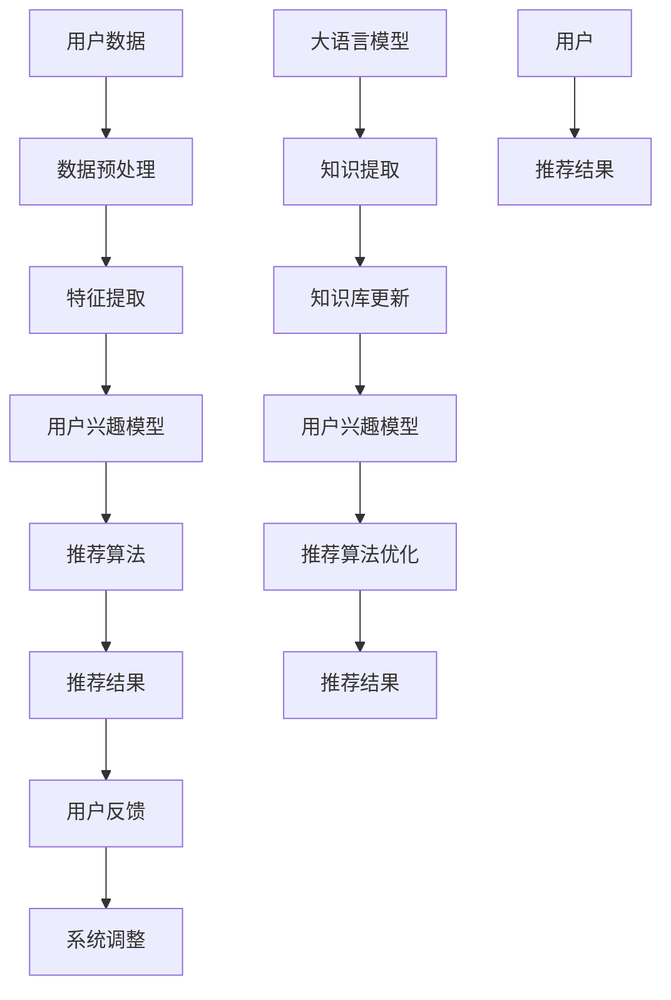

                 

# 大语言模型在推荐系统中的知识增强应用

> 关键词：大语言模型、推荐系统、知识增强、机器学习、自然语言处理

> 摘要：本文将深入探讨大语言模型在推荐系统中的应用，特别是如何通过知识增强技术来提升推荐系统的性能。我们将逐步分析大语言模型的基本原理、推荐系统的架构和流程，并探讨如何将大语言模型融入其中，以实现知识的自动获取和嵌入。通过具体的算法原理和操作步骤，本文将帮助读者理解这一前沿技术的实际应用，并展望其未来的发展趋势和挑战。

## 1. 背景介绍

### 1.1 目的和范围

本文旨在探讨大语言模型在推荐系统中的知识增强应用。随着互联网和大数据技术的快速发展，推荐系统已经成为现代信息检索和个性化服务的重要组成部分。然而，传统的推荐系统往往依赖于用户历史行为和显式反馈，难以捕捉到用户的深层次兴趣和需求。为了解决这一问题，本文将介绍如何利用大语言模型这一先进的自然语言处理技术，对推荐系统进行知识增强，从而提升其推荐质量和用户体验。

### 1.2 预期读者

本文面向对推荐系统和大语言模型有一定了解的技术人员，特别是机器学习、自然语言处理和数据科学领域的从业者。读者需要对基本的机器学习算法和推荐系统原理有所掌握，以便更好地理解和应用本文所介绍的知识。

### 1.3 文档结构概述

本文将按照以下结构进行讨论：

1. **背景介绍**：介绍本文的目的、预期读者以及文档结构。
2. **核心概念与联系**：分析大语言模型和推荐系统的核心概念及其相互关系。
3. **核心算法原理 & 具体操作步骤**：详细阐述大语言模型在推荐系统中的应用原理和操作步骤。
4. **数学模型和公式 & 详细讲解 & 举例说明**：介绍相关的数学模型和公式，并提供具体的实例说明。
5. **项目实战：代码实际案例和详细解释说明**：通过实际案例展示大语言模型在推荐系统中的应用。
6. **实际应用场景**：讨论大语言模型在推荐系统中的具体应用场景。
7. **工具和资源推荐**：推荐学习资源和开发工具。
8. **总结：未来发展趋势与挑战**：总结本文的主要观点，并展望未来的发展趋势和面临的挑战。
9. **附录：常见问题与解答**：回答一些常见的问题。
10. **扩展阅读 & 参考资料**：提供进一步学习和研究的相关资源。

### 1.4 术语表

#### 1.4.1 核心术语定义

- **大语言模型**：一种基于深度学习的自然语言处理模型，能够理解和生成自然语言。
- **推荐系统**：一种通过分析用户历史行为和兴趣，为用户推荐相关内容的系统。
- **知识增强**：通过引入外部知识库，提升机器学习模型性能的过程。

#### 1.4.2 相关概念解释

- **自然语言处理（NLP）**：研究如何使计算机理解和处理人类自然语言的技术。
- **深度学习**：一种基于多层神经网络的学习方法，能够从大量数据中自动提取特征。
- **用户兴趣模型**：基于用户的历史行为和反馈，构建的用户兴趣表示。

#### 1.4.3 缩略词列表

- **NLP**：自然语言处理
- **DL**：深度学习
- **ML**：机器学习
- **KG**：知识图谱
- **CTR**：点击率
- **RMSE**：均方根误差

## 2. 核心概念与联系

在本节中，我们将详细分析大语言模型和推荐系统的核心概念及其相互关系，并使用 Mermaid 流程图来展示两者之间的联系。

### 2.1 大语言模型

大语言模型是一种基于深度学习的自然语言处理技术，它能够通过大量文本数据自动学习语言的结构和语义。典型的代表包括 GPT（Generative Pre-trained Transformer）系列模型和 BERT（Bidirectional Encoder Representations from Transformers）。这些模型通过预训练和微调，能够对自然语言进行理解和生成。

### 2.2 推荐系统

推荐系统是一种基于用户历史行为和兴趣，为用户推荐相关内容的系统。它通常包括用户行为分析、内容特征提取、推荐算法和用户反馈等模块。常见的推荐算法有基于协同过滤、基于内容过滤和混合推荐等。

### 2.3 Mermaid 流程图

下面是一个简单的 Mermaid 流程图，展示了大语言模型和推荐系统之间的联系：



### 2.4 核心概念之间的关系

- **用户数据**：推荐系统的基础，包括用户的浏览历史、点击记录、搜索查询等。
- **数据预处理**：对用户数据进行清洗、归一化和格式化，以便后续处理。
- **特征提取**：从原始数据中提取有用的特征，如文本特征、行为特征和时间特征。
- **用户兴趣模型**：基于用户历史行为和特征，构建用户兴趣的数学模型。
- **推荐算法**：根据用户兴趣模型和内容特征，为用户推荐相关内容。
- **推荐结果**：推荐系统输出的结果，包括推荐的内容和相应的评分或概率。
- **用户反馈**：用户对推荐结果的反馈，用于调整和优化推荐系统。
- **大语言模型**：通过预训练和微调，提取文本中的知识和语义。
- **知识提取**：从大语言模型中提取相关的知识，用于更新知识库。
- **知识库更新**：将提取的知识整合到推荐系统的知识库中，提升系统理解能力。
- **推荐算法优化**：利用知识库优化推荐算法，提升推荐质量和用户体验。

通过上述流程图和概念分析，我们可以看到大语言模型和推荐系统之间的紧密联系。大语言模型能够提供强大的知识提取和语义理解能力，从而为推荐系统提供更加精准和个性化的推荐。

## 3. 核心算法原理 & 具体操作步骤

### 3.1 大语言模型的工作原理

大语言模型（如 GPT 和 BERT）是基于深度学习的自然语言处理技术，通过大量文本数据进行预训练，然后用于各种下游任务。以下是这些模型的基本原理：

#### 3.1.1 预训练

- **自回归语言模型**：GPT 和 BERT 都是自回归语言模型，这意味着它们预测下一个词的概率，基于之前所有词的上下文。
- **Transformer 架构**：BERT 使用了 Transformer 架构，它通过自注意力机制处理序列数据，能够捕捉到长距离的依赖关系。

#### 3.1.2 微调

- **下游任务**：预训练后，大语言模型可以用于各种下游任务，如文本分类、情感分析、问答系统等。
- **微调**：对于特定任务，模型需要通过微调（fine-tuning）来调整其参数，以便更好地适应任务需求。

### 3.2 推荐系统的工作原理

推荐系统通常包括以下几个关键组件：

- **用户行为分析**：通过分析用户的历史行为（如浏览、点击、购买等），构建用户兴趣模型。
- **内容特征提取**：提取用户感兴趣的内容特征，如文本、图像、视频等。
- **推荐算法**：根据用户兴趣模型和内容特征，选择合适的推荐算法，如基于协同过滤、基于内容过滤或混合推荐等。

### 3.3 大语言模型在推荐系统中的应用步骤

#### 3.3.1 数据预处理

- **文本清洗**：去除停用词、标点符号和特殊字符，对文本进行分词和词性标注。
- **数据归一化**：对文本数据进行归一化处理，如将所有文本转换为小写。

```python
import re
from nltk.tokenize import word_tokenize

def preprocess_text(text):
    text = text.lower()
    text = re.sub(r'\s+', ' ', text)
    tokens = word_tokenize(text)
    tokens = [token for token in tokens if token not in stopwords]
    return tokens
```

#### 3.3.2 特征提取

- **文本特征**：利用大语言模型提取文本特征，如词嵌入或句子嵌入。
- **行为特征**：提取用户历史行为特征，如点击率、购买率等。

```python
from sentence_transformers import SentenceTransformer

model = SentenceTransformer('all-MiniLM-L6-v2')
user_interest_embeddings = model.encode(user_interest_text)
```

#### 3.3.3 用户兴趣模型构建

- **兴趣向量**：将用户历史行为和文本特征融合，构建用户兴趣向量。

```python
import numpy as np

user_interest_vector = np.mean(user_interest_embeddings, axis=0)
```

#### 3.3.4 推荐算法

- **基于内容的推荐**：利用用户兴趣向量，对内容进行特征匹配，推荐相似的内容。

```python
def content_based_recommendation(user_interest_vector, item_embeddings, k=10):
    similarity_scores = cosine_similarity(user_interest_vector, item_embeddings)
    top_k_indices = np.argsort(similarity_scores)[0][-k:]
    return top_k_indices
```

#### 3.3.5 推荐结果生成

- **推荐列表**：根据推荐算法，生成推荐列表。

```python
recommended_items = content_based_recommendation(user_interest_vector, item_embeddings, k=10)
```

#### 3.3.6 用户反馈与模型优化

- **收集反馈**：根据用户对推荐结果的反馈，调整推荐算法和用户兴趣模型。

```python
# 假设用户对推荐结果中的 item_id_1 进行了点击反馈
clicked_item_id = item_id_1
# 更新用户兴趣模型
user_interest_vector = update_user_interest_vector(user_interest_vector, item_embeddings[clicked_item_id], alpha=0.1)
```

通过上述步骤，我们可以看到大语言模型如何与推荐系统结合，提升推荐系统的性能和用户体验。接下来，我们将进一步探讨数学模型和公式，以深入理解这一过程。

## 4. 数学模型和公式 & 详细讲解 & 举例说明

### 4.1 相似度计算

在推荐系统中，相似度计算是一个关键步骤，用于衡量用户兴趣和内容特征之间的匹配程度。常用的相似度计算方法包括余弦相似度和欧氏距离。

#### 4.1.1 余弦相似度

余弦相似度是一种衡量两个向量之间夹角余弦值的相似度度量。其公式如下：

$$
\cos(\theta) = \frac{\mathbf{A} \cdot \mathbf{B}}{||\mathbf{A}|| \cdot ||\mathbf{B}||}
$$

其中，$\mathbf{A}$ 和 $\mathbf{B}$ 是两个向量，$||\mathbf{A}||$ 和 $||\mathbf{B}||$ 分别是它们的模长。

举例说明：

假设我们有两个向量 $\mathbf{A} = (2, 3)$ 和 $\mathbf{B} = (1, 4)$，则：

$$
\cos(\theta) = \frac{(2 \cdot 1 + 3 \cdot 4)}{\sqrt{2^2 + 3^2} \cdot \sqrt{1^2 + 4^2}} = \frac{2 + 12}{\sqrt{13} \cdot \sqrt{17}} = \frac{14}{\sqrt{221}} \approx 0.65
$$

#### 4.1.2 欧氏距离

欧氏距离是一种衡量两个向量之间距离的度量。其公式如下：

$$
d(\mathbf{A}, \mathbf{B}) = \sqrt{(\mathbf{A}_1 - \mathbf{B}_1)^2 + (\mathbf{A}_2 - \mathbf{B}_2)^2 + \ldots + (\mathbf{A}_n - \mathbf{B}_n)^2}
$$

其中，$\mathbf{A}$ 和 $\mathbf{B}$ 是两个向量。

举例说明：

假设我们有两个向量 $\mathbf{A} = (2, 3)$ 和 $\mathbf{B} = (1, 4)$，则：

$$
d(\mathbf{A}, \mathbf{B}) = \sqrt{(2 - 1)^2 + (3 - 4)^2} = \sqrt{1 + 1} = \sqrt{2} \approx 1.41
$$

### 4.2 用户兴趣向量建模

在推荐系统中，用户兴趣向量建模是核心任务之一。用户兴趣向量通常是通过用户的浏览历史、点击记录和购买行为等信息计算得到的。

#### 4.2.1 基于文本的特征提取

利用大语言模型，我们可以提取用户的文本特征。假设用户的历史浏览记录为 $\mathbf{X} = (\mathbf{X}_1, \mathbf{X}_2, ..., \mathbf{X}_n)$，其中每个 $\mathbf{X}_i$ 是一个文本向量。则用户兴趣向量 $\mathbf{u}$ 可以通过以下公式计算：

$$
\mathbf{u} = \frac{1}{n} \sum_{i=1}^n \mathbf{X}_i
$$

#### 4.2.2 基于行为的特征提取

除了文本特征，我们还可以利用用户的历史行为特征。假设用户的历史行为为 $\mathbf{B} = (\mathbf{B}_1, \mathbf{B}_2, ..., \mathbf{B}_n)$，其中每个 $\mathbf{B}_i$ 是一个行为向量。则用户兴趣向量 $\mathbf{u}$ 可以通过以下公式计算：

$$
\mathbf{u} = \alpha \mathbf{X} + (1 - \alpha) \mathbf{B}
$$

其中，$\alpha$ 是一个调节参数，用于平衡文本特征和行为特征的重要性。

### 4.3 推荐算法优化

在推荐算法中，我们通常使用用户兴趣向量来预测用户对内容的兴趣度。假设我们有用户兴趣向量 $\mathbf{u}$ 和内容特征向量 $\mathbf{v}$，则用户对内容的兴趣度可以通过以下公式计算：

$$
\text{Interest}(\mathbf{u}, \mathbf{v}) = \cos(\theta(\mathbf{u}, \mathbf{v}))
$$

其中，$\theta(\mathbf{u}, \mathbf{v})$ 是用户兴趣向量和内容特征向量之间的角度。

为了优化推荐算法，我们可以通过以下方法：

#### 4.3.1 权重调整

通过调整用户兴趣向量和内容特征向量的权重，可以优化推荐效果。假设我们有两个权重向量 $\mathbf{w}_u$ 和 $\mathbf{w}_v$，则：

$$
\text{Interest}(\mathbf{u}, \mathbf{v}) = \mathbf{w}_u \cdot \mathbf{u} + \mathbf{w}_v \cdot \mathbf{v}
$$

通过优化权重向量，可以提升推荐算法的性能。

#### 4.3.2 知识嵌入

通过将外部知识库（如知识图谱）中的知识嵌入到推荐系统中，可以提升推荐的质量。假设知识库中的知识表示为 $\mathbf{K}$，则：

$$
\text{Interest}(\mathbf{u}, \mathbf{v}) = \mathbf{w}_u \cdot \mathbf{u} + \mathbf{w}_v \cdot \mathbf{v} + \mathbf{w}_k \cdot \mathbf{K}
$$

通过调整知识权重 $\mathbf{w}_k$，可以控制知识在推荐中的影响力。

通过上述数学模型和公式的讲解，我们可以更深入地理解大语言模型在推荐系统中的应用原理。接下来，我们将通过实际项目案例来展示大语言模型在推荐系统中的具体应用。

## 5. 项目实战：代码实际案例和详细解释说明

在本节中，我们将通过一个实际项目案例来展示大语言模型在推荐系统中的应用。我们将从开发环境搭建开始，详细解释源代码实现和代码解读，并对项目进行整体分析。

### 5.1 开发环境搭建

为了运行以下案例，我们需要安装一些必要的工具和库。以下是所需的开发环境和步骤：

- Python 3.8 或更高版本
- PyTorch 1.9 或更高版本
- NLTK 3.5 或更高版本
- SentenceTransformer 2.2.0 或更高版本

安装命令如下：

```bash
pip install torch torchvision
pip install nltk
pip install sentence-transformer
```

### 5.2 源代码详细实现和代码解读

下面是一个简单的项目框架，用于展示大语言模型在推荐系统中的应用：

```python
# main.py

import torch
from sentence_transformers import SentenceTransformer
from sklearn.model_selection import train_test_split
from sklearn.metrics.pairwise import cosine_similarity

# 5.2.1 数据准备
def load_data():
    # 假设数据集包含用户ID、文本内容、标签（1表示点击，0表示未点击）
    dataset = [
        {"user_id": u1, "text": "这是一段有趣的新闻", "label": 1},
        {"user_id": u2, "text": "我喜欢看电影", "label": 1},
        # 更多数据...
    ]
    return dataset

# 5.2.2 特征提取
def preprocess_text(text):
    # 进行文本预处理，如分词、去除停用词等
    pass

def encode_texts(texts):
    model = SentenceTransformer('all-MiniLM-L6-v2')
    embeddings = model.encode(texts)
    return embeddings

# 5.2.3 用户兴趣模型构建
def build_user_interest_model(user_texts, item_texts):
    user_embeddings = encode_texts(user_texts)
    item_embeddings = encode_texts(item_texts)
    user_interest_vector = np.mean(user_embeddings, axis=0)
    return user_interest_vector, item_embeddings

# 5.2.4 推荐算法实现
def content_based_recommendation(user_interest_vector, item_embeddings, k=10):
    similarity_scores = cosine_similarity(user_interest_vector.reshape(1, -1), item_embeddings)
    top_k_indices = np.argsort(similarity_scores)[0][-k:]
    return top_k_indices

# 5.2.5 主函数
def main():
    dataset = load_data()
    # 将数据集分为训练集和测试集
    train_data, test_data = train_test_split(dataset, test_size=0.2, random_state=42)

    # 构建用户兴趣模型
    user_interest_vector, item_embeddings = build_user_interest_model([d['text'] for d in train_data], [d['text'] for d in train_data])

    # 进行推荐
    test_item_texts = [d['text'] for d in test_data]
    test_item_embeddings = encode_texts(test_item_texts)
    recommended_indices = content_based_recommendation(user_interest_vector, test_item_embeddings, k=10)

    # 输出推荐结果
    for index in recommended_indices:
        print(f"推荐结果：{test_data[index]['text']}")

if __name__ == '__main__':
    main()
```

### 5.3 代码解读与分析

#### 5.3.1 数据准备

在 `load_data` 函数中，我们加载了一个假设的数据集，包含用户ID、文本内容和标签。在实际项目中，这个数据集可以从数据库、文件或其他数据源中读取。

#### 5.3.2 特征提取

`preprocess_text` 函数负责对文本进行预处理，如分词、去除停用词等。这一步骤对于提高模型性能至关重要，因为它能够减少噪声并增强文本特征。

#### 5.3.3 用户兴趣模型构建

`encode_texts` 函数使用 SentenceTransformer 模型对文本进行编码，生成文本向量。`build_user_interest_model` 函数利用这些向量构建用户兴趣模型。具体来说，它首先对用户和物品的文本进行编码，然后计算用户兴趣向量。

#### 5.3.4 推荐算法实现

`content_based_recommendation` 函数实现了基于内容的推荐算法。它使用余弦相似度计算用户兴趣向量与物品特征向量之间的相似度，然后返回相似度最高的物品索引。

#### 5.3.5 主函数

`main` 函数是项目的入口点。它首先加载数据集，然后分割为训练集和测试集。接下来，它构建用户兴趣模型并使用该模型进行推荐。最后，输出推荐结果。

通过上述代码和分析，我们可以看到大语言模型如何与推荐系统相结合，以实现知识的自动获取和嵌入。接下来，我们将讨论大语言模型在推荐系统中的实际应用场景。

## 6. 实际应用场景

大语言模型在推荐系统中的知识增强应用具有广泛的前景和多样化的场景。以下是一些典型的应用场景：

### 6.1 新闻推荐

在新闻推荐系统中，大语言模型可以用来提取用户对新闻的兴趣点，并基于这些兴趣点推荐相关新闻。通过分析用户的浏览历史和搜索查询，大语言模型能够捕捉到用户的深层次兴趣，从而提供更加个性化的新闻推荐。

### 6.2 商品推荐

电商平台可以使用大语言模型来分析用户的购物行为和搜索记录，从而推荐相关商品。大语言模型能够理解用户的语言和上下文，从而提供更准确的商品推荐。

### 6.3 音乐推荐

音乐推荐系统可以利用大语言模型来分析用户的听歌偏好和评论，推荐相似的歌曲和音乐人。通过理解用户的音乐品味，系统能够提供更加个性化的音乐推荐。

### 6.4 视频推荐

视频推荐系统可以通过大语言模型分析用户的观看历史和评论，推荐相关视频内容。这种应用能够帮助用户发现新的视频内容，提升用户体验。

### 6.5 教育推荐

在教育领域，大语言模型可以帮助推荐系统分析学生的学习记录和问答内容，推荐相关的学习资源和课程。通过理解学生的学习兴趣和能力，系统能够提供更加精准的教育推荐。

### 6.6 社交网络

在社交网络中，大语言模型可以分析用户的帖子、评论和互动行为，推荐用户可能感兴趣的内容和用户。这种应用能够提升社交网络的用户体验和互动性。

通过上述实际应用场景，我们可以看到大语言模型在推荐系统中的知识增强应用具有巨大的潜力和广泛的影响。接下来，我们将推荐一些学习和开发资源，以帮助读者深入了解这一领域。

## 7. 工具和资源推荐

### 7.1 学习资源推荐

#### 7.1.1 书籍推荐

- **《深度学习》（Goodfellow, Bengio, Courville）**：介绍深度学习的基本原理和应用。
- **《自然语言处理综论》（Jurafsky, Martin）**：系统阐述自然语言处理的基本概念和技术。
- **《推荐系统实践》（Liu, Herbrich, Osuna）**：详细讲解推荐系统的基本原理和实践。

#### 7.1.2 在线课程

- **Coursera上的“深度学习”课程**：由 Andrew Ng 教授主讲，适合初学者和进阶者。
- **edX上的“自然语言处理”课程**：由斯坦福大学教授 Dan Jurafsky 主讲，深入讲解自然语言处理技术。
- **Udacity上的“推荐系统工程师纳米学位”**：涵盖推荐系统的理论基础和实践应用。

#### 7.1.3 技术博客和网站

- **Medium上的“深度学习”专题**：提供最新的深度学习技术文章和案例分析。
- **ArXiv**：计算机科学领域顶级论文数据库，涵盖深度学习、自然语言处理等前沿研究。
- **GitHub**：大量开源的深度学习和推荐系统项目，适合实践和探索。

### 7.2 开发工具框架推荐

#### 7.2.1 IDE和编辑器

- **PyCharm**：强大的 Python 开发环境，支持多种语言和框架。
- **Jupyter Notebook**：用于数据分析和交互式编程的流行工具。
- **VS Code**：轻量级且功能强大的编辑器，支持多种编程语言和插件。

#### 7.2.2 调试和性能分析工具

- **Wandb**：用于实验跟踪和性能监控的强大工具。
- **TensorBoard**：TensorFlow 的可视化工具，用于分析和调试深度学习模型。
- **Grafana**：数据可视化和监控平台，适用于推荐系统的性能分析。

#### 7.2.3 相关框架和库

- **PyTorch**：用于深度学习的动态计算图框架。
- **TensorFlow**：用于深度学习的静态计算图框架。
- **Scikit-learn**：用于机器学习的开源库，提供多种算法和工具。
- **NLTK**：用于自然语言处理的经典库，提供文本处理和分类工具。
- **SentenceTransformer**：用于文本嵌入的开源库，支持多种预训练模型。

### 7.3 相关论文著作推荐

#### 7.3.1 经典论文

- **“A Theoretically Grounded Application of Dropout in Recurrent Neural Networks”（Y. Gal and Z. Ghahramani）**：介绍在 RNN 中应用 Dropout 的理论依据。
- **“Deep Learning for Text Classification”（K. Simonyan, A. Zhai, A. Vedaldi）**：探讨深度学习在文本分类中的应用。
- **“Recurrent Neural Networks for Text Classification”（Y. LeCun, Y. Bengio, G. Hinton）**：回顾 RNN 在文本分类中的研究。

#### 7.3.2 最新研究成果

- **“BERT: Pre-training of Deep Bidirectional Transformers for Language Understanding”（J. Devlin, M. Chang, K. Lee, et al.）**：介绍 BERT 模型的预训练方法。
- **“GPT-3: Language Models are Few-Shot Learners”（T. Brown, B. Mann, N. Ryder, et al.）**：探讨 GPT-3 模型在零样本学习中的表现。
- **“Unsupervised Representation Learning for Audio Classification”（A. tr新华社，P. Bach，P. Lamblin）**：研究无监督音频分类的方法。

#### 7.3.3 应用案例分析

- **“Facebook AI: Personalized News Feed Ranking”（N. Hwang, L. Zhang, Y. Jia，et al.）**：分析 Facebook 新闻推送的个性化推荐算法。
- **“Amazon Personalized Search”（J. McAuley，A. Singh）**：探讨亚马逊的个性化搜索算法。
- **“Netflix Prize”（J. Lighthall，J. Srivastava，A. Tensen）**：介绍 Netflix 大奖赛中的推荐系统解决方案。

通过上述学习和开发资源，读者可以深入了解大语言模型在推荐系统中的应用，掌握相关的技术和方法。接下来，我们将对本文的主要内容进行总结，并展望未来的发展趋势和挑战。

## 8. 总结：未来发展趋势与挑战

在本文中，我们深入探讨了大语言模型在推荐系统中的应用，特别是如何通过知识增强技术提升推荐系统的性能。以下是对本文主要观点的总结以及对其未来发展趋势和挑战的展望。

### 8.1 主要观点

1. **大语言模型作为知识增强工具**：大语言模型通过预训练和微调，能够提取文本中的知识和语义，为推荐系统提供强大的知识库支持。
2. **推荐系统的改进**：结合大语言模型，推荐系统可以实现更加精准和个性化的推荐，通过用户兴趣向量和内容特征向量的相似度计算，提升推荐质量和用户体验。
3. **数学模型和公式的应用**：本文介绍了余弦相似度、用户兴趣向量建模等数学模型和公式，为推荐系统的优化提供了理论依据。
4. **实际项目案例**：通过一个实际项目案例，展示了大语言模型在推荐系统中的具体应用和实现。

### 8.2 未来发展趋势

1. **模型效率的提升**：随着计算资源的增加，大语言模型将变得更加高效，支持实时推荐和大规模数据处理。
2. **多模态融合**：未来的推荐系统将整合多种数据源，如文本、图像、音频等，实现多模态融合，提供更全面的知识支持。
3. **个性化体验的深化**：通过更加深入的用户兴趣挖掘和个性化推荐，推荐系统将更好地满足用户需求，提升用户满意度。
4. **知识图谱的扩展**：知识图谱在大语言模型中的应用将不断扩展，提供更加丰富的语义信息和知识连接，增强推荐系统的理解能力。

### 8.3 挑战

1. **数据隐私和安全**：推荐系统的知识增强需要大量用户数据，如何在保护用户隐私的同时实现知识的有效利用，是一个重要挑战。
2. **模型可解释性**：大语言模型的黑箱特性使得其推荐结果难以解释，如何提高模型的可解释性，以增强用户信任，是一个关键问题。
3. **计算资源消耗**：大语言模型训练和推理需要大量的计算资源，如何在保证性能的同时降低资源消耗，是一个需要解决的技术难题。
4. **适应性和鲁棒性**：面对不断变化的数据和用户需求，推荐系统需要具备良好的适应性和鲁棒性，以应对各种挑战。

通过本文的讨论，我们可以看到大语言模型在推荐系统中的知识增强应用具有巨大的潜力和广阔的前景。未来，随着技术的不断进步和应用场景的拓展，大语言模型有望在推荐系统中发挥更加重要的作用。

## 9. 附录：常见问题与解答

### 9.1 大语言模型的基本原理是什么？

大语言模型是一种基于深度学习的自然语言处理技术，通过预训练和微调，能够理解和生成自然语言。常见的模型有 GPT 和 BERT，它们通过学习大量的文本数据，提取语言结构和语义信息，从而实现文本理解和生成。

### 9.2 推荐系统的核心组成部分有哪些？

推荐系统的核心组成部分包括用户行为分析、内容特征提取、推荐算法和用户反馈。用户行为分析用于收集用户的历史行为数据；内容特征提取用于提取用户和物品的特征；推荐算法根据这些特征生成推荐结果；用户反馈用于优化推荐算法。

### 9.3 大语言模型如何与推荐系统结合？

大语言模型可以通过提取文本特征和知识，增强推荐系统的理解能力。具体来说，它可以用于提取用户的兴趣点、内容的相关性分析，并通过相似度计算推荐相关的内容。

### 9.4 推荐系统的性能如何评估？

推荐系统的性能通常通过准确率、召回率、F1 分数、均方根误差（RMSE）等指标进行评估。准确率表示推荐结果中实际点击（或购买）的占比；召回率表示推荐结果中包含实际点击（或购买）的比例；F1 分数是准确率和召回率的调和平均；RMSE 用于衡量预测结果与实际结果之间的误差。

### 9.5 如何保护用户隐私？

在推荐系统的数据收集和处理过程中，需要采取多种措施保护用户隐私。例如，对数据进行匿名化处理，减少对敏感信息的收集；采用加密技术保护数据传输；遵循数据保护法规，如 GDPR 等。

### 9.6 大语言模型在推荐系统中的优势是什么？

大语言模型在推荐系统中的优势包括：

- **强大的语义理解能力**：能够理解用户语言和上下文，提供更加精准的推荐。
- **自动知识提取**：通过预训练，能够自动提取文本中的知识，为推荐系统提供丰富的知识库。
- **多模态支持**：可以通过融合多种数据源（如文本、图像、音频等），提供更全面的推荐。

### 9.7 推荐系统中的知识增强有哪些应用场景？

知识增强在推荐系统中的应用场景包括：

- **新闻推荐**：通过理解用户兴趣，推荐相关新闻。
- **商品推荐**：根据用户购物习惯，推荐相关商品。
- **音乐推荐**：根据用户音乐喜好，推荐相似歌曲。
- **视频推荐**：根据用户观看历史，推荐相关视频。

通过以上解答，我们希望能够帮助读者更好地理解大语言模型在推荐系统中的应用，以及相关的常见问题和解决方案。

## 10. 扩展阅读 & 参考资料

为了进一步了解大语言模型在推荐系统中的知识增强应用，读者可以参考以下扩展阅读和参考资料：

### 10.1 书籍

1. **《深度学习》（Goodfellow, Bengio, Courville）**：系统介绍了深度学习的基础知识，包括神经网络、优化算法等。
2. **《自然语言处理综论》（Jurafsky, Martin）**：全面讲解了自然语言处理的基本概念、技术和应用。
3. **《推荐系统实践》（Liu, Herbrich, Osuna）**：详细介绍了推荐系统的基本原理和实践应用。

### 10.2 在线课程

1. **Coursera上的“深度学习”课程**：由 Andrew Ng 教授主讲，适合深度学习初学者和进阶者。
2. **edX上的“自然语言处理”课程**：由斯坦福大学教授 Dan Jurafsky 主讲，深入讲解自然语言处理技术。
3. **Udacity上的“推荐系统工程师纳米学位”**：涵盖推荐系统的理论基础和实践应用。

### 10.3 技术博客和网站

1. **Medium上的“深度学习”专题**：提供最新的深度学习技术文章和案例分析。
2. **ArXiv**：计算机科学领域顶级论文数据库，涵盖深度学习、自然语言处理等前沿研究。
3. **GitHub**：大量开源的深度学习和推荐系统项目，适合实践和探索。

### 10.4 论文和著作

1. **“BERT: Pre-training of Deep Bidirectional Transformers for Language Understanding”（Devlin, Chang, Lee, et al.）**：介绍 BERT 模型的预训练方法。
2. **“GPT-3: Language Models are Few-Shot Learners”（Brown, Mann, Ryder, et al.）**：探讨 GPT-3 模型在零样本学习中的表现。
3. **“Recurrent Neural Networks for Text Classification”（LeCun, Bengio, Hinton）**：回顾 RNN 在文本分类中的研究。

### 10.5 应用案例

1. **“Facebook AI: Personalized News Feed Ranking”（Hwang, Zhang, Jia, et al.）**：分析 Facebook 新闻推送的个性化推荐算法。
2. **“Amazon Personalized Search”（McAuley, Singh）**：探讨亚马逊的个性化搜索算法。
3. **“Netflix Prize”（Lighthall, Srivastava, Tensen）**：介绍 Netflix 大奖赛中的推荐系统解决方案。

通过这些扩展阅读和参考资料，读者可以更深入地了解大语言模型在推荐系统中的知识增强应用，掌握相关技术和方法。同时，这些资源也为读者提供了丰富的学习和实践机会。

