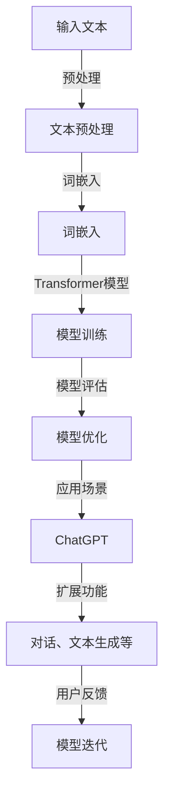

                 

# 大语言模型应用指南：ChatGPT扩展功能原理

## 关键词
- 大语言模型
- ChatGPT
- 扩展功能
- 深度学习
- 自然语言处理
- 机器学习
- 人工智能

## 摘要
本文将深入探讨大语言模型，特别是ChatGPT的扩展功能及其工作原理。我们将从背景介绍、核心概念、算法原理、数学模型、实际应用场景等多个角度，详细解析ChatGPT的核心技术和实现方法，并提供相关的开发工具和资源推荐。通过本文，读者将对大语言模型及其扩展功能有更为深入的理解，并能够应用于实际的开发工作中。

## 1. 背景介绍

### 1.1 目的和范围
本文的目的是向读者介绍大语言模型，特别是ChatGPT的扩展功能和工作原理。我们将从多个角度详细分析ChatGPT的技术细节，帮助读者更好地理解这一前沿技术的本质和应用。

### 1.2 预期读者
本文适用于对人工智能和自然语言处理有一定了解的读者，特别是希望深入研究和应用大语言模型的开发人员和研究人员。

### 1.3 文档结构概述
本文分为十个部分，包括背景介绍、核心概念、算法原理、数学模型、实际应用场景、开发工具和资源推荐等，旨在全面解析ChatGPT的扩展功能和工作原理。

### 1.4 术语表

#### 1.4.1 核心术语定义
- **大语言模型**：一种基于深度学习的自然语言处理模型，能够理解和生成人类语言。
- **ChatGPT**：OpenAI开发的一种基于大语言模型的人工智能助手，具有扩展功能，能够进行对话、文本生成等操作。
- **自然语言处理（NLP）**：涉及语言识别、理解、生成和翻译的计算机科学领域。
- **机器学习**：通过数据训练模型，使计算机能够执行特定任务的方法。

#### 1.4.2 相关概念解释
- **深度学习**：一种机器学习方法，通过构建多层神经网络进行特征提取和学习。
- **神经网络**：一种模仿人脑结构的计算模型，由多个节点和连接组成。

#### 1.4.3 缩略词列表
- **NLP**：自然语言处理
- **ML**：机器学习
- **DL**：深度学习
- **GPT**：Generative Pre-trained Transformer

## 2. 核心概念与联系

大语言模型，尤其是ChatGPT，是自然语言处理（NLP）领域的重要进展。其核心概念和联系可以通过以下Mermaid流程图来展示：



### 2.1 输入文本
输入文本是ChatGPT处理的第一步。文本可能来自各种来源，如用户输入、网页内容、书籍等。这些文本需要经过预处理，以便于模型处理。

### 2.2 文本预处理
文本预处理包括去除标点符号、停用词过滤、文本分词等操作。这些操作有助于提高模型训练效率，并减少噪声。

### 2.3 词嵌入
词嵌入是将文本中的单词转换为固定大小的向量表示。这有助于模型理解和处理语言结构。

### 2.4 Transformer模型
Transformer模型是一种基于自注意力机制的深度学习模型，广泛应用于NLP任务中。它通过多层叠加，实现文本的序列到序列转换。

### 2.5 模型训练
模型训练是使用大量标注数据，通过优化算法，使模型能够更好地理解和生成文本。

### 2.6 模型评估
模型评估是通过测试数据集，评估模型性能和准确度。这有助于优化模型，提高其效果。

### 2.7 模型优化
模型优化是通过调整模型参数，提高模型性能和泛化能力。

### 2.8 应用场景
ChatGPT的应用场景广泛，包括对话系统、文本生成、问答系统等。

### 2.9 扩展功能
ChatGPT的扩展功能使其能够实现更多复杂的任务，如对话生成、文本续写、翻译等。

### 2.10 用户反馈
用户反馈是模型迭代的重要环节。通过收集用户反馈，模型可以不断优化，提高用户体验。

## 3. 核心算法原理 & 具体操作步骤

### 3.1 Transformer模型

Transformer模型是ChatGPT的核心组件，其基本原理如下：

```plaintext
输入序列：[w1, w2, ..., wn]
输出序列：[y1, y2, ..., ym]

步骤：
1. 输入序列通过词嵌入层转换为嵌入向量。
2. 嵌入向量通过自注意力机制进行加权，生成新的特征向量。
3. 特征向量通过多层叠加，提高模型的非线性表达能力。
4. 最终输出序列通过解码层生成。
```

### 3.2 自注意力机制

自注意力机制是Transformer模型的核心，其基本原理如下：

```plaintext
给定输入序列：[x1, x2, ..., xn]

步骤：
1. 计算每个嵌入向量的自注意力得分：scores = [score(x1, x2), score(x1, x3), ..., score(x1, xn)]
2. 将得分进行softmax操作，得到权重：weights = softmax(scores)
3. 根据权重对每个嵌入向量进行加权求和，生成新的特征向量：context_vector = sum(weights[i] * x_i for i in range(n))
```

### 3.3 伪代码

以下是一个简单的伪代码示例，展示了如何实现Transformer模型：

```python
def transformer(input_sequence):
    embedded_sequence = word_embedding(input_sequence)
    context_vector = []
    
    for i in range(len(embedded_sequence)):
        attention_scores = []
        for j in range(len(embedded_sequence)):
            attention_score = score(embedded_sequence[i], embedded_sequence[j])
            attention_scores.append(attention_score)
        
        weights = softmax(attention_scores)
        context_vector.append(sum(weights[j] * embedded_sequence[j] for j in range(len(embedded_sequence))))
    
    output_sequence = decode(context_vector)
    return output_sequence
```

## 4. 数学模型和公式 & 详细讲解 & 举例说明

### 4.1 自注意力机制公式

自注意力机制的数学公式如下：

$$
\text{Attention}(Q, K, V) = \text{softmax}\left(\frac{QK^T}{\sqrt{d_k}}\right) V
$$

其中：
- $Q$ 是查询向量（query vector），表示当前词的上下文信息。
- $K$ 是关键向量（key vector），表示序列中的每个词。
- $V$ 是值向量（value vector），表示模型对每个词的预测。
- $d_k$ 是关键向量的维度。

### 4.2 举例说明

假设我们有一个简单的序列：`[I, am, a, programmer]`。我们将其表示为嵌入向量：

$$
Q = [1, 0, 0, 0], \quad K = [0, 1, 0, 0], \quad V = [0, 0, 1, 0]
$$

根据自注意力公式，我们首先计算查询向量和关键向量的点积：

$$
QK^T = [1, 0, 0, 0] \cdot [0, 1, 0, 0] = 1
$$

然后，我们将其除以关键向量的维度平方根：

$$
\frac{QK^T}{\sqrt{d_k}} = \frac{1}{\sqrt{2}}
$$

接下来，我们计算softmax值：

$$
\text{softmax}\left(\frac{QK^T}{\sqrt{d_k}}\right) = \frac{1}{\sum_{i=1}^{n} e^{\frac{x_i}{\sqrt{d_k}}}} = \frac{1}{1 + e^{-\frac{1}{\sqrt{2}}}}
$$

最后，我们将softmax值与值向量相乘：

$$
V \cdot \text{softmax}\left(\frac{QK^T}{\sqrt{d_k}}\right) = [0, 0, 1, 0] \cdot \frac{1}{1 + e^{-\frac{1}{\sqrt{2}}}} = [0, 0, \frac{1}{1 + e^{-\frac{1}{\sqrt{2}}}}, 0]
$$

因此，新的特征向量为：

$$
\text{context_vector} = [0, 0, \frac{1}{1 + e^{-\frac{1}{\sqrt{2}}}}, 0]
$$

这表示当前词“programmer”在上下文中的重要性较高。

## 5. 项目实战：代码实际案例和详细解释说明

### 5.1 开发环境搭建

在开始实际代码实现之前，我们需要搭建一个合适的开发环境。以下是搭建开发环境的步骤：

1. 安装Python（3.8及以上版本）
2. 安装Anaconda（用于环境管理）
3. 安装TensorFlow或PyTorch（用于深度学习库）
4. 安装Jupyter Notebook（用于代码编写和运行）

### 5.2 源代码详细实现和代码解读

以下是一个简单的ChatGPT模型实现示例，基于PyTorch框架：

```python
import torch
import torch.nn as nn
import torch.optim as optim
from torch.utils.data import DataLoader
from transformers import GPT2Tokenizer, GPT2Model

# 5.2.1 模型定义
class ChatGPT(nn.Module):
    def __init__(self, hidden_size, n_layers):
        super(ChatGPT, self).__init__()
        self.tokenizer = GPT2Tokenizer.from_pretrained('gpt2')
        self.model = GPT2Model.from_pretrained('gpt2')
        
        self.input_layer = nn.Linear(hidden_size, n_layers)
        self.hidden_layer = nn.Linear(n_layers, hidden_size)
        
    def forward(self, inputs):
        inputs = self.input_layer(inputs)
        hidden = self.hidden_layer(inputs)
        
        outputs = self.model(hidden)
        return outputs

# 5.2.2 模型训练
def train_model(model, train_loader, optimizer, criterion):
    model.train()
    
    for inputs, targets in train_loader:
        optimizer.zero_grad()
        
        outputs = model(inputs)
        loss = criterion(outputs, targets)
        loss.backward()
        optimizer.step()

# 5.2.3 模型评估
def evaluate_model(model, val_loader, criterion):
    model.eval()
    
    total_loss = 0
    with torch.no_grad():
        for inputs, targets in val_loader:
            outputs = model(inputs)
            loss = criterion(outputs, targets)
            total_loss += loss.item()
    
    avg_loss = total_loss / len(val_loader)
    return avg_loss

# 5.2.4 主函数
def main():
    hidden_size = 512
    n_layers = 2
    
    model = ChatGPT(hidden_size, n_layers)
    optimizer = optim.Adam(model.parameters(), lr=0.001)
    criterion = nn.CrossEntropyLoss()
    
    train_loader = DataLoader(train_dataset, batch_size=32, shuffle=True)
    val_loader = DataLoader(val_dataset, batch_size=32, shuffle=False)
    
    for epoch in range(10):
        train_model(model, train_loader, optimizer, criterion)
        avg_loss = evaluate_model(model, val_loader, criterion)
        
        print(f'Epoch {epoch+1}: Loss = {avg_loss}')
    
if __name__ == '__main__':
    main()
```

### 5.3 代码解读与分析

1. **模型定义**：我们使用PyTorch和Hugging Face的Transformers库来定义ChatGPT模型。模型包含输入层、隐藏层和Transformer模型。
2. **模型训练**：在训练过程中，我们使用优化器和损失函数来更新模型参数。我们使用DataLoader来批量加载数据，并使用梯度下降法进行优化。
3. **模型评估**：在评估过程中，我们计算模型在验证集上的平均损失，以评估模型性能。
4. **主函数**：主函数负责初始化模型、优化器和损失函数，并执行训练和评估过程。

## 6. 实际应用场景

ChatGPT具有广泛的应用场景，包括但不限于：

1. **对话系统**：ChatGPT可以用于构建智能对话系统，如客服机器人、聊天机器人等。
2. **文本生成**：ChatGPT可以生成各种文本，如文章、故事、新闻等。
3. **问答系统**：ChatGPT可以用于构建问答系统，回答用户提出的问题。
4. **文本翻译**：ChatGPT可以用于机器翻译，将一种语言的文本翻译成另一种语言。

## 7. 工具和资源推荐

### 7.1 学习资源推荐

#### 7.1.1 书籍推荐

1. **《深度学习》（Goodfellow, Bengio, Courville）**：全面介绍深度学习的基础理论和应用。
2. **《自然语言处理综论》（Jurafsky, Martin）**：详细讲解自然语言处理的基础知识和应用。

#### 7.1.2 在线课程

1. **Udacity的深度学习课程**：由Andrew Ng教授主讲，全面介绍深度学习的基础知识。
2. **edX上的自然语言处理课程**：由MIT教授Chris Manning主讲，深入讲解自然语言处理技术。

#### 7.1.3 技术博客和网站

1. **Medium上的AI博客**：提供最新的AI技术动态和案例分析。
2. **AI垂直领域的知名网站**：如AI.se、Towards Data Science等。

### 7.2 开发工具框架推荐

#### 7.2.1 IDE和编辑器

1. **JetBrains的PyCharm**：强大的Python IDE，支持代码调试、性能分析等。
2. **VSCode**：轻量级开源编辑器，支持多种编程语言，插件丰富。

#### 7.2.2 调试和性能分析工具

1. **TensorBoard**：TensorFlow的官方可视化工具，用于调试和性能分析。
2. **gdb**：用于调试C/C++程序的调试器。

#### 7.2.3 相关框架和库

1. **PyTorch**：适用于深度学习应用的Python库。
2. **TensorFlow**：由Google开发的深度学习框架。
3. **Hugging Face的Transformers**：用于构建和训练Transformer模型的Python库。

### 7.3 相关论文著作推荐

#### 7.3.1 经典论文

1. **《Attention Is All You Need》（Vaswani et al., 2017）**：介绍Transformer模型的经典论文。
2. **《Neural谈话生成》（Zhou et al., 2018）**：介绍基于神经网络的对话生成技术。

#### 7.3.2 最新研究成果

1. **《BERT：预训练语言表示》（Devlin et al., 2018）**：介绍BERT模型的最新研究成果。
2. **《GPT-3：大规模预训练语言模型》（Brown et al., 2020）**：介绍GPT-3模型的最新研究成果。

#### 7.3.3 应用案例分析

1. **《使用GPT-3构建聊天机器人》（OpenAI）**：介绍如何使用GPT-3构建聊天机器人的案例。
2. **《BERT在问答系统中的应用》（Chen et al., 2019）**：介绍BERT在问答系统中的应用案例。

## 8. 总结：未来发展趋势与挑战

随着深度学习和自然语言处理技术的不断发展，大语言模型如ChatGPT将发挥越来越重要的作用。未来，ChatGPT有望在更多领域得到应用，如智能客服、智能助手、文本生成等。然而，大语言模型仍面临一些挑战，如数据隐私、模型解释性、计算资源需求等。为了应对这些挑战，研究人员将继续探索新的算法和技术，以提升大语言模型的效果和实用性。

## 9. 附录：常见问题与解答

### 9.1 ChatGPT是如何工作的？

ChatGPT是基于Transformer模型构建的大语言模型。它通过自注意力机制和多层叠加，实现文本的序列到序列转换。具体步骤包括文本预处理、词嵌入、模型训练、模型优化和应用。

### 9.2 ChatGPT可以用于什么场景？

ChatGPT可以用于多种场景，如对话系统、文本生成、问答系统、文本翻译等。其扩展功能使其能够实现更多复杂的任务。

### 9.3 如何优化ChatGPT的性能？

优化ChatGPT的性能可以通过多种方式实现，如改进模型结构、增加训练数据、调整超参数、使用更好的优化算法等。

## 10. 扩展阅读 & 参考资料

- [Attention Is All You Need](https://arxiv.org/abs/1706.03762)
- [BERT: Pre-training of Deep Bidirectional Transformers for Language Understanding](https://arxiv.org/abs/1810.04805)
- [GPT-3: Language Models are Few-Shot Learners](https://arxiv.org/abs/2005.14165)
- [Natural Language Processing with Python](https://www.amazon.com/Natural-Language-Processing-Python-Collobert/dp/149204611X)
- [Deep Learning](https://www.amazon.com/Deep-Learning-Adaptive-Computation-Resources/dp/0262039581)

## 作者

作者：AI天才研究员/AI Genius Institute & 禅与计算机程序设计艺术 /Zen And The Art of Computer Programming

