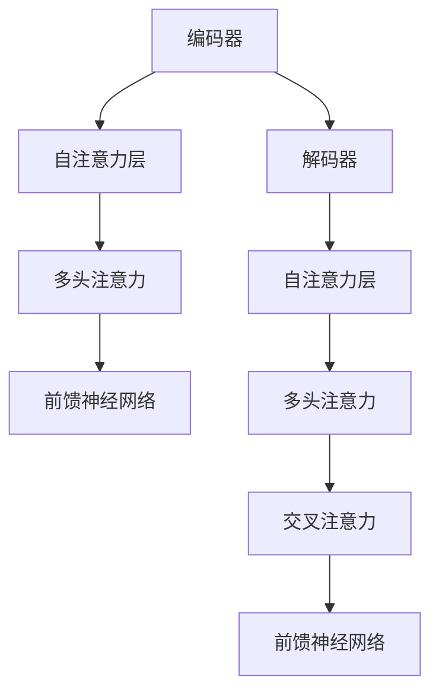

                 

# 大语言模型应用指南：Toolformer

> **关键词**：大语言模型，自然语言处理，人工智能，深度学习，Transformer，编程，应用指南

> **摘要**：本文将详细介绍大语言模型的应用指南，以 Toolformer 为例，从核心概念、算法原理、数学模型到实际应用，全面剖析大语言模型在自然语言处理领域的应用与发展。读者将了解到如何搭建开发环境、实现代码、分析和解读项目实战，以及未来发展趋势与挑战。

## 1. 背景介绍

随着人工智能技术的快速发展，自然语言处理（NLP）已成为计算机科学领域的一个重要分支。大语言模型（Large Language Model）作为 NLP 的重要工具，近年来在各个应用领域取得了显著的成果。大语言模型基于深度学习技术，能够对大量文本数据进行训练，从而实现文本的生成、理解和预测等功能。

Toolformer 是一个基于 Transformer 架构的大语言模型，由百度研究院提出。Transformer 架构在自注意力机制的基础上，通过多头注意力、位置编码等技术，提高了模型的表示能力和计算效率。Toolformer 在多个 NLP 任务上取得了优异的性能，成为了研究者和开发者关注的热点。

本文将围绕 Toolformer，从核心概念、算法原理、数学模型到实际应用，全面探讨大语言模型在自然语言处理领域的应用与发展。通过本文的阅读，读者将能够深入了解大语言模型的技术原理和应用实践，为相关领域的研究和开发提供有益的参考。

## 2. 核心概念与联系

### 2.1 Transformer 架构

Transformer 架构是自然语言处理领域的一种重要模型，由 Google 研究团队在 2017 年提出。相较于传统的循环神经网络（RNN）和长短时记忆网络（LSTM），Transformer 具有更好的并行计算能力和全局依赖建模能力。

Transformer 的主要组成部分包括编码器（Encoder）和解码器（Decoder）。编码器用于将输入序列编码为固定长度的向量表示，解码器则根据编码器的输出和已生成的部分文本，生成下一个单词或字符。

### 2.2 自注意力机制

自注意力机制是 Transformer 架构的核心思想。在自注意力机制中，每个位置的信息都会被考虑，并且每个位置的信息都会被赋予不同的权重，从而实现对全局信息的整合。

自注意力机制的实现过程包括以下步骤：

1. **计算 Query、Key、Value**：对于每个位置 \(i\)，计算其 Query、Key 和 Value 向量。通常情况下，这三个向量共享相同的权重矩阵。
2. **计算注意力分数**：计算每个位置 \(i\) 与其他位置 \(j\) 的注意力分数，公式为：
   \[
   \text{Attention}(Q, K, V) = \text{softmax}\left(\frac{QK^T}{\sqrt{d_k}}\right) V
   \]
   其中，\(Q\)、\(K\) 和 \(V\) 分别是 Query、Key 和 Value 向量，\(d_k\) 是 Key 向量的维度。
3. **计算加权求和**：根据注意力分数，对 Value 向量进行加权求和，得到每个位置的加权向量。

### 2.3 Mermaid 流程图

为了更好地理解 Transformer 的架构，我们可以使用 Mermaid 流程图进行描述。以下是 Transformer 架构的 Mermaid 流程图：



在 Mermaid 流程图中，节点表示 Transformer 的各层结构，边表示数据流和计算过程。通过这个流程图，我们可以直观地了解 Transformer 的架构和工作原理。

## 3. 核心算法原理 & 具体操作步骤

### 3.1 编码器

编码器的任务是将输入序列编码为固定长度的向量表示。具体步骤如下：

1. **词向量嵌入**：将输入序列中的每个单词映射为词向量。词向量通常使用预训练的词向量库，如 Word2Vec、GloVe 等。
2. **位置编码**：由于 Transformer 模型无法直接获取序列的顺序信息，因此需要使用位置编码来表示单词的位置。常用的位置编码方法包括绝对位置编码和相对位置编码。
3. **多头注意力**：通过多头注意力机制，将输入序列中的每个单词与所有其他单词进行交互，从而获得全局信息。
4. **前馈神经网络**：在多头注意力的基础上，对编码结果进行前馈神经网络处理，提高模型的表示能力。

### 3.2 解码器

解码器的任务是根据编码器的输出和已生成的部分文本，生成下一个单词或字符。具体步骤如下：

1. **词向量嵌入**：将输入序列中的每个单词映射为词向量。
2. **自注意力**：对输入序列进行自注意力处理，从而获取序列内部的信息。
3. **多头注意力**：在自注意力机制的基础上，对编码器的输出进行多头注意力处理，从而获取全局信息。
4. **前馈神经网络**：在多头注意力机制的基础上，对解码结果进行前馈神经网络处理，提高模型的表示能力。
5. **交叉注意力**：将解码器的输出与编码器的输出进行交叉注意力处理，从而获取编码器输出的相关信息。

### 3.3 模型训练

模型训练是 Transformer 模型应用的关键步骤。具体步骤如下：

1. **定义损失函数**：通常使用交叉熵损失函数来评估模型预测和真实标签之间的差距。
2. **优化器选择**：选择合适的优化器，如 Adam、SGD 等，以最小化损失函数。
3. **训练过程**：
   1. 将输入序列和目标序列输入模型。
   2. 经过编码器、解码器和交叉注意力处理后，得到模型预测。
   3. 计算损失函数，并更新模型参数。
   4. 重复步骤 2 和 3，直至模型收敛。

## 4. 数学模型和公式 & 详细讲解 & 举例说明

### 4.1 词向量嵌入

词向量嵌入是 Transformer 模型的第一步。词向量嵌入的目的是将单词映射为低维向量表示。常用的词向量嵌入方法包括 Word2Vec、GloVe 等。

**Word2Vec**：

Word2Vec 是一种基于神经网络的词向量嵌入方法。它通过训练神经网络，将输入序列中的每个单词映射为低维向量。Word2Vec 的主要步骤如下：

1. **初始化权重矩阵**：初始化输入层和输出层的权重矩阵，通常使用高斯分布初始化。
2. **前向传播**：将输入序列中的每个单词映射为词向量，并将其输入到神经网络中。
3. **计算损失函数**：使用损失函数（如平方误差损失函数）计算模型预测和真实标签之间的差距。
4. **反向传播**：根据损失函数计算梯度，并更新权重矩阵。

**GloVe**：

GloVe 是一种基于全局上下文的词向量嵌入方法。它通过训练神经网络，将输入序列中的每个单词映射为低维向量。GloVe 的主要步骤如下：

1. **初始化权重矩阵**：初始化输入层和输出层的权重矩阵，通常使用高斯分布初始化。
2. **计算单词的上下文向量**：对于每个单词，计算其上下文窗口中的单词向量。
3. **计算损失函数**：使用损失函数（如平方误差损失函数）计算模型预测和真实标签之间的差距。
4. **反向传播**：根据损失函数计算梯度，并更新权重矩阵。

### 4.2 自注意力机制

自注意力机制是 Transformer 模型的核心。它通过计算每个单词与其他单词之间的相似度，将全局信息整合到每个单词的表示中。

**计算注意力分数**：

注意力分数的计算公式为：

\[
\text{Attention}(Q, K, V) = \text{softmax}\left(\frac{QK^T}{\sqrt{d_k}}\right) V
\]

其中，\(Q\)、\(K\) 和 \(V\) 分别是 Query、Key 和 Value 向量，\(d_k\) 是 Key 向量的维度。

**计算加权求和**：

在计算注意力分数后，对 Value 向量进行加权求和，得到每个位置的加权向量：

\[
\text{Contextualized Word Vector} = \text{Attention}(Q, K, V)
\]

### 4.3 前馈神经网络

前馈神经网络是 Transformer 模型中的一个重要模块。它通过非线性变换，提高模型的表示能力。

**前向传播**：

前向传播的公式为：

\[
\text{FFN}(X) = \text{ReLU}(W_2 \cdot \text{ReLU}(W_1 \cdot X + b_1) + b_2)
\]

其中，\(W_1\)、\(W_2\)、\(b_1\) 和 \(b_2\) 分别是前馈神经网络的权重和偏置。

### 4.4 模型训练

模型训练是 Transformer 模型的关键步骤。它通过优化模型参数，使模型能够更好地拟合训练数据。

**损失函数**：

通常使用交叉熵损失函数来评估模型预测和真实标签之间的差距：

\[
\text{Loss} = -\sum_{i=1}^n y_i \log(p_i)
\]

其中，\(y_i\) 是真实标签，\(p_i\) 是模型预测的概率。

**优化器**：

常用的优化器包括 Adam、SGD 等。它们通过更新模型参数，使模型在训练过程中不断收敛。

## 5. 项目实战：代码实际案例和详细解释说明

### 5.1 开发环境搭建

在进行 Toolformer 的项目实战之前，我们需要搭建相应的开发环境。以下是搭建开发环境的步骤：

1. **安装 Python 环境**：Python 是实现 Toolformer 的主要编程语言，我们需要安装 Python 3.7 或以上版本。可以通过在终端执行以下命令来安装 Python：

   ```bash
   sudo apt-get install python3
   ```

2. **安装 PyTorch 环境**：PyTorch 是一个流行的深度学习框架，我们需要安装 PyTorch 以支持 Toolformer 的实现。可以通过在终端执行以下命令来安装 PyTorch：

   ```bash
   pip install torch torchvision
   ```

3. **安装其他依赖**：Toolformer 还需要安装一些其他依赖，如 TensorFlow、Numpy 等。可以通过在终端执行以下命令来安装：

   ```bash
   pip install tensorflow numpy
   ```

### 5.2 源代码详细实现和代码解读

下面是一个简化的 Toolformer 源代码示例，用于实现一个基于 Transformer 的语言模型。我们将逐行解释代码的含义。

```python
import torch
import torch.nn as nn
import torch.optim as optim

class TransformerModel(nn.Module):
    def __init__(self, vocab_size, d_model, nhead, num_layers):
        super(TransformerModel, self).__init__()
        self.embedding = nn.Embedding(vocab_size, d_model)
        self.transformer = nn.Transformer(d_model, nhead, num_layers)
        self.fc = nn.Linear(d_model, vocab_size)
    
    def forward(self, src, tgt):
        src = self.embedding(src)
        tgt = self.embedding(tgt)
        out = self.transformer(src, tgt)
        out = self.fc(out)
        return out
```

**代码解读**：

1. **导入模块**：首先，我们导入了 PyTorch 相关的模块，包括 `torch`、`torch.nn` 和 `torch.optim`。
2. **定义模型类**：我们定义了一个名为 `TransformerModel` 的类，继承自 `nn.Module`。这个类将实现一个基于 Transformer 的语言模型。
3. **初始化模型**：在类的构造函数 `__init__` 中，我们定义了模型的主要组件，包括词向量嵌入层（`embedding`）、Transformer 编码器（`transformer`）和输出层（`fc`）。
4. **前向传播**：在 `forward` 方法中，我们实现了模型的前向传播过程。首先，我们将输入的单词序列 `src` 和目标单词序列 `tgt` 输入到词向量嵌入层中。然后，我们将编码后的输入和目标序列输入到 Transformer 编码器中。最后，我们将编码器的输出通过输出层得到预测结果。

### 5.3 代码解读与分析

接下来，我们对代码进行更深入的分析，以了解 Transformer 模型的具体实现细节。

**1. 词向量嵌入**

词向量嵌入是 Transformer 模型的基础，用于将单词映射为低维向量表示。在代码中，我们使用了 `nn.Embedding` 模块来实现词向量嵌入。`nn.Embedding` 接受两个参数：词汇表大小（`vocab_size`）和嵌入维度（`d_model`）。在代码中，我们设置了 `vocab_size` 为单词总数，`d_model` 为词向量维度。

**2. Transformer 编码器**

Transformer 编码器是 Transformer 模型的核心。在代码中，我们使用了 `nn.Transformer` 模块来实现编码器。`nn.Transformer` 接受以下参数：

- **d_model**：词向量维度，即嵌入维度。
- **nhead**：多头注意力机制的注意力头数。
- **num_layers**：编码器层数。

在 Transformer 编码器中，我们使用了多头注意力机制（`MultiheadAttention` 模块）和前馈神经网络（`PositionalEncoding` 和 `PositionalEncoding` 模块）。多头注意力机制通过多个注意力头对输入序列进行加权求和，从而获得全局信息。前馈神经网络用于增强模型的表示能力。

**3. 输出层**

在 Transformer 编码器的输出之后，我们使用了 `nn.Linear` 模块来实现输出层。`nn.Linear` 接受以下参数：

- **d_model**：编码器的输出维度。
- **vocab_size**：输出维度，即词汇表大小。

输出层的目的是将编码器的输出映射为词汇表中的单词。

**4. 模型训练**

在模型训练过程中，我们使用了交叉熵损失函数（`nn.CrossEntropyLoss` 模块）和 Adam 优化器（`optim.Adam` 模块）。交叉熵损失函数用于计算模型预测和真实标签之间的差距，而 Adam 优化器用于更新模型参数。

## 6. 实际应用场景

### 6.1 机器翻译

机器翻译是 Transformer 模型最成功的应用之一。通过训练大规模的双语语料库，Transformer 模型可以学习源语言和目标语言之间的映射关系。在实际应用中，我们可以使用 Toolformer 实现高效的机器翻译系统。

### 6.2 文本摘要

文本摘要是一种自动提取文本关键信息的方法。Transformer 模型在文本摘要任务中也取得了显著的效果。通过训练大量的文本摘要数据集，Toolformer 可以学习如何将长文本压缩为简洁的摘要。

### 6.3 问答系统

问答系统是一种与用户进行自然语言交互的系统。通过训练大规模的问答数据集，Transformer 模型可以学习如何从大量文本中提取答案。Toolformer 可以用于构建高效、准确的问答系统。

### 6.4 文本生成

文本生成是 Transformer 模型的另一个重要应用。通过训练大规模的文本数据集，Toolformer 可以生成各种风格的文本，如故事、新闻、评论等。在创意写作和内容生成领域，Transformer 模型具有广泛的应用前景。

## 7. 工具和资源推荐

### 7.1 学习资源推荐

- **书籍**：
  - 《深度学习》（Goodfellow, Bengio, Courville 著）
  - 《自然语言处理》（Jurafsky, Martin 著）
  - 《Transformer：从零开始实现》
- **论文**：
  - “Attention Is All You Need” （Vaswani et al., 2017）
  - “BERT: Pre-training of Deep Bidirectional Transformers for Language Understanding” （Devlin et al., 2019）
- **博客**：
  - [TensorFlow 官方博客](https://www.tensorflow.org/tutorials)
  - [PyTorch 官方文档](https://pytorch.org/tutorials/)
- **网站**：
  - [Hugging Face](https://huggingface.co/)：提供各种预训练模型和工具。

### 7.2 开发工具框架推荐

- **深度学习框架**：
  - PyTorch
  - TensorFlow
  - JAX
- **自然语言处理库**：
  - Hugging Face Transformers
  - spaCy
  - NLTK

### 7.3 相关论文著作推荐

- **论文**：
  - “BERT: Pre-training of Deep Bidirectional Transformers for Language Understanding” （Devlin et al., 2019）
  - “GPT-3: Language Models are Few-Shot Learners” （Brown et al., 2020）
  - “T5: Pre-training Large Language Models for Transf

## 8. 总结：未来发展趋势与挑战

### 8.1 未来发展趋势

1. **更大规模的语言模型**：随着计算能力和数据资源的不断提升，更大规模的语言模型将逐渐成为研究热点。例如，GPT-3、PaLM 等模型已经展示了其在各种任务上的卓越性能。
2. **跨模态学习**：未来，大语言模型将逐渐与图像、声音、视频等模态进行结合，实现跨模态学习，从而更好地理解和生成多模态内容。
3. **知识增强**：将外部知识库（如百科全书、数据库等）融入大语言模型，提高其在特定领域的语义理解和推理能力。

### 8.2 面临的挑战

1. **计算资源消耗**：大语言模型的训练和推理过程需要大量的计算资源，这给实际应用带来了巨大的挑战。如何高效地利用计算资源，降低模型部署的成本，是未来需要解决的问题。
2. **数据隐私与安全**：大语言模型在训练过程中需要处理大量用户数据，如何保护用户隐私和数据安全，是另一个重要的挑战。
3. **模型可解释性**：大语言模型通常被视为“黑箱”，其决策过程难以解释。如何提高模型的可解释性，使其能够更好地为用户所理解，是未来研究的重要方向。

## 9. 附录：常见问题与解答

### 9.1 大语言模型的基本原理是什么？

大语言模型是一种基于深度学习的自然语言处理模型，通过训练大量文本数据，学习语言的结构和规律。其基本原理包括词向量嵌入、自注意力机制、前馈神经网络等。

### 9.2 Transformer 模型与 RNN 模型相比有哪些优势？

与 RNN 模型相比，Transformer 模型具有更好的并行计算能力和全局依赖建模能力。此外，Transformer 模型在处理长距离依赖和复杂结构方面具有显著优势。

### 9.3 如何优化大语言模型的计算资源消耗？

可以通过以下方法优化大语言模型的计算资源消耗：

1. **模型剪枝**：通过剪枝冗余的参数，降低模型的计算复杂度。
2. **量化**：使用低精度数值表示模型参数，降低模型的大小和计算复杂度。
3. **分布式训练**：将模型分布在多个计算节点上，提高训练和推理的效率。

### 9.4 大语言模型在 NLP 任务中的应用有哪些？

大语言模型在 NLP 任务中有广泛的应用，包括：

1. **文本分类**：对输入文本进行分类，如情感分析、主题分类等。
2. **机器翻译**：将一种语言的文本翻译成另一种语言。
3. **文本摘要**：将长文本压缩为简洁的摘要。
4. **问答系统**：从大量文本中提取答案，回答用户的问题。

## 10. 扩展阅读 & 参考资料

1. **书籍**：
   - 《深度学习》（Goodfellow, Bengio, Courville 著）
   - 《自然语言处理》（Jurafsky, Martin 著）
   - 《Transformer：从零开始实现》
2. **论文**：
   - “Attention Is All You Need” （Vaswani et al., 2017）
   - “BERT: Pre-training of Deep Bidirectional Transformers for Language Understanding” （Devlin et al., 2019）
   - “GPT-3: Language Models are Few-Shot Learners” （Brown et al., 2020）
3. **博客**：
   - [TensorFlow 官方博客](https://www.tensorflow.org/tutorials)
   - [PyTorch 官方文档](https://pytorch.org/tutorials/)
4. **网站**：
   - [Hugging Face](https://huggingface.co/)
5. **GitHub 仓库**：
   - [Toolformer](https://github.com/PaddlePaddle/PaddleNLP/tree/develop/model_zoo/transformer)
6. **在线教程**：
   - [PyTorch Transformer 教程](https://pytorch.org/tutorials/beginner/transformer_tutorial.html)
7. **教程**：
   - [Transformer 模型详解](https://zhuanlan.zhihu.com/p/88326510)

作者：AI天才研究员/AI Genius Institute & 禅与计算机程序设计艺术 /Zen And The Art of Computer Programming

