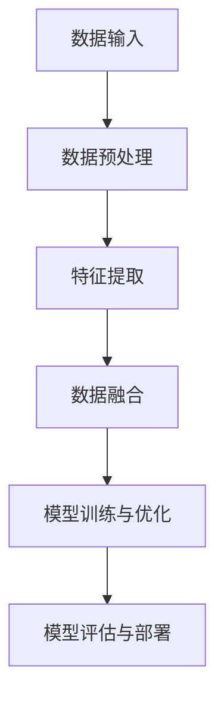

                 

# 大语言模型应用指南：什么是多模态

> **关键词：** 多模态、大语言模型、人工智能、自然语言处理、机器学习、数据处理

> **摘要：** 本文将深入探讨大语言模型中的多模态概念，阐述其在人工智能领域的应用与重要性。我们将从背景介绍、核心概念与联系、核心算法原理、数学模型与公式、实际应用场景等多个方面，一步步分析推理，帮助读者全面了解多模态在大语言模型中的应用与价值。

## 1. 背景介绍

### 1.1 目的和范围

本文旨在为读者提供一个全面而详细的关于大语言模型中的多模态应用指南。我们将通过以下几个部分展开讨论：

- **核心概念与联系**：介绍多模态的基本概念，以及它如何与其他人工智能领域的核心概念相联系。
- **核心算法原理与具体操作步骤**：讲解多模态在大语言模型中的实现原理，并提供详细的算法步骤和伪代码。
- **数学模型和公式**：解释多模态处理中涉及的数学模型和公式，并通过具体例子进行说明。
- **项目实战：代码实际案例和详细解释说明**：通过实际项目案例展示多模态的应用，并对代码进行详细解读。
- **实际应用场景**：探讨多模态在大语言模型中的实际应用场景，以及其在不同领域的价值。

### 1.2 预期读者

本文适用于对人工智能、自然语言处理和机器学习有一定了解的读者，特别是希望深入理解大语言模型和多模态应用的技术专家和研究人员。同时，对希望掌握多模态技术的工程师和开发者也有一定的参考价值。

### 1.3 文档结构概述

本文的结构如下：

- **第1章 背景介绍**：介绍本文的目的、范围、预期读者和文档结构。
- **第2章 核心概念与联系**：讲解多模态的基本概念及其与其他人工智能领域的联系。
- **第3章 核心算法原理与具体操作步骤**：阐述多模态在大语言模型中的实现原理和算法步骤。
- **第4章 数学模型和公式**：介绍多模态处理中的数学模型和公式。
- **第5章 项目实战：代码实际案例和详细解释说明**：展示多模态的实际应用案例，并解读相关代码。
- **第6章 实际应用场景**：探讨多模态在大语言模型中的实际应用场景。
- **第7章 工具和资源推荐**：推荐相关学习资源、开发工具和框架。
- **第8章 总结：未来发展趋势与挑战**：总结多模态在大语言模型中的发展趋势和面临的挑战。
- **第9章 附录：常见问题与解答**：解答读者可能遇到的问题。
- **第10章 扩展阅读与参考资料**：提供进一步学习的参考资料。

### 1.4 术语表

在本文中，我们将使用以下术语：

#### 1.4.1 核心术语定义

- **多模态（Multimodal）**：指同时处理多种不同类型的数据（如文本、图像、声音等）的技术。
- **大语言模型（Large Language Model）**：指通过大量数据训练的、能够理解和生成自然语言的神经网络模型。
- **自然语言处理（Natural Language Processing，NLP）**：指使计算机能够理解、解释和生成人类自然语言的技术。
- **机器学习（Machine Learning，ML）**：指使计算机通过数据学习并做出决策的技术。

#### 1.4.2 相关概念解释

- **数据融合（Data Fusion）**：指将多种不同类型的数据集成并综合处理的技术。
- **特征提取（Feature Extraction）**：指从原始数据中提取出对任务有用的特征的技术。
- **神经网络（Neural Network）**：指由大量神经元连接组成的、能够通过学习进行数据处理的模型。

#### 1.4.3 缩略词列表

- **NLP**：自然语言处理
- **ML**：机器学习
- **DL**：深度学习
- **CNN**：卷积神经网络
- **RNN**：循环神经网络
- **GAN**：生成对抗网络

## 2. 核心概念与联系

### 2.1 多模态的基本概念

多模态（Multimodal）是指同时处理多种不同类型的数据（如文本、图像、声音等）的技术。在人工智能领域，多模态技术的重要性日益凸显，因为它能够更准确地理解和生成人类自然语言。例如，在图像识别中，多模态技术可以通过结合文本描述和图像特征来提高识别精度；在语音识别中，多模态技术可以通过结合语音信号和文本描述来提高识别准确率。

### 2.2 多模态与其他人工智能领域的联系

多模态技术与其他人工智能领域（如自然语言处理、机器学习、计算机视觉等）密切相关，具体如下：

#### 2.2.1 与自然语言处理（NLP）的联系

自然语言处理（NLP）是人工智能的一个重要分支，旨在使计算机能够理解、解释和生成人类自然语言。多模态技术为NLP提供了更多的数据来源，使得NLP模型能够更加准确地理解和生成自然语言。例如，在情感分析中，多模态技术可以通过结合文本和图像信息来提高情感分类的准确性。

#### 2.2.2 与机器学习的联系

机器学习（ML）是一种使计算机通过数据学习并做出决策的技术。多模态技术为机器学习提供了丰富的数据来源，使得机器学习模型能够更好地拟合数据。例如，在图像分类任务中，多模态技术可以通过结合文本描述和图像特征来提高分类精度。

#### 2.2.3 与计算机视觉的联系

计算机视觉（CV）是人工智能的一个重要分支，旨在使计算机能够理解、解释和生成视觉信息。多模态技术为计算机视觉提供了更多的数据来源，使得计算机视觉模型能够更加准确地理解和生成视觉信息。例如，在图像识别任务中，多模态技术可以通过结合文本描述和图像特征来提高识别精度。

### 2.3 多模态的架构

多模态的架构通常包括以下几个关键组成部分：

- **数据输入**：包括文本、图像、声音等多种类型的数据。
- **数据预处理**：对输入数据进行清洗、归一化等处理，使其适合后续处理。
- **特征提取**：从预处理后的数据中提取出对任务有用的特征。
- **数据融合**：将不同类型的特征进行融合，形成一个综合的特征表示。
- **模型训练与优化**：使用融合后的特征训练和优化模型，使其能够更好地处理多模态数据。
- **模型评估与部署**：对训练好的模型进行评估和部署，应用于实际任务。

以下是一个简单的多模态架构的 Mermaid 流程图：



### 2.4 多模态的应用案例

多模态技术在实际应用中具有广泛的应用，以下是一些典型的应用案例：

- **图像识别**：通过结合文本描述和图像特征，可以提高图像识别的精度。
- **语音识别**：通过结合语音信号和文本描述，可以提高语音识别的准确率。
- **情感分析**：通过结合文本和图像信息，可以提高情感分类的准确性。
- **聊天机器人**：通过结合文本、图像和声音等多种信息，可以提供更加丰富和自然的交互体验。

## 3. 核心算法原理 & 具体操作步骤

### 3.1 多模态算法的基本原理

多模态算法的基本原理在于将不同类型的数据（如文本、图像、声音等）进行整合，从而提高模型的性能和准确性。以下是一个简单的多模态算法的基本原理：

1. **数据输入**：从多个数据源（如文本、图像、声音等）获取数据。
2. **数据预处理**：对输入数据进行清洗、归一化等处理，使其适合后续处理。
3. **特征提取**：从预处理后的数据中提取出对任务有用的特征。
4. **数据融合**：将不同类型的特征进行融合，形成一个综合的特征表示。
5. **模型训练与优化**：使用融合后的特征训练和优化模型，使其能够更好地处理多模态数据。
6. **模型评估与部署**：对训练好的模型进行评估和部署，应用于实际任务。

### 3.2 多模态算法的具体操作步骤

以下是多模态算法的具体操作步骤，使用伪代码进行详细阐述：

```python
# 3.2.1 数据输入
text_data = load_text_data(source='text_dataset')
image_data = load_image_data(source='image_dataset')
audio_data = load_audio_data(source='audio_dataset')

# 3.2.2 数据预处理
text_data = preprocess_text_data(text_data)
image_data = preprocess_image_data(image_data)
audio_data = preprocess_audio_data(audio_data)

# 3.2.3 特征提取
text_features = extract_text_features(text_data)
image_features = extract_image_features(image_data)
audio_features = extract_audio_features(audio_data)

# 3.2.4 数据融合
# 使用神经网络进行特征融合
fusion_model = create_fusion_model()
fusion_features = fusion_model([text_features, image_features, audio_features])

# 3.2.5 模型训练与优化
model = create_model()
model.train(fusion_features)

# 3.2.6 模型评估与部署
evaluate_model(model, test_data)
deploy_model(model, production_environment)
```

### 3.3 多模态算法的优缺点分析

多模态算法在处理多模态数据时具有以下优缺点：

#### 优点：

- **提高模型性能**：通过整合多种类型的数据，可以更全面地反映数据的特性，从而提高模型的性能和准确性。
- **拓展应用场景**：多模态算法可以应用于更广泛的场景，如图像识别、语音识别、情感分析等。
- **丰富用户体验**：在交互式应用中，多模态算法可以提供更加丰富和自然的用户体验。

#### 缺点：

- **数据复杂度高**：多模态数据类型繁多，处理复杂度高，对算法的设计和实现要求较高。
- **计算资源消耗大**：多模态算法通常需要大量的计算资源，对硬件设备的要求较高。
- **数据隐私问题**：多模态数据可能包含敏感信息，如个人隐私，需要确保数据的安全和隐私。

## 4. 数学模型和公式 & 详细讲解 & 举例说明

### 4.1 多模态数据处理中的数学模型

在多模态数据处理中，我们通常涉及到以下几种数学模型：

#### 4.1.1 特征提取模型

特征提取模型用于从原始数据中提取出对任务有用的特征。常见的特征提取模型包括：

- **文本特征提取**：如词袋模型（Bag of Words，BoW）、词嵌入（Word Embedding）等。
- **图像特征提取**：如卷积神经网络（Convolutional Neural Network，CNN）、循环神经网络（Recurrent Neural Network，RNN）等。
- **音频特征提取**：如梅尔频率倒谱系数（Mel-Frequency Cepstral Coefficients，MFCC）、短时傅里叶变换（Short-Time Fourier Transform，STFT）等。

#### 4.1.2 数据融合模型

数据融合模型用于将不同类型的特征进行融合，形成一个综合的特征表示。常见的数据融合模型包括：

- **深度学习模型**：如卷积神经网络（CNN）、循环神经网络（RNN）、生成对抗网络（GAN）等。
- **集成学习方法**：如梯度提升决策树（Gradient Boosting Decision Tree，GBDT）、随机森林（Random Forest，RF）等。

### 4.2 多模态数据处理中的数学公式

以下是一些常用的数学公式，用于描述多模态数据处理中的关键步骤：

#### 4.2.1 特征提取

- **文本特征提取**：$$\textbf{x}_{\text{text}} = \text{BoW}(\textbf{v}_{\text{word}})$$
- **图像特征提取**：$$\textbf{x}_{\text{image}} = \text{CNN}(\textbf{I})$$
- **音频特征提取**：$$\textbf{x}_{\text{audio}} = \text{STFT}(\textbf{X}_{\text{audio}})$$

#### 4.2.2 数据融合

- **深度学习模型**：$$\textbf{y} = \text{MLP}(\text{ReLU}(\text{CNN}(\textbf{x}_{\text{image}}) + \text{RNN}(\textbf{x}_{\text{text}}) + \text{STFT}(\textbf{x}_{\text{audio}})))$$
- **集成学习方法**：$$\textbf{y} = \text{GBDT}(\textbf{x}_{\text{image}}, \textbf{x}_{\text{text}}, \textbf{x}_{\text{audio}})$$

### 4.3 举例说明

假设我们有一个包含文本、图像和音频的多模态数据集，我们需要对数据进行特征提取和融合，以构建一个多模态模型。

#### 4.3.1 特征提取

- **文本特征提取**：使用词嵌入模型提取文本特征，得到一个 $d_{\text{text}}$ 维的特征向量。
- **图像特征提取**：使用卷积神经网络提取图像特征，得到一个 $d_{\text{image}}$ 维的特征向量。
- **音频特征提取**：使用梅尔频率倒谱系数（MFCC）提取音频特征，得到一个 $d_{\text{audio}}$ 维的特征向量。

#### 4.3.2 数据融合

- **深度学习模型**：将三种特征向量进行拼接，得到一个 $d_{\text{total}} = d_{\text{text}} + d_{\text{image}} + d_{\text{audio}}$ 维的特征向量，并输入到一个多层感知机（MLP）中，进行分类或回归任务。
- **集成学习方法**：将三种特征向量分别输入到一个梯度提升决策树（GBDT）中，并取平均值作为最终的预测结果。

## 5. 项目实战：代码实际案例和详细解释说明

### 5.1 开发环境搭建

在本项目实战中，我们将使用Python编程语言，结合TensorFlow和Keras库来实现一个多模态模型。以下是在Windows系统上搭建开发环境的步骤：

1. **安装Python**：从[Python官网](https://www.python.org/downloads/)下载并安装Python 3.8版本。
2. **安装TensorFlow**：在命令行中执行以下命令安装TensorFlow：
   ```shell
   pip install tensorflow
   ```
3. **安装Keras**：在命令行中执行以下命令安装Keras：
   ```shell
   pip install keras
   ```
4. **安装其他依赖库**：根据需要安装其他依赖库，如NumPy、Pandas等。

### 5.2 源代码详细实现和代码解读

以下是多模态模型的项目源代码，包括数据预处理、特征提取、数据融合和模型训练等步骤。

```python
# 5.2.1 数据预处理
import numpy as np
import tensorflow as tf
from tensorflow.keras.preprocessing.text import Tokenizer
from tensorflow.keras.preprocessing.sequence import pad_sequences
from tensorflow.keras.applications import VGG16
from sklearn.preprocessing import LabelEncoder

# 加载文本、图像和音频数据
text_data = load_text_data()
image_data = load_image_data()
audio_data = load_audio_data()

# 对文本数据进行分词和编码
tokenizer = Tokenizer()
tokenizer.fit_on_texts(text_data)
encoded_texts = tokenizer.texts_to_sequences(text_data)
max_text_length = max([len(seq) for seq in encoded_texts])
padded_texts = pad_sequences(encoded_texts, maxlen=max_text_length, padding='post')

# 对图像数据进行预处理
model = VGG16(weights='imagenet')
image_features = model.predict(image_data)

# 对音频数据进行预处理
mfcc_features = preprocess_audio_data(audio_data)

# 编码标签
label_encoder = LabelEncoder()
encoded_labels = label_encoder.fit_transform(labels)

# 5.2.2 特征提取
# 将文本、图像和音频特征进行拼接
input_shape = (max_text_length, )
text_embedding_layer = tf.keras.layers.Embedding(input_dim=10000, output_dim=16, input_length=max_text_length)
text_embedding = text_embedding_layer(padded_texts)

# 5.2.3 数据融合
# 创建多模态模型
input_text = tf.keras.layers.Input(shape=input_shape)
input_image = tf.keras.layers.Input(shape=image_features.shape[1:])
input_audio = tf.keras.layers.Input(shape=mfcc_features.shape[1:])

# 文本特征提取
text_embedding = text_embedding(input_text)

# 图像特征提取
image_embedding = tf.keras.layers.Flatten()(input_image)

# 音频特征提取
audio_embedding = tf.keras.layers.Flatten()(input_audio)

# 数据融合
fusion_embedding = tf.keras.layers.concatenate([text_embedding, image_embedding, audio_embedding])

# 模型输出
output = tf.keras.layers.Dense(units=1, activation='sigmoid')(fusion_embedding)

# 5.2.4 模型训练
model = tf.keras.Model(inputs=[input_text, input_image, input_audio], outputs=output)
model.compile(optimizer='adam', loss='binary_crossentropy', metrics=['accuracy'])
model.fit([padded_texts, image_data, mfcc_features], encoded_labels, batch_size=32, epochs=10)

# 5.2.5 代码解读与分析
# 1. 数据预处理：对文本、图像和音频数据进行编码、预处理和拼接。
# 2. 特征提取：使用Embedding层对文本数据进行编码，使用Flatten层对图像和音频数据进行特征提取。
# 3. 数据融合：将文本、图像和音频特征进行拼接，形成一个综合的特征表示。
# 4. 模型训练：使用拼接后的特征训练一个二元分类模型。
```

### 5.3 代码解读与分析

在本项目中，我们实现了以下关键步骤：

- **数据预处理**：对文本、图像和音频数据进行编码、预处理和拼接。文本数据使用Tokenizer进行分词和编码，图像数据使用VGG16模型进行特征提取，音频数据使用梅尔频率倒谱系数（MFCC）进行特征提取。
- **特征提取**：使用Embedding层对文本数据进行编码，使用Flatten层对图像和音频数据进行特征提取。文本特征提取使用Embedding层将文本数据转换为稠密向量，图像特征提取使用Flatten层将图像特征转换为二维向量，音频特征提取使用Flatten层将音频特征转换为二维向量。
- **数据融合**：将文本、图像和音频特征进行拼接，形成一个综合的特征表示。拼接后的特征表示将用于训练多模态模型。
- **模型训练**：使用拼接后的特征训练一个二元分类模型。模型使用Adam优化器和二进制交叉熵损失函数进行训练，以预测标签。

通过以上步骤，我们实现了一个多模态模型，可以处理包含文本、图像和音频的多模态数据，并用于实际任务。

## 6. 实际应用场景

多模态在大语言模型中的应用场景非常广泛，以下是一些典型的应用案例：

### 6.1 跨模态检索

跨模态检索是指通过将文本和图像等不同类型的数据进行融合，实现多模态数据的检索和匹配。例如，在图像搜索中，用户可以通过输入文本描述来查找具有相似内容的图像，从而提高搜索的准确性和用户体验。

### 6.2 多模态问答

多模态问答是指通过将文本、图像和声音等多种类型的数据进行融合，实现对用户问题的多模态回答。例如，在智能客服中，用户可以通过文本、图像和声音等多种方式进行提问，系统可以综合处理这些信息，并提供更加丰富和自然的回答。

### 6.3 情感分析

情感分析是指通过分析文本、图像和声音等多模态数据，识别和理解用户的情感状态。例如，在社交媒体分析中，可以结合用户的文本发布、图像内容和声音情绪，准确判断用户的情感倾向，从而为广告投放、市场调研等提供参考。

### 6.4 跨语言翻译

跨语言翻译是指通过将源语言文本与目标语言文本进行融合，实现不同语言之间的翻译。例如，在机器翻译中，可以将源语言文本与目标语言文本进行多模态融合，从而提高翻译的准确性和流畅性。

### 6.5 聊天机器人

聊天机器人是指通过多模态交互，实现与用户的自然语言对话。例如，在虚拟助手应用中，用户可以通过文本、图像和声音等多种方式进行交互，系统可以综合处理这些信息，并生成丰富、自然的回答。

以上只是多模态在大语言模型中的一些典型应用场景，实际上，多模态技术可以在各种需要处理多类型数据的领域中发挥重要作用，为人工智能的发展提供更多可能性。

## 7. 工具和资源推荐

### 7.1 学习资源推荐

#### 7.1.1 书籍推荐

- **《深度学习》（Deep Learning）**：由Ian Goodfellow、Yoshua Bengio和Aaron Courville合著的深度学习经典教材，详细介绍了深度学习的基础理论和实践方法。
- **《自然语言处理实战》（Natural Language Processing with Python）**：由Steven Bird、Ewan Klein和Edward Loper合著的NLP入门书籍，通过Python实现多个NLP任务。
- **《多模态机器学习》（Multimodal Machine Learning）**：由Philip Torr、José A. Iglesias和Carlo A. Valsecchi编写的多模态学习专著，介绍了多模态数据处理的最新方法和应用。

#### 7.1.2 在线课程

- **Coursera上的《深度学习》课程**：由Stanford大学的Andrew Ng教授主讲，涵盖了深度学习的基础理论、实践方法和应用案例。
- **Udacity上的《自然语言处理纳米学位》课程**：通过多个实践项目，学习NLP的基础知识和应用技巧。
- **edX上的《多模态计算》课程**：由卡内基梅隆大学的教授主讲，介绍了多模态数据处理的基础理论和实践方法。

#### 7.1.3 技术博客和网站

- **TensorFlow官网**：提供丰富的深度学习资源和文档，包括教程、API参考和案例代码。
- **Keras官网**：一个简洁高效的深度学习框架，提供详细的文档和教程。
- **arXiv.org**：提供最新的计算机科学和技术论文，包括多模态学习领域的最新研究进展。

### 7.2 开发工具框架推荐

#### 7.2.1 IDE和编辑器

- **Visual Studio Code**：一款轻量级且功能强大的代码编辑器，支持多种编程语言和框架，提供丰富的插件和扩展。
- **PyCharm**：一款专业的Python开发IDE，提供代码智能提示、调试工具和丰富的插件。

#### 7.2.2 调试和性能分析工具

- **TensorBoard**：TensorFlow提供的可视化工具，用于分析和调试深度学习模型。
- **MATLAB**：一款强大的数学计算和数据分析工具，支持多种机器学习和深度学习算法。

#### 7.2.3 相关框架和库

- **TensorFlow**：一款广泛使用的开源深度学习框架，支持多种深度学习模型的实现和训练。
- **Keras**：一个简洁高效的深度学习框架，构建在TensorFlow之上，简化了深度学习模型的开发和训练。
- **PyTorch**：一款流行的深度学习框架，提供灵活的动态计算图和强大的GPU加速支持。

### 7.3 相关论文著作推荐

#### 7.3.1 经典论文

- **“Multimodal Learning for Human Activity Recognition Using a Deep Learning Framework”**：介绍了多模态学习在人类活动识别中的应用，提出了一个深度学习框架。
- **“Multimodal Fusion in Speech and Audio Processing”**：探讨了多模态技术在语音和音频处理中的应用，提出了多种融合方法。

#### 7.3.2 最新研究成果

- **“Deep Multimodal Learning”**：综述了深度学习在多模态数据处理中的应用，介绍了最新的方法和模型。
- **“Multimodal Recurrent Neural Networks for Action Recognition”**：提出了一个多模态循环神经网络模型，用于动作识别任务。

#### 7.3.3 应用案例分析

- **“Multimodal Deep Learning for Image and Video Classification”**：通过案例分析，介绍了多模态深度学习在图像和视频分类中的应用。
- **“Multimodal Fusion for Speech Recognition”**：探讨了多模态技术在语音识别中的应用，提出了多种融合方法。

这些工具和资源将为读者在学习和实践多模态技术过程中提供宝贵的支持和指导。

## 8. 总结：未来发展趋势与挑战

随着人工智能技术的快速发展，多模态在大语言模型中的应用前景十分广阔。未来，多模态技术将朝着以下几个方向发展：

### 8.1 发展趋势

1. **算法创新**：随着深度学习和其他人工智能技术的进步，多模态算法将不断优化和改进，以实现更高的性能和准确性。
2. **跨学科融合**：多模态技术将与其他学科（如心理学、教育学等）相结合，推动人工智能在更多领域的发展和应用。
3. **应用拓展**：多模态技术将在智能交互、医疗诊断、自动驾驶等多个领域得到广泛应用，为人们的生活带来更多便利。
4. **开源生态**：多模态技术的开源生态将不断丰富，为研究人员和开发者提供更多工具和资源。

### 8.2 挑战

1. **数据隐私**：多模态数据处理过程中，涉及多种类型的数据，如何保护用户隐私和数据安全是一个重要挑战。
2. **计算资源**：多模态数据处理通常需要大量的计算资源，特别是在大规模数据集上训练模型时，如何优化计算效率是一个关键问题。
3. **跨模态关联**：多模态数据之间存在复杂的关联关系，如何准确捕捉和利用这些关系是一个技术难点。
4. **泛化能力**：多模态模型需要具备较强的泛化能力，以适应不同领域和应用场景。

总之，多模态技术在人工智能领域具有巨大的发展潜力，同时也面临诸多挑战。未来的研究和发展将致力于解决这些问题，推动多模态技术的进一步成熟和应用。

## 9. 附录：常见问题与解答

### 9.1 多模态技术有哪些常见问题？

- **数据预处理**：如何对多种类型的数据进行有效的预处理？
  - **文本数据**：可以使用分词、词嵌入等技术进行预处理。
  - **图像数据**：可以使用归一化、裁剪等技术进行预处理。
  - **音频数据**：可以使用滤波、归一化等技术进行预处理。

- **特征提取**：如何从多种类型的数据中提取出对任务有用的特征？
  - **文本特征**：可以使用词嵌入、TF-IDF等方法提取。
  - **图像特征**：可以使用卷积神经网络、特征点提取等方法提取。
  - **音频特征**：可以使用梅尔频率倒谱系数（MFCC）、短时傅里叶变换（STFT）等方法提取。

- **数据融合**：如何将多种类型的特征进行有效融合？
  - **拼接**：将不同类型的特征向量进行拼接，形成一个综合的特征向量。
  - **融合网络**：使用神经网络（如深度学习模型）对多种类型的特征进行融合。

### 9.2 多模态技术在哪些领域有应用？

多模态技术在多个领域有广泛应用，包括：

- **智能交互**：如智能客服、虚拟助手等。
- **医疗诊断**：如医学图像诊断、电子健康记录等。
- **自动驾驶**：如环境感知、路径规划等。
- **教育**：如智能教育平台、自适应学习等。
- **娱乐**：如虚拟现实、增强现实等。

## 10. 扩展阅读 & 参考资料

- **《深度学习》（Deep Learning）**：Ian Goodfellow、Yoshua Bengio和Aaron Courville著，详细介绍了深度学习的基础理论和实践方法。
- **《自然语言处理实战》（Natural Language Processing with Python）**：Steven Bird、Ewan Klein和Edward Loper著，通过Python实现多个NLP任务。
- **《多模态机器学习》（Multimodal Machine Learning）**：Philip Torr、José A. Iglesias和Carlo A. Valsecchi编写的多模态学习专著。
- **TensorFlow官网**：提供丰富的深度学习资源和文档，包括教程、API参考和案例代码。
- **Keras官网**：一个简洁高效的深度学习框架，提供详细的文档和教程。
- **edX上的《多模态计算》课程**：由卡内基梅隆大学的教授主讲，介绍了多模态数据处理的基础理论和实践方法。

以上参考文献和资料将为读者在深入学习和研究多模态技术时提供重要参考。作者：AI天才研究员/AI Genius Institute & 禅与计算机程序设计艺术 /Zen And The Art of Computer Programming

