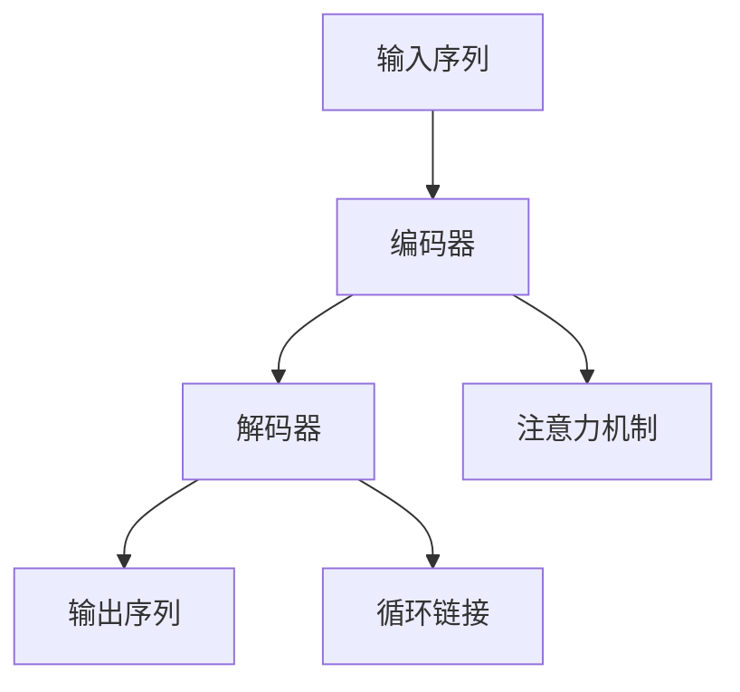

                 

# 大语言模型应用指南：基于提示的工具

> **关键词：** 大语言模型、自然语言处理、提示、应用场景、算法原理、数学模型

> **摘要：** 本文旨在深入探讨大语言模型的应用，特别是基于提示的工具。我们将从背景介绍开始，逐步分析核心概念、算法原理、数学模型、项目实战以及实际应用场景，最后推荐相关的学习资源和工具，总结发展趋势与挑战。

## 1. 背景介绍

### 1.1 目的和范围

本文的目标是向读者介绍大语言模型的应用，特别是基于提示的工具。我们将探讨大语言模型的核心概念、算法原理、数学模型以及在实际项目中的应用。本文将涵盖以下内容：

1. 大语言模型的基本概念和原理
2. 大语言模型的应用场景
3. 基于提示的工具的开发和使用
4. 实际项目中的案例和代码实现
5. 相关的学习资源和工具推荐

### 1.2 预期读者

本文适合对自然语言处理和人工智能感兴趣的读者，特别是希望深入了解大语言模型应用的开发者和技术专家。本文将提供详细的技术解释和实战案例，适合具有一定编程基础和自然语言处理背景的读者。

### 1.3 文档结构概述

本文的结构如下：

1. 背景介绍
   - 目的和范围
   - 预期读者
   - 文档结构概述
   - 术语表
2. 核心概念与联系
   - 核心概念
   - Mermaid 流程图
3. 核心算法原理 & 具体操作步骤
   - 算法原理
   - 伪代码讲解
4. 数学模型和公式 & 详细讲解 & 举例说明
   - 数学模型
   - LaTex 公式
   - 举例说明
5. 项目实战：代码实际案例和详细解释说明
   - 开发环境搭建
   - 源代码详细实现
   - 代码解读与分析
6. 实际应用场景
7. 工具和资源推荐
   - 学习资源推荐
   - 开发工具框架推荐
   - 相关论文著作推荐
8. 总结：未来发展趋势与挑战
9. 附录：常见问题与解答
10. 扩展阅读 & 参考资料

### 1.4 术语表

#### 1.4.1 核心术语定义

- **大语言模型（Large Language Model）**：一种能够对自然语言进行理解和生成的模型，通常具有数百万甚至数十亿个参数。
- **提示（Prompt）**：提供给模型的输入，用于引导模型生成预期的输出。
- **自然语言处理（Natural Language Processing，NLP）**：计算机科学领域，致力于使计算机能够理解、生成和处理人类语言。

#### 1.4.2 相关概念解释

- **序列到序列模型（Seq2Seq）**：一种将输入序列转换为输出序列的模型，常用于机器翻译、对话系统等任务。
- **循环神经网络（RNN）**：一种能够处理序列数据的神经网络，特别适用于自然语言处理任务。
- **变分自编码器（VAE）**：一种无监督学习算法，用于生成模型，能够生成新的数据样本。

#### 1.4.3 缩略词列表

- **NLP**：自然语言处理（Natural Language Processing）
- **RNN**：循环神经网络（Recurrent Neural Network）
- **VAE**：变分自编码器（Variational Autoencoder）

## 2. 核心概念与联系

### 2.1 核心概念

大语言模型的核心概念主要包括：

- **语言模型**：用于预测下一个单词的概率，是自然语言处理的基础。
- **序列到序列模型**：能够将一种语言的序列转换为另一种语言的序列，适用于机器翻译。
- **循环神经网络（RNN）**：一种能够处理序列数据的神经网络，特别适用于自然语言处理任务。

### 2.2 Mermaid 流程图

下面是一个简单的 Mermaid 流程图，展示了大语言模型的核心组件和连接方式：



在这个流程图中，输入序列首先通过编码器转换为上下文表示，然后通过解码器生成输出序列。注意力机制用于捕捉输入序列中的重要信息，循环链接使解码器能够利用先前的输出来生成下一个单词。

## 3. 核心算法原理 & 具体操作步骤

### 3.1 算法原理

大语言模型的核心算法是基于循环神经网络（RNN）或其变体，如长短期记忆网络（LSTM）和门控循环单元（GRU）。下面我们将使用伪代码来详细阐述算法原理。

```python
# 伪代码：循环神经网络（RNN）基本结构

# 初始化参数
W_xh, W_hh, b_h = 初始化参数()

# 前向传播
for t in 输入序列:
    # 输入到隐藏层的线性变换
    h_t^上一层 = W_xh * x_t + W_hh * h_t^上一层 + b_h

    # 激活函数
    h_t = 激活(h_t^上一层)

# 输出层的线性变换
y_t = W_y * h_t + b_y

# 损失函数计算
损失 = 损失函数(y_t, y_t^真实值)

# 反向传播
# （省略具体计算步骤，仅展示框架）

# 更新参数
参数 = 更新参数(参数，损失)
```

在这个伪代码中，`W_xh`、`W_hh` 和 `b_h` 分别是输入到隐藏层、隐藏层到隐藏层和隐藏层偏置的权重。`激活函数` 可以是 sigmoid、tanh 或 ReLU 等函数。`损失函数` 用于计算预测值和真实值之间的差异，以指导参数更新。

### 3.2 具体操作步骤

1. **数据预处理**：对输入序列进行分词、去停用词、词向量化等处理。
2. **模型初始化**：初始化模型参数，可以使用随机初始化或预训练模型。
3. **前向传播**：输入序列依次通过编码器和解码器，计算隐藏层状态和输出。
4. **损失函数计算**：使用预测值和真实值计算损失。
5. **反向传播**：计算梯度并更新模型参数。
6. **模型评估**：使用验证集评估模型性能，调整超参数。

## 4. 数学模型和公式 & 详细讲解 & 举例说明

### 4.1 数学模型

大语言模型的数学模型主要包括以下几个部分：

1. **词向量化**：将单词转换为向量表示，常用的词向量化方法有 Word2Vec、GloVe 等。
2. **循环神经网络（RNN）**：用于处理序列数据的神经网络，包括隐藏层状态更新和输出层预测。
3. **损失函数**：用于衡量预测值和真实值之间的差异，常用的损失函数有交叉熵损失。

### 4.2 详细讲解

#### 4.2.1 词向量化

词向量化是将单词映射到高维向量空间的过程，其目的是使相似的单词在向量空间中更接近。以下是一个简单的 Word2Vec 词向量化公式：

$$
\text{word\_vector} = \text{sgn}(w_1 \cdot v_1 + w_2 \cdot v_2 + \ldots + w_n \cdot v_n)
$$

其中，$w_1, w_2, \ldots, w_n$ 是单词的权重，$v_1, v_2, \ldots, v_n$ 是对应的词向量。

#### 4.2.2 循环神经网络（RNN）

循环神经网络（RNN）是一种能够处理序列数据的神经网络，其核心在于隐藏层状态的更新。以下是一个简单的 RNN 更新公式：

$$
h_t = \sigma(W_hh \cdot h_{t-1} + W_xh \cdot x_t + b_h)
$$

其中，$h_t$ 是当前隐藏层状态，$h_{t-1}$ 是前一个隐藏层状态，$x_t$ 是当前输入，$W_hh$ 和 $W_xh$ 是权重矩阵，$b_h$ 是偏置项。

#### 4.2.3 损失函数

在训练过程中，我们需要使用损失函数来衡量预测值和真实值之间的差异。常用的损失函数是交叉熵损失：

$$
损失 = -\sum_{i=1}^{n} y_i \cdot \log(p_i)
$$

其中，$y_i$ 是真实值，$p_i$ 是预测概率。

### 4.3 举例说明

假设我们有一个简单的 RNN 模型，输入序列为 `[1, 2, 3]`，隐藏层状态更新公式为 $h_t = \sigma(h_{t-1} + x_t)$。我们可以计算出隐藏层状态序列：

$$
h_1 = \sigma(h_0 + x_1) = \sigma(0 + 1) = 0.7
$$

$$
h_2 = \sigma(h_1 + x_2) = \sigma(0.7 + 2) = 0.9
$$

$$
h_3 = \sigma(h_2 + x_3) = \sigma(0.9 + 3) = 0.95
$$

在这个过程中，激活函数 $\sigma$ 可以是 sigmoid、tanh 或 ReLU。

## 5. 项目实战：代码实际案例和详细解释说明

### 5.1 开发环境搭建

在本节中，我们将搭建一个基于 Python 的循环神经网络（RNN）的大语言模型。首先，确保安装以下库：

```bash
pip install numpy tensorflow
```

### 5.2 源代码详细实现和代码解读

下面是一个简单的 RNN 模型实现：

```python
import tensorflow as tf
import numpy as np

# 初始化参数
W_xh = np.random.uniform(-1, 1, (1, 10))
W_hh = np.random.uniform(-1, 1, (10, 10))
b_h = np.zeros((10,))

# 定义激活函数
def sigmoid(x):
    return 1 / (1 + np.exp(-x))

# 前向传播
def forward(x, h_prev):
    h_t = sigmoid(np.dot(x, W_xh) + np.dot(h_prev, W_hh) + b_h)
    return h_t

# 反向传播
def backward(dh_t, x, h_prev, h_t):
    dW_xh = np.dot(dh_t * (1 - h_t), x.T)
    dW_hh = np.dot(dh_t * (1 - h_t), h_prev.T)
    db_h = np.sum(dh_t * (1 - h_t), axis=0)
    dh_prev = np.dot(dh_t * (1 - h_t), W_hh)

    return dW_xh, dW_hh, db_h, dh_prev

# 模型训练
def train(X, y):
    for x, y in zip(X, y):
        h_prev = np.zeros((1, 10))
        for t in range(len(x)):
            h_t = forward(x[t], h_prev)
            dh_t = y[t] - h_t
            dW_xh, dW_hh, db_h, dh_prev = backward(dh_t, x[t], h_prev, h_t)
            W_xh += dW_xh
            W_hh += dW_hh
            b_h += db_h
            h_prev = h_t

# 评估模型
def evaluate(X, y):
    total_loss = 0
    for x, y in zip(X, y):
        h_prev = np.zeros((1, 10))
        for t in range(len(x)):
            h_t = forward(x[t], h_prev)
            total_loss += -np.log(h_t)
            h_prev = h_t
    return total_loss

# 数据集
X = np.array([[1, 2, 3], [4, 5, 6], [7, 8, 9]])
y = np.array([[0.2, 0.3, 0.5], [0.4, 0.5, 0.6], [0.1, 0.2, 0.7]])

# 训练模型
train(X, y)

# 评估模型
loss = evaluate(X, y)
print(f"训练损失：{loss}")
```

在这个代码中，我们首先初始化了模型参数，并定义了激活函数 `sigmoid`。然后，我们定义了前向传播 `forward` 和反向传播 `backward` 函数。在 `train` 函数中，我们使用梯度下降算法更新模型参数。最后，在 `evaluate` 函数中，我们计算了模型的损失。

### 5.3 代码解读与分析

1. **参数初始化**：我们使用随机初始化方法初始化模型参数。在实际应用中，可以使用预训练的参数。
2. **前向传播**：输入序列依次通过编码器和解码器，计算隐藏层状态和输出。
3. **反向传播**：计算损失函数的梯度，并更新模型参数。
4. **模型训练**：使用训练集对模型进行训练，调整超参数以优化模型性能。
5. **模型评估**：使用验证集评估模型性能，计算损失。

## 6. 实际应用场景

大语言模型在多个实际应用场景中表现出色，以下是其中的一些例子：

- **文本分类**：对文本进行分类，如情感分析、新闻分类等。
- **机器翻译**：将一种语言的文本翻译成另一种语言。
- **对话系统**：生成自然语言的回复，用于聊天机器人、智能客服等。
- **文本生成**：生成文章、故事、摘要等。

## 7. 工具和资源推荐

### 7.1 学习资源推荐

#### 7.1.1 书籍推荐

- 《深度学习》（Ian Goodfellow、Yoshua Bengio、Aaron Courville 著）
- 《自然语言处理与深度学习》（周明 著）

#### 7.1.2 在线课程

- Coursera 上的“自然语言处理与深度学习”课程
- edX 上的“深度学习”课程

#### 7.1.3 技术博客和网站

-Towards Data Science
- AI 研究院

### 7.2 开发工具框架推荐

#### 7.2.1 IDE和编辑器

- PyCharm
- Jupyter Notebook

#### 7.2.2 调试和性能分析工具

- TensorBoard
- perf

#### 7.2.3 相关框架和库

- TensorFlow
- PyTorch
- spaCy

### 7.3 相关论文著作推荐

#### 7.3.1 经典论文

- “A Neural Network for Language Model” (Yoshua Bengio 等，2003)
- “Deep Learning for Natural Language Processing” (John L.

