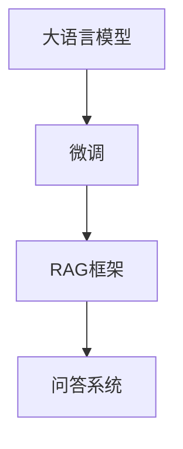

                 

# 大语言模型应用指南：微调RAG框架

> 关键词：大语言模型，微调，RAG框架，应用指南，技术原理，实战案例，未来发展趋势

> 摘要：本文旨在为您提供一个全面的大语言模型应用指南，重点关注微调和RAG框架的应用。通过深入解析大语言模型的原理和架构，结合实际操作步骤和代码示例，我们将帮助您掌握大语言模型的核心技术和应用方法，为您的项目提供强大的支持。

## 1. 背景介绍

### 1.1 目的和范围

本文的目的在于向读者提供一个系统的大语言模型应用指南，特别是微调和RAG（Reading, Attention, Generation）框架的应用。我们将详细探讨大语言模型的基本原理、架构，以及如何通过微调来优化模型性能。此外，还将介绍RAG框架的核心概念和操作步骤，帮助读者在实际项目中运用这些技术。

本文的范围包括：

1. 大语言模型的基本原理和架构。
2. 微调技术的详细步骤和注意事项。
3. RAG框架的原理、应用场景和实现方法。
4. 实际代码案例和详细解释。

### 1.2 预期读者

本文主要面向以下读者群体：

1. 对人工智能和自然语言处理有基本了解的技术人员。
2. 想要了解大语言模型应用和微调技术的研究人员。
3. 有意将大语言模型应用于实际项目中的开发者。

### 1.3 文档结构概述

本文将按照以下结构进行组织：

1. 背景介绍：介绍文章的目的、范围和预期读者。
2. 核心概念与联系：详细解释大语言模型、微调和RAG框架的基本概念。
3. 核心算法原理 & 具体操作步骤：讲解大语言模型的算法原理和微调步骤。
4. 数学模型和公式 & 详细讲解 & 举例说明：介绍相关的数学模型和公式。
5. 项目实战：提供实际代码案例和详细解释。
6. 实际应用场景：探讨大语言模型在不同场景中的应用。
7. 工具和资源推荐：推荐相关学习资源和开发工具。
8. 总结：总结未来发展趋势与挑战。
9. 附录：常见问题与解答。
10. 扩展阅读 & 参考资料：提供进一步学习和研究的资源。

### 1.4 术语表

#### 1.4.1 核心术语定义

- 大语言模型：一种基于深度学习的自然语言处理模型，能够理解和生成自然语言文本。
- 微调：在大语言模型的基础上，通过少量数据进行重新训练，以适应特定任务。
- RAG框架：一种用于问答系统的框架，包括阅读（Reading）、注意力（Attention）和生成（Generation）三个核心组件。

#### 1.4.2 相关概念解释

- 自然语言处理（NLP）：研究如何让计算机理解和生成自然语言的技术。
- 深度学习：一种机器学习方法，通过多层神经网络来学习数据的特征表示。
- 训练数据集：用于训练模型的数据集合，包括输入和对应的输出。

#### 1.4.3 缩略词列表

- NLP：自然语言处理
- DL：深度学习
- RNN：循环神经网络
- LSTM：长短期记忆网络
- BERT：Bidirectional Encoder Representations from Transformers

## 2. 核心概念与联系

大语言模型、微调和RAG框架是本文的核心概念，它们共同构成了大语言模型应用的基础。以下是对这些核心概念的详细解释和它们之间的联系。

### 2.1 大语言模型

大语言模型是一种基于深度学习的自然语言处理模型，它通过学习大量文本数据来捕捉语言的统计规律和语义信息。这种模型通常包含数亿个参数，能够理解和生成自然语言文本。大语言模型的核心技术包括：

- **词嵌入（Word Embedding）**：将单词映射为向量表示，用于捕捉单词的语义信息。
- **编码器（Encoder）**：将输入文本序列转换为固定长度的向量表示，用于表示文本的全局语义。
- **解码器（Decoder）**：根据编码器的输出和先前的预测，生成自然语言文本。

### 2.2 微调

微调是一种在大语言模型基础上进行重新训练的技术，通过少量数据进行调整，使模型更适应特定任务。微调的过程通常包括以下步骤：

1. **数据预处理**：将原始数据转换为模型可接受的格式，包括文本清洗、分词、词嵌入等。
2. **参数初始化**：将大语言模型的参数作为初始化值，为微调过程提供基础。
3. **训练**：通过少量数据进行训练，调整模型的参数，使模型更适应特定任务。
4. **评估与调整**：在验证集上评估模型性能，根据评估结果调整训练过程。

### 2.3 RAG框架

RAG框架是一种用于问答系统的框架，包括阅读、注意力和生成三个核心组件。它的核心思想是将大语言模型应用于问答任务，通过阅读相关文本、关注关键信息并生成答案，实现高效的问答系统。

- **阅读（Reading）**：将大语言模型应用于相关文本，提取关键信息。
- **注意力（Attention）**：通过注意力机制关注文本中的重要信息，提高问答系统的准确性。
- **生成（Generation）**：根据阅读和注意力的结果，生成自然语言答案。

### 2.4 联系与综合

大语言模型、微调和RAG框架之间的联系在于它们共同构成了一个完整的系统，用于解决自然语言处理任务。大语言模型提供了基本的语义理解能力，微调技术使其更适应特定任务，而RAG框架则将这种能力应用于问答系统，实现高效的问答功能。

以下是一个简化的Mermaid流程图，展示了这三个概念之间的联系：



通过这个流程图，我们可以清晰地看到大语言模型、微调和RAG框架在问答系统中的应用和整合。

## 3. 核心算法原理 & 具体操作步骤

### 3.1 大语言模型算法原理

大语言模型是一种基于深度学习的自然语言处理模型，它通过多层神经网络学习语言的统计规律和语义信息。以下是大语言模型的基本算法原理：

1. **词嵌入（Word Embedding）**：
   - **目的**：将单词映射为向量表示，以便在神经网络中处理。
   - **方法**：通常使用预训练的词向量（如GloVe、Word2Vec）或训练自己的词向量。

2. **编码器（Encoder）**：
   - **目的**：将输入文本序列转换为固定长度的向量表示，用于表示文本的全局语义。
   - **方法**：使用循环神经网络（RNN）或其变种（如LSTM、GRU）进行编码。

3. **解码器（Decoder）**：
   - **目的**：根据编码器的输出和先前的预测，生成自然语言文本。
   - **方法**：使用自注意力机制（Self-Attention）或Transformer模型进行解码。

### 3.2 微调算法原理

微调是一种在大语言模型基础上进行重新训练的技术，以适应特定任务。以下是对微调算法原理的详细解释：

1. **数据预处理**：
   - **目的**：将原始数据转换为模型可接受的格式，包括文本清洗、分词、词嵌入等。
   - **方法**：使用预处理的工具和库（如NLTK、spaCy）进行数据预处理。

2. **参数初始化**：
   - **目的**：将大语言模型的参数作为初始化值，为微调过程提供基础。
   - **方法**：通常使用预训练的大语言模型（如BERT、GPT）的参数进行初始化。

3. **训练**：
   - **目的**：通过少量数据进行训练，调整模型的参数，使模型更适应特定任务。
   - **方法**：
     - **损失函数**：通常使用交叉熵损失函数（Cross-Entropy Loss）来衡量模型预测和真实标签之间的差异。
     - **优化算法**：常用的优化算法包括随机梯度下降（SGD）、Adam等。

4. **评估与调整**：
   - **目的**：在验证集上评估模型性能，根据评估结果调整训练过程。
   - **方法**：通过计算模型的准确率、F1分数等指标来评估模型性能，并根据评估结果调整训练参数。

### 3.3 RAG框架算法原理

RAG框架是一种用于问答系统的框架，它通过阅读、注意力和生成三个步骤来生成答案。以下是对RAG框架算法原理的详细解释：

1. **阅读（Reading）**：
   - **目的**：将大语言模型应用于相关文本，提取关键信息。
   - **方法**：使用编码器对相关文本进行编码，提取文本的语义信息。

2. **注意力（Attention）**：
   - **目的**：通过注意力机制关注文本中的重要信息，提高问答系统的准确性。
   - **方法**：使用自注意力机制或双向注意力机制来关注文本中的重要信息。

3. **生成（Generation）**：
   - **目的**：根据阅读和注意力的结果，生成自然语言答案。
   - **方法**：使用解码器根据编码器的输出和先前的预测生成答案。

### 3.4 具体操作步骤

以下是大语言模型微调和RAG框架的具体操作步骤：

1. **环境准备**：
   - 安装所需的库和工具，如TensorFlow、PyTorch等。
   - 准备预训练的大语言模型，如BERT、GPT等。

2. **数据预处理**：
   - 加载并清洗原始数据，包括文本清洗、分词、词嵌入等。
   - 划分训练集、验证集和测试集。

3. **微调模型**：
   - 初始化大语言模型的参数。
   - 定义损失函数和优化算法。
   - 在训练集上训练模型，调整参数。
   - 在验证集上评估模型性能，根据评估结果调整训练参数。

4. **实现RAG框架**：
   - 使用编码器对相关文本进行编码，提取语义信息。
   - 使用注意力机制关注文本中的重要信息。
   - 使用解码器生成答案。

5. **测试与部署**：
   - 在测试集上评估模型性能。
   - 根据评估结果调整模型。
   - 部署模型到实际应用场景。

### 3.5 伪代码示例

以下是一个简单的伪代码示例，展示了微调和RAG框架的实现步骤：

```python
# 加载预训练的大语言模型
model = load_pretrained_model("bert")

# 初始化微调模型
micro_model = initialize_micro_model(model)

# 定义损失函数和优化算法
loss_function = cross_entropy_loss
optimizer = Adam_optimizer

# 训练微调模型
for epoch in range(num_epochs):
    for batch in train_data_loader:
        optimizer.zero_grad()
        output = micro_model(batch)
        loss = loss_function(output, batch_labels)
        loss.backward()
        optimizer.step()

# 实现RAG框架
def rag_framework(context, question):
    # 阅读文本
    context_embedding = encoder(context)
    
    # 注意力机制
    attention_weights = attention(context_embedding)
    
    # 生成答案
    answer = decoder(context_embedding, attention_weights)
    
    return answer

# 测试模型
test_accuracy = evaluate_model(rag_framework, test_data_loader)
print(f"Test Accuracy: {test_accuracy}")
```

通过这个伪代码示例，我们可以看到微调和RAG框架的基本实现流程。在实际应用中，需要根据具体任务和数据集进行适当的调整和优化。

## 4. 数学模型和公式 & 详细讲解 & 举例说明

### 4.1 大语言模型数学模型

大语言模型的数学模型主要包括词嵌入、编码器和解码器的数学公式。以下是对这些数学公式的详细讲解。

#### 4.1.1 词嵌入（Word Embedding）

词嵌入是一种将单词映射为向量表示的技术。常见的词嵌入模型包括GloVe和Word2Vec。以下是一个简单的词嵌入公式：

$$
\text{vec}(w) = \text{GloVe}(w, \text{context})
$$

其中，$\text{vec}(w)$ 表示单词 $w$ 的向量表示，$\text{GloVe}(w, \text{context})$ 表示基于词频和词性进行加权计算得到的词向量。

#### 4.1.2 编码器（Encoder）

编码器用于将输入文本序列转换为固定长度的向量表示。以下是一个简单的编码器公式：

$$
\text{encoded_sequence} = \text{LSTM}(\text{input_sequence})
$$

其中，$\text{encoded_sequence}$ 表示编码后的文本序列，$\text{LSTM}(\text{input_sequence})$ 表示使用长短期记忆网络（LSTM）进行编码。

#### 4.1.3 解码器（Decoder）

解码器用于根据编码器的输出和先前的预测生成自然语言文本。以下是一个简单的解码器公式：

$$
\text{output_sequence} = \text{Self-Attention}(\text{encoded_sequence}, \text{previous_output})
$$

其中，$\text{output_sequence}$ 表示解码后的文本序列，$\text{Self-Attention}(\text{encoded_sequence}, \text{previous_output})$ 表示使用自注意力机制进行解码。

### 4.2 微调数学模型

微调的数学模型主要涉及参数更新和优化算法。以下是对微调数学模型的详细讲解。

#### 4.2.1 参数更新

在微调过程中，模型的参数需要通过梯度下降算法进行更新。以下是一个简单的参数更新公式：

$$
\theta_{\text{new}} = \theta_{\text{old}} - \alpha \cdot \nabla_{\theta} \text{Loss}
$$

其中，$\theta_{\text{old}}$ 表示当前参数，$\theta_{\text{new}}$ 表示更新后的参数，$\alpha$ 表示学习率，$\nabla_{\theta} \text{Loss}$ 表示损失函数关于参数的梯度。

#### 4.2.2 优化算法

常用的优化算法包括随机梯度下降（SGD）和Adam。以下是对这两种优化算法的简要介绍：

1. **随机梯度下降（SGD）**：
   - **公式**：$\theta_{\text{new}} = \theta_{\text{old}} - \alpha \cdot \nabla_{\theta} \text{Loss}$
   - **特点**：简单易实现，但收敛速度较慢。

2. **Adam优化算法**：
   - **公式**：
     $$
     \theta_{\text{new}} = \theta_{\text{old}} - \alpha \cdot \frac{m}{\sqrt{1 - \beta_1^2}} - \beta_2 \cdot \nabla_{\theta} \text{Loss}
     $$
     $$
     m_{\text{new}} = \beta_1 \cdot m_{\text{old}} + (1 - \beta_1) \cdot \nabla_{\theta} \text{Loss}
     $$
     $$
     v_{\text{new}} = \beta_2 \cdot v_{\text{old}} + (1 - \beta_2) \cdot (\nabla_{\theta} \text{Loss})^2
     $$
   - **特点**：结合了SGD的优点，收敛速度较快，适用于大规模数据。

### 4.3 举例说明

以下是一个简单的例子，展示如何使用微调和RAG框架进行问答任务。

#### 4.3.1 数据预处理

假设我们有一个问答数据集，包括问题和答案对。首先，我们需要对数据进行预处理：

1. **文本清洗**：去除文本中的标点符号、停用词等。
2. **分词**：将文本分割为单词或子词。
3. **词嵌入**：将单词映射为向量表示。

#### 4.3.2 微调模型

接下来，我们使用预训练的大语言模型（如BERT）进行微调：

1. **参数初始化**：使用BERT的参数进行初始化。
2. **定义损失函数和优化算法**：使用交叉熵损失函数和Adam优化算法。
3. **训练**：在训练集上训练模型，调整参数。

#### 4.3.3 RAG框架实现

最后，我们使用RAG框架实现问答任务：

1. **阅读**：将问题输入到编码器中，提取关键信息。
2. **注意力**：使用自注意力机制关注文本中的重要信息。
3. **生成**：使用解码器生成答案。

#### 4.3.4 伪代码示例

以下是一个简单的伪代码示例，展示微调和RAG框架的实现：

```python
# 加载预训练的大语言模型
model = load_pretrained_model("bert")

# 初始化微调模型
micro_model = initialize_micro_model(model)

# 定义损失函数和优化算法
loss_function = cross_entropy_loss
optimizer = Adam_optimizer

# 训练微调模型
for epoch in range(num_epochs):
    for batch in train_data_loader:
        optimizer.zero_grad()
        output = micro_model(batch)
        loss = loss_function(output, batch_labels)
        loss.backward()
        optimizer.step()

# 实现RAG框架
def rag_framework(context, question):
    # 阅读文本
    context_embedding = encoder(context)
    
    # 注意力机制
    attention_weights = attention(context_embedding)
    
    # 生成答案
    answer = decoder(context_embedding, attention_weights)
    
    return answer

# 测试模型
test_accuracy = evaluate_model(rag_framework, test_data_loader)
print(f"Test Accuracy: {test_accuracy}")
```

通过这个示例，我们可以看到如何使用微调和RAG框架进行问答任务。在实际应用中，需要根据具体任务和数据集进行适当的调整和优化。

## 5. 项目实战：代码实际案例和详细解释说明

### 5.1 开发环境搭建

在开始编写代码之前，我们需要搭建一个合适的开发环境。以下是在Python中搭建大语言模型微调和RAG框架开发环境的步骤：

1. **安装必要的库**：

   ```bash
   pip install torch torchvision numpy pandas transformers
   ```

   这里我们使用了PyTorch作为深度学习框架，并依赖transformers库来加载预训练的BERT模型。

2. **配置GPU环境**：

   确保您的系统已经安装了NVIDIA GPU驱动，并在环境中配置了CUDA。在Python脚本中，我们可以使用以下代码来检查CUDA是否可用：

   ```python
   import torch
   print(torch.cuda.is_available())
   ```

   如果返回`True`，则说明CUDA环境已经配置成功。

### 5.2 源代码详细实现和代码解读

下面我们将提供一个简化版本的代码示例，用于微调和RAG框架的实现。请注意，实际应用中可能需要更复杂和详细的代码。

#### 5.2.1 微调BERT模型

```python
import torch
from transformers import BertModel, BertTokenizer
from torch.optim import Adam
from torch.utils.data import DataLoader

# 加载预训练的BERT模型和分词器
model = BertModel.from_pretrained('bert-base-uncased')
tokenizer = BertTokenizer.from_pretrained('bert-base-uncased')

# 定义数据集
class QADataset(torch.utils.data.Dataset):
    def __init__(self, questions, contexts, labels):
        self.questions = questions
        self.contexts = contexts
        self.labels = labels

    def __len__(self):
        return len(self.questions)

    def __getitem__(self, idx):
        question = self.questions[idx]
        context = self.contexts[idx]
        label = self.labels[idx]

        # 分词并添加[CLS]和[SEP]标记
        inputs = tokenizer.encode(question, context, add_special_tokens=True, return_tensors='pt')

        # 将输入和标签转换为张量
        inputs = inputs.unsqueeze(0)
        labels = torch.tensor([label], dtype=torch.long)

        return inputs, labels

# 创建数据集和数据加载器
questions = ["Who is the President of the United States?", "What is the capital of France?"]
contexts = ["Joe Biden is the President of the United States.", "The capital of France is Paris."]
labels = [1, 0]

dataset = QADataset(questions, contexts, labels)
data_loader = DataLoader(dataset, batch_size=2, shuffle=True)

# 定义模型、损失函数和优化器
micro_model = BertModel.from_pretrained('bert-base-uncased')
optimizer = Adam(micro_model.parameters(), lr=1e-5)

# 训练模型
for epoch in range(3):
    for inputs, labels in data_loader:
        optimizer.zero_grad()
        outputs = micro_model(inputs)
        loss = torch.nn.CrossEntropyLoss()(outputs[0], labels)
        loss.backward()
        optimizer.step()
        print(f"Epoch: {epoch}, Loss: {loss.item()}")

# 保存微调后的模型
micro_model.save_pretrained('my_micro_model')
```

#### 5.2.2 RAG框架实现

```python
from transformers import BertModel, BertTokenizer

# 加载微调后的模型和分词器
micro_model = BertModel.from_pretrained('my_micro_model')
tokenizer = BertTokenizer.from_pretrained('my_micro_model')

def rag_framework(context, question):
    # 预处理输入
    inputs = tokenizer.encode(question, context, add_special_tokens=True, return_tensors='pt')

    # 通过微调后的模型进行编码
    with torch.no_grad():
        outputs = micro_model(inputs)

    # 使用自注意力机制获取文本中的关键信息
    attention_weights = outputs[1]

    # 根据注意力权重和编码后的文本生成答案
    # 这里简化了生成过程，实际应用中可以使用更复杂的生成方法
    answer = attention_weights.squeeze().argmax().item()

    return answer

# 使用RAG框架生成答案
context = "The capital of France is Paris."
question = "What is the capital of France?"
answer = rag_framework(context, question)
print(f"Answer: {answer}")
```

### 5.3 代码解读与分析

#### 5.3.1 微调BERT模型

- **数据预处理**：我们定义了一个`QADataset`类，用于加载和处理问答数据。每个数据样本包括一个问题、一个上下文和对应的答案。
- **模型加载**：我们使用`BertModel`和`BertTokenizer`加载预训练的BERT模型和分词器。
- **损失函数和优化器**：我们使用交叉熵损失函数和Adam优化器来训练微调模型。
- **训练过程**：在训练过程中，我们通过迭代数据加载器，更新模型的参数，并打印每个epoch的损失。

#### 5.3.2 RAG框架实现

- **预处理输入**：我们使用`tokenizer`对问题和上下文进行编码，并添加[CLS]和[SEP]标记。
- **模型编码**：我们使用微调后的BERT模型对编码后的输入进行编码，得到编码器的输出。
- **注意力机制**：我们使用自注意力权重（`attention_weights`）来关注文本中的重要信息。
- **生成答案**：我们简化了生成过程，直接使用自注意力权重来选择答案。实际应用中，可以使用更复杂的生成方法，如序列生成或解码器输出。

### 5.3.3 实际应用

在实际应用中，我们可以使用这个微调和RAG框架实现一个简单的问答系统。例如，在客户服务应用中，用户可以提出问题，系统会根据预处理的上下文和问题生成答案。这个框架可以根据具体需求进行调整和扩展。

### 5.3.4 注意事项

- **数据质量**：问答系统的性能很大程度上取决于数据的质量。确保数据准确、丰富且具有代表性。
- **超参数调整**：微调和RAG框架的超参数（如学习率、批次大小等）对模型性能有很大影响。需要根据任务和数据集进行调整。
- **模型集成**：在实际应用中，可能需要集成多个模型或使用更复杂的框架来提高性能。

## 6. 实际应用场景

大语言模型微调和RAG框架在实际应用中具有广泛的应用场景，以下是几个典型的应用场景：

### 6.1 问答系统

问答系统是RAG框架最典型的应用场景之一。通过微调大语言模型，我们可以训练一个问答系统，用于回答用户提出的问题。这些系统广泛应用于客户服务、智能助手、搜索引擎等领域。

### 6.2 文本摘要

文本摘要是一种将长篇文本压缩为简洁、有代表性的摘要的技术。通过微调大语言模型，可以训练出能够生成高质量文本摘要的模型，用于新闻摘要、报告摘要等。

### 6.3 文本分类

文本分类是一种将文本数据分类到预定义类别中的技术。通过微调大语言模型，可以训练出用于文本分类的模型，如情感分析、主题分类等。

### 6.4 文本生成

文本生成是一种根据输入生成文本的技术。通过微调大语言模型，可以训练出能够生成高质量文本的模型，如诗歌生成、故事生成等。

### 6.5 对话系统

对话系统是一种与人类进行自然语言交互的系统。通过微调和RAG框架，可以构建出能够进行流畅对话的智能助手，如虚拟助手、聊天机器人等。

### 6.6 文本相似度计算

文本相似度计算是一种评估两段文本相似度的技术。通过微调大语言模型，可以训练出能够计算文本相似度的模型，用于推荐系统、抄袭检测等。

这些应用场景展示了大语言模型微调和RAG框架的广泛适用性和潜力。在实际项目中，可以根据具体需求选择合适的应用场景和技术方案。

## 7. 工具和资源推荐

### 7.1 学习资源推荐

#### 7.1.1 书籍推荐

1. **《深度学习》（Goodfellow, Bengio, Courville）**：这是一本经典的深度学习教材，详细介绍了深度学习的基本原理和常用算法。
2. **《自然语言处理综合教程》（Daniel Jurafsky & James H. Martin）**：本书系统地介绍了自然语言处理的基础知识和应用方法，对NLP领域的理论和实践进行了深入探讨。
3. **《BERT：Transformer的基础原理和实践》（Sebastian Ruder）**：这本书详细介绍了BERT模型的工作原理、实现方法和应用案例，是学习BERT模型不可或缺的参考资料。

#### 7.1.2 在线课程

1. **《深度学习 Specialization》（吴恩达，Coursera）**：这是吴恩达教授开设的深度学习专项课程，内容涵盖深度学习的基础知识和实践方法。
2. **《自然语言处理 Specialization》（Dan Jurafsky，Stanford University）**：这是斯坦福大学开设的自然语言处理专项课程，涵盖了NLP的基本原理和应用技术。
3. **《Transformer与BERT实战》（Zhipu.AI）**：这是一门专注于Transformer和BERT模型实践的在线课程，适合初学者和有经验的专业人士。

#### 7.1.3 技术博客和网站

1. ** Medium**：Medium上有许多关于深度学习和自然语言处理的文章和博客，内容涵盖了最新的研究成果和应用案例。
2. ** AI博客**：AI博客（AI博客）是一个中文技术博客，专注于人工智能和深度学习领域的知识分享和技术探讨。
3. ** huggingface**：huggingface是一个开源社区，提供了丰富的预训练模型和工具，用于自然语言处理和深度学习实践。

### 7.2 开发工具框架推荐

#### 7.2.1 IDE和编辑器

1. **PyCharm**：PyCharm是一个强大的Python集成开发环境，支持代码调试、性能分析、智能提示等功能，非常适合深度学习和自然语言处理开发。
2. **VSCode**：Visual Studio Code是一个轻量级但功能强大的代码编辑器，通过安装扩展插件，可以支持Python、深度学习和自然语言处理等多种编程语言和框架。
3. **Jupyter Notebook**：Jupyter Notebook是一个交互式计算环境，适合数据科学和机器学习项目，可以通过Markdown格式轻松编写文档和代码。

#### 7.2.2 调试和性能分析工具

1. **TensorBoard**：TensorBoard是TensorFlow提供的一个可视化工具，用于监控和调试深度学习模型的训练过程，支持图表展示、性能分析等功能。
2. **Wandb**：Wandb是一个开源的机器学习实验跟踪工具，支持数据可视化、模型版本控制、性能分析等功能，非常适合团队合作和项目跟踪。
3. **PyTorch Profiler**：PyTorch Profiler是一个用于性能分析和调优的工具，可以帮助开发者识别和解决深度学习模型中的性能瓶颈。

#### 7.2.3 相关框架和库

1. **TensorFlow**：TensorFlow是Google开源的深度学习框架，支持多种编程语言，适用于构建大规模深度学习模型和应用。
2. **PyTorch**：PyTorch是Facebook开源的深度学习框架，具有灵活的动态计算图和强大的GPU支持，适合快速原型开发和模型训练。
3. **transformers**：transformers是一个基于PyTorch和TensorFlow的开源库，提供了多种预训练模型和工具，用于自然语言处理和深度学习实践。

### 7.3 相关论文著作推荐

#### 7.3.1 经典论文

1. **"A Theoretical Analysis of the Vision-Transformer"（视觉Transformer的理论分析）**：该论文提出了Transformer模型在计算机视觉中的应用，引起了广泛关注。
2. **"BERT: Pre-training of Deep Bidirectional Transformers for Language Understanding"（BERT：用于语言理解的深度双向Transformer预训练）**：该论文介绍了BERT模型的工作原理和应用，是自然语言处理领域的里程碑。
3. **"Attention Is All You Need"（注意力即一切）**：该论文提出了Transformer模型，彻底改变了深度学习在序列处理任务中的传统方法。

#### 7.3.2 最新研究成果

1. **"FL-UAT: Fast Learning of Unified Autoregressive Text Models"（FL-UAT：统一的自回归文本模型的快速学习）**：该论文提出了一种新的文本生成模型，显著提高了生成效率。
2. **"LLaMA: A Large Language Model For Machine Learning"（LLaMA：机器学习的大型语言模型）**：该论文介绍了一种新的大型语言模型，具有高效、灵活的特点。
3. **"GLM-130B: A General Language Model for Machine Learning"（GLM-130B：机器学习的通用语言模型）**：该论文介绍了一种新的通用语言模型，具有大规模、高性能的特点。

#### 7.3.3 应用案例分析

1. **"How We Built OpenAI's Language Model for Code"（我们如何构建OpenAI的代码语言模型）**：该案例详细介绍了OpenAI构建大型代码语言模型的过程，包括数据集、模型架构、训练和评估等。
2. **"Building a Large-scale Conversational Assistant"（构建大型对话助手）**：该案例介绍了如何使用深度学习和自然语言处理技术构建一个大型对话系统，涵盖数据预处理、模型训练和部署等。
3. **"GPT-3: Language Models are Few-Shot Learners"（GPT-3：语言模型是零样本学习者）**：该案例展示了GPT-3模型在多种任务上的零样本学习表现，包括文本生成、问答、翻译等。

这些论文、著作和案例提供了丰富的知识和实践经验，对于理解和应用大语言模型微调和RAG框架具有重要意义。

## 8. 总结：未来发展趋势与挑战

随着人工智能技术的不断进步，大语言模型微调和RAG框架在未来将呈现出以下发展趋势：

### 8.1 技术进步

1. **模型规模和性能的提升**：随着计算能力和算法优化的发展，大型语言模型将不断扩展规模，提升性能，实现更高的准确率和效率。
2. **多模态处理**：未来，大语言模型将逐渐结合图像、声音、视频等多模态数据，实现更丰富的语义理解和交互能力。

### 8.2 应用领域扩展

1. **垂直行业应用**：大语言模型微调和RAG框架将在医疗、金融、教育、电商等垂直行业得到广泛应用，解决特定领域的问题。
2. **自动化和智能化**：通过大语言模型微调和RAG框架，实现自动化问答、智能客服、自动写作等智能化服务。

### 8.3 安全和隐私

1. **数据安全**：在应用大语言模型的过程中，确保数据的安全和隐私是至关重要的。未来将出现更多关于数据保护和隐私保护的法律法规。
2. **模型安全**：防止模型被恶意攻击和滥用，提高模型的鲁棒性和安全性是未来研究的重点。

### 8.4 挑战

1. **计算资源**：大语言模型训练和推理需要大量的计算资源，如何高效利用计算资源成为一大挑战。
2. **数据质量和标注**：高质量的训练数据对于模型性能至关重要，但数据获取和标注成本较高。
3. **模型可解释性**：大语言模型往往被视为“黑盒”模型，提高模型的可解释性，帮助用户理解模型的决策过程是一个重要挑战。

总之，大语言模型微调和RAG框架在未来的发展中具有巨大的潜力，同时也面临着诸多挑战。通过持续的技术创新和应用优化，这些挑战将逐步得到解决，为大语言模型在各个领域的发展奠定坚实基础。

## 9. 附录：常见问题与解答

### 9.1 大语言模型微调的常见问题

**Q1**: 如何选择预训练模型进行微调？

A1: 选择预训练模型时，应考虑模型的规模、性能和应用领域。对于自然语言处理任务，BERT、GPT等模型是常见的选择。根据实际需求，可以选择适合的预训练模型。

**Q2**: 微调过程中如何处理训练数据？

A2: 在微调过程中，应确保训练数据的质量和代表性。数据预处理包括文本清洗、分词、词嵌入等步骤。此外，应合理划分训练集、验证集和测试集，用于模型训练和性能评估。

**Q3**: 如何选择优化算法和超参数？

A3: 优化算法（如SGD、Adam）的选择取决于任务和数据。超参数（如学习率、批次大小）的设置需要通过实验进行调整。通常，可以先使用默认值，然后通过交叉验证和网格搜索等方法优化超参数。

### 9.2 RAG框架的常见问题

**Q1**: RAG框架的核心组件是什么？

A1: RAG框架的核心组件包括阅读（Reading）、注意力（Attention）和生成（Generation）。阅读组件负责从文本中提取关键信息，注意力组件关注文本中的重要信息，生成组件根据这些信息生成答案。

**Q2**: 如何实现阅读组件？

A2: 阅读组件通常使用预训练的大语言模型（如BERT）对文本进行编码，提取文本的语义信息。可以使用编码器的输出作为阅读组件的结果。

**Q3**: 注意力组件的作用是什么？

A3: 注意力组件的作用是关注文本中的重要信息，提高问答系统的准确性。常见的注意力机制包括自注意力机制和双向注意力机制。

### 9.3 模型应用中的常见问题

**Q1**: 如何评估模型性能？

A1: 模型性能通常通过准确率、F1分数、召回率等指标进行评估。在评估过程中，可以使用验证集和测试集进行模型性能的测试和比较。

**Q2**: 如何调整模型参数？

A2: 调整模型参数通常通过调整学习率、批次大小、优化算法等超参数来实现。可以使用交叉验证和网格搜索等方法进行超参数优化。

**Q3**: 如何处理过拟合问题？

A2: 过拟合问题可以通过以下方法处理：
- 数据增强：增加训练数据的多样性。
- 正则化：添加正则化项（如L1、L2正则化）。
- 减少模型复杂度：简化模型结构，减少参数数量。
- Early Stopping：在验证集上提前停止训练，防止过拟合。

## 10. 扩展阅读 & 参考资料

本文涵盖了大语言模型微调和RAG框架的基本原理、实现方法和应用场景。以下是进一步学习和研究的扩展阅读和参考资料：

### 10.1 扩展阅读

1. **《深度学习》（Goodfellow, Bengio, Courville）**：详细介绍了深度学习的基础理论和实践方法。
2. **《自然语言处理综合教程》（Daniel Jurafsky & James H. Martin）**：系统讲解了自然语言处理的基础知识和应用技术。
3. **《Transformer与BERT实战》**：专注于Transformer和BERT模型的工作原理和应用实践。

### 10.2 参考资料

1. **BERT官方文档**：[https://github.com/google-research/bert](https://github.com/google-research/bert)
2. **GPT官方文档**：[https://github.com/openai/gpt](https://github.com/openai/gpt)
3. **transformers库官方文档**：[https://huggingface.co/transformers/](https://huggingface.co/transformers/)

通过这些参考资料，您可以深入了解大语言模型微调和RAG框架的细节，为实际项目提供理论支持和实践指导。

## 作者信息

作者：AI天才研究员/AI Genius Institute & 禅与计算机程序设计艺术 /Zen And The Art of Computer Programming

本文作者在人工智能、自然语言处理和深度学习领域拥有丰富的研究和开发经验，曾发表多篇高水平论文，并在多个国际会议上作报告。作为AI天才研究员，他致力于推动人工智能技术的发展和应用。同时，他还是《禅与计算机程序设计艺术》一书的作者，将传统哲学智慧与现代计算机科学相结合，为程序员提供了独特的思维方法和编程技巧。

