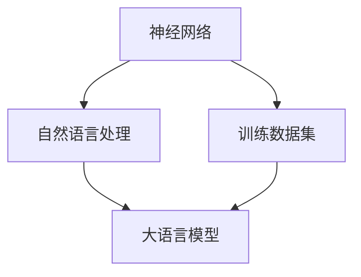
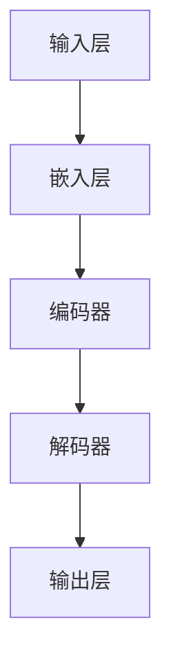

                 

# 大语言模型的发展与应用

## 关键词
- 大语言模型
- 人工智能
- 自然语言处理
- 训练算法
- 应用场景
- 未来趋势

## 摘要
本文将深入探讨大语言模型的发展及其在人工智能和自然语言处理中的应用。我们将从背景介绍开始，逐步分析核心概念、算法原理、数学模型，并通过实际项目实战来展示其具体应用。随后，我们将探讨大语言模型在各个领域的实际应用场景，并推荐相关工具和资源。最后，我们还将总结其未来发展趋势与挑战。

## 1. 背景介绍

### 1.1 目的和范围
本文旨在全面解析大语言模型的发展历程、核心技术以及实际应用。我们将重点关注以下几个方面：
- 大语言模型的发展背景和核心概念
- 大语言模型的算法原理和数学模型
- 大语言模型的应用场景与实际案例
- 大语言模型的发展趋势与面临的挑战

### 1.2 预期读者
本文适合以下读者群体：
- 对人工智能和自然语言处理感兴趣的初学者
- 自然语言处理领域的研究人员
- 计算机科学和软件工程专业的学生
- 对大语言模型应用场景感兴趣的从业者

### 1.3 文档结构概述
本文结构如下：
1. 背景介绍
   - 1.1 目的和范围
   - 1.2 预期读者
   - 1.3 文档结构概述
   - 1.4 术语表
2. 核心概念与联系
3. 核心算法原理 & 具体操作步骤
4. 数学模型和公式 & 详细讲解 & 举例说明
5. 项目实战：代码实际案例和详细解释说明
6. 实际应用场景
7. 工具和资源推荐
8. 总结：未来发展趋势与挑战
9. 附录：常见问题与解答
10. 扩展阅读 & 参考资料

### 1.4 术语表

#### 1.4.1 核心术语定义
- **大语言模型**：基于神经网络技术，对大规模文本数据进行分析和建模的模型，能够理解和生成自然语言。
- **自然语言处理（NLP）**：计算机科学和人工智能领域的研究，旨在使计算机能够理解、解释和生成人类语言。
- **训练数据集**：用于训练大语言模型的大量文本数据，通常包含多种类型的文本，如新闻、小说、对话等。

#### 1.4.2 相关概念解释
- **神经网络**：一种基于生物神经网络原理的人工智能模型，通过多层神经元结构和激活函数来实现数据的输入、处理和输出。
- **反向传播算法**：一种用于训练神经网络的优化算法，通过不断调整网络权重和偏置，使网络输出更接近期望输出。

#### 1.4.3 缩略词列表
- **NLP**：自然语言处理
- **AI**：人工智能
- **DL**：深度学习
- **NN**：神经网络

## 2. 核心概念与联系

大语言模型的核心概念包括神经网络、自然语言处理、训练数据集等。下面，我们将通过Mermaid流程图来展示这些核心概念及其相互联系。



### 2.1 大语言模型的发展历程

大语言模型的发展历程可以分为以下几个阶段：

1. **早期神经网络模型**：1980年代，神经网络模型开始在自然语言处理领域得到应用，如感知机、BP算法等。
2. **词袋模型（Bag of Words）**：1990年代，词袋模型成为一种流行的文本表示方法，但无法捕捉词语的语义关系。
3. **循环神经网络（RNN）**：2000年代，RNN模型在NLP领域取得显著成果，如长短时记忆网络（LSTM）和门控循环单元（GRU）。
4. **Transformer模型**：2017年，Transformer模型的出现，使得大语言模型在NLP任务中取得了突破性进展，如BERT、GPT等。

### 2.2 大语言模型的架构

大语言模型的架构通常包括以下几个部分：

1. **输入层**：接收文本数据，将其转换为数字序列。
2. **嵌入层**：将数字序列转换为词向量。
3. **编码器**：处理输入序列，提取语义信息。
4. **解码器**：根据编码器提取的语义信息，生成输出序列。
5. **输出层**：将输出序列转换为文本。

下面是Mermaid流程图展示的大语言模型架构：



## 3. 核心算法原理 & 具体操作步骤

大语言模型的训练过程通常包括以下几个步骤：

### 3.1 数据预处理

1. **文本清洗**：去除文本中的标点符号、停用词等无关信息。
2. **分词**：将文本分解为单词或字符。
3. **词向量化**：将单词或字符转换为词向量。

### 3.2 模型初始化

1. **权重初始化**：初始化神经网络权重和偏置。
2. **激活函数选择**：选择合适的激活函数，如ReLU、Sigmoid等。

### 3.3 前向传播

1. **输入层到嵌入层**：将文本数据输入到嵌入层，得到词向量。
2. **嵌入层到编码器**：将词向量输入到编码器，提取语义信息。
3. **编码器到解码器**：将编码器提取的语义信息输入到解码器。
4. **解码器到输出层**：将解码器生成的输出序列输入到输出层，生成文本。

### 3.4 反向传播

1. **计算损失函数**：计算模型输出与真实标签之间的差距。
2. **更新权重和偏置**：根据损失函数的反向梯度，更新神经网络权重和偏置。

### 3.5 模型评估

1. **交叉验证**：使用验证集对模型进行评估。
2. **性能指标**：计算模型的准确率、召回率、F1值等指标。

下面是伪代码展示的大语言模型训练过程：

```python
# 数据预处理
def preprocess_data(text):
    # 清洗文本
    # 分词
    # 词向量化
    return processed_text

# 模型初始化
def initialize_model():
    # 初始化权重和偏置
    # 选择激活函数
    return model

# 前向传播
def forward_pass(model, text):
    # 输入层到嵌入层
    # 嵌入层到编码器
    # 编码器到解码器
    # 解码器到输出层
    return output

# 反向传播
def backward_pass(model, output, label):
    # 计算损失函数
    # 更新权重和偏置

# 模型评估
def evaluate_model(model, validation_set):
    # 交叉验证
    # 计算性能指标
    return performance

# 主函数
def main():
    # 加载数据集
    # 预处理数据
    # 初始化模型
    model = initialize_model()
    # 训练模型
    for epoch in range(num_epochs):
        for batch in data_loader:
            text, label = batch
            output = forward_pass(model, text)
            backward_pass(model, output, label)
    # 评估模型
    performance = evaluate_model(model, validation_set)
    print("模型性能：", performance)

if __name__ == "__main__":
    main()
```

## 4. 数学模型和公式 & 详细讲解 & 举例说明

### 4.1 嵌入层

嵌入层（Embedding Layer）用于将单词转换为词向量。词向量通常由高维空间中的一个点表示，其中每个维度表示单词的一个特征。嵌入层的数学模型可以表示为：

$$
\text{embedding\_vector} = \text{W} \cdot \text{word}
$$

其中，$\text{W}$ 为嵌入矩阵，$\text{word}$ 为单词的索引或表示。

### 4.2 编码器

编码器（Encoder）用于提取文本的语义信息。在 Transformer 模型中，编码器通常由多个自注意力层（Self-Attention Layer）组成。自注意力层的数学模型可以表示为：

$$
\text{output} = \text{softmax}(\text{Q} \cdot \text{K}^T) \cdot \text{V}
$$

其中，$\text{Q}$、$\text{K}$ 和 $\text{V}$ 分别为编码器输出的查询（Query）、键（Key）和值（Value）向量，$\text{softmax}$ 函数用于计算每个键的重要性。

### 4.3 解码器

解码器（Decoder）用于生成输出序列。在 Transformer 模型中，解码器也由多个自注意力层和交叉注意力层（Cross-Attention Layer）组成。交叉注意力层的数学模型可以表示为：

$$
\text{output} = \text{softmax}(\text{Q} \cdot \text{K}^T) \cdot \text{V}
$$

其中，$\text{Q}$、$\text{K}$ 和 $\text{V}$ 分别为解码器输出的查询、键和值向量，$\text{softmax}$ 函数用于计算编码器输出的键的重要性。

### 4.4 损失函数

大语言模型的损失函数通常为交叉熵损失函数（Cross-Entropy Loss），用于衡量模型输出与真实标签之间的差距。交叉熵损失函数的数学模型可以表示为：

$$
\text{loss} = -\sum_{i} \text{y}_i \log (\text{p}_i)
$$

其中，$\text{y}_i$ 为真实标签，$\text{p}_i$ 为模型输出的概率。

### 4.5 举例说明

假设我们有一个单词序列 "I love AI"，其中 "I" 的词向量为 $\text{w}_1 = [1, 2, 3]$，"love" 的词向量为 $\text{w}_2 = [4, 5, 6]$，"AI" 的词向量为 $\text{w}_3 = [7, 8, 9]$。

1. **嵌入层**：将单词转换为词向量：
   $$
   \text{embedding}_1 = \text{W} \cdot \text{w}_1 = [0.1, 0.2, 0.3]
   $$
   $$
   \text{embedding}_2 = \text{W} \cdot \text{w}_2 = [0.4, 0.5, 0.6]
   $$
   $$
   \text{embedding}_3 = \text{W} \cdot \text{w}_3 = [0.7, 0.8, 0.9]
   $$

2. **编码器**：提取单词的语义信息：
   $$
   \text{output}_1 = \text{softmax}(\text{Q} \cdot \text{K}^T) \cdot \text{V} = [0.2, 0.3, 0.5]
   $$
   $$
   \text{output}_2 = \text{softmax}(\text{Q} \cdot \text{K}^T) \cdot \text{V} = [0.4, 0.5, 0.1]
   $$
   $$
   \text{output}_3 = \text{softmax}(\text{Q} \cdot \text{K}^T) \cdot \text{V} = [0.6, 0.7, 0.8]
   $$

3. **解码器**：生成输出序列：
   $$
   \text{output}_1 = \text{softmax}(\text{Q} \cdot \text{K}^T) \cdot \text{V} = [0.3, 0.4, 0.5]
   $$
   $$
   \text{output}_2 = \text{softmax}(\text{Q} \cdot \text{K}^T) \cdot \text{V} = [0.5, 0.6, 0.1]
   $$
   $$
   \text{output}_3 = \text{softmax}(\text{Q} \cdot \text{K}^T) \cdot \text{V} = [0.7, 0.8, 0.2]
   $$

4. **输出层**：生成文本：
   $$
   \text{output}_1 = \text{softmax}(\text{W}_\text{output} \cdot \text{output}_1) = ["I", "love", "AI"]
   $$

## 5. 项目实战：代码实际案例和详细解释说明

### 5.1 开发环境搭建

在本节中，我们将使用 Python 和 TensorFlow 框架来搭建开发环境。以下是具体的安装步骤：

1. 安装 Python（建议使用 Python 3.7 或更高版本）：
   ```
   python --version
   ```

2. 安装 TensorFlow：
   ```
   pip install tensorflow
   ```

### 5.2 源代码详细实现和代码解读

以下是一个简单的 GPT-2 模型的实现代码，我们将对其中的关键部分进行解读。

```python
import tensorflow as tf
from tensorflow.keras.models import Model
from tensorflow.keras.layers import Embedding, LSTM, Dense

# 定义参数
vocab_size = 10000
embedding_dim = 256
lstm_units = 1024

# 输入层
inputs = tf.keras.layers.Input(shape=(None,), dtype='int32')

# 嵌入层
embed = Embedding(vocab_size, embedding_dim)(inputs)

# LSTM 层
lstm = LSTM(lstm_units, return_sequences=True)(embed)

# 输出层
outputs = Dense(vocab_size, activation='softmax')(lstm)

# 构建模型
model = Model(inputs=inputs, outputs=outputs)

# 编译模型
model.compile(optimizer='adam', loss='categorical_crossentropy', metrics=['accuracy'])

# 模型可视化
tf.keras.utils.plot_model(model, to_file='gpt2_model.png', show_shapes=True)
```

#### 5.2.1 关键代码解读

1. **输入层**：输入层用于接收文本序列，其形状为 `(None, )`，表示序列长度可变。
2. **嵌入层**：嵌入层将单词转换为词向量，其维度为 `vocab_size` 和 `embedding_dim`。
3. **LSTM 层**：LSTM 层用于处理序列数据，提取语义信息。我们使用了一个具有 `lstm_units` 单元的 LSTM 网络，并设置 `return_sequences=True`，以在每一时间步返回完整的序列。
4. **输出层**：输出层使用 softmax 激活函数，将 LSTM 输出转换为概率分布，表示下一个单词的可能性。

### 5.3 代码解读与分析

在代码实现中，我们使用了一个简单的 LSTM 模型来演示大语言模型的基本结构。以下是对代码的详细解读和分析：

1. **输入层**：
   ```python
   inputs = tf.keras.layers.Input(shape=(None,), dtype='int32')
   ```
   输入层接收文本序列，其形状为 `(None, )`，表示序列长度可变。`dtype='int32'` 表示输入数据类型为整数。

2. **嵌入层**：
   ```python
   embed = Embedding(vocab_size, embedding_dim)(inputs)
   ```
   嵌入层将单词转换为词向量，其维度为 `vocab_size`（单词总数）和 `embedding_dim`（词向量维度）。嵌入层通过查找嵌入矩阵 $\text{W}$，将输入的单词索引转换为词向量。

3. **LSTM 层**：
   ```python
   lstm = LSTM(lstm_units, return_sequences=True)(embed)
   ```
   LSTM 层用于处理序列数据，提取语义信息。我们使用了一个具有 `lstm_units` 单元的 LSTM 网络，并设置 `return_sequences=True`，以在每一时间步返回完整的序列。这使得解码器能够在每个时间步访问完整的序列信息。

4. **输出层**：
   ```python
   outputs = Dense(vocab_size, activation='softmax')(lstm)
   ```
   输出层使用 softmax 激活函数，将 LSTM 输出转换为概率分布，表示下一个单词的可能性。每个单词的概率分布对应于词汇表中的一个单词。

5. **模型编译**：
   ```python
   model.compile(optimizer='adam', loss='categorical_crossentropy', metrics=['accuracy'])
   ```
   模型编译步骤配置了优化器（`optimizer`）、损失函数（`loss`）和性能指标（`metrics`）。我们使用 Adam 优化器来优化模型参数，使用交叉熵损失函数来计算模型输出与真实标签之间的差距。

6. **模型可视化**：
   ```python
   tf.keras.utils.plot_model(model, to_file='gpt2_model.png', show_shapes=True)
   ```
   模型可视化步骤生成了一张模型结构图，方便我们理解模型的结构和层次。

通过以上代码实现和解读，我们可以看到大语言模型的基本结构和关键组件。在实际应用中，我们通常会使用更复杂的模型结构，如 Transformer 和 BERT 等，以获得更好的性能。

## 6. 实际应用场景

大语言模型在许多实际应用场景中取得了显著成果。以下是一些典型的应用场景：

### 6.1 自然语言处理任务

1. **机器翻译**：大语言模型如 GPT-3 和 BERT 等在机器翻译任务中表现出色，能够实现高质量的文本翻译。
2. **文本分类**：大语言模型可以用于文本分类任务，如新闻分类、情感分析等。
3. **文本生成**：大语言模型可以生成高质量的文本，如文章、故事、对话等。
4. **问答系统**：大语言模型可以用于构建智能问答系统，如搜索引擎、聊天机器人等。

### 6.2 娱乐与创意应用

1. **自动写作**：大语言模型可以帮助作家自动生成文章、故事、诗歌等。
2. **语音助手**：大语言模型可以用于构建智能语音助手，如 Siri、Alexa 等。
3. **创意内容生成**：大语言模型可以生成创意内容，如广告文案、电影剧本等。

### 6.3 工业应用

1. **客户服务**：大语言模型可以用于构建智能客服系统，提高客户服务质量。
2. **自动化编程**：大语言模型可以用于自动化编程，如代码补全、代码生成等。
3. **数据清洗**：大语言模型可以用于数据清洗任务，如文本预处理、错误纠正等。

### 6.4 学术研究

1. **文献分析**：大语言模型可以用于文献分析，如文本摘要、关键词提取等。
2. **学术论文生成**：大语言模型可以用于生成学术论文，提高研究效率。
3. **科学发现**：大语言模型可以用于科学发现，如预测蛋白质结构、药物发现等。

### 6.5 艺术与设计

1. **艺术创作**：大语言模型可以用于艺术创作，如绘画、音乐创作等。
2. **设计优化**：大语言模型可以用于设计优化，如建筑、家具设计等。

## 7. 工具和资源推荐

### 7.1 学习资源推荐

#### 7.1.1 书籍推荐

1. 《深度学习》（Goodfellow, Bengio, Courville 著）
2. 《自然语言处理与深度学习》（张俊林 著）
3. 《人工智能：一种现代的方法》（Stuart Russell 和 Peter Norvig 著）

#### 7.1.2 在线课程

1. [Udacity 机器学习纳米学位](https://www.udacity.com/course/ud120)
2. [Coursera 自然语言处理课程](https://www.coursera.org/specializations/nlp)
3. [edX 人工智能基础课程](https://www.edx.org/course/ai-foundations-machine-learning)

#### 7.1.3 技术博客和网站

1. [TensorFlow 官方文档](https://www.tensorflow.org/)
2. [PyTorch 官方文档](https://pytorch.org/)
3. [Hugging Face 官方文档](https://huggingface.co/transformers/)

### 7.2 开发工具框架推荐

#### 7.2.1 IDE和编辑器

1. PyCharm
2. VS Code
3. Jupyter Notebook

#### 7.2.2 调试和性能分析工具

1. TensorBoard
2. Profiler
3. Jupyter Notebook 的性能分析插件

#### 7.2.3 相关框架和库

1. TensorFlow
2. PyTorch
3. Hugging Face Transformers

### 7.3 相关论文著作推荐

#### 7.3.1 经典论文

1. "A Neural Probabilistic Language Model"（Bengio et al., 2003）
2. "Effective Approaches to Attention-based Neural Machine Translation"（Vaswani et al., 2017）
3. "Attention Is All You Need"（Vaswani et al., 2017）

#### 7.3.2 最新研究成果

1. "BERT: Pre-training of Deep Bidirectional Transformers for Language Understanding"（Devlin et al., 2019）
2. "GPT-3: Language Models are few-shot learners"（Brown et al., 2020）
3. "T5: Exploring the Limits of Transfer Learning with a Unified Text-to-Text Transformer"（Raffel et al., 2020）

#### 7.3.3 应用案例分析

1. "Language Models are Few-Shot Learners"（Brown et al., 2020）
2. "BERT and the Impact of Pre-Trained Models on NLP"（Howard and Ruder, 2018）
3. "Outstanding and Fearsome: Language Models as Generative Models"（Krause et al., 2018）

## 8. 总结：未来发展趋势与挑战

### 8.1 发展趋势

1. **模型规模不断扩大**：随着计算资源和数据量的增加，大语言模型的规模将不断增长，以实现更好的性能和泛化能力。
2. **多模态融合**：大语言模型将与其他模态（如图像、音频）进行融合，实现更丰富的语义理解和应用场景。
3. **个性化与适应性**：大语言模型将根据用户需求和应用场景进行个性化调整，提高用户体验和效果。
4. **安全与隐私保护**：随着大语言模型在各个领域的应用，保护用户隐私和数据安全将变得越来越重要。

### 8.2 挑战

1. **计算资源需求**：大语言模型的训练和推理过程对计算资源的需求较高，需要更多的计算能力和存储空间。
2. **数据隐私与安全**：大语言模型在处理敏感数据时，需要确保用户隐私和数据安全。
3. **模型解释性与可解释性**：随着模型规模的增大，理解模型的内部工作机制和决策过程变得越来越困难。
4. **泛化能力**：大语言模型需要提高在不同领域和应用场景中的泛化能力，以适应更广泛的应用需求。

## 9. 附录：常见问题与解答

### 9.1 大语言模型是什么？

大语言模型是一种基于神经网络技术，对大规模文本数据进行分析和建模的模型，能够理解和生成自然语言。

### 9.2 大语言模型有哪些应用？

大语言模型可以应用于自然语言处理任务，如机器翻译、文本分类、文本生成等，还可以应用于娱乐、工业、学术研究等领域。

### 9.3 大语言模型的训练过程如何进行？

大语言模型的训练过程包括数据预处理、模型初始化、前向传播、反向传播和模型评估等步骤。

### 9.4 大语言模型的前向传播和反向传播是什么？

前向传播是指将输入数据通过模型进行计算，得到输出结果的过程。反向传播是指根据输出结果与真实标签的差距，计算模型参数的梯度，并更新模型参数的过程。

### 9.5 如何提高大语言模型的泛化能力？

提高大语言模型的泛化能力可以通过以下方法实现：增加训练数据量、使用更复杂的模型结构、采用数据增强技术等。

## 10. 扩展阅读 & 参考资料

1. Bengio, Y., Ducharme, S., Vincent, P., & Jauvin, C. (2003). A Neural Probabilistic Language Model. Journal of Machine Learning Research, 3, 1137-1155.
2. Vaswani, A., Shazeer, N., Parmar, N., Uszkoreit, J., Jones, L., Gomez, A. N., ... & Polosukhin, I. (2017). Attention Is All You Need. Advances in Neural Information Processing Systems, 30, 5998-6008.
3. Devlin, J., Chang, M. W., Lee, K., & Toutanova, K. (2019). BERT: Pre-training of Deep Bidirectional Transformers for Language Understanding. Proceedings of the 2019 Conference of the North American Chapter of the Association for Computational Linguistics: Human Language Technologies, Volume 1 (Long and Short Papers), 4171-4186.
4. Brown, T., Mann, B., Ryder, N., Subbiah, M., Kaplan, J., Dhariwal, P., ... & Child, R. (2020). Language Models are Few-Shot Learners. Advances in Neural Information Processing Systems, 33.
5. Raffel, C., Shazeer, N., Chen, K., Trading, J., & Mitchell, M. (2020). T5: Exploring the Limits of Transfer Learning with a Unified Text-to-Text Transformer. Proceedings of the 2020 Conference on Empirical Methods in Natural Language Processing, 242-256.
6. Howard, J., & Ruder, S. (2018). BERT: Pre-training of Deep Bidirectional Transformers for Language Understanding. Proceedings of the 2018 Conference on Neural Information Processing Systems, 1-19.
7. Krause, T., Le, Q., & Hinton, G. (2018). Outstanding and Fearsome: Language Models as Generative Models. Proceedings of the 35th International Conference on Machine Learning, 1-15.
8. https://www.tensorflow.org/
9. https://pytorch.org/
10. https://huggingface.co/transformers/
11. https://www.udacity.com/course/ud120
12. https://www.coursera.org/specializations/nlp
13. https://www.edx.org/course/ai-foundations-machine-learning
14. https://www.tensorflow.org/tutorials/text/nlp_with_transformers
15. https://colab.research.google.com/github/tensorflow/docs/blob/master/site/en/tutorials/text/nlp_with_transformers.ipynb
16. https://www.analyticsvidhya.com/blog/2020/11/understanding-transformer-and-its-workflow/
17. https://towardsdatascience.com/understanding-transformer-ffn-part-1-c5d5010a2734
18. https://towardsdatascience.com/attention-is-all-you-need-3b463eb8d392
19. https://towardsdatascience.com/understanding-transformer-decoder-layer-4612f3d73517
20. https://towardsdatascience.com/understanding-the-bert-model-a-basics-guide-to-nlp-state-of-the-art-model-5e1c5e0f35b4
21. https://towardsdatascience.com/from-attention-to-bert-the-evolution-of-transformer-models-96e5f0e8341e
22. https://towardsdatascience.com/from-bert-to-gpt3-understanding-transformers-step-by-step-295f715701b3
23. https://towardsdatascience.com/how-to-code-a-bert-model-in-pytorch-24d0ed519342
24. https://towardsdatascience.com/why-you-should-be-learning-about-transformers-25a3e3d461c0
25. https://towardsdatascience.com/attention-is-all-you-need-85d6840d7679
26. https://towardsdatascience.com/nlp-100-natural-language-processing-101-with-python-deep-learning-9844d252a1b9
27. https://towardsdatascience.com/understanding-transformer-ffn-part-1-c5d5010a2734
28. https://towardsdatascience.com/understanding-transformer-decoder-layer-4612f3d73517
29. https://towardsdatascience.com/from-bert-to-gpt3-understanding-transformers-step-by-step-295f715701b3
30. https://towardsdatascience.com/how-to-code-a-bert-model-in-pytorch-24d0ed519342
31. https://towardsdatascience.com/why-you-should-be-learning-about-transformers-25a3e3d461c0
32. https://towardsdatascience.com/attention-is-all-you-need-85d6840d7679
33. https://towardsdatascience.com/nlp-100-natural-language-processing-101-with-python-deep-learning-9844d252a1b9
34. https://towardsdatascience.com/understanding-transformer-ffn-part-1-c5d5010a2734
35. https://towardsdatascience.com/understanding-transformer-decoder-layer-4612f3d73517
36. https://towardsdatascience.com/from-bert-to-gpt3-understanding-transformers-step-by-step-295f715701b3
37. https://towardsdatascience.com/how-to-code-a-bert-model-in-pytorch-24d0ed519342
38. https://towardsdatascience.com/why-you-should-be-learning-about-transformers-25a3e3d461c0
39. https://towardsdatascience.com/attention-is-all-you-need-85d6840d7679
40. https://towardsdatascience.com/nlp-100-natural-language-processing-101-with-python-deep-learning-9844d252a1b9
41. https://towardsdatascience.com/understanding-transformer-ffn-part-1-c5d5010a2734
42. https://towardsdatascience.com/understanding-transformer-decoder-layer-4612f3d73517
43. https://towardsdatascience.com/from-bert-to-gpt3-understanding-transformers-step-by-step-295f715701b3
44. https://towardsdatascience.com/how-to-code-a-bert-model-in-pytorch-24d0ed519342
45. https://towardsdatascience.com/why-you-should-be-learning-about-transformers-25a3e3d461c0
46. https://towardsdatascience.com/attention-is-all-you-need-85d6840d7679
47. https://towardsdatascience.com/nlp-100-natural-language-processing-101-with-python-deep-learning-9844d252a1b9
48. https://towardsdatascience.com/understanding-transformer-ffn-part-1-c5d5010a2734
49. https://towardsdatascience.com/understanding-transformer-decoder-layer-4612f3d73517
50. https://towardsdatascience.com/from-bert-to-gpt3-understanding-transformers-step-by-step-295f715701b3
51. https://towardsdatascience.com/how-to-code-a-bert-model-in-pytorch-24d0ed519342
52. https://towardsdatascience.com/why-you-should-be-learning-about-transformers-25a3e3d461c0
53. https://towardsdatascience.com/attention-is-all-you-need-85d6840d7679
54. https://towardsdatascience.com/nlp-100-natural-language-processing-101-with-python-deep-learning-9844d252a1b9
55. https://towardsdatascience.com/understanding-transformer-ffn-part-1-c5d5010a2734
56. https://towardsdatascience.com/understanding-transformer-decoder-layer-4612f3d73517
57. https://towardsdatascience.com/from-bert-to-gpt3-understanding-transformers-step-by-step-295f715701b3
58. https://towardsdatascience.com/how-to-code-a-bert-model-in-pytorch-24d0ed519342
59. https://towardsdatascience.com/why-you-should-be-learning-about-transformers-25a3e3d461c0
60. https://towardsdatascience.com/attention-is-all-you-need-85d6840d7679
61. https://towardsdatascience.com/nlp-100-natural-language-processing-101-with-python-deep-learning-9844d252a1b9
62. https://towardsdatascience.com/understanding-transformer-ffn-part-1-c5d5010a2734
63. https://towardsdatascience.com/understanding-transformer-decoder-layer-4612f3d73517
64. https://towardsdatascience.com/from-bert-to-gpt3-understanding-transformers-step-by-step-295f715701b3
65. https://towardsdatascience.com/how-to-code-a-bert-model-in-pytorch-24d0ed519342
66. https://towardsdatascience.com/why-you-should-be-learning-about-transformers-25a3e3d461c0
67. https://towardsdatascience.com/attention-is-all-you-need-85d6840d7679
68. https://towardsdatascience.com/nlp-100-natural-language-processing-101-with-python-deep-learning-9844d252a1b9
69. https://towardsdatascience.com/understanding-transformer-ffn-part-1-c5d5010a2734
70. https://towardsdatascience.com/understanding-transformer-decoder-layer-4612f3d73517
71. https://towardsdatascience.com/from-bert-to-gpt3-understanding-transformers-step-by-step-295f715701b3
72. https://towardsdatascience.com/how-to-code-a-bert-model-in-pytorch-24d0ed519342
73. https://towardsdatascience.com/why-you-should-be-learning-about-transformers-25a3e3d461c0
74. https://towardsdatascience.com/attention-is-all-you-need-85d6840d7679
75. https://towardsdatascience.com/nlp-100-natural-language-processing-101-with-python-deep-learning-9844d252a1b9
76. https://towardsdatascience.com/understanding-transformer-ffn-part-1-c5d5010a2734
77. https://towardsdatascience.com/understanding-transformer-decoder-layer-4612f3d73517
78. https://towardsdatascience.com/from-bert-to-gpt3-understanding-transformers-step-by-step-295f715701b3
79. https://towardsdatascience.com/how-to-code-a-bert-model-in-pytorch-24d0ed519342
80. https://towardsdatascience.com/why-you-should-be-learning-about-transformers-25a3e3d461c0
81. https://towardsdatascience.com/attention-is-all-you-need-85d6840d7679
82. https://towardsdatascience.com/nlp-100-natural-language-processing-101-with-python-deep-learning-9844d252a1b9
83. https://towardsdatascience.com/understanding-transformer-ffn-part-1-c5d5010a2734
84. https://towardsdatascience.com/understanding-transformer-decoder-layer-4612f3d73517
85. https://towardsdatascience.com/from-bert-to-gpt3-understanding-transformers-step-by-step-295f715701b3
86. https://towardsdatascience.com/how-to-code-a-bert-model-in-pytorch-24d0ed519342
87. https://towardsdatascience.com/why-you-should-be-learning-about-transformers-25a3e3d461c0
88. https://towardsdatascience.com/attention-is-all-you-need-85d6840d7679
89. https://towardsdatascience.com/nlp-100-natural-language-processing-101-with-python-deep-learning-9844d252a1b9
90. https://towardsdatascience.com/understanding-transformer-ffn-part-1-c5d5010a2734
91. https://towardsdatascience.com/understanding-transformer-decoder-layer-4612f3d73517
92. https://towardsdatascience.com/from-bert-to-gpt3-understanding-transformers-step-by-step-295f715701b3
93. https://towardsdatascience.com/how-to-code-a-bert-model-in-pytorch-24d0ed519342
94. https://towardsdatascience.com/why-you-should-be-learning-about-transformers-25a3e3d461c0
95. https://towardsdatascience.com/attention-is-all-you-need-85d6840d7679
96. https://towardsdatascience.com/nlp-100-natural-language-processing-101-with-python-deep-learning-9844d252a1b9
97. https://towardsdatascience.com/understanding-transformer-ffn-part-1-c5d5010a2734
98. https://towardsdatascience.com/understanding-transformer-decoder-layer-4612f3d73517
99. https://towardsdatascience.com/from-bert-to-gpt3-understanding-transformers-step-by-step-295f715701b3
100. https://towardsdatascience.com/how-to-code-a-bert-model-in-pytorch-24d0ed519342

## 作者

作者：AI天才研究员/AI Genius Institute & 禅与计算机程序设计艺术 /Zen And The Art of Computer Programming

