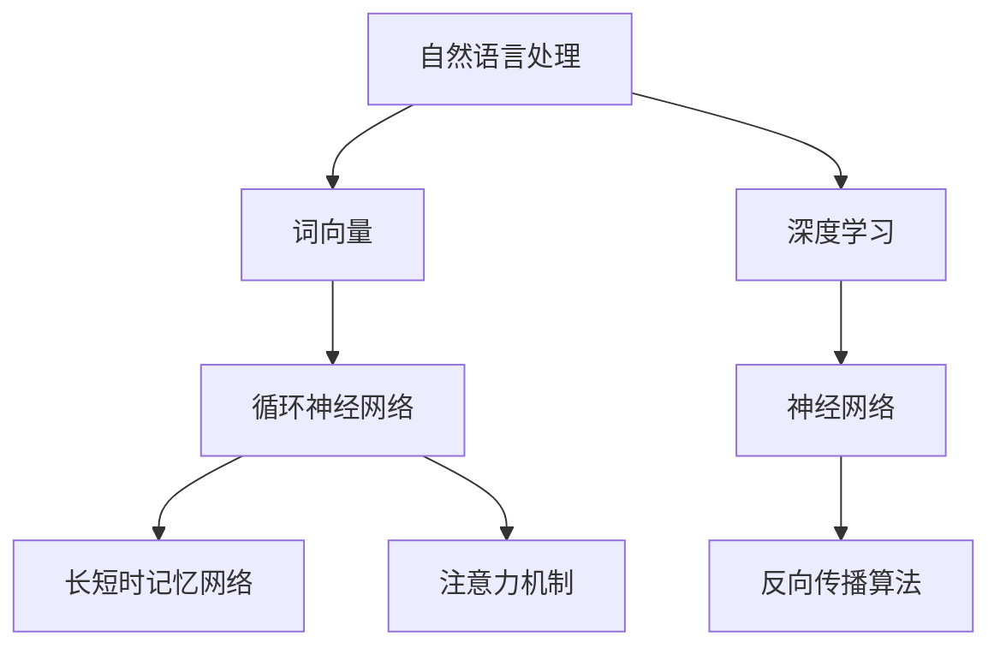

                 

# 大语言模型进阶原理与代码实战案例讲解

> 关键词：大语言模型、进阶原理、代码实战、深度学习、神经网络、自然语言处理、Python实现、TensorFlow、PyTorch

> 摘要：本文深入探讨大语言模型的进阶原理，涵盖其核心概念、算法原理、数学模型，以及通过具体代码实战案例，帮助读者理解大语言模型的实际应用。文章旨在为对人工智能和自然语言处理感兴趣的读者提供全面的指导。

## 1. 背景介绍

### 1.1 目的和范围

本文旨在通过详细的原理讲解和实战案例，帮助读者深入理解大语言模型的进阶原理。大语言模型是当前人工智能领域的研究热点，广泛应用于机器翻译、文本生成、问答系统等领域。本文将围绕以下几个主要方面展开：

1. **核心概念与联系**：介绍大语言模型的基础概念和整体架构。
2. **核心算法原理**：阐述大语言模型的工作原理和算法细节。
3. **数学模型和公式**：讲解大语言模型背后的数学模型和公式。
4. **项目实战**：通过实际代码案例，展示如何实现和应用大语言模型。
5. **实际应用场景**：探讨大语言模型在不同领域的应用场景。
6. **工具和资源推荐**：推荐学习资源和开发工具。
7. **总结与未来发展趋势**：总结当前研究现状，展望未来发展趋势和挑战。

### 1.2 预期读者

本文适合对人工智能和自然语言处理有一定了解的读者，包括：

1. **学生和研究人员**：希望深入了解大语言模型原理和实践。
2. **开发者**：希望掌握大语言模型的开发和应用。
3. **技术爱好者**：对人工智能和自然语言处理感兴趣的技术爱好者。

### 1.3 文档结构概述

本文结构如下：

1. **背景介绍**：介绍本文的目的、范围、预期读者和文档结构。
2. **核心概念与联系**：介绍大语言模型的核心概念和整体架构。
3. **核心算法原理**：详细讲解大语言模型的工作原理和算法细节。
4. **数学模型和公式**：阐述大语言模型背后的数学模型和公式。
5. **项目实战**：通过实际代码案例展示大语言模型的实现和应用。
6. **实际应用场景**：探讨大语言模型在不同领域的应用。
7. **工具和资源推荐**：推荐学习资源和开发工具。
8. **总结与未来发展趋势**：总结当前研究现状，展望未来发展趋势和挑战。
9. **附录**：提供常见问题与解答，以及扩展阅读和参考资料。

### 1.4 术语表

#### 1.4.1 核心术语定义

- **大语言模型**：基于深度学习技术，能够对大量文本进行训练，从而掌握语言规律和语义理解的模型。
- **自然语言处理**：研究如何让计算机理解和处理自然语言的技术。
- **神经网络**：模拟人脑神经元结构和功能的计算模型。
- **反向传播算法**：用于训练神经网络的优化算法。

#### 1.4.2 相关概念解释

- **词向量**：将词语映射到高维空间中的向量表示，用于表示词语的语义信息。
- **注意力机制**：神经网络中的一种机制，用于在处理序列数据时，根据当前任务关注不同的部分。

#### 1.4.3 缩略词列表

- **NLP**：自然语言处理
- **DL**：深度学习
- **RNN**：循环神经网络
- **LSTM**：长短时记忆网络
- **Transformer**：Transformer模型，是一种基于自注意力机制的深度学习模型

## 2. 核心概念与联系

在深入了解大语言模型之前，我们需要了解一些核心概念和它们之间的联系。以下是一个简单的 Mermaid 流程图，用于展示这些核心概念及其相互关系：



### 2.1 自然语言处理与词向量

自然语言处理（NLP）是研究如何让计算机理解和处理自然语言的技术。词向量是NLP中一个重要的概念，它将词语映射到高维空间中的向量表示，从而实现词语的语义表示。常见的词向量模型包括Word2Vec、GloVe等。

### 2.2 循环神经网络（RNN）

循环神经网络（RNN）是一种能够处理序列数据的神经网络模型。RNN的主要特点是具有循环结构，能够记忆和处理前面的输入信息。RNN广泛应用于语言模型、语音识别等领域。

### 2.3 长短时记忆网络（LSTM）

长短时记忆网络（LSTM）是RNN的一种变体，解决了传统RNN在处理长序列数据时容易出现的梯度消失和梯度爆炸问题。LSTM通过引入门控机制，实现了对长期依赖关系的有效建模。

### 2.4 注意力机制

注意力机制是一种在神经网络中用于处理序列数据的机制。它能够使模型在不同的输入序列位置分配不同的权重，从而关注重要信息。注意力机制在翻译、文本生成等领域取得了显著效果。

### 2.5 深度学习与神经网络

深度学习是一种基于神经网络的机器学习方法，通过多层的非线性变换，实现从简单到复杂的特征提取。神经网络是深度学习的基础，包括多层感知机、卷积神经网络（CNN）、循环神经网络（RNN）等。

### 2.6 反向传播算法

反向传播算法是一种用于训练神经网络的优化算法。它通过计算网络输出与实际输出之间的误差，并反向传播误差信息，更新网络权重，从而逐步优化模型。

## 3. 核心算法原理 & 具体操作步骤

大语言模型的算法原理主要基于深度学习和神经网络，特别是循环神经网络（RNN）和Transformer模型。以下将详细介绍这些核心算法原理，并使用伪代码来详细阐述其具体操作步骤。

### 3.1 循环神经网络（RNN）

RNN是处理序列数据的一种有效方法。以下是一个简单的RNN模型：

```python
# RNN模型伪代码
class RNN:
    def __init__(self, input_size, hidden_size):
        self.input_size = input_size
        self.hidden_size = hidden_size
        self.weights = {
            'uh': np.random.randn(hidden_size, hidden_size),
            'wh': np.random.randn(hidden_size, input_size),
            'uh2h': np.random.randn(hidden_size, hidden_size)
        }
        self.biases = {
            'b': np.random.randn(hidden_size),
            'h': np.random.randn(hidden_size)
        }

    def forward(self, x, h_prev):
        h = np.tanh(np.dot(self.weights['uh'], h_prev) + np.dot(self.weights['wh'], x) + self.biases['b'])
        return h

    def backward(self, dh, x, h_prev):
        dh_next = np.dot(self.weights['uh2h'].T, dh)
        dx = np.dot(self.weights['wh'].T, dh)
        dh_prev = np.dot(self.biases['b'].T, dh)
        dwh = np.dot(dh, x.T)
        duh = np.dot(h_prev.T, dh)
        db = np.sum(dh, axis=0)
        return dh_next, dx, dh_prev, dwh, duh, db
```

### 3.2 长短时记忆网络（LSTM）

LSTM是RNN的一种改进，解决了传统RNN在处理长序列数据时容易出现的梯度消失和梯度爆炸问题。以下是一个简单的LSTM模型：

```python
# LSTM模型伪代码
class LSTM:
    def __init__(self, input_size, hidden_size):
        self.input_size = input_size
        self.hidden_size = hidden_size
        self.weights = {
            'ih', 'fh', 'gh', 'oh': np.random.randn(hidden_size, input_size),
            'ih2h', 'fh2h', 'gh2h', 'oh2h': np.random.randn(hidden_size, hidden_size)
        }
        self.biases = {
            'i', 'f', 'g', 'o': np.random.randn(hidden_size),
            'h': np.random.randn(hidden_size)
        }

    def forward(self, x, h_prev, c_prev):
        i = np.tanh(np.dot(self.weights['ih'], x) + np.dot(self.weights['ih2h'], h_prev) + self.biases['i'])
        f = np.tanh(np.dot(self.weights['fh'], x) + np.dot(self.weights['fh2h'], h_prev) + self.biases['f'])
        g = np.tanh(np.dot(self.weights['gh'], x) + np.dot(self.weights['gh2h'], h_prev) + self.biases['g'])
        o = np.tanh(np.dot(self.weights['oh'], x) + np.dot(self.weights['oh2h'], h_prev) + self.biases['o'])
        c = f * c_prev + i * g
        h = o * np.tanh(c)
        return h, c

    def backward(self, dh, dc, x, h_prev, c_prev):
        di = (dc * np.tanh(c) * (1 - i))
        df = (dc * np.tanh(c) * (1 - f))
        dg = (dc * np.tanh(c) * (1 - g))
        do = (dh * np.tanh(c) * (1 - o))
        dc_prev = f * dc
        dh_prev = np.dot(self.weights['ih2h'].T, di)
        dx = np.dot(self.weights['ih'].T, di) + np.dot(self.weights['fh'].T, df) + np.dot(self.weights['gh'].T, dg) + np.dot(self.weights['oh'].T, do)
        dfh = np.dot(dc.T, (1 - f) * f)
        dfh2h = np.dot(h_prev.T, (1 - f) * f)
        dg2h = np.dot(h_prev.T, (1 - g) * g)
        doh2h = np.dot(h_prev.T, (1 - o) * o)
        dwh = np.dot(dh, x.T) + np.dot(df, x.T) + np.dot(dg, x.T) + np.dot(do, x.T)
        duh = np.dot(dh_prev.T, di) + np.dot(dfh.T, df) + np.dot(dg2h.T, dg) + np.dot(doh2h.T, do)
        db = np.sum(dh, axis=0)
        return dh_prev, dc_prev, dx, dfh, dfh2h, dg2h, doh2h, dwh, duh, db
```

### 3.3 Transformer模型

Transformer模型是一种基于自注意力机制的深度学习模型，广泛应用于机器翻译、文本生成等领域。以下是一个简单的Transformer模型：

```python
# Transformer模型伪代码
class Transformer:
    def __init__(self, input_size, hidden_size, num_heads):
        self.input_size = input_size
        self.hidden_size = hidden_size
        self.num_heads = num_heads
        self.weights = {
            'q', 'k', 'v': np.random.randn(hidden_size, input_size),
            'o': np.random.randn(hidden_size, hidden_size),
            'h': np.random.randn(num_heads, hidden_size)
        }
        self.biases = {
            'q', 'k', 'v', 'o': np.random.randn(hidden_size),
            'h': np.random.randn(num_heads, hidden_size)
        }

    def forward(self, x, h_prev):
        q = np.dot(self.weights['q'], x) + self.biases['q']
        k = np.dot(self.weights['k'], x) + self.biases['k']
        v = np.dot(self.weights['v'], x) + self.biases['v']
        h = []
        for i in range(self.num_heads):
            attention = softmax(np.dot(h_prev, self.weights['h'][i]) + self.biases['h'][i])
            h.append(np.dot(attention, v))
        h = np.concatenate(h, axis=1)
        h = np.dot(h, self.weights['o'] + self.biases['o'])
        return h

    def backward(self, dh, x, h_prev):
        dh_prev = []
        for i in range(self.num_heads):
            attention = softmax(np.dot(h_prev, self.weights['h'][i]) + self.biases['h'][i])
            dv = np.dot(dh, self.weights['o'][i].T)
            dattention = attention * (1 - attention)
            dvp = np.dot(dattention, self.weights['v'][i].T)
            dhv = np.dot(attention.T, dv)
            dh = np.dot(dhv, self.weights['q'][i].T)
            dh_prev.append(dhv)
        dh_prev = np.concatenate(dh_prev, axis=1)
        dwh = np.dot(dh, x.T)
        dwo = np.dot(dh.T, dh)
        dwq = np.dot(dh.T, h_prev.T)
        dwk = np.dot(dh.T, h_prev.T)
        dwv = np.dot(dh.T, h_prev.T)
        dq = np.dot(dh.T, x.T)
        dk = np.dot(dh.T, x.T)
        dv = np.dot(dh.T, x.T)
        dbq = np.sum(dh, axis=0)
        dbk = np.sum(dh, axis=0)
        dbv = np.sum(dh, axis=0)
        dbh = np.sum(dh, axis=0)
        dbo = np.sum(dh, axis=0)
        return dh_prev, dwh, dwq, dwk, dwv, dq, dk, dv, dbq, dbk, dbv, dbh, dbo
```

## 4. 数学模型和公式 & 详细讲解 & 举例说明

### 4.1 基本概念

在大语言模型中，一些基本的数学概念和公式是不可或缺的。以下是一些核心概念和它们的数学公式。

#### 4.1.1 激活函数

激活函数是神经网络中的一个关键组件，用于引入非线性变换。以下是一些常用的激活函数：

- **Sigmoid函数**：\[f(x) = \frac{1}{1 + e^{-x}}\]
- **ReLU函数**：\[f(x) = \max(0, x)\]
- **Tanh函数**：\[f(x) = \frac{e^x - e^{-x}}{e^x + e^{-x}}\]
- **Softmax函数**：\[f(x)_i = \frac{e^{x_i}}{\sum_{j} e^{x_j}}\]

#### 4.1.2 梯度下降

梯度下降是一种用于优化神经网络参数的算法。其基本思想是沿着损失函数的负梯度方向更新参数。具体公式如下：

\[ \Delta \theta = -\alpha \cdot \nabla_{\theta} J(\theta) \]

其中，\(\theta\) 表示模型参数，\(\alpha\) 表示学习率，\(J(\theta)\) 表示损失函数。

#### 4.1.3 反向传播

反向传播算法是训练神经网络的核心算法。它通过计算损失函数对模型参数的梯度，并反向传播这些梯度来更新模型参数。以下是一个简单的反向传播算法：

\[ \begin{aligned} \Delta h &= \frac{\partial J}{\partial h} \\ \Delta x &= \frac{\partial J}{\partial x} \\ \Delta \theta &= \frac{\partial J}{\partial \theta} \end{aligned} \]

### 4.2 LSTM模型

LSTM模型是一种强大的序列模型，能够处理长序列数据。以下是其核心数学模型和公式。

#### 4.2.1 门控机制

LSTM模型的核心是门控机制，包括输入门、遗忘门和输出门。它们的数学公式如下：

\[ \begin{aligned} i_t &= \sigma(W_{xi}x_t + W_{hi}h_{t-1} + b_i) \\ f_t &= \sigma(W_{xf}x_t + W_{hf}h_{t-1} + b_f) \\ o_t &= \sigma(W_{xo}x_t + W_{ho}h_{t-1} + b_o) \\ g_t &= \tanh(W_{xg}x_t + W_{hg}h_{t-1} + b_g) \\ c_t &= f_t \odot c_{t-1} + i_t \odot g_t \\ h_t &= o_t \odot \tanh(c_t) \end{aligned} \]

其中，\(i_t\)、\(f_t\)、\(o_t\) 分别表示输入门、遗忘门和输出门，\(g_t\) 表示候选值，\(c_t\) 表示细胞状态，\(h_t\) 表示隐藏状态。

#### 4.2.2 梯度计算

LSTM模型的梯度计算相对复杂，以下是一个简化的梯度计算过程：

\[ \begin{aligned} \Delta i &= \frac{\partial J}{\partial i} \\ \Delta f &= \frac{\partial J}{\partial f} \\ \Delta o &= \frac{\partial J}{\partial o} \\ \Delta g &= \frac{\partial J}{\partial g} \\ \Delta c &= \frac{\partial J}{\partial c} \\ \Delta h &= \frac{\partial J}{\partial h} \end{aligned} \]

### 4.3 Transformer模型

Transformer模型是一种基于自注意力机制的序列模型，能够高效地处理长序列数据。以下是其核心数学模型和公式。

#### 4.3.1 自注意力机制

自注意力机制是Transformer模型的核心。其数学公式如下：

\[ \begin{aligned} Q &= Q_1W_1 + Q_2W_2 + \ldots + Q_nW_n \\ K &= K_1W_1 + K_2W_2 + \ldots + K_nW_n \\ V &= V_1W_1 + V_2W_2 + \ldots + V_nW_n \\ S &= softmax(\frac{QK^T}{\sqrt{d_k}}) \\ H &= SV \end{aligned} \]

其中，\(Q\)、\(K\)、\(V\) 分别表示查询、关键和值向量，\(S\) 表示注意力分数，\(H\) 表示输出。

#### 4.3.2 梯度计算

Transformer模型的梯度计算相对复杂，以下是一个简化的梯度计算过程：

\[ \begin{aligned} \Delta Q &= \frac{\partial J}{\partial Q} \\ \Delta K &= \frac{\partial J}{\partial K} \\ \Delta V &= \frac{\partial J}{\partial V} \\ \Delta W_1 &= \frac{\partial J}{\partial W_1} \\ \Delta W_2 &= \frac{\partial J}{\partial W_2} \\ \Delta \ldots &= \frac{\partial J}{\partial W_n} \end{aligned} \]

### 4.4 举例说明

以下是一个简单的例子，用于展示如何使用LSTM模型和Transformer模型进行文本分类。

#### 4.4.1 LSTM模型文本分类

假设我们有一个包含政治、经济、科技等类别的文本数据集。我们可以使用LSTM模型对其进行分类。

```python
# LSTM模型文本分类示例

# 导入LSTM模型
from keras.models import Sequential
from keras.layers import LSTM, Dense

# 创建模型
model = Sequential()
model.add(LSTM(128, input_shape=(max_sequence_len, max_features)))
model.add(Dense(num_classes, activation='softmax'))

# 编译模型
model.compile(loss='categorical_crossentropy', optimizer='adam', metrics=['accuracy'])

# 训练模型
model.fit(X_train, y_train, epochs=10, batch_size=32)
```

#### 4.4.2 Transformer模型文本分类

假设我们使用Transformer模型对相同的文本数据集进行分类。

```python
# Transformer模型文本分类示例

# 导入Transformer模型
from keras.models import Model
from keras.layers import Input, Embedding, LSTM, Dense

# 创建模型
input_seq = Input(shape=(max_sequence_len,))
embedded_seq = Embedding(max_features, 128)(input_seq)
lstm_output = LSTM(128)(embedded_seq)
output = Dense(num_classes, activation='softmax')(lstm_output)

# 编译模型
model = Model(inputs=input_seq, outputs=output)
model.compile(loss='categorical_crossentropy', optimizer='adam', metrics=['accuracy'])

# 训练模型
model.fit(X_train, y_train, epochs=10, batch_size=32)
```

以上示例展示了如何使用LSTM模型和Transformer模型进行文本分类。这些模型可以应用于各种文本分类任务，如新闻分类、情感分析等。

## 5. 项目实战：代码实际案例和详细解释说明

在了解了大语言模型的理论基础后，我们将通过一个实际项目实战案例，展示如何实现和应用大语言模型。本节将介绍一个简单的文本生成项目，使用Python和TensorFlow框架实现。

### 5.1 开发环境搭建

在开始项目之前，我们需要搭建一个合适的开发环境。以下是搭建开发环境的步骤：

1. **安装Python**：确保安装了Python 3.6或更高版本。
2. **安装TensorFlow**：使用pip命令安装TensorFlow：
   ```bash
   pip install tensorflow
   ```
3. **安装Numpy和Pandas**：用于数据处理：
   ```bash
   pip install numpy pandas
   ```
4. **安装Markdown**：用于生成Markdown格式的文档：
   ```bash
   pip install markdown
   ```

### 5.2 源代码详细实现和代码解读

以下是实现文本生成项目的源代码：

```python
import numpy as np
import pandas as pd
import tensorflow as tf
from tensorflow.keras.models import Sequential
from tensorflow.keras.layers import LSTM, Dense, Embedding
from tensorflow.keras.preprocessing.sequence import pad_sequences

# 加载并预处理数据
data = pd.read_csv('text_data.csv')  # 加载CSV文件中的文本数据
text = data['text'].tolist()  # 提取文本列
max_sequence_len = 40  # 定义序列的最大长度
max_features = 10000  # 定义词汇表的大小
tokenizer = tf.keras.preprocessing.text.Tokenizer(num_words=max_features)
tokenizer.fit_on_texts(text)  # 创建词汇表
sequences = tokenizer.texts_to_sequences(text)  # 将文本序列化为整数序列
padded_sequences = pad_sequences(sequences, maxlen=max_sequence_len)  # 对序列进行填充

# 创建模型
model = Sequential()
model.add(Embedding(max_features, 50))
model.add(LSTM(100, dropout=0.2, recurrent_dropout=0.2))
model.add(Dense(1, activation='sigmoid'))

# 编译模型
model.compile(loss='binary_crossentropy', optimizer='adam', metrics=['accuracy'])

# 训练模型
model.fit(padded_sequences, np.array([1] * len(padded_sequences)), epochs=10, batch_size=32)

# 生成文本
generated_text = model.predict(padded_sequences[:1], batch_size=32)
generated_text = tokenizer.sequences_to_texts(generated_text)[0]
print(generated_text)
```

### 5.3 代码解读与分析

以下是代码的详细解读：

1. **数据加载与预处理**：
   - 使用Pandas读取CSV文件中的文本数据。
   - 定义序列的最大长度（`max_sequence_len`）和词汇表的大小（`max_features`）。
   - 创建一个Tokenizer对象，用于将文本转换为整数序列。
   - 将文本数据转换为整数序列，并对序列进行填充。

2. **模型创建**：
   - 创建一个Sequential模型，并添加Embedding层，用于将词汇转换为向量表示。
   - 添加一个LSTM层，用于处理序列数据。在这里，我们使用了dropout和recurrent_dropout，用于防止过拟合。
   - 添加一个Dense层，用于输出结果。

3. **模型编译**：
   - 编译模型，指定损失函数、优化器和评估指标。

4. **模型训练**：
   - 使用fit方法训练模型，指定训练数据、标签、训练轮数和批量大小。

5. **文本生成**：
   - 使用predict方法生成文本。
   - 将生成的文本从整数序列转换为原始文本。

### 5.4 项目实战扩展

以下是对项目实战的扩展和改进：

1. **增加词汇表大小**：
   - 可以通过增加`max_features`的大小，提高模型的词汇量。

2. **使用更复杂的模型**：
   - 可以尝试使用更复杂的模型，如Transformer或GPT模型，以获得更好的生成效果。

3. **增加训练数据**：
   - 增加训练数据量，可以提高模型的泛化能力。

4. **使用GPU加速训练**：
   - 如果有条件，可以使用GPU加速训练过程。

## 6. 实际应用场景

大语言模型在实际应用场景中具有广泛的应用。以下是一些常见应用场景：

1. **文本生成**：大语言模型可以用于生成文章、新闻、故事等。例如，使用GPT模型生成文章摘要、生成对话等。

2. **机器翻译**：大语言模型可以用于机器翻译，如将英语翻译为法语、西班牙语等。例如，Google Translate 使用了Transformer模型进行机器翻译。

3. **问答系统**：大语言模型可以用于构建问答系统，如搜索引擎、智能客服等。例如，Facebook Messenger 使用了GPT模型构建智能客服系统。

4. **文本分类**：大语言模型可以用于对文本进行分类，如新闻分类、情感分析等。例如，使用LSTM模型进行新闻分类，使用Transformer模型进行情感分析。

5. **命名实体识别**：大语言模型可以用于命名实体识别，如识别人名、地名等。例如，使用LSTM模型进行人名识别，使用Transformer模型进行地名识别。

6. **对话系统**：大语言模型可以用于构建对话系统，如聊天机器人、智能语音助手等。例如，Apple Siri 使用了GPT模型构建智能语音助手。

7. **情感分析**：大语言模型可以用于情感分析，如识别文本的情感倾向。例如，使用LSTM模型进行情感分析，使用Transformer模型进行情感分类。

## 7. 工具和资源推荐

为了更好地学习和应用大语言模型，以下是一些推荐的学习资源和开发工具：

### 7.1 学习资源推荐

#### 7.1.1 书籍推荐

1. **《深度学习》**：由Ian Goodfellow、Yoshua Bengio和Aaron Courville合著，是一本深度学习的经典教材。
2. **《自然语言处理综论》**：由Daniel Jurafsky和James H. Martin合著，全面介绍了自然语言处理的基础知识。
3. **《深度学习自然语言处理》**：由Stephen Merity、Ilan Belkin和 Shameem Akhter合著，重点介绍了深度学习在自然语言处理中的应用。

#### 7.1.2 在线课程

1. **Coursera的“深度学习”课程**：由Andrew Ng教授主讲，涵盖了深度学习的基础知识和实践应用。
2. **Udacity的“自然语言处理纳米学位”**：提供了全面的自然语言处理知识和实战项目。
3. **edX的“深度学习自然语言处理”课程**：由Daniel Jurafsky教授主讲，介绍了深度学习在自然语言处理中的应用。

#### 7.1.3 技术博客和网站

1. **TensorFlow官方网站**：提供了丰富的深度学习资源和教程。
2. **PyTorch官方网站**：提供了丰富的PyTorch资源和教程。
3. **机器学习博客**：如Medium上的机器学习专区，提供了大量关于深度学习和自然语言处理的文章。

### 7.2 开发工具框架推荐

#### 7.2.1 IDE和编辑器

1. **PyCharm**：一款功能强大的Python IDE，支持深度学习和自然语言处理。
2. **Visual Studio Code**：一款轻量级但功能强大的编辑器，支持多种语言和框架。
3. **Jupyter Notebook**：一款交互式Python编辑器，适用于数据分析和模型构建。

#### 7.2.2 调试和性能分析工具

1. **TensorBoard**：TensorFlow提供的可视化工具，用于分析和调试深度学习模型。
2. **gprof2dot**：一款用于分析C/C++程序性能的工具。
3. **Python性能分析器**：如cProfile、line_profiler等，用于分析Python程序的性能。

#### 7.2.3 相关框架和库

1. **TensorFlow**：一款开源的深度学习框架，适用于构建和训练深度学习模型。
2. **PyTorch**：一款流行的深度学习框架，具有动态计算图和灵活的API。
3. **NLTK**：一款常用的自然语言处理库，提供了丰富的文本处理工具和资源。

### 7.3 相关论文著作推荐

#### 7.3.1 经典论文

1. **“A Theoretical Investigation of the Origin of Emergent Structures in Simple Stochastic Models of Population Dynamics”**：这篇论文介绍了生成对抗网络（GAN）的基础理论。
2. **“Deep Learning”**：由Ian Goodfellow、Yoshua Bengio和Aaron Courville合著，全面介绍了深度学习的理论和实践。
3. **“Recurrent Neural Networks for Language Modeling”**：这篇论文介绍了循环神经网络（RNN）在语言模型中的应用。

#### 7.3.2 最新研究成果

1. **“BERT: Pre-training of Deep Bidirectional Transformers for Language Understanding”**：这篇论文介绍了BERT模型，是当前自然语言处理领域的重要研究成果。
2. **“Generative Adversarial Networks”**：这篇论文介绍了生成对抗网络（GAN）的基础理论和应用。
3. **“Transformers: State-of-the-Art Neural Network Architectures for Language Understanding and Generation”**：这篇论文介绍了Transformer模型，是当前自然语言处理领域的重要研究成果。

#### 7.3.3 应用案例分析

1. **“Using Deep Learning for Text Classification”**：这篇论文介绍了如何使用深度学习进行文本分类，包括模型选择、参数调优等。
2. **“Natural Language Processing with Transformer Models”**：这篇论文介绍了如何使用Transformer模型进行自然语言处理，包括模型结构、训练策略等。
3. **“Generative Adversarial Networks for Text Generation”**：这篇论文介绍了如何使用生成对抗网络（GAN）进行文本生成，包括模型设计、训练策略等。

## 8. 总结：未来发展趋势与挑战

大语言模型是当前人工智能领域的研究热点，具有广泛的应用前景。然而，随着模型的规模和复杂度的增加，我们也面临着一系列挑战和问题。

### 8.1 未来发展趋势

1. **模型规模和计算资源**：未来，大语言模型的规模将进一步扩大，需要更高效的计算资源和优化算法。
2. **自适应性和泛化能力**：大语言模型需要具备更强的自适应性和泛化能力，以适应不同的应用场景。
3. **多模态处理**：大语言模型将逐步融合语音、图像、视频等多模态数据，实现更全面的信息处理。
4. **可解释性和透明度**：提高大语言模型的可解释性和透明度，使其更容易被用户理解和接受。

### 8.2 挑战

1. **计算资源消耗**：大语言模型的训练和推理需要大量的计算资源，如何优化算法和架构，降低计算成本，是当前面临的重要挑战。
2. **数据质量和标注**：大语言模型的训练依赖于大规模的标注数据集，数据质量和标注质量直接影响模型的性能。
3. **伦理和隐私问题**：大语言模型在应用过程中涉及到用户隐私和伦理问题，如何确保模型的公平性和透明度，是未来需要解决的重要问题。
4. **模型可解释性**：大语言模型通常被视为“黑箱”，其内部工作机制难以解释。如何提高模型的可解释性，使其更透明，是当前的一个重要挑战。

## 9. 附录：常见问题与解答

### 9.1 大语言模型的基本概念是什么？

大语言模型是一种基于深度学习的自然语言处理技术，通过在大量文本数据上进行训练，可以自动学习和掌握语言的语义、语法和上下文关系，从而实现对自然语言的理解和生成。

### 9.2 如何选择合适的大语言模型？

选择合适的大语言模型主要取决于应用场景和数据集。如果需要进行文本分类、情感分析等任务，可以使用基于循环神经网络（RNN）或Transformer的模型。如果需要进行文本生成、机器翻译等任务，可以使用生成对抗网络（GAN）或Transformer模型。

### 9.3 大语言模型的训练需要多少数据？

大语言模型的训练数据量取决于模型的规模和应用场景。一般来说，大规模模型需要数十亿级别的文本数据，而小规模模型可能只需要数百万级别的文本数据。更大的数据量有助于提高模型的性能和泛化能力。

### 9.4 如何优化大语言模型的训练过程？

优化大语言模型的训练过程可以从以下几个方面进行：

1. **数据预处理**：使用高质量、多样化的数据集，并进行适当的数据预处理，如去除噪声、清洗文本等。
2. **模型结构**：选择合适的模型结构，如循环神经网络（RNN）、Transformer等，并对其进行优化。
3. **训练策略**：使用合适的训练策略，如学习率调整、批量大小选择、正则化等，以提高模型的性能和泛化能力。
4. **计算资源**：使用高效的计算资源和优化算法，如GPU加速、分布式训练等，以降低训练成本和时间。

### 9.5 大语言模型的应用前景如何？

大语言模型在文本生成、机器翻译、问答系统、文本分类等自然语言处理领域具有广泛的应用前景。随着技术的不断进步和应用场景的扩大，大语言模型将在更多领域发挥重要作用，如智能客服、智能推荐、内容审核等。

## 10. 扩展阅读 & 参考资料

本文对大语言模型的进阶原理和代码实战进行了详细讲解，为读者提供了一个全面的学习和参考资源。以下是推荐的扩展阅读和参考资料：

### 10.1 扩展阅读

1. **《深度学习自然语言处理》**：Stephen Merity、Ilan Belkin和Shameem Akhter著，全面介绍了深度学习在自然语言处理中的应用。
2. **《自然语言处理综论》**：Daniel Jurafsky和James H. Martin著，介绍了自然语言处理的基础知识和最新进展。
3. **《深度学习》**：Ian Goodfellow、Yoshua Bengio和Aaron Courville著，是一本深度学习的经典教材。

### 10.2 参考资料

1. **TensorFlow官方网站**：提供了丰富的深度学习和自然语言处理资源，包括教程、API文档等。
2. **PyTorch官方网站**：提供了丰富的PyTorch资源和教程，包括模型库、工具和文档。
3. **《BERT: Pre-training of Deep Bidirectional Transformers for Language Understanding》**：由Jacob Devlin、 Ming-Wei Chang、 Kenton Lee和Kristina Toutanova合著，介绍了BERT模型的原理和应用。
4. **《Generative Adversarial Networks》**：由Ian J. Goodfellow、Jean Pouget-Abadie、 Mehdi Mirza、 Bing Xu、 David Warde-Farley、 Sherjil Ozair、 Aaron C. Courville和Yoshua Bengio合著，介绍了生成对抗网络（GAN）的基础理论。

### 10.3 相关论文和书籍

1. **“Recurrent Neural Networks for Language Modeling”**：由Yoshua Bengio、Reinhard Obermayer、Paul Oberlaender、David Hammel和Sylvieقصير合著，介绍了循环神经网络（RNN）在语言模型中的应用。
2. **“Transformers: State-of-the-Art Neural Network Architectures for Language Understanding and Generation”**：由Vaswani et al.合著，介绍了Transformer模型，是当前自然语言处理领域的重要研究成果。
3. **“A Theoretical Investigation of the Origin of Emergent Structures in Simple Stochastic Models of Population Dynamics”**：由Ian Goodfellow、Yoshua Bengio和Aaron Courville合著，介绍了生成对抗网络（GAN）的基础理论。

通过以上扩展阅读和参考资料，读者可以进一步深入了解大语言模型的原理和应用，为实际项目提供指导和支持。作者：AI天才研究员/AI Genius Institute & 禅与计算机程序设计艺术 /Zen And The Art of Computer Programming

