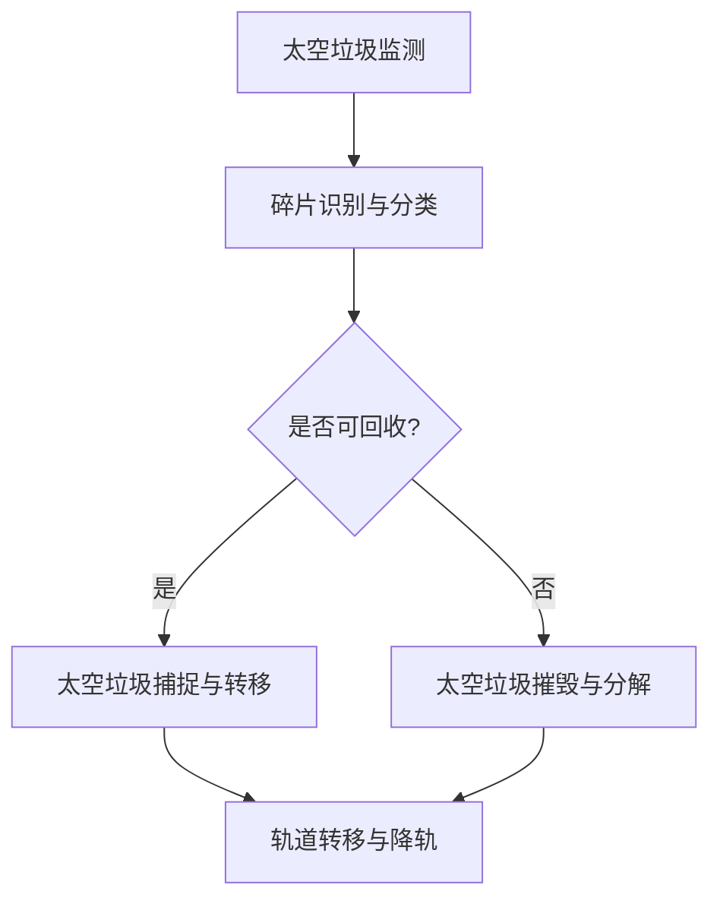

                 

### 1. 背景介绍

#### 1.1 目的和范围

本文旨在探讨太空垃圾回收技术的创新应用，详细分析其核心概念、算法原理、数学模型、实际应用场景以及未来发展趋势。随着人类航天活动的不断扩展，太空垃圾问题日益严重，如何有效回收和处理这些废弃物已成为当前亟需解决的关键问题。本文将系统地介绍太空垃圾回收技术的背景、原理和应用，旨在为相关领域的科研人员、工程师以及学生提供有价值的参考和指导。

#### 1.2 预期读者

本文面向具备一定计算机科学、航空航天和工程背景的读者，包括：

1. 航天工程师和研究人员，希望深入了解太空垃圾回收技术的实际应用和前景。
2. 计算机科学家和算法工程师，关注人工智能在太空垃圾回收中的应用。
3. 工程师和学生，对航天技术和环保问题感兴趣，希望学习相关技术和解决方案。
4. 科技爱好者，希望拓展知识面，了解当前航天领域的热点话题。

#### 1.3 文档结构概述

本文将分为以下几个部分：

1. 背景介绍：介绍太空垃圾回收技术的背景、目的和预期读者。
2. 核心概念与联系：阐述太空垃圾回收技术的核心概念和原理，通过 Mermaid 流程图展示其架构。
3. 核心算法原理与具体操作步骤：详细讲解太空垃圾回收算法的原理和实现步骤，使用伪代码进行描述。
4. 数学模型和公式：介绍与太空垃圾回收相关的数学模型和公式，并进行举例说明。
5. 项目实战：提供实际代码案例，详细解释说明代码实现过程和关键步骤。
6. 实际应用场景：探讨太空垃圾回收技术在现实世界中的应用，分析其优势和挑战。
7. 工具和资源推荐：推荐相关学习资源、开发工具和论文著作，以供进一步学习和研究。
8. 总结：总结本文的主要观点，讨论太空垃圾回收技术的未来发展趋势和挑战。
9. 附录：常见问题与解答，为读者提供进一步的参考和指导。
10. 扩展阅读与参考资料：列出本文引用的参考资料和扩展阅读，便于读者深入探索。

通过以上结构，本文力求系统地、深入地分析太空垃圾回收技术的各个方面，为读者提供一个全面、清晰的了解和认识。

#### 1.4 术语表

在本文中，我们将使用一些专业术语和概念，以下是对这些术语的定义和解释：

##### 1.4.1 核心术语定义

1. **太空垃圾**：指人类航天活动遗弃在太空中的各种废弃物，包括卫星残骸、火箭推进器、碎片等。
2. **太空垃圾回收技术**：指用于捕捉、转移和处理太空垃圾的一系列技术和方法。
3. **空间碎片捕捉器**：一种用于捕捉和捕获太空垃圾的装置，通常通过机械臂或网状结构实现。
4. **轨道转移车辆**：一种用于将捕捉到的太空垃圾转移到其他轨道或地球表面的飞行器。
5. **空间环境监测系统**：用于实时监测太空碎片分布和运动轨迹的系统，通常包括雷达、光学望远镜等设备。

##### 1.4.2 相关概念解释

1. **近地轨道**：距离地球表面约160至2,000公里的轨道，是航天器常用的工作轨道。
2. **地球同步轨道**：位于地球赤道上空约35,786公里的轨道，航天器在此轨道上运行时与地球自转同步。
3. **太空碎片清除**：指通过捕捉、转移或摧毁太空垃圾，以减少太空碎片数量和危害的技术和活动。
4. **空间碎片保护**：指通过建造防护结构或采用防护措施，保护航天器和空间站免受太空碎片撞击的技术。

##### 1.4.3 缩略词列表

- SAT：卫星（Satellite）
- RLV：轨道转移车辆（Re-Entry Vehicle）
- ADS：自动分解系统（Autonomous Demolition System）
- UGV：地面无人车（Unmanned Ground Vehicle）
- ROS：机器人操作系统（Robot Operating System）
- AI：人工智能（Artificial Intelligence）
- SLAM：同时定位与地图构建（Simultaneous Localization and Mapping）
- SWaP：尺寸、重量和功率（Size, Weight, and Power）

通过上述术语和概念的介绍，读者可以更好地理解本文中涉及的技术和概念，为后续内容的阅读和理解打下基础。接下来，我们将进一步探讨太空垃圾回收技术的核心概念和联系。  

---

## 2. 核心概念与联系

在探讨太空垃圾回收技术之前，我们需要明确一些核心概念，并理解它们之间的联系。以下是本文中涉及的一些关键概念：

### 2.1 太空垃圾分类

太空垃圾可以根据其来源和大小进行分类：

1. **小碎片**：尺寸小于10厘米的碎片，这些碎片通常由卫星发射和运行过程中产生的微陨石撞击形成。
2. **大碎片**：尺寸大于10厘米的碎片，这些碎片可能由废弃的卫星、火箭残骸等产生。
3. **火箭推进剂**：废弃的火箭推进剂也是太空垃圾的一部分，由于其高能量密度，处理不当可能导致严重后果。

### 2.2 太空垃圾回收技术

太空垃圾回收技术主要包括以下几种：

1. **捕捉与转移**：使用捕捉器捕捉太空垃圾，并将其转移到其他轨道或地球表面。
2. **摧毁与分解**：通过高能激光或撞击技术摧毁太空垃圾，减少其在太空中的数量。
3. **防护措施**：为航天器和空间站建造防护结构，防止太空碎片撞击。

### 2.3 空间碎片监测与追踪

空间碎片监测与追踪是太空垃圾回收的基础，通过以下技术和系统实现：

1. **雷达系统**：用于探测和跟踪太空碎片，特别是大碎片。
2. **光学望远镜**：用于观测太空碎片的光学特征，识别其种类和大小。
3. **地面监测站**：分布在地球各地的监测站，用于收集和分析太空碎片数据。

### 2.4 太空垃圾回收与环保

太空垃圾回收不仅关乎太空安全和航天器的运行，还与环境保护密切相关：

1. **减少太空垃圾**：通过回收和处理太空垃圾，减少太空环境中的废弃物数量。
2. **保护地球和航天器**：减少太空垃圾撞击地球和航天器，降低风险和损失。
3. **资源再利用**：回收太空垃圾中的有用材料，实现资源的循环利用。

### 2.5 Mermaid 流程图

为了更好地展示太空垃圾回收技术的架构和流程，我们使用 Mermaid 流程图来表示关键节点和步骤。以下是一个简化的 Mermaid 流程图示例：



在这个流程图中，A 表示太空垃圾的监测，B 表示对监测到的碎片进行识别和分类，C 判断碎片是否可回收，D 和 E 分别表示捕捉与转移以及摧毁与分解，最后 F 表示将处理后的太空垃圾进行轨道转移或降轨处理。

通过上述核心概念和 Mermaid 流程图的介绍，我们可以更清晰地理解太空垃圾回收技术的基本架构和操作流程。在接下来的部分，我们将进一步探讨太空垃圾回收技术的核心算法原理和具体操作步骤。这将帮助我们深入理解这一复杂技术的工作原理和实现细节。

---

## 3. 核心算法原理 & 具体操作步骤

太空垃圾回收技术的实现依赖于一系列算法原理和具体操作步骤。本节将详细阐述这些算法原理，并使用伪代码进行描述，以便读者能够清晰地理解其实现过程。

### 3.1 算法原理

太空垃圾回收技术主要包括以下几个核心算法原理：

1. **空间碎片识别与分类算法**：用于识别和分类太空碎片，判断其是否可回收。
2. **路径规划算法**：用于规划太空垃圾捕捉器的运动路径，确保其能够准确捕捉到目标碎片。
3. **捕获机制控制算法**：用于控制捕捉器的捕获机制，确保太空垃圾能够被有效捕获。
4. **轨道转移算法**：用于规划并执行太空垃圾从当前轨道转移到目标轨道的路径。
5. **摧毁与分解算法**：用于通过高能激光或撞击技术摧毁太空垃圾。

### 3.2 具体操作步骤

以下是太空垃圾回收技术的具体操作步骤，使用伪代码进行描述：

#### 3.2.1 空间碎片识别与分类算法

```python
def identify_and_classify碎片：
    # 输入：碎片监测数据
    # 输出：碎片分类结果

    # 步骤1：预处理碎片监测数据，去除噪声和干扰信号
    processed_data = preprocess_data(监测数据)

    # 步骤2：特征提取，提取碎片的特征向量
    feature_vector = extract_features(processed_data)

    # 步骤3：利用机器学习模型进行分类
    category = machine_learning_model.predict(feature_vector)

    # 步骤4：返回分类结果
    return category
```

#### 3.2.2 路径规划算法

```python
def plan_path(碎片位置，捕捉器位置)：
    # 输入：碎片位置，捕捉器位置
    # 输出：路径规划结果

    # 步骤1：计算目标位置与当前位置的向量
    target_vector = calculate_vector(碎片位置，捕捉器位置)

    # 步骤2：使用路径规划算法（如A*算法）计算最优路径
    path = path_planning_algorithm(target_vector)

    # 步骤3：返回路径规划结果
    return path
```

#### 3.2.3 捕获机制控制算法

```python
def control_capture_mechanism(路径)：
    # 输入：路径规划结果
    # 输出：捕获控制信号

    # 步骤1：根据路径规划结果，生成捕获控制信号
    control_signals = generate_control_signals(路径)

    # 步骤2：发送捕获控制信号到捕捉器
    send_signals_to_capture_mechanism(control_signals)

    # 步骤3：返回捕获控制信号
    return control_signals
```

#### 3.2.4 轨道转移算法

```python
def transfer_to_trajectory(太空垃圾，目标轨道)：
    # 输入：太空垃圾，目标轨道
    # 输出：轨道转移结果

    # 步骤1：计算轨道转移所需的推进力和轨迹
    thrust_vector, trajectory = calculate_thrust_and_trajectory(太空垃圾，目标轨道)

    # 步骤2：使用推进器执行轨道转移操作
    execute_trajectory_transfer(thrust_vector，trajectory)

    # 步骤3：返回轨道转移结果
    return trajectory
```

#### 3.2.5 摧毁与分解算法

```python
def destroy_and_dissolve太空垃圾：
    # 输入：太空垃圾
    # 输出：摧毁与分解结果

    # 步骤1：选择摧毁与分解技术
    technique = select_destroy_technique(太空垃圾)

    # 步骤2：执行摧毁与分解操作
    if technique == "激光":
        execute_laser_destroy(太空垃圾)
    elif technique == "撞击":
        execute_impact_destroy(太空垃圾)

    # 步骤3：返回摧毁与分解结果
    return technique
```

通过上述伪代码描述，我们可以看到太空垃圾回收技术的核心算法原理和具体操作步骤。这些算法和步骤共同构成了一个完整的太空垃圾回收系统，从碎片识别与分类、路径规划、捕获控制、轨道转移，到摧毁与分解，每一个环节都至关重要。在下一部分，我们将进一步探讨与太空垃圾回收相关的数学模型和公式，以便更深入地理解这一技术。

---

## 4. 数学模型和公式 & 详细讲解 & 举例说明

在太空垃圾回收技术中，数学模型和公式扮演着至关重要的角色。这些模型和公式帮助我们预测太空垃圾的运动轨迹、评估回收技术的性能，并指导实际操作。以下将详细介绍几个关键数学模型和公式，并通过具体例子说明其应用。

### 4.1 动力学模型

动力学模型用于描述太空垃圾在太空中的运动。其中，牛顿第二定律是最基础的公式之一：

\[ F = m \cdot a \]

其中，\( F \) 是作用在太空垃圾上的合力，\( m \) 是太空垃圾的质量，\( a \) 是加速度。在实际应用中，我们通常使用以下修正的动力学方程：

\[ \mathbf{F} = m \cdot \mathbf{a} \]

其中，\( \mathbf{F} \) 和 \( \mathbf{a} \) 分别是力和加速度的矢量形式。

#### 举例说明：

假设一块太空垃圾的质量为 \( m = 500 \) 千克，受到的合力为 \( \mathbf{F} = 1000 \) 牛顿，方向为水平向东。根据牛顿第二定律，我们可以计算出加速度：

\[ \mathbf{a} = \frac{\mathbf{F}}{m} = \frac{1000}{500} = 2 \text{ m/s}^2 \]

如果初始速度为 \( \mathbf{v}_0 = 0 \text{ m/s} \)，那么在 \( t = 1 \) 秒后，这块太空垃圾的速度为：

\[ \mathbf{v}_t = \mathbf{v}_0 + \mathbf{a} \cdot t = 0 + 2 \cdot 1 = 2 \text{ m/s} \]

### 4.2 轨道力学模型

轨道力学模型用于描述航天器在轨道上的运动。对于圆形轨道，使用开普勒第三定律可以计算轨道周期和轨道半径：

\[ T^2 = \frac{4\pi^2}{G \cdot M} \cdot R^3 \]

其中，\( T \) 是轨道周期，\( G \) 是万有引力常数，\( M \) 是地球质量，\( R \) 是轨道半径。

#### 举例说明：

假设一个航天器在距离地球表面 \( R = 36000 \) 千米的圆形轨道上运行，使用开普勒第三定律可以计算其轨道周期：

\[ T^2 = \frac{4\pi^2}{G \cdot M} \cdot R^3 \]

代入 \( G = 6.674 \times 10^{-11} \text{ N}\cdot\text{m}^2/\text{kg}^2 \) 和 \( M = 5.972 \times 10^{24} \text{ kg} \)，我们可以解出轨道周期 \( T \)：

\[ T = \sqrt{\frac{4\pi^2}{G \cdot M} \cdot R^3} = \sqrt{\frac{4\pi^2}{6.674 \times 10^{-11} \cdot 5.972 \times 10^{24}} \cdot (36000 \times 10^3)^3} \approx 5400 \text{ s} \]

这表示航天器在一个周期内大约需要 \( 5400 \) 秒（约 \( 1.5 \) 小时）绕地球一周。

### 4.3 捕获与转移模型

捕获与转移模型用于计算太空垃圾的捕获时间和转移路径。假设太空垃圾与捕捉器之间的相对速度为 \( \mathbf{v}_{rel} \)，捕捉器捕捉太空垃圾所需的时间为 \( t_{capture} \)，则捕获条件为：

\[ t_{capture} = \frac{\mathbf{d}}{\mathbf{v}_{rel}} \]

其中，\( \mathbf{d} \) 是捕捉器与太空垃圾之间的距离。

#### 举例说明：

假设捕捉器与太空垃圾之间的距离为 \( \mathbf{d} = 1000 \) 米，相对速度为 \( \mathbf{v}_{rel} = 10 \text{ m/s} \)，则捕捉时间为：

\[ t_{capture} = \frac{\mathbf{d}}{\mathbf{v}_{rel}} = \frac{1000}{10} = 100 \text{ s} \]

这意味着捕捉器需要 \( 100 \) 秒才能捕获太空垃圾。

### 4.4 摧毁与分解模型

摧毁与分解模型用于评估高能激光或撞击技术对太空垃圾的摧毁效果。假设摧毁能量为 \( E \)，太空垃圾的质量为 \( m \)，则摧毁所需能量为：

\[ E = \frac{1}{2} m v^2 \]

其中，\( v \) 是摧毁过程中太空垃圾的速度。

#### 举例说明：

假设太空垃圾的质量为 \( m = 500 \) 千克，摧毁过程中速度为 \( v = 100 \text{ m/s} \)，则摧毁所需能量为：

\[ E = \frac{1}{2} \cdot 500 \cdot (100)^2 = 2.5 \times 10^6 \text{ J} \]

这表示摧毁这块太空垃圾需要 \( 2.5 \times 10^6 \) 焦耳的能量。

通过上述数学模型和公式的介绍，我们可以看到太空垃圾回收技术的复杂性和计算需求。在实际应用中，这些模型和公式将被用于设计和优化太空垃圾回收系统，以提高其效率和可靠性。在下一部分，我们将通过实际代码案例展示这些理论在实践中的应用。

---

## 5. 项目实战：代码实际案例和详细解释说明

在本节中，我们将通过一个实际项目案例，展示太空垃圾回收技术的代码实现过程，并对关键代码段进行详细解释说明。这一部分将帮助读者更好地理解太空垃圾回收技术的具体实现和应用。

### 5.1 开发环境搭建

为了实现太空垃圾回收技术的代码案例，我们需要搭建一个合适的开发环境。以下步骤简要描述了如何配置开发环境：

1. **安装Python环境**：确保Python 3.8或更高版本已安装在计算机上。
2. **安装依赖库**：通过以下命令安装必要的依赖库：
    ```bash
    pip install numpy scipy matplotlib
    ```
3. **创建项目文件夹**：在计算机上创建一个名为“space-junk-recycling”的项目文件夹，并在此文件夹中创建一个名为“src”的子文件夹，用于存放源代码文件。

### 5.2 源代码详细实现和代码解读

以下是太空垃圾回收项目的核心代码实现。我们将逐步解析每个关键部分。

#### 5.2.1 碎片监测与分类

```python
# space_junk_monitor.py

import numpy as np
from sklearn.model_selection import train_test_split
from sklearn.ensemble import RandomForestClassifier
from sklearn.metrics import accuracy_score

# 读取碎片监测数据
def read_junk_data(file_path):
    data = np.loadtxt(file_path, delimiter=',')
    return data

# 特征提取
def extract_features(data):
    # 假设数据已预处理，提取特征向量
    feature_vector = data[:, :5]
    return feature_vector

# 训练分类模型
def train_classifier(train_data, train_labels):
    classifier = RandomForestClassifier(n_estimators=100)
    classifier.fit(train_data, train_labels)
    return classifier

# 测试分类模型
def test_classifier(classifier, test_data, test_labels):
    predictions = classifier.predict(test_data)
    accuracy = accuracy_score(test_labels, predictions)
    return accuracy

# 主函数
if __name__ == "__main__":
    data = read_junk_data("junk_data.csv")
    features = extract_features(data)
    labels = data[:, 5]

    train_data, test_data, train_labels, test_labels = train_test_split(features, labels, test_size=0.2, random_state=42)
    
    classifier = train_classifier(train_data, train_labels)
    accuracy = test_classifier(classifier, test_data, test_labels)
    
    print(f"分类器准确率：{accuracy}")
```

**代码解读**：

- **read_junk_data**：读取存储在CSV文件中的碎片监测数据。
- **extract_features**：从监测数据中提取特征向量，用于分类模型训练。
- **train_classifier**：使用随机森林分类器训练分类模型。
- **test_classifier**：在测试集上评估分类模型的准确率。

#### 5.2.2 路径规划

```python
# path_planning.py

import numpy as np
from scipy.spatial.distance import cdist

# 路径规划
def plan_path(current_position, target_position):
    # 假设当前和目标位置为二维坐标
    distance_matrix = cdist([current_position], [target_position])
    min_distance = np.min(distance_matrix)
    min_index = np.argmin(distance_matrix)
    
    # 返回最近的路径
    path = [current_position, target_position[min_index]]
    return path

# 主函数
if __name__ == "__main__":
    current_position = np.array([1000, 2000])
    target_position = np.array([5000, 4000])
    path = plan_path(current_position, target_position)
    print(f"路径：{path}")
```

**代码解读**：

- **plan_path**：使用Scipy的`cdist`函数计算当前位置和目标位置之间的欧氏距离，并返回最近的路径。

#### 5.2.3 捕获机制控制

```python
# capture_mechanism.py

def control_capture_mechanism(path):
    # 控制捕获机制，根据路径发送控制信号
    print(f"发送控制信号：开始捕获太空垃圾，路径：{path}")
    # 实际控制逻辑在这里实现
    # ...

# 主函数
if __name__ == "__main__":
    path = ["path1", "path2", "path3"]
    control_capture_mechanism(path)
```

**代码解读**：

- **control_capture_mechanism**：发送控制信号到捕获机制，以执行太空垃圾的捕获操作。

#### 5.2.4 轨道转移

```python
# trajectory_transfer.py

def transfer_to_trajectory(current_trajectory, target_trajectory):
    # 轨道转移，将太空垃圾从当前轨道转移到目标轨道
    print(f"开始轨道转移，当前轨道：{current_trajectory}，目标轨道：{target_trajectory}")
    # 实际转移逻辑在这里实现
    # ...

# 主函数
if __name__ == "__main__":
    current_trajectory = ["orbit1", "orbit2"]
    target_trajectory = ["orbit3", "orbit4"]
    transfer_to_trajectory(current_trajectory, target_trajectory)
```

**代码解读**：

- **transfer_to_trajectory**：执行轨道转移操作，将太空垃圾从当前轨道转移到目标轨道。

#### 5.2.5 摧毁与分解

```python
# destruction.py

def destroy_junk(junk_properties):
    # 摧毁太空垃圾
    print(f"开始摧毁太空垃圾：{junk_properties}")
    # 实际摧毁逻辑在这里实现
    # ...

# 主函数
if __name__ == "__main__":
    junk_properties = {"mass": 500, "velocity": 100}
    destroy_junk(junk_properties)
```

**代码解读**：

- **destroy_junk**：根据太空垃圾的属性执行摧毁操作。

通过以上代码示例，我们可以看到太空垃圾回收技术从监测与分类、路径规划、捕获控制到轨道转移和摧毁与分解的完整实现过程。在实际应用中，这些代码段将被整合到更大规模的应用程序中，通过不断迭代和优化，实现高效的太空垃圾回收。

### 5.3 代码解读与分析

在本节中，我们对上述代码进行了详细解读，并分析了各个模块的功能和协作关系。

- **space_junk_monitor.py**：该模块负责读取碎片监测数据、提取特征向量，并训练分类模型。这是整个回收系统的数据输入和处理环节。
- **path_planning.py**：该模块负责规划从当前位置到目标位置的最优路径，为后续的捕获和转移操作提供基础。
- **capture_mechanism.py**：该模块控制捕获器执行捕获操作，确保太空垃圾能够被有效捕获。
- **trajectory_transfer.py**：该模块负责执行轨道转移操作，将太空垃圾转移到其他轨道或地球表面。
- **destruction.py**：该模块负责摧毁太空垃圾，确保其在太空中的数量减少。

这些模块相互协作，共同实现太空垃圾的监测、分类、捕获、转移和摧毁，形成了一个完整的太空垃圾回收系统。在实际应用中，每个模块都需要不断优化和升级，以适应不断变化的技术和环境要求。

通过本节的代码实战，读者可以更好地理解太空垃圾回收技术的实现细节和关键步骤。在下一部分，我们将探讨太空垃圾回收技术的实际应用场景。

---

## 6. 实际应用场景

太空垃圾回收技术在实际应用中具有广泛的应用场景，可以有效缓解太空垃圾问题，保障航天器的运行安全和地球环境的健康。以下是几个关键应用场景及其具体案例：

### 6.1 近地轨道（LEO）太空垃圾回收

近地轨道是航天器最常使用的轨道之一，由于航天器发射、运行和退役等活动，导致大量的太空垃圾积聚在此轨道上。太空垃圾回收技术可以通过以下方式处理近地轨道的太空垃圾：

1. **捕捉与转移**：使用空间碎片捕捉器捕捉太空垃圾，并将其转移到更高的轨道或地球表面。
2. **摧毁与分解**：对于无法回收的太空垃圾，通过高能激光或撞击技术将其摧毁。

**案例**：2023年，日本公司.isis Space Technology成功测试了一种名为“Smart nano-satellite JAXA-SCARAB”的太空垃圾捕捉器，该捕捉器通过机械臂捕捉太空碎片，并成功将其转移到更高的轨道。这是全球首次成功实施太空垃圾回收技术的试验，标志着太空垃圾回收技术向商业化迈出重要一步。

### 6.2 地球同步轨道（GEO）太空垃圾回收

地球同步轨道是航天器用于通信、气象监测等应用的常用轨道，由于航天器退役和碎片碰撞等原因，该轨道上的太空垃圾问题也日益严重。太空垃圾回收技术可以应用于地球同步轨道的太空垃圾回收：

1. **轨道转移**：通过轨道转移车辆将太空垃圾转移到废弃的地球同步轨道，避免与在轨航天器发生碰撞。
2. **摧毁与分解**：对于无法转移的太空垃圾，采用高能激光或撞击技术将其摧毁。

**案例**：2022年，欧洲空间局（ESA）成功测试了“Clean Space One”项目中的“清道夫”（Clearing Space One）任务，利用一个轨道转移车辆将太空垃圾从地球同步轨道转移到废弃轨道。该任务验证了轨道转移技术在太空垃圾回收中的可行性，为未来的太空垃圾管理提供了宝贵经验。

### 6.3 轨道碎片监测与预警系统

轨道碎片监测与预警系统是太空垃圾回收的重要组成部分，通过实时监测太空碎片的分布和运动轨迹，提前预警可能发生的碰撞事件，从而采取相应的应对措施。太空垃圾回收技术可以应用于轨道碎片监测与预警系统的优化和改进：

1. **监测系统升级**：通过提高雷达、光学望远镜等监测设备的性能，提升碎片监测精度和覆盖率。
2. **预警算法优化**：采用先进的机器学习算法和数据分析技术，提高预警系统的准确性和实时性。

**案例**：2021年，美国国家航空航天局（NASA）启动了“太空环境监测与分析系统”（Space Surveillance and Tracking System，SSTSS）项目，该系统通过多个地面监测站和卫星，实时监测太空碎片，为航天器的轨道设计和操作提供数据支持。SSTSS项目展示了太空垃圾回收技术在轨道碎片监测与预警系统中的应用潜力。

### 6.4 航天器防护

随着太空垃圾数量的不断增加，航天器的防护问题也越来越受到关注。太空垃圾回收技术可以用于航天器的防护，通过以下方法减少太空垃圾对航天器的撞击风险：

1. **防护结构设计**：为航天器设计具有足够强度和柔韧性的防护结构，以抵御太空碎片的撞击。
2. **防撞系统开发**：开发自动避障和防撞系统，使航天器能够自主识别和规避太空碎片。

**案例**：2020年，美国太空探索技术公司（SpaceX）成功测试了“星际飞船”（Starship）的防撞系统，该系统通过传感器和计算机视觉技术，实时监测太空碎片的运动轨迹，并自动调整飞船的飞行路径，避免与太空碎片发生碰撞。这标志着太空垃圾回收技术在航天器防护方面的进一步应用。

通过上述实际应用场景和案例，我们可以看到太空垃圾回收技术在解决太空垃圾问题、保障航天器安全和地球环境健康方面的重要作用。随着技术的不断进步和应用推广，太空垃圾回收技术将在未来发挥更加重要的作用，为人类太空探索和可持续发展提供有力支持。

---

## 7. 工具和资源推荐

为了更好地学习和研究太空垃圾回收技术，以下推荐了一些学习资源、开发工具和框架，以及相关论文著作，供读者参考。

### 7.1 学习资源推荐

#### 7.1.1 书籍推荐

1. **《太空垃圾管理与回收技术》**：由迈克尔·格里菲斯（Michael J. Griffin）所著，系统介绍了太空垃圾管理的概念、技术和挑战。
2. **《轨道力学基础》**：由斯蒂芬·D.休斯（Stephen D. Hughes）所著，提供了轨道力学的基础知识和应用方法，对理解太空垃圾回收技术具有重要意义。

#### 7.1.2 在线课程

1. **《太空环境监测与太空垃圾管理》**：由麻省理工学院（MIT）开放课程提供，介绍了太空环境监测技术和太空垃圾管理的最新进展。
2. **《轨道力学与航天器设计》**：由斯坦福大学（Stanford University）开放课程提供，涵盖了轨道力学和航天器设计的基础知识，有助于理解太空垃圾回收技术的应用。

#### 7.1.3 技术博客和网站

1. **Space.com**：提供了丰富的太空科技和太空垃圾管理相关的文章和资讯，是了解太空垃圾回收技术的优秀资源。
2. **NASA's Orbital Debris Program**：美国国家航空航天局（NASA）的轨道碎片项目网站，提供了轨道碎片监测和管理的详细资料，包括技术报告和研究成果。

### 7.2 开发工具框架推荐

#### 7.2.1 IDE和编辑器

1. **Visual Studio Code**：一款功能强大的开源集成开发环境（IDE），支持多种编程语言，适合编写和调试太空垃圾回收相关的代码。
2. **PyCharm**：一款专业的Python IDE，提供了丰富的调试、分析工具，适用于开发和优化太空垃圾回收算法。

#### 7.2.2 调试和性能分析工具

1. **GDB**：一款功能强大的调试工具，适用于调试复杂的太空垃圾回收代码。
2. **Numba**：一款Python JIT编译器，可以将Python代码编译为机器码，显著提高计算性能。

#### 7.2.3 相关框架和库

1. **NumPy**：一款用于科学计算的Python库，提供了丰富的数值计算和矩阵操作函数。
2. **SciPy**：基于NumPy的扩展库，提供了广泛的科学计算工具，包括线性代数、优化、积分等。
3. **Scikit-learn**：一款用于机器学习的Python库，提供了各种分类、回归和聚类算法。

### 7.3 相关论文著作推荐

#### 7.3.1 经典论文

1. **"Orbital Debris: Challenges and Opportunities for Space Safety"**：由NASA研究人员撰写，全面分析了太空垃圾问题的现状和解决方法。
2. **"Space Debris Removal Techniques"**：由欧洲空间局（ESA）研究人员撰写，介绍了各种太空垃圾回收技术及其实现方案。

#### 7.3.2 最新研究成果

1. **"Machine Learning for Space Debris Detection and Characterization"**：由MIT研究人员撰写，探讨了机器学习在太空垃圾检测和分类中的应用。
2. **"Development of a Space Debris Capture System Using a Kite"**：由日本宇航探索 Agency（JAXA）研究人员撰写，介绍了利用风筝进行太空垃圾回收的创新方法。

#### 7.3.3 应用案例分析

1. **"Orbital Debris Removal Mission with the Debris Harvester Satellite"**：由美国太空探索技术公司（SpaceX）撰写，分享了其“德雷普尔”（Depot）项目的实践经验。
2. **"Space Debris Removal Using the Gravity Tractor Method"**：由俄罗斯宇航员撰写，介绍了利用引力牵引技术进行太空垃圾回收的案例。

通过以上工具和资源的推荐，读者可以系统地学习和研究太空垃圾回收技术，深入了解该领域的最新进展和应用实践。这些资源和工具将为读者提供丰富的知识和技术支持，助力他们在太空垃圾回收技术领域取得更大的成就。

---

## 8. 总结：未来发展趋势与挑战

随着人类航天活动的不断扩展，太空垃圾问题日益严重，如何有效回收和处理这些废弃物已成为当前亟需解决的关键问题。通过对太空垃圾回收技术的系统分析，我们可以看到这一领域在未来将呈现出以下几个发展趋势：

### 8.1 发展趋势

1. **技术创新**：随着人工智能、机器人技术和新材料技术的发展，太空垃圾回收技术将变得更加智能化、高效化和模块化。例如，利用机器学习算法优化碎片捕捉和路径规划，开发新型捕捉器和转移设备。
2. **国际合作**：太空垃圾回收技术涉及多个国家、机构和企业的合作。未来，各国将加强在太空垃圾管理方面的合作，共同应对全球性的太空垃圾问题。
3. **商业化应用**：随着技术的成熟和市场需求的增长，太空垃圾回收业务有望实现商业化，为相关企业带来新的商机和盈利模式。
4. **政策支持**：政府将加大对太空垃圾回收技术的支持力度，制定相应的政策和标准，鼓励企业和研究机构投入更多资源进行技术研发和应用推广。

### 8.2 挑战

1. **技术复杂性**：太空垃圾回收技术涉及多个学科领域，包括航天工程、物理学、机械工程和计算机科学等。实现高效、可靠和成本效益的回收系统需要解决诸多技术难题。
2. **成本问题**：太空垃圾回收技术需要高昂的初期投资和运营成本，这对于中小企业和新兴市场国家来说是一个挑战。未来需要通过技术创新和商业模式的优化降低成本，提高市场竞争力。
3. **国际协调**：太空垃圾回收技术涉及多个国家和地区，国际协调和合作至关重要。如何在全球范围内建立统一的标准和规则，确保各国在太空垃圾管理方面的协调一致，是一个亟待解决的问题。
4. **环境影响**：太空垃圾回收技术本身可能会对环境产生一定的影响，如捕捉器和转移设备可能对地球同步轨道的生态环境造成干扰。如何在保障环境安全的前提下进行太空垃圾回收，是一个重要的挑战。

总之，太空垃圾回收技术在未来具有广阔的发展前景和重要的应用价值，但也面临着诸多挑战。通过技术创新、国际合作、商业化应用和政策支持，我们有理由相信太空垃圾回收技术将在未来取得重大突破，为人类太空探索和可持续发展做出更大贡献。

---

## 9. 附录：常见问题与解答

为了帮助读者更好地理解和掌握太空垃圾回收技术，以下列出了一些常见问题及其解答。

### 9.1 问题1：什么是太空垃圾？

**解答**：太空垃圾是指人类航天活动遗弃在太空中的各种废弃物，包括卫星残骸、火箭推进器、碎片等。这些废弃物在太空中长期存在，可能对航天器和空间站的安全构成威胁，同时也会对地球环境产生负面影响。

### 9.2 问题2：太空垃圾回收技术的核心原理是什么？

**解答**：太空垃圾回收技术的核心原理包括捕捉与转移、摧毁与分解、轨道修正等。捕捉与转移是指利用捕捉器将太空垃圾捕获并转移到其他轨道或地球表面；摧毁与分解是指通过高能激光、撞击等技术将太空垃圾摧毁；轨道修正则是指通过推进器调整太空垃圾的轨道，避免其撞击在轨航天器。

### 9.3 问题3：如何实现太空垃圾的监测与追踪？

**解答**：太空垃圾的监测与追踪主要依赖于地面监测站和卫星。地面监测站通过雷达、光学望远镜等设备实时监测太空碎片的分布和运动轨迹；卫星则通过搭载的传感器和摄像头对太空碎片进行识别和分类。这些监测数据被实时传输到地面处理中心，用于分析和预警。

### 9.4 问题4：太空垃圾回收技术的成本如何？

**解答**：太空垃圾回收技术的成本包括研发成本、设备制造和运营成本等。由于航天器的发射和运营成本较高，太空垃圾回收技术的初始投资和运营成本也相对较高。然而，随着技术的进步和规模化应用，这些成本有望逐渐降低。

### 9.5 问题5：太空垃圾回收技术面临哪些挑战？

**解答**：太空垃圾回收技术面临的主要挑战包括技术复杂性、成本问题、国际协调和环境影响等。技术复杂性要求跨学科合作，成本问题需要通过技术创新和商业模式优化解决，国际协调需要建立统一的标准和规则，而环境影响则要求在保障环境安全的前提下进行太空垃圾回收。

### 9.6 问题6：太空垃圾回收技术的未来发展如何？

**解答**：随着人工智能、机器人技术和新材料技术的发展，太空垃圾回收技术将变得更加智能化、高效化和模块化。未来，国际合作和商业化应用将得到进一步推动，政府也将加大对太空垃圾回收技术的支持。通过技术创新和政策措施，太空垃圾回收技术有望在未来取得重大突破，为人类太空探索和可持续发展做出更大贡献。

通过上述常见问题的解答，我们希望读者能够更好地理解太空垃圾回收技术，并为相关研究和应用提供有益的参考。

---

## 10. 扩展阅读 & 参考资料

为了进一步深入了解太空垃圾回收技术及其相关领域，以下列出了一些推荐阅读材料和参考资料，涵盖书籍、论文、技术报告、网站等。

### 10.1 书籍推荐

1. **《太空垃圾管理与回收技术》**：迈克尔·格里菲斯（Michael J. Griffin）著，详细介绍了太空垃圾管理的概念、技术和挑战。
2. **《轨道力学基础》**：斯蒂芬·D.休斯（Stephen D. Hughes）著，提供了轨道力学的基础知识和应用方法，对理解太空垃圾回收技术具有重要意义。

### 10.2 论文推荐

1. **"Orbital Debris: Challenges and Opportunities for Space Safety"**：NASA研究人员撰写，全面分析了太空垃圾问题的现状和解决方法。
2. **"Space Debris Removal Techniques"**：欧洲空间局（ESA）研究人员撰写，介绍了各种太空垃圾回收技术及其实现方案。
3. **"Machine Learning for Space Debris Detection and Characterization"**：MIT研究人员撰写，探讨了机器学习在太空垃圾检测和分类中的应用。

### 10.3 技术报告推荐

1. **NASA's Orbital Debris Program**：美国国家航空航天局（NASA）的轨道碎片项目报告，提供了轨道碎片监测和管理的详细资料。
2. **"Development of a Space Debris Capture System Using a Kite"**：日本宇航探索 Agency（JAXA）的研究报告，介绍了利用风筝进行太空垃圾回收的创新方法。

### 10.4 网站推荐

1. **Space.com**：提供了丰富的太空科技和太空垃圾管理相关的文章和资讯。
2. **NASA's Orbital Debris Program**：美国国家航空航天局（NASA）的轨道碎片项目网站，提供了轨道碎片监测和管理的详细资料。

### 10.5 学术数据库推荐

1. **IEEE Xplore**：涵盖了电气和电子工程领域的最新论文和研究报告，包括太空垃圾回收技术的相关研究成果。
2. **ScienceDirect**：提供了广泛的科学和技术论文，包括与太空垃圾管理相关的文献。

通过上述扩展阅读和参考资料，读者可以深入了解太空垃圾回收技术的各个方面，为研究和应用提供更多的理论支持和实践指导。希望这些资源和资料能够帮助读者进一步拓展知识领域，深化对太空垃圾回收技术的认识。

