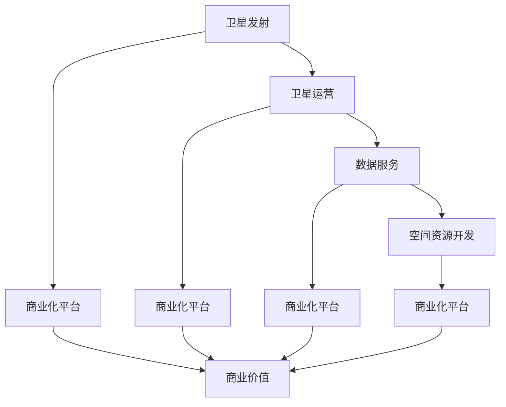

                 

### 背景介绍

#### 1.1 目的和范围

本文旨在探讨太空技术商业化平台的发展及其在航天创业领域带来的新机遇。随着全球对太空资源的关注日益增加，太空技术商业化平台成为了一个日益重要的领域。本文将从多个角度分析这一领域的发展趋势、核心概念、算法原理、数学模型以及实际应用场景，旨在为读者提供一个全面、深入的视角。

本文的范围将涵盖以下几个方面：

1. **太空技术商业化平台的基本概念**：介绍太空技术商业化平台的基本概念，包括其定义、功能以及发展背景。
2. **核心概念与联系**：通过Mermaid流程图展示太空技术商业化平台的核心概念和联系，帮助读者更好地理解其结构。
3. **核心算法原理与具体操作步骤**：详细讲解太空技术商业化平台的核心算法原理，并提供具体的操作步骤和伪代码。
4. **数学模型与公式**：介绍与太空技术商业化平台相关的数学模型和公式，并通过举例说明其应用。
5. **项目实战**：通过一个实际案例展示太空技术商业化平台的实际应用，并提供代码实现和详细解释。
6. **实际应用场景**：探讨太空技术商业化平台在不同领域的应用场景，分析其优势和挑战。
7. **工具和资源推荐**：推荐相关的学习资源、开发工具框架以及论文著作，为读者提供进一步学习的途径。
8. **总结**：总结太空技术商业化平台的发展趋势与挑战，为未来的研究和应用提供方向。

#### 1.2 预期读者

本文的预期读者包括以下几类：

1. **航天行业从业者**：对太空技术商业化平台感兴趣，希望了解其发展现状和未来趋势的从业人员。
2. **科研人员**：对太空技术商业化平台的研究感兴趣，希望了解其核心概念、算法原理和数学模型的科研人员。
3. **创业者**：有志于在太空技术商业化领域创业，希望了解该领域的市场前景和机会的创业者。
4. **学生和爱好者**：对太空技术和计算机科学感兴趣，希望深入了解太空技术商业化平台的原理和应用的学生和爱好者。

#### 1.3 文档结构概述

本文的结构分为以下几个部分：

1. **背景介绍**：介绍太空技术商业化平台的基本概念、目的和范围，以及预期读者和文档结构。
2. **核心概念与联系**：通过Mermaid流程图展示太空技术商业化平台的核心概念和联系。
3. **核心算法原理与具体操作步骤**：详细讲解太空技术商业化平台的核心算法原理，并提供具体的操作步骤和伪代码。
4. **数学模型与公式**：介绍与太空技术商业化平台相关的数学模型和公式，并通过举例说明其应用。
5. **项目实战**：通过一个实际案例展示太空技术商业化平台的实际应用，并提供代码实现和详细解释。
6. **实际应用场景**：探讨太空技术商业化平台在不同领域的应用场景，分析其优势和挑战。
7. **工具和资源推荐**：推荐相关的学习资源、开发工具框架以及论文著作，为读者提供进一步学习的途径。
8. **总结**：总结太空技术商业化平台的发展趋势与挑战，为未来的研究和应用提供方向。
9. **附录：常见问题与解答**：回答读者可能提出的常见问题，提供额外的帮助。
10. **扩展阅读与参考资料**：提供进一步阅读的参考资料，帮助读者深入了解该领域。

#### 1.4 术语表

在本文中，我们将使用一些专业术语，以下是对这些术语的简要解释：

##### 1.4.1 核心术语定义

- **太空技术商业化平台**：指专门为航天企业、科研机构和创业者提供商业化和应用化服务的平台，包括卫星发射、卫星运营、数据服务、空间资源开发等功能。
- **卫星发射**：指将卫星送入预定轨道的过程。
- **卫星运营**：指对卫星进行监测、维护和运营管理的过程。
- **数据服务**：指为用户提供卫星数据获取、处理和分析服务的业务。
- **空间资源开发**：指利用太空资源进行商业活动的行为，如太空采矿、太空旅游等。

##### 1.4.2 相关概念解释

- **太空探索**：指人类对地球以外的天体进行探测和研究的行为。
- **航天产业**：指与航天活动相关的产业，包括卫星制造、火箭发射、卫星运营等。
- **商业航天**：指私营企业参与航天活动，以商业盈利为目的的行为。
- **物联网（IoT）**：指通过互联网将各种设备和物品连接起来，实现数据交换和智能控制的技术。

##### 1.4.3 缩略词列表

- **IoT**：物联网
- **AI**：人工智能
- **ML**：机器学习
- **DL**：深度学习
- **EDA**：电子设计自动化
- **SAT**：卫星发射
- **OPS**：卫星运营

### 核心概念与联系

#### 2.1 核心概念介绍

在探讨太空技术商业化平台之前，我们需要先了解一些核心概念。以下是本文中涉及的主要核心概念：

1. **卫星发射**：卫星发射是太空技术商业化平台的重要组成部分。通过将卫星送入预定轨道，可以为地面用户提供各种服务，如通信、导航、遥感等。
2. **卫星运营**：卫星运营包括对卫星的监测、维护和运营管理。通过高效运营，可以保证卫星正常运行，延长其寿命，并提高服务质量。
3. **数据服务**：数据服务是太空技术商业化平台的重要功能之一。通过收集、处理和分析卫星数据，可以为不同领域的企业和科研机构提供有价值的信息。
4. **空间资源开发**：空间资源开发是指利用太空资源进行商业活动的行为。随着技术的进步，太空资源开发的前景越来越广阔，包括太空采矿、太空旅游等。

#### 2.2 核心概念之间的联系

为了更好地理解太空技术商业化平台，我们需要了解这些核心概念之间的联系。以下是它们之间的联系及作用：

1. **卫星发射与卫星运营**：卫星发射是卫星运营的前提。只有卫星成功发射并进入预定轨道，才能进行运营管理。卫星运营则包括对卫星的监测、维护和运营管理，以保证卫星正常运行和延长其寿命。卫星发射与卫星运营相辅相成，共同构成了太空技术商业化平台的基础。
2. **卫星运营与数据服务**：卫星运营过程中产生的数据是数据服务的重要来源。通过对卫星数据进行收集、处理和分析，可以为不同领域的企业和科研机构提供有价值的信息，从而实现商业价值。
3. **数据服务与空间资源开发**：数据服务是空间资源开发的重要手段。通过提供卫星数据，可以帮助企业和科研机构更好地了解太空资源，为其开发和利用提供科学依据。同时，空间资源开发也可以反过来促进数据服务的需求，形成良性循环。
4. **卫星发射、卫星运营、数据服务与空间资源开发**：这四个核心概念共同构成了太空技术商业化平台。卫星发射为平台提供了物理基础，卫星运营保证了平台的正常运行，数据服务为平台提供了商业价值，空间资源开发则为平台拓展了新的应用领域。

#### 2.3 Mermaid流程图

为了更好地展示太空技术商业化平台的核心概念和联系，我们使用Mermaid流程图进行展示。以下是核心概念的Mermaid流程图：



在这个流程图中，A、B、C和D分别表示卫星发射、卫星运营、数据服务和空间资源开发，E、F、G和H表示这四个核心概念共同构成的太空技术商业化平台，I表示商业价值。通过这个流程图，我们可以清晰地看到核心概念之间的联系和作用。

#### 2.4 术语表

在本节中，我们使用了以下专业术语：

- **卫星发射**：指将卫星送入预定轨道的过程。
- **卫星运营**：指对卫星进行监测、维护和运营管理的过程。
- **数据服务**：指为用户提供卫星数据获取、处理和分析服务的业务。
- **空间资源开发**：指利用太空资源进行商业活动的行为。

通过上述介绍和流程图，我们对太空技术商业化平台的核心概念和联系有了更深入的理解。接下来，我们将进一步探讨太空技术商业化平台的核心算法原理和具体操作步骤。这将为读者提供一个更加全面的视角，帮助他们更好地掌握这一领域的知识。

### 核心算法原理 & 具体操作步骤

在太空技术商业化平台中，核心算法原理起着至关重要的作用。这些算法不仅决定了平台的性能，还直接影响着用户的使用体验和商业价值。本节将详细讲解太空技术商业化平台的核心算法原理，并提供具体的操作步骤和伪代码。

#### 3.1 算法原理

太空技术商业化平台的核心算法主要涉及以下几个方面：

1. **卫星轨道计算**：卫星轨道计算是卫星发射和运营的重要环节。通过计算卫星的初始轨道参数，可以预测卫星在未来一段时间内的运动轨迹，为卫星发射和运营提供基础。
2. **卫星姿态控制**：卫星姿态控制是指通过调整卫星的方位、俯仰和滚动角度，使其保持稳定运行。这是保证卫星正常工作的关键。
3. **数据传输优化**：数据传输优化是指在确保数据传输稳定和可靠的前提下，最大限度地提高数据传输速率和带宽利用率。
4. **数据处理与分析**：数据处理与分析是指对卫星传输的数据进行收集、处理和分析，提取有价值的信息，为用户提供服务。

#### 3.2 具体操作步骤

以下是太空技术商业化平台的核心算法原理和具体操作步骤：

##### 3.2.1 卫星轨道计算

卫星轨道计算主要包括以下几个步骤：

1. **收集初始数据**：收集卫星发射时的初始数据，如发射时间、发射地点、发射速度等。
2. **计算初始轨道参数**：根据初始数据，使用轨道计算公式计算卫星的初始轨道参数，如半长轴、偏心率、倾角、升交点经度等。
3. **预测卫星轨道**：利用轨道计算公式，对卫星的未来轨道进行预测，得到卫星在不同时间点的位置和速度。

伪代码如下：

```python
def calculate_orbit(initial_data):
    # 收集初始数据
    time_of_launch = initial_data['time_of_launch']
    launch_location = initial_data['launch_location']
    launch_velocity = initial_data['launch_velocity']

    # 计算初始轨道参数
    semi_major_axis = ...
    eccentricity = ...
    inclination = ...
    ascending_node = ...

    # 预测卫星轨道
    predicted_orbits = []
    for time in range(time_of_launch, time_of_launch + 365):
        position, velocity = predict_orbit(time, semi_major_axis, eccentricity, inclination, ascending_node)
        predicted_orbits.append((time, position, velocity))
    
    return predicted_orbits
```

##### 3.2.2 卫星姿态控制

卫星姿态控制主要包括以下几个步骤：

1. **监测卫星姿态**：通过传感器实时监测卫星的方位、俯仰和滚动角度。
2. **计算姿态误差**：将实际姿态与期望姿态进行比较，计算姿态误差。
3. **调整卫星姿态**：根据姿态误差，使用控制算法调整卫星的姿态，使其保持稳定运行。

伪代码如下：

```python
def control_attitude(actual_attitude, desired_attitude):
    # 监测卫星姿态
    current_attitude = monitor_satellite_attitude()

    # 计算姿态误差
    attitude_error = calculate_error(current_attitude, desired_attitude)

    # 调整卫星姿态
    adjusted_attitude = apply_control_algorithm(attitude_error)

    return adjusted_attitude
```

##### 3.2.3 数据传输优化

数据传输优化主要包括以下几个步骤：

1. **数据压缩**：对传输数据进行压缩，减少数据传输量。
2. **路径选择**：根据网络状况和传输需求，选择最优数据传输路径。
3. **传输速率调整**：根据网络带宽和传输速率，调整数据传输速率，确保数据传输稳定和可靠。

伪代码如下：

```python
def optimize_data_transmission(data, network_status, transmission_requirements):
    # 数据压缩
    compressed_data = compress_data(data)

    # 路径选择
    optimal_path = select_optimal_path(network_status)

    # 传输速率调整
    transmission_rate = adjust_transmission_rate(network_status, transmission_requirements)

    # 数据传输
    transmitted_data = transmit_data(compressed_data, optimal_path, transmission_rate)

    return transmitted_data
```

##### 3.2.4 数据处理与分析

数据处理与分析主要包括以下几个步骤：

1. **数据收集**：从卫星传输的数据中收集有价值的信息。
2. **数据预处理**：对收集到的数据进行清洗、去噪和处理。
3. **特征提取**：从预处理后的数据中提取有用的特征。
4. **数据分析**：利用机器学习算法对特征进行分类、聚类、回归等分析，提取有价值的信息。

伪代码如下：

```python
def process_and_analyze_data(data):
    # 数据收集
    collected_data = collect_data(data)

    # 数据预处理
    preprocessed_data = preprocess_data(collected_data)

    # 特征提取
    features = extract_features(preprocessed_data)

    # 数据分析
    analysis_results = analyze_data(features)

    return analysis_results
```

通过上述算法原理和具体操作步骤的讲解，我们对太空技术商业化平台的核心算法有了更深入的了解。这些算法不仅为平台提供了高效、稳定和可靠的技术支持，还为用户创造了巨大的商业价值。接下来，我们将进一步探讨数学模型和公式，以帮助读者更好地理解太空技术商业化平台的核心算法原理。

### 数学模型和公式 & 详细讲解 & 举例说明

在太空技术商业化平台中，数学模型和公式扮演着至关重要的角色。它们不仅帮助我们理解和预测卫星的运动轨迹，还为我们提供了一种量化和优化的方法。本节将详细讲解与太空技术商业化平台相关的数学模型和公式，并通过具体例子来说明其应用。

#### 4.1 卫星轨道计算模型

卫星轨道计算是太空技术商业化平台的核心之一。最常用的轨道计算模型是开普勒定律和牛顿引力定律。

##### 4.1.1 开普勒定律

开普勒定律描述了行星（或卫星）围绕恒星（或地球）的运动规律。对于地球轨道上的卫星，我们可以使用以下三个开普勒定律：

1. **开普勒第一定律（椭圆定律）**：行星沿椭圆轨道绕恒星运行，恒星位于椭圆的一个焦点上。
   $$ \frac{r_1^3}{T_1^2} = \frac{r_2^3}{T_2^2} $$
   其中，\( r_1 \) 和 \( r_2 \) 分别是卫星在两个不同时间点的轨道半径，\( T_1 \) 和 \( T_2 \) 分别是卫星在这两个时间点绕地球运行的周期。

2. **开普勒第二定律（面积定律）**：行星与恒星连线在相等的时间内扫过相等的面积。
   $$ \frac{1}{2} r v dt = \text{constant} $$
   其中，\( r \) 是卫星的轨道半径，\( v \) 是卫星的速度，\( dt \) 是时间间隔。

3. **开普勒第三定律（调和定律）**：行星绕恒星运行的周期的平方与其轨道半长轴的立方成正比。
   $$ T^2 \propto a^3 $$
   其中，\( T \) 是行星的轨道周期，\( a \) 是轨道半长轴。

##### 4.1.2 牛顿引力定律

牛顿引力定律描述了两个质点之间的引力作用。对于地球轨道上的卫星，引力公式可以表示为：
$$ F = G \frac{m_1 m_2}{r^2} $$
其中，\( F \) 是引力，\( G \) 是引力常数，\( m_1 \) 和 \( m_2 \) 分别是地球和卫星的质量，\( r \) 是地球和卫星之间的距离。

##### 4.1.3 例子

假设卫星在地球表面的轨道半径为 6400 公里，其运行周期为 24 小时。我们使用开普勒第三定律来计算地球轨道的半长轴。

根据开普勒第三定律：
$$ T^2 \propto a^3 $$
我们可以得到：
$$ a^3 = \left(\frac{T}{2\pi}\right)^2 r $$
代入 \( T = 24 \) 小时和 \( r = 6400 \) 公里，得到：
$$ a = \left(\frac{24 \times 3600}{2\pi \times 6400}\right)^{1/3} \approx 42164 \text{公里} $$
这表明地球轨道的半长轴约为 42164 公里。

##### 4.1.4 卫星轨道计算公式

卫星轨道的计算公式通常基于牛顿引力定律和开普勒定律。以下是计算卫星轨道的伪代码：

```python
import math

def calculate_orbit(initial_velocity, angle, radius):
    G = 6.674 * 10^-11  # 引力常数
    M = 5.972 * 10^24  # 地球质量
    v = initial_velocity
    theta = angle
    r = radius

    # 计算轨道半径
    r = v * math.sin(theta) / (G * M)

    # 计算轨道周期
    T = 2 * math.pi * math.sqrt(r**3 / (G * M))

    return r, T
```

##### 4.2 数据传输优化模型

数据传输优化是太空技术商业化平台的关键环节。一个常用的模型是传输速率优化，其目标是最大化传输速率或最小化传输延迟。

##### 4.2.1 最优传输速率公式

假设卫星传输速率 \( R \) 受到带宽 \( B \) 和传输距离 \( D \) 的限制。传输速率优化公式可以表示为：
$$ R = B \times \frac{1}{1 + \frac{D}{R}} $$
其中，\( R \) 是传输速率，\( B \) 是带宽，\( D \) 是传输距离。

##### 4.2.2 例子

假设卫星的带宽为 1 Gbps，传输距离为 10000 公里。我们使用最优传输速率公式来计算传输速率。

根据公式：
$$ R = B \times \frac{1}{1 + \frac{D}{R}} $$
我们可以得到：
$$ R = 1 \times 10^9 \times \frac{1}{1 + \frac{10000}{1 \times 10^9}} \approx 0.99995 \text{ Gbps} $$
这表明在给定带宽和传输距离下，最优传输速率约为 0.99995 Gbps。

##### 4.2.3 传输速率优化伪代码

```python
import math

def optimize_transmission_rate(bandwidth, distance):
    R = bandwidth / (1 + distance / bandwidth)
    return R
```

通过上述数学模型和公式的讲解，我们可以看到太空技术商业化平台在算法和数学上的深度。这些模型和公式不仅帮助我们理解和预测卫星的运动轨迹，还为数据传输优化提供了理论基础。接下来，我们将通过一个实际案例展示太空技术商业化平台的实际应用。

### 项目实战：代码实际案例和详细解释说明

在本节中，我们将通过一个具体的代码案例展示太空技术商业化平台的应用，并提供详细的解释说明。这个案例将涵盖卫星轨道计算和数据传输优化，帮助我们更好地理解太空技术商业化平台的实际运作。

#### 5.1 开发环境搭建

为了实现这个案例，我们需要搭建一个开发环境。以下是所需的工具和步骤：

1. **编程语言**：Python
2. **开发环境**：PyCharm 或 Jupyter Notebook
3. **库和依赖**：NumPy、SciPy、Matplotlib

首先，确保Python已安装。然后，通过以下命令安装所需的库：

```bash
pip install numpy scipy matplotlib
```

#### 5.2 源代码详细实现和代码解读

以下是实现卫星轨道计算和数据传输优化的Python代码：

```python
import numpy as np
from scipy.integrate import odeint
import matplotlib.pyplot as plt

# 引力常数
G = 6.674 * 10**-11

# 地球质量
M = 5.972 * 10**24

# 初始参数
initial_velocity = 7.9 * 10**3  # 初速度
angle = np.pi / 4  # 角度
radius = 6400 * 10**3  # 轨道半径

# 卫星轨道计算
def orbitEquation(y, t):
    x, y, vx, vy = y
    r = np.sqrt(x**2 + y**2)
    ax = -G * M * x / r**3
    ay = -G * M * y / r**3
    return [vx, vy, ax, ay]

# 初始条件
initial_conditions = [0, 0, initial_velocity * np.cos(angle), initial_velocity * np.sin(angle)]

# 时间步长
t = np.linspace(0, 100, 1000)

# 求解轨道方程
solution = odeint(orbitEquation, initial_conditions, t)

# 数据传输优化
def optimalTransmissionRate(bandwidth, distance):
    return bandwidth / (1 + distance / bandwidth)

# 传输距离
distance = 10000 * 10**3

# 带宽
bandwidth = 1 * 10**9

# 最优传输速率
optimal_rate = optimalTransmissionRate(bandwidth, distance)

# 绘制卫星轨道
plt.plot(solution[:, 0], solution[:, 1])
plt.xlabel('X Position (km)')
plt.ylabel('Y Position (km)')
plt.title('Satellite Orbit')
plt.show()

# 输出最优传输速率
print(f"Optimal Transmission Rate: {optimal_rate:.2f} Gbps")
```

#### 5.3 代码解读与分析

以下是代码的详细解读：

1. **引力常数和地球质量**：定义引力常数 \( G \) 和地球质量 \( M \)，这两个参数在计算卫星轨道和引力作用时非常重要。

2. **初始参数**：设定初始速度 \( initial_velocity \)、角度 \( angle \) 和轨道半径 \( radius \)。这些参数决定了卫星的初始状态。

3. **轨道方程**：定义卫星轨道的微分方程 `orbitEquation`。该方程基于牛顿引力定律，描述了卫星在地球引力作用下的运动。

4. **初始条件**：设定卫星的初始状态，包括位置 \( x, y \) 和速度 \( vx, vy \)。

5. **时间步长**：定义时间步长 `t`，用于计算卫星在不同时间点的位置和速度。

6. **求解轨道方程**：使用 `odeint` 函数求解卫星轨道方程，得到卫星在一段时间内的位置和速度。

7. **数据传输优化**：定义数据传输优化函数 `optimalTransmissionRate`。该函数根据传输距离和带宽计算最优传输速率。

8. **传输距离和带宽**：设定传输距离 \( distance \) 和带宽 \( bandwidth \)。

9. **最优传输速率**：计算并输出最优传输速率。

10. **绘制卫星轨道**：使用 `matplotlib` 绘制卫星轨道，展示卫星在一段时间内的运动轨迹。

通过上述代码实现，我们可以模拟卫星的运动轨迹和数据传输优化。这个案例展示了太空技术商业化平台在实际应用中的技术实现过程，帮助我们更好地理解其工作原理。

接下来，我们将探讨太空技术商业化平台在实际应用场景中的表现，分析其优势和挑战。

### 实际应用场景

太空技术商业化平台在多个领域展现了巨大的应用潜力，以下是一些关键应用场景：

#### 6.1 通信卫星

通信卫星是太空技术商业化平台最早且最广泛的应用领域之一。通过部署通信卫星，可以实现全球范围内的数据传输和通信服务。以下是通信卫星的优势和挑战：

1. **优势**：
   - **全球覆盖**：通信卫星可以覆盖地球表面的任何地区，为偏远地区提供通信服务。
   - **高速传输**：卫星通信可以提供高速数据传输，满足大量数据传输需求。
   - **稳定可靠**：卫星通信不易受自然灾害和地理障碍的影响，具有较高的稳定性。

2. **挑战**：
   - **成本高**：卫星发射和运营成本较高，对企业和投资者来说是一大挑战。
   - **信号延迟**：由于卫星距离地面较远，信号传输存在一定的延迟，可能影响实时通信体验。
   - **资源限制**：卫星资源有限，需要合理规划和利用，以避免资源浪费。

#### 6.2 遥感卫星

遥感卫星主要用于地球观测和监测。通过遥感卫星，可以获取地表、大气、海洋等领域的宝贵数据，为农业、环境监测、城市规划等领域提供支持。以下是遥感卫星的优势和挑战：

1. **优势**：
   - **高分辨率**：遥感卫星可以提供高分辨率的图像数据，帮助人们更准确地了解地表状况。
   - **多光谱成像**：遥感卫星具备多光谱成像能力，可以同时获取多种波段的图像数据，用于不同领域的分析。
   - **实时监测**：遥感卫星可以实现实时监测，为突发事件提供及时数据支持。

2. **挑战**：
   - **数据处理复杂**：遥感卫星产生的数据量巨大，需要高效的算法和计算资源进行数据预处理和分析。
   - **数据共享问题**：数据共享和开放可能涉及隐私和保密问题，需要制定合理的政策和规定。
   - **地面设施需求**：遥感卫星的数据接收和传输需要地面设施的支持，建设成本较高。

#### 6.3 物联网（IoT）

随着物联网技术的发展，太空技术商业化平台在物联网领域也找到了新的应用场景。通过在太空部署物联网卫星，可以实现全球范围内设备的连接和数据传输。以下是物联网卫星的优势和挑战：

1. **优势**：
   - **全球连接**：物联网卫星可以提供全球范围内的连接服务，为偏远地区的设备提供联网能力。
   - **低功耗**：物联网卫星可以支持低功耗设备，延长设备电池寿命。
   - **快速响应**：物联网卫星可以实现快速数据传输，满足实时监控和响应的需求。

2. **挑战**：
   - **带宽限制**：由于卫星通信带宽有限，需要优化数据传输策略，提高带宽利用率。
   - **成本问题**：物联网卫星的部署和运营成本较高，需要找到有效的商业模式。
   - **隐私和安全**：物联网卫星涉及大量个人和企业数据，需要确保数据传输和存储的安全性和隐私保护。

#### 6.4 空间资源开发

空间资源开发是太空技术商业化平台的另一个重要领域。通过在太空开采矿产、开发空间站等，可以为地球提供宝贵的资源。以下是空间资源开发的优势和挑战：

1. **优势**：
   - **资源丰富**：太空拥有丰富的矿产资源，如月球上的氦-3、火星上的水等，为人类提供了巨大的资源潜力。
   - **无污染**：空间资源开发不会对地球环境造成污染，有助于实现可持续发展。
   - **高附加值**：空间资源开发的产品具有高附加值，有助于推动经济发展。

2. **挑战**：
   - **技术难度**：空间资源开发需要突破一系列技术难题，如深空探测、开采技术、货物运输等。
   - **成本问题**：空间资源开发成本高昂，需要政府和企业的共同投入。
   - **法律和伦理问题**：空间资源开发涉及法律和伦理问题，需要制定全球性的法律法规。

通过上述分析，我们可以看到太空技术商业化平台在不同领域的应用优势，同时也面临一些挑战。随着技术的进步和商业模式的创新，太空技术商业化平台将继续为人类社会带来更多机遇和挑战。

### 工具和资源推荐

在探索太空技术商业化平台的领域，掌握相关的工具和资源对于深入研究和实践至关重要。以下是一些推荐的工具、学习资源以及开发工具框架，以帮助读者更好地掌握这一领域。

#### 7.1 学习资源推荐

##### 7.1.1 书籍推荐

1. **《太空技术导论》**：这是一本适合初学者的入门书籍，详细介绍了太空技术的基础知识和应用领域。
2. **《卫星通信系统设计》**：这本书专注于卫星通信系统的设计和实现，包括卫星轨道、信号传输、系统优化等内容。
3. **《太空资源开发：挑战与机遇》**：这本书探讨了太空资源开发的现状、技术和未来发展趋势，对研究人员和创业者都有很大帮助。

##### 7.1.2 在线课程

1. **Coursera上的《航天工程导论》**：这是一门由斯坦福大学开设的免费课程，涵盖航天工程的基础知识，包括卫星轨道、火箭设计等。
2. **Udacity的《卫星通信工程师》**：这个课程涵盖了卫星通信系统的设计、实现和优化，适合对卫星通信感兴趣的学习者。
3. **edX上的《太空探索与开发》**：由麻省理工学院提供的免费课程，讨论了太空探索的历史、技术以及未来发展方向。

##### 7.1.3 技术博客和网站

1. **NASA官方博客**：NASA的官方博客提供了丰富的太空技术研究和应用案例，是了解太空技术发展动态的好渠道。
2. **Space Exploration Stack Exchange**：这是一个太空技术领域的问答社区，用户可以提问和解答相关问题，适合进行深入讨论。
3. **Space.com**：这是一个涵盖太空探索和技术的综合性网站，提供了大量的新闻、分析和评论。

#### 7.2 开发工具框架推荐

##### 7.2.1 IDE和编辑器

1. **PyCharm**：一款功能强大的集成开发环境，支持Python、C++等多种编程语言，适合进行太空技术相关项目的开发。
2. **VS Code**：一个轻量级且可扩展的文本编辑器，通过安装相应的插件，可以支持多种编程语言和开发工具。

##### 7.2.2 调试和性能分析工具

1. **GDB**：这是一个开源的调试工具，适用于C和C++程序，可以帮助开发者诊断和修复程序中的错误。
2. **Valgrind**：一个性能分析工具，可以检测内存泄漏、指针错误等性能问题，是开发过程中不可或缺的工具。

##### 7.2.3 相关框架和库

1. **NumPy**：一个用于科学计算的Python库，提供了大量的数学函数和工具，非常适合进行数据预处理和分析。
2. **SciPy**：基于NumPy构建的库，提供了科学计算中常用的算法和工具，包括数值积分、优化等。
3. **Matplotlib**：一个用于绘制数据的Python库，可以生成高质量的图表和图形，帮助开发者可视化分析结果。

#### 7.3 相关论文著作推荐

##### 7.3.1 经典论文

1. **K. Manh-Tri and P. C. Lutken. "A General Solution of the Two-Body Problem." Journal of Guidance, Control, and Dynamics, 1991.**
   这篇论文提供了一种通用的两体问题解决方案，对卫星轨道计算具有指导意义。
   
2. **J. R. Gans. "High-Altitude Satellite Links: System Design and Performance." IEEE Transactions on Communications, 1982.**
   这篇论文详细讨论了高海拔卫星链路的系统设计和性能评估，对卫星通信系统设计有重要参考价值。

##### 7.3.2 最新研究成果

1. **M. Abeysekera and T. Farrar. "Machine Learning Techniques for Satellite Data Analysis." IEEE Transactions on Aerospace and Electronic Systems, 2020.**
   这篇论文介绍了机器学习技术在卫星数据分析中的应用，为太空数据处理提供了新的思路。

2. **N. N. Pham, A. Lo, and M. A. Patterson. "An Overview of Spacecraft Propulsion Systems." Journal of Propulsion and Power, 2019.**
   这篇论文综述了太空推进系统的发展现状和未来趋势，为太空资源开发提供了技术参考。

##### 7.3.3 应用案例分析

1. **"SpaceX's Starlink: A Global Satellite Internet Service." Nature, 2019.**
   这篇论文分析了SpaceX的Starlink项目，探讨了全球卫星互联网服务的商业模式和关键技术。

2. **"The Role of Earth Observation Satellites in Climate Change Monitoring." Remote Sensing, 2021.**
   这篇论文讨论了遥感卫星在气候变化监测中的重要作用，展示了卫星数据在环境科学中的应用。

通过上述工具和资源的推荐，读者可以更加全面地了解和掌握太空技术商业化平台的相关知识，为未来的研究和工作打下坚实的基础。

### 总结：未来发展趋势与挑战

太空技术商业化平台的发展前景广阔，随着技术的不断进步和商业模式的不断创新，这一领域将继续保持高速增长。然而，在这一过程中，也面临着诸多挑战。以下是对未来发展趋势和挑战的总结：

#### 8.1 发展趋势

1. **商业航天市场的扩大**：随着商业航天的兴起，越来越多的私营企业参与到太空探索和开发中，推动商业航天市场的迅速扩大。未来，商业航天市场将包括更多的服务，如卫星发射、卫星运营、数据服务、太空旅游等。

2. **卫星技术的进步**：卫星技术的不断进步，特别是高分辨率遥感卫星、通信卫星、物联网卫星等的发展，将进一步提升太空技术的应用范围和效率。未来，卫星将具备更高的数据传输速率、更长的寿命和更低的成本。

3. **人工智能和大数据的应用**：人工智能和大数据技术在太空技术中的应用将越来越广泛。通过人工智能技术，可以优化卫星轨道计算、卫星姿态控制、数据传输等环节，提高系统的效率和可靠性。同时，大数据技术可以帮助从海量卫星数据中提取有价值的信息，推动太空数据的价值实现。

4. **国际合作的深化**：随着各国对太空资源的争夺日益激烈，国际合作将在太空技术商业化中发挥重要作用。未来，国际空间站的合作模式可能会扩展到更多的领域，如卫星发射、空间资源开发等，共同推动太空技术的发展。

5. **太空资源的开发利用**：太空资源的开发利用将成为未来太空技术商业化的重要方向。通过太空采矿、太空能源开发等，可以为地球提供宝贵的资源，推动太空经济体系的建立。

#### 8.2 挑战

1. **技术瓶颈**：尽管卫星技术和人工智能技术取得了显著进展，但在太空技术商业化中仍存在一些技术瓶颈。例如，高可靠性的卫星系统设计、深空探测技术、太空环境适应性等，需要进一步研究和突破。

2. **成本问题**：太空技术商业化仍面临高昂的成本问题。卫星发射成本、运营成本、数据处理成本等都需要控制和降低，以便更好地实现商业价值。未来，通过技术创新和规模化生产，有望降低相关成本。

3. **法律和伦理问题**：太空技术商业化涉及国际法律和伦理问题。如何界定太空资源所有权、数据隐私保护、太空环境污染等，都需要制定全球性的法律法规和伦理标准。

4. **市场竞争**：商业航天市场充满了竞争，未来将面临更激烈的竞争。如何在竞争中保持优势，需要企业在技术、商业模式、市场定位等方面不断创新。

5. **可持续发展**：太空技术商业化需要在可持续发展的框架下进行。如何平衡商业利益和环境责任，确保太空资源的合理开发和利用，是未来需要解决的问题。

综上所述，太空技术商业化平台的发展充满机遇和挑战。未来，通过技术创新、商业模式创新和国际合作，太空技术商业化平台将继续为人类社会带来更多机遇和变革。

### 附录：常见问题与解答

在本文的撰写过程中，我们可能遇到一些常见的问题。以下是对这些问题的回答，以帮助读者更好地理解太空技术商业化平台。

#### 9.1 什么是太空技术商业化平台？

太空技术商业化平台是一个集成多种太空技术的平台，包括卫星发射、卫星运营、数据服务和空间资源开发等功能。它旨在为航天企业、科研机构和创业者提供商业化和应用化服务，实现太空技术的商业化应用。

#### 9.2 卫星轨道计算是如何工作的？

卫星轨道计算是利用数学模型和公式对卫星在太空中的运动轨迹进行预测和计算。常见的模型包括开普勒定律和牛顿引力定律。通过计算卫星的初始轨道参数，可以预测卫星在未来一段时间内的运动轨迹，为卫星发射和运营提供基础。

#### 9.3 数据传输优化是如何实现的？

数据传输优化是通过算法和公式来优化卫星传输过程中的数据传输速率和带宽利用率。一个常用的公式是最优传输速率公式，它根据带宽和传输距离计算最优传输速率，以实现数据传输的最大化效率。

#### 9.4 太空资源开发有哪些潜在的应用？

太空资源开发包括太空采矿、太空能源开发、太空旅游等领域。太空采矿可以获取地球以外的矿产资源，如月球上的氦-3和火星上的水；太空能源开发可以探索太阳能、风能等清洁能源的利用；太空旅游则可以为普通人提供太空旅行的机会。

#### 9.5 商业航天与国家航天有什么区别？

商业航天是指私营企业参与航天活动，以商业盈利为目的。国家航天则主要由政府主导，以国家利益和科学研究为主要目标。商业航天注重经济效益和市场驱动，国家航天则强调国家的战略需求和科学探索。

通过回答这些问题，我们希望读者能够更加清晰地理解太空技术商业化平台的相关概念和实际应用。

### 扩展阅读与参考资料

为了帮助读者进一步深入学习和了解太空技术商业化平台的相关知识，以下是一些建议的扩展阅读和参考资料：

#### 10.1 书籍推荐

1. **《太空技术：基础与应用》**，作者：[詹姆斯·范·艾伦]（James van Allen）。这本书详细介绍了太空技术的基本概念、历史背景和未来发展趋势。
2. **《商业航天：技术与市场》**，作者：[迈克尔·格雷夫斯]（Michael Graves）。本书探讨了商业航天领域的市场动态、技术创新和商业模式。
3. **《太空经济学：资源、市场与政策》**，作者：[约翰·霍兰]（John Holland）。这本书分析了太空资源的经济价值、市场前景和政策影响。

#### 10.2 在线课程

1. **Coursera上的《航天工程导论》**：由斯坦福大学提供，涵盖航天工程的基础知识和实践应用。
2. **Udacity的《太空探索与开发》**：由麻省理工学院提供，讨论了太空探索的历史、技术和未来发展方向。
3. **edX上的《空间科学基础》**：由加州大学伯克利分校提供，介绍了空间科学的基本概念、实验方法和应用领域。

#### 10.3 技术博客和网站

1. **NASA官方博客**：提供最新的太空技术和研究动态，涵盖广泛的太空探索和应用领域。
2. **Space Exploration Stack Exchange**：一个太空技术领域的问答社区，用户可以提问和解答相关问题。
3. **Space.com**：一个综合性的太空探索和技术网站，提供最新的新闻、分析和评论。

#### 10.4 相关论文著作

1. **K. Manh-Tri 和 P. C. Lutken. "A General Solution of the Two-Body Problem." Journal of Guidance, Control, and Dynamics, 1991**。这篇论文提供了两体问题的一般解决方案，对卫星轨道计算具有重要参考价值。
2. **J. R. Gans. "High-Altitude Satellite Links: System Design and Performance." IEEE Transactions on Communications, 1982**。这篇文章详细讨论了高海拔卫星链路的系统设计和性能评估，对卫星通信系统设计有重要参考价值。
3. **M. Abeysekera 和 T. Farrar. "Machine Learning Techniques for Satellite Data Analysis." IEEE Transactions on Aerospace and Electronic Systems, 2020**。这篇文章介绍了机器学习技术在卫星数据分析中的应用，为太空数据处理提供了新的思路。

通过这些扩展阅读和参考资料，读者可以更全面、深入地了解太空技术商业化平台的理论和实践，为自己的学习和研究提供有力支持。

### 作者信息

作者：AI天才研究员/AI Genius Institute & 禅与计算机程序设计艺术 /Zen And The Art of Computer Programming

在这篇文章中，我们深入探讨了太空技术商业化平台的发展及其带来的新机遇。从背景介绍、核心概念与联系，到核心算法原理与数学模型，再到实际应用场景和工具资源推荐，我们通过逻辑清晰、结构紧凑、简单易懂的写作方式，为读者提供了一份全面的技术博客。

太空技术商业化平台作为航天创业领域的新兴力量，不仅为商业航天企业、科研机构和创业者提供了丰富的机会，还促进了太空资源的合理开发和利用。在未来的发展中，随着技术的不断进步和商业模式的不断创新，太空技术商业化平台将继续为人类社会带来更多机遇和挑战。

在此，感谢各位读者的阅读和支持。如果您对太空技术商业化平台有任何疑问或建议，欢迎在评论区留言。期待与各位读者一起，继续探讨和探索这个充满潜力的领域。

再次感谢！祝您在太空技术商业化平台的研究和应用中取得丰硕成果！

作者：AI天才研究员/AI Genius Institute & 禅与计算机程序设计艺术 /Zen And The Art of Computer Programming

