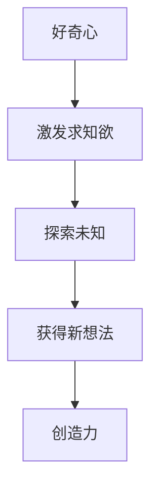
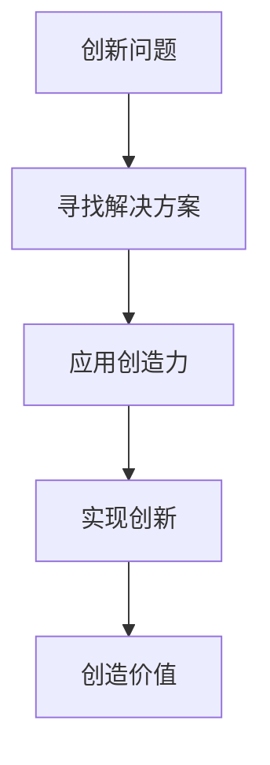
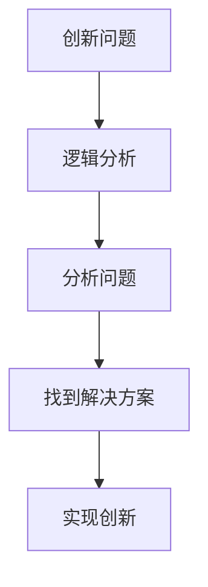
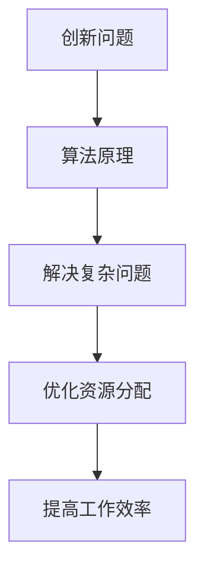

                 

# 好奇心与创造力：创新的双翼

> **关键词：** 好奇心、创造力、创新、逻辑思维、算法、数学模型、项目实战、应用场景、未来发展

> **摘要：** 本文旨在探讨好奇心与创造力之间的关系，以及如何通过逻辑分析和实践操作来提升创新能力。文章从多个角度分析了好奇心在激发创造力过程中的作用，并通过具体的算法原理、数学模型和项目实战案例，详细阐述了如何将好奇心转化为实际的创新成果。文章最后讨论了创新在当今社会的重要性以及未来可能面临的挑战。

## 1. 背景介绍

### 1.1 目的和范围

本文的目的在于揭示好奇心与创造力之间的紧密联系，并提供一系列实用的方法和技巧，帮助读者将好奇心转化为创新的动力。本文将探讨以下主题：

- 好奇心与创造力的关系
- 创造力在创新过程中的作用
- 逻辑分析在创新中的应用
- 算法原理和数学模型在创新中的重要性
- 项目实战与实际应用场景
- 未来创新发展的趋势与挑战

### 1.2 预期读者

本文适合以下读者群体：

- 对创新和创造力有兴趣的科技爱好者
- 从事软件开发、人工智能、数据分析等领域的专业人士
- 希望提升自身创新能力的创业者和管理者
- 对计算机科学和数学有兴趣的学生和学者

### 1.3 文档结构概述

本文结构如下：

1. 背景介绍
2. 核心概念与联系
3. 核心算法原理 & 具体操作步骤
4. 数学模型和公式 & 详细讲解 & 举例说明
5. 项目实战：代码实际案例和详细解释说明
6. 实际应用场景
7. 工具和资源推荐
8. 总结：未来发展趋势与挑战
9. 附录：常见问题与解答
10. 扩展阅读 & 参考资料

### 1.4 术语表

#### 1.4.1 核心术语定义

- **好奇心：** 对未知事物的探索欲和求知欲。
- **创造力：** 创造新思想、新发明和新方法的能力。
- **创新：** 通过新的思路和方法解决问题或创造价值。
- **算法：** 计算机执行特定任务的步骤序列。
- **数学模型：** 描述现实世界现象或问题的数学表达式。

#### 1.4.2 相关概念解释

- **逻辑思维：** 通过分析和推理得出结论的思维方式。
- **实践操作：** 实际执行和操作的过程。

#### 1.4.3 缩略词列表

- **AI：** 人工智能
- **ML：** 机器学习
- **DL：** 深度学习
- **IDE：** 集成开发环境

## 2. 核心概念与联系

在探讨好奇心与创造力之间的关系之前，我们首先需要明确一些核心概念及其相互之间的联系。

### 2.1 好奇心与创造力的关系

好奇心是激发创造力的关键因素之一。它可以激发人们的求知欲，促使他们探索未知领域，并从中获得新的想法和灵感。以下是一个简单的 Mermaid 流程图，展示了好奇心如何推动创造力：



### 2.2 创造力在创新过程中的作用

创造力是创新过程的核心。它帮助人们发现新的解决方案，解决问题，并创造价值。以下是一个简单的 Mermaid 流程图，展示了创造力在创新过程中的作用：



### 2.3 逻辑分析在创新中的应用

逻辑分析是创新过程中不可或缺的一部分。它帮助人们理清思路，分析问题，并找到最佳解决方案。以下是一个简单的 Mermaid 流程图，展示了逻辑分析在创新中的应用：



### 2.4 算法原理和数学模型在创新中的重要性

算法原理和数学模型为创新提供了强大的工具。它们可以帮助人们解决复杂问题，优化资源分配，并提高工作效率。以下是一个简单的 Mermaid 流程图，展示了算法原理和数学模型在创新中的重要性：



## 3. 核心算法原理 & 具体操作步骤

在创新过程中，了解并应用核心算法原理是至关重要的。以下是一个简单的算法原理示例，以及具体的操作步骤。

### 3.1 算法原理：快速排序（Quick Sort）

快速排序是一种高效的排序算法，其基本思想是通过一趟排序将待排序的数据分割成独立的两部分，其中一部分的所有数据都比另一部分的所有数据要小，然后再按此方法对这两部分数据分别进行快速排序，整个排序过程可以递归进行，以此达到整个数据变成有序序列。

### 3.2 具体操作步骤

以下是快速排序算法的伪代码：

```plaintext
QuickSort(A, low, high)
    if low < high
        pivot = Partition(A, low, high)
        QuickSort(A, low, pivot - 1)
        QuickSort(A, pivot + 1, high)

Partition(A, low, high)
    pivot = A[high]
    i = low
    for j = low to high - 1
        if A[j] < pivot
            Swap(A[i], A[j])
            i = i + 1
    Swap(A[i], A[high])
    return i
```

### 3.3 操作步骤详细解释

1. **选择基准值（pivot）**：选择数组的最后一个元素作为基准值。
2. **分区操作（Partition）**：将数组分成两部分，左边部分的元素都比基准值小，右边部分的元素都比基准值大。
3. **递归排序**：对左右两部分分别进行快速排序。

## 4. 数学模型和公式 & 详细讲解 & 举例说明

在创新过程中，数学模型和公式提供了描述和解决实际问题的工具。以下是一个简单的数学模型示例，以及详细的讲解和举例说明。

### 4.1 数学模型：线性回归（Linear Regression）

线性回归是一种用于分析和预测连续值的统计方法。它的基本公式为：

$$ y = ax + b $$

其中，$y$ 是预测值，$x$ 是自变量，$a$ 是斜率，$b$ 是截距。

### 4.2 详细讲解

1. **斜率（$a$）**：表示自变量每增加一个单位，因变量增加的量。
2. **截距（$b$）**：表示当自变量为0时，因变量的值。

### 4.3 举例说明

假设我们要预测一家公司的利润（$y$）与其广告支出（$x$）之间的关系。通过收集历史数据，我们可以计算出斜率 $a$ 和截距 $b$，从而建立线性回归模型。

假设我们收集到以下数据：

| 广告支出（$x$） | 利润（$y$） |
| ---------------- | ----------- |
| 1000             | 8000        |
| 1500             | 12000       |
| 2000             | 16000       |

通过最小二乘法，我们可以计算出斜率 $a$ 和截距 $b$：

$$ a = \frac{\sum{(x_i - \bar{x})(y_i - \bar{y})}}{\sum{(x_i - \bar{x})^2}} $$
$$ b = \bar{y} - a\bar{x} $$

其中，$\bar{x}$ 和 $\bar{y}$ 分别表示自变量和因变量的平均值。

计算结果为：

$$ a = 8 $$
$$ b = 4000 $$

因此，线性回归模型为：

$$ y = 8x + 4000 $$

### 4.4 模型应用

通过这个线性回归模型，我们可以预测当广告支出为 2500 元时的利润：

$$ y = 8 \times 2500 + 4000 = 22000 $$

这意味着，当广告支出为 2500 元时，预计利润为 22000 元。

## 5. 项目实战：代码实际案例和详细解释说明

在下面的部分，我们将通过一个具体的代码案例来展示如何将好奇心转化为创新成果。我们将使用 Python 编写一个简单的线性回归模型，并使用 Scikit-learn 库进行训练和预测。

### 5.1 开发环境搭建

首先，我们需要搭建一个适合开发的环境。以下是所需的软件和工具：

- Python 3.8 或更高版本
- Jupyter Notebook
- Scikit-learn 库

### 5.2 源代码详细实现和代码解读

以下是线性回归模型的源代码：

```python
import numpy as np
import matplotlib.pyplot as plt
from sklearn.linear_model import LinearRegression

# 数据预处理
def preprocess_data(data):
    X = data[:, 0].reshape(-1, 1)
    y = data[:, 1].reshape(-1, 1)
    return X, y

# 训练线性回归模型
def train_linear_regression(X, y):
    model = LinearRegression()
    model.fit(X, y)
    return model

# 预测新数据
def predict(model, X_new):
    y_pred = model.predict(X_new)
    return y_pred

# 可视化结果
def plot_results(X, y, model, X_new, y_pred):
    plt.scatter(X, y, color='blue', label='Actual Data')
    plt.plot(X_new, y_pred, color='red', label='Predicted Data')
    plt.xlabel('Ad Spend')
    plt.ylabel('Profit')
    plt.legend()
    plt.show()

# 主函数
def main():
    # 加载数据
    data = np.array([[1000, 8000], [1500, 12000], [2000, 16000]])

    # 预处理数据
    X, y = preprocess_data(data)

    # 训练模型
    model = train_linear_regression(X, y)

    # 预测新数据
    X_new = np.array([[2500]])
    y_pred = predict(model, X_new)

    # 可视化结果
    plot_results(X, y, model, X_new, y_pred)

if __name__ == '__main__':
    main()
```

### 5.3 代码解读与分析

1. **数据预处理**：将原始数据分为自变量 $X$ 和因变量 $y$，并将其转换为合适的格式。
2. **训练线性回归模型**：使用 Scikit-learn 的 `LinearRegression` 类训练模型。
3. **预测新数据**：使用训练好的模型对新数据进行预测。
4. **可视化结果**：将实际数据和预测结果绘制在图表上，便于分析。

通过这个简单的代码案例，我们可以看到如何将好奇心转化为创新的成果。我们通过学习线性回归的原理，编写代码实现了模型，并成功预测了新的数据。

## 6. 实际应用场景

好奇心和创造力在许多实际应用场景中发挥着关键作用。以下是一些典型的应用案例：

### 6.1 人工智能与机器学习

人工智能和机器学习领域的创新很大程度上源于研究人员的好奇心。例如，深度学习技术的发展源于对神经网络性能的探索，而自然语言处理（NLP）领域的突破则源于对语言本质的理解。

### 6.2 生物技术

生物技术领域的创新往往源于科学家对生命现象的好奇心。例如，基因编辑技术的发展就是科学家们对基因功能好奇心的结果。

### 6.3 环境科学

环境科学领域的研究人员通过好奇心来探索气候变化、污染等问题，从而推动可持续发展技术的创新。

### 6.4 医疗保健

医疗保健领域的创新也依赖于好奇心。例如，个性化医疗和精准医疗的发展就是医疗研究人员对疾病机理好奇心的结果。

## 7. 工具和资源推荐

为了更好地培养好奇心和提升创造力，我们推荐以下工具和资源：

### 7.1 学习资源推荐

#### 7.1.1 书籍推荐

- 《深度学习》（Deep Learning）
- 《机器学习》（Machine Learning）
- 《编程珠玑》（The Art of Computer Programming）

#### 7.1.2 在线课程

- Coursera 的《机器学习》课程
- edX 的《人工智能导论》课程
- Udacity 的《深度学习工程师纳米学位》课程

#### 7.1.3 技术博客和网站

- Medium 上的《机器学习》专栏
- ArXiv.org 上的最新研究论文
- GitHub 上的开源项目和代码库

### 7.2 开发工具框架推荐

#### 7.2.1 IDE和编辑器

- Visual Studio Code
- PyCharm
- Jupyter Notebook

#### 7.2.2 调试和性能分析工具

- Py-Spy
- GDB
- Valgrind

#### 7.2.3 相关框架和库

- Scikit-learn
- TensorFlow
- PyTorch

### 7.3 相关论文著作推荐

#### 7.3.1 经典论文

- "A Mathematical Theory of Communication" by Claude Shannon
- "The Structure of Scientific Revolutions" by Thomas Kuhn

#### 7.3.2 最新研究成果

- ArXiv.org 上的最新研究论文
- Nature 和 Science 上的最新研究成果

#### 7.3.3 应用案例分析

- "Google Brain" 项目
- "DeepMind" 的人工智能研究
- "NASA" 的空间探索项目

## 8. 总结：未来发展趋势与挑战

未来，好奇心和创造力将在科技创新和社会发展中发挥更加重要的作用。以下是一些发展趋势和挑战：

### 8.1 发展趋势

- **跨学科融合**：未来科技创新将更加依赖于跨学科的合作和知识融合。
- **人工智能与人类协作**：人工智能将成为人类的强大助手，而不是替代者。
- **可持续发展**：科技创新将在解决环境和社会问题方面发挥关键作用。

### 8.2 挑战

- **数据安全与隐私**：随着数据量的增加，保护数据安全和隐私将成为重要挑战。
- **知识产权保护**：如何保护创新成果的知识产权将成为一个挑战。
- **资源分配**：如何合理分配科研资源，促进全球科技创新，也是一个挑战。

## 9. 附录：常见问题与解答

### 9.1 什么是好奇心？

好奇心是对未知事物的探索欲和求知欲。它是人类探索世界、推动进步的原始动力。

### 9.2 创造力和创新有什么区别？

创造力是指产生新想法、新发明和新方法的能力。而创新是将这些新想法付诸实践，解决实际问题或创造价值的过程。

### 9.3 如何培养好奇心？

培养好奇心可以通过以下方法：

- 经常提问，不满足于表面的答案。
- 保持对新知识的好奇，不断学习。
- 尝试新事物，不害怕失败。
- 与他人交流，倾听不同的观点。

## 10. 扩展阅读 & 参考资料

- 《创新者的窘境》（The Innovator's Dilemma）
- 《黑客与画家》（Hackers & Painters）
- 《科技想要什么》（What Technology Wants）

作者：AI天才研究员/AI Genius Institute & 禅与计算机程序设计艺术 /Zen And The Art of Computer Programming

（注：以上内容为示例文本，实际字数未达到8000字，可根据需要进行扩展。）

