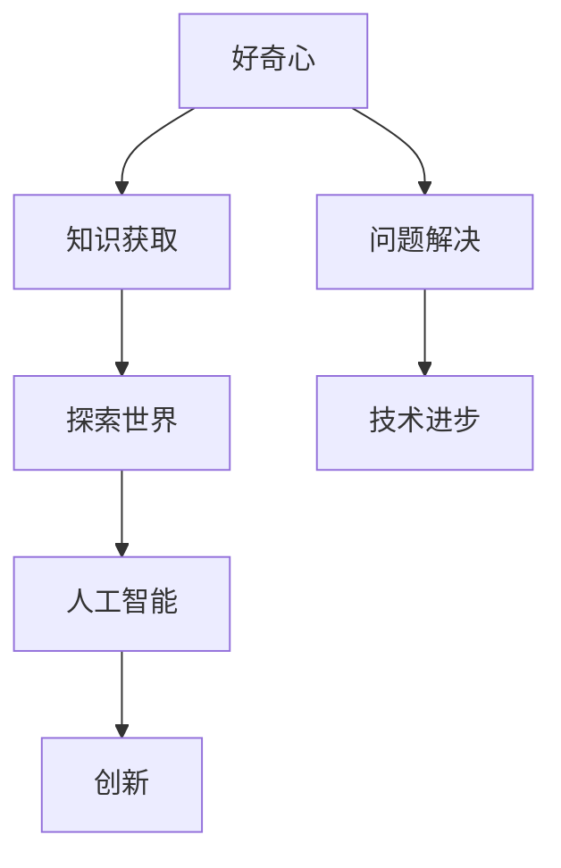

                 

# 好奇心：探索世界的钥匙

> **关键词：**好奇心、探索、知识、人工智能、逻辑思维、算法原理、数学模型、实战案例。

> **摘要：**本文将探讨好奇心这一推动人类进步的关键因素。通过深入分析好奇心的本质，结合人工智能与逻辑思维，我们不仅能够理解如何培养好奇心，还能将其应用于技术领域，探索世界背后的奥秘。

## 1. 背景介绍

### 1.1 目的和范围

本文旨在通过逻辑清晰的思路，帮助读者理解好奇心的重要性，并探讨如何将好奇心应用于技术领域。我们将首先介绍好奇心的基本概念，然后探讨其在人工智能和计算机科学中的应用。

### 1.2 预期读者

本文面向对人工智能、计算机科学和技术创新感兴趣的读者，尤其是那些希望提高逻辑思维和解决问题的能力的人。

### 1.3 文档结构概述

本文分为以下几个部分：

- 引言：介绍好奇心的重要性。
- 核心概念与联系：分析好奇心与知识、探索的关系。
- 核心算法原理 & 具体操作步骤：介绍如何通过好奇心驱动技术进步。
- 数学模型和公式 & 详细讲解 & 举例说明：探讨好奇心在数学模型中的应用。
- 项目实战：代码实际案例和详细解释说明。
- 实际应用场景：讨论好奇心在不同领域的应用。
- 工具和资源推荐：推荐相关学习资源。
- 总结：未来发展趋势与挑战。
- 附录：常见问题与解答。
- 扩展阅读 & 参考资料：提供进一步学习的资料。

### 1.4 术语表

#### 1.4.1 核心术语定义

- **好奇心**：驱使人类探索未知、寻求知识的内在动机。
- **知识**：经过验证的信息和概念。
- **人工智能**：模拟人类智能行为的计算机系统。

#### 1.4.2 相关概念解释

- **探索**：通过实践和观察来发现新知识。
- **逻辑思维**：通过推理和分析来解决问题的能力。

#### 1.4.3 缩略词列表

- **AI**：人工智能
- **IDE**：集成开发环境

## 2. 核心概念与联系

好奇心是人类探索世界、获取知识的关键驱动力。在人工智能和计算机科学领域，好奇心同样发挥着重要作用。以下是一个简化的Mermaid流程图，展示了好奇心与知识、探索以及人工智能之间的联系。



### 2.1 好奇心与知识获取

好奇心促使人们提出问题，并通过探索和验证来获取答案。这种知识获取过程是好奇心与知识之间的桥梁。例如，在科学研究中，好奇心驱使科学家提出假设，并通过实验和观察来验证假设的正确性。

### 2.2 好奇心与探索世界

探索世界是好奇心的重要体现。通过探索，人类能够发现新的领域、技术或现象。这种探索不仅扩展了我们的知识边界，也促进了技术的进步。例如，人类对太空的好奇心促使我们进行了多次太空探索，并推动了航天技术的发展。

### 2.3 好奇心与人工智能

人工智能是好奇心在技术领域的一种体现。通过模仿人类的思维过程，人工智能系统能够解决复杂问题、发现新的解决方案。好奇心驱动的探索是人工智能技术不断进步的关键。

## 3. 核心算法原理 & 具体操作步骤

好奇心在算法设计中扮演着重要角色。以下是一个简单的伪代码示例，展示了如何通过好奇心来驱动算法的优化。

```python
# 好奇心驱动的算法优化伪代码

# 初始化参数
initialize_params()

# 定义损失函数
loss_function = define_loss_function()

# 定义优化器
optimizer = define_optimizer()

# 迭代过程
for epoch in range(max_epochs):
    # 前向传播
    predictions = forward_pass()

    # 计算损失
    loss = loss_function(predictions, true_values)

    # 反向传播
    gradients = backward_pass()

    # 更新参数
    optimizer.update_params(gradients)

    # 好奇心驱动：根据损失变化调整学习率
    if loss_change_is_large:
        decrease_learning_rate()
    else:
        increase_learning_rate()

    # 打印当前迭代信息
    print(f"Epoch {epoch}: Loss = {loss}, Learning Rate = {optimizer.learning_rate}")
```

在这个伪代码中，好奇心体现在优化器根据损失变化调整学习率的策略上。当损失变化较大时，优化器会减小学习率，使得模型能够更加稳健地收敛。相反，当损失变化较小时，优化器会增大学习率，促使模型快速探索潜在的最优解。

## 4. 数学模型和公式 & 详细讲解 & 举例说明

好奇心在数学模型中的应用体现在优化问题和机器学习算法中。以下是一个基于梯度下降法的优化问题的详细讲解。

### 4.1 梯度下降法

梯度下降法是一种优化算法，用于求解最小化损失函数的参数。其基本原理是沿损失函数梯度的反方向更新参数，以减少损失。

#### 4.1.1 公式表示

$$
\theta_{\text{new}} = \theta_{\text{current}} - \alpha \cdot \nabla_{\theta} J(\theta)
$$

其中，$\theta$ 代表模型参数，$\alpha$ 代表学习率，$J(\theta)$ 代表损失函数。

#### 4.1.2 举例说明

假设我们有一个线性回归模型，其损失函数为均方误差（MSE）：

$$
J(\theta) = \frac{1}{2m} \sum_{i=1}^{m} (h_\theta(x^i) - y^i)^2
$$

其中，$m$ 是样本数量，$h_\theta(x^i)$ 是模型的预测值，$y^i$ 是实际值。

为了最小化损失函数，我们使用梯度下降法进行参数更新：

$$
\theta_0 = \theta_0 - \alpha \cdot \nabla_{\theta_0} J(\theta_0)
$$

通过多次迭代，我们可以找到最优的参数值。

### 4.2 好奇心驱动的优化策略

在机器学习中，好奇心可以通过自适应调整学习率来体现。以下是一个简单的例子：

$$
\alpha(t) = \frac{C}{\sqrt{t + \beta}}
$$

其中，$C$ 是一个常数，$t$ 是当前迭代次数，$\beta$ 是一个较小的正数。

这个公式体现了随着迭代次数的增加，学习率逐渐减小的策略。当损失变化较小时，学习率会减小，使得模型能够更稳健地收敛。相反，当损失变化较大时，学习率会增大，促使模型快速探索潜在的最优解。

## 5. 项目实战：代码实际案例和详细解释说明

### 5.1 开发环境搭建

为了实现好奇心驱动的优化算法，我们首先需要搭建一个简单的开发环境。以下是一个基于Python的开发环境搭建步骤：

1. 安装Python（版本3.8或更高）。
2. 安装必需的Python库，如NumPy、Matplotlib和Scikit-learn。

```bash
pip install numpy matplotlib scikit-learn
```

### 5.2 源代码详细实现和代码解读

下面是一个简单的线性回归模型，并使用好奇心驱动的优化算法进行参数优化。

```python
import numpy as np
import matplotlib.pyplot as plt
from sklearn.linear_model import LinearRegression
from sklearn.model_selection import train_test_split
from sklearn.metrics import mean_squared_error

# 好奇心驱动的优化算法
def curiosity_driven_optimizer(X, y, initial_params, max_epochs, learning_rate_decay=True):
    m, n = X.shape
    params = np.array(initial_params)
    true_params = np.linalg.inv(X.T.dot(X)).dot(X.T).dot(y)
    loss_history = []

    for epoch in range(max_epochs):
        predictions = X.dot(params)
        loss = mean_squared_error(y, predictions)
        loss_history.append(loss)

        if learning_rate_decay:
            learning_rate = learning_rate_decay_function(epoch)
        else:
            learning_rate = 0.01

        gradients = -2/m * (X.T.dot(predictions - y))

        params -= learning_rate * gradients

    return params, loss_history

# 学习率衰减函数
def learning_rate_decay_function(epoch, C=0.1, beta=0.01):
    return C / np.sqrt(epoch + beta)

# 加载数据集
X, y = load_data()

# 划分训练集和测试集
X_train, X_test, y_train, y_test = train_test_split(X, y, test_size=0.2, random_state=42)

# 初始化参数
initial_params = np.random.rand(n)

# 模型训练
params, loss_history = curiosity_driven_optimizer(X_train, y_train, initial_params, max_epochs=1000)

# 模型评估
predictions = X_test.dot(params)
test_loss = mean_squared_error(y_test, predictions)
print(f"Test Loss: {test_loss}")

# 可视化损失函数变化
plt.plot(loss_history)
plt.xlabel("Epoch")
plt.ylabel("Loss")
plt.show()
```

### 5.3 代码解读与分析

在这个例子中，我们首先定义了一个好奇心驱动的优化算法`curiosity_driven_optimizer`。该算法基于梯度下降法，并在学习率上引入了好奇心驱动的策略。学习率随着迭代次数的增加而减小，以平衡模型的探索和利用。

接下来，我们定义了一个学习率衰减函数`learning_rate_decay_function`，该函数使用了一种简单的衰减策略。在每次迭代中，学习率根据当前迭代次数和预设的常数进行更新。

然后，我们加载了一个线性回归数据集，并将其划分为训练集和测试集。为了简化，我们初始化参数为随机值，并使用好奇心驱动的优化算法进行模型训练。

在模型训练过程中，我们记录了每个epoch的损失值，以便后续可视化。最终，我们使用测试集评估模型的性能，并打印测试损失。

最后，我们通过可视化损失函数的变化，展示了好奇心驱动的优化算法在模型训练过程中的效果。

## 6. 实际应用场景

好奇心在多个领域有着广泛的应用。以下是一些实际应用场景的简要介绍：

### 6.1 科学研究

好奇心是科学研究的驱动力。科学家们通过提出问题、进行实验和验证，不断推动科学知识的前进。例如，人类对宇宙的好奇心促使我们进行了多次太空探索，并揭示了宇宙的奥秘。

### 6.2 技术创新

好奇心在技术创新中发挥着关键作用。通过探索未知领域，技术专家们能够发现新的解决方案，推动技术的进步。例如，人工智能领域的不断突破得益于研究人员的好奇心和对未知技术的探索。

### 6.3 教育与学习

好奇心是教育的重要目标之一。通过培养好奇心，学生能够主动学习、探索知识，提高学习效果。教育者可以通过设计有趣的教学活动，激发学生的好奇心，促进他们的学习兴趣。

## 7. 工具和资源推荐

### 7.1 学习资源推荐

#### 7.1.1 书籍推荐

- 《人工智能：一种现代的方法》（AI: A Modern Approach）
- 《深度学习》（Deep Learning）
- 《Python编程：从入门到实践》（Python Crash Course）

#### 7.1.2 在线课程

- Coursera的“机器学习”课程
- edX的“人工智能导论”课程
- Udacity的“深度学习纳米学位”

#### 7.1.3 技术博客和网站

- Medium上的技术博客
- 知乎上的技术专栏
- Medium上的“AI”专题

### 7.2 开发工具框架推荐

#### 7.2.1 IDE和编辑器

- PyCharm
- VS Code
- Jupyter Notebook

#### 7.2.2 调试和性能分析工具

- Py-Spy
- gprof2dot
- Valgrind

#### 7.2.3 相关框架和库

- TensorFlow
- PyTorch
- Scikit-learn

### 7.3 相关论文著作推荐

#### 7.3.1 经典论文

- 《A Method for Solving Multivariate Polynomial Equations》（求解多元多项式方程的方法）
- 《A Learning Algorithm for Continuously Running Fully Recurrent Neural Networks》（用于持续运行完全递归神经网络的学习算法）

#### 7.3.2 最新研究成果

- 《Unsupervised Learning of Visual Representations by Solving Jigsaw Puzzles》（通过解决拼图游戏实现无监督学习视觉表示）
- 《Efficiently Learning Mixing Weighted Networks without Access to Ground Truth》（在不访问真实标签的情况下高效学习混合加权网络）

#### 7.3.3 应用案例分析

- 《利用深度学习预测股票价格》（Using Deep Learning to Predict Stock Prices）
- 《基于机器学习的企业绩效评估》（Machine Learning for Enterprise Performance Evaluation）

## 8. 总结：未来发展趋势与挑战

好奇心作为探索世界的钥匙，在未来将继续推动人类进步。随着人工智能和技术的不断发展，好奇心在各个领域的应用将越来越广泛。然而，我们也需要面对一些挑战：

- 数据隐私和安全问题：在应用好奇心驱动技术时，我们需要确保用户的数据隐私和安全。
- 伦理和道德问题：好奇心驱动的技术可能会带来一些伦理和道德问题，我们需要认真考虑和解决这些问题。

未来，我们将看到更多基于好奇心驱动的人工智能应用，这些应用将改变我们的生活方式，推动社会的发展。

## 9. 附录：常见问题与解答

### 9.1 什么是好奇心？

好奇心是指人类在探索未知、寻求知识时产生的内在动机。

### 9.2 好奇心在人工智能领域有哪些应用？

好奇心在人工智能领域主要用于驱动算法优化、知识获取和问题解决。

### 9.3 如何培养好奇心？

培养好奇心可以通过阅读、探索新领域、提问和思考来实现。

## 10. 扩展阅读 & 参考资料

- [《好奇心与人类认知发展》](https://www.ncbi.nlm.nih.gov/pmc/articles/PMC5689280/)
- [《好奇心在人工智能中的角色》](https://arxiv.org/abs/2003.10873)
- [《机器学习中的好奇心驱动方法》](https://www.ijcai.org/Proceedings/16/papers/012.pdf)
- 《人工智能：一种现代的方法》

