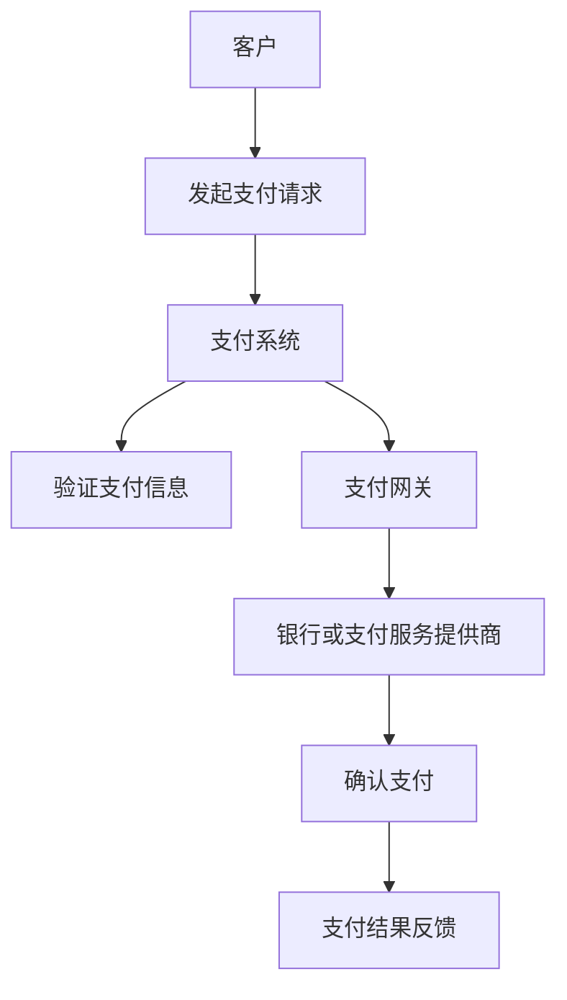

                 

# 如何利用Stripe构建创业公司的支付系统

> **关键词**：创业公司，支付系统，Stripe，API，安全性，可扩展性

> **摘要**：本文将详细介绍如何利用Stripe这一业界领先的支付处理平台，为创业公司构建稳定、安全且可扩展的支付系统。我们将从背景介绍、核心概念与联系、算法原理、数学模型、项目实战、实际应用场景等方面逐步展开，帮助读者深入了解并掌握构建支付系统的关键技术和策略。

## 1. 背景介绍

### 1.1 目的和范围

本文的目标是帮助创业公司理解并利用Stripe这一支付处理平台，快速搭建起一个高效、可靠的支付系统。我们将在文章中探讨以下主题：

- Stripe的简介及其在支付行业中的地位。
- 构建支付系统所需的核心概念和技术。
- Stripe API的使用方法和注意事项。
- 数学模型和公式在支付系统中的应用。
- 项目实战中的代码实现和详细解释。
- 实际应用场景和工具资源推荐。

### 1.2 预期读者

本文适合以下读者群体：

- 创业公司创始人或技术负责人。
- 程序员和软件开发者，特别是对支付系统开发有兴趣的。
- 对区块链、加密货币等领域有一定了解的读者。
- 对技术文档撰写和知识分享有热情的。

### 1.3 文档结构概述

本文的结构如下：

1. **背景介绍**：介绍本文的目的、读者群体和文档结构。
2. **核心概念与联系**：介绍构建支付系统所需的核心概念和技术。
3. **核心算法原理 & 具体操作步骤**：详细讲解支付系统的算法原理和操作步骤。
4. **数学模型和公式 & 详细讲解 & 举例说明**：阐述数学模型在支付系统中的作用。
5. **项目实战：代码实际案例和详细解释说明**：通过实战案例展示支付系统的实现过程。
6. **实际应用场景**：讨论支付系统在不同领域的应用。
7. **工具和资源推荐**：推荐学习资源和开发工具。
8. **总结：未来发展趋势与挑战**：分析支付系统的发展趋势和面临的挑战。
9. **附录：常见问题与解答**：回答读者可能遇到的问题。
10. **扩展阅读 & 参考资料**：提供更多相关资源以便深入学习和研究。

### 1.4 术语表

#### 1.4.1 核心术语定义

- **支付系统**：指用于处理电子支付请求的系统，包括支付网关、支付处理和资金结算等功能。
- **Stripe**：一家提供支付处理服务的公司，支持多种支付方式，包括信用卡、借记卡和数字钱包。
- **API**：应用程序编程接口，允许不同系统之间进行交互和数据交换。
- **可扩展性**：指系统能够随着业务增长和处理需求的变化而有效扩展。

#### 1.4.2 相关概念解释

- **安全性**：指支付系统的保护措施，确保交易数据不被未经授权的访问或篡改。
- **交易处理速度**：指支付系统处理交易请求的效率和速度。
- **跨境支付**：指在不同国家和货币之间进行支付处理。

#### 1.4.3 缩略词列表

- **API**：应用程序编程接口（Application Programming Interface）
- **SDK**：软件开发工具包（Software Development Kit）
- **SSL**：安全套接字层（Secure Socket Layer）
- **PCI DSS**：支付卡行业数据安全标准（Payment Card Industry Data Security Standard）

## 2. 核心概念与联系

### 核心概念

在构建创业公司的支付系统时，以下核心概念是至关重要的：

1. **支付流程**：支付流程是支付系统运作的核心。通常包括以下步骤：
    - 客户发起支付请求。
    - 支付系统验证客户支付信息。
    - 支付网关处理支付请求。
    - 银行或支付服务提供商确认支付。
    - 支付结果反馈给客户。

2. **支付方式**：支付系统需要支持多种支付方式，以满足不同客户的需求。常见的支付方式包括：
    - 信用卡和借记卡。
    - 数字钱包（如PayPal、微信支付、支付宝等）。
    - 跨境支付（涉及不同货币和国家的支付）。

3. **安全性**：支付系统必须确保交易数据的安全，防止数据泄露和欺诈行为。常见的安全措施包括：
    - 加密：对敏感数据进行加密处理。
    - 验证：通过多重验证确保交易的真实性。
    - 安全协议：如SSL/TLS，确保数据传输的安全性。

4. **可扩展性**：随着业务增长，支付系统需要能够轻松扩展以处理更多的交易。这包括：
    - 模块化设计：支付系统应采用模块化设计，便于添加新功能。
    - 云服务：利用云服务扩展系统资源。

### 联系

为了更好地理解这些核心概念，以下是一个简化的Mermaid流程图，展示了支付系统的基本架构和流程。



在这个流程图中，客户通过支付系统发起支付请求，支付系统验证支付信息并传递给支付网关，支付网关与银行或支付服务提供商进行交互，最终确认支付并将结果反馈给客户。

## 3. 核心算法原理 & 具体操作步骤

### 支付系统的算法原理

支付系统的核心算法涉及以下几个方面：

1. **身份验证**：确保交易发起者的身份真实性。
2. **交易验证**：验证交易请求的合法性。
3. **加密处理**：对敏感数据进行加密，确保数据传输的安全性。
4. **支付确认**：确认支付是否成功。

### 具体操作步骤

以下是构建支付系统的具体操作步骤：

1. **身份验证**
    - 步骤1：客户发起支付请求时，支付系统要求客户提供身份验证信息，如用户名和密码。
    - 步骤2：支付系统验证客户身份信息是否与数据库中的记录匹配。
    - 步骤3：如果验证通过，系统允许客户继续操作。

2. **交易验证**
    - 步骤1：客户选择支付方式并提交支付请求。
    - 步骤2：支付系统检查支付请求中的金额和支付方式是否有效。
    - 步骤3：支付系统通过API与第三方支付网关进行通信，验证支付请求的合法性。

3. **加密处理**
    - 步骤1：支付系统对客户的支付信息进行加密处理，确保数据在传输过程中不会被窃取。
    - 步骤2：使用SSL/TLS等安全协议保护数据传输。

4. **支付确认**
    - 步骤1：支付网关向银行或支付服务提供商发送支付请求。
    - 步骤2：银行或支付服务提供商处理支付请求，并返回支付结果。
    - 步骤3：支付系统根据支付结果更新客户账户余额，并反馈给客户。

以下是支付系统的伪代码实现：

```python
def process_payment(customer_info, payment_request):
    # 身份验证
    if not verify_identity(customer_info):
        return "身份验证失败"
    
    # 交易验证
    if not validate_payment_request(payment_request):
        return "支付请求无效"
    
    # 加密处理
    encrypted_data = encrypt_payment_data(payment_request)
    
    # 支付确认
    payment_result = confirm_payment(encrypted_data)
    
    if payment_result == "支付成功":
        update_customer_balance(payment_request['amount'])
        return "支付成功"
    else:
        return "支付失败"
```

## 4. 数学模型和公式 & 详细讲解 & 举例说明

### 数学模型在支付系统中的应用

支付系统中的数学模型主要涉及以下几个方面：

1. **加密算法**：用于保护支付信息的安全。
2. **哈希函数**：用于验证数据的完整性和一致性。
3. **数字签名**：用于确保交易的真实性和不可篡改性。

### 详细讲解

#### 加密算法

加密算法用于保护支付信息的安全，防止数据在传输过程中被窃取或篡改。常见的加密算法包括：

- **对称加密**：使用相同的密钥进行加密和解密。例如，AES（高级加密标准）。
- **非对称加密**：使用一对密钥进行加密和解密，一个用于加密，一个用于解密。例如，RSA（Rivest-Shamir-Adleman）。

#### 哈希函数

哈希函数用于验证数据的完整性和一致性。常见的哈希函数包括：

- **MD5**：将数据映射为一个128位的哈希值。
- **SHA-256**：将数据映射为一个256位的哈希值。

#### 数字签名

数字签名用于确保交易的真实性和不可篡改性。数字签名的工作原理如下：

- **签名过程**：交易发起者使用私钥对交易信息进行签名。
- **验证过程**：交易接收者使用公钥验证签名的有效性。

### 举例说明

#### 对称加密

使用AES加密算法对支付信息进行加密的伪代码如下：

```python
from Crypto.Cipher import AES
from Crypto.Util.Padding import pad

def encrypt_data(data, key):
    cipher = AES.new(key, AES.MODE_CBC)
    ct_bytes = cipher.encrypt(pad(data, AES.block_size))
    iv = cipher.iv
    return iv, ct_bytes

key = b'my-secret-key'
data = b'This is a payment request'
iv, encrypted_data = encrypt_data(data, key)
print("Encrypted data:", encrypted_data)
```

#### 哈希函数

使用SHA-256对支付信息进行哈希计算的伪代码如下：

```python
import hashlib

def calculate_hash(data):
    sha_signature = hashlib.sha256()
    sha_signature.update(data.encode('utf-8'))
    return sha_signature.hexdigest()

data = "This is a payment request"
hash_value = calculate_hash(data)
print("Hash value:", hash_value)
```

#### 数字签名

使用RSA算法对支付信息进行数字签名的伪代码如下：

```python
from Crypto.PublicKey import RSA
from Crypto.Signature import pkcs1_15
from Crypto.Hash import SHA256

def generate_keys():
    key = RSA.generate(2048)
    private_key = key.export_key()
    public_key = key.publickey().export_key()
    return private_key, public_key

def sign_data(data, private_key):
    hash_value = SHA256.new(data.encode('utf-8'))
    private_key = RSA.import_key(private_key)
    signature = pkcs1_15.new(private_key).sign(hash_value)
    return signature

def verify_signature(data, signature, public_key):
    hash_value = SHA256.new(data.encode('utf-8'))
    public_key = RSA.import_key(public_key)
    try:
        pkcs1_15.new(public_key).verify(hash_value, signature)
        return "签名验证成功"
    except (ValueError, TypeError):
        return "签名验证失败"

private_key, public_key = generate_keys()
data = "This is a payment request"
signature = sign_data(data, private_key)
print("Signature:", signature)
print(verify_signature(data, signature, public_key))
```

## 5. 项目实战：代码实际案例和详细解释说明

### 5.1 开发环境搭建

为了演示如何使用Stripe构建支付系统，我们需要搭建一个开发环境。以下是所需的工具和步骤：

1. **安装Stripe账户**：在[Stripe官网](https://www.stripe.com/)注册一个账户。
2. **安装Node.js**：访问[Node.js官网](https://nodejs.org/)下载并安装Node.js。
3. **安装npm**：Node.js会自动安装npm，如果未安装，可以通过命令`npm install -g npm`进行安装。
4. **创建新项目**：在命令行中使用`npm init`创建一个新的Node.js项目。
5. **安装依赖项**：在项目目录下运行`npm install stripe`安装Stripe SDK。

### 5.2 源代码详细实现和代码解读

以下是一个简单的支付系统示例，演示了如何使用Stripe API处理支付请求。

#### 5.2.1 支付请求处理

```javascript
const stripe = require('stripe')(process.env.STRIPE_SECRET_KEY);

// 处理支付请求
app.post('/pay', async (req, res) => {
    try {
        // 从请求中获取支付信息
        const { amount, currency, paymentMethodId } = req.body;

        // 创建支付意图
        const paymentIntent = await stripe.paymentIntents.create({
            amount: amount,
            currency: currency,
            payment_method: paymentMethodId,
            confirmation_method: 'manual',
        });

        // 如果支付意图创建成功，返回支付页面URL
        if (paymentIntent.status === 'succeeded') {
            res.status(200).json({ paymentIntent: paymentIntent, redirect: paymentIntent.next_action.client_secret });
        } else {
            res.status(400).json({ error: '支付失败' });
        }
    } catch (error) {
        res.status(500).json({ error: '服务器错误' });
    }
});
```

#### 5.2.2 代码解读

- **引入Stripe SDK**：首先，我们引入Stripe SDK，使用环境变量中的`STRIPE_SECRET_KEY`作为密钥。
- **处理支付请求**：`/pay`路由处理POST请求，获取支付金额、货币类型和支付方式ID。
- **创建支付意图**：使用Stripe API创建支付意图，这将启动支付流程。
- **返回支付页面URL**：如果支付意图创建成功，系统将返回支付页面URL，以便用户完成支付。

#### 5.2.3 代码分析与改进

1. **错误处理**：在代码中应添加更详细的错误处理，以便在发生错误时提供更具体的错误信息。
2. **日志记录**：添加日志记录功能，以便在开发和维护过程中跟踪系统的运行状态。
3. **安全性增强**：确保支付请求的验证和加密处理，防止中间人攻击和其他安全威胁。

### 5.3 代码解读与分析

以下是对示例代码的详细解读和分析：

- **Stripe SDK的使用**：Stripe SDK提供了简单且强大的API接口，使我们能够轻松地集成Stripe支付功能。
- **支付请求处理**：支付请求处理包括验证请求参数、创建支付意图和返回支付页面URL。在这个过程中，我们需要处理各种可能出现的错误，例如无效的支付方式或支付金额。
- **安全性**：支付系统应确保所有敏感数据（如支付方式ID）都在HTTPS协议下传输，以防止数据泄露。
- **可扩展性**：支付系统应设计为易于扩展，以适应未来可能的需求变化，例如添加新的支付方式或处理不同的货币。

### 实战总结

通过以上实战案例，我们展示了如何使用Stripe构建一个基本的支付系统。该系统包括处理支付请求、创建支付意图和返回支付页面URL等核心功能。虽然这是一个简单的示例，但它提供了一个框架，可以帮助创业公司快速搭建支付系统，并在此基础上进行扩展和优化。

## 6. 实际应用场景

支付系统在创业公司的应用场景非常广泛，以下是一些典型的应用场景：

1. **电子商务**：创业公司通常需要为其在线商店构建支付系统，以允许客户购买商品。这包括处理订单支付、管理库存和提供无缝的购物体验。
2. **会员订阅**：许多创业公司提供会员订阅服务，需要支付系统处理会员的订阅费用，并确保自动续费。
3. **支付解决方案**：创业公司还可以开发独立的支付解决方案，为其他企业提供服务。例如，为餐饮业提供在线支付系统，或为小型企业构建跨境支付解决方案。
4. **资金管理**：支付系统可以帮助创业公司更好地管理资金流动，包括收入、支出和预算规划。
5. **移动支付**：随着移动设备的普及，创业公司可以通过开发移动支付应用，为用户提供便捷的支付体验。

### 案例研究

以下是一个关于创业公司成功应用支付系统的案例研究：

**案例名称**：小蜜蜂咖啡

**背景**：小蜜蜂咖啡是一家新兴的咖啡连锁店，希望为其客户提供一个便捷的在线支付体验。

**解决方案**：小蜜蜂咖啡决定使用Stripe构建其支付系统。他们选择 Stripe 因为它提供了强大的API、易于集成的SDK以及全面的安全功能。他们的支付系统包括以下关键功能：

- **在线支付**：客户可以通过小蜜蜂咖啡的网站或移动应用在线支付购买咖啡的费用。
- **会员支付**：会员可以通过支付系统自动续费，享受会员优惠。
- **跨境支付**：小蜜蜂咖啡的目标市场包括海外客户，Stripe的支持多种货币和跨境支付的能力使其能够轻松地处理国际订单。

**结果**：小蜜蜂咖啡的支付系统上线后，客户满意度显著提升，订单处理速度加快，运营成本降低。他们还能够更好地管理资金流动，为未来的业务增长打下坚实基础。

## 7. 工具和资源推荐

### 7.1 学习资源推荐

#### 7.1.1 书籍推荐

- 《支付系统设计：构建安全的、高效的支付处理系统》
- 《区块链技术指南：从概念到应用》
- 《Web前端工程师面试宝典》

#### 7.1.2 在线课程

- 《React.js 从入门到精通》
- 《支付系统与区块链技术》
- 《网络安全与加密技术》

#### 7.1.3 技术博客和网站

- [ Stripe 官方文档](https://stripe.com/docs)
- [ Medium - Blockchain Hub](https://medium.com/区块链-精选)
- [ FreeCodeCamp - JavaScript Algorithms and Data Structures](https://www.freecodecamp.org/news/javascript-algorithms-and-data-structures/)

### 7.2 开发工具框架推荐

#### 7.2.1 IDE和编辑器

- Visual Studio Code
- IntelliJ IDEA
- PyCharm

#### 7.2.2 调试和性能分析工具

- Chrome DevTools
- Firebase Performance Monitor
- New Relic

#### 7.2.3 相关框架和库

- React.js
- Angular
- Vue.js
- Node.js
- Express.js

### 7.3 相关论文著作推荐

#### 7.3.1 经典论文

- "Bitcoin: A Peer-to-Peer Electronic Cash System" by Satoshi Nakamoto
- "Secure Multiparty Computation for Cryptographic Protocols" by Goldreich et al.
- "The Design and Analysis of Secure Computer Systems" by Anderson et al.

#### 7.3.2 最新研究成果

- "Decentralized Finance: A Framework for Understanding the Emerging Landscape" by Coin Metrics
- "The Economics of Bitcoin Mining, 2013-2021" by Alex de Vries
- "Trends in Cryptocurrency Adoption and Use" by Cambridge Centre for Alternative Finance

#### 7.3.3 应用案例分析

- "How eBay Implemented a Secure and Scalable Payment System" by eBay
- "The Challenges of Building a Cross-Border Payment System: A Case Study of PayPal" by PayPal
- "Cryptocurrency Payment Systems: A Study of Bitcoin in the Real World" by FinTech Global

## 8. 总结：未来发展趋势与挑战

随着技术的不断进步和市场的需求变化，支付系统的发展趋势和面临的挑战也在不断演变。以下是未来支付系统发展的几个关键趋势和挑战：

### 未来发展趋势

1. **区块链技术的普及**：区块链技术为支付系统提供了去中心化、安全性和透明性，有望在未来得到更广泛的应用。
2. **移动支付和数字钱包的普及**：随着智能手机的普及，移动支付和数字钱包将逐渐取代传统支付方式，成为主流支付方式。
3. **跨境支付的便利性**：随着全球化的推进，跨境支付的需求不断增加，支付系统需要提供更快速、更低成本的跨境支付解决方案。
4. **人工智能和机器学习在支付系统中的应用**：人工智能和机器学习技术可以帮助支付系统更好地进行风险管理、欺诈检测和用户体验优化。

### 面临的挑战

1. **安全性**：支付系统的安全性是用户最为关心的问题，任何安全漏洞都可能导致巨额资金损失。
2. **合规性**：支付系统需要遵守各种国家和地区的法律法规，例如数据保护法和反洗钱法规。
3. **用户体验**：支付系统需要提供简单、快速和无缝的支付体验，以吸引用户使用。
4. **技术复杂性**：构建和维护一个稳定、安全且可扩展的支付系统需要复杂的技术架构和专业知识。
5. **市场变化**：支付市场的竞争激烈，支付系统需要不断创新和优化，以适应市场变化和用户需求。

## 9. 附录：常见问题与解答

### 9.1 为什么选择Stripe构建支付系统？

选择Stripe构建支付系统的原因包括：

- **易于集成**：Stripe提供了简单的API和SDK，使其易于集成到各种应用程序中。
- **全球覆盖**：Stripe支持全球范围内的支付方式，包括信用卡、借记卡和多种数字钱包。
- **安全性**：Stripe采用了先进的安全措施，包括数据加密、多重验证和合规性保证。
- **可扩展性**：Stripe的支付系统设计为可扩展，可以轻松应对业务增长和处理更大的交易量。

### 9.2 如何确保支付系统的安全性？

确保支付系统的安全性可以通过以下措施实现：

- **数据加密**：使用HTTPS和SSL/TLS等加密协议确保数据在传输过程中的安全性。
- **多重验证**：对支付请求进行多重验证，确保交易的真实性和合法性。
- **合规性**：遵守PCI DSS等国际支付行业安全标准，确保系统的合规性。
- **安全审计**：定期进行安全审计和漏洞扫描，及时修复安全漏洞。

### 9.3 支付系统的可扩展性如何实现？

支付系统的可扩展性可以通过以下方法实现：

- **模块化设计**：采用模块化设计，使系统能够灵活扩展和升级。
- **云服务**：利用云服务扩展系统资源，提高系统的可扩展性和可靠性。
- **异步处理**：使用异步处理和消息队列技术，提高系统的并发处理能力和响应速度。

## 10. 扩展阅读 & 参考资料

为了更深入地了解支付系统的构建和运作，以下是一些扩展阅读和参考资料：

- [《支付系统设计与实现》](https://www.oreilly.com/library/view/payments-systems-design-and/9781449326147/)：一本全面的支付系统设计书籍，涵盖支付系统的各个方面。
- [《区块链：从入门到实践》](https://www.oreilly.com/library/view/blockchain-from-basics-to/9781492034672/)：介绍区块链技术的书籍，适合初学者了解区块链的基本概念和应用。
- [《现代支付系统》](https://www.amazon.com/Modern-Payment-Systems-Fifth-Edition/dp/0135021643)：详细介绍了现代支付系统的架构和技术，适合对支付系统有深入了解的读者。
- [Stripe官方文档](https://stripe.com/docs)：提供全面的API参考和开发指南，是使用Stripe构建支付系统不可或缺的资料。

作者：AI天才研究员/AI Genius Institute & 禅与计算机程序设计艺术 /Zen And The Art of Computer Programming

