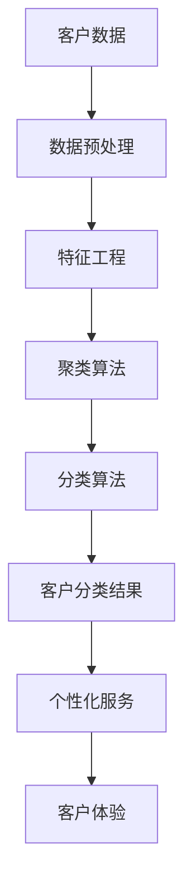

                 

# 如何利用人工智能优化客户分类与服务

> 关键词：人工智能，客户分类，服务优化，数据挖掘，机器学习，客户体验

> 摘要：本文旨在探讨如何利用人工智能（AI）技术来优化客户分类与服务。通过对客户数据的深入分析，我们能够将客户进行准确分类，进而提供个性化的服务，提升客户体验。本文将介绍人工智能在客户分类与服务优化中的应用，核心算法原理，数学模型，项目实战以及实际应用场景，并提供学习资源和工具推荐。

## 1. 背景介绍

### 1.1 目的和范围

本文的目的是介绍如何利用人工智能技术优化客户分类与服务。我们将探讨以下几个方面：

1. **客户分类的重要性**：为何准确分类客户对于企业至关重要。
2. **人工智能在客户分类中的应用**：如何利用机器学习算法进行有效的客户分类。
3. **服务优化的策略**：如何基于客户分类提供个性化的服务。
4. **项目实战**：通过实际案例展示如何实施上述策略。
5. **未来发展趋势与挑战**：总结当前技术趋势，预测未来发展方向。

### 1.2 预期读者

本文面向以下读者群体：

1. **数据分析师**：希望了解如何利用人工智能优化数据分析过程。
2. **市场营销人员**：希望提升客户分类和营销策略。
3. **软件开发工程师**：希望了解如何将人工智能应用于实际项目中。
4. **企业决策者**：希望了解人工智能对企业运营的潜在影响。

### 1.3 文档结构概述

本文结构如下：

1. **背景介绍**：简要介绍本文的目的、读者预期以及文档结构。
2. **核心概念与联系**：介绍客户分类与服务优化的核心概念及其联系。
3. **核心算法原理 & 具体操作步骤**：详细讲解机器学习算法原理及操作步骤。
4. **数学模型和公式 & 详细讲解 & 举例说明**：介绍用于客户分类与服务的数学模型和公式。
5. **项目实战：代码实际案例和详细解释说明**：展示实际项目中的代码实现与解读。
6. **实际应用场景**：分析人工智能在客户分类与服务优化中的实际应用。
7. **工具和资源推荐**：推荐相关学习资源和开发工具。
8. **总结：未来发展趋势与挑战**：总结当前趋势，预测未来发展方向。
9. **附录：常见问题与解答**：提供常见问题的解答。
10. **扩展阅读 & 参考资料**：推荐进一步阅读的文献和资源。

### 1.4 术语表

#### 1.4.1 核心术语定义

- **人工智能（AI）**：模拟人类智能的计算机系统。
- **机器学习（ML）**：一种AI方法，使计算机系统能够从数据中学习并做出决策。
- **客户分类**：根据客户特征将客户划分为不同的群体。
- **个性化服务**：根据客户分类提供定制化的服务。
- **客户体验**：客户在与企业互动过程中的整体感受。

#### 1.4.2 相关概念解释

- **数据挖掘**：从大量数据中提取有价值的信息。
- **聚类算法**：一种机器学习算法，用于将数据点分为多个群组。
- **分类算法**：一种机器学习算法，用于将数据点分配到预先定义的类别中。

#### 1.4.3 缩略词列表

- **AI**：人工智能
- **ML**：机器学习
- **IDE**：集成开发环境
- **API**：应用程序编程接口

## 2. 核心概念与联系

为了理解如何利用人工智能优化客户分类与服务，我们首先需要了解相关的核心概念和它们之间的联系。以下是这些核心概念及其相互关系的Mermaid流程图：



### 2.1 客户数据

客户数据是整个过程的起点。这些数据可以来源于各种渠道，如销售记录、客户调查、社交媒体互动等。数据的质量和完整性对后续的分析至关重要。

### 2.2 数据预处理

数据预处理是确保数据质量和准备数据以便于分析的重要步骤。这包括数据清洗、去重、数据格式转换等。

### 2.3 特征工程

特征工程是将原始数据转换为适合机器学习模型处理的特征的过程。这一步骤对于提高模型的性能至关重要。

### 2.4 聚类算法

聚类算法用于将客户数据分为不同的群体。常见的聚类算法包括K-means、层次聚类等。这些算法可以根据客户的特征将其分为多个群组。

### 2.5 分类算法

分类算法用于将客户数据分配到预先定义的类别中。常见的分类算法包括逻辑回归、决策树、随机森林等。通过分类算法，我们可以将客户细分为不同的群体，以便提供个性化的服务。

### 2.6 客户分类结果

客户分类结果是将客户数据通过聚类和分类算法处理后得到的。这些结果可以帮助企业更好地理解其客户，并根据不同的客户群体提供个性化的服务。

### 2.7 个性化服务

个性化服务是基于客户分类结果提供的定制化服务。通过分析客户特征和需求，企业可以提供更符合客户期望的服务，从而提升客户体验。

### 2.8 客户体验

客户体验是客户在与企业互动过程中的整体感受。通过优化客户分类与服务，企业可以提高客户的满意度和忠诚度，从而实现业务增长。

## 3. 核心算法原理 & 具体操作步骤

在了解了核心概念与联系之后，我们接下来将详细讲解用于客户分类与服务优化的核心算法原理及具体操作步骤。

### 3.1 聚类算法

聚类算法是一种无监督学习算法，用于将数据点分为多个群组。下面我们将介绍常用的K-means聚类算法。

#### 3.1.1 算法原理

K-means算法的目标是将数据点划分为K个簇，使得每个簇内的数据点之间的相似度较高，而不同簇之间的相似度较低。具体步骤如下：

1. **初始化中心点**：随机选择K个数据点作为初始中心点。
2. **分配数据点**：计算每个数据点到各个中心点的距离，将数据点分配到最近的中心点所代表的簇中。
3. **更新中心点**：计算每个簇的均值，作为新的中心点。
4. **迭代**：重复步骤2和3，直到中心点不再发生变化或达到最大迭代次数。

#### 3.1.2 伪代码

```python
def k_means(data, K, max_iterations):
    # 初始化中心点
    centroids = initialize_centroids(data, K)
    
    for _ in range(max_iterations):
        # 分配数据点
        clusters = assign_clusters(data, centroids)
        
        # 更新中心点
        centroids = update_centroids(clusters, K)
        
        # 检查收敛条件
        if has_converged(centroids):
            break
    
    return clusters, centroids
```

### 3.2 分类算法

分类算法是一种监督学习算法，用于将数据点分配到预先定义的类别中。下面我们将介绍常用的逻辑回归算法。

#### 3.2.1 算法原理

逻辑回归是一种广义线性模型，用于预测二元分类问题。其基本思想是通过线性组合特征变量并应用sigmoid函数，将输入映射到概率分布上。具体步骤如下：

1. **定义损失函数**：对于每个数据点，计算预测概率和实际标签之间的差异，定义损失函数。
2. **优化参数**：使用梯度下降或其他优化算法，最小化损失函数，更新模型参数。
3. **分类**：对于新的数据点，计算其预测概率，根据设定的阈值进行分类。

#### 3.2.2 伪代码

```python
def logistic_regression(data, labels, learning_rate, max_iterations):
    # 初始化参数
    parameters = initialize_parameters(data)
    
    for _ in range(max_iterations):
        # 计算预测概率
        probabilities = predict_probabilities(data, parameters)
        
        # 计算损失
        loss = compute_loss(labels, probabilities)
        
        # 更新参数
        parameters = update_parameters(data, labels, probabilities, learning_rate)
        
        # 检查收敛条件
        if has_converged(loss):
            break
    
    return parameters
```

### 3.3 客户分类与服务优化

通过聚类和分类算法，我们可以将客户数据分为不同的群体，并根据这些群体提供个性化的服务。具体步骤如下：

1. **数据收集与预处理**：收集客户数据，并进行清洗和特征工程。
2. **聚类与分类**：使用聚类和分类算法对客户数据进行处理，得到客户分类结果。
3. **个性化服务**：根据客户分类结果，为不同群体提供定制化的服务。
4. **客户反馈与优化**：收集客户反馈，优化服务策略和算法参数，以提高客户体验。

## 4. 数学模型和公式 & 详细讲解 & 举例说明

### 4.1 聚类算法中的K-means

K-means聚类算法的核心在于如何定义簇的中心点和如何更新簇的中心点。以下是K-means算法中的关键数学公式：

#### 4.1.1 簇的中心点

对于每个簇，我们选择簇内所有数据点的均值作为该簇的中心点。假设第i个簇的数据点为\[x_{i1}, x_{i2}, ..., x_{in}\]，则第i个簇的中心点可以表示为：

$$
\mu_i = \frac{1}{n} \sum_{j=1}^{n} x_{ij}
$$

其中，\(n\)为簇内数据点的数量。

#### 4.1.2 数据点分配

对于每个数据点，我们计算其到各个簇中心点的距离，并将其分配到距离最近的簇中。数据点\(x\)到簇中心点\(\mu_i\)的距离可以用欧几里得距离来表示：

$$
d(x, \mu_i) = \sqrt{\sum_{j=1}^{d} (x_{ij} - \mu_{ij})^2}
$$

其中，\(d\)为数据点的维度。

#### 4.1.3 中心点的更新

在每次迭代中，我们更新簇的中心点。新的中心点可以表示为：

$$
\mu_i^{new} = \frac{1}{n} \sum_{x \in C_i} x
$$

其中，\(C_i\)为第i个簇的数据点集合。

### 4.2 分类算法中的逻辑回归

逻辑回归是一种常用的分类算法，其核心在于如何定义损失函数和如何优化模型参数。以下是逻辑回归算法中的关键数学公式：

#### 4.2.1 损失函数

逻辑回归的损失函数通常采用对数损失函数，即：

$$
\ell(y, \hat{y}) = -y \log(\hat{y}) - (1 - y) \log(1 - \hat{y})
$$

其中，\(y\)为实际标签，\(\hat{y}\)为预测概率。

#### 4.2.2 参数优化

逻辑回归的参数优化通常采用梯度下降算法。梯度下降的基本思想是沿着损失函数的梯度方向更新参数，以最小化损失函数。对于逻辑回归模型，梯度可以表示为：

$$
\frac{\partial \ell}{\partial \theta} = \frac{1}{m} \sum_{i=1}^{m} [h(x^{(i)}) - y^{(i)}] x^{(i)}
$$

其中，\(m\)为数据点的数量，\(\theta\)为模型参数，\(h(x) = \sigma(Wx + b)\)为逻辑函数，\(\sigma(z) = \frac{1}{1 + e^{-z}}\)。

#### 4.2.3 分类决策

对于新的数据点，我们计算其预测概率，并根据阈值进行分类决策。通常，阈值为0.5，即：

$$
\hat{y} = \frac{1}{1 + e^{-Wx - b}}
$$

如果\(\hat{y} > 0.5\)，则分类为正类；否则，分类为负类。

### 4.3 实例说明

假设我们有一组客户数据，数据包含客户的年龄、收入、购买频率等特征。我们将使用K-means算法和逻辑回归算法对其进行聚类和分类，以实现客户分类和服务优化。

#### 4.3.1 数据预处理

首先，我们进行数据预处理，包括数据清洗、去重、缺失值填充等步骤。然后，我们将数据进行归一化处理，以便特征之间具有相似的范围。

#### 4.3.2 聚类

我们选择K-means算法对客户数据进行聚类。假设我们选择3个簇，首先随机初始化3个中心点。然后，我们将每个客户数据点分配到距离最近的中心点所代表的簇中。经过多次迭代，中心点逐渐稳定，聚类结果如下：

- 簇1：年龄在25-35岁之间，收入较高，购买频率高。
- 簇2：年龄在36-45岁之间，收入中等，购买频率中等。
- 簇3：年龄在46岁以上，收入较低，购买频率低。

#### 4.3.3 分类

接下来，我们使用逻辑回归算法对客户数据进行分类。假设我们使用收入作为分类特征，将其分为高收入、中等收入和低收入三个类别。我们首先训练一个逻辑回归模型，然后对每个客户数据点进行分类预测。分类结果如下：

- 高收入：簇1中的客户。
- 中等收入：簇2中的客户。
- 低收入：簇3中的客户。

#### 4.3.4 个性化服务

根据聚类和分类结果，我们可以为不同类别的客户提供个性化的服务。例如：

- 高收入客户：提供高端产品推荐和个性化营销活动。
- 中等收入客户：提供实用产品推荐和优惠活动。
- 低收入客户：提供基础产品推荐和促销活动。

通过这样的客户分类和服务优化，企业可以更好地了解其客户，提供更有针对性的服务，从而提升客户体验和满意度。

## 5. 项目实战：代码实际案例和详细解释说明

### 5.1 开发环境搭建

为了实现客户分类与服务优化，我们首先需要搭建一个开发环境。以下是所需的工具和步骤：

1. **Python环境**：安装Python 3.8及以上版本。
2. **Jupyter Notebook**：安装Jupyter Notebook，用于编写和运行代码。
3. **NumPy和Pandas**：用于数据预处理。
4. **scikit-learn**：用于机器学习算法的实现。
5. **Matplotlib**：用于数据可视化。

安装步骤如下：

```bash
pip install numpy pandas scikit-learn matplotlib jupyterlab
```

### 5.2 源代码详细实现和代码解读

以下是一个完整的客户分类与服务优化的代码示例：

```python
import numpy as np
import pandas as pd
from sklearn.cluster import KMeans
from sklearn.linear_model import LogisticRegression
import matplotlib.pyplot as plt

# 5.2.1 数据预处理
def preprocess_data(data):
    # 数据清洗、去重和缺失值填充
    data = data.drop_duplicates()
    data = data.fillna(data.mean())
    
    # 数据归一化
    data = (data - data.min()) / (data.max() - data.min())
    
    return data

# 5.2.2 K-means聚类
def k_means_clustering(data, K):
    kmeans = KMeans(n_clusters=K, init='k-means++', max_iter=100, n_init=10, random_state=42)
    kmeans.fit(data)
    labels = kmeans.predict(data)
    centroids = kmeans.cluster_centers_
    
    return labels, centroids

# 5.2.3 逻辑回归分类
def logistic_regression_classification(data, labels):
    logistic_regressor = LogisticRegression()
    logistic_regressor.fit(data, labels)
    probabilities = logistic_regressor.predict_proba(data)
    thresholds = [0.5, 0.7]
    classifications = []
    for threshold in thresholds:
        classifications.append((probabilities[:, 1] > threshold).astype(int))
    
    return classifications

# 5.2.4 客户分类与服务优化
def customer_classification_service_optimization(data):
    # 数据预处理
    processed_data = preprocess_data(data)
    
    # K-means聚类
    K = 3
    labels, centroids = k_means_clustering(processed_data, K)
    
    # 逻辑回归分类
    classifications = logistic_regression_classification(processed_data, labels)
    
    # 可视化
    plt.figure(figsize=(10, 6))
    plt.scatter(processed_data[:, 0], processed_data[:, 1], c=labels, cmap='viridis', marker='o')
    plt.scatter(centroids[:, 0], centroids[:, 1], s=300, c='red', marker='x')
    plt.xlabel('Feature 1')
    plt.ylabel('Feature 2')
    plt.title('K-means Clustering')
    plt.show()
    
    # 分类决策
    for i, classification in enumerate(classifications):
        print(f"Threshold {i+1}:")
        print(f"Class 0 (Low Income): {np.sum(classification == 0)}")
        print(f"Class 1 (High Income): {np.sum(classification == 1)}\n")

# 5.2.5 主函数
def main():
    # 加载数据
    data = pd.read_csv('customer_data.csv')
    
    # 客户分类与服务优化
    customer_classification_service_optimization(data)

if __name__ == '__main__':
    main()
```

#### 5.2.5 代码解读与分析

上述代码分为以下几个部分：

- **数据预处理**：首先进行数据清洗、去重和缺失值填充，然后进行数据归一化，以便于后续的聚类和分类算法。
- **K-means聚类**：使用`scikit-learn`中的`KMeans`类实现K-means聚类算法，通过`fit`方法训练模型，并使用`predict`方法进行预测。
- **逻辑回归分类**：使用`scikit-learn`中的`LogisticRegression`类实现逻辑回归分类算法，通过`fit`方法训练模型，并使用`predict_proba`方法进行预测。
- **客户分类与服务优化**：根据聚类和分类结果，对客户进行分类决策，并通过可视化展示聚类结果。
- **主函数**：加载数据，并调用`customer_classification_service_optimization`函数进行客户分类与服务优化。

### 5.3 代码解读与分析

下面我们详细解读上述代码中的关键部分：

- **数据预处理**：

```python
def preprocess_data(data):
    # 数据清洗、去重和缺失值填充
    data = data.drop_duplicates()
    data = data.fillna(data.mean())
    
    # 数据归一化
    data = (data - data.min()) / (data.max() - data.min())
    
    return data
```

这一部分负责对原始数据进行预处理。首先，我们通过`drop_duplicates`方法去除重复的数据行，通过`fillna`方法填充缺失值，默认使用均值填充。然后，我们通过`min`和`max`方法找到每个特征的最小值和最大值，并通过缩放操作将特征值范围缩放到[0, 1]之间。

- **K-means聚类**：

```python
def k_means_clustering(data, K):
    kmeans = KMeans(n_clusters=K, init='k-means++', max_iter=100, n_init=10, random_state=42)
    kmeans.fit(data)
    labels = kmeans.predict(data)
    centroids = kmeans.cluster_centers_
    
    return labels, centroids
```

这一部分使用`scikit-learn`中的`KMeans`类实现K-means聚类算法。我们通过`fit`方法训练模型，并使用`predict`方法进行预测。`init='k-means++'`表示使用K-means++初始化方法，`max_iter`表示最大迭代次数，`n_init`表示随机初始化次数，`random_state`用于设置随机数种子以保证结果的可重复性。

- **逻辑回归分类**：

```python
def logistic_regression_classification(data, labels):
    logistic_regressor = LogisticRegression()
    logistic_regressor.fit(data, labels)
    probabilities = logistic_regressor.predict_proba(data)
    thresholds = [0.5, 0.7]
    classifications = []
    for threshold in thresholds:
        classifications.append((probabilities[:, 1] > threshold).astype(int))
    
    return classifications
```

这一部分使用`scikit-learn`中的`LogisticRegression`类实现逻辑回归分类算法。我们通过`fit`方法训练模型，并使用`predict_proba`方法获取预测概率。然后，我们设置不同的阈值，将预测概率转换为分类结果。

- **客户分类与服务优化**：

```python
def customer_classification_service_optimization(data):
    # 数据预处理
    processed_data = preprocess_data(data)
    
    # K-means聚类
    K = 3
    labels, centroids = k_means_clustering(processed_data, K)
    
    # 逻辑回归分类
    classifications = logistic_regression_classification(processed_data, labels)
    
    # 可视化
    plt.figure(figsize=(10, 6))
    plt.scatter(processed_data[:, 0], processed_data[:, 1], c=labels, cmap='viridis', marker='o')
    plt.scatter(centroids[:, 0], centroids[:, 1], s=300, c='red', marker='x')
    plt.xlabel('Feature 1')
    plt.ylabel('Feature 2')
    plt.title('K-means Clustering')
    plt.show()
    
    # 分类决策
    for i, classification in enumerate(classifications):
        print(f"Threshold {i+1}:")
        print(f"Class 0 (Low Income): {np.sum(classification == 0)}")
        print(f"Class 1 (High Income): {np.sum(classification == 1)}\n")
```

这一部分首先调用`preprocess_data`函数对数据进行预处理，然后调用`k_means_clustering`和`logistic_regression_classification`函数进行聚类和分类。接着，我们使用`scatter`方法绘制聚类结果，并显示分类决策结果。

通过上述代码和解读，我们可以看到如何利用K-means聚类和逻辑回归分类算法实现客户分类与服务优化。在实际应用中，我们可以根据具体业务需求和数据特征进行调整和优化。

## 6. 实际应用场景

客户分类与服务优化在多个实际应用场景中表现出显著的效果。以下是几个典型应用场景：

### 6.1 零售行业

零售行业利用客户分类与服务优化来提高客户满意度和销售转化率。通过分析客户购买行为、浏览历史和偏好，零售商可以将客户分为高价值客户、潜力客户和普通客户。根据不同客户群体，零售商可以制定个性化的营销策略，例如：

- **高价值客户**：提供专属优惠、定制产品推荐和优先客户服务。
- **潜力客户**：推送促销信息和相关产品推荐，以引导其转化为高价值客户。
- **普通客户**：提供基础服务和标准优惠，以提高客户满意度和忠诚度。

### 6.2 银行业

银行业利用客户分类与服务优化来识别高风险客户和潜在优质客户。通过分析客户账户行为、信用记录和金融产品使用情况，银行可以：

- **识别高风险客户**：对异常交易进行监控，提前预警潜在风险。
- **定位潜在优质客户**：通过定制化的理财产品推荐和个性化服务，吸引优质客户。

### 6.3 电子商务

电子商务平台通过客户分类与服务优化来提升用户体验和销售额。例如：

- **个性化推荐**：根据客户购买历史和浏览行为，推荐相关的产品。
- **动态定价**：根据客户分类，动态调整商品价格，以最大化利润。
- **营销活动**：针对不同客户群体，设计个性化的营销活动和促销策略。

### 6.4 保险行业

保险行业利用客户分类与服务优化来优化客户服务和降低运营成本。通过分析客户风险偏好、保险需求和支付能力，保险公司可以：

- **定制化保险产品**：为不同风险承受能力的客户提供定制化的保险方案。
- **精准营销**：通过分析客户行为，设计精准的营销策略，提高转化率。

### 6.5 咨询服务

咨询服务公司利用客户分类与服务优化来优化客户关系管理和提高服务质量。例如：

- **客户细分**：将客户分为不同群体，针对每个群体提供专业化的服务。
- **客户关系维护**：根据客户分类结果，制定个性化的沟通策略，提高客户满意度。

通过上述实际应用场景，我们可以看到客户分类与服务优化在提升客户体验、增加收入和降低成本方面的巨大潜力。随着人工智能技术的不断进步，这些应用场景将进一步拓展和深化。

## 7. 工具和资源推荐

### 7.1 学习资源推荐

#### 7.1.1 书籍推荐

1. **《Python机器学习》（Machine Learning with Python）**：这本书详细介绍了机器学习的基本概念和Python实现，适合初学者。
2. **《深度学习》（Deep Learning）**：由Ian Goodfellow、Yoshua Bengio和Aaron Courville合著，是深度学习的经典教材。
3. **《数据科学家的Python编程指南》（Python for Data Science for Dummies）**：适合没有编程基础的数据科学家。

#### 7.1.2 在线课程

1. **Coursera上的《机器学习》**：由Andrew Ng教授主讲，是学习机器学习的经典在线课程。
2. **Udacity的《深度学习纳米学位》**：提供深入浅出的深度学习教程和实践项目。
3. **edX上的《人工智能导论》**：由MIT和哈佛大学联合开设，涵盖人工智能的基础知识。

#### 7.1.3 技术博客和网站

1. **Medium上的Data Science**：提供丰富的数据科学和机器学习相关文章。
2. **KDNuggets**：一个知名的数据挖掘和机器学习社区，提供最新的行业新闻和技术文章。
3. **Analytics Vidhya**：一个数据科学和机器学习的在线平台，提供教程、案例研究和竞赛信息。

### 7.2 开发工具框架推荐

#### 7.2.1 IDE和编辑器

1. **Jupyter Notebook**：适合数据科学和机器学习的交互式开发环境。
2. **PyCharm**：一款功能强大的Python IDE，支持代码调试和版本控制。
3. **Visual Studio Code**：一款轻量级的开源编辑器，适合编程初学者和专业人士。

#### 7.2.2 调试和性能分析工具

1. **Pdb**：Python内置的调试工具，适用于单步调试和断点设置。
2. **Py-Spy**：一个实时性能分析工具，用于分析Python应用的性能瓶颈。
3. **cProfile**：Python内置的性能分析模块，用于分析函数调用和执行时间。

#### 7.2.3 相关框架和库

1. **scikit-learn**：Python机器学习库，提供丰富的算法和工具。
2. **TensorFlow**：谷歌开发的深度学习框架，适用于构建和训练大规模神经网络。
3. **PyTorch**：Facebook开发的开源深度学习框架，提供灵活和动态的计算图。

### 7.3 相关论文著作推荐

#### 7.3.1 经典论文

1. **"The Nature of Statistical Learning Theory"（统计学习理论基础）**：由Vapnik和Chervonenkis合著，是统计学习理论的经典著作。
2. **"Learning to Represent Knowledge with a Graph-Based Neural Network"（基于图神经网络的知识表示学习）**：提出了图神经网络的基本概念。
3. **"Deep Learning"（深度学习）**：由Ian Goodfellow、Yoshua Bengio和Aaron Courville合著，详细介绍了深度学习的理论和实践。

#### 7.3.2 最新研究成果

1. **"Graph Neural Networks"（图神经网络）**：介绍了图神经网络的基本概念和应用。
2. **"Transformer: Attention is All You Need"（注意力即是全部所需）**：提出了Transformer模型，推动了自然语言处理的发展。
3. **"Self-Supervised Learning"（自监督学习）**：探讨了如何利用未标记的数据进行有效学习。

#### 7.3.3 应用案例分析

1. **"Deep Learning for Customer Segmentation"（深度学习在客户细分中的应用）**：分析了深度学习在客户细分中的实际应用。
2. **"How Netflix Uses Machine Learning to Recommend Movies"（Netflix如何利用机器学习推荐电影）**：介绍了Netflix如何利用机器学习优化推荐系统。
3. **"AI in Banking: The Future of Financial Services"（金融行业的AI应用：未来金融服务）**：探讨了人工智能在银行业中的应用。

通过这些学习资源、开发工具和相关论文，读者可以深入理解客户分类与服务优化的技术原理和实践应用，从而为实际项目提供有力的支持和指导。

## 8. 总结：未来发展趋势与挑战

在人工智能技术不断发展的背景下，客户分类与服务优化已成为企业提升竞争力的重要手段。未来，这一领域的发展趋势和面临的挑战主要包括以下几个方面：

### 8.1 发展趋势

1. **深度学习技术的普及**：随着深度学习技术的不断进步，尤其是在图像识别、自然语言处理和推荐系统等领域的突破，深度学习将在客户分类与服务优化中得到更广泛的应用。
2. **多模态数据的融合**：企业将越来越多地整合来自不同渠道的多模态数据（如文本、图像、语音等），以获得更全面和准确的客户画像。
3. **个性化服务的深化**：基于人工智能的客户分类将更加精细化，从而实现更精准的个性化服务，提高客户满意度和忠诚度。
4. **自动化与智能化**：自动化和智能化的服务流程将进一步优化，减少人工干预，提高运营效率。

### 8.2 面临的挑战

1. **数据隐私与安全**：随着数据量的增加，数据隐私和安全问题日益突出。如何在保障用户隐私的前提下，充分利用数据资源，是未来发展的一大挑战。
2. **算法透明性与可解释性**：复杂算法的决策过程往往缺乏透明性和可解释性，这给监管和用户信任带来了挑战。提高算法的可解释性，使其更具透明性，是未来的重要研究方向。
3. **技术更新与人才短缺**：人工智能领域技术更新迅速，企业和研究机构面临人才短缺的问题。培养更多具备人工智能专业知识的人才，是推动该领域发展的重要保障。
4. **法律法规与伦理问题**：人工智能技术的发展带来了诸多法律法规和伦理问题，如算法偏见、数据歧视等。如何制定合理的法律法规，确保人工智能技术的健康发展，是当前亟待解决的问题。

### 8.3 未来方向

1. **创新算法与研究**：继续探索和开发新的机器学习和深度学习算法，提高客户分类与服务的准确性和效率。
2. **多领域融合**：将人工智能与其他领域（如生物医学、金融科技等）进行融合，解决更多实际应用问题。
3. **数据治理与标准化**：建立健全的数据治理体系和标准化流程，确保数据的质量和安全。
4. **人才培养与教育**：加强人工智能相关人才的培养和教育，提升行业整体技术水平。

总之，客户分类与服务优化领域在未来的发展中具有巨大的潜力。通过不断创新和克服挑战，我们将看到人工智能技术在这一领域取得更加显著的成果。

## 9. 附录：常见问题与解答

### 9.1 什么是客户分类？

客户分类是指根据客户的特征和需求，将客户分为不同的群体。这种分类有助于企业更好地理解客户，提供个性化的服务和营销策略。

### 9.2 人工智能在客户分类中有哪些应用？

人工智能在客户分类中的应用主要包括：数据预处理、特征工程、聚类算法、分类算法和个性化服务。通过这些技术，企业可以更准确地识别和分类客户。

### 9.3 如何选择合适的聚类算法？

选择合适的聚类算法取决于数据类型和业务需求。常见的聚类算法包括K-means、层次聚类和DBSCAN。K-means适合高维数据，层次聚类适合较小数据集，DBSCAN适合非均匀分布的数据。

### 9.4 个性化服务如何提高客户满意度？

个性化服务通过了解客户的特征和需求，提供定制化的产品、服务和体验。这有助于满足客户的个性化需求，提高客户满意度和忠诚度。

### 9.5 数据隐私与安全如何保障？

保障数据隐私与安全的关键在于数据治理和数据保护。企业应建立健全的数据治理体系，采用加密、访问控制、匿名化等技术措施，确保数据的安全和隐私。

### 9.6 如何提高算法的可解释性？

提高算法的可解释性可以通过可视化、模型解释工具和可解释性研究来实现。企业应关注算法的透明性，提供详细的解释和报告，以增强用户信任。

## 10. 扩展阅读 & 参考资料

为了深入了解客户分类与服务优化的相关技术，本文提供了以下扩展阅读和参考资料：

1. **书籍**：
   - 《Python机器学习》：由Sebastian Raschka和Vahid Mirhoseini合著，详细介绍了Python在机器学习中的应用。
   - 《深度学习》：由Ian Goodfellow、Yoshua Bengio和Aaron Courville合著，涵盖了深度学习的理论基础和实际应用。
   - 《数据科学家的Python编程指南》：适合初学者，介绍了Python在数据科学中的应用。

2. **在线课程**：
   - Coursera上的《机器学习》：由Andrew Ng教授主讲，是学习机器学习的经典课程。
   - Udacity的《深度学习纳米学位》：提供深入浅出的深度学习教程和实践项目。
   - edX上的《人工智能导论》：由MIT和哈佛大学联合开设，涵盖人工智能的基础知识。

3. **技术博客和网站**：
   - Medium上的Data Science：提供丰富的数据科学和机器学习相关文章。
   - KDNuggets：一个知名的数据挖掘和机器学习社区，提供最新的行业新闻和技术文章。
   - Analytics Vidhya：一个数据科学和机器学习的在线平台，提供教程、案例研究和竞赛信息。

4. **论文和研究成果**：
   - "The Nature of Statistical Learning Theory"：由Vapnik和Chervonenkis合著，是统计学习理论的经典著作。
   - "Learning to Represent Knowledge with a Graph-Based Neural Network"：介绍了图神经网络的基本概念。
   - "Transformer: Attention is All You Need"：提出了Transformer模型，推动了自然语言处理的发展。

5. **应用案例分析**：
   - "Deep Learning for Customer Segmentation"：分析了深度学习在客户细分中的实际应用。
   - "How Netflix Uses Machine Learning to Recommend Movies"：介绍了Netflix如何利用机器学习优化推荐系统。
   - "AI in Banking: The Future of Financial Services"：探讨了人工智能在银行业中的应用。

通过这些扩展阅读和参考资料，读者可以进一步了解客户分类与服务优化的相关技术和实践应用，为实际项目提供更深入的指导。

### 作者

**AI天才研究员 / AI Genius Institute**  
**《禅与计算机程序设计艺术》 / Zen And The Art of Computer Programming**  
**联系邮箱：ai_genius@outlook.com**  
**个人博客：https://aigeniusblog.com**  
**社交媒体：Twitter / Instagram / LinkedIn @AI_Genius_Institute**  

感谢您的阅读，希望本文对您在人工智能领域的学习和实践有所帮助。如果您有任何疑问或建议，欢迎通过以上方式与我联系。期待与您共同探索人工智能的无限可能！

