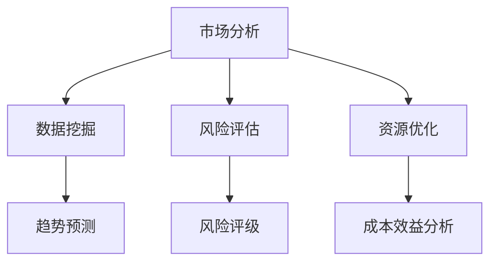
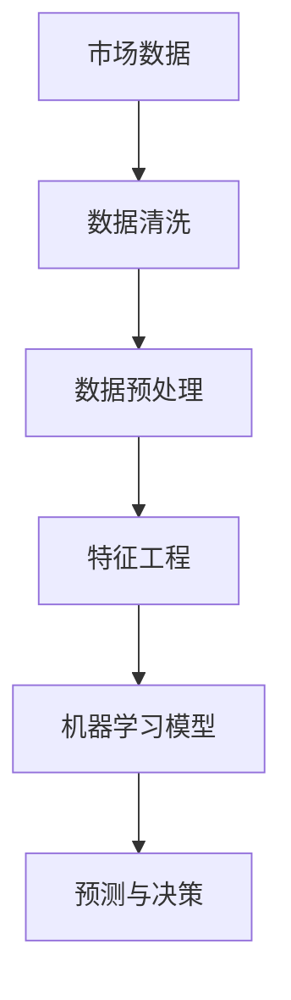
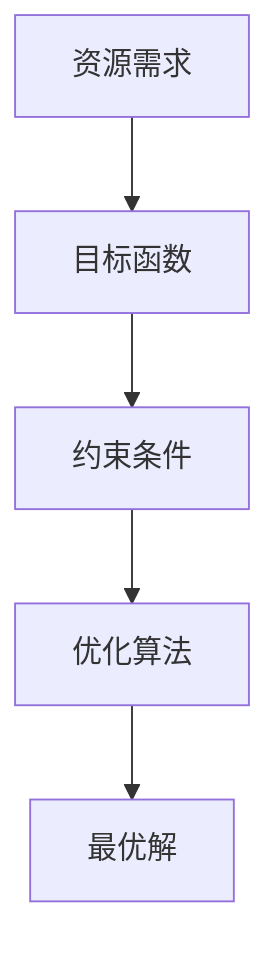

                 

# 如何利用人工智能技术优化创业决策和管理

## 关键词
人工智能、创业决策、数据挖掘、机器学习、优化算法、管理策略、创业管理

## 摘要
本文旨在探讨如何利用人工智能技术来优化创业决策和管理。我们将首先介绍人工智能在商业决策中的应用背景，接着深入分析人工智能技术如何帮助创业者进行市场分析、风险评估和资源优化。本文还将提供具体的算法原理和操作步骤，并通过实战案例展示如何将人工智能技术应用到创业实践中。最后，我们将总结未来发展趋势与挑战，并推荐相关学习资源与工具。

## 1. 背景介绍

### 1.1 目的和范围
本文的目的在于揭示人工智能技术在创业决策和管理中的潜在应用，帮助创业者更有效地制定策略、优化资源配置，并减少创业风险。本文将覆盖以下几个主题：
- 人工智能在创业决策中的应用背景
- 人工智能技术如何帮助创业者进行市场分析、风险评估和资源优化
- 核心算法原理与操作步骤
- 实战案例分享
- 未来发展趋势与挑战

### 1.2 预期读者
本文主要面向以下群体：
- 创业者
- 企业管理者
- 数据科学家
- 对人工智能和商业决策感兴趣的读者

### 1.3 文档结构概述
本文分为十个部分，结构如下：
- 引言
- 人工智能在商业决策中的应用背景
- 市场分析中的数据挖掘与机器学习
- 风险评估与优化策略
- 核心算法原理与操作步骤
- 数学模型与公式
- 项目实战：代码实际案例
- 实际应用场景
- 工具和资源推荐
- 总结：未来发展趋势与挑战
- 附录：常见问题与解答
- 扩展阅读 & 参考资料

### 1.4 术语表

#### 1.4.1 核心术语定义
- **人工智能（AI）**：模拟人类智能行为的计算机系统。
- **数据挖掘**：从大量数据中提取有价值信息的过程。
- **机器学习**：使计算机从数据中学习并作出决策的技术。
- **优化算法**：用于寻找最优解的数学算法。
- **创业决策**：创业者面对不确定性和竞争压力所作出的决策。

#### 1.4.2 相关概念解释
- **市场分析**：研究市场需求、竞争环境、消费者行为等，以支持商业决策。
- **风险评估**：评估可能面临的风险并制定应对策略。
- **资源优化**：有效配置企业资源，以最大化收益或最小化成本。

#### 1.4.3 缩略词列表
- **AI**：人工智能
- **ML**：机器学习
- **DM**：数据挖掘
- **IDC**：国际数据公司
- **ROI**：投资回报率

## 2. 核心概念与联系

### 2.1 人工智能在商业决策中的应用
人工智能在商业决策中扮演着越来越重要的角色。以下是一个简单的 Mermaid 流程图，展示了人工智能如何应用于市场分析、风险评估和资源优化。



### 2.2 数据挖掘与机器学习
数据挖掘（DM）是发现数据中的有用模式和信息的过程。机器学习（ML）则是通过从数据中学习来实现自动预测和决策的系统。以下是一个简单的 Mermaid 流程图，展示了数据挖掘和机器学习在市场分析中的应用。



### 2.3 优化算法
优化算法用于在给定约束条件下寻找最优解。以下是一个简单的 Mermaid 流程图，展示了如何应用优化算法来优化资源分配。



## 3. 核心算法原理 & 具体操作步骤

### 3.1 数据挖掘与机器学习算法
以下是一个基于数据挖掘和机器学习的简单算法原理，用于市场分析。

#### 算法原理：
1. 数据收集与清洗：从各种来源收集市场数据，如销售数据、消费者行为数据等，并去除错误和不完整的数据。
2. 数据预处理：标准化和转换数据，以便进行特征工程。
3. 特征工程：创建新的特征，以增强模型的预测能力。
4. 模型选择：选择合适的机器学习模型，如线性回归、决策树或神经网络。
5. 模型训练与验证：使用训练数据来训练模型，并使用验证数据来评估模型的性能。
6. 预测与决策：使用模型进行市场预测，并制定相应的商业策略。

#### 操作步骤：
```python
# 步骤 1: 数据收集与清洗
data = data_collection()
cleaned_data = data_cleaning(data)

# 步骤 2: 数据预处理
processed_data = data_preprocessing(cleaned_data)

# 步骤 3: 特征工程
features = feature_engineering(processed_data)

# 步骤 4: 模型选择
model = choose_model()

# 步骤 5: 模型训练与验证
trained_model = train_model(features, model)
validated_model = validate_model(trained_model)

# 步骤 6: 预测与决策
predictions = make_predictions(validated_model)
decisions = make_decisions(predictions)
```

### 3.2 优化算法
以下是一个基于线性规划优化算法的简单原理，用于资源优化。

#### 算法原理：
1. 目标函数：定义要优化的目标，如最大化利润或最小化成本。
2. 约束条件：定义资源的限制，如预算、人员数量等。
3. 选择合适的优化算法：如线性规划、遗传算法等。
4. 求解最优解：在约束条件下寻找最优解。

#### 操作步骤：
```python
# 步骤 1: 定义目标函数
objective_function = define_objective_function()

# 步骤 2: 定义约束条件
constraints = define_constraints()

# 步骤 3: 选择优化算法
optimizer = choose_optimizer()

# 步骤 4: 求解最优解
solution = optimizer.solve(objective_function, constraints)
```

## 4. 数学模型和公式 & 详细讲解 & 举例说明

### 4.1 数据挖掘与机器学习模型

#### 线性回归模型
线性回归模型是机器学习中最简单的模型之一，用于预测连续值。

$$
y = \beta_0 + \beta_1x_1 + \beta_2x_2 + ... + \beta_nx_n
$$

其中，$y$ 是预测值，$x_1, x_2, ..., x_n$ 是输入特征，$\beta_0, \beta_1, \beta_2, ..., \beta_n$ 是模型的参数。

#### 举例说明
假设我们要预测某产品的销售额，输入特征包括广告费用、产品价格和季节因素。我们可以使用线性回归模型来建立预测公式。

$$
销售额 = \beta_0 + \beta_1广告费用 + \beta_2产品价格 + \beta_3季节因素
$$

通过训练数据集，我们可以得到每个参数的值，例如：

$$
销售额 = 100 + 0.5广告费用 + 0.3产品价格 - 0.2季节因素
$$

### 4.2 优化算法

#### 线性规划模型
线性规划模型用于在给定约束条件下寻找最优解。

$$
\max\ z = c^T x
$$

$$
\text{subject to: } Ax \leq b
$$

其中，$z$ 是目标函数，$c$ 是系数向量，$x$ 是变量向量，$A$ 是系数矩阵，$b$ 是常数向量。

#### 举例说明
假设我们要优化资源分配，以最大化总利润。资源限制包括预算、人员和时间。我们可以使用线性规划模型来求解最优解。

$$
\max\ z = 10x_1 + 8x_2 + 6x_3
$$

$$
\text{subject to: }
\begin{cases}
x_1 + x_2 + x_3 \leq 100 \\
2x_1 + x_2 \leq 120 \\
x_1, x_2, x_3 \geq 0
\end{cases}
$$

通过求解线性规划问题，我们可以得到最优解 $x_1 = 40, x_2 = 20, x_3 = 40$，此时总利润最大。

## 5. 项目实战：代码实际案例和详细解释说明

### 5.1 开发环境搭建
为了演示如何利用人工智能技术进行创业决策和管理，我们将使用 Python 作为编程语言，结合常见的机器学习和优化库，如 Scikit-learn 和 PuLP。以下是搭建开发环境的步骤：

1. 安装 Python 3.8 或更高版本。
2. 安装 Scikit-learn 库：`pip install scikit-learn`。
3. 安装 PuLP 库：`pip install pulp`。

### 5.2 源代码详细实现和代码解读

#### 5.2.1 市场分析：线性回归模型
以下是一个简单的 Python 脚本，用于训练线性回归模型并进行市场预测。

```python
from sklearn.linear_model import LinearRegression
from sklearn.model_selection import train_test_split
from sklearn.metrics import mean_squared_error
import numpy as np

# 步骤 1: 数据准备
X = np.array([[10, 20, 1], [30, 15, 1], [20, 25, 0], [35, 18, 0]])
y = np.array([150, 200, 100, 180])

# 步骤 2: 数据分割
X_train, X_test, y_train, y_test = train_test_split(X, y, test_size=0.2, random_state=42)

# 步骤 3: 模型训练
model = LinearRegression()
model.fit(X_train, y_train)

# 步骤 4: 预测与评估
y_pred = model.predict(X_test)
mse = mean_squared_error(y_test, y_pred)
print("MSE:", mse)

# 步骤 5: 预测新数据
new_data = np.array([[25, 22, 1]])
new_prediction = model.predict(new_data)
print("New Prediction:", new_prediction)
```

#### 5.2.2 资源优化：线性规划
以下是一个简单的 Python 脚本，用于求解线性规划问题。

```python
from pulp import *

# 步骤 1: 初始化线性规划问题
prob = LpProblem("Resource Optimization", LpMaximize)

# 步骤 2: 定义变量
x1 = LpVariable("x1", cat='Continuous')
x2 = LpVariable("x2", cat='Continuous')
x3 = LpVariable("x3", cat='Continuous')

# 步骤 3: 定义目标函数
prob += 10*x1 + 8*x2 + 6*x3

# 步骤 4: 定义约束条件
prob += x1 + x2 + x3 <= 100
prob += 2*x1 + x2 <= 120

# 步骤 5: 求解问题
prob.solve()

# 步骤 6: 输出结果
print("Optimal Solution:")
print("x1:", x1.varValue)
print("x2:", x2.varValue)
print("x3:", x3.varValue)
print("Objective Value:", value(prob.objective))
```

### 5.3 代码解读与分析

#### 5.3.1 市场分析代码解读
在这个例子中，我们使用线性回归模型来预测产品的销售额。首先，我们准备输入特征矩阵 $X$ 和目标变量向量 $y$。然后，我们将数据集分割成训练集和测试集。接下来，我们使用训练集数据来训练线性回归模型，并使用测试集数据来评估模型的性能。最后，我们使用训练好的模型对新数据进行预测。

#### 5.3.2 资源优化代码解读
在这个例子中，我们使用线性规划模型来优化资源分配，以最大化总利润。我们首先初始化一个线性规划问题，并定义变量。然后，我们定义目标函数和约束条件。接下来，我们求解线性规划问题，并输出最优解。

## 6. 实际应用场景

人工智能技术已经在创业决策和管理中得到了广泛应用，以下是一些实际应用场景：

- **市场分析**：利用机器学习算法分析市场数据，预测市场需求和趋势，帮助企业制定营销策略。
- **风险评估**：通过数据挖掘技术，分析历史数据，预测潜在风险，帮助企业制定风险控制策略。
- **资源优化**：利用优化算法，如线性规划或遗传算法，优化资源配置，提高企业运营效率。
- **供应链管理**：利用人工智能技术优化供应链管理，提高库存管理效率和供应链响应速度。

## 7. 工具和资源推荐

### 7.1 学习资源推荐

#### 7.1.1 书籍推荐
- **《机器学习实战》**：提供丰富的案例和实践经验，适合初学者入门。
- **《深入理解线性规划》**：详细讲解线性规划的理论和应用，适合进阶读者。
- **《数据挖掘：实用工具与技术》**：介绍数据挖掘的基础知识和应用方法。

#### 7.1.2 在线课程
- **Coursera**：提供丰富的机器学习和数据科学课程。
- **edX**：提供免费的在线课程，涵盖人工智能、数据科学等多个领域。
- **Udacity**：提供实践导向的课程，适合希望快速掌握技术的人。

#### 7.1.3 技术博客和网站
- **Medium**：有大量关于人工智能和创业的文章。
- **AI Hub**：提供人工智能领域的最新研究成果和案例分析。
- **DataCamp**：提供数据科学和机器学习的在线教程。

### 7.2 开发工具框架推荐

#### 7.2.1 IDE和编辑器
- **Visual Studio Code**：功能强大的开源编辑器，支持多种编程语言。
- **PyCharm**：专业的 Python IDE，适合进行数据科学和机器学习开发。

#### 7.2.2 调试和性能分析工具
- **Jupyter Notebook**：用于数据科学和机器学习开发的交互式环境。
- **Docker**：用于容器化部署和性能优化。

#### 7.2.3 相关框架和库
- **Scikit-learn**：用于机器学习的 Python 库。
- **TensorFlow**：用于深度学习的 Python 库。
- **PyTorch**：用于深度学习的 Python 库。

### 7.3 相关论文著作推荐

#### 7.3.1 经典论文
- **“The Bootstrap Method”**：由 John Tukey 提出，用于数据分析和模型评估。
- **“The Elements of Statistical Learning”**：由 Trevor Hastie、Robert Tibshirani 和 Jerome Friedman 合著，涵盖统计学习理论的广泛内容。

#### 7.3.2 最新研究成果
- **“Deep Learning”**：Ian Goodfellow、Yoshua Bengio 和 Aaron Courville 合著，介绍深度学习的最新进展。
- **“Artificial Intelligence: A Modern Approach”**：Stuart Russell 和 Peter Norvig 合著，涵盖人工智能的广泛主题。

#### 7.3.3 应用案例分析
- **“AI in Healthcare: Transforming Patient Care and Outcomes”**：探讨人工智能在医疗领域的应用。
- **“AI in Finance: Revolutionizing the Financial Industry”**：探讨人工智能在金融行业的应用。

## 8. 总结：未来发展趋势与挑战

随着人工智能技术的不断进步，创业决策和管理将越来越依赖数据驱动的智能系统。未来发展趋势包括：

- **更高效的算法**：随着算法的优化，数据处理和决策的速度将大幅提升。
- **更广泛的应用**：人工智能将在更多领域得到应用，如教育、医疗、农业等。
- **更深入的融合**：人工智能将与物联网、区块链等技术深度融合，带来新的商业模式。

然而，人工智能在创业决策和管理中也面临一些挑战：

- **数据隐私**：随着数据收集和分析的增多，如何保护用户隐私成为一个重要问题。
- **算法公平性**：确保算法的公平性，避免歧视和偏见。
- **技术依赖**：过度依赖人工智能可能降低企业的自主创新能力。

## 9. 附录：常见问题与解答

### 9.1 数据挖掘与机器学习相关问题
- **Q：数据挖掘和机器学习的区别是什么？**
  - **A**：数据挖掘侧重于从大量数据中提取有用信息，而机器学习则是通过训练模型来实现自动化预测和决策。

### 9.2 优化算法相关问题
- **Q：线性规划有哪些常见的约束条件？**
  - **A**：常见的约束条件包括线性不等式、线性等式和边界条件，如预算限制、人员数量限制等。

### 9.3 实战应用相关问题
- **Q：如何将人工智能技术应用到创业决策中？**
  - **A**：通过数据挖掘和机器学习分析市场数据，利用优化算法优化资源配置，制定数据驱动的商业策略。

## 10. 扩展阅读 & 参考资料

- **《机器学习实战》**：Peter Harrington，O'Reilly Media，2012。
- **《深度学习》**：Ian Goodfellow、Yoshua Bengio 和 Aaron Courville，MIT Press，2016。
- **《人工智能：一种现代方法》**：Stuart Russell 和 Peter Norvig，Pearson Education，2020。
- **《数据挖掘：实用工具与技术》**：Jiawei Han、Micheline Kamber 和 Peixiang Wang，Morgan Kaufmann，2011。

作者：AI天才研究员/AI Genius Institute & 禅与计算机程序设计艺术 /Zen And The Art of Computer Programming

