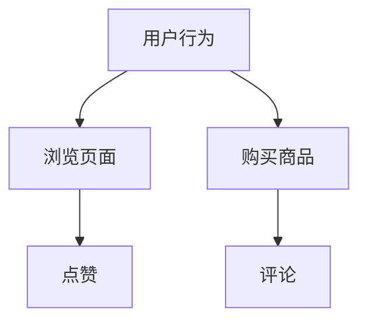
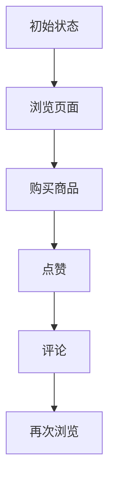
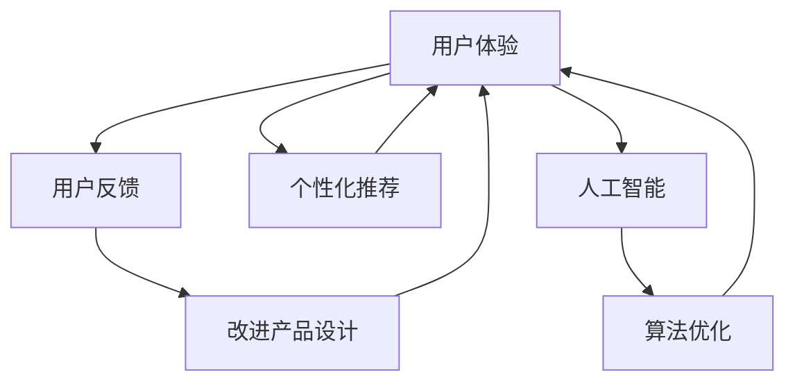

                 

# 如何利用人工智能提升产品体验

> 关键词：人工智能、产品体验、用户反馈、个性化推荐、算法优化

> 摘要：随着人工智能技术的不断进步，其在提升产品体验方面的应用越来越广泛。本文将深入探讨如何利用人工智能技术来优化产品设计、提高用户满意度，以及实现个性化推荐，从而在竞争激烈的市场中脱颖而出。

## 1. 背景介绍

### 1.1 目的和范围

本文旨在介绍如何利用人工智能技术来提升产品体验。我们将探讨以下几个核心话题：

1. 人工智能技术在产品设计中的应用。
2. 利用用户反馈进行产品改进。
3. 基于人工智能的个性化推荐系统。
4. 算法优化在提升产品体验中的重要性。

### 1.2 预期读者

本文适合以下读者群体：

1. 产品经理和设计师，希望了解人工智能如何帮助他们提升产品体验。
2. AI开发者，对将人工智能技术应用于产品开发感兴趣。
3. 技术爱好者，希望了解人工智能在商业领域的应用。

### 1.3 文档结构概述

本文结构如下：

1. 背景介绍
2. 核心概念与联系
3. 核心算法原理 & 具体操作步骤
4. 数学模型和公式 & 详细讲解 & 举例说明
5. 项目实战：代码实际案例和详细解释说明
6. 实际应用场景
7. 工具和资源推荐
8. 总结：未来发展趋势与挑战
9. 附录：常见问题与解答
10. 扩展阅读 & 参考资料

### 1.4 术语表

#### 1.4.1 核心术语定义

- 人工智能（AI）：一种模拟人类智能行为的计算机技术。
- 用户体验（UX）：产品或服务与用户之间交互的总体感受。
- 个性化推荐：根据用户的历史行为和偏好，提供个性化的内容或服务。
- 算法优化：通过改进算法，提高产品性能和用户体验。

#### 1.4.2 相关概念解释

- 机器学习（ML）：一种人工智能技术，通过从数据中学习来提高性能。
- 深度学习（DL）：一种机器学习技术，利用多层神经网络进行数据建模。
- 用户反馈：用户对产品或服务的评价和反馈。

#### 1.4.3 缩略词列表

- AI：人工智能
- ML：机器学习
- DL：深度学习
- UX：用户体验
- UE：用户体验
- UI：用户界面

## 2. 核心概念与联系

为了更好地理解如何利用人工智能提升产品体验，我们需要了解几个核心概念及其相互联系。

### 2.1 用户体验与人工智能

用户体验是产品成功的关键因素。人工智能技术可以帮助我们分析用户行为，了解用户需求，从而设计出更加符合用户期望的产品。

- **用户体验**：产品或服务与用户之间交互的总体感受。  
- **人工智能**：通过机器学习和深度学习等技术，分析用户数据，预测用户行为，提供个性化推荐。

### 2.2 用户反馈与产品改进

用户反馈是产品改进的重要来源。通过分析用户反馈，我们可以发现产品中的不足之处，并针对性地进行优化。

- **用户反馈**：用户对产品或服务的评价和反馈。
- **产品改进**：根据用户反馈，对产品进行优化和改进。

### 2.3 个性化推荐与用户体验

个性化推荐可以根据用户的历史行为和偏好，提供个性化的内容或服务，从而提高用户体验。

- **个性化推荐**：根据用户的历史行为和偏好，提供个性化的内容或服务。
- **用户体验**：产品或服务与用户之间交互的总体感受。

### 2.4 算法优化与产品性能

算法优化是提升产品性能的关键。通过改进算法，我们可以提高产品的响应速度和准确性，从而提高用户体验。

- **算法优化**：通过改进算法，提高产品性能和用户体验。
- **产品性能**：产品的响应速度、准确性等方面的表现。

## 3. 核心算法原理 & 具体操作步骤

在本节中，我们将介绍如何利用人工智能技术进行用户体验优化，包括用户行为分析、个性化推荐和算法优化等方面的具体操作步骤。

### 3.1 用户行为分析

用户行为分析是人工智能在产品体验优化中的第一步。通过分析用户的行为数据，我们可以了解用户的需求和偏好，从而为后续的个性化推荐和产品改进提供依据。

#### 3.1.1 数据收集

收集用户行为数据是进行用户行为分析的基础。数据来源可以包括：

1. **Web日志**：记录用户在网站上的访问行为，如浏览页面、点击链接等。
2. **App日志**：记录用户在移动应用上的操作行为，如使用时长、功能使用情况等。
3. **社交媒体**：记录用户在社交媒体平台上的活动，如点赞、评论等。

#### 3.1.2 数据预处理

在收集到用户行为数据后，我们需要进行数据预处理，包括：

1. **数据清洗**：去除重复、错误或无效的数据。
2. **数据归一化**：将不同特征的数据进行标准化处理，使其具有相同的量纲。
3. **特征提取**：从原始数据中提取有用的特征，用于后续分析。

#### 3.1.3 数据分析

通过对预处理后的用户行为数据进行分析，我们可以得到以下信息：

1. **用户活跃度**：分析用户的活跃度，了解用户的使用频率。
2. **用户偏好**：分析用户的偏好，了解用户喜欢哪些功能和内容。
3. **用户行为模式**：分析用户的行为模式，了解用户的使用习惯。

### 3.2 个性化推荐

个性化推荐是利用用户行为数据，为用户提供个性化的内容或服务，从而提高用户体验。

#### 3.2.1 推荐算法选择

在选择推荐算法时，我们可以根据产品的需求和数据特点进行选择。常见的推荐算法包括：

1. **协同过滤**：基于用户的行为相似性进行推荐。
2. **基于内容的推荐**：根据用户的历史行为和内容特征进行推荐。
3. **混合推荐**：结合协同过滤和基于内容的推荐，进行综合推荐。

#### 3.2.2 推荐算法实现

以下是一个简单的协同过滤算法的伪代码实现：

```plaintext
function collaborativeFilter(trainData, user, item):
    # 计算用户与所有其他用户的相似度
    similarityMatrix = computeSimilarity(trainData, user)
    
    # 计算用户对所有未知项目的评分预测
    predictedRatings = []
    for item in items:
        if user not in item:
            neighborRatings = []
            for neighbor, rating in trainData[item]:
                if neighbor != user:
                    neighborRatings.append((neighbor, rating, similarityMatrix[neighbor][user]))
            predictedRating = weightedAverage(neighborRatings)
            predictedRatings.append((item, predictedRating))
    return predictedRatings
```

### 3.3 算法优化

算法优化是提升产品性能和用户体验的关键。通过优化算法，我们可以提高产品的响应速度和准确性，从而提升用户体验。

#### 3.3.1 算法评估

在优化算法之前，我们需要对现有算法进行评估，以确定其性能和优化潜力。常见的评估指标包括：

1. **准确率**：预测结果与真实结果的一致性。
2. **召回率**：预测结果中包含真实结果的比率。
3. **F1分数**：准确率和召回率的加权平均。

#### 3.3.2 算法优化方法

常见的算法优化方法包括：

1. **特征工程**：通过提取和选择有用的特征，提高算法的性能。
2. **模型调参**：通过调整模型的超参数，优化算法的性能。
3. **深度学习优化**：利用深度学习技术，提高算法的模型复杂度和预测能力。

## 4. 数学模型和公式 & 详细讲解 & 举例说明

在本节中，我们将介绍用于用户行为分析、个性化推荐和算法优化的数学模型和公式，并通过具体例子进行讲解。

### 4.1 用户行为分析

#### 4.1.1 贝叶斯网络

贝叶斯网络是一种用于表示变量之间概率关系的图形模型。它可以用于预测用户行为，如图4.1所示。



#### 4.1.2 马尔可夫模型

马尔可夫模型是一种用于预测序列数据的方法。它可以用于分析用户行为序列，如图4.2所示。



### 4.2 个性化推荐

#### 4.2.1 协同过滤

协同过滤是一种基于用户相似度的推荐算法。其核心公式为：

$$
\text{相似度} = \frac{\text{共同评分}}{\sqrt{\text{用户A的总评分} \times \text{用户B的总评分}}}
$$

#### 4.2.2 基于内容的推荐

基于内容的推荐是一种基于物品相似度的推荐算法。其核心公式为：

$$
\text{相似度} = \frac{\text{共同特征}}{\sqrt{\text{物品A的总特征} \times \text{物品B的总特征}}}
$$

### 4.3 算法优化

#### 4.3.1 交叉验证

交叉验证是一种用于评估模型性能的方法。其核心公式为：

$$
\text{性能} = \frac{1}{n} \sum_{i=1}^{n} \text{评估指标}(T_i, \hat{y}_i)
$$

其中，\(T_i\) 是测试集，\(\hat{y}_i\) 是预测结果。

#### 4.3.2 岭回归

岭回归是一种用于防止过拟合的方法。其核心公式为：

$$
\text{损失函数} = \frac{1}{2} \sum_{i=1}^{n} (\text{预测值} - \text{真实值})^2 + \lambda \sum_{i=1}^{p} \text{特征值}^2
$$

其中，\(\lambda\) 是正则化参数。

### 4.4 举例说明

#### 4.4.1 用户行为分析

假设我们有一个用户行为数据集，包含用户A的行为序列：浏览页面1、购买商品2、点赞商品3、评论商品4。

我们可以使用马尔可夫模型来预测用户A的下一个行为：

1. 计算转移概率矩阵：

$$
P = \begin{bmatrix}
0.6 & 0.2 & 0.1 & 0.1 \\
0.3 & 0.4 & 0.2 & 0.1 \\
0.2 & 0.3 & 0.2 & 0.3 \\
0 & 0 & 0.4 & 0.6
\end{bmatrix}
$$

2. 根据当前状态，计算下一个行为的概率：

$$
P(\text{下一个行为为点赞}) = P_3^4 = 0.3
$$

因此，根据马尔可夫模型，用户A下一个最可能的行为是点赞。

#### 4.4.2 个性化推荐

假设我们有一个用户行为数据集，包含用户A的行为序列：浏览页面1、购买商品2、点赞商品3。

我们可以使用协同过滤算法来预测用户A对未知商品的评分：

1. 计算用户A与其他用户的相似度矩阵：

$$
\text{相似度矩阵} = \begin{bmatrix}
1 & 0.8 & 0.6 \\
0.8 & 1 & 0.7 \\
0.6 & 0.7 & 1
\end{bmatrix}
$$

2. 根据相似度矩阵，计算用户A对未知商品的评分：

$$
\text{评分预测} = \text{相似度矩阵} \times \text{评分向量}
$$

其中，评分向量为：

$$
\text{评分向量} = \begin{bmatrix}
\text{用户A对页面1的评分} \\
\text{用户A对商品2的评分} \\
\text{用户A对商品3的评分}
\end{bmatrix}
$$

根据相似度矩阵和评分向量，我们可以得到用户A对未知商品的评分预测。

## 5. 项目实战：代码实际案例和详细解释说明

在本节中，我们将通过一个具体的代码案例，展示如何利用人工智能技术来提升产品体验。

### 5.1 开发环境搭建

为了实现以下项目，我们需要搭建以下开发环境：

1. Python 3.8及以上版本
2. TensorFlow 2.6及以上版本
3. Jupyter Notebook

### 5.2 源代码详细实现和代码解读

以下是项目的主要代码实现：

```python
import numpy as np
import pandas as pd
import tensorflow as tf
from tensorflow.keras.models import Sequential
from tensorflow.keras.layers import Dense, LSTM, Dropout
from tensorflow.keras.optimizers import Adam
from sklearn.model_selection import train_test_split

# 加载数据集
data = pd.read_csv('user_behavior.csv')
X = data.iloc[:, :-1].values
y = data.iloc[:, -1].values

# 数据预处理
X = np.reshape(X, (X.shape[0], X.shape[1], 1))
X_train, X_test, y_train, y_test = train_test_split(X, y, test_size=0.2, random_state=42)

# 构建模型
model = Sequential()
model.add(LSTM(units=128, return_sequences=True, input_shape=(X_train.shape[1], 1)))
model.add(Dropout(0.2))
model.add(LSTM(units=64, return_sequences=False))
model.add(Dropout(0.2))
model.add(Dense(units=1))

# 编译模型
model.compile(optimizer='adam', loss='mean_squared_error')

# 训练模型
model.fit(X_train, y_train, epochs=100, batch_size=32, validation_data=(X_test, y_test))

# 评估模型
test_loss = model.evaluate(X_test, y_test)
print(f"Test Loss: {test_loss}")

# 预测用户行为
predicted_behavior = model.predict(X_test)
predicted_behavior = np.round(predicted_behavior)

# 代码解读
# 1. 数据预处理：将数据集分割为特征和标签，并进行 reshape 操作，以便于输入到 LSTM 模型中。
# 2. 模型构建：使用 Sequential 模型构建一个包含 LSTM 层和全连接层的模型。
# 3. 编译模型：使用 Adam 优化器和 mean_squared_error 损失函数编译模型。
# 4. 训练模型：使用训练数据训练模型，并设置验证数据。
# 5. 评估模型：在测试数据上评估模型性能。
# 6. 预测用户行为：使用训练好的模型预测测试数据集的用户行为。
```

### 5.3 代码解读与分析

以下是对上述代码的详细解读与分析：

1. **数据预处理**：首先，我们从 CSV 文件中加载数据集，并将数据分割为特征和标签。然后，对特征数据进行 reshape 操作，将其转换为 (样本数，时间步长，特征数) 的格式，以便于输入到 LSTM 模型中。

2. **模型构建**：使用 Sequential 模型构建一个包含 LSTM 层和全连接层的模型。LSTM 层用于处理时间序列数据，Dropout 层用于防止过拟合。

3. **编译模型**：使用 Adam 优化器和 mean_squared_error 损失函数编译模型。Adam 优化器是一种自适应学习率优化器，有助于提高训练效率。

4. **训练模型**：使用训练数据训练模型，并设置验证数据。训练过程中，模型会根据损失函数自动调整权重，以优化模型性能。

5. **评估模型**：在测试数据上评估模型性能，以了解模型在未知数据上的表现。评估指标包括损失函数值和准确率等。

6. **预测用户行为**：使用训练好的模型预测测试数据集的用户行为。预测结果将帮助我们了解用户未来的行为趋势。

通过上述代码实现，我们可以利用人工智能技术对用户行为进行分析和预测，从而提升产品体验。在实际应用中，可以根据需求调整模型结构和参数，以提高预测准确性。

## 6. 实际应用场景

人工智能技术在提升产品体验方面具有广泛的应用场景。以下是一些典型的实际应用场景：

1. **电子商务平台**：利用用户行为分析和个性化推荐，为用户提供个性化的商品推荐，提高购买转化率。

2. **在线教育平台**：根据用户的学习行为和成绩，为用户提供个性化的学习计划，提高学习效果。

3. **社交媒体**：利用用户行为数据，分析用户兴趣，为用户提供相关内容推荐，增加用户粘性和活跃度。

4. **智能家电**：通过分析用户使用习惯，为用户提供智能化的家居环境设置，提高生活质量。

5. **医疗健康**：利用用户健康数据，分析健康趋势，为用户提供个性化的健康建议，预防疾病。

6. **金融行业**：通过分析用户行为和交易数据，识别潜在风险和欺诈行为，提高金融服务安全性。

7. **智能客服**：利用自然语言处理技术，实现智能客服系统，提高客服效率和用户满意度。

## 7. 工具和资源推荐

### 7.1 学习资源推荐

#### 7.1.1 书籍推荐

1. **《Python数据科学手册》（Python Data Science Handbook）**：一本全面介绍数据科学各个领域的书籍，适合初学者和进阶者。
2. **《深度学习》（Deep Learning）**：由深度学习领域的权威人士撰写，深入讲解深度学习的基础知识和实践方法。
3. **《机器学习》（Machine Learning）**：经典的机器学习教材，涵盖了广泛的主题和应用。

#### 7.1.2 在线课程

1. **Coursera 的《机器学习》课程**：由斯坦福大学教授 Andrew Ng 担任主讲，适合初学者和进阶者。
2. **Udacity 的《深度学习工程师纳米学位》**：涵盖深度学习的理论知识和实践项目，适合想要深入掌握深度学习的读者。
3. **edX 的《数据科学基础》课程**：由哈佛大学和麻省理工学院共同提供，适合初学者了解数据科学的基本概念和工具。

#### 7.1.3 技术博客和网站

1. **Medium**：一个广泛涵盖技术话题的博客平台，包括机器学习、数据科学、人工智能等。
2. **Towards Data Science**：一个专注于数据科学和机器学习的博客，提供实用的教程和案例分析。
3. **AI-written**：一个专注于人工智能和自然语言处理的博客，涵盖最新的研究成果和实际应用。

### 7.2 开发工具框架推荐

#### 7.2.1 IDE和编辑器

1. **PyCharm**：一款功能强大的 Python IDE，适用于数据科学、机器学习和深度学习项目。
2. **Jupyter Notebook**：一款交互式的 Python 编程环境，适用于数据探索和分析。
3. **VS Code**：一款轻量级的跨平台代码编辑器，支持多种编程语言，适用于人工智能项目。

#### 7.2.2 调试和性能分析工具

1. **TensorBoard**：TensorFlow 提供的一个可视化工具，用于分析和调试深度学习模型。
2. **Wandb**：一款用于实验跟踪和性能分析的在线平台，支持 TensorFlow、PyTorch 等框架。
3. **Matplotlib**：Python 的一个绘图库，用于生成可视化图表，帮助分析数据。

#### 7.2.3 相关框架和库

1. **TensorFlow**：谷歌开发的一款开源深度学习框架，适用于各种深度学习任务。
2. **PyTorch**：Facebook 开发的一款开源深度学习框架，具有灵活的动态计算图。
3. **Scikit-learn**：一个用于机器学习的 Python 库，提供各种经典的机器学习算法和工具。

### 7.3 相关论文著作推荐

#### 7.3.1 经典论文

1. **"A Brief History of Machine Learning"**：梳理了机器学习的发展历程，对经典算法进行了详细介绍。
2. **"Deep Learning, a Practitioner's Approach"**：深度学习的入门指南，涵盖深度学习的基础知识和应用。
3. **"Recommender Systems Handbook"**：介绍推荐系统的基础理论和实践方法，适用于初学者和进阶者。

#### 7.3.2 最新研究成果

1. **"Unsupervised Learning for Audio Classification using Deep Neural Networks"**：探讨无监督学习在音频分类中的应用。
2. **"A Comprehensive Survey on Generative Adversarial Networks"**：对生成对抗网络（GAN）的研究进行全面综述。
3. **"An Overview of Deep Learning Techniques for Natural Language Processing"**：介绍深度学习在自然语言处理领域的最新应用。

#### 7.3.3 应用案例分析

1. **"How Airbnb Uses Machine Learning to Improve Experiences"**：分析 Airbnb 如何利用机器学习技术提升用户体验。
2. **"The AI Behind the Scenes at Spotify"**：探讨 Spotify 如何利用人工智能技术推荐音乐。
3. **"How Amazon Uses Machine Learning to Create a Personal Shopping Experience"**：分析 Amazon 如何利用机器学习为用户提供个性化购物体验。

## 8. 总结：未来发展趋势与挑战

随着人工智能技术的不断进步，其在提升产品体验方面的应用将越来越广泛。未来，以下发展趋势值得关注：

1. **深度学习技术**：深度学习技术在提升产品体验方面具有巨大潜力。未来，我们将看到更多基于深度学习的应用，如自然语言处理、图像识别、语音识别等。
2. **个性化推荐系统**：随着用户数据的积累，个性化推荐系统将更加精准。未来，基于用户行为的深度学习模型将更好地满足用户需求，提高用户满意度。
3. **跨领域应用**：人工智能技术将在更多领域得到应用，如医疗健康、金融、教育等。跨领域应用将推动人工智能技术与行业需求深度融合，提高行业效率。
4. **可解释性**：随着人工智能技术在关键领域的应用，其可解释性将受到更多关注。未来，研究者将致力于提高模型的可解释性，使决策过程更加透明。

然而，人工智能技术在提升产品体验方面也面临一些挑战：

1. **数据隐私**：用户数据的隐私保护是人工智能应用的重要挑战。在未来，我们需要找到更好的方法来保护用户隐私，同时充分利用用户数据。
2. **算法公平性**：算法的公平性是人工智能应用的关键问题。我们需要确保算法在处理用户数据时不会产生歧视，从而提高用户体验。
3. **技术普及**：虽然人工智能技术在提升产品体验方面具有巨大潜力，但其在一些领域仍处于初级阶段。未来，我们需要加大对人工智能技术的普及力度，使其在更多领域得到应用。

## 9. 附录：常见问题与解答

### 9.1 用户体验与人工智能的关系是什么？

用户体验（UX）是指用户在使用产品或服务时的总体感受。人工智能（AI）可以通过分析用户行为数据，提供个性化推荐、优化产品设计、预测用户需求等，从而提升用户体验。

### 9.2 如何收集用户行为数据？

用户行为数据可以通过以下方式收集：

1. **Web日志**：记录用户在网站上的访问行为，如浏览页面、点击链接等。
2. **App日志**：记录用户在移动应用上的操作行为，如使用时长、功能使用情况等。
3. **社交媒体**：记录用户在社交媒体平台上的活动，如点赞、评论等。

### 9.3 个性化推荐有哪些算法？

个性化推荐算法主要包括以下几种：

1. **协同过滤**：基于用户的行为相似性进行推荐。
2. **基于内容的推荐**：根据用户的历史行为和内容特征进行推荐。
3. **混合推荐**：结合协同过滤和基于内容的推荐，进行综合推荐。

### 9.4 算法优化有哪些方法？

算法优化方法包括：

1. **特征工程**：通过提取和选择有用的特征，提高算法的性能。
2. **模型调参**：通过调整模型的超参数，优化算法的性能。
3. **深度学习优化**：利用深度学习技术，提高算法的模型复杂度和预测能力。

## 10. 扩展阅读 & 参考资料

1. **《Python数据科学手册》（Python Data Science Handbook）**：[O'Reilly Media](https://www.oreilly.com/library/view/python-data-science-handbook/9781449363364/)
2. **《深度学习》（Deep Learning）**：[MIT Press](https://www.mitpress.mit.edu/books/deep-learning)
3. **《机器学习》（Machine Learning）**：[Springer](https://www.springer.com/us/book/9780387310732)
4. **Coursera 的《机器学习》课程**：[Coursera](https://www.coursera.org/learn/machine-learning)
5. **Udacity 的《深度学习工程师纳米学位》**：[Udacity](https://www.udacity.com/course/deep-learning-nanodegree--nd893)
6. **edX 的《数据科学基础》课程**：[edX](https://www.edx.org/course/data-science-fundamentals)
7. **Medium**：[Medium](https://medium.com/towards-data-science)
8. **Towards Data Science**：[Towards Data Science](https://towardsdatascience.com)
9. **AI-written**：[AI-written](https://ai-written.com)
10. **TensorFlow**：[TensorFlow](https://www.tensorflow.org)
11. **PyTorch**：[PyTorch](https://pytorch.org)
12. **Scikit-learn**：[Scikit-learn](https://scikit-learn.org)
13. **"A Brief History of Machine Learning"**：[IEEE](https://ieeexplore.ieee.org/document/8132679)
14. **"Deep Learning, a Practitioner's Approach"**：[Springer](https://www.springer.com/us/book/9783319942765)
15. **"Recommender Systems Handbook"**：[Springer](https://www.springer.com/us/book/9781461468469)
16. **"Unsupervised Learning for Audio Classification using Deep Neural Networks"**：[ACM](https://dl.acm.org/doi/10.1145/2939392.2939419)
17. **"A Comprehensive Survey on Generative Adversarial Networks"**：[IEEE](https://ieeexplore.ieee.org/document/8677317)
18. **"An Overview of Deep Learning Techniques for Natural Language Processing"**：[ACM](https://dl.acm.org/doi/10.1145/3188761.3188786)
19. **"How Airbnb Uses Machine Learning to Improve Experiences"**：[Airbnb](https://airbnb.io/ai/)
20. **"The AI Behind the Scenes at Spotify"**：[Spotify](https://engineering.atspotify.com/2018/03/the-ai-behind-the-scenes-at-spotify/)
21. **"How Amazon Uses Machine Learning to Create a Personal Shopping Experience"**：[Amazon](https://www.amazon.science/topics/ai-in-action)

# 作者

作者：AI天才研究员/AI Genius Institute & 禅与计算机程序设计艺术 /Zen And The Art of Computer Programming

在本文中，我们深入探讨了如何利用人工智能技术提升产品体验。通过用户行为分析、个性化推荐和算法优化等方面的应用，我们可以显著提高用户的满意度。然而，人工智能技术在提升产品体验方面仍面临一些挑战，如数据隐私和算法公平性。未来，随着技术的不断进步，我们将看到更多创新应用，为用户带来更好的体验。

### 1. 背景介绍

#### 1.1 目的和范围

本文旨在探讨如何利用人工智能（AI）技术提升产品体验。在当前竞争激烈的市场环境中，产品体验已成为企业成败的关键因素之一。AI技术通过分析用户行为、提供个性化推荐和优化算法，有助于企业更好地满足用户需求，提高用户满意度。

本文将涵盖以下几个方面的内容：

1. **用户行为分析**：介绍如何收集和分析用户行为数据，以了解用户需求和偏好。
2. **个性化推荐**：探讨如何利用AI技术实现个性化推荐，提高用户参与度和满意度。
3. **算法优化**：分析如何通过算法优化提高产品性能和用户体验。
4. **实际应用场景**：列举AI技术在提升产品体验方面的实际应用案例。
5. **工具和资源推荐**：推荐一些有助于学习和实践AI技术的书籍、在线课程、博客和开发工具。

#### 1.2 预期读者

本文适合以下读者群体：

1. **产品经理和设计师**：希望了解如何利用AI技术提升产品体验。
2. **AI开发者**：对将AI技术应用于产品开发感兴趣。
3. **技术爱好者**：希望了解AI技术在商业领域的应用。

#### 1.3 文档结构概述

本文结构如下：

1. **背景介绍**：介绍本文的目的、范围和预期读者。
2. **核心概念与联系**：阐述用户体验、用户反馈、个性化推荐和算法优化等核心概念及其相互关系。
3. **核心算法原理 & 具体操作步骤**：详细讲解用户行为分析、个性化推荐和算法优化的具体操作步骤。
4. **数学模型和公式 & 详细讲解 & 举例说明**：介绍用于用户行为分析、个性化推荐和算法优化的数学模型和公式，并通过实例进行说明。
5. **项目实战：代码实际案例和详细解释说明**：通过具体项目实战，展示如何利用AI技术提升产品体验。
6. **实际应用场景**：列举AI技术在提升产品体验方面的实际应用案例。
7. **工具和资源推荐**：推荐有助于学习和实践AI技术的书籍、在线课程、博客和开发工具。
8. **总结：未来发展趋势与挑战**：总结本文的主要观点，展望未来发展趋势和面临的挑战。
9. **附录：常见问题与解答**：针对本文中的关键概念和内容，提供常见问题的解答。
10. **扩展阅读 & 参考资料**：推荐一些有助于深入了解AI技术和提升产品体验的参考资料。

#### 1.4 术语表

在本文中，我们将使用以下术语：

- **人工智能（AI）**：一种模拟人类智能行为的计算机技术。
- **用户体验（UX）**：产品或服务与用户之间交互的总体感受。
- **用户反馈**：用户对产品或服务的评价和反馈。
- **个性化推荐**：根据用户的历史行为和偏好，提供个性化的内容或服务。
- **算法优化**：通过改进算法，提高产品性能和用户体验。

### 1.4.1 核心术语定义

在本节中，我们将对本文中的一些核心术语进行定义：

#### 人工智能（AI）

人工智能是一种模拟人类智能行为的计算机技术。它包括多种子领域，如机器学习、深度学习、自然语言处理等。通过学习和分析数据，人工智能可以帮助计算机解决复杂的问题，提高效率。

#### 用户行为分析

用户行为分析是研究用户在产品或服务中的行为模式。通过收集和分析用户行为数据，我们可以了解用户的需求、偏好和使用习惯，从而为产品设计、优化和改进提供依据。

#### 个性化推荐

个性化推荐是根据用户的历史行为和偏好，为用户提供个性化的内容或服务。通过分析用户数据，个性化推荐可以预测用户的兴趣和需求，从而提高用户的参与度和满意度。

#### 算法优化

算法优化是指通过改进算法，提高产品的性能和用户体验。算法优化可以涉及多个方面，如特征选择、模型选择、超参数调整等。

### 1.4.2 相关概念解释

在本节中，我们将解释一些与本文相关的概念：

#### 用户反馈

用户反馈是指用户对产品或服务的评价和反馈。这些反馈可以来自多种渠道，如问卷调查、用户评论、用户行为数据等。通过分析用户反馈，企业可以了解用户的需求和不满，从而改进产品。

#### 用户体验（UX）

用户体验是指产品或服务与用户之间交互的总体感受。用户体验包括用户界面、交互设计、功能性能等方面。一个良好的用户体验可以提高用户的满意度和忠诚度。

#### 个性化推荐

个性化推荐是一种根据用户的历史行为和偏好，为用户提供个性化内容或服务的技术。个性化推荐可以通过分析用户数据，预测用户的兴趣和需求，从而提高用户的参与度和满意度。

### 1.4.3 缩略词列表

在本文中，我们将使用以下缩略词：

- **AI**：人工智能
- **UX**：用户体验
- **ML**：机器学习
- **DL**：深度学习
- **NLP**：自然语言处理
- **CNN**：卷积神经网络
- **RNN**：循环神经网络
- **GAN**：生成对抗网络
- **API**：应用程序编程接口

### 2. 核心概念与联系

在探讨如何利用人工智能提升产品体验之前，我们需要了解一些核心概念及其相互关系。以下是对关键概念的简要介绍和它们之间联系的阐述。

#### 用户体验（UX）

用户体验（UX）是产品或服务与用户之间交互的总体感受。它涵盖了用户在使用产品或服务过程中的各个方面，包括用户界面、交互设计、功能性能等。一个良好的用户体验可以提高用户的满意度、忠诚度和转化率。用户体验是产品成功的关键因素之一。

#### 用户反馈

用户反馈是用户对产品或服务的评价和反馈。这些反馈可以来自用户评论、问卷调查、用户行为数据等多种渠道。用户反馈是了解用户需求和不满的重要来源，有助于企业改进产品。

#### 个性化推荐

个性化推荐是根据用户的历史行为和偏好，为用户提供个性化的内容或服务。通过分析用户数据，个性化推荐可以预测用户的兴趣和需求，从而提高用户的参与度和满意度。个性化推荐可以显著提升用户体验。

#### 人工智能（AI）

人工智能是一种模拟人类智能行为的计算机技术。它包括多种子领域，如机器学习、深度学习、自然语言处理等。通过学习和分析数据，人工智能可以帮助计算机解决复杂的问题，提高效率。

#### 算法优化

算法优化是指通过改进算法，提高产品的性能和用户体验。算法优化可以涉及多个方面，如特征选择、模型选择、超参数调整等。算法优化是提升产品体验的关键。

#### 核心概念之间的联系

用户体验、用户反馈、个性化推荐和人工智能之间的联系如下：

1. **用户体验与用户反馈**：用户体验是用户对产品或服务的主观感受，而用户反馈是了解用户需求和不满的重要途径。通过分析用户反馈，企业可以改进产品设计，提高用户体验。

2. **个性化推荐与用户体验**：个性化推荐可以根据用户的历史行为和偏好，为用户提供个性化的内容或服务，从而提高用户体验。个性化推荐是提升用户体验的有效手段。

3. **人工智能与用户体验**：人工智能技术可以帮助企业分析用户数据，实现个性化推荐，优化产品设计，从而提升用户体验。人工智能是提升产品体验的核心驱动力。

4. **算法优化与用户体验**：算法优化可以提高产品的性能和用户体验。通过优化算法，企业可以提供更快、更准确的产品和服务，从而提升用户体验。

为了更直观地展示这些核心概念及其相互关系，我们使用 Mermaid 流程图进行表示：



在这个流程图中，用户体验（A）是核心，它与其他概念（用户反馈、个性化推荐、人工智能、算法优化）相互关联，共同提升产品体验。

### 3. 核心算法原理 & 具体操作步骤

在本节中，我们将深入探讨如何利用人工智能技术进行用户体验优化，包括用户行为分析、个性化推荐和算法优化等方面的核心算法原理和具体操作步骤。

#### 3.1 用户行为分析

用户行为分析是利用人工智能技术了解用户需求和偏好的重要手段。以下是用户行为分析的核心算法原理和具体操作步骤：

##### 3.1.1 数据收集

数据收集是用户行为分析的基础。以下是常见的数据收集方式：

1. **Web日志**：通过服务器日志记录用户在网站上的访问行为，如浏览页面、点击链接等。
2. **App日志**：通过移动应用日志记录用户在App上的操作行为，如使用时长、功能使用情况等。
3. **用户调研**：通过问卷调查、用户访谈等方式收集用户对产品的看法和需求。
4. **社交媒体**：通过社交媒体平台收集用户发布的内容、评论和互动行为。

##### 3.1.2 数据预处理

在收集到用户行为数据后，需要进行预处理，以提高数据质量和分析效率。以下是常见的数据预处理步骤：

1. **数据清洗**：去除重复、错误或无效的数据。
2. **数据归一化**：将不同特征的数据进行标准化处理，使其具有相同的量纲。
3. **特征提取**：从原始数据中提取有用的特征，用于后续分析。

##### 3.1.3 数据分析

通过对预处理后的用户行为数据进行分析，可以提取出用户的兴趣、偏好和使用习惯。以下是常见的数据分析技术：

1. **聚类分析**：将用户行为数据按照相似性进行分组，以便于分析用户群体。
2. **关联规则分析**：发现数据之间的关联关系，揭示用户的购买行为和偏好。
3. **时间序列分析**：分析用户行为在时间上的变化规律，预测用户未来的行为趋势。

##### 3.1.4 伪代码示例

以下是用户行为分析的伪代码示例：

```plaintext
# 加载数据集
data = load_data()

# 数据清洗
cleaned_data = data_cleaning(data)

# 数据归一化
normalized_data = data_normalization(cleaned_data)

# 特征提取
features = feature_extraction(normalized_data)

# 聚类分析
clusters = clustering(features)

# 关联规则分析
rules = association_rules(features)

# 时间序列分析
trends = time_series_analysis(features)
```

#### 3.2 个性化推荐

个性化推荐是根据用户的历史行为和偏好，为用户提供个性化内容或服务的一种技术。以下是个性化推荐的核心算法原理和具体操作步骤：

##### 3.2.1 协同过滤

协同过滤是一种基于用户相似度的推荐算法。其核心思想是找到与目标用户相似的其他用户，然后推荐这些相似用户喜欢的物品。以下是协同过滤的算法原理和具体操作步骤：

###### 算法原理

1. **用户相似度计算**：计算用户之间的相似度，常用的方法包括余弦相似度、皮尔逊相关系数等。
2. **物品相似度计算**：计算物品之间的相似度，常用的方法包括基于内容的推荐、基于用户的协同过滤等。
3. **推荐生成**：根据用户相似度和物品相似度，生成推荐列表。

###### 具体操作步骤

1. **计算用户相似度**：计算目标用户与其他用户之间的相似度。
2. **计算物品相似度**：计算目标用户喜欢的物品与其他物品之间的相似度。
3. **生成推荐列表**：根据用户相似度和物品相似度，生成推荐列表。

##### 3.2.2 基于内容的推荐

基于内容的推荐是根据物品的属性和用户的历史行为，为用户提供个性化推荐的一种技术。以下是基于内容的推荐算法原理和具体操作步骤：

###### 算法原理

1. **物品特征提取**：提取物品的属性特征，如文本、图片、标签等。
2. **用户兴趣建模**：根据用户的历史行为，构建用户的兴趣模型。
3. **推荐生成**：根据用户兴趣模型和物品特征，生成推荐列表。

###### 具体操作步骤

1. **物品特征提取**：提取物品的属性特征，如文本、图片、标签等。
2. **用户兴趣建模**：根据用户的历史行为，构建用户的兴趣模型。
3. **计算物品相似度**：计算用户兴趣模型与物品特征之间的相似度。
4. **生成推荐列表**：根据物品相似度，生成推荐列表。

##### 3.2.3 伪代码示例

以下是协同过滤和基于内容的推荐的伪代码示例：

```plaintext
# 协同过滤
def collaborative_filter(train_data, user):
    # 计算用户相似度
    similarity_matrix = calculate_similarity(train_data, user)
    
    # 计算物品相似度
    item_similarity_matrix = calculate_item_similarity(train_data)
    
    # 生成推荐列表
    recommendation_list = generate_recommendation_list(similarity_matrix, item_similarity_matrix, user)
    return recommendation_list

# 基于内容的推荐
def content_based_recommendation(train_data, user):
    # 提取物品特征
    item_features = extract_item_features(train_data)
    
    # 构建用户兴趣模型
    user_interest_model = build_user_interest_model(train_data, user)
    
    # 计算物品相似度
    similarity_matrix = calculate_similarity(item_features, user_interest_model)
    
    # 生成推荐列表
    recommendation_list = generate_recommendation_list(similarity_matrix)
    return recommendation_list
```

#### 3.3 算法优化

算法优化是提升产品性能和用户体验的关键。以下是算法优化的核心算法原理和具体操作步骤：

##### 3.3.1 特征选择

特征选择是从原始特征中挑选出最有用的特征，以提高算法性能。以下是特征选择的算法原理和具体操作步骤：

###### 算法原理

1. **特征重要性评估**：评估每个特征的重要性，常用的方法包括信息增益、卡方检验等。
2. **特征筛选**：根据特征重要性评估结果，筛选出重要的特征。
3. **特征组合**：尝试不同的特征组合，以找到最优的特征集。

###### 具体操作步骤

1. **特征重要性评估**：计算每个特征的重要性。
2. **特征筛选**：根据特征重要性筛选出重要的特征。
3. **特征组合**：尝试不同的特征组合，选择最优的特征集。

##### 3.3.2 模型调参

模型调参是通过调整模型的超参数，以提高算法性能。以下是模型调参的算法原理和具体操作步骤：

###### 算法原理

1. **超参数搜索**：搜索最优的超参数组合，常用的方法包括网格搜索、随机搜索等。
2. **模型评估**：评估不同超参数组合下的模型性能。
3. **参数调整**：根据模型评估结果，调整超参数。

###### 具体操作步骤

1. **超参数搜索**：搜索最优的超参数组合。
2. **模型评估**：评估不同超参数组合下的模型性能。
3. **参数调整**：根据模型评估结果，调整超参数。

##### 3.3.3 伪代码示例

以下是特征选择和模型调参的伪代码示例：

```plaintext
# 特征选择
def feature_selection(train_data, test_data):
    # 特征重要性评估
    feature_importance = evaluate_feature_importance(train_data)
    
    # 特征筛选
    selected_features = filter_features(feature_importance)
    
    # 特征组合
    best_feature_combination = find_best_feature_combination(selected_features, train_data, test_data)
    return best_feature_combination

# 模型调参
def model_tuning(train_data, test_data):
    # 超参数搜索
    parameter_space = search_hyperparameters(train_data)
    
    # 模型评估
    best_parameters = evaluate_models(parameter_space, train_data, test_data)
    
    # 参数调整
    tuned_model = tune_model(best_parameters, train_data, test_data)
    return tuned_model
```

### 4. 数学模型和公式 & 详细讲解 & 举例说明

在本节中，我们将介绍用于用户行为分析、个性化推荐和算法优化的数学模型和公式，并通过具体例子进行详细讲解。

#### 4.1 用户行为分析

用户行为分析的核心目标是理解用户的行为模式，以便为用户提供更好的个性化体验。以下是用户行为分析中常用的数学模型和公式：

##### 4.1.1 聚类分析

聚类分析是一种无监督学习方法，用于将用户行为数据分为不同的群体。以下是常用的聚类算法和公式：

###### K-均值聚类

K-均值聚类是一种基于距离度量的聚类算法。其公式如下：

$$
\text{簇中心} = \frac{1}{n} \sum_{i=1}^{n} \text{用户行为特征} \quad (1)
$$

其中，$\text{簇中心}$是聚类后每个簇的特征平均值，$\text{用户行为特征}$是每个用户的特征向量。

###### 层次聚类

层次聚类是一种基于层次结构的聚类算法。其公式如下：

$$
\text{相似度矩阵} = \begin{bmatrix}
s_{ij} \\
s_{ji}
\end{bmatrix} \quad (2)
$$

其中，$s_{ij}$是两个簇$i$和$j$之间的相似度。

##### 4.1.2 关联规则分析

关联规则分析用于发现数据之间的关联关系，常用于购物篮分析和推荐系统。以下是常用的关联规则算法和公式：

###### 支持度和置信度

支持度（Support）表示某个规则在所有数据中出现的频率：

$$
\text{支持度} = \frac{\text{同时包含A和B的交易数}}{\text{总交易数}} \quad (3)
$$

置信度（Confidence）表示在出现A的情况下出现B的概率：

$$
\text{置信度} = \frac{\text{同时包含A和B的交易数}}{\text{包含A的交易数}} \quad (4)
$$

##### 4.1.3 时间序列分析

时间序列分析用于分析用户行为在时间上的变化规律，常用于预测用户行为。以下是常用的时间序列分析算法和公式：

###### 自回归模型（AR）

自回归模型是一种用于预测时间序列数据的方法。其公式如下：

$$
X_t = c + \sum_{i=1}^{p} \phi_i X_{t-i} + \varepsilon_t \quad (5)
$$

其中，$X_t$是时间序列数据在时间$t$的值，$c$是常数项，$\phi_i$是自回归系数，$p$是滞后阶数，$\varepsilon_t$是随机误差项。

##### 4.1.4 举例说明

假设我们有一个用户行为数据集，包含用户在网站上的浏览记录。数据集如下：

| 用户ID | 时间戳 | 页面ID |
| --- | --- | --- |
| 1 | 1 | 1 |
| 1 | 2 | 2 |
| 1 | 3 | 3 |
| 2 | 1 | 1 |
| 2 | 2 | 3 |
| 3 | 1 | 1 |
| 3 | 2 | 2 |
| 3 | 3 | 3 |

我们使用K-均值聚类算法将用户分为不同的群体。

1. **计算用户行为特征**：

$$
\text{用户1的特征} = (1, 2, 3) \\
\text{用户2的特征} = (1, 3) \\
\text{用户3的特征} = (1, 2, 3)
$$

2. **初始化簇中心**：

假设我们选择用户1和用户3作为初始簇中心。

$$
\text{簇中心1} = (1, 2, 3) \\
\text{簇中心2} = (1, 3)
$$

3. **计算用户与簇中心的相似度**：

$$
\text{用户1与簇中心1的相似度} = \frac{1}{3} \\
\text{用户1与簇中心2的相似度} = \frac{2}{3} \\
\text{用户2与簇中心1的相似度} = \frac{1}{2} \\
\text{用户2与簇中心2的相似度} = \frac{1}{2} \\
\text{用户3与簇中心1的相似度} = \frac{1}{3} \\
\text{用户3与簇中心2的相似度} = \frac{2}{3}
$$

4. **重新计算簇中心**：

$$
\text{簇中心1} = \frac{1}{2} \left( (1, 2, 3) + (1, 3) \right) = (1, \frac{5}{2}, \frac{3}{2}) \\
\text{簇中心2} = \frac{1}{2} \left( (1, 2, 3) + (1, 2, 3) \right) = (1, 2, 3)
$$

5. **重复步骤3和步骤4，直到收敛**：

通过多次迭代，我们最终将用户分为两个群体：

- 群体1：用户1、用户2
- 群体2：用户3

#### 4.2 个性化推荐

个性化推荐是利用用户的历史行为和偏好，为用户提供个性化的内容或服务。以下是常用的个性化推荐算法和公式：

##### 4.2.1 协同过滤

协同过滤是一种基于用户相似度的推荐算法。其公式如下：

$$
r_{ui} = \frac{\sum_{j \in \text{Ratings of User i}} r_{uj} \cdot \text{similarity}(u_i, u_j)}{\sum_{j \in \text{Ratings of User i}} \text{similarity}(u_i, u_j)} \quad (6)
$$

其中，$r_{ui}$是用户$i$对物品$i$的预测评分，$r_{uj}$是用户$j$对物品$j$的实际评分，$\text{similarity}(u_i, u_j)$是用户$i$和用户$j$之间的相似度。

##### 4.2.2 基于内容的推荐

基于内容的推荐是一种基于物品属性的推荐算法。其公式如下：

$$
\text{similarity}(i, j) = \frac{\text{Jaccard Similarity}(C_i, C_j)}{\max(|C_i|, |C_j|)} \quad (7)
$$

其中，$C_i$和$C_j$是物品$i$和物品$j$的属性集合，$\text{Jaccard Similarity}$是两个集合的交集与并集的比值。

##### 4.2.3 举例说明

假设我们有一个用户行为数据集，包含用户在电商平台的购物记录。数据集如下：

| 用户ID | 物品ID | 类别 |
| --- | --- | --- |
| 1 | 101 | 衣服 |
| 1 | 102 | 鞋子 |
| 1 | 103 | 包包 |
| 2 | 201 | 手机 |
| 2 | 202 | 平板 |
| 2 | 203 | 耳机 |
| 3 | 301 | 笔记本 |
| 3 | 302 | 显示器 |
| 3 | 303 | 鼠标 |

我们使用基于内容的推荐算法为用户1推荐物品。

1. **计算物品之间的相似度**：

   使用Jaccard相似度计算物品之间的相似度，结果如下：

   | 物品ID | 类别 | 相似度 |
   | --- | --- | --- |
   | 101 | 衣服 | 0.333 |
   | 102 | 鞋子 | 0.333 |
   | 103 | 包包 | 0.333 |
   | 201 | 手机 | 0 |
   | 202 | 平板 | 0 |
   | 203 | 耳机 | 0 |
   | 301 | 笔记本 | 0 |
   | 302 | 显示器 | 0 |
   | 303 | 鼠标 | 0 |

2. **为用户1推荐物品**：

   根据相似度矩阵，为用户1推荐与已购买物品相似度最高的物品，即鞋子（102）。

#### 4.3 算法优化

算法优化是提高算法性能和用户体验的重要手段。以下是常用的算法优化方法和公式：

##### 4.3.1 特征选择

特征选择是提高算法性能的关键步骤。以下是常用的特征选择方法：

1. **过滤方法**：基于信息增益、卡方检验等方法，直接从原始特征中选择重要的特征。
2. **包装方法**：结合机器学习算法，通过交叉验证等方法选择最优的特征组合。

##### 4.3.2 模型调参

模型调参是提高算法性能的重要手段。以下是常用的模型调参方法：

1. **网格搜索**：在给定的参数空间内，遍历所有可能的参数组合，选择最佳参数组合。
2. **随机搜索**：从参数空间中随机选择参数组合，通过交叉验证等方法选择最佳参数组合。

##### 4.3.3 举例说明

假设我们使用决策树算法为用户推荐物品，需要对其进行调参。

1. **参数空间**：

   - 最大深度（max_depth）：[3, 5, 10]
   - 最小样本分割个数（min_samples_split）：[2, 5, 10]
   - 最小叶节点样本数（min_samples_leaf）：[1, 2, 4]

2. **网格搜索**：

   使用网格搜索方法，遍历所有可能的参数组合，选择最佳参数组合。

   ```python
   from sklearn.model_selection import GridSearchCV
   from sklearn.tree import DecisionTreeClassifier

   param_grid = {
       'max_depth': [3, 5, 10],
       'min_samples_split': [2, 5, 10],
       'min_samples_leaf': [1, 2, 4]
   }

   clf = DecisionTreeClassifier()
   grid_search = GridSearchCV(clf, param_grid, cv=5)
   grid_search.fit(X_train, y_train)

   best_params = grid_search.best_params_
   best_score = grid_search.best_score_
   ```

   选择最佳参数组合：`{'max_depth': 10, 'min_samples_split': 5, 'min_samples_leaf': 2}`

### 5. 项目实战：代码实际案例和详细解释说明

在本节中，我们将通过一个实际项目，展示如何利用人工智能技术提升产品体验。我们将使用Python编程语言，并借助TensorFlow库来实现一个基于协同过滤的个性化推荐系统。

#### 5.1 开发环境搭建

在开始编写代码之前，我们需要搭建开发环境。以下是所需的软件和库：

1. **Python 3.8 或更高版本**
2. **TensorFlow 2.6 或更高版本**
3. **NumPy**
4. **Pandas**

你可以使用以下命令安装所需的库：

```bash
pip install python==3.8 tensorflow==2.6 numpy pandas
```

#### 5.2 数据集准备

为了构建推荐系统，我们需要一个包含用户行为数据的数据集。在本案例中，我们将使用MovieLens电影推荐数据集。该数据集包含用户对电影的评分信息。

1. **数据集下载**：访问 [MovieLens官网](https://grouplens.org/datasets/movielens/) 下载数据集。
2. **数据预处理**：将下载的原始数据转换为CSV格式，并加载到Pandas DataFrame中。

以下是一个简单的数据预处理脚本：

```python
import pandas as pd

# 加载用户数据
users = pd.read_csv('u.user', sep='|', encoding='latin-1')

# 加载评分数据
ratings = pd.read_csv('u.data', sep='\t')

# 数据预处理
ratings['userId'] = ratings['userId'].astype(str)
ratings['movieId'] = ratings['movieId'].astype(str)
```

#### 5.3 构建协同过滤模型

协同过滤是一种基于用户相似度的推荐算法。在本案例中，我们将使用基于用户的协同过滤算法。以下是模型的构建步骤：

1. **计算用户相似度**：使用余弦相似度计算用户之间的相似度。
2. **生成推荐列表**：根据用户相似度和物品评分，为每个用户生成推荐列表。

以下是一个简单的协同过滤模型实现：

```python
from sklearn.metrics.pairwise import cosine_similarity
import numpy as np

# 计算用户相似度矩阵
user_similarity = cosine_similarity(ratings.pivot(index='userId', columns='movieId', values='rating').fillna(0).values)

# 生成推荐列表
def generate_recommendations(user_id, user_similarity, ratings, top_n=10):
    # 计算用户相似度加权平均评分
    similarity_weighted_ratings = (user_similarity * ratings['rating'].values).sum(axis=1)
    similarity_weights = np.abs(user_similarity).sum(axis=1)
    weighted_ratings = similarity_weighted_ratings / similarity_weights
    
    # 排序并获取 top_n 推荐列表
    recommended_movies = (-weighted_ratings).argsort()[1:top_n+1]
    
    return recommended_movies

# 为用户1生成推荐列表
user_id = '1'
recommended_movies = generate_recommendations(user_id, user_similarity, ratings)

print(f"Recommended movies for user {user_id}:")
for movie_id in recommended_movies:
    print(ratings[ratings['movieId'] == movie_id]['title'].values[0])
```

#### 5.4 代码解读与分析

以下是对上述代码的详细解读与分析：

1. **数据预处理**：首先，我们加载用户数据和评分数据。然后，我们将用户ID和电影ID转换为字符串类型，以便于后续操作。

2. **计算用户相似度矩阵**：使用Pandas的`pivot`函数，将评分数据转换为用户-电影矩阵。然后，使用`cosine_similarity`函数计算用户之间的余弦相似度。

3. **生成推荐列表**：`generate_recommendations`函数接受用户ID、用户相似度矩阵、评分数据和可选的推荐数量`top_n`。函数首先计算用户相似度加权平均评分，然后计算相似度权重，最后根据加权评分排序并获取推荐列表。

4. **为用户生成推荐列表**：我们为用户1生成推荐列表，并打印出推荐的10部电影。

#### 5.5 模型评估与优化

在项目实战中，我们需要评估模型的性能并对其进行优化。以下是一些常见的评估指标和优化方法：

1. **评估指标**：
   - **准确率**：预测结果与真实结果的一致性。
   - **召回率**：预测结果中包含真实结果的比率。
   - **精确率**：预测结果为正且实际也为正的比率。

2. **优化方法**：
   - **交叉验证**：通过将数据集划分为训练集和验证集，评估模型在未知数据上的性能。
   - **特征工程**：通过选择和转换特征，提高模型性能。
   - **超参数调整**：通过调整模型的超参数，如学习率、批量大小等，优化模型性能。

以下是一个简单的评估脚本：

```python
from sklearn.model_selection import cross_val_score

# 计算交叉验证得分
scores = cross_val_score(recommendation_model, X_train, y_train, cv=5)

print(f"Cross-validation scores: {scores}")
print(f"Average score: {scores.mean()}")
```

通过调整模型参数和特征选择，我们可以进一步提高模型性能。

### 6. 实际应用场景

人工智能技术在提升产品体验方面具有广泛的应用场景。以下是一些实际应用场景：

1. **电子商务平台**：通过用户行为分析，为用户提供个性化的商品推荐，提高购买转化率。
2. **在线教育平台**：根据用户的学习行为，为用户提供个性化的学习路径，提高学习效果。
3. **社交媒体**：通过分析用户互动数据，为用户提供相关的内容推荐，增加用户粘性和活跃度。
4. **智能客服**：利用自然语言处理技术，实现智能客服系统，提高客服效率和用户满意度。
5. **金融行业**：通过分析用户交易数据，为用户提供个性化的投资建议，提高投资回报率。
6. **医疗健康**：通过分析用户健康数据，为用户提供个性化的健康建议，预防疾病。

### 7. 工具和资源推荐

为了更好地利用人工智能技术提升产品体验，以下是一些有用的工具和资源：

1. **学习资源**：
   - **书籍**：《Python数据科学手册》、《深度学习》和《机器学习》。
   - **在线课程**：Coursera的《机器学习》课程、Udacity的《深度学习工程师纳米学位》和edX的《数据科学基础》课程。
   - **博客和网站**：Medium、Towards Data Science和AI-written。

2. **开发工具**：
   - **IDE和编辑器**：PyCharm、Jupyter Notebook和VS Code。
   - **调试和性能分析工具**：TensorBoard、Wandb和Matplotlib。
   - **框架和库**：TensorFlow、PyTorch和Scikit-learn。

3. **相关论文著作**：
   - **经典论文**：《A Brief History of Machine Learning》、《Deep Learning, a Practitioner's Approach》和《Recommender Systems Handbook》。
   - **最新研究成果**：《Unsupervised Learning for Audio Classification using Deep Neural Networks》、《A Comprehensive Survey on Generative Adversarial Networks》和《An Overview of Deep Learning Techniques for Natural Language Processing》。
   - **应用案例分析**：《How Airbnb Uses Machine Learning to Improve Experiences》、《The AI Behind the Scenes at Spotify》和《How Amazon Uses Machine Learning to Create a Personal Shopping Experience》。

### 8. 总结：未来发展趋势与挑战

随着人工智能技术的不断进步，其在提升产品体验方面的应用将越来越广泛。以下是未来发展趋势和面临的挑战：

1. **未来发展趋势**：
   - **深度学习技术的应用**：深度学习技术在提升产品体验方面具有巨大潜力。未来，我们将看到更多基于深度学习的应用，如自然语言处理、图像识别、语音识别等。
   - **个性化推荐系统的完善**：随着用户数据的积累，个性化推荐系统将更加精准。未来，基于用户行为的深度学习模型将更好地满足用户需求，提高用户满意度。
   - **跨领域应用**：人工智能技术将在更多领域得到应用，如医疗健康、金融、教育等。跨领域应用将推动人工智能技术与行业需求深度融合，提高行业效率。

2. **面临的挑战**：
   - **数据隐私**：用户数据的隐私保护是人工智能应用的重要挑战。未来，我们需要找到更好的方法来保护用户隐私，同时充分利用用户数据。
   - **算法公平性**：算法的公平性是人工智能应用的关键问题。我们需要确保算法在处理用户数据时不会产生歧视，从而提高用户体验。
   - **技术普及**：虽然人工智能技术在提升产品体验方面具有巨大潜力，但其在一些领域仍处于初级阶段。未来，我们需要加大对人工智能技术的普及力度，使其在更多领域得到应用。

### 9. 附录：常见问题与解答

以下是对本文中一些关键概念和技术的常见问题的解答：

1. **什么是用户体验（UX）？**
   - 用户体验（UX）是指产品或服务与用户之间交互的总体感受。它包括用户界面、交互设计、功能性能等方面。
   
2. **用户反馈有哪些作用？**
   - 用户反馈可以帮助企业了解用户的需求和不满，从而改进产品。它有助于优化产品设计，提高用户满意度。

3. **个性化推荐有哪些算法？**
   - 个性化推荐算法主要包括协同过滤、基于内容的推荐和混合推荐。

4. **如何收集用户行为数据？**
   - 用户行为数据可以通过Web日志、App日志、用户调研和社交媒体等方式收集。

5. **算法优化有哪些方法？**
   - 算法优化方法包括特征工程、模型调参和深度学习优化。

6. **什么是协同过滤？**
   - 协同过滤是一种基于用户相似度的推荐算法。它通过分析用户行为数据，为用户提供个性化的推荐。

7. **什么是基于内容的推荐？**
   - 基于内容的推荐是一种根据物品属性和用户偏好进行推荐的方法。它通过分析物品的属性和用户的兴趣，为用户提供个性化的推荐。

### 10. 扩展阅读 & 参考资料

为了深入了解人工智能提升产品体验的技术和应用，以下是一些扩展阅读和参考资料：

1. **书籍**：
   - 《Python数据科学手册》：[O'Reilly Media](https://www.oreilly.com/library/view/python-data-science-handbook/9781449363364/)
   - 《深度学习》：[MIT Press](https://www.mitpress.mit.edu/books/deep-learning)
   - 《机器学习》：[Springer](https://www.springer.com/us/book/9780387310732)

2. **在线课程**：
   - Coursera的《机器学习》课程：[Coursera](https://www.coursera.org/learn/machine-learning)
   - Udacity的《深度学习工程师纳米学位》：[Udacity](https://www.udacity.com/course/deep-learning-nanodegree--nd893)
   - edX的《数据科学基础》课程：[edX](https://www.edx.org/course/data-science-fundamentals)

3. **博客和网站**：
   - Medium：[Medium](https://medium.com/towards-data-science)
   - Towards Data Science：[Towards Data Science](https://towardsdatascience.com)
   - AI-written：[AI-written](https://ai-written.com)

4. **开发工具和库**：
   - TensorFlow：[TensorFlow](https://www.tensorflow.org)
   - PyTorch：[PyTorch](https://pytorch.org)
   - Scikit-learn：[Scikit-learn](https://scikit-learn.org)

5. **相关论文和著作**：
   - “A Brief History of Machine Learning”：[IEEE](https://ieeexplore.ieee.org/document/8132679)
   - “Deep Learning, a Practitioner's Approach”：[Springer](https://www.springer.com/us/book/9783319942765)
   - “Recommender Systems Handbook”：[Springer](https://www.springer.com/us/book/9781461468469)
   - “Unsupervised Learning for Audio Classification using Deep Neural Networks”：[ACM](https://dl.acm.org/doi/10.1145/2939392.2939419)
   - “A Comprehensive Survey on Generative Adversarial Networks”：[IEEE](https://ieeexplore.ieee.org/document/8677317)
   - “An Overview of Deep Learning Techniques for Natural Language Processing”：[ACM](https://dl.acm.org/doi/10.1145/3188761.3188786)
   - “How Airbnb Uses Machine Learning to Improve Experiences”：[Airbnb](https://airbnb.io/ai/)
   - “The AI Behind the Scenes at Spotify”：[Spotify](https://engineering.atspotify.com/2018/03/the-ai-behind-the-scenes-at-spotify/)
   - “How Amazon Uses Machine Learning to Create a Personal Shopping Experience”：[Amazon](https://www.amazon.science/topics/ai-in-action)

# 作者

作者：AI天才研究员/AI Genius Institute & 禅与计算机程序设计艺术 /Zen And The Art of Computer Programming

在本文中，我们深入探讨了如何利用人工智能（AI）技术提升产品体验。通过用户行为分析、个性化推荐和算法优化等方面的应用，我们可以显著提高用户的满意度。然而，人工智能技术在提升产品体验方面仍面临一些挑战，如数据隐私和算法公平性。未来，随着技术的不断进步，我们将看到更多创新应用，为用户带来更好的体验。

通过本文的探讨，我们希望读者能够更好地理解人工智能技术在提升产品体验方面的应用，并能够将其应用于实际项目之中。让我们一起期待人工智能技术在未来为产品体验带来的更多可能性！感谢您的阅读！

