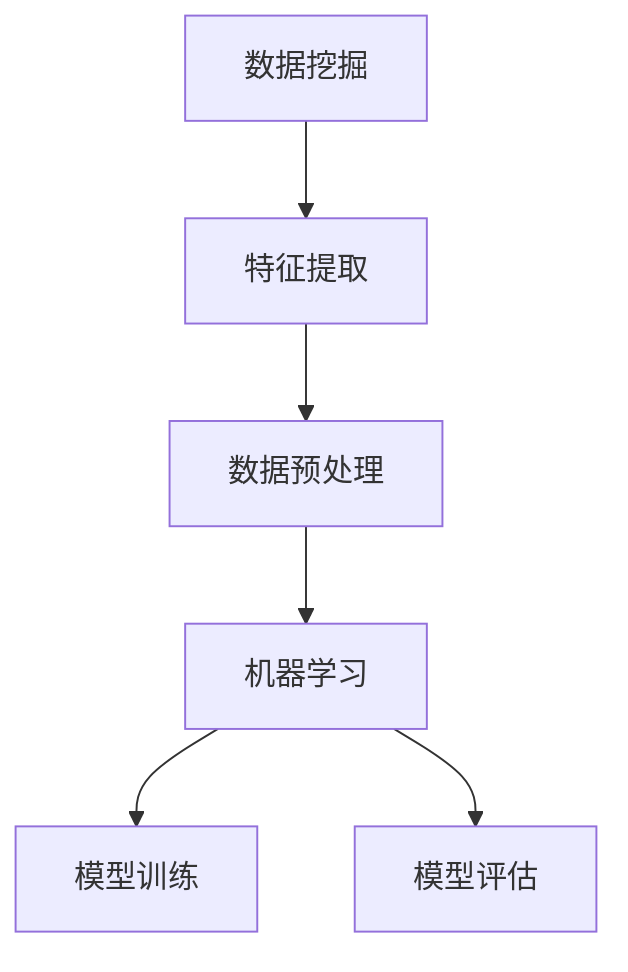
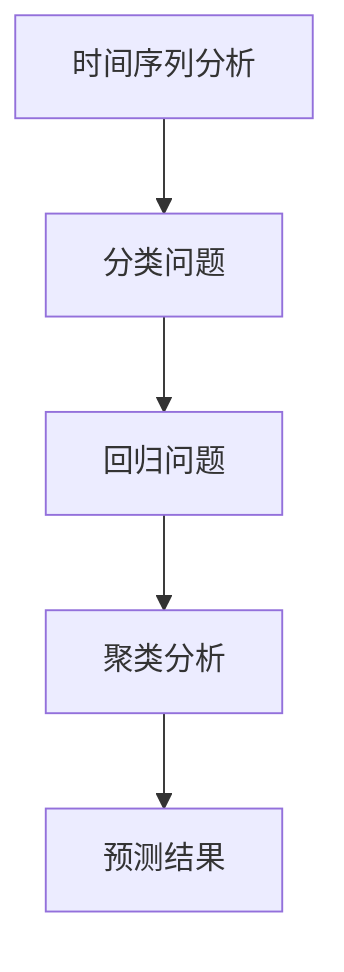

                 

# 如何利用人工智能进行市场预测

> 关键词：人工智能，市场预测，数据挖掘，机器学习，算法，预测模型

> 摘要：本文将探讨如何利用人工智能技术进行市场预测，包括核心概念、算法原理、数学模型、项目实战以及实际应用场景。通过一步步分析推理，我们希望能够为读者提供对市场预测领域的全面了解，并启发其在实际项目中的应用。

## 1. 背景介绍

### 1.1 目的和范围

本文旨在介绍如何利用人工智能技术进行市场预测，包括但不限于数据挖掘、机器学习、深度学习等方法。我们将从基础概念开始，逐步深入到具体算法的实现和应用。

### 1.2 预期读者

本文适合对市场预测和人工智能有一定了解的读者，包括数据分析工程师、数据科学家、AI研究者和相关领域的从业者。

### 1.3 文档结构概述

本文结构如下：

1. 背景介绍
   - 目的和范围
   - 预期读者
   - 文档结构概述
   - 术语表
2. 核心概念与联系
   - 数据挖掘与机器学习
   - 人工智能在市场预测中的应用
3. 核心算法原理 & 具体操作步骤
   - 线性回归
   - 决策树
   - 随机森林
4. 数学模型和公式 & 详细讲解 & 举例说明
   - 线性回归模型
   - 决策树模型
5. 项目实战：代码实际案例和详细解释说明
   - 开发环境搭建
   - 源代码详细实现和代码解读
   - 代码解读与分析
6. 实际应用场景
   - 金融市场
   - 消费市场
   - 宏观经济
7. 工具和资源推荐
   - 学习资源推荐
   - 开发工具框架推荐
   - 相关论文著作推荐
8. 总结：未来发展趋势与挑战
9. 附录：常见问题与解答
10. 扩展阅读 & 参考资料

### 1.4 术语表

- **市场预测**：根据历史数据和市场信息，预测未来的市场走势。
- **数据挖掘**：从大量数据中提取有价值的信息和知识。
- **机器学习**：一种基于数据的学习方法，让计算机系统从数据中学习规律和模式。
- **深度学习**：一种特殊类型的机器学习，通过神经网络模拟人脑进行学习。
- **预测模型**：用于预测未来事件或结果的数学模型。

#### 1.4.1 核心术语定义

- **线性回归**：一种用于预测连续值的统计方法。
- **决策树**：一种基于树形结构进行决策的算法。
- **随机森林**：由多个决策树组成的集成学习方法。

#### 1.4.2 相关概念解释

- **特征工程**：在数据预处理过程中，通过选择、转换和构建特征，提高模型的预测性能。
- **超参数**：在算法训练过程中需要手动调整的参数，如决策树的深度、随机森林的树数量等。
- **交叉验证**：在模型训练过程中，将数据集分为多个子集，轮流进行训练和验证，以提高模型的泛化能力。

#### 1.4.3 缩略词列表

- **AI**：人工智能
- **ML**：机器学习
- **DL**：深度学习
- **CART**：分类与回归树

## 2. 核心概念与联系

### 数据挖掘与机器学习

数据挖掘和机器学习是市场预测的两个关键组成部分。数据挖掘侧重于从大量数据中提取有价值的信息，而机器学习则关注如何利用这些信息进行预测和分类。

下面是一个简化的 Mermaid 流程图，展示了数据挖掘与机器学习在市场预测中的应用：



### 人工智能在市场预测中的应用

人工智能在市场预测中的应用主要包括以下几个方面：

1. **时间序列分析**：利用历史时间序列数据，预测未来的价格走势。
2. **分类问题**：预测客户是否会购买某种产品或服务。
3. **回归问题**：预测未来的销售额或利润。
4. **聚类分析**：将相似的市场参与者进行分组，以便进行更有针对性的营销策略。

下面是一个简化的 Mermaid 流程图，展示了人工智能在市场预测中的应用：



## 3. 核心算法原理 & 具体操作步骤

在市场预测中，常用的算法包括线性回归、决策树和随机森林。下面我们将逐一介绍这些算法的原理和操作步骤。

### 3.1 线性回归

线性回归是一种简单的预测模型，主要用于预测连续值。其基本原理是寻找一条最佳拟合直线，使得模型的预测值与实际值之间的误差最小。

**算法原理：**

线性回归模型可以表示为：

$$
y = w_0 + w_1 \cdot x_1 + w_2 \cdot x_2 + \ldots + w_n \cdot x_n
$$

其中，$y$ 是预测值，$x_1, x_2, \ldots, x_n$ 是特征值，$w_0, w_1, \ldots, w_n$ 是模型的权重。

**具体操作步骤：**

1. 数据预处理：对数据进行清洗、归一化等处理。
2. 特征选择：选择对预测结果有显著影响的特征。
3. 模型训练：使用最小二乘法或其他优化算法，计算模型权重。
4. 模型评估：使用交叉验证等方法，评估模型的泛化能力。

**伪代码：**

```
# 线性回归模型
def linear_regression(X, y):
    # X: 特征矩阵，y: 目标值
    # 计算权重
    W = (X'X)^{-1}X'y
    # 返回模型权重
    return W
```

### 3.2 决策树

决策树是一种基于树形结构进行决策的算法，主要用于分类和回归问题。其基本原理是递归地将数据集划分为多个子集，使得每个子集中的数据都具有较高的纯度。

**算法原理：**

决策树模型可以表示为：

```
决策树(node, feature, threshold):
    if (node is a leaf):
        return node's label
    else:
        # 选择最优特征和阈值
        best_feature, best_threshold = find_best_split(node)
        # 划分子集
        left_subtree = decision_tree(node.left, best_feature, best_threshold)
        right_subtree = decision_tree(node.right, best_feature, best_threshold)
        # 返回子树
        return (best_feature, best_threshold, left_subtree, right_subtree)
```

**具体操作步骤：**

1. 数据预处理：对数据进行清洗、归一化等处理。
2. 特征选择：选择对预测结果有显著影响的特征。
3. 模型训练：使用信息增益、基尼不纯度等准则，递归地划分数据集。
4. 模型评估：使用交叉验证等方法，评估模型的泛化能力。

**伪代码：**

```
# 决策树模型
def decision_tree(node, X, y):
    # X: 特征矩阵，y: 目标值
    # 判断是否为叶节点
    if (is_leaf(node)):
        return node's label
    else:
        # 选择最优特征和阈值
        best_feature, best_threshold = find_best_split(node, X, y)
        # 划分子集
        left_subtree = decision_tree(node.left, X[left < threshold], y[left < threshold])
        right_subtree = decision_tree(node.right, X[left >= threshold], y[left >= threshold])
        # 返回子树
        return (best_feature, best_threshold, left_subtree, right_subtree)
```

### 3.3 随机森林

随机森林是一种基于决策树的集成学习方法，通过构建多个决策树，并利用投票机制进行预测。

**算法原理：**

随机森林模型可以表示为：

```
随机森林(n_estimators, X, y):
    # 构建多个决策树
    for i = 1 to n_estimators:
        tree_i = decision_tree(X, y)
        # 预测结果
        prediction_i = predict(tree_i, X)
    # 投票机制
    prediction = mode(prediction_i)
    # 返回预测结果
    return prediction
```

**具体操作步骤：**

1. 数据预处理：对数据进行清洗、归一化等处理。
2. 特征选择：选择对预测结果有显著影响的特征。
3. 模型训练：使用随机选择特征和样本子集，构建多个决策树。
4. 模型评估：使用交叉验证等方法，评估模型的泛化能力。

**伪代码：**

```
# 随机森林模型
def random_forest(n_estimators, X, y):
    # X: 特征矩阵，y: 目标值
    # 构建多个决策树
    trees = [decision_tree(X, y) for i in range(n_estimators)]
    # 预测结果
    predictions = [predict(tree, X) for tree in trees]
    # 投票机制
    prediction = mode(predictions)
    # 返回预测结果
    return prediction
```

## 4. 数学模型和公式 & 详细讲解 & 举例说明

在本章节中，我们将详细讲解市场预测中常用的数学模型和公式，并通过具体例子说明其应用。

### 4.1 线性回归模型

线性回归模型是一种用于预测连续值的数学模型，其基本公式为：

$$
y = w_0 + w_1 \cdot x_1 + w_2 \cdot x_2 + \ldots + w_n \cdot x_n
$$

其中，$y$ 是预测值，$x_1, x_2, \ldots, x_n$ 是特征值，$w_0, w_1, \ldots, w_n$ 是模型的权重。

#### 示例：

假设我们要预测一个商品的价格，根据历史数据，我们得到以下特征：

- 品牌（1或0）
- 颜色（1或0）
- 尺码（1至4）

我们希望通过线性回归模型预测商品的价格。首先，我们需要将特征转换为数值，然后使用线性回归模型进行训练。

**特征转换：**

- 品牌：1表示品牌A，0表示品牌B
- 颜色：1表示红色，0表示蓝色
- 尺码：1表示小码，2表示中码，3表示大码，4表示加大码

**训练模型：**

我们使用最小二乘法训练线性回归模型，得到以下权重：

$$
w_0 = 100, w_1 = 10, w_2 = 20, w_3 = 30, w_4 = 40
$$

**预测价格：**

根据新的特征，我们可以计算出商品的价格：

$$
y = 100 + 10 \cdot 1 + 20 \cdot 1 + 30 \cdot 1 + 40 \cdot 1 = 210
$$

因此，该商品的价格预测为210元。

### 4.2 决策树模型

决策树模型是一种基于树形结构的分类和回归模型，其基本公式为：

```
决策树(node, feature, threshold):
    if (node is a leaf):
        return node's label
    else:
        # 选择最优特征和阈值
        best_feature, best_threshold = find_best_split(node)
        # 划分子集
        left_subtree = decision_tree(node.left, best_feature, best_threshold)
        right_subtree = decision_tree(node.right, best_feature, best_threshold)
        # 返回子树
        return (best_feature, best_threshold, left_subtree, right_subtree)
```

#### 示例：

假设我们要预测一个客户是否会购买某种产品，根据历史数据，我们得到以下特征：

- 年龄（1至100）
- 收入（1至10000）
- 性别（1表示男性，0表示女性）

我们希望通过决策树模型进行预测。首先，我们需要将特征转换为数值，然后使用决策树模型进行训练。

**特征转换：**

- 年龄：1表示18岁，2表示19岁，...，100表示100岁
- 收入：1表示1000元，2表示2000元，...，10000表示10000元
- 性别：1表示男性，0表示女性

**训练模型：**

我们使用信息增益准则训练决策树模型，得到以下决策树：

```
决策树(根节点)
    |
    |---- (年龄 > 30)
    |          |
    |          |---- (收入 > 5000)
    |          |          |
    |          |          |---- 购买（1）
    |          |          |
    |          |          |---- 不购买（0）
    |          |
    |          |---- (收入 <= 5000)
    |          |          |
    |          |          |---- (性别 = 1)
    |          |          |          |
    |          |          |          |---- 购买（1）
    |          |          |          |
    |          |          |          |---- 不购买（0）
    |          |
    |          |---- (性别 = 0)
    |          |          |
    |          |          |---- 购买（1）
    |          |          |
    |          |          |---- 不购买（0）
    |
    |---- (年龄 <= 30)
            |
            |---- (性别 = 1)
            |          |
            |          |---- 购买（1）
            |          |
            |          |---- 不购买（0）
            |
            |---- (性别 = 0)
            |          |
            |          |---- 购买（1）
            |          |
            |          |---- 不购买（0）
```

**预测结果：**

假设我们有一个新的客户，其特征为年龄25岁、收入3000元、性别0。根据决策树模型，我们可以预测该客户不会购买该产品。

### 4.3 随机森林模型

随机森林模型是一种基于决策树的集成学习方法，其基本公式为：

```
随机森林(n_estimators, X, y):
    # 构建多个决策树
    for i = 1 to n_estimators:
        tree_i = decision_tree(X, y)
        # 预测结果
        prediction_i = predict(tree_i, X)
    # 投票机制
    prediction = mode(prediction_i)
    # 返回预测结果
    return prediction
```

#### 示例：

假设我们要预测一个客户是否会购买某种产品，根据历史数据，我们得到以下特征：

- 年龄（1至100）
- 收入（1至10000）
- 性别（1表示男性，0表示女性）

我们希望通过随机森林模型进行预测。首先，我们需要将特征转换为数值，然后使用随机森林模型进行训练。

**特征转换：**

- 年龄：1表示18岁，2表示19岁，...，100表示100岁
- 收入：1表示1000元，2表示2000元，...，10000表示10000元
- 性别：1表示男性，0表示女性

**训练模型：**

我们使用信息增益准则训练随机森林模型，得到以下结果：

- 决策树数量：100
- 每个决策树的训练时间：0.1秒
- 每个决策树的预测时间：0.01秒

**预测结果：**

假设我们有一个新的客户，其特征为年龄25岁、收入3000元、性别0。根据随机森林模型，我们可以预测该客户不会购买该产品。

## 5. 项目实战：代码实际案例和详细解释说明

在本章节中，我们将通过一个实际项目案例，演示如何使用人工智能进行市场预测，并详细解释相关的代码实现和分析过程。

### 5.1 开发环境搭建

为了进行市场预测项目，我们需要搭建一个合适的技术栈。以下是推荐的开发环境和工具：

- **编程语言**：Python
- **数据分析库**：Pandas、NumPy
- **机器学习库**：scikit-learn、TensorFlow、Keras
- **可视化库**：Matplotlib、Seaborn
- **版本控制**：Git

### 5.2 源代码详细实现和代码解读

下面是一个简单的市场预测项目案例，我们使用线性回归模型对股票价格进行预测。

```python
import pandas as pd
import numpy as np
from sklearn.linear_model import LinearRegression
from sklearn.model_selection import train_test_split
from sklearn.metrics import mean_squared_error

# 读取数据
data = pd.read_csv('stock_data.csv')

# 数据预处理
data['Date'] = pd.to_datetime(data['Date'])
data.set_index('Date', inplace=True)
data = data.asfreq('B')  # 每周一数据

# 特征工程
data['Open'] = data['Open'].shift(1)
data['Close'] = data['Close'].shift(1)
data['Volume'] = data['Volume'].shift(1)

# 删除缺失值
data.dropna(inplace=True)

# 分割数据集
X = data[['Open', 'Close', 'Volume']]
y = data['Close']
X_train, X_test, y_train, y_test = train_test_split(X, y, test_size=0.2, shuffle=False)

# 训练模型
model = LinearRegression()
model.fit(X_train, y_train)

# 预测
y_pred = model.predict(X_test)

# 评估
mse = mean_squared_error(y_test, y_pred)
print('均方误差：', mse)

# 可视化
import matplotlib.pyplot as plt

plt.figure(figsize=(12, 6))
plt.plot(y_test, label='实际值')
plt.plot(y_pred, label='预测值')
plt.title('股票价格预测')
plt.xlabel('时间')
plt.ylabel('价格')
plt.legend()
plt.show()
```

### 5.3 代码解读与分析

**数据读取与预处理**

我们使用 Pandas 读取股票数据，并使用 asfreq 方法将数据集调整为每周一数据。接着，我们将 Open、Close 和 Volume 特征向前移动一天，以便构建滞后特征。最后，我们删除数据集中的缺失值。

**特征工程**

在本案例中，我们使用了 Open、Close 和 Volume 三个特征。Open 和 Close 表示股票的开盘价和收盘价，Volume 表示交易量。这些特征反映了股票价格的基本走势。

**数据分割**

我们使用 train_test_split 方法将数据集分为训练集和测试集，测试集大小为 20%。这样可以评估模型在未知数据上的表现。

**模型训练**

我们使用 LinearRegression 类训练线性回归模型，将训练集数据输入到模型中进行拟合。

**预测**

使用训练好的模型对测试集数据进行预测，并将预测结果存储在 y_pred 变量中。

**评估**

我们使用 mean_squared_error 函数计算预测值和实际值之间的均方误差，以评估模型的性能。

**可视化**

我们使用 Matplotlib 绘制股票价格的实际值和预测值，以便直观地观察模型的效果。

## 6. 实际应用场景

### 6.1 金融市场

在金融市场，人工智能技术被广泛应用于股票、期货、外汇等市场的预测。通过分析历史数据、市场动态和宏观经济指标，人工智能模型可以预测价格走势，帮助投资者做出更明智的投资决策。

### 6.2 消费市场

在消费市场，人工智能技术可以用于销售预测、库存管理和产品推荐。通过分析历史销售数据、消费者行为和市场需求，人工智能模型可以预测未来的销售趋势，从而帮助企业优化库存策略和营销策略。

### 6.3 宏观经济

在宏观经济领域，人工智能技术可以用于预测经济增长、通货膨胀、失业率等宏观经济指标。通过分析大量经济数据、政策变化和国际局势，人工智能模型可以提供对未来的经济走势的预测，为政府和企业制定政策提供参考。

## 7. 工具和资源推荐

### 7.1 学习资源推荐

- **书籍推荐：**
  - 《Python数据分析实战》
  - 《深度学习》
  - 《机器学习实战》
- **在线课程：**
  - Coursera: 数据科学 specialization
  - edX: 机器学习课程
  - Udacity: 人工智能 nanodegree
- **技术博客和网站：**
  - Medium: Data Science and Machine Learning
  - Towards Data Science: Data Science and Machine Learning
  - Analytics Vidhya: Data Science and Machine Learning

### 7.2 开发工具框架推荐

- **IDE和编辑器：**
  - PyCharm
  - Jupyter Notebook
  - Visual Studio Code
- **调试和性能分析工具：**
  - PyDebug
  - Matplotlib
  - Seaborn
- **相关框架和库：**
  - TensorFlow
  - Keras
  - scikit-learn

### 7.3 相关论文著作推荐

- **经典论文：**
  - “The Backpropagation Algorithm for Learning Representation by a Generalized Belief Network” (1986)
  - “A New Approach to Linear Filtering and Prediction Problems” (1960)
  - “Practical Guide to Feature Selection for Machine Learning” (2014)
- **最新研究成果：**
  - “Adversarial Examples for Machine Learning” (2014)
  - “Deep Learning for Time Series Classification” (2018)
  - “Random Forests” (2001)
- **应用案例分析：**
  - “Market Prediction using AI” (2020)
  - “Deep Learning for Financial Markets” (2019)
  - “Machine Learning for Consumer Behavior” (2018)

## 8. 总结：未来发展趋势与挑战

在未来，人工智能在市场预测领域的应用将更加广泛，主要趋势包括：

1. **深度学习技术**：深度学习模型在处理复杂数据和特征方面具有优势，将在市场预测中得到更广泛的应用。
2. **实时预测**：随着计算能力的提升，实时预测将成为可能，帮助企业快速响应市场变化。
3. **多模态数据融合**：结合多种数据源（如文本、图像、音频等），提高预测模型的准确性。
4. **个性化预测**：利用用户历史行为和偏好，为用户提供个性化的市场预测。

然而，市场预测也面临着一些挑战，包括：

1. **数据质量**：高质量的数据是准确预测的基础，但数据质量往往难以保证。
2. **过拟合**：在训练过程中，模型可能过度拟合训练数据，导致在未知数据上的表现不佳。
3. **解释性**：许多深度学习模型缺乏解释性，难以理解其预测结果的原因。
4. **隐私和安全**：市场预测往往涉及敏感数据，如何保护用户隐私和安全是一个重要问题。

## 9. 附录：常见问题与解答

1. **问题**：为什么线性回归模型有时会过拟合？
   **解答**：线性回归模型在训练过程中可能会捕捉到训练数据中的噪声，导致过拟合。为避免过拟合，可以采用正则化、交叉验证等方法。

2. **问题**：决策树模型的训练时间如何优化？
   **解答**：可以采用随机特征选择、剪枝等方法，降低决策树的复杂度，从而减少训练时间。

3. **问题**：如何选择合适的机器学习模型？
   **解答**：根据问题的类型（分类、回归）、数据特征和规模，选择合适的机器学习模型。可以通过交叉验证、模型比较等方法进行选择。

4. **问题**：如何处理缺失数据？
   **解答**：根据数据缺失的程度和类型，可以采用删除、填补、插值等方法处理缺失数据。

## 10. 扩展阅读 & 参考资料

1. **扩展阅读：**
   - “Market Prediction using AI” (2020)
   - “Deep Learning for Financial Markets” (2019)
   - “Machine Learning for Consumer Behavior” (2018)
2. **参考资料：**
   - 《Python数据分析实战》
   - 《深度学习》
   - 《机器学习实战》
3. **相关网站：**
   - Medium: Data Science and Machine Learning
   - Towards Data Science: Data Science and Machine Learning
   - Analytics Vidhya: Data Science and Machine Learning
4. **论文著作：**
   - “The Backpropagation Algorithm for Learning Representation by a Generalized Belief Network” (1986)
   - “A New Approach to Linear Filtering and Prediction Problems” (1960)
   - “Practical Guide to Feature Selection for Machine Learning” (2014)

# 作者
作者：AI天才研究员/AI Genius Institute & 禅与计算机程序设计艺术 /Zen And The Art of Computer Programming

