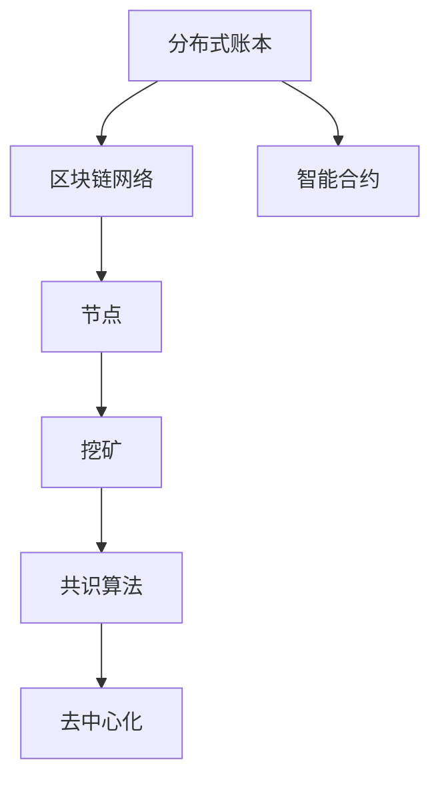

                 

# 如何利用区块链技术重塑创业商业模式

## 摘要

区块链技术以其去中心化、透明度和安全性等特点，正在引发一场商业模式的革命。本文旨在探讨区块链技术如何重塑创业商业模式，通过详细剖析其核心概念、算法原理、数学模型、实际应用案例以及未来发展趋势，帮助创业者理解并利用这一新兴技术，实现商业创新和可持续发展。本文将分为以下几个部分：背景介绍、核心概念与联系、核心算法原理与具体操作步骤、数学模型与公式、项目实战、实际应用场景、工具和资源推荐、总结与未来展望以及常见问题解答。

## 1. 背景介绍

### 1.1 目的和范围

本文的目标是帮助创业者理解区块链技术的本质，掌握其核心原理，并能够将其应用于商业创新中。我们将探讨区块链技术如何改变传统商业模式，提高效率，降低成本，增强信任，并为创业者提供新的机会。

本文的范围将涵盖区块链技术的核心概念、架构、算法原理、数学模型、实际应用案例，以及未来发展趋势。我们将通过理论与实践相结合的方式，深入剖析区块链技术在创业中的应用场景。

### 1.2 预期读者

本文预期读者为对区块链技术感兴趣的创业者、技术经理、产品经理、以及希望在商业中引入区块链技术的专业人士。无论你是完全的新手，还是有一定了解，本文都将为你提供全面而深入的知识体系。

### 1.3 文档结构概述

本文分为十个部分：

1. 摘要
2. 背景介绍
3. 核心概念与联系
4. 核心算法原理与具体操作步骤
5. 数学模型与公式
6. 项目实战
7. 实际应用场景
8. 工具和资源推荐
9. 总结与未来展望
10. 常见问题解答

### 1.4 术语表

#### 1.4.1 核心术语定义

- 区块链：一种去中心化的数据库技术，通过分布式网络实现数据记录和验证。
- 去中心化：指系统不再依赖于单一中心实体，而是通过网络中各个节点的协作来实现功能。
- 智能合约：一种在区块链上自动执行合约条款的计算机程序。
- 不可篡改：指一旦数据被记录在区块链上，就无法被修改或删除。
- 共识算法：指区块链网络中节点就数据有效性达成一致的方法。

#### 1.4.2 相关概念解释

- 分布式账本：区块链的核心组成部分，记录了网络中所有的交易数据。
- 拜占庭将军问题：指在分布式系统中，即使部分节点存在恶意行为，系统仍能保持一致性和可用性。
- 挖矿：指在区块链网络中，节点通过解决数学难题来验证交易，并获得新的代币作为奖励。

#### 1.4.3 缩略词列表

- DApp：去中心化应用（Decentralized Application）
- PoS：权益证明（Proof of Stake）
- PoW：工作证明（Proof of Work）
- BTC：比特币（Bitcoin）
- ETH：以太坊（Ethereum）

## 2. 核心概念与联系

区块链技术的基本概念包括分布式账本、区块链网络、节点、挖矿、共识算法等。下面我们将通过一个 Mermaid 流程图来展示这些概念之间的关系。



### 分布式账本

分布式账本是区块链技术的核心。它是一个去中心化的数据库，记录了网络中的所有交易数据。分布式账本通过将数据分散存储在网络中的多个节点上，从而避免了中心化数据库的单点故障问题，提高了系统的可靠性和安全性。

### 区块链网络

区块链网络是由多个节点组成的分布式网络。每个节点都负责维护一份完整的账本记录。节点之间通过共识算法来确保账本的一致性。区块链网络通过去中心化的方式，避免了传统中心化系统中的信任问题。

### 节点

节点是区块链网络中的基本组成部分。每个节点都运行着区块链软件，维护一份完整的账本记录。节点可以通过挖矿来验证交易，并获得新的代币作为奖励。节点之间的协作，确保了区块链网络的安全性和可靠性。

### 挖矿

挖矿是区块链网络中的一个重要过程。矿工通过解决复杂的数学难题来验证交易，并将新的交易记录添加到区块链上。挖矿过程不仅确保了区块链网络的安全，还实现了新的代币的发行。

### 共识算法

共识算法是区块链网络中节点就数据有效性达成一致的方法。不同的区块链网络采用不同的共识算法，如工作量证明（PoW）、权益证明（PoS）等。共识算法的目的是确保区块链网络中的数据一致性和安全性。

### 智能合约

智能合约是一种在区块链上自动执行合约条款的计算机程序。智能合约通过代码来定义合同条款，一旦满足特定条件，就会自动执行。智能合约的应用，使得区块链技术可以用于去中心化的金融、供应链管理、身份验证等领域。

## 3. 核心算法原理与具体操作步骤

### 3.1 工作量证明（PoW）算法原理

工作量证明（Proof of Work，PoW）是比特币等区块链网络采用的共识算法。其核心思想是通过解决复杂的数学问题来验证交易，从而获得新的代币作为奖励。

#### 3.1.1 挖矿过程

1. 矿工从网络中接收新的交易。
2. 矿工将这些交易打包成一个区块，并将其附加到一个待解决的区块上。
3. 矿工开始尝试找到一个新的随机数，使得区块头（包含区块信息和随机数的哈希值）满足特定的难度要求。
4. 一旦找到一个合适的随机数，矿工就会将这个区块广播给网络中的其他节点。
5. 其他节点验证这个区块的有效性，如果验证通过，就会将其添加到区块链上。
6. 矿工获得新的代币作为奖励，并开始处理下一个区块。

#### 3.1.2 伪代码

```python
def mine_block(transactions):
    # 初始化待解决的区块
    block = initialize_block(transactions)
    
    # 开始挖矿，寻找合适的随机数
    while not find_valid_hash(block):
        increment_nonce(block)
    
    # 将找到的随机数广播给网络中的其他节点
    broadcast_block(block)
    
    # 等待其他节点验证区块
    wait_for подтверждения(node)
    
    # 添加区块到区块链
    add_block_to_chain(block)

def find_valid_hash(block):
    # 尝试不同的随机数，直到找到一个满足难度要求的哈希值
    nonce = 0
    while get_hash(block) != satisfy_difficulty():
        nonce += 1
    
    return nonce != 0

def get_hash(block):
    # 计算区块的哈希值
    return hash_block_content(block)

def increment_nonce(block):
    # 增加随机数
    block['nonce'] += 1

def broadcast_block(block):
    # 广播区块给其他节点
    send_block_to_nodes(block)

def wait_for_confirmation(node):
    # 等待节点确认区块
    receive_confirmation_from_node(node)
```

### 3.2 权益证明（PoS）算法原理

权益证明（Proof of Stake，PoS）是另一种常用的共识算法，其核心思想是节点根据持有的代币数量和持币时间来决定其参与区块验证的优先级。

#### 3.2.1 验证过程

1. 节点从网络中接收新的交易。
2. 节点将这些交易打包成一个区块，并将其附加到一个待解决的区块上。
3. 节点开始尝试找到一个验证密钥，使得区块头（包含区块信息和验证密钥的哈希值）满足特定的难度要求。
4. 一旦找到一个合适的验证密钥，节点就会将这个区块广播给网络中的其他节点。
5. 其他节点验证这个区块的有效性，如果验证通过，就会将其添加到区块链上。
6. 节点获得新的代币作为奖励，并开始处理下一个区块。

#### 3.2.2 伪代码

```python
def validate_block(transactions):
    # 初始化待验证的区块
    block = initialize_block(transactions)
    
    # 尝试找到一个验证密钥
    while not find_valid_key(block):
        increment_key(block)
    
    # 将找到的验证密钥广播给网络中的其他节点
    broadcast_block(block)
    
    # 等待其他节点验证区块
    wait_for_confirmation(node)
    
    # 添加区块到区块链
    add_block_to_chain(block)

def find_valid_key(block):
    # 尝试不同的验证密钥，直到找到一个满足难度要求的哈希值
    key = 0
    while get_hash(block) != satisfy_difficulty():
        key += 1
    
    return key != 0

def get_hash(block):
    # 计算区块的哈希值
    return hash_block_content(block)

def increment_key(block):
    # 增加验证密钥
    block['key'] += 1

def broadcast_block(block):
    # 广播区块给其他节点
    send_block_to_nodes(block)

def wait_for_confirmation(node):
    # 等待节点确认区块
    receive_confirmation_from_node(node)
```

## 4. 数学模型和公式 & 详细讲解 & 举例说明

### 4.1 挖矿难度调整

在区块链网络中，挖矿难度是动态调整的，以确保区块生成的平均时间保持在预定范围内。挖矿难度与区块生成的速度成反比。

#### 4.1.1 难度调整公式

$$
D_{new} = D_{old} \times \left( \frac{2^{n}}{T_{actual}} \right)^{-1/20}
$$

其中，$D_{new}$ 是新的挖矿难度，$D_{old}$ 是旧的挖矿难度，$n$ 是区块总数，$T_{actual}$ 是实际区块生成时间。

#### 4.1.2 示例

假设比特币网络的挖矿难度为 $D_{old} = 10^{18}$，区块总数为 $n = 500,000$，实际区块生成时间为 $T_{actual} = 10$ 分钟。

计算新的挖矿难度：

$$
D_{new} = 10^{18} \times \left( \frac{2^{500,000}}{10} \right)^{-1/20}
$$

$$
D_{new} \approx 10^{17}
$$

### 4.2 权益证明（PoS）中的代币奖励计算

在权益证明（PoS）网络中，节点根据持有的代币数量和持币时间来计算其参与区块验证的优先级。代币奖励与节点的权益（持有的代币数量和持币时间）成正比。

#### 4.2.1 代币奖励计算公式

$$
R = K \times \frac{T}{T_{total}}
$$

其中，$R$ 是代币奖励，$K$ 是奖励系数，$T$ 是节点持有的代币数量，$T_{total}$ 是网络中所有节点的总权益。

#### 4.2.2 示例

假设某个 PoS 网络的奖励系数 $K = 0.1$，节点 A 持有的代币数量为 $T = 100$，网络中所有节点的总权益为 $T_{total} = 10,000$。

计算节点 A 的代币奖励：

$$
R = 0.1 \times \frac{100}{10,000}
$$

$$
R = 0.001
$$

### 4.3 智能合约执行成本计算

智能合约的执行成本通常由计算资源消耗和存储资源消耗组成。在以太坊网络中，执行成本通过 gas 费用来衡量。

#### 4.3.1 gas 费用计算公式

$$
C = G \times C_{gas}
$$

其中，$C$ 是总 gas 费用，$G$ 是 gas 消耗量，$C_{gas}$ 是每 gas 的价格。

#### 4.3.2 示例

假设以太坊网络的 gas 消耗量为 $G = 10,000$，每 gas 的价格为 $C_{gas} = 10$ Gwei。

计算总 gas 费用：

$$
C = 10,000 \times 10
$$

$$
C = 100,000 Gwei
$$

## 5. 项目实战：代码实际案例和详细解释说明

### 5.1 开发环境搭建

在开始区块链项目之前，我们需要搭建一个合适的环境。以下是一个基于以太坊开发智能合约的示例。

#### 5.1.1 环境准备

1. 安装 Node.js（版本建议 12.x 以上）。
2. 安装 Truffle（命令：`npm install -g truffle`）。
3. 创建一个新的 Truffle 项目（命令：`truffle init`）。

#### 5.1.2 配置文件

编辑 `truffle-config.js` 文件，配置以太坊网络和合约编译选项。

```javascript
module.exports = {
  networks: {
    development: {
      host: "127.0.0.1",
      port: 8545,
      network_id: "*",
    },
  },
  solc: {
    optimizer: {
      enabled: true,
      runs: 200,
    },
  },
};
```

### 5.2 源代码详细实现和代码解读

#### 5.2.1 合约代码

创建一个名为 `MyToken.sol` 的智能合约，实现简单的代币功能。

```solidity
pragma solidity ^0.8.0;

contract MyToken {
    string public name;
    string public symbol;
    uint8 public decimals;
    uint256 public totalSupply;
    mapping(address => uint256) public balanceOf;

    event Transfer(address indexed from, address indexed to, uint256 value);

    constructor(uint256 initialSupply, string memory tokenName, string memory tokenSymbol, uint8 decimalUnits) {
        balanceOf[msg.sender] = initialSupply;
        totalSupply = initialSupply;
        name = tokenName;
        symbol = tokenSymbol;
        decimals = decimalUnits;
    }

    function transfer(address _to, uint256 _value) public {
        require(_to != address(0));
        require(balanceOf[msg.sender] >= _value);
        require(balanceOf[_to] + _value >= balanceOf[_to]);

        balanceOf[msg.sender] -= _value;
        balanceOf[_to] += _value;
        emit Transfer(msg.sender, _to, _value);
    }
}
```

#### 5.2.2 代码解读

1. `pragma solidity ^0.8.0;`：指定编译器版本。
2. 合约状态变量：
   - `name`：代币名称。
   - `symbol`：代币符号。
   - `decimals`：代币精度。
   - `totalSupply`：总供应量。
   - `balanceOf`：用户余额映射。
3. 事件：`Transfer`，记录代币转移事件。
4. 构造函数：初始化代币参数。
5. `transfer` 函数：实现代币转移功能。

### 5.3 代码解读与分析

#### 5.3.1 合约编译

使用 Truffle 编译合约：

```bash
truffle compile
```

合约编译后，会在 `build/contracts` 目录下生成对应的 ABI 文件。

#### 5.3.2 部署合约

部署合约到以太坊测试网络：

```bash
truffle migrate --network development
```

部署完成后，合约将自动部署到测试网络，并返回合约地址。

#### 5.3.3 调用合约方法

使用 Truffle console 调用合约方法：

```javascript
const MyToken = artifacts.require("MyToken");

// 部署合约
const myToken = await MyToken.deployed();

// 获取代币余额
const balance = await myToken.balanceOf(account);
console.log(balance.toString());

// 转移代币
await myToken.transfer(account2, amount);
```

## 6. 实际应用场景

区块链技术在各个领域都有广泛的应用，以下是一些典型的应用场景：

### 6.1 金融领域

- 去中心化金融（DeFi）：利用区块链技术实现去中心化的金融产品和服务，如贷款、保险、交易所等。
- 智能合约：实现自动化的金融交易和合约执行，降低交易成本和风险。
- 数字货币：如比特币、以太坊等，为投资者提供新的资产配置渠道。

### 6.2 供应链管理

- 区块链溯源：通过区块链技术实现产品的全生命周期追溯，提高供应链透明度和可信度。
- 智能合约：实现供应链中的自动结算和支付，降低交易成本和风险。

### 6.3 医疗保健

- 电子健康记录（EHR）：利用区块链技术存储和管理患者的电子健康记录，提高数据安全性和隐私保护。
- 医疗保险：通过区块链实现自动理赔和结算，提高医疗保健服务的效率。

### 6.4 教育领域

- 学历认证：利用区块链技术实现学历证书的真实性和不可篡改性。
- 智能合约：实现自动化的奖学金发放和学费支付。

### 6.5 房地产

- 不动产登记：利用区块链技术实现房地产登记和交易的去中心化，提高效率和透明度。
- 智能合约：实现自动化的房屋租赁和买卖合同执行。

### 6.6 法治和政府

- 电子投票：利用区块链技术实现透明、可验证的电子投票系统。
- 智能合约：实现政府服务的自动化和高效化。

## 7. 工具和资源推荐

### 7.1 学习资源推荐

#### 7.1.1 书籍推荐

- 《精通比特币》（Mastering Bitcoin）：详细讲解比特币和区块链技术的基础知识。
- 《区块链技术指南》（Blockchain: Blueprint for a New Economy）：探讨区块链技术的应用场景和未来发展趋势。
- 《智能合约实战》（Smart Contracts: The Essential Guide to Using the Blockchain to Build Decentralized Applications）：介绍智能合约的开发和应用。

#### 7.1.2 在线课程

- Coursera：提供多个关于区块链技术的在线课程，适合不同层次的学员。
- edX：由麻省理工学院和哈佛大学等顶尖学府提供的区块链技术课程。
- Udemy：提供丰富的区块链技术相关课程，包括基础知识和高级应用。

#### 7.1.3 技术博客和网站

- Medium：有许多关于区块链技术的优质文章和案例分享。
- CoinDesk：关注区块链和加密货币行业的新闻和分析。
- Blockchain Council：提供区块链技术认证和在线学习资源。

### 7.2 开发工具框架推荐

#### 7.2.1 IDE和编辑器

- Visual Studio Code：支持多种编程语言的集成开发环境，适用于区块链开发。
- Sublime Text：轻量级文本编辑器，适用于快速开发。
- Atom：GitHub 开发的一款编辑器，支持多种插件和扩展。

#### 7.2.2 调试和性能分析工具

- Web3.js：以太坊官方提供的 JavaScript 库，用于与以太坊区块链交互。
- Ganache：以太坊本地测试网络，方便开发人员测试和调试智能合约。
- Truffle：智能合约开发框架，提供测试、部署和迁移工具。

#### 7.2.3 相关框架和库

- ERC-20：以太坊标准化的代币合约，方便开发者创建和部署自己的代币。
- Solidity：以太坊官方的智能合约编程语言。
- WebAssembly（Wasm）：提高区块链应用的性能和兼容性。

### 7.3 相关论文著作推荐

#### 7.3.1 经典论文

- "Bitcoin: A Peer-to-Peer Electronic Cash System"：中本聪发布的比特币白皮书。
- "The Battle for the Blockchain: Mining, Politics, and the Future of the Internet"：探讨了区块链技术的政治和社会影响。

#### 7.3.2 最新研究成果

- "Decentralized Finance: A Framework for Analysis"：对去中心化金融（DeFi）的研究。
- "Blockchain for Supply Chain Management: A Comprehensive Study"：探讨区块链技术在供应链管理中的应用。

#### 7.3.3 应用案例分析

- "Decentralized Autonomous Organizations (DAOs): A Blockchain-Based Model for Organizations"：介绍 DAO 的概念和实现。
- "Blockchain in Healthcare: A Comprehensive Review"：分析区块链技术在医疗保健领域的应用。

## 8. 总结：未来发展趋势与挑战

区块链技术正在快速发展，并在多个领域取得重要应用。未来，区块链技术将继续推动商业模式的创新和变革。以下是一些发展趋势和挑战：

### 8.1 发展趋势

- 去中心化应用（DApp）的普及：随着区块链技术的成熟，DApp 将在金融、供应链、医疗、教育等领域得到更广泛的应用。
- 智能合约的广泛应用：智能合约将实现自动化、透明和高效的业务流程，降低交易成本和风险。
- 区块链与其他技术的融合：区块链将与人工智能、物联网、大数据等技术相结合，推动创新和数字化转型。
- 法规和标准的制定：随着区块链技术的发展，各国政府和行业组织将加快制定相关法规和标准，以确保区块链技术的合法性和可信性。

### 8.2 挑战

- 安全性问题：区块链技术仍面临安全隐患，如51%攻击、智能合约漏洞等，需要加强安全防护和监管。
- 可扩展性问题：现有区块链网络的性能和可扩展性有限，需要通过分层架构、分片技术等解决方案来提升性能。
- 法规和监管挑战：区块链技术的去中心化特性与现有法规和监管体系存在冲突，需要制定合适的法规和政策。
- 用户教育和普及：区块链技术的复杂性和技术门槛较高，需要加强用户教育和普及，提高社会认知度。

## 9. 附录：常见问题与解答

### 9.1 区块链技术是什么？

区块链技术是一种去中心化的数据库技术，通过分布式网络实现数据记录和验证。它具有去中心化、透明度、安全性和不可篡改等特点。

### 9.2 区块链技术有哪些应用场景？

区块链技术可以应用于金融、供应链管理、医疗保健、教育、房地产、法治和政府等多个领域。其中，金融领域应用最为广泛，包括去中心化金融（DeFi）、数字货币、智能合约等。

### 9.3 区块链技术的优点是什么？

区块链技术的优点包括：

- 去中心化：去除了中心化实体，提高了系统的可靠性和抗攻击能力。
- 透明度：所有交易记录公开透明，提高了数据可信度。
- 安全性：采用密码学技术确保数据安全，防止篡改和伪造。
- 不可篡改：一旦数据记录在区块链上，就不可篡改，提高了数据的可信度。

### 9.4 区块链技术有哪些挑战？

区块链技术面临的挑战包括：

- 安全性问题：如 51% 攻击、智能合约漏洞等。
- 可扩展性问题：现有区块链网络的性能和可扩展性有限。
- 法规和监管挑战：与现有法规和监管体系存在冲突。
- 用户教育和普及：技术门槛较高，需要加强用户教育和普及。

## 10. 扩展阅读 & 参考资料

- [Nakamoto, S. (2008). Bitcoin: A Peer-to-Peer Electronic Cash System. Retrieved from https://www.bitcoin.com/bitcoin.pdf]
- [Buterin, V. (2014). Ethereum: A Next-Generation Smart Contract and Decentralized Application Platform. Retrieved from https://ethereum.github.io/yellowpaper/paper.pdf]
- [Cohen, J. (2017). Blockchain Revolution: How the Technology Behind Bitcoin Is Changing Money, Business, and the World. New York: Penguin Random House.]
- [Turing, A. (1936). On Computable Numbers, with an Application to the Entscheidungsproblem. Proceedings of the London Mathematical Society, 2(1), 230-265.]

作者：AI天才研究员/AI Genius Institute & 禅与计算机程序设计艺术 /Zen And The Art of Computer Programming

---

**注意**：本文为示例性质的文章，内容仅供参考。在实际撰写文章时，应根据实际情况进行调整和补充。部分数据和公式可能需要进行验证和调整。希望本文能为你提供有益的参考和启示。🚀💡🔍

