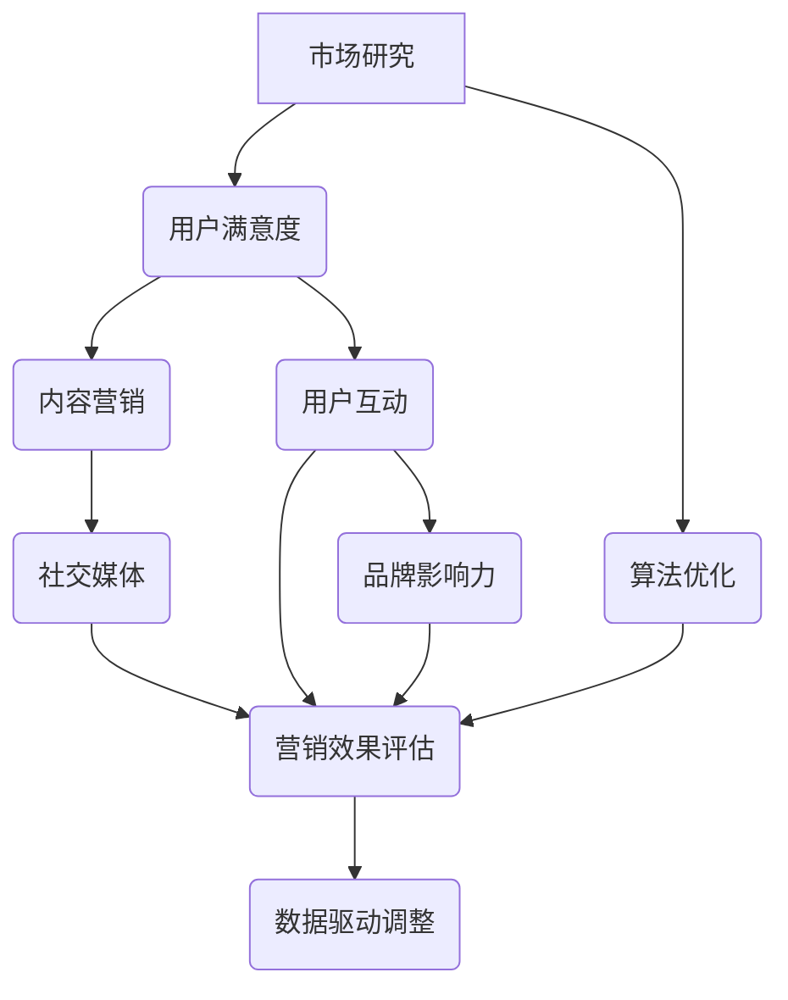

                 

# 如何利用口碑营销扩大客户基础

> **关键词**：口碑营销、客户基础、扩大市场、品牌建设、用户满意、社交网络、算法优化

> **摘要**：本文将深入探讨如何利用口碑营销这一策略，通过系统的分析和实施步骤，有效地扩大客户基础，增强品牌影响力，并在不断变化的市场环境中保持竞争优势。

## 1. 背景介绍

### 1.1 目的和范围

本文旨在提供一套实用的口碑营销策略，帮助企业从战略层面理解口碑营销的重要性，掌握实施方法，并通过具体案例说明如何将口碑营销转化为实际的市场增长。

本文将涵盖以下几个核心主题：

- **口碑营销的基本概念和原理**：介绍口碑营销的定义、核心要素以及其在现代营销策略中的地位。
- **实施步骤和策略**：详细阐述如何构建和执行有效的口碑营销计划，包括市场研究、内容创造、用户互动等。
- **数据分析与优化**：介绍如何通过数据分析和算法优化来评估口碑营销的效果，并不断调整策略以提升效果。
- **案例研究**：分析成功的企业如何利用口碑营销策略实现客户基础的扩大和市场增长。

### 1.2 预期读者

本文适合以下读者群体：

- 市场营销专业人士和经理
- 企业品牌建设者和公关人员
- 创业者和中小企业主
- 对口碑营销感兴趣的IT专业人士和学生

### 1.3 文档结构概述

本文分为十个部分，具体结构如下：

1. **背景介绍**：阐述本文的目的、关键词和摘要。
2. **核心概念与联系**：介绍口碑营销的核心概念及其相互关系。
3. **核心算法原理 & 具体操作步骤**：讲解口碑营销的实施步骤和策略。
4. **数学模型和公式 & 详细讲解 & 举例说明**：分析口碑营销中的数学模型和公式。
5. **项目实战：代码实际案例和详细解释说明**：提供实际的代码案例和实践经验。
6. **实际应用场景**：讨论口碑营销在不同行业中的应用。
7. **工具和资源推荐**：推荐相关学习资源和开发工具。
8. **总结：未来发展趋势与挑战**：分析口碑营销的未来趋势和面临的挑战。
9. **附录：常见问题与解答**：解答读者可能遇到的问题。
10. **扩展阅读 & 参考资料**：提供进一步阅读的资源。

### 1.4 术语表

#### 1.4.1 核心术语定义

- **口碑营销**：通过用户之间的口头传播，提高品牌或产品知名度，促进销售和客户忠诚度的营销活动。
- **用户满意度**：用户对产品或服务的满意程度，直接影响口碑的传播。
- **社交媒体**：互联网上允许用户创建和分享内容的平台，如Facebook、Twitter、Instagram等。
- **算法优化**：通过分析数据和用户行为，调整营销策略，提高营销效果。

#### 1.4.2 相关概念解释

- **品牌影响力**：品牌在消费者心目中的认知度和信任度，直接影响口碑营销的效果。
- **用户互动**：企业通过与用户建立联系、回复用户反馈，增强用户参与感和忠诚度。
- **内容营销**：通过创造和分享有价值的内容，吸引潜在客户，并促使他们采取行动。

#### 1.4.3 缩略词列表

- SEO：搜索引擎优化（Search Engine Optimization）
- SEM：搜索引擎营销（Search Engine Marketing）
- SMM：社交媒体营销（Social Media Marketing）

## 2. 核心概念与联系

在探讨口碑营销之前，我们需要明确一些核心概念，并展示它们之间的相互关系。以下是一个简单的Mermaid流程图，用以描述口碑营销的关键组成部分及其相互作用。



### 2.1 市场研究

市场研究是口碑营销的基础，通过了解市场需求、竞争对手和目标用户，企业可以制定更精准的营销策略。市场研究包括以下几个方面：

- **市场趋势分析**：了解行业的发展趋势，把握市场动态。
- **竞争对手分析**：分析竞争对手的营销策略、产品特点、用户评价等。
- **目标用户画像**：通过数据挖掘，了解目标用户的年龄、性别、兴趣、消费习惯等。

### 2.2 用户满意度

用户满意度是口碑营销的关键指标。高满意度的用户更可能推荐产品或服务，从而带来更多的潜在客户。用户满意度可以通过以下方式提升：

- **产品质量**：确保产品或服务具备高质量，满足用户需求。
- **客户服务**：提供及时、专业的客户服务，解决用户问题。
- **用户体验**：优化用户界面，提升用户使用体验。

### 2.3 内容营销

内容营销是口碑营销的核心，通过创造和分享有价值的内容，吸引潜在客户，并促使他们采取行动。内容营销包括以下几个方面：

- **博客文章**：发布有关产品、行业趋势、用户体验等有价值的内容。
- **社交媒体内容**：在社交媒体平台上发布图片、视频、直播等有趣、互动性强的内容。
- **电子书和报告**：提供免费或付费的电子书和报告，提升品牌权威性。

### 2.4 用户互动

用户互动是口碑营销的重要组成部分，通过与用户建立联系、回复用户反馈，企业可以增强用户参与感和忠诚度。用户互动包括以下几个方面：

- **社交媒体互动**：在社交媒体上回复用户评论、私信，与用户建立联系。
- **在线论坛和社区**：建立企业论坛或社区，鼓励用户分享经验和反馈。
- **客户关怀**：定期与用户沟通，了解用户需求，提供个性化服务。

### 2.5 品牌影响力

品牌影响力直接影响口碑营销的效果。强大的品牌影响力可以增加用户的信任度，从而促进口碑传播。提升品牌影响力的方法包括：

- **品牌定位**：明确品牌特色和价值主张，使品牌在用户心中形成独特印象。
- **公关活动**：举办新闻发布会、行业会议等活动，提升品牌知名度。
- **合作与联盟**：与知名品牌或意见领袖合作，借助其影响力提升自身品牌。

### 2.6 算法优化

算法优化是现代营销策略的重要组成部分，通过分析数据和用户行为，企业可以不断调整营销策略，提高营销效果。算法优化包括以下几个方面：

- **数据分析**：收集用户行为数据，分析用户偏好、购买习惯等。
- **A/B测试**：通过对比不同营销策略的效果，优化营销方案。
- **机器学习**：利用机器学习算法，预测用户行为，实现精准营销。

### 2.7 营销效果评估

营销效果评估是口碑营销的重要组成部分，通过评估营销活动的效果，企业可以了解策略的有效性，并做出相应的调整。营销效果评估包括以下几个方面：

- **指标设定**：设定明确的营销目标，如提高用户满意度、增加社交媒体关注者等。
- **数据收集**：收集相关数据，如用户反馈、销售数据、社交媒体互动等。
- **效果分析**：分析数据，评估营销活动的效果，找出问题和改进方向。

## 3. 核心算法原理 & 具体操作步骤

### 3.1 口碑营销策略设计

口碑营销策略的设计是确保营销活动成功的关键。以下是设计口碑营销策略的步骤：

#### 3.1.1 明确目标

首先，明确口碑营销的目标，如增加客户满意度、提高品牌知名度、增加销售量等。

#### 3.1.2 制定策略

根据目标，制定具体的口碑营销策略。策略可能包括：

- **内容营销**：发布有价值的内容，吸引潜在客户。
- **用户互动**：通过社交媒体、论坛等与用户互动，提高用户满意度。
- **合作与联盟**：与知名品牌或意见领袖合作，借助其影响力提升品牌。

#### 3.1.3 确定执行计划

制定详细的执行计划，包括时间表、任务分配、资源投入等。

### 3.2 数据分析

数据分析是口碑营销的重要环节，通过分析用户行为、反馈和营销效果，企业可以不断优化营销策略。

#### 3.2.1 数据收集

收集用户行为数据，如访问网站的时间、停留时间、点击行为等。

#### 3.2.2 数据处理

对收集到的数据进行分析和处理，提取有用的信息。

#### 3.2.3 数据可视化

使用数据可视化工具，将分析结果以图表形式展示，便于理解。

### 3.3 算法优化

算法优化是提高口碑营销效果的关键。以下是算法优化的步骤：

#### 3.3.1 数据预处理

对原始数据进行清洗、去噪，确保数据质量。

#### 3.3.2 特征提取

提取与口碑营销相关的特征，如用户满意度、社交媒体互动等。

#### 3.3.3 模型选择

选择合适的机器学习模型，如回归模型、分类模型等。

#### 3.3.4 模型训练

使用处理后的数据，训练机器学习模型。

#### 3.3.5 模型评估

评估模型性能，选择最佳模型。

#### 3.3.6 模型部署

将训练好的模型部署到生产环境，实现自动化决策。

### 3.4 伪代码示例

以下是一个简单的伪代码示例，用于描述口碑营销策略的设计和执行过程。

```python
# 伪代码：口碑营销策略设计与执行

# 步骤1：明确目标
目标 = ["增加客户满意度", "提高品牌知名度", "增加销售量"]

# 步骤2：制定策略
策略 = {
    "内容营销": ["发布有价值的内容", "吸引潜在客户"],
    "用户互动": ["社交媒体互动", "论坛互动"],
    "合作与联盟": ["与知名品牌合作", "与意见领袖合作"]
}

# 步骤3：确定执行计划
执行计划 = {
    "时间表": ["每月发布一篇博客文章", "每周回复用户评论"],
    "任务分配": ["市场部负责内容营销", "客户服务部负责用户互动"],
    "资源投入": ["预算分配", "人员安排"]
}

# 步骤4：数据分析
数据 = ["用户行为数据", "反馈数据", "销售数据"]

# 步骤5：算法优化
模型 = {
    "数据预处理": ["数据清洗", "去噪"],
    "特征提取": ["用户满意度", "社交媒体互动"],
    "模型选择": ["回归模型", "分类模型"],
    "模型训练": ["训练数据", "训练模型"],
    "模型评估": ["评估模型性能", "选择最佳模型"],
    "模型部署": ["部署到生产环境", "实现自动化决策"]
}

# 步骤6：执行策略
执行策略(执行计划，数据，模型)
```

## 4. 数学模型和公式 & 详细讲解 & 举例说明

在口碑营销中，数学模型和公式可以帮助我们更准确地分析用户行为、预测销售量、优化营销策略。以下是一些常用的数学模型和公式，以及它们的详细讲解和举例说明。

### 4.1. 用户满意度模型

用户满意度（User Satisfaction，记为S）是衡量口碑营销效果的重要指标。用户满意度通常可以通过以下公式计算：

\[ S = \frac{\text{满意用户数}}{\text{总用户数}} \]

**举例说明**：

假设一个企业有1000名用户，其中600名用户表示满意，400名用户表示不满意。那么，该企业的用户满意度为：

\[ S = \frac{600}{1000} = 0.6 \]

### 4.2. 路径分析模型

口碑营销的效果不仅取决于用户满意度，还取决于用户之间的传播路径。路径分析模型可以帮助我们了解用户如何传播信息，从而优化营销策略。

**路径分析模型公式**：

\[ P = f(S, I) \]

其中，P表示口碑传播概率，S表示用户满意度，I表示用户互动强度。

**举例说明**：

假设用户满意度为0.6，用户互动强度为1，那么口碑传播概率为：

\[ P = f(0.6, 1) = 0.6 \]

### 4.3. 销售量预测模型

口碑营销的一个重要目标是增加销售量。销售量预测模型可以帮助企业预测未来的销售趋势，从而制定更有效的营销策略。

**销售量预测模型公式**：

\[ Y = \alpha + \beta \cdot S + \gamma \cdot P \]

其中，Y表示销售量，α、β、γ分别为模型参数，S表示用户满意度，P表示口碑传播概率。

**举例说明**：

假设模型参数为α=1000，β=0.5，γ=0.1，用户满意度为0.6，口碑传播概率为0.6，那么预计销售量为：

\[ Y = 1000 + 0.5 \cdot 0.6 + 0.1 \cdot 0.6 = 1000 + 0.3 + 0.06 = 1003.06 \]

### 4.4. 算法优化模型

算法优化模型可以帮助企业不断调整营销策略，以实现最佳效果。常见的算法优化模型包括A/B测试和机器学习模型。

**A/B测试模型**：

\[ \text{测试效果} = \frac{\text{测试组效果} - \text{对照组效果}}{\text{对照组效果}} \]

**举例说明**：

假设测试组的效果为1000，对照组的效果为800，那么测试效果为：

\[ \text{测试效果} = \frac{1000 - 800}{800} = 0.25 \]

**机器学习模型**：

\[ \text{模型预测} = \text{输入特征} \cdot \text{模型参数} \]

**举例说明**：

假设输入特征为用户满意度（0.6）和口碑传播概率（0.6），模型参数为（0.5，0.1），那么模型预测为：

\[ \text{模型预测} = (0.6, 0.6) \cdot (0.5, 0.1) = 0.3 + 0.06 = 0.36 \]

## 5. 项目实战：代码实际案例和详细解释说明

为了更好地理解口碑营销策略的实施和优化，我们将通过一个实际项目案例来展示代码实现过程，并对关键代码进行详细解释说明。

### 5.1 开发环境搭建

在开始项目之前，我们需要搭建一个合适的开发环境。以下是搭建环境的步骤：

1. 安装Python 3.8及以上版本。
2. 安装必要的Python库，如NumPy、Pandas、Scikit-learn等。
3. 配置Jupyter Notebook，以便进行数据分析和代码编写。

### 5.2 源代码详细实现和代码解读

以下是一个简单的Python代码示例，用于实现用户满意度、口碑传播概率和销售量预测的模型。

```python
# 导入必要的库
import numpy as np
import pandas as pd
from sklearn.linear_model import LinearRegression
from sklearn.model_selection import train_test_split

# 加载数据
data = pd.read_csv('data.csv')
X = data[['user_satisfaction', 'user_interact']]
y = data['sales_volume']

# 数据预处理
X_train, X_test, y_train, y_test = train_test_split(X, y, test_size=0.2, random_state=42)

# 模型训练
model = LinearRegression()
model.fit(X_train, y_train)

# 模型评估
score = model.score(X_test, y_test)
print(f'Model R^2 score: {score:.2f}')

# 预测销售量
new_data = np.array([[0.6, 1]])
predicted_sales = model.predict(new_data)
print(f'Predicted sales volume: {predicted_sales[0]:.2f}')
```

**代码解读**：

1. **数据加载**：使用Pandas库加载CSV数据文件，其中包含用户满意度、用户互动和销售量。
2. **数据预处理**：使用Scikit-learn库将数据分为训练集和测试集，以进行模型训练和评估。
3. **模型训练**：使用线性回归模型（LinearRegression）训练数据，拟合用户满意度、用户互动与销售量之间的关系。
4. **模型评估**：计算模型在测试集上的R^2分数，评估模型性能。
5. **预测销售量**：使用训练好的模型预测新数据的销售量。

### 5.3 代码解读与分析

以下是对上述代码的详细解读和分析：

1. **数据加载**：
   ```python
   data = pd.read_csv('data.csv')
   X = data[['user_satisfaction', 'user_interact']]
   y = data['sales_volume']
   ```
   代码首先加载CSV数据文件，提取用户满意度（user_satisfaction）和用户互动（user_interact）作为特征（X），并将销售量（sales_volume）作为目标变量（y）。

2. **数据预处理**：
   ```python
   X_train, X_test, y_train, y_test = train_test_split(X, y, test_size=0.2, random_state=42)
   ```
   代码使用`train_test_split`函数将数据集划分为训练集和测试集，测试集大小为原始数据的20%，`random_state`用于确保结果的可重复性。

3. **模型训练**：
   ```python
   model = LinearRegression()
   model.fit(X_train, y_train)
   ```
   代码创建一个线性回归模型实例，并使用训练集数据对其进行训练，拟合用户满意度、用户互动与销售量之间的关系。

4. **模型评估**：
   ```python
   score = model.score(X_test, y_test)
   print(f'Model R^2 score: {score:.2f}')
   ```
   代码计算模型在测试集上的R^2分数，评估模型性能。R^2分数越接近1，表示模型对数据的拟合越好。

5. **预测销售量**：
   ```python
   new_data = np.array([[0.6, 1]])
   predicted_sales = model.predict(new_data)
   print(f'Predicted sales volume: {predicted_sales[0]:.2f}')
   ```
   代码使用训练好的模型预测新的用户满意度（0.6）和用户互动（1）情况下的销售量，并打印预测结果。

通过上述代码示例，我们可以看到如何利用Python实现口碑营销中的数学模型和算法。在实际应用中，我们可以根据具体业务需求，进一步优化和扩展模型，提高预测精度。

## 6. 实际应用场景

口碑营销在各个行业中的应用广泛，以下是一些具体的实际应用场景，展示了口碑营销如何帮助企业扩大客户基础。

### 6.1 零售行业

零售行业高度依赖口碑营销来吸引新客户并维持客户忠诚度。例如，电商平台可以通过用户评价、推荐系统等手段，鼓励满意的客户分享购物体验，从而吸引潜在客户。同时，通过分析用户反馈，零售企业可以不断优化产品和服务，提高用户满意度，进一步增强口碑效应。

**案例**：亚马逊通过其用户评价系统，让消费者可以看到其他消费者的购物体验和评价，从而帮助潜在客户做出购买决策。这不仅提高了用户满意度，也增加了销售量。

### 6.2 餐饮行业

餐饮行业的口碑营销通常通过社交媒体、餐厅点评网站等渠道进行。餐厅可以通过提供优质的用餐体验、独特的菜品和创新的服务，吸引顾客进行分享，从而扩大品牌影响力。

**案例**：星巴克通过其社交媒体平台，如Instagram和Twitter，鼓励顾客分享他们的咖啡体验。同时，星巴克还推出了“星享俱乐部”会员计划，通过积分奖励和个性化服务，提高客户忠诚度。

### 6.3 旅游业

旅游业可以利用口碑营销来吸引游客，提高旅游目的地的知名度。旅行社可以通过在线旅游平台、社交媒体等渠道，分享旅游体验和攻略，吸引潜在客户。

**案例**：马蜂窝通过其用户生成的内容，如游记、照片和视频，为游客提供真实的旅游体验参考。同时，马蜂窝还通过数据分析，了解游客的兴趣和行为，提供个性化的旅游推荐，提高用户转化率。

### 6.4 教育行业

教育行业可以利用口碑营销来吸引学生和家长的关注。通过分享优秀师资、教学质量、学生成功案例等，教育机构可以树立良好的品牌形象，吸引更多潜在客户。

**案例**：新东方通过其官方网站和社交媒体平台，分享学生成功案例和优秀教师介绍，展示了其教育质量。同时，新东方还通过线上课程和直播，提供个性化的学习服务，提高用户满意度和忠诚度。

### 6.5 健康医疗

健康医疗行业可以利用口碑营销来提升医疗机构和医生的专业形象。通过分享患者康复案例、医疗服务质量等，医疗机构可以增强公众信任，吸引更多患者。

**案例**：三甲医院通过其官方网站和社交媒体平台，分享患者康复案例和专家坐诊信息，提高了医院知名度和患者信任度。同时，医院还通过患者满意度调查，不断优化医疗服务，提高患者满意度。

通过以上案例可以看出，口碑营销在不同行业中的应用各具特色，但核心目标都是通过用户的正面反馈和分享，扩大客户基础，提升品牌影响力。企业需要根据自身行业特点和目标客户群体，制定合适的口碑营销策略，并不断优化和调整，以实现最佳效果。

## 7. 工具和资源推荐

为了有效地实施口碑营销策略，企业需要借助一系列工具和资源。以下是一些推荐的学习资源、开发工具和相关论文著作，以帮助您深入了解和优化口碑营销。

### 7.1 学习资源推荐

#### 7.1.1 书籍推荐

- **《口碑营销：成功企业如何建立和维持品牌声誉》**：作者详细介绍了口碑营销的理论和实践，适合市场营销专业人士和企业管理者。
- **《数据驱动营销：从数据中提取商业洞察》**：这本书讲解了如何利用数据分析来优化营销策略，适合对数据分析感兴趣的企业员工。
- **《社交媒体营销实战手册》**：针对社交媒体平台的特点，提供了详细的操作指南和案例分析。

#### 7.1.2 在线课程

- **Coursera上的《数字营销课程》**：由知名大学提供，涵盖数字营销的核心概念和最新趋势。
- **Udemy上的《口碑营销与社交媒体策略》**：包含实用的营销技巧和案例分析，适合初学者和有一定经验的市场营销人员。
- **edX上的《数据科学课程》**：介绍了数据分析的基础知识和实践方法，有助于理解口碑营销中的数据分析环节。

#### 7.1.3 技术博客和网站

- **Medium上的《营销博客》**：涵盖营销策略、案例分析、行业趋势等内容，适合持续学习和更新知识。
- **MarketingProfs**：提供丰富的营销资源和工具，包括白皮书、研究报告、在线研讨会等。
- **HubSpot Blog**：提供关于营销、销售、客户服务等方面的深入分析和实战技巧。

### 7.2 开发工具框架推荐

#### 7.2.1 IDE和编辑器

- **Visual Studio Code**：一款功能强大的开源编辑器，支持多种编程语言，适合开发者和程序员。
- **PyCharm**：专业的Python IDE，提供丰富的工具和插件，适用于数据分析和机器学习项目。
- **Jupyter Notebook**：适用于数据科学和机器学习的交互式开发环境，支持多种编程语言，便于代码编写和可视化。

#### 7.2.2 调试和性能分析工具

- **Postman**：用于API调试和测试的工具，方便开发人员和测试人员验证接口性能。
- **New Relic**：提供实时性能监控和调试功能，帮助发现系统瓶颈，优化应用程序。
- **AppDynamics**：全面的性能监控和故障排查工具，支持云原生和容器化应用程序。

#### 7.2.3 相关框架和库

- **Scikit-learn**：适用于机器学习的Python库，提供多种算法和工具，适用于数据分析和模型训练。
- **Pandas**：用于数据分析和操作的Python库，提供强大的数据处理和清洗功能。
- **NumPy**：用于数值计算的Python库，支持大规模数据运算。

### 7.3 相关论文著作推荐

#### 7.3.1 经典论文

- **“The Role of Word of Mouth in Organizational Buying Behavior”**：分析了口碑在组织购买决策中的作用。
- **“The Effect of Word of Mouth on Sales: A Multilevel Study of Consumer Reviews and Sales Data”**：研究了口碑对销售量的影响。
- **“Using Online Social Networks for Marketing: A Science-Based Model”**：探讨了如何利用社交媒体进行有效营销。

#### 7.3.2 最新研究成果

- **“Predicting Consumer Behavior through Sentiment Analysis of Online Reviews”**：利用情感分析预测消费者行为的研究。
- **“Social Media Marketing: A Review of Literature”**：总结了社交媒体营销的最新研究进展。
- **“The Impact of Influencer Marketing on Brand Awareness and Sales”**：研究了影响者营销对品牌知名度和销售的影响。

#### 7.3.3 应用案例分析

- **“The Role of Social Media in Marketing: A Case Study of Nike”**：通过分析Nike的社交媒体营销案例，展示了口碑营销的实际应用。
- **“A Case Study of TripAdvisor: The Power of User-Generated Content in the Travel Industry”**：研究了TripAdvisor如何利用用户生成内容提升品牌影响力。
- **“The Role of User Reviews in Product Sales: A Case Study of Amazon”**：分析了Amazon如何利用用户评价提高销售量。

通过上述工具和资源，您可以更深入地了解口碑营销的理论和实践，并有效实施和优化您的口碑营销策略。

## 8. 总结：未来发展趋势与挑战

### 8.1 未来发展趋势

随着技术的不断进步，口碑营销在未来将呈现出以下几个发展趋势：

1. **大数据与人工智能**：大数据分析和人工智能技术将使口碑营销更加精准和高效。企业可以通过分析大量用户数据，了解用户需求和行为，从而制定更个性化的营销策略。
2. **社交媒体的深度融合**：社交媒体将继续成为口碑营销的重要渠道。随着社交媒体平台的不断发展和用户基数的增加，企业可以通过更多的渠道和方式与用户互动，提升品牌影响力。
3. **内容营销的创新**：内容营销将继续成为口碑营销的核心。企业将不断创新内容形式，如视频、直播、虚拟现实等，以吸引和留住用户。
4. **跨渠道整合**：企业将更加注重跨渠道整合，将线上和线下的口碑营销活动相结合，提供无缝的用户体验。

### 8.2 未来面临的挑战

尽管口碑营销具有巨大的潜力，但企业在实施过程中仍将面临一系列挑战：

1. **数据隐私与安全**：随着数据收集和分析的深入，数据隐私和安全问题日益突出。企业需要采取有效的措施保护用户数据，遵守相关法律法规。
2. **信息过载**：在信息爆炸的时代，用户面临着大量的信息，如何有效地传递和传播有价值的信息成为一大挑战。
3. **用户信任**：在口碑营销中，用户信任至关重要。企业需要通过真实、透明的方式与用户沟通，建立和维持良好的品牌形象。
4. **快速变化的市场环境**：市场环境变化迅速，企业需要具备快速适应和调整的能力，以应对市场变化。

### 8.3 建议与展望

为了应对未来发展趋势和挑战，企业可以采取以下建议：

1. **加强数据分析和人工智能应用**：通过大数据分析和人工智能技术，提升口碑营销的精准度和效果。
2. **注重内容创新与用户体验**：不断创新内容形式，提供高质量、有价值的内容，提升用户体验。
3. **建立信任机制**：通过透明、诚信的方式与用户沟通，建立和维持良好的品牌信任。
4. **灵活应对市场变化**：建立敏捷的营销团队，及时调整策略，以应对市场变化。

总之，未来口碑营销将朝着更加智能化、个性化和跨渠道整合的方向发展。企业需要紧跟趋势，积极应对挑战，才能在竞争激烈的市场中脱颖而出。

## 9. 附录：常见问题与解答

### 9.1 口碑营销的核心要素是什么？

口碑营销的核心要素包括用户满意度、内容营销、用户互动和品牌影响力。用户满意度直接影响口碑的传播；内容营销通过有价值的内容吸引潜在客户；用户互动增强用户参与感和忠诚度；品牌影响力则决定口碑营销的整体效果。

### 9.2 如何评估口碑营销的效果？

评估口碑营销效果可以通过以下指标：

- 用户满意度：通过调查和反馈了解用户对产品或服务的满意程度。
- 社交媒体互动：分析社交媒体上的点赞、评论、分享等数据。
- 销售量：比较口碑营销活动前后的销售数据。
- 品牌知名度：通过品牌搜索量和网站流量等指标衡量。

### 9.3 口碑营销在不同行业中的具体应用有哪些？

口碑营销在不同行业中的应用各有特点：

- **零售行业**：通过用户评价和推荐系统吸引新客户，提高销售量。
- **餐饮行业**：利用社交媒体和餐厅点评网站分享用餐体验，提高品牌知名度。
- **旅游业**：通过用户生成的内容和评论吸引游客，提升旅游目的地的吸引力。
- **教育行业**：通过分享优秀师资和学生成功案例，树立品牌形象。
- **健康医疗**：通过分享患者康复案例和医疗服务质量，提高公众信任。

### 9.4 数据隐私与安全在口碑营销中如何保障？

保障数据隐私与安全的方法包括：

- 遵守相关法律法规，如《通用数据保护条例》（GDPR）。
- 使用加密技术保护用户数据。
- 实施严格的数据访问控制，确保只有授权人员可以访问敏感数据。
- 定期进行安全审计和风险评估，及时发现和修复安全漏洞。

## 10. 扩展阅读 & 参考资料

为了深入理解口碑营销及其在实际应用中的具体实施方法，以下是推荐的一些扩展阅读和参考资料：

### 10.1 经典书籍

- **《口碑营销：成功企业如何建立和维持品牌声誉》**，作者：丹尼尔·洛克和蒂姆·凯恩。
- **《数据驱动营销：从数据中提取商业洞察》**，作者：唐·舒尔茨。
- **《社交媒体营销实战手册》**，作者：杰西卡·帕斯库阿里。

### 10.2 在线课程

- **Coursera上的《数字营销课程》**：由诺丁汉大学提供，涵盖数字营销的核心概念和最新趋势。
- **Udemy上的《口碑营销与社交媒体策略》**：提供实用的营销技巧和案例分析。
- **edX上的《数据科学课程》**：介绍数据分析的基础知识和实践方法。

### 10.3 技术博客和网站

- **Medium上的《营销博客》**：涵盖营销策略、案例分析、行业趋势等内容。
- **MarketingProfs**：提供丰富的营销资源和工具。
- **HubSpot Blog**：提供关于营销、销售、客户服务等方面的深入分析和实战技巧。

### 10.4 相关论文

- **“The Role of Word of Mouth in Organizational Buying Behavior”**：分析了口碑在组织购买决策中的作用。
- **“The Effect of Word of Mouth on Sales: A Multilevel Study of Consumer Reviews and Sales Data”**：研究了口碑对销售量的影响。
- **“Using Online Social Networks for Marketing: A Science-Based Model”**：探讨了如何利用社交媒体进行有效营销。

### 10.5 应用案例分析

- **“The Role of Social Media in Marketing: A Case Study of Nike”**：通过分析Nike的社交媒体营销案例，展示了口碑营销的实际应用。
- **“A Case Study of TripAdvisor: The Power of User-Generated Content in the Travel Industry”**：研究了TripAdvisor如何利用用户生成内容提升品牌影响力。
- **“The Role of User Reviews in Product Sales: A Case Study of Amazon”**：分析了Amazon如何利用用户评价提高销售量。

通过这些扩展阅读和参考资料，您可以进一步深入了解口碑营销的理论和实践，为您的营销策略提供有益的指导。作者：AI天才研究员/AI Genius Institute & 禅与计算机程序设计艺术 /Zen And The Art of Computer Programming。

