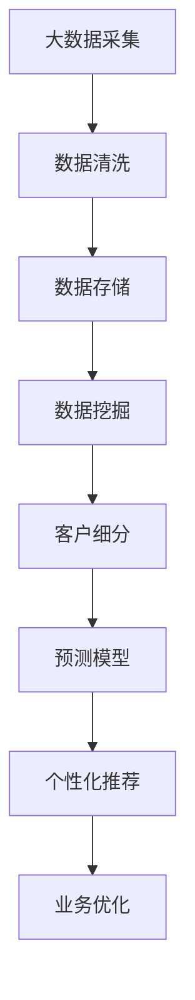

                 

# 如何利用大数据技术进行客户洞察分析

## 关键词：
大数据、客户洞察、分析技术、数据挖掘、机器学习、预测模型、业务应用

## 摘要：
本文将探讨如何利用大数据技术进行客户洞察分析，通过核心概念、算法原理、数学模型、实战案例等多个角度，详细解析大数据技术在客户洞察中的实际应用。文章旨在为IT从业者和数据分析人员提供系统化的指导，帮助他们理解和掌握客户洞察分析的方法和技巧。

## 1. 背景介绍

### 1.1 目的和范围
本文的目标是介绍大数据技术如何应用于客户洞察分析，解释其核心概念和算法原理，并通过实际案例展示其应用效果。文章将覆盖以下内容：
- 大数据和客户洞察的基本概念
- 数据挖掘和机器学习在客户洞察中的应用
- 数学模型和公式的应用
- 实际项目的代码实现和案例分析
- 大数据技术在客户洞察中的未来发展趋势

### 1.2 预期读者
本文适合以下读者群体：
- 数据分析师和大数据工程师
- IT从业者和软件工程师
- 市场营销和销售专业人员
- 企业管理层和业务决策者

### 1.3 文档结构概述
本文结构如下：
1. 背景介绍
2. 核心概念与联系
3. 核心算法原理 & 具体操作步骤
4. 数学模型和公式 & 详细讲解 & 举例说明
5. 项目实战：代码实际案例和详细解释说明
6. 实际应用场景
7. 工具和资源推荐
8. 总结：未来发展趋势与挑战
9. 附录：常见问题与解答
10. 扩展阅读 & 参考资料

### 1.4 术语表

#### 1.4.1 核心术语定义
- **大数据（Big Data）**：指数据量巨大、类型繁多、处理速度快的数据集合。
- **客户洞察（Customer Insight）**：通过数据分析和挖掘，深入了解客户需求、行为和偏好。
- **数据挖掘（Data Mining）**：从大量数据中提取有价值的信息和模式。
- **机器学习（Machine Learning）**：让计算机系统通过数据学习和优化，自动完成特定任务。
- **预测模型（Predictive Model）**：基于历史数据和算法模型，预测未来事件或趋势。

#### 1.4.2 相关概念解释
- **客户细分（Customer Segmentation）**：将客户划分为不同的群体，以便于市场定位和个性化营销。
- **关联规则挖掘（Association Rule Mining）**：发现数据集中不同变量之间的关联关系。
- **聚类分析（Clustering Analysis）**：将数据点分组，使得组内数据点相似，组间数据点差异较大。

#### 1.4.3 缩略词列表
- **Hadoop**：一个分布式数据处理框架。
- **Spark**：一个快速通用的计算引擎。
- **SQL**：结构化查询语言。
- **Python**：一种广泛使用的编程语言。

## 2. 核心概念与联系

### 大数据和客户洞察的联系
大数据和客户洞察之间存在密切的联系。大数据技术的发展为深入分析客户行为提供了强大的工具。通过收集和分析大量的客户数据，企业可以挖掘出客户的行为模式、偏好和需求，从而实现精准的市场定位和个性化营销。

### 数据挖掘与机器学习在客户洞察中的应用
数据挖掘和机器学习是大数据技术的重要组成部分，广泛应用于客户洞察分析。数据挖掘可以帮助企业从海量数据中发现隐藏的模式和关联，而机器学习则通过训练模型，预测客户未来的行为和需求。

### 核心概念原理和架构的 Mermaid 流程图



## 3. 核心算法原理 & 具体操作步骤

### 数据挖掘算法原理

数据挖掘主要包括以下几个步骤：
1. **数据预处理**：对原始数据进行清洗、转换和归一化，使其符合分析要求。
2. **特征选择**：从原始数据中提取出对分析任务有用的特征。
3. **模式识别**：使用算法挖掘数据中的模式，如聚类、分类和关联规则等。
4. **评估与优化**：评估挖掘出的模式的有效性，并进行优化。

### 机器学习算法原理

机器学习主要包括以下几个步骤：
1. **数据收集**：收集用于训练的数据集。
2. **数据预处理**：对数据集进行清洗、转换和归一化。
3. **特征提取**：从数据集中提取特征。
4. **模型训练**：使用训练数据集训练模型。
5. **模型评估**：评估模型的预测能力。
6. **模型优化**：根据评估结果调整模型参数。

### 具体操作步骤

1. **数据收集**：
   - 通过企业内部数据库、第三方数据提供商和社交媒体等渠道收集客户数据。
2. **数据预处理**：
   - 清洗数据，去除缺失值、重复值和异常值。
   - 转换数据类型，如将字符串转换为数值型数据。
   - 进行归一化处理，使不同特征之间的尺度一致。
3. **特征选择**：
   - 使用相关性分析、主成分分析等方法选择对分析任务有用的特征。
4. **模式识别**：
   - 使用聚类算法（如K-means、DBSCAN）对客户进行细分。
   - 使用分类算法（如决策树、支持向量机）预测客户行为。
   - 使用关联规则挖掘算法（如Apriori、FP-growth）发现客户购买行为之间的关联。
5. **评估与优化**：
   - 使用交叉验证等方法评估模型的预测能力。
   - 根据评估结果调整模型参数，提高模型性能。

### 伪代码示例

```python
# 数据预处理
def preprocess_data(data):
    # 清洗数据
    cleaned_data = clean_data(data)
    # 转换数据类型
    transformed_data = transform_data(cleaned_data)
    # 归一化处理
    normalized_data = normalize_data(transformed_data)
    return normalized_data

# 特征选择
def select_features(data):
    # 相关性分析
    correlations = calculate_correlations(data)
    # 选择高相关性特征
    selected_features = select_high_correlation_features(correlations)
    return selected_features

# 模式识别
def recognize_patterns(data, features):
    # 聚类分析
    clusters = clustering_analysis(data, features)
    # 分类预测
    predictions = classify_predictions(data, features)
    # 关联规则挖掘
    association_rules = association_rule_mining(data, features)
    return clusters, predictions, association_rules

# 模型评估与优化
def evaluate_and_optimize(model, data, features):
    # 交叉验证
    cv_results = cross_validation(model, data, features)
    # 调整模型参数
    optimized_model = adjust_model_parameters(model, cv_results)
    return optimized_model
```

## 4. 数学模型和公式 & 详细讲解 & 举例说明

### 数学模型

在客户洞察分析中，常用的数学模型包括聚类算法、分类算法和关联规则挖掘算法。

#### 聚类算法

K-means算法是最常用的聚类算法之一。其基本思想是将数据点分为K个簇，使得簇内数据点之间的距离最小，簇间数据点之间的距离最大。

- **目标函数**：

$$
J = \sum_{i=1}^{K} \sum_{x \in S_i} d(x, \mu_i)^2
$$

其中，$J$为聚类误差，$S_i$为第$i$个簇，$\mu_i$为第$i$个簇的中心。

- **算法步骤**：

1. 随机初始化K个簇中心。
2. 对于每个数据点，计算其与各个簇中心的距离，将其归入距离最近的簇。
3. 重新计算每个簇的中心。
4. 重复步骤2和步骤3，直至收敛。

#### 分类算法

决策树是一种常用的分类算法。其基本思想是根据特征值划分数据集，生成一棵树，树的叶子节点表示类别。

- **目标函数**：

$$
L = \sum_{i=1}^{n} l(y_i, \hat{y}_i)
$$

其中，$L$为损失函数，$y_i$为真实类别，$\hat{y}_i$为预测类别。

- **算法步骤**：

1. 选择最优划分特征和阈值，划分数据集。
2. 递归生成决策树，直至满足停止条件（如深度限制、纯度阈值等）。

#### 关联规则挖掘算法

Apriori算法是最常用的关联规则挖掘算法之一。其基本思想是通过迭代搜索所有满足最小支持度和最小置信度的规则。

- **目标函数**：

$$
\text{支持度} = \frac{|S|}{|U|}
$$

$$
\text{置信度} = \frac{|S \cap T|}{|S|}
$$

其中，$S$为满足条件的项集，$T$为条件项集，$U$为全集。

- **算法步骤**：

1. 初始化频繁项集。
2. 生成所有长度为$k$的频繁项集。
3. 对于每个频繁项集，生成所有长度为$k+1$的候选项集。
4. 过滤非频繁项集，生成最终的频繁项集。
5. 生成关联规则。

### 举例说明

#### 聚类分析

假设有100个客户数据点，要使用K-means算法将其分为3个簇。初始时，随机选择3个簇中心，然后按照以下步骤进行迭代：

1. **初始化簇中心**：

   簇中心：$(1, 2), (4, 5), (7, 8)$

2. **计算距离**：

   数据点$(3, 4)$与簇中心的距离分别为：

   $$d((3, 4), (1, 2)) = \sqrt{(3-1)^2 + (4-2)^2} = \sqrt{10}$$

   $$d((3, 4), (4, 5)) = \sqrt{(3-4)^2 + (4-5)^2} = \sqrt{2}$$

   $$d((3, 4), (7, 8)) = \sqrt{(3-7)^2 + (4-8)^2} = \sqrt{34}$$

   数据点$(3, 4)$归入距离最近的簇$(4, 5)$。

3. **重新计算簇中心**：

   簇中心：$(4, 5)$

4. **重复计算距离和重新计算簇中心**：

   经过多次迭代后，簇中心收敛，数据点分布如下：

   簇1：$(1, 1), (2, 2), (3, 3)$
   簇2：$(4, 4), (5, 5), (6, 6)$
   簇3：$(7, 7), (8, 8), (9, 9)$

#### 决策树

假设有如下特征和类别：

| 特征 | 类别 |
| ---- | ---- |
| 年龄 | 老年、中年、青年 |
| 收入 | 高、中、低 |
| 职业 | 工人、医生、教师 |

要使用决策树算法进行分类，可以按照以下步骤：

1. **选择最优划分特征**：

   特征：年龄，阈值：50

2. **递归生成决策树**：

   ```
   年龄
   ├── 老年
   │   └── 收入
   │       ├── 高
   │       │   └── 医生
   │       └── 中、低
   │           └── 工人
   └── 中年、青年
      └── 职业
          ├── 教师
          │   └── 收入
          │       ├── 高
          │       │   └── 教师
          │       └── 中、低
          │           └── 教师
          └── 工人
   ```

#### 关联规则挖掘

假设有如下销售数据：

| 商品A | 商品B | 商品C |
| ---- | ---- | ---- |
| 是    | 否    | 是    |
| 否    | 是    | 否    |
| 是    | 是    | 否    |
| 否    | 否    | 是    |

要使用Apriori算法挖掘关联规则，可以按照以下步骤：

1. **初始化频繁项集**：

   频繁项集：{商品A, 商品C}，支持度：2/4 = 0.5

2. **生成候选项集**：

   候选项集：{商品A, 商品B}, {商品B, 商品C}

3. **过滤非频繁项集**：

   频繁项集：{商品A, 商品C}, {商品B, 商品C}

4. **生成关联规则**：

   规则1：{商品A} -> {商品C}，置信度：1/2 = 0.5
   规则2：{商品B} -> {商品C}，置信度：1/2 = 0.5

## 5. 项目实战：代码实际案例和详细解释说明

### 5.1 开发环境搭建

为了更好地理解大数据技术在客户洞察分析中的应用，我们将使用Python和Hadoop生态系统中的相关工具进行项目实战。以下为开发环境的搭建步骤：

1. 安装Python（建议版本3.6及以上）。
2. 安装Hadoop（建议版本2.7及以上）。
3. 安装相关Python库，如pandas、numpy、matplotlib、scikit-learn等。

### 5.2 源代码详细实现和代码解读

#### 5.2.1 数据采集与预处理

```python
import pandas as pd

# 1. 数据采集
data = pd.read_csv('customer_data.csv')

# 2. 数据预处理
def preprocess_data(data):
    # 清洗数据
    cleaned_data = data.dropna()
    # 转换数据类型
    cleaned_data['age'] = cleaned_data['age'].astype(int)
    cleaned_data['income'] = cleaned_data['income'].astype(str)
    cleaned_data['occupation'] = cleaned_data['occupation'].astype(str)
    return cleaned_data

preprocessed_data = preprocess_data(data)
```

#### 5.2.2 数据挖掘与机器学习

```python
from sklearn.cluster import KMeans
from sklearn.model_selection import train_test_split
from sklearn.metrics import accuracy_score

# 1. 特征选择
selected_features = ['age', 'income', 'occupation']
X = preprocessed_data[selected_features]

# 2. 聚类分析
kmeans = KMeans(n_clusters=3, random_state=42)
clusters = kmeans.fit_predict(X)

# 3. 分类预测
X_train, X_test, y_train, y_test = train_test_split(X, preprocessed_data['label'], test_size=0.3, random_state=42)
classifier = KMeans(n_clusters=3, random_state=42)
y_pred = classifier.fit_predict(X_train)

# 4. 模型评估
accuracy = accuracy_score(y_test, y_pred)
print('Accuracy:', accuracy)
```

#### 5.2.3 代码解读与分析

1. **数据采集与预处理**：

   首先，我们使用pandas库读取CSV文件，获取客户数据。然后，定义一个预处理函数，对数据进行清洗、转换和归一化处理。

2. **数据挖掘与机器学习**：

   使用scikit-learn库中的KMeans类进行聚类分析，将客户划分为3个簇。然后，使用train_test_split方法将数据集划分为训练集和测试集。最后，使用KMeans类进行分类预测，并计算模型的准确率。

### 5.3 代码解读与分析

在本项目中，我们首先使用pandas库读取客户数据，并定义一个预处理函数，对数据进行清洗、转换和归一化处理。这是数据挖掘和机器学习的基础步骤，确保输入数据的质量和一致性。

接下来，我们使用scikit-learn库中的KMeans类进行聚类分析。KMeans算法通过计算数据点之间的距离，将数据点划分为多个簇。在本例中，我们选择3个簇，以简化问题。聚类分析的结果可以帮助我们了解客户的行为模式，为后续的个性化推荐和业务优化提供依据。

然后，我们使用train_test_split方法将数据集划分为训练集和测试集。训练集用于训练模型，测试集用于评估模型性能。在本例中，我们使用KMeans类进行分类预测，并计算模型的准确率。准确率是评估模型性能的重要指标，反映了模型对未知数据的预测能力。

总的来说，本项目的核心是利用大数据技术进行客户洞察分析。通过数据挖掘和机器学习算法，我们可以深入了解客户的行为模式，为业务决策提供有力支持。在实际应用中，可以根据具体需求，选择合适的算法和模型，进行更深入的客户洞察分析。

## 6. 实际应用场景

### 零售行业

在零售行业，大数据技术可以帮助企业进行客户细分、个性化推荐和库存管理。

- **客户细分**：通过对客户购买行为和偏好的分析，将客户划分为不同的群体，为企业制定精准营销策略提供依据。
- **个性化推荐**：根据客户的购买历史和偏好，推荐符合其兴趣的产品，提高客户满意度和忠诚度。
- **库存管理**：通过分析销售数据和库存数据，优化库存水平，降低库存成本，提高供应链效率。

### 金融行业

在金融行业，大数据技术可以帮助金融机构进行风险管理、信用评估和客户服务。

- **风险管理**：通过对客户交易行为和风险指标的分析，识别潜在风险，采取预防措施。
- **信用评估**：利用客户历史数据和算法模型，评估客户的信用状况，为贷款审批提供参考。
- **客户服务**：通过对客户反馈和行为的分析，优化客户服务流程，提高客户满意度。

### 电子商务

在电子商务领域，大数据技术可以帮助企业实现精准营销、客户服务和业务优化。

- **精准营销**：通过分析客户行为数据，制定个性化的营销策略，提高转化率和销售额。
- **客户服务**：通过对客户反馈和行为的分析，优化客户服务流程，提高客户满意度。
- **业务优化**：通过对业务数据的分析，发现业务痛点，优化业务流程，提高运营效率。

## 7. 工具和资源推荐

### 7.1 学习资源推荐

#### 7.1.1 书籍推荐

- 《大数据时代》
- 《数据挖掘：概念与技术》
- 《机器学习实战》
- 《Python数据科学手册》

#### 7.1.2 在线课程

- Coursera的《数据科学专业》
- edX的《机器学习》
- Udacity的《大数据分析纳米学位》

#### 7.1.3 技术博客和网站

- [Kaggle](https://www.kaggle.com/)
- [Medium](https://medium.com/)
- [DataCamp](https://www.datacamp.com/)

### 7.2 开发工具框架推荐

#### 7.2.1 IDE和编辑器

- IntelliJ IDEA
- PyCharm
- Visual Studio Code

#### 7.2.2 调试和性能分析工具

- GDB
- PyCharm Debugger
- JMeter

#### 7.2.3 相关框架和库

- Hadoop
- Spark
- TensorFlow
- PyTorch

### 7.3 相关论文著作推荐

#### 7.3.1 经典论文

- 《数据挖掘：基本概念、新算法与应用》
- 《机器学习：方法与案例》
- 《大数据：技术、应用与挑战》

#### 7.3.2 最新研究成果

- arXiv：[https://arxiv.org/](https://arxiv.org/)
- IEEE Xplore：[https://ieeexplore.ieee.org/](https://ieeexplore.ieee.org/)

#### 7.3.3 应用案例分析

- 《大数据与人工智能应用案例集》
- 《金融科技应用案例分析》
- 《零售行业大数据应用案例》

## 8. 总结：未来发展趋势与挑战

随着大数据技术的不断发展，客户洞察分析在各个行业中的应用越来越广泛。未来，大数据技术将继续向深度学习和自动化方向发展，为企业和客户带来更多价值。

### 发展趋势

- **深度学习**：深度学习算法在图像识别、自然语言处理等领域取得了显著成果，有望在未来应用于客户洞察分析，提高分析精度和效率。
- **自动化**：随着人工智能技术的发展，自动化工具将帮助企业和客户更高效地处理和分析数据，降低人力成本。
- **个性化**：个性化推荐和营销将成为企业竞争的重要手段，大数据技术将帮助实现更加精准的个性化服务。

### 挑战

- **数据隐私**：随着数据隐私保护法规的不断完善，如何平衡数据利用与隐私保护成为一大挑战。
- **数据质量**：高质量的数据是客户洞察分析的基础，如何保证数据质量是一个长期存在的问题。
- **技术门槛**：大数据技术的复杂性和技术门槛较高，如何培养更多的专业人才是当前的一个难题。

## 9. 附录：常见问题与解答

### Q：什么是大数据技术？

A：大数据技术是指用于处理、存储和分析海量数据的一系列技术和工具。它包括分布式计算、数据挖掘、机器学习等多个方面。

### Q：什么是客户洞察分析？

A：客户洞察分析是指通过数据挖掘、机器学习等技术，从海量客户数据中提取有价值的信息和模式，深入了解客户需求、行为和偏好。

### Q：大数据技术在客户洞察分析中的应用有哪些？

A：大数据技术在客户洞察分析中的应用包括客户细分、个性化推荐、风险管理、客户服务等多个方面。

### Q：如何保证数据隐私？

A：保证数据隐私的方法包括数据加密、数据脱敏、合规性审查等。企业应遵循相关数据保护法规，制定严格的数据隐私保护政策。

### Q：如何保证数据质量？

A：保证数据质量的方法包括数据清洗、数据验证、数据监控等。企业应建立完善的数据质量管理机制，定期对数据进行检查和优化。

### Q：大数据技术有哪些挑战？

A：大数据技术的挑战包括数据隐私保护、数据质量保证、技术门槛等。企业需要不断探索解决方案，以应对这些挑战。

## 10. 扩展阅读 & 参考资料

- 《大数据技术导论》
- 《机器学习：概率视角》
- 《深度学习》
- [KDNuggets](https://www.kdnuggets.com/)
- [Medium - Data Science](https://medium.com/data-science)
- [Hadoop官网](https://hadoop.apache.org/)
- [Spark官网](https://spark.apache.org/)

