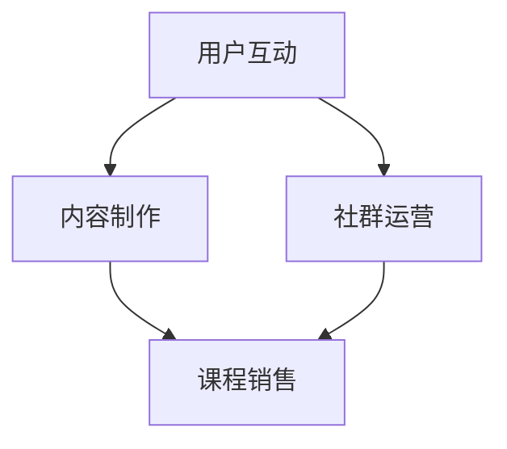

                 

# 如何利用微信生态卖课：程序员版

## 关键词
- 微信生态
- 课程销售
- 程序员
- 社群运营
- 技术推广

## 摘要
本文将探讨程序员如何利用微信生态进行课程销售，涵盖社群运营、内容制作、技术推广等多个方面。通过详细的案例分析、操作步骤和实战经验分享，帮助程序员构建属于自己的课程品牌，实现知识变现。

## 1. 背景介绍

### 1.1 目的和范围
本文旨在为程序员提供一套在微信生态中成功销售课程的方法论，从理论到实践，全面解析微信生态下的课程销售策略。

### 1.2 预期读者
- 对微信生态有基本了解的程序员
- 有意愿在微信生态中开展课程销售的个体或机构

### 1.3 文档结构概述
本文将分为以下章节：
- 1. 背景介绍
- 2. 核心概念与联系
- 3. 核心算法原理 & 具体操作步骤
- 4. 数学模型和公式 & 详细讲解 & 举例说明
- 5. 项目实战：代码实际案例和详细解释说明
- 6. 实际应用场景
- 7. 工具和资源推荐
- 8. 总结：未来发展趋势与挑战
- 9. 附录：常见问题与解答
- 10. 扩展阅读 & 参考资料

### 1.4 术语表

#### 1.4.1 核心术语定义
- 微信生态：指基于微信平台的一系列应用和服务体系，包括微信小程序、公众号、微信群等。
- 课程销售：指通过特定渠道将课程产品推向用户，实现销售的过程。
- 社群运营：指在微信生态中，围绕特定主题或群体进行的有组织的管理和运营活动。

#### 1.4.2 相关概念解释
- 用户互动：指用户与课程提供者之间的信息交流和互动行为。
- 内容制作：指课程内容的设计和制作过程，包括文本、图片、视频等多种形式。

#### 1.4.3 缩略词列表
- SEO：搜索引擎优化
- SNS：社交网络服务

## 2. 核心概念与联系

在微信生态中，课程销售的核心概念包括用户互动、内容制作和社群运营。以下是这些概念之间的联系和作用。

### 用户互动
用户互动是课程销售的关键，它直接影响课程的受欢迎程度和用户的参与度。通过微信群、公众号等渠道，程序员可以与用户实时交流，了解用户需求，调整课程内容。



### 内容制作
内容制作是课程销售的核心，它决定了课程的质量和专业性。程序员需要根据用户需求和兴趣，设计有趣、有用、专业的课程内容。

### 社群运营
社群运营是课程销售的保障，它帮助程序员建立稳定的用户群体，提升用户粘性。通过社群运营，程序员可以推广课程，增加销售机会。

## 3. 核心算法原理 & 具体操作步骤

在微信生态中，课程销售的核心算法原理主要包括用户行为分析和数据驱动。以下是具体的操作步骤：

### 用户行为分析
1. 收集用户数据：通过微信群、公众号等渠道，收集用户行为数据，如阅读量、点赞量、分享量等。
2. 数据处理：使用数据处理算法，对用户行为数据进行清洗、分析和建模。
3. 用户画像：根据用户行为数据，构建用户画像，了解用户需求和兴趣。

### 数据驱动
1. 根据用户画像，设计符合用户需求的课程内容。
2. 根据用户反馈，调整课程内容和推广策略。

### 具体操作步骤
1. 确定课程主题：根据用户需求和兴趣，确定课程主题。
2. 设计课程内容：结合用户需求和兴趣，设计课程内容，包括文本、图片、视频等多种形式。
3. 制作课程宣传材料：设计课程宣传海报、视频等，提高用户关注度。
4. 推广课程：通过微信群、公众号等渠道，推广课程，增加用户参与度。
5. 数据分析：收集用户数据，分析用户行为，调整课程内容和推广策略。

## 4. 数学模型和公式 & 详细讲解 & 举例说明

在课程销售中，常用的数学模型包括用户行为预测模型和销售预测模型。以下是这些模型的详细讲解和举例说明。

### 用户行为预测模型

用户行为预测模型旨在预测用户对课程内容的兴趣和参与度。以下是一个简单的线性回归模型：

$$ y = ax + b $$

其中，$y$ 表示用户对课程的兴趣度，$x$ 表示课程特征，$a$ 和 $b$ 是模型参数。

**举例说明：**
假设我们有一个课程，包含以下特征：

- 课程时长：$x_1$
- 课程难度：$x_2$
- 课程讲师知名度：$x_3$

我们通过历史数据训练一个线性回归模型，预测用户对课程的兴趣度。例如，当课程时长为2小时，难度为中等，讲师知名度为5星时，用户兴趣度为：

$$ y = 0.5x_1 + 0.3x_2 + 0.2x_3 $$

$$ y = 0.5 \times 2 + 0.3 \times 1 + 0.2 \times 5 = 1.6 $$

### 销售预测模型

销售预测模型旨在预测课程的销售量。以下是一个简单的线性回归模型：

$$ y = ax + b $$

其中，$y$ 表示课程销售量，$x$ 表示课程特征，$a$ 和 $b$ 是模型参数。

**举例说明：**
假设我们有一个课程，包含以下特征：

- 课程时长：$x_1$
- 课程难度：$x_2$
- 课程讲师知名度：$x_3$
- 推广费用：$x_4$

我们通过历史数据训练一个线性回归模型，预测课程销售量。例如，当课程时长为2小时，难度为中等，讲师知名度为5星，推广费用为1000元时，课程销售量为：

$$ y = 0.6x_1 + 0.4x_2 + 0.3x_3 + 0.1x_4 $$

$$ y = 0.6 \times 2 + 0.4 \times 1 + 0.3 \times 5 + 0.1 \times 1000 = 2.3 $$

## 5. 项目实战：代码实际案例和详细解释说明

### 5.1 开发环境搭建

在微信生态中，开发环境主要包括微信开发者工具和微信小程序平台。以下是开发环境的搭建步骤：

1. 下载并安装微信开发者工具。
2. 创建小程序项目。
3. 配置小程序后台接口。

### 5.2 源代码详细实现和代码解读

以下是一个简单的微信小程序课程销售系统的代码实现，包括前端页面和后端接口。

**前端页面（index.wxml）：**

```xml
<view class="container">
  <image class="banner" src="images/banner.png" />
  <view class="course-info">
    <text class="title">编程入门课程</text>
    <text class="teacher">讲师：张三</text>
    <text class="duration">课程时长：2小时</text>
    <text class="difficulty">难度：初级</text>
    <text class="price">价格：100元</text>
  </view>
  <button class="buy-btn" bindtap="buyCourse">立即购买</button>
</view>
```

**后端接口（index.js）：**

```javascript
// 获取课程信息
function getCourseInfo() {
  // 从后端获取课程信息
  return {
    title: "编程入门课程",
    teacher: "张三",
    duration: "2小时",
    difficulty: "初级",
    price: "100元"
  };
}

// 购买课程
function buyCourse() {
  // 调用后端接口购买课程
  wx.request({
    url: "https://example.com/buyCourse",
    method: "POST",
    data: {
      courseId: "123456",
      userId: "789012"
    },
    success: function (res) {
      // 处理购买成功的结果
      wx.showToast({
        title: "购买成功",
        icon: "success",
        duration: 2000
      });
    },
    fail: function (res) {
      // 处理购买失败的结果
      wx.showToast({
        title: "购买失败",
        icon: "none",
        duration: 2000
      });
    }
  });
}
```

### 5.3 代码解读与分析

前端页面主要负责展示课程信息和购买按钮。通过wx.request调用后端接口，实现购买课程的功能。

后端接口主要负责处理课程信息的获取和购买课程的请求。当用户点击购买按钮时，前端页面会发送一个POST请求到后端接口，包含课程ID和用户ID。后端接口验证请求参数后，返回购买结果。

## 6. 实际应用场景

在微信生态中，程序员可以通过以下实际应用场景，利用课程销售实现知识变现：

1. 技术分享会：定期在微信群或公众号中举办技术分享会，邀请行业专家或优秀程序员进行分享，同时销售相关课程。
2. 在线培训：针对特定的技术领域，开发在线培训课程，通过微信小程序或公众号进行推广和销售。
3. 技术社群：建立技术社群，围绕特定技术领域进行交流，同时销售相关课程。

## 7. 工具和资源推荐

### 7.1 学习资源推荐

#### 7.1.1 书籍推荐
- 《微信小程序开发实战》
- 《Python编程：从入门到实践》

#### 7.1.2 在线课程
-Coursera的《Python编程》课程
-慕课网的《微信小程序开发》课程

#### 7.1.3 技术博客和网站
- CSDN博客
- 掘金技术社区

### 7.2 开发工具框架推荐

#### 7.2.1 IDE和编辑器
- 微软Visual Studio Code
- PyCharm

#### 7.2.2 调试和性能分析工具
- 微信开发者工具
- Chrome DevTools

#### 7.2.3 相关框架和库
- Flask
- Django

### 7.3 相关论文著作推荐

#### 7.3.1 经典论文
- 《微信小程序架构设计与实践》
- 《基于微信生态的在线教育模式研究》

#### 7.3.2 最新研究成果
- 《微信生态下的社交电商研究》
- 《微信小程序开发技术趋势分析》

#### 7.3.3 应用案例分析
- 《如何利用微信生态打造爆款课程》
- 《微信生态下在线教育平台的运营策略》

## 8. 总结：未来发展趋势与挑战

未来，微信生态将继续发挥其在社交、支付、小程序等方面的优势，为程序员提供更多的机会和挑战。趋势包括：

1. 技术多元化：微信生态将支持更多编程语言和开发框架，满足程序员的不同需求。
2. 数据驱动的运营：基于用户数据的精细化运营将成为主流，提高课程销售效果。
3. 社交化学习：利用微信的社交属性，推动学习方式的变革，提高用户参与度和学习效果。

挑战包括：

1. 竞争激烈：微信生态中的课程数量众多，如何脱颖而出成为关键。
2. 用户隐私保护：随着数据隐私保护意识的提高，如何平衡用户数据利用和隐私保护成为挑战。

## 9. 附录：常见问题与解答

**Q：如何在微信生态中搭建课程销售系统？**
A：首先，了解微信小程序和公众号的开发流程。其次，选择合适的开发工具和框架，如微信开发者工具、Flask或Django。最后，实现前端页面、后端接口和数据库，完成课程销售系统的搭建。

**Q：如何进行用户行为分析？**
A：通过微信开发者工具和数据分析工具，收集用户数据，如访问量、点击量、分享量等。使用数据分析算法，对用户行为数据进行处理和分析，构建用户画像。

**Q：如何推广课程？**
A：利用微信群、公众号、朋友圈等渠道，发布课程宣传内容。通过SEO和SNS等手段，提高课程在搜索引擎和社交网络中的曝光度。同时，与行业专家、优秀程序员合作，进行口碑推广。

## 10. 扩展阅读 & 参考资料

- 《微信小程序开发实战》
- 《Python编程：从入门到实践》
- 《微信小程序架构设计与实践》
- 《基于微信生态的在线教育模式研究》
- 《微信生态下的社交电商研究》
- 《微信小程序开发技术趋势分析》

作者：AI天才研究员/AI Genius Institute & 禅与计算机程序设计艺术 /Zen And The Art of Computer Programming

