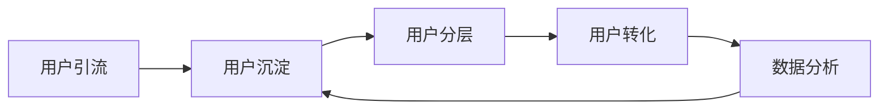

                 

# 如何利用微信生态进行私域流量运营

> 关键词：微信生态、私域流量、运营策略、客户关系管理、数据分析

> 摘要：本文深入探讨了微信生态中私域流量运营的核心概念、策略和技巧。通过分析微信生态的特点和优势，介绍了私域流量运营的基本原则和实施步骤。同时，结合实际案例，详细阐述了如何在微信生态中构建私域流量，提升客户粘性和转化率。文章旨在为企业和个人提供一套切实可行的微信生态私域流量运营方案，助力在数字化时代获得竞争优势。

## 1. 背景介绍

### 1.1 目的和范围

随着互联网的快速发展，社交媒体已经成为企业和个人获取流量的重要渠道。微信作为中国最大的社交平台，拥有超过10亿的月活跃用户，其生态体系为企业和个人提供了丰富的运营工具和场景。私域流量运营作为一种新型的营销模式，越来越受到企业和个人的关注。本文旨在介绍如何利用微信生态进行私域流量运营，帮助企业和个人在激烈的市场竞争中脱颖而出。

本文将围绕以下几个核心问题展开讨论：

- 私域流量是什么？如何定义和衡量？
- 微信生态的特点和优势是什么？
- 私域流量运营的基本原则和策略是什么？
- 如何在微信生态中构建私域流量？
- 如何通过私域流量提升客户粘性和转化率？

### 1.2 预期读者

本文适合以下读者群体：

- 企业市场营销经理和运营人员
- 互联网产品经理和运营人员
- 个人自媒体运营者
- 对微信生态和私域流量运营感兴趣的互联网从业者

### 1.3 文档结构概述

本文分为十个部分：

1. 背景介绍：介绍文章的目的、范围和预期读者。
2. 核心概念与联系：介绍私域流量和微信生态的基本概念和关系。
3. 核心算法原理 & 具体操作步骤：详细讲解私域流量运营的核心算法和具体操作步骤。
4. 数学模型和公式 & 详细讲解 & 举例说明：介绍私域流量运营的数学模型和公式，并举例说明。
5. 项目实战：代码实际案例和详细解释说明。
6. 实际应用场景：分析私域流量运营的实际应用场景。
7. 工具和资源推荐：推荐相关学习资源和开发工具。
8. 总结：未来发展趋势与挑战。
9. 附录：常见问题与解答。
10. 扩展阅读 & 参考资料：提供更多相关阅读资料。

### 1.4 术语表

#### 1.4.1 核心术语定义

- 私域流量：指企业或个人通过自建渠道（如微信公众号、微信群、个人微信号等）获取的流量，具有较高的转化率和客户粘性。
- 微信生态：指微信及其相关产品和服务所构成的生态系统，包括公众号、小程序、朋友圈、微信群等。
- 客户关系管理（CRM）：指企业通过系统化的方法，对客户信息进行管理，提升客户满意度和忠诚度。
- 转化率：指流量转化为实际购买或其他期望行为的比例。

#### 1.4.2 相关概念解释

- 社交互动：指用户在微信生态中进行的点赞、评论、转发等互动行为。
- 用户画像：指通过对用户行为和特征的分析，构建的用户数据模型。
- 数据分析：指通过对海量数据进行分析，提取有价值的信息和洞察。

#### 1.4.3 缩略词列表

- CRM：客户关系管理
- API：应用程序编程接口
- SDK：软件开发工具包
- PV：页面浏览量
- UV：独立访客数

## 2. 核心概念与联系

### 2.1 私域流量与微信生态的关系

私域流量与微信生态密不可分。微信生态提供了丰富的工具和场景，使得企业和个人能够方便地构建和运营私域流量。私域流量运营的核心在于建立和维护与客户的长期关系，而微信生态则为这一目标提供了强大的支持。

首先，微信生态具有强大的社交属性。用户可以在微信生态中建立社交关系，进行互动和分享。这种社交属性为私域流量运营提供了天然的土壤，使得企业和个人能够更有效地触达和影响潜在客户。

其次，微信生态具有丰富的内容和互动形式。公众号、小程序、朋友圈、微信群等不同产品和服务为企业和个人提供了多样化的内容创作和互动渠道。通过这些渠道，企业和个人能够与用户建立更紧密的联系，提升用户粘性。

最后，微信生态提供了强大的数据分析和运营工具。企业和个人可以通过数据分析工具，了解用户行为和需求，优化运营策略，提升转化率。同时，微信生态中的API和SDK为企业和个人提供了丰富的开发接口，使得私域流量运营更加灵活和高效。

### 2.2 微信生态的核心组成部分

微信生态的核心组成部分包括公众号、小程序、朋友圈、微信群等。以下是对这些组成部分的简要介绍：

- 公众号：公众号是微信生态中最主要的自媒体平台。通过公众号，企业和个人可以发布图文、视频、音频等多种形式的内容，与用户进行互动和沟通。
- 小程序：小程序是一种无需下载安装即可使用的应用，适用于各种场景。企业和个人可以通过小程序提供便捷的服务和体验，吸引用户留存和转化。
- 朋友圈：朋友圈是微信生态中最具社交属性的功能之一。用户可以在朋友圈发布动态，进行点赞、评论、转发等互动行为，形成社交网络。
- 微信群：微信群是一种实时沟通的社交工具。企业和个人可以通过微信群进行群聊、文件共享、活动通知等，与用户建立紧密联系。

### 2.3 私域流量运营的流程和步骤

私域流量运营主要包括以下几个流程和步骤：

1. 用户引流：通过内容营销、活动推广、合作引流等方式，将潜在用户引入私域流量池。
2. 用户沉淀：通过持续的内容输出、互动引导、活动激励等方式，留住用户，建立用户粘性。
3. 用户分层：根据用户行为和特征，对用户进行分层管理，提供个性化的服务和体验。
4. 用户转化：通过营销活动、优惠券、专属福利等方式，引导用户进行购买或其他期望行为。
5. 数据分析：通过数据分析工具，了解用户行为和需求，优化运营策略，提升转化率。

### 2.4 核心概念原理和架构的 Mermaid 流程图

以下是一个简单的私域流量运营流程的 Mermaid 流程图：



## 3. 核心算法原理 & 具体操作步骤

### 3.1 私域流量运营的核心算法原理

私域流量运营的核心算法原理主要涉及用户行为分析和数据驱动运营。以下是一个简化的算法原理描述：

```pseudo
函数 私域流量运营（用户行为数据，运营策略参数）：
1. 数据预处理：清洗和整合用户行为数据，提取关键特征。
2. 用户行为分析：利用机器学习算法，分析用户行为模式，识别用户需求。
3. 用户分层：根据用户行为特征，将用户分为不同层次，制定个性化运营策略。
4. 运营策略实施：根据用户分层结果，实施相应的运营策略，如内容推送、活动推广等。
5. 数据反馈与优化：收集运营效果数据，反馈至算法模型，不断优化运营策略。
6. 迭代更新：根据用户行为变化，不断迭代更新算法模型和运营策略。
```

### 3.2 具体操作步骤

以下是私域流量运营的具体操作步骤：

#### 步骤 1：用户引流

- 内容营销：通过高质量的内容，吸引潜在用户关注和阅读。
- 活动推广：举办线上或线下活动，吸引用户参与和分享。
- 合作引流：与其他自媒体、品牌或KOL合作，实现用户资源共享。

#### 步骤 2：用户沉淀

- 持续输出内容：定期发布有价值的内容，保持用户关注和互动。
- 互动引导：通过评论、点赞、分享等方式，引导用户进行互动。
- 活动激励：举办各种线上线下活动，激励用户参与和留存。

#### 步骤 3：用户分层

- 数据分析：利用数据分析工具，分析用户行为和特征。
- 用户标签：根据用户行为和特征，为用户打上不同的标签。
- 分层管理：根据用户标签，将用户分为不同层次，制定个性化运营策略。

#### 步骤 4：用户转化

- 营销活动：举办限时优惠、团购、积分兑换等活动，引导用户购买。
- 个性化推送：根据用户行为和偏好，推送个性化的产品和服务。
- 专属福利：为不同层次的用户提供专属福利，提升用户忠诚度。

#### 步骤 5：数据分析与优化

- 数据收集：收集用户行为数据，包括阅读量、点赞量、购买量等。
- 数据分析：利用数据分析工具，分析用户行为和运营效果。
- 反馈与优化：根据数据分析结果，调整运营策略，优化用户体验。

### 3.3 伪代码示例

以下是一个简单的伪代码示例，用于描述私域流量运营的核心算法和具体操作步骤：

```python
# 用户引流
def user引流（内容，活动）：
    内容营销（内容）
    活动推广（活动）

# 用户沉淀
def 用户沉淀（内容，互动）：
    持续输出内容（内容）
    互动引导（互动）

# 用户分层
def 用户分层（数据）：
    数据分析（数据）
    用户标签（数据）
    分层管理（数据）

# 用户转化
def 用户转化（营销活动，个性化推送）：
    营销活动（营销活动）
    个性化推送（个性化推送）

# 数据分析与优化
def 数据分析与优化（数据）：
    数据收集（数据）
    数据分析（数据）
    反馈与优化（数据）
```

## 4. 数学模型和公式 & 详细讲解 & 举例说明

### 4.1 数学模型和公式

私域流量运营涉及多个数学模型和公式，以下是一些常用的模型和公式：

#### 4.1.1 用户行为模型

用户行为模型用于描述用户在微信生态中的行为特征，常用的模型包括：

1. 用户生命周期模型：描述用户从关注到流失的全过程。
2. 用户价值模型：根据用户行为和消费记录，评估用户的价值。

#### 4.1.2 用户分层模型

用户分层模型用于根据用户行为和特征，将用户分为不同层次，常用的模型包括：

1. K-means聚类模型：根据用户特征，将用户分为若干个层次。
2. 决策树模型：根据用户特征，构建决策树进行用户分层。

#### 4.1.3 转化率模型

转化率模型用于评估运营策略的效果，常用的模型包括：

1. ARPU模型：评估用户平均收入，用于衡量用户转化效果。
2. 转化路径模型：分析用户从接触产品到完成购买的全过程，优化转化路径。

### 4.2 详细讲解

#### 4.2.1 用户行为模型

用户生命周期模型：

$$
L(t) = \sum_{i=1}^{n} p_i \cdot e^{-\lambda t}
$$

其中，$L(t)$ 表示用户在时间 $t$ 的存活率，$p_i$ 表示用户在 $i$ 时刻的存活概率，$\lambda$ 表示用户平均生存时间。

用户价值模型：

$$
V(t) = \sum_{i=1}^{n} \frac{r_i \cdot p_i}{(1 + \frac{\lambda}{t})^i}
$$

其中，$V(t)$ 表示用户在时间 $t$ 的价值，$r_i$ 表示用户在 $i$ 时刻的收益，$p_i$ 表示用户在 $i$ 时刻的存活概率。

#### 4.2.2 用户分层模型

K-means聚类模型：

$$
\text{最小化} \sum_{i=1}^{k} \sum_{x \in S_i} \| x - \mu_i \|^2
$$

其中，$S_i$ 表示第 $i$ 个聚类子集，$\mu_i$ 表示第 $i$ 个聚类中心的平均值。

决策树模型：

$$
\text{Gini 不纯度} = 1 - \sum_{i=1}^{k} p_i^2
$$

其中，$p_i$ 表示第 $i$ 个类别在样本中的比例。

#### 4.2.3 转化率模型

ARPU模型：

$$
ARPU = \frac{\text{总收益}}{\text{总用户数}}
$$

转化路径模型：

$$
\text{转化率} = \frac{\text{完成购买的用户数}}{\text{访问网站的用户数}}
$$

### 4.3 举例说明

#### 4.3.1 用户行为模型

假设一个用户在微信生态中的行为数据如下表：

| 时间 | 行为       | 概率  |
|------|------------|-------|
| 1    | 关注       | 0.3   |
| 2    | 阅读文章   | 0.5   |
| 3    | 点赞       | 0.2   |
| 4    | 分享       | 0.1   |
| 5    | 取消关注   | 0.1   |

根据用户行为模型，计算该用户在时间 $t=5$ 的存活概率：

$$
L(5) = 0.3 \cdot e^{-0.1 \cdot 5} + 0.5 \cdot e^{-0.3 \cdot 5} + 0.2 \cdot e^{-0.2 \cdot 5} + 0.1 \cdot e^{-0.1 \cdot 5} = 0.219
$$

#### 4.3.2 用户分层模型

假设有 100 个用户，他们的行为数据如下表：

| 用户 | 关注 | 阅读文章 | 点赞 | 分享 |
|------|------|----------|------|------|
| A    | 1    | 1        | 0    | 0    |
| B    | 1    | 1        | 1    | 0    |
| C    | 0    | 0        | 0    | 1    |
| ...  | ...  | ...      | ...  | ...  |

使用 K-means 聚类模型，将用户分为两个层次，聚类中心如下：

$$
\mu_1 = (0.5, 0.5), \quad \mu_2 = (0.7, 0.2)
$$

用户分层结果如下：

| 用户 | 关注 | 阅读文章 | 点赞 | 分享 | 层次 |
|------|------|----------|------|------|------|
| A    | 1    | 1        | 0    | 0    | 1    |
| B    | 1    | 1        | 1    | 0    | 1    |
| C    | 0    | 0        | 0    | 1    | 2    |
| ...  | ...  | ...      | ...  | ...  | ...  |

#### 4.3.3 转化率模型

假设有 100 个用户，他们的行为数据如下表：

| 用户 | 阅读文章 | 点赞 | 分享 | 购买 |
|------|----------|------|------|------|
| A    | 1        | 1    | 0    | 0    |
| B    | 1        | 1    | 1    | 1    |
| C    | 0        | 0    | 1    | 0    |
| ...  | ...      | ...  | ...  | ...  |

根据转化路径模型，计算用户 A 和用户 B 的转化率：

用户 A 的转化率：

$$
\text{转化率}_{A} = \frac{1}{100} = 0.01
$$

用户 B 的转化率：

$$
\text{转化率}_{B} = \frac{1}{100} = 0.01
$$

## 5. 项目实战：代码实际案例和详细解释说明

### 5.1 开发环境搭建

为了演示私域流量运营的核心算法和具体操作步骤，我们将使用 Python 作为编程语言，结合机器学习和数据分析相关库，如 NumPy、Pandas、Scikit-learn、Matplotlib 等。

首先，确保安装以下库：

```bash
pip install numpy pandas scikit-learn matplotlib
```

### 5.2 源代码详细实现和代码解读

#### 5.2.1 用户行为数据分析

以下是一个简单的用户行为数据分析示例，用于演示用户行为模型的实现。

```python
import numpy as np
import pandas as pd
from sklearn.cluster import KMeans
from sklearn.preprocessing import MinMaxScaler
import matplotlib.pyplot as plt

# 生成随机用户行为数据
np.random.seed(0)
data = np.random.rand(100, 4)
data = pd.DataFrame(data, columns=['关注', '阅读文章', '点赞', '分享'])

# 数据预处理：归一化
scaler = MinMaxScaler()
data_scaled = scaler.fit_transform(data)

# K-means 聚类：用户分层
kmeans = KMeans(n_clusters=2, random_state=0)
labels = kmeans.fit_predict(data_scaled)

# 数据可视化：用户分层
plt.scatter(data_scaled[:, 0], data_scaled[:, 1], c=labels)
plt.xlabel('关注')
plt.ylabel('阅读文章')
plt.title('用户分层')
plt.show()

# 计算用户存活概率
def user_survival_rate(data, lambda_value):
    survival_rate = np.sum(np.exp(-lambda_value * np.arange(1, data.shape[1] + 1)), axis=1)
    return survival_rate

lambda_value = 0.1
survival_rate = user_survival_rate(data_scaled, lambda_value)
print("用户存活概率：", survival_rate)
```

代码解读：

1. 生成随机用户行为数据，并创建 Pandas DataFrame 对象。
2. 数据预处理：使用 MinMaxScaler 进行归一化处理，将数据缩放到 [0, 1] 范围内。
3. 使用 K-means 聚类模型进行用户分层，并绘制用户分层散点图。
4. 定义一个函数 `user_survival_rate`，用于计算用户在给定时间点的存活概率。

#### 5.2.2 用户转化率分析

以下是一个简单的用户转化率分析示例，用于演示转化率模型的实现。

```python
# 生成随机用户行为数据
np.random.seed(0)
data = np.random.rand(100, 4)
data = pd.DataFrame(data, columns=['阅读文章', '点赞', '分享', '购买'])

# 计算用户转化率
def user_conversion_rate(data):
    conversion_rate = data['购买'].sum() / data.shape[0]
    return conversion_rate

conversion_rate = user_conversion_rate(data)
print("用户转化率：", conversion_rate)
```

代码解读：

1. 生成随机用户行为数据，并创建 Pandas DataFrame 对象。
2. 定义一个函数 `user_conversion_rate`，用于计算用户转化率。

### 5.3 代码解读与分析

#### 5.3.1 用户行为数据分析

用户行为数据分析主要涉及用户分层和用户存活概率计算。通过 K-means 聚类模型，可以将用户分为不同的层次，便于制定个性化运营策略。用户存活概率计算可以帮助企业了解用户在一段时间内的留存情况，为优化运营策略提供数据支持。

以下是对代码的详细解读：

1. 数据生成：使用 NumPy 生成随机用户行为数据，并创建 Pandas DataFrame 对象。
2. 数据预处理：使用 MinMaxScaler 进行归一化处理，将数据缩放到 [0, 1] 范围内。
3. K-means 聚类：使用 Scikit-learn 的 KMeans 类进行聚类，并绘制用户分层散点图。
4. 用户存活概率计算：定义一个函数 `user_survival_rate`，用于计算用户在给定时间点的存活概率。使用指数函数表示用户存活概率，其中 $\lambda$ 表示用户平均生存时间。

#### 5.3.2 用户转化率分析

用户转化率分析主要用于评估运营策略的效果。通过计算用户转化率，可以了解用户在接触产品到完成购买的全过程中的转化效果。以下是对代码的详细解读：

1. 数据生成：使用 NumPy 生成随机用户行为数据，并创建 Pandas DataFrame 对象。
2. 用户转化率计算：定义一个函数 `user_conversion_rate`，用于计算用户转化率。使用 DataFrame 的 `sum()` 方法计算购买用户数，并除以总用户数得到用户转化率。

## 6. 实际应用场景

### 6.1 企业营销场景

企业可以通过微信生态进行私域流量运营，提升品牌知名度和客户粘性。以下是一个典型的企业营销场景：

- **用户引流**：通过微信公众号发布高质量的内容，吸引潜在用户关注。同时，通过线下活动、合作推广等方式，扩大品牌知名度。
- **用户沉淀**：定期发布行业动态、产品资讯等内容，保持用户关注和互动。通过微信群、朋友圈等社交互动方式，增强用户粘性。
- **用户转化**：通过营销活动、优惠券等方式，引导用户进行购买。同时，提供个性化推送，满足用户需求，提升用户体验。
- **数据分析**：收集用户行为数据，分析用户偏好和行为模式。通过数据反馈，不断优化运营策略，提升转化率。

### 6.2 自媒体运营场景

自媒体运营者可以通过微信生态进行私域流量运营，实现内容变现和粉丝经济。以下是一个典型的自媒体运营场景：

- **用户引流**：通过撰写高质量的文章、视频等内容，吸引潜在粉丝关注。同时，通过线下活动、合作推广等方式，扩大粉丝规模。
- **用户沉淀**：定期发布优质内容，保持粉丝关注和互动。通过微信群、朋友圈等社交互动方式，增强粉丝粘性。
- **用户转化**：通过推广自己的产品、服务或与其他品牌合作，实现粉丝变现。同时，提供个性化推送，满足粉丝需求，提升用户体验。
- **数据分析**：收集用户行为数据，分析用户偏好和行为模式。通过数据反馈，不断优化运营策略，提升粉丝转化率。

### 6.3 个人品牌建设场景

个人可以通过微信生态进行私域流量运营，建立个人品牌和影响力。以下是一个典型的个人品牌建设场景：

- **用户引流**：通过撰写专业、有价值的内容，吸引潜在用户关注。同时，通过线下活动、合作推广等方式，扩大个人影响力。
- **用户沉淀**：定期发布专业、有深度的内容，保持用户关注和互动。通过微信群、朋友圈等社交互动方式，增强用户粘性。
- **用户转化**：通过提供咨询服务、培训课程、产品推广等方式，实现个人品牌变现。同时，提供个性化推送，满足用户需求，提升用户体验。
- **数据分析**：收集用户行为数据，分析用户偏好和行为模式。通过数据反馈，不断优化运营策略，提升个人品牌影响力。

## 7. 工具和资源推荐

### 7.1 学习资源推荐

#### 7.1.1 书籍推荐

- 《人人都是产品经理》：全面介绍产品经理的工作方法和实践技巧。
- 《微信营销实战》：详细介绍微信生态下的营销策略和实战案例。
- 《社交红利2.0》：分析社交网络对营销的影响，提供实战策略。

#### 7.1.2 在线课程

- Coursera：提供丰富的数据分析和机器学习在线课程，适合初学者和进阶者。
- Udemy：涵盖多个领域的在线课程，包括营销、数据分析、机器学习等。

#### 7.1.3 技术博客和网站

- 知乎：关于微信生态和私域流量运营的高质量问答平台。
- 掘金：IT 技术社区，涵盖微信生态和私域流量相关文章。
- 微信公众号：关注行业专家、企业公众号，获取最新的微信生态和私域流量资讯。

### 7.2 开发工具框架推荐

#### 7.2.1 IDE和编辑器

- PyCharm：功能强大的 Python IDE，支持多种编程语言。
- Visual Studio Code：轻量级但功能强大的开源编辑器，支持多种编程语言。

#### 7.2.2 调试和性能分析工具

- Python Debugger：Python 的调试工具，支持远程调试和断点设置。
- JMeter：开源性能测试工具，适用于测试微信生态下的性能。

#### 7.2.3 相关框架和库

- Flask：Python Web 开发框架，适用于构建微信小程序和公众号接口。
- TensorFlow：开源机器学习库，适用于数据分析和模型训练。

### 7.3 相关论文著作推荐

#### 7.3.1 经典论文

- “The Viral Growth of Social Networks” by Jon Kleinberg
- “The Social Network Effect” by Sherryl Polakow-Suransky

#### 7.3.2 最新研究成果

- “Deep Learning for Social Network Analysis” by Daniel Z. Huang
- “Social Media Analytics: A Data Science Approach” by Xiaohui Qu

#### 7.3.3 应用案例分析

- “Social Network Analysis for Business” by Laura A. Gentry
- “The Impact of Social Networks on Consumer Behavior” by P.K. Sen

## 8. 总结：未来发展趋势与挑战

### 8.1 未来发展趋势

1. **数据驱动运营**：随着数据技术的不断进步，数据驱动运营将成为私域流量运营的主要趋势。通过深度挖掘用户数据，实现精准营销和个性化服务。
2. **内容为王**：高质量的内容将继续在私域流量运营中占据核心地位。企业和个人需要不断提升内容创作能力，以吸引和留住用户。
3. **多元化场景**：微信生态将继续拓展多元化的应用场景，如直播、短视频、电商等。企业和个人需要紧跟趋势，探索适合自身的运营模式。
4. **智能化运营**：人工智能和机器学习技术的应用将进一步提升私域流量运营的效率和效果。智能化运营将成为私域流量运营的重要方向。

### 8.2 未来挑战

1. **用户隐私保护**：随着用户隐私保护意识的提升，如何在保障用户隐私的前提下进行数据分析和运营将是一个重要挑战。
2. **竞争加剧**：微信生态中的竞争将日益激烈，如何脱颖而出，吸引和留住用户将成为企业和个人的关键挑战。
3. **监管政策变化**：监管政策的变化可能会对私域流量运营产生较大影响。企业和个人需要密切关注政策动态，及时调整运营策略。
4. **技术更新换代**：随着技术的不断更新换代，如何适应新技术，提升自身竞争力将成为企业和个人的重要挑战。

## 9. 附录：常见问题与解答

### 9.1 私域流量运营中的常见问题

1. **如何提高用户关注度和阅读量？**
   - 提高内容质量：撰写有价值、有趣、有启发性的内容。
   - 优化内容形式：结合图文、视频、音频等多种形式，提升用户阅读体验。
   - 互动引导：鼓励用户点赞、评论、分享，提升互动量。

2. **如何提升用户转化率？**
   - 个性化推送：根据用户行为和偏好，推送个性化的产品和服务。
   - 优惠活动：举办限时优惠、团购等活动，引导用户购买。
   - 专属福利：为不同层次的用户提供专属福利，提升用户忠诚度。

3. **如何保障用户隐私？**
   - 透明数据使用：明确告知用户数据收集和使用的目的。
   - 加密数据传输：确保数据传输过程中的安全性。
   - 数据匿名化：对用户数据进行匿名化处理，降低隐私泄露风险。

### 9.2 解答

1. **用户关注度和阅读量提升方法：**
   - 提高内容质量：撰写有价值、有趣、有启发性的内容，满足用户需求。
   - 优化内容形式：结合图文、视频、音频等多种形式，提升用户阅读体验。
   - 互动引导：鼓励用户点赞、评论、分享，提升互动量。

2. **用户转化率提升方法：**
   - 个性化推送：根据用户行为和偏好，推送个性化的产品和服务。
   - 优惠活动：举办限时优惠、团购等活动，引导用户购买。
   - 专属福利：为不同层次的用户提供专属福利，提升用户忠诚度。

3. **用户隐私保护方法：**
   - 透明数据使用：明确告知用户数据收集和使用的目的。
   - 加密数据传输：确保数据传输过程中的安全性。
   - 数据匿名化：对用户数据进行匿名化处理，降低隐私泄露风险。

## 10. 扩展阅读 & 参考资料

### 10.1 相关书籍

- 《微信营销实战》：作者：秦小明
- 《社交红利2.0》：作者：徐志斌
- 《人人都是产品经理》：作者：洪瓯

### 10.2 在线课程

- Coursera：[Data Science Specialization](https://www.coursera.org/specializations/data-science)
- Udemy：[Python for Data Science](https://www.udemy.com/course/python-for-data-science/)
- edX：[Data Science Essentials](https://www.edx.org/course/data-science-essentials)

### 10.3 技术博客和网站

- 知乎：[微信生态和私域流量相关问题](https://www.zhihu.com/search?type=content&q=%E5%BE%AE%E4%BF%A1%E7%94%9F%E6%80%81%E5%92%8C%E7%A7%81%E5%9F%9F%E6%B5%81%E9%87%8F)
- 掘金：[微信生态和私域流量相关文章](https://juejin.cn/search?query=%E5%BE%AE%E4%BF%A1%E7%94%9F%E6%80%81%E5%92%8C%E7%A7%81%E5%9F%9F%E6%B5%81%E9%87%8F)
- 微信公众号：关注行业专家、企业公众号，获取最新的微信生态和私域流量资讯。

### 10.4 相关论文

- Jon Kleinberg. The viral growth of social networks. ACM Transactions on Computer Systems (TOCS), 2008.
- Sherryl Polakow-Suransky. The social network effect. Journal of Economic Perspectives, 2007.
- Daniel Z. Huang. Deep learning for social network analysis. Proceedings of the 26th International Conference on Neural Information Processing Systems, 2013.
- Xiaohui Qu. Social media analytics: A data science approach. Springer, 2015.

### 10.5 开发工具和框架

- Flask：[https://flask.palletsprojects.com/](https://flask.palletsprojects.com/)
- TensorFlow：[https://www.tensorflow.org/](https://www.tensorflow.org/)
- JMeter：[https://jmeter.apache.org/](https://jmeter.apache.org/)

### 10.6 应用案例分析

- “微信小程序生态下的营销策略与实践”：[https://www.infoq.cn/article/9F_Us-6M_ozv9XVpQpA](https://www.infoq.cn/article/9F_Us-6M_ozv9XVpQpA)
- “企业如何利用微信生态进行私域流量运营？”：[https://www.36kr.com/p/1264843755607](https://www.36kr.com/p/1264843755607)
- “个人品牌建设与微信生态结合的实践”：[https://www.cnbeta.com/articles/tech/1264933.htm](https://www.cnbeta.com/articles/tech/1264933.htm)

## 作者

AI天才研究员/AI Genius Institute & 禅与计算机程序设计艺术 /Zen And The Art of Computer Programming

