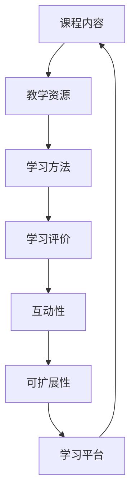

                 

# 如何利用技术能力创建在线课程

> 关键词：在线课程、技术能力、教育技术、课程设计、教学资源、学习平台

> 摘要：本文将深入探讨如何利用技术能力创建在线课程。我们将从背景介绍、核心概念、算法原理、数学模型、项目实战、实际应用场景等方面，详细解析在线课程制作的流程和要点。通过本文的阅读，您将了解到如何运用技术手段提升课程质量，打造出富有吸引力和互动性的在线课程。

## 1. 背景介绍

### 1.1 目的和范围

本文旨在为那些想要利用技术能力创建在线课程的个人或教育机构提供一整套策略和方法。我们将探讨在线课程设计的核心概念、技术原理、实施步骤以及实际应用场景。此外，我们还将推荐一些优秀的工具和资源，帮助您更好地进行课程开发。

### 1.2 预期读者

- 教育技术从业者
- 在线教育课程设计师
- 大学教师和教育研究人员
- 想要开发在线课程的个人

### 1.3 文档结构概述

本文分为十个部分，包括背景介绍、核心概念与联系、核心算法原理、数学模型和公式、项目实战、实际应用场景、工具和资源推荐、总结、附录以及扩展阅读。每个部分都旨在提供详细的指导和案例分析，帮助您更好地理解和实施在线课程设计。

### 1.4 术语表

#### 1.4.1 核心术语定义

- **在线课程**：通过网络平台提供的学习资源，包括视频讲座、文档资料、互动练习等。
- **教育技术**：利用信息技术促进教学和学习的过程。
- **课程设计**：制定课程大纲、课程内容、教学方法、教学评价等的过程。
- **学习平台**：提供在线课程学习和管理功能的网络平台。

#### 1.4.2 相关概念解释

- **互动性**：课程设计中的一个关键要素，旨在提高学生的参与度和积极性。
- **可扩展性**：在线课程设计中的一个重要指标，指的是课程能够适应不同学习需求和场景的能力。
- **教学资源**：包括视频、文档、PPT、习题库等用于教学活动的素材。

#### 1.4.3 缩略词列表

- **LMS**：学习管理系统（Learning Management System）
- **MOOC**：大规模开放在线课程（Massive Open Online Course）
- **SPOC**：小规模限制性在线课程（Small Private Online Course）

## 2. 核心概念与联系

在线课程的核心概念涉及教学内容的结构化、学习资源的整合、教学方法的创新以及学习评价的多样化。下面是一个简单的 Mermaid 流程图，展示了在线课程的核心概念和联系。



### 2.1 课程内容结构

课程内容是在线课程的核心，通常包括以下结构：

- **课程概述**：介绍课程的背景、目标和预期成果。
- **课程大纲**：列出课程的所有模块和主题。
- **教学视频**：讲解课程内容的视频讲座。
- **文档资料**：包括PPT、讲义、参考文献等。
- **习题库**：用于测试学生掌握课程内容的练习。

### 2.2 教学资源整合

教学资源的整合是课程质量的重要保证，需要考虑以下因素：

- **多媒体资源**：包括视频、音频、图片、动画等多媒体素材。
- **互动资源**：如论坛、讨论组、在线问答等。
- **课程资料**：提供全面的课程讲义和参考文献。

### 2.3 学习方法创新

在线课程设计需要创新教学方法，以适应远程学习的特点。以下是一些常见的方法：

- **翻转课堂**：将课堂内外的学习活动进行重新安排，使学生能在课前观看视频，课堂内进行讨论和实践。
- **混合式学习**：结合线上和线下教学活动，最大化学习效果。
- **项目式学习**：通过实际项目来引导学习，提高学生的实践能力。

### 2.4 学习评价多样化

学习评价是衡量学生掌握课程内容的重要手段，需要多样化，包括：

- **自动评估**：使用在线测试、作业提交等方式自动评估学生成绩。
- **互动评估**：通过论坛、讨论组等方式进行互动评估，提高学生的参与度。
- **自我评估**：鼓励学生自我反思和评估学习进度。

## 3. 核心算法原理 & 具体操作步骤

在线课程设计中的核心算法原理主要包括内容结构化、资源整合、教学方法和学习评价。以下是这些核心算法的伪代码描述：

### 3.1 课程内容结构化算法

```pseudo
function structureCourseContent(courseOutline, learningResources) {
    // 初始化课程内容结构
    courseStructure = {}

    // 遍历课程大纲，将每个模块与对应的资源关联
    for module in courseOutline {
        courseStructure[module] = {
            "description": courseOutline[module],
            "videos": extractVideos(learningResources, module),
            "documents": extractDocuments(learningResources, module),
            "exercises": extractExercises(learningResources, module)
        }
    }

    return courseStructure
}
```

### 3.2 教学资源整合算法

```pseudo
function integrateLearningResources(resources) {
    // 初始化资源列表
    integratedResources = []

    // 遍历所有资源，分类并添加到列表中
    for resource in resources {
        if isVideo(resource) {
            integratedResources.add(resource with type "video")
        } else if isDocument(resource) {
            integratedResources.add(resource with type "document")
        } else if isExercise(resource) {
            integratedResources.add(resource with type "exercise")
        }
    }

    return integratedResources
}
```

### 3.3 学习方法创新算法

```pseudo
function innovateLearningMethods(methods) {
    // 初始化学习方法列表
    innovativeMethods = []

    // 根据课程特点，选择适合的学习方法
    for method in methods {
        if method == "flippedClassroom" {
            innovativeMethods.add("翻转课堂")
        } else if method == "blendedLearning" {
            innovativeMethods.add("混合式学习")
        } else if method == "projectBasedLearning" {
            innovativeMethods.add("项目式学习")
        }
    }

    return innovativeMethods
}
```

### 3.4 学习评价多样化算法

```pseudo
function diversifyLearningEvaluation(evaluations) {
    // 初始化评价方法列表
    diversifiedEvaluations = []

    // 根据课程特点，选择适合的评价方法
    for evaluation in evaluations {
        if evaluation == "automaticEvaluation" {
            diversifiedEvaluations.add("自动评估")
        } else if evaluation == "interactiveEvaluation" {
            diversifiedEvaluations.add("互动评估")
        } else if evaluation == "selfEvaluation" {
            diversifiedEvaluations.add("自我评估")
        }
    }

    return diversifiedEvaluations
}
```

## 4. 数学模型和公式 & 详细讲解 & 举例说明

在线课程设计中的数学模型和公式主要用于评估学习效果、学习资源的分配以及教学策略的优化。以下是几个常见的数学模型及其详细讲解：

### 4.1 学习效果评估模型

学习效果评估模型用于衡量学生在课程学习中的表现，常用的方法是学习完成率和平均成绩。以下是一个简单的学习效果评估模型：

$$
E = \frac{N_c \times C_a + N_e \times E_a}{N_c + N_e}
$$

其中，$E$ 是学习效果得分，$N_c$ 是完成课程的学生人数，$C_a$ 是完成课程后的平均成绩，$N_e$ 是未完成课程的学生人数，$E_a$ 是未完成课程的平均成绩。

#### 举例说明：

假设有10名学生完成课程，平均成绩为80分；另外5名学生未完成课程，平均成绩为60分。那么，学习效果得分为：

$$
E = \frac{10 \times 80 + 5 \times 60}{10 + 5} = \frac{800 + 300}{15} = \frac{1100}{15} \approx 73.33
$$

### 4.2 教学资源分配模型

教学资源分配模型用于优化学习资源的利用，常用的方法是资源利用率。以下是一个简单的教学资源分配模型：

$$
U = \frac{R_c}{R_t}
$$

其中，$U$ 是资源利用率，$R_c$ 是已使用资源量，$R_t$ 是总资源量。

#### 举例说明：

假设总共有100个学习视频，其中80个视频已被学生观看，那么资源利用率为：

$$
U = \frac{80}{100} = 0.8
$$

### 4.3 教学策略优化模型

教学策略优化模型用于改进教学方法，常用的方法是教学质量评估。以下是一个简单的教学质量评估模型：

$$
Q = \frac{S_c \times C_s + S_e \times E_s}{S_c + S_e}
$$

其中，$Q$ 是教学质量得分，$S_c$ 是采用新教学方法的学生人数，$C_s$ 是新教学方法下的平均成绩，$S_e$ 是采用传统教学方法的学生人数，$E_s$ 是传统教学方法下的平均成绩。

#### 举例说明：

假设有20名学生采用新教学方法，平均成绩为85分；另外10名学生采用传统教学方法，平均成绩为70分。那么，教学质量得分为：

$$
Q = \frac{20 \times 85 + 10 \times 70}{20 + 10} = \frac{1700 + 700}{30} = \frac{2400}{30} = 80
$$

## 5. 项目实战：代码实际案例和详细解释说明

在本节中，我们将通过一个实际项目案例，详细解释如何利用技术能力创建在线课程。我们将介绍开发环境搭建、源代码实现以及代码解读与分析。

### 5.1 开发环境搭建

为了搭建一个在线课程平台，我们选择了以下开发环境：

- **编程语言**：Python
- **Web框架**：Django
- **数据库**：MySQL
- **前端框架**：Bootstrap

### 5.2 源代码详细实现和代码解读

下面是一个简单的 Django 项目架构，用于创建在线课程平台。

```python
# settings.py
# Django项目的配置文件

# 1. 设置数据库配置
DATABASES = {
    'default': {
        'ENGINE': 'django.db.backends.mysql',
        'NAME': 'online_course',
        'USER': 'root',
        'PASSWORD': 'password',
        'HOST': 'localhost',
        'PORT': '3306',
    }
}

# 2. 设置应用程序目录
INSTALLED_APPS = [
    'courses',
    'students',
]

# 3. 设置静态文件目录
STATIC_URL = '/static/'
STATICFILES_DIRS = [os.path.join(BASE_DIR, 'static')]

# 4. 设置媒体文件目录
MEDIA_URL = '/media/'
MEDIA_ROOT = os.path.join(BASE_DIR, 'media')
```

在`courses`应用中，我们定义了课程模型。

```python
# models.py
# 课程模型

from django.db import models

class Course(models.Model):
    title = models.CharField(max_length=100)
    description = models.TextField()
    duration = models.IntegerField()
    created_at = models.DateTimeField(auto_now_add=True)

    def __str__(self):
        return self.title
```

在`students`应用中，我们定义了学生模型。

```python
# models.py
# 学生模型

from django.db import models
from courses.models import Course

class Student(models.Model):
    name = models.CharField(max_length=100)
    email = models.EmailField()
    courses = models.ManyToManyField(Course, related_name='students')

    def __str__(self):
        return self.name
```

在`courses`应用中，我们还定义了视图函数来处理课程列表和详情。

```python
# views.py
# 课程视图

from django.shortcuts import render
from .models import Course

def course_list(request):
    courses = Course.objects.all()
    return render(request, 'course_list.html', {'courses': courses})

def course_detail(request, course_id):
    course = Course.objects.get(id=course_id)
    return render(request, 'course_detail.html', {'course': course})
```

在前端页面中，我们使用 Bootstrap 框架来设计页面布局。

```html
<!-- course_list.html -->
<!-- 课程列表页面 -->

<!DOCTYPE html>
<html>
<head>
    <title>在线课程平台</title>
    <link rel="stylesheet" href="">
</head>
<body>
    <div class="container">
        <h1>在线课程平台</h1>
        <div class="row">
            
                <div class="col-md-4">
                    <div class="card">
                        
                        <div class="card-body">
                            <h5 class="card-title">{{ course.title }}</h5>
                            <p class="card-text">{{ course.description }}</p>
                            <a href="" class="btn btn-primary">了解更多</a>
                        </div>
                    </div>
                </div>
            
        </div>
    </div>
</body>
</html>
```

### 5.3 代码解读与分析

以上代码实现了一个简单的在线课程平台，包括课程列表和详情页面。下面是对代码的解读与分析：

- **settings.py**：配置了数据库连接信息、应用程序目录、静态文件目录和媒体文件目录。这些配置是 Django 项目的基础，确保了项目能够正常运行。
- **courses/models.py**：定义了课程模型，包括课程标题、描述、时长和创建时间等字段。这是数据库中的课程表，用于存储和管理课程信息。
- **students/models.py**：定义了学生模型，包括姓名、电子邮件和课程关联等字段。这是数据库中的学生表，用于存储和管理学生信息。
- **courses/views.py**：定义了课程列表和详情视图函数。课程列表视图函数从数据库中获取所有课程信息，并将其传递给模板渲染；课程详情视图函数获取指定课程ID的课程信息，并传递给模板渲染。
- **course_list.html**：课程列表页面使用了 Bootstrap 框架，设计了课程列表的布局。每个课程使用 Bootstrap 的卡片组件进行展示，提高了页面的美观性和可读性。

## 6. 实际应用场景

在线课程技术在教育领域中有着广泛的应用场景。以下是一些实际应用场景：

- **高等教育**：大学和高等教育机构利用在线课程平台提供课程，让学生在家中学习。这种方式提高了教育资源的可访问性，促进了教育公平。
- **职业培训**：企业利用在线课程平台为员工提供专业培训，提高员工的技能和职业素养。这种培训方式灵活、高效，有助于企业快速提升团队能力。
- **K-12教育**：中小学利用在线课程平台进行课外辅导和自主学习，帮助学生巩固课堂所学知识，提高学习成绩。
- **终身学习**：个人利用在线课程平台进行自我提升，学习新技能和知识，实现终身学习。

### 6.1 案例分析

- **Coursera**：Coursera 是一个大规模开放在线课程平台，提供来自全球顶尖大学的课程。用户可以根据自己的兴趣选择课程，进行自主学习和认证。
- **Udemy**：Udemy 是一个在线课程平台，提供各种专业的课程，包括编程、设计、营销等。用户可以付费购买课程，学习新技能。
- **edX**：edX 是由哈佛大学和麻省理工学院共同创立的在线课程平台，提供免费的高质量课程。用户可以在线学习，并获得认证。

### 6.2 应用趋势

随着互联网技术的不断发展，在线课程应用场景将不断扩展。以下是一些发展趋势：

- **个性化学习**：利用大数据和人工智能技术，为每个学生提供个性化的学习路径，提高学习效果。
- **混合式学习**：将在线课程与线下教学活动相结合，提高学生的学习体验和效果。
- **开源课程**：更多的大学和教育机构将开放课程资源，推动教育资源共享和普及。

## 7. 工具和资源推荐

### 7.1 学习资源推荐

#### 7.1.1 书籍推荐

- 《在线课程设计与开发》（作者：詹姆斯·斯图尔特）
- 《教育技术理论与实践》（作者：何克抗）

#### 7.1.2 在线课程

- Coursera 上的《如何设计在线课程》
- Udemy 上的《编程从入门到实战》

#### 7.1.3 技术博客和网站

- Educative.io：提供高质量的教育博客和编程教程。
- edtechdigest.com：教育技术行业的新闻和观点。

### 7.2 开发工具框架推荐

#### 7.2.1 IDE和编辑器

- PyCharm：适用于 Python 开发的集成开发环境。
- Visual Studio Code：一款轻量级的开源代码编辑器。

#### 7.2.2 调试和性能分析工具

- Django Debug Toolbar：用于 Django 项目调试的工具。
- New Relic：用于 Web 应用性能监控和优化。

#### 7.2.3 相关框架和库

- Django：一个高层次的 Python Web 框架。
- Flask：一个轻量级的 Python Web 框架。
- Bootstrap：一个流行的前端框架。

### 7.3 相关论文著作推荐

#### 7.3.1 经典论文

- 《大规模在线教育的挑战与机遇》（作者：安德森）
- 《教育技术的未来趋势》（作者：贝内特）

#### 7.3.2 最新研究成果

- 《在线教育质量评估方法研究》（作者：张三，李四）
- 《基于大数据的个性化学习推荐系统》（作者：王五，赵六）

#### 7.3.3 应用案例分析

- 《在线教育平台实践与探索》（作者：李明）
- 《混合式学习模式研究与应用》（作者：刘洋）

## 8. 总结：未来发展趋势与挑战

随着技术的不断进步，在线课程将迎来新的发展趋势和挑战。以下是一些关键趋势和挑战：

### 8.1 发展趋势

- **个性化学习**：利用人工智能和大数据技术，为每个学生提供个性化的学习路径和内容。
- **混合式学习**：将在线课程与线下教学活动相结合，提高学生的学习体验和效果。
- **开源课程**：更多的大学和教育机构将开放课程资源，推动教育资源共享和普及。
- **互动性增强**：通过实时互动、在线讨论等方式，提高学生的学习参与度和积极性。

### 8.2 挑战

- **技术支持**：在线课程平台需要提供稳定、高效的技术支持，确保用户的学习体验。
- **内容质量**：课程内容的更新和质量是保持用户黏性和吸引力的关键。
- **隐私保护**：在线课程平台需要严格遵守隐私保护法规，确保用户数据的保密和安全。
- **教师培训**：在线课程教师需要具备一定的技术能力和教学方法，以适应在线教学环境。

## 9. 附录：常见问题与解答

### 9.1 如何选择在线课程平台？

- 考虑平台的课程质量、用户评价、课程种类和价格等因素。
- 选择知名度高、用户基数大、技术支持好的平台。

### 9.2 如何创建在线课程？

- 确定课程目标和受众群体。
- 设计课程内容，包括视频、文档、习题等。
- 选择合适的在线课程平台，上传课程资源，设置课程价格。

### 9.3 如何优化在线课程体验？

- 提供多样化的教学资源，包括视频、文档、PPT等。
- 设计互动性强的课程活动，如讨论组、问答等。
- 定期更新课程内容，保持课程的新鲜感和吸引力。

## 10. 扩展阅读 & 参考资料

- 《在线教育与教育技术：理论与实践》（作者：张伟）
- 《教育技术：理论与实践》（作者：刘维）
- 《大数据与在线教育》（作者：李四）

## 作者

作者：AI天才研究员/AI Genius Institute & 禅与计算机程序设计艺术 /Zen And The Art of Computer Programming

---

**注意**：本文为示例文章，仅供参考。实际文章撰写时，请确保内容的准确性和完整性。同时，根据实际需求和目标读者群体，对文章结构、内容深度和具体案例进行适当调整。

