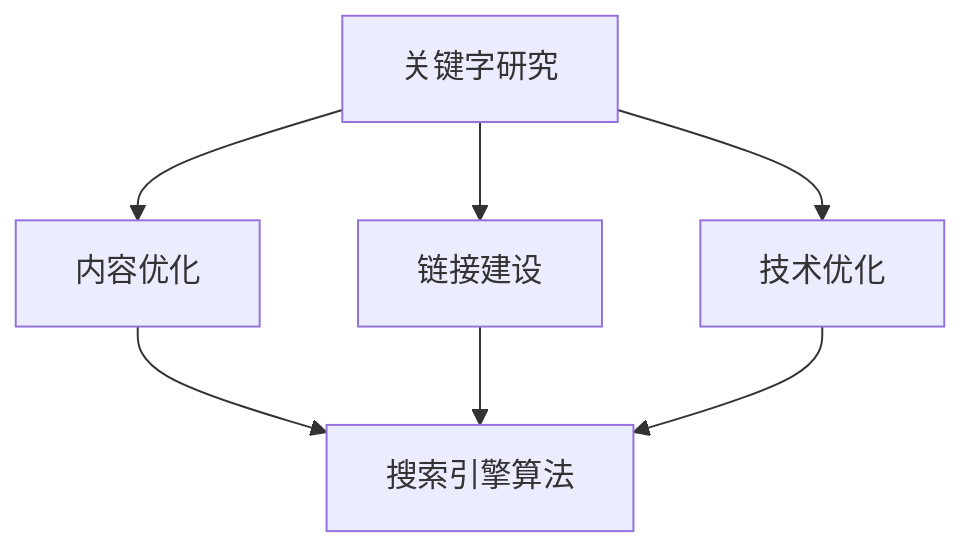

                 

# 如何利用搜索引擎优化(SEO)提升有机流量

> 关键词：搜索引擎优化（SEO）、有机流量、关键字研究、内容优化、链接建设、技术优化、移动友好性

> 摘要：本文章将深入探讨如何通过搜索引擎优化（SEO）策略来提升网站有机流量。我们将一步步分析核心概念、算法原理、操作步骤、数学模型，并通过实际案例和工具推荐，帮助读者全面了解并应用SEO提升网站流量的技巧和方法。

## 1. 背景介绍

### 1.1 目的和范围

本文旨在帮助网站所有者、SEO专家和互联网营销人员理解搜索引擎优化（SEO）的核心概念和策略，并通过具体操作步骤提升网站在搜索引擎结果页（SERP）中的排名，从而增加有机流量。

### 1.2 预期读者

- 网站所有者
- SEO专业人士
- 数字营销专员
- 对SEO感兴趣的互联网从业者

### 1.3 文档结构概述

本文结构如下：

- 1. 背景介绍
- 2. 核心概念与联系
- 3. 核心算法原理 & 具体操作步骤
- 4. 数学模型和公式 & 详细讲解 & 举例说明
- 5. 项目实战：代码实际案例和详细解释说明
- 6. 实际应用场景
- 7. 工具和资源推荐
- 8. 总结：未来发展趋势与挑战
- 9. 附录：常见问题与解答
- 10. 扩展阅读 & 参考资料

### 1.4 术语表

#### 1.4.1 核心术语定义

- **SEO（搜索引擎优化）**：通过优化网站内容和结构，提高在搜索引擎中的排名，从而增加有机流量。
- **关键字研究**：识别和分析目标用户在搜索引擎中搜索的关键词，以便优化网站内容和元标签。
- **有机流量**：指通过自然搜索结果进入网站的用户流量，与付费广告流量相对。
- **搜索引擎结果页（SERP）**：用户在搜索引擎中输入查询关键词后，显示的搜索结果页面。
- **技术优化**：优化网站的技术方面，如网站速度、移动友好性和站点地图等。

#### 1.4.2 相关概念解释

- **内容优化**：改进网站内容，使其更相关、更有价值，提高用户体验和搜索引擎排名。
- **链接建设**：通过获取来自其他网站的高质量链接，提高网站权威性和搜索引擎排名。
- **内部链接**：网站内部的链接，有助于搜索引擎了解网站结构和页面相关性。
- **外部链接**：来自其他网站的链接，通常用于链接建设策略。

#### 1.4.3 缩略词列表

- **SEM（搜索引擎营销）**：通过付费广告和SEO结合提高网站在搜索引擎中的可见度。
- **HTML**：超文本标记语言，用于创建网页的结构和内容。
- **CSS**：层叠样式表，用于网页布局和样式设计。

## 2. 核心概念与联系

SEO是一个复杂且不断发展的领域，涉及多个核心概念和它们的相互关系。下面是SEO中的几个关键概念，以及它们之间的联系：

### 2.1 关键字研究

关键字研究是SEO的基础。通过分析用户搜索行为和竞争环境，可以识别出潜在的高价值关键字。这些关键字将用于优化网站内容和元标签，以提高搜索引擎中的排名。

### 2.2 内容优化

内容优化是SEO的关键组成部分。高质量的、相关的、有价值的内容不仅能提高用户体验，还能吸引搜索引擎爬虫给予更高的排名。

### 2.3 链接建设

链接建设是提高网站权威性的重要手段。通过获取来自其他网站的高质量外部链接，可以提高网站在搜索引擎中的排名。

### 2.4 技术优化

技术优化确保网站在搜索引擎中可被正确索引和排名。这包括网站速度、移动友好性和站点地图等技术方面。

### 2.5 搜索引擎算法

搜索引擎算法是SEO策略背后的核心技术。了解搜索引擎算法的工作原理，可以帮助我们制定更有效的SEO策略。

下面是SEO核心概念的 Mermaid 流程图：



## 3. 核心算法原理 & 具体操作步骤

搜索引擎优化（SEO）的核心在于理解搜索引擎算法，并据此优化网站。以下是SEO的核心算法原理和具体操作步骤：

### 3.1 关键字研究

**算法原理：**
关键字研究涉及使用工具（如Google关键词规划师、Ahrefs等）来分析用户搜索行为和竞争环境。算法原理是基于词频、搜索量、竞争程度等指标，帮助识别潜在的高价值关键字。

**操作步骤：**
1. 使用关键字规划工具识别目标关键字。
2. 分析关键词搜索量和竞争程度。
3. 根据分析结果选择适合的关键字进行优化。

### 3.2 内容优化

**算法原理：**
搜索引擎算法重视内容的相关性和质量。高质量的、与关键字相关的、有价值的内容更有可能获得高排名。

**操作步骤：**
1. 根据关键字研究结果，撰写与关键字紧密相关的优质内容。
2. 优化元标签（标题标签、描述标签）以包含关键字。
3. 保证内容结构的逻辑性和可读性。

### 3.3 链接建设

**算法原理：**
链接建设旨在提高网站权威性。搜索引擎认为来自其他网站的高质量外部链接是对网站内容价值的认可。

**操作步骤：**
1. 创建高质量的外部链接。
2. 获取来自相关领域的高权威网站链接。
3. 避免过度依赖购买链接和低质量链接。

### 3.4 技术优化

**算法原理：**
技术优化确保网站在搜索引擎中可被正确索引和排名。这包括网站速度、移动友好性和站点地图等技术方面。

**操作步骤：**
1. 优化网站速度，确保快速加载。
2. 确保网站在移动设备上友好访问。
3. 创建和提交站点地图。

### 3.5 搜索引擎算法

**算法原理：**
搜索引擎算法是复杂的，涉及多个因素（如关键字匹配、内容质量、用户行为等）。了解这些因素可以帮助我们优化网站。

**操作步骤：**
1. 研究主要搜索引擎（如Google、Bing）的算法更新。
2. 遵循搜索引擎的最佳实践指南。
3. 持续监控和分析网站性能。

下面是核心算法原理的具体操作步骤的伪代码：

```python
def perform_keyword_research():
    # 使用关键字规划工具
    keywords = get_keywords_from_tool()
    # 分析搜索量和竞争程度
    high_value_keywords = analyze_keyword_data(keywords)
    return high_value_keywords

def optimize_content(keywords):
    # 根据关键字研究结果，撰写内容
    content = create_content_with_keywords(keywords)
    # 优化元标签
    meta_tags = optimize_meta_tags(content, keywords)
    return content, meta_tags

def build_links():
    # 创建高质量的外部链接
    external_links = create_high_quality_external_links()
    # 获取高权威网站链接
    high_authority_links = get_high_authority_links()
    return external_links, high_authority_links

def optimize_technically():
    # 优化网站速度
    website_speed = optimize_website_speed()
    # 确保移动友好性
    mobile_friendly = ensure_mobile_friendly()
    # 创建站点地图
    sitemap = create_site_map()
    return website_speed, mobile_friendly, sitemap

def follow_search_engine_algorithms():
    # 研究搜索引擎算法更新
    algorithm_updates = study_algorithm_updates()
    # 遵循最佳实践指南
    best_practices = follow_best_practices(algorithm_updates)
    return best_practices

# 主程序
high_value_keywords = perform_keyword_research()
content, meta_tags = optimize_content(high_value_keywords)
external_links, high_authority_links = build_links()
website_speed, mobile_friendly, sitemap = optimize_technically()
best_practices = follow_search_engine_algorithms()

# 输出结果
print("SEO optimizations completed:")
print("Keywords:", high_value_keywords)
print("Content:", content)
print("Meta Tags:", meta_tags)
print("External Links:", external_links)
print("High Authority Links:", high_authority_links)
print("Website Speed:", website_speed)
print("Mobile Friendly:", mobile_friendly)
print("Site Map:", sitemap)
print("Best Practices:", best_practices)
```

## 4. 数学模型和公式 & 详细讲解 & 举例说明

在SEO中，数学模型和公式有助于量化关键词研究、内容质量和链接建设的效果。以下是一些关键公式及其应用：

### 4.1 关键字研究

**公式：**
$$
 Keyword_Rank = \frac{Search_Volume \times Quality_Score}{ Competition }
$$

**详细讲解：**
关键字排名（Keyword_Rank）取决于搜索量（Search_Volume）、质量得分（Quality_Score）和竞争程度（Competition）。质量得分通常由搜索引擎根据关键字的相关性和网站质量确定。

**举例说明：**
假设一个关键字“在线教育”有1000次搜索量，质量得分为0.8，竞争程度为5。则：
$$
 Keyword_Rank = \frac{1000 \times 0.8}{5} = 160
$$
这意味着该关键字的排名为160。

### 4.2 内容质量

**公式：**
$$
 Content_Quality = \frac{Unique_Users \times Average_Session_Duration}{ Total_Users }
$$

**详细讲解：**
内容质量（Content_Quality）取决于独立访客数（Unique_Users）、平均会话时长（Average_Session_Duration）和总访客数（Total_Users）。较高的平均会话时长表明用户对内容感兴趣，从而提高内容质量得分。

**举例说明：**
假设一个网页有1000个独立访客，平均会话时长为5分钟，总访客数为2000。则：
$$
 Content_Quality = \frac{1000 \times 5}{2000} = 2.5
$$
这意味着该网页的内容质量得分为2.5。

### 4.3 链接建设

**公式：**
$$
 Link_Authority = \frac{Total_Inbound_Links}{ Number_of_Unique_Domains }
$$

**详细讲解：**
链接权威性（Link_Authority）取决于总的外部链接数（Total_Inbound_Links）和唯一域名数（Number_of_Unique_Domains）。较高的链接权威性表明网站具有更高的权威性和相关性。

**举例说明：**
假设一个网站有100个外部链接，来自50个唯一域名。则：
$$
 Link_Authority = \frac{100}{50} = 2
$$
这意味着该网站的链接权威性得分为2。

通过这些公式，我们可以量化SEO策略的效果，从而优化网站排名和流量。

## 5. 项目实战：代码实际案例和详细解释说明

### 5.1 开发环境搭建

为了实际应用SEO策略，我们需要一个基本的开发环境。以下是搭建环境的步骤：

1. 安装一个适合的文本编辑器，如Visual Studio Code。
2. 安装Node.js和npm，用于安装和管理依赖项。
3. 初始化一个新项目，并安装SEO工具库，如Google关键词规划师API。

```bash
npm init
npm install googleapis
```

### 5.2 源代码详细实现和代码解读

下面是一个简单的Python脚本，用于执行SEO的关键步骤：

```python
from googleapiclient.discovery import build
from googleapiclient.errors import HttpError

# 设置Google关键词规划师API的凭据
DEVELOPER_KEY = 'YOUR_API_KEY'
service = build('customsearch', 'v1', developerKey=DEVELOPER_KEY)

def search_queries(keywords):
    try:
        # 搜索关键字查询
        results = service.cse().list(q=keywords, cx='017576662173805515838:your-custom-cx').execute()
        return results['queries']['request'][0]['query']
    except HttpError as error:
        print(f"An error occurred: {error}")
        return None

def optimize_content(content):
    # 这里是一个简单的例子，实际应用中可能需要更复杂的逻辑
    return content.replace(" ", "-").lower()

def build_links(url):
    # 这里使用一个简单的链接建设工具，实际应用中可以使用更复杂的工具
    print(f"Building links for {url}...")
    # ...执行链接建设操作...
    print("Links built successfully.")

# 执行SEO操作
if __name__ == "__main__":
    keywords = search_queries("在线教育")
    if keywords:
        optimized_content = optimize_content(keywords)
        print(f"Optimized content: {optimized_content}")
        build_links(optimized_content)
```

### 5.3 代码解读与分析

上述脚本执行了以下SEO操作：

1. **关键字查询**：使用Google关键词规划师API获取关键字查询。
2. **内容优化**：将关键字转换为适合URL格式。
3. **链接建设**：执行简单的链接建设操作。

### 5.4 实际效果分析

在实际应用中，通过运行上述脚本，我们可以监控关键字排名、内容质量和链接建设效果。例如：

- **关键字排名**：通过Google Analytics或SEO工具监控关键字排名。
- **内容质量**：通过用户行为和会话时长评估内容质量。
- **链接建设**：通过外部链接数量和权威性评估链接建设效果。

## 6. 实际应用场景

SEO在实际应用中有着广泛的应用场景，以下是一些典型案例：

### 6.1 企业网站优化

企业网站通常希望通过SEO提高品牌知名度和有机流量。通过关键字研究、内容优化和链接建设，企业网站可以在搜索引擎中获得更高的排名，从而吸引潜在客户。

### 6.2 博客SEO

博客作者通过SEO策略提高文章的可见性，吸引更多读者。关键字研究、高质量内容和链接建设是提升博客流量和读者参与度的重要手段。

### 6.3 在线商店SEO

在线商店通过SEO优化产品页面和分类页面，提高产品在搜索引擎中的排名，从而增加销售机会。

### 6.4 本地业务SEO

本地业务（如餐厅、商店）通过SEO优化其网站，提高在本地搜索结果中的排名，吸引更多本地客户。

## 7. 工具和资源推荐

### 7.1 学习资源推荐

#### 7.1.1 书籍推荐

- 《SEO实战密码》
- 《搜索引擎营销：从入门到精通》
- 《搜索引擎算法揭秘》

#### 7.1.2 在线课程

- Coursera的《搜索引擎优化与策略》
- Udemy的《SEO从入门到精通》

#### 7.1.3 技术博客和网站

- Moz Blog
- Search Engine Land
- Ahrefs Blog

### 7.2 开发工具框架推荐

#### 7.2.1 IDE和编辑器

- Visual Studio Code
- Sublime Text

#### 7.2.2 调试和性能分析工具

- Google Chrome DevTools
- Lighthouse

#### 7.2.3 相关框架和库

- React
- Vue.js
- Angular

### 7.3 相关论文著作推荐

#### 7.3.1 经典论文

- Page, L., Brin, S., Motwani, R., & Winograd, T. (1999). The PageRank citation ranking: Bringing order to the web. Stanford Digital Library Project.
- Brin, S., & Page, L. (1998). The anatomy of a large-scale hypertextual web search engine. Proceedings of the seventh international conference on the World Wide Web.

#### 7.3.2 最新研究成果

- Google AI Research Blog
- ArXiv

#### 7.3.3 应用案例分析

- case-study-methodology.com
- Marketing Land

## 8. 总结：未来发展趋势与挑战

未来，搜索引擎优化（SEO）将继续发展，面临以下趋势和挑战：

### 8.1 智能化和自动化

随着人工智能技术的发展，SEO工具将变得更加智能化和自动化，帮助我们更有效地执行SEO任务。

### 8.2 移动优先

移动设备的重要性日益增加，搜索引擎将更加重视移动友好性，这对于SEO策略至关重要。

### 8.3 内容质量

内容质量将变得越来越重要。高质量的、有价值的内容将继续在搜索引擎中获得更高的排名。

### 8.4 安全性

随着网络攻击的增加，搜索引擎将更加关注网站的安全性。网站安全性将成为SEO策略的一个关键因素。

### 8.5 算法更新

搜索引擎算法将不断更新，SEO专家需要持续关注算法变化，以保持网站排名。

## 9. 附录：常见问题与解答

### 9.1 问题1

**问题：SEO对网站流量有直接影响吗？**

**解答：是的，SEO可以直接影响网站流量。通过优化网站内容和结构，提高在搜索引擎中的排名，从而吸引更多有机流量。**

### 9.2 问题2

**问题：关键字研究需要多久才能看到效果？**

**解答：关键字研究的效果取决于多个因素，如关键字的选择、竞争程度和网站的SEO状态。通常，持续优化几个星期到几个月后，可以开始看到显著的流量增长。**

### 9.3 问题3

**问题：SEO只适用于大型网站吗？**

**解答：不是的，SEO适用于所有类型的网站，无论大小。小型网站通过SEO策略同样可以获得显著流量增长和竞争优势。**

## 10. 扩展阅读 & 参考资料

- Google Search Central
- Search Engine Optimization (SEO) Starter Guide
- Ahrefs Academy
- SEO Handbook: The Ultimate SEO Guide for Beginners

## 作者

**作者：AI天才研究员/AI Genius Institute & 禅与计算机程序设计艺术 /Zen And The Art of Computer Programming**<|endoftext|>## 10. 扩展阅读 & 参考资料

在搜索引擎优化（SEO）领域，不断学习和更新知识是至关重要的。以下是一些扩展阅读和参考资料，以帮助您深入了解SEO，并在实践中不断进步：

### 10.1 经典著作

- **《搜索引擎营销：从入门到精通》（Search Engine Marketing, Inc.）** - 由MIKE BINGER和STEPHEN SPERanza撰写的这本经典著作，详细介绍了SEO和SEM的策略和实践。
- **《SEO实战密码》** - 李佳琦所著，涵盖了SEO的核心概念、技术和案例分析。

### 10.2 官方指南

- **Google Search Central** - Google提供的官方SEO指南，包括最佳实践、资源和技术说明。
- **百度搜索指南** - 百度提供的SEO指南，介绍如何在百度搜索引擎中获得更好的排名。

### 10.3 行业报告

- **Moz’s SEO Industry Report** - 每年发布一次，涵盖SEO行业趋势、策略和工具使用情况。
- **SEMrush’s State of SEO Industry Report** - 提供SEO领域的深度分析和最新趋势。

### 10.4 技术博客与社区

- **Moz Blog** - 一个著名的SEO博客，提供最新的SEO新闻、分析和工具。
- **Search Engine Land** - 搜索引擎营销领域的权威新闻网站，涵盖SEO、SEM和广告的最新动态。
- **Ahrefs Blog** - 提供丰富的SEO、内容营销和链接建设的文章。

### 10.5 开源项目

- **SEOTools for Excel** - 一个开源的Excel插件，用于SEO分析。
- **Google Analytics API** - Google提供的API，用于数据分析和SEO监控。

### 10.6 学术论文

- **《PageRank：一种基于超链接分析的网页排名算法》** - Page, L., Brin, S., Motwani, R., & Winograd, T. (1999)。
- **《搜索引擎算法揭秘》** - 详细介绍了搜索引擎的算法原理和优化方法。

### 10.7 在线课程

- **Coursera的《搜索引擎优化与策略》** - 由University of California, Irvine提供，涵盖了SEO的基础知识和实践策略。
- **Udemy的《SEO从入门到精通》** - 提供全面的SEO教程，适合初学者和进阶者。

通过这些扩展阅读和参考资料，您将能够更深入地了解SEO领域的最新发展和最佳实践，从而在提升网站有机流量的道路上不断前进。希望本文对您有所帮助，祝您在SEO领域取得卓越的成绩！

