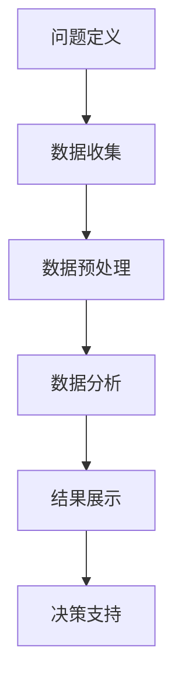

                 

# 如何利用数据分析优化知识付费产品

> 关键词：知识付费、数据分析、用户行为、用户体验、产品优化

> 摘要：本文旨在探讨如何通过数据分析来优化知识付费产品。我们将从背景介绍开始，详细讲解核心概念与联系，分析核心算法原理与具体操作步骤，解析数学模型和公式，展示代码实际案例，并探讨实际应用场景。最后，我们将推荐相关工具和资源，总结发展趋势与挑战，并附上常见问题与解答。

## 1. 背景介绍

### 1.1 目的和范围

随着互联网的快速发展，知识付费市场呈现出蓬勃发展的态势。然而，如何在激烈的市场竞争中脱颖而出，成为用户首选的知识付费平台，成为了各大企业亟需解决的问题。本文旨在通过数据分析的方法，帮助知识付费产品进行优化，从而提升用户体验，增加用户粘性，提高产品市场竞争力。

### 1.2 预期读者

本文适合以下读者群体：

- 知识付费产品经理
- 数据分析师
- 产品运营人员
- 对知识付费领域感兴趣的技术人员

### 1.3 文档结构概述

本文分为以下几个部分：

- 背景介绍
- 核心概念与联系
- 核心算法原理与具体操作步骤
- 数学模型和公式与详细讲解
- 项目实战：代码实际案例和详细解释说明
- 实际应用场景
- 工具和资源推荐
- 总结：未来发展趋势与挑战
- 附录：常见问题与解答
- 扩展阅读与参考资料

### 1.4 术语表

#### 1.4.1 核心术语定义

- **知识付费**：用户为获取特定知识或技能而支付的费用。
- **数据分析**：通过数据挖掘、统计学等方法，从大量数据中提取有价值的信息。
- **用户体验**：用户在使用产品或服务过程中的感受和体验。
- **产品优化**：通过调整产品功能、界面、性能等，提升产品质量和用户满意度。

#### 1.4.2 相关概念解释

- **用户行为**：用户在使用产品过程中的操作和反馈。
- **用户留存率**：一定时间内，仍继续使用产品的用户比例。
- **用户转化率**：用户完成购买或注册等目标行为的比例。
- **用户活跃度**：用户在产品上产生的互动和活动数量。

#### 1.4.3 缩略词列表

- **KPI**：关键绩效指标（Key Performance Indicator）
- **SQL**：结构化查询语言（Structured Query Language）
- **API**：应用程序编程接口（Application Programming Interface）

## 2. 核心概念与联系

为了更好地理解如何利用数据分析优化知识付费产品，我们需要了解以下几个核心概念及其相互联系。

### 2.1 用户行为分析

用户行为分析是指通过收集和分析用户在产品上的行为数据，了解用户的兴趣、需求和偏好。用户行为分析通常包括以下步骤：

1. **数据收集**：收集用户在产品上的操作数据，如浏览、搜索、购买、评论等。
2. **数据清洗**：对收集到的数据进行清洗，去除重复、错误或无效的数据。
3. **数据存储**：将清洗后的数据存储到数据库中，方便后续分析。

用户行为分析的关键是找到用户行为与产品性能之间的关联，从而为产品优化提供依据。

### 2.2 用户留存与转化分析

用户留存与转化分析是评估产品吸引用户能力的重要指标。用户留存率反映了用户对产品的忠诚度，而用户转化率则反映了产品的市场竞争力。

1. **用户留存分析**：通过分析用户在产品上的活跃度、停留时间、使用频率等指标，了解用户对产品的满意度和粘性。
2. **用户转化分析**：通过分析用户在产品上的购买行为、注册行为等，了解产品的市场转化能力和竞争力。

用户留存与转化分析的核心目标是提高用户留存率和转化率，从而提升产品市场竞争力。

### 2.3 数据可视化

数据可视化是将数据分析结果以图表、图形等形式展示出来的过程。数据可视化有助于更直观地理解数据分析结果，发现数据中的规律和趋势。

1. **数据图表**：使用各种图表（如柱状图、折线图、饼图等）展示数据分析结果。
2. **交互式可视化**：通过交互式可视化工具（如D3.js、Echarts等），让用户可以动态地探索和分析数据。

数据可视化有助于提高数据分析的可操作性和实用性，为产品优化提供直观的参考。

### 2.4 数据分析流程

数据分析流程通常包括以下几个步骤：

1. **问题定义**：明确数据分析的目标和问题。
2. **数据收集**：收集与问题相关的数据。
3. **数据预处理**：清洗、整合和转换数据，使其适合分析。
4. **数据分析**：运用统计方法、机器学习等技术进行分析。
5. **结果展示**：通过数据可视化等方法展示分析结果。
6. **决策支持**：基于分析结果，为产品优化提供决策支持。

数据分析流程的目的是从海量数据中提取有价值的信息，为产品优化提供科学依据。

### 2.5 Mermaid 流程图



通过Mermaid流程图，我们可以清晰地看到数据分析流程的各个环节及其相互联系。

## 3. 核心算法原理与具体操作步骤

### 3.1 用户行为分析算法原理

用户行为分析的核心算法是用户行为建模。用户行为建模是指通过建立数学模型，对用户行为进行描述和预测。以下是用户行为分析的核心算法原理和具体操作步骤。

#### 3.1.1 算法原理

用户行为建模通常采用以下方法：

1. **关联规则挖掘**：通过挖掘用户行为数据中的关联规则，发现用户之间的行为相似性。
2. **聚类分析**：将用户划分为不同的群体，分析不同群体之间的行为差异。
3. **时间序列分析**：分析用户行为的时间序列特征，预测用户未来的行为趋势。

#### 3.1.2 具体操作步骤

1. **数据收集**：收集用户在产品上的操作数据，如浏览、搜索、购买、评论等。
2. **数据预处理**：清洗、整合和转换数据，使其适合分析。
3. **特征提取**：提取用户行为的特征，如用户活跃度、使用频率、购买金额等。
4. **模型建立**：采用关联规则挖掘、聚类分析、时间序列分析等方法建立用户行为模型。
5. **模型训练**：使用训练数据对模型进行训练。
6. **模型评估**：使用测试数据对模型进行评估，调整模型参数。
7. **模型应用**：将训练好的模型应用于实际用户行为分析。

### 3.2 用户留存与转化分析算法原理

用户留存与转化分析的核心算法是机器学习算法。以下是用户留存与转化分析的核心算法原理和具体操作步骤。

#### 3.2.1 算法原理

用户留存与转化分析通常采用以下机器学习算法：

1. **逻辑回归**：通过建立逻辑回归模型，预测用户留存或转化的概率。
2. **决策树**：通过构建决策树模型，分析用户留存或转化的特征。
3. **随机森林**：通过随机森林模型，提高用户留存或转化的预测准确性。

#### 3.2.2 具体操作步骤

1. **数据收集**：收集用户在产品上的操作数据，如浏览、搜索、购买、评论等。
2. **数据预处理**：清洗、整合和转换数据，使其适合分析。
3. **特征提取**：提取用户行为的特征，如用户活跃度、使用频率、购买金额等。
4. **模型建立**：采用逻辑回归、决策树、随机森林等方法建立用户留存与转化模型。
5. **模型训练**：使用训练数据对模型进行训练。
6. **模型评估**：使用测试数据对模型进行评估，调整模型参数。
7. **模型应用**：将训练好的模型应用于实际用户留存与转化分析。

### 3.3 数据可视化算法原理

数据可视化算法原理主要涉及以下两个方面：

1. **数据映射**：将数据分析结果映射到可视化维度，如颜色、形状、大小等。
2. **交互式操作**：通过交互式操作，如点击、拖动、缩放等，提供更直观的数据分析体验。

### 3.4 数据分析流程

数据分析流程的具体操作步骤如下：

1. **问题定义**：明确数据分析的目标和问题。
2. **数据收集**：收集与问题相关的数据。
3. **数据预处理**：清洗、整合和转换数据，使其适合分析。
4. **特征提取**：提取用户行为的特征，如用户活跃度、使用频率、购买金额等。
5. **模型建立**：采用关联规则挖掘、聚类分析、时间序列分析、逻辑回归、决策树、随机森林等方法建立模型。
6. **模型训练**：使用训练数据对模型进行训练。
7. **模型评估**：使用测试数据对模型进行评估，调整模型参数。
8. **结果展示**：通过数据可视化方法展示分析结果。
9. **决策支持**：基于分析结果，为产品优化提供决策支持。

## 4. 数学模型和公式与详细讲解

### 4.1 用户行为分析数学模型

用户行为分析通常采用以下数学模型：

1. **关联规则挖掘**

   关联规则挖掘的数学模型为：

   $$ \text{support}(A, B) = \frac{\text{同时包含A和B的交易数}}{\text{总交易数}} $$

   $$ \text{confidence}(A \rightarrow B) = \frac{\text{同时包含A和B的交易数}}{\text{包含A的交易数}} $$

   其中，support(A, B) 表示A和B同时发生的支持度，confidence(A → B) 表示A发生时B发生的置信度。

2. **聚类分析**

   聚类分析的数学模型为：

   $$ \text{距离度量} = \sqrt{\sum_{i=1}^{n} (x_i - \bar{x})^2} $$

   其中，n 表示特征维度，$x_i$ 表示第i个特征的值，$\bar{x}$ 表示特征的平均值。

3. **时间序列分析**

   时间序列分析的数学模型为：

   $$ y_t = \beta_0 + \beta_1 t + \epsilon_t $$

   其中，$y_t$ 表示时间序列的第t个值，$\beta_0$ 和 $\beta_1$ 分别表示常数项和一次项的系数，$\epsilon_t$ 表示随机误差项。

### 4.2 用户留存与转化分析数学模型

用户留存与转化分析通常采用以下数学模型：

1. **逻辑回归**

   逻辑回归的数学模型为：

   $$ P(Y=1|X) = \frac{1}{1 + e^{-(\beta_0 + \beta_1 x_1 + \beta_2 x_2 + ... + \beta_n x_n )}} $$

   其中，$P(Y=1|X)$ 表示在给定特征X的情况下，用户留存或转化的概率，$\beta_0$ 和 $\beta_1, \beta_2, ..., \beta_n$ 分别为模型的参数。

2. **决策树**

   决策树的数学模型为：

   $$ f(X) = \sum_{i=1}^{n} \beta_i \cdot I(X \in R_i) $$

   其中，$f(X)$ 表示决策树模型的预测值，$R_i$ 表示第i个区域的特征，$\beta_i$ 为区域i的权重。

3. **随机森林**

   随机森林的数学模型为：

   $$ f(X) = \frac{1}{M} \sum_{m=1}^{M} h_m(X) $$

   其中，$h_m(X)$ 表示第m棵树在给定特征X上的预测值，M表示树的个数。

### 4.3 数据可视化数学模型

数据可视化通常采用以下数学模型：

1. **颜色映射**

   颜色映射的数学模型为：

   $$ C = f(V) $$

   其中，C表示颜色，V表示数据的取值，f表示颜色映射函数。

2. **形状映射**

   形状映射的数学模型为：

   $$ S = g(V) $$

   其中，S表示形状，V表示数据的取值，g表示形状映射函数。

### 4.4 举例说明

以下是一个用户留存分析的具体例子：

假设我们收集了1000个用户的数据，其中包含用户的活跃度、使用频率和购买金额等特征。我们使用逻辑回归模型预测用户是否留存。

1. **数据收集**：收集用户数据，包括活跃度、使用频率和购买金额等特征。
2. **数据预处理**：对数据进行清洗和整合，使其适合分析。
3. **特征提取**：提取用户行为的特征，如用户活跃度、使用频率和购买金额等。
4. **模型建立**：采用逻辑回归模型建立用户留存预测模型。
5. **模型训练**：使用训练数据对模型进行训练。
6. **模型评估**：使用测试数据对模型进行评估，调整模型参数。
7. **模型应用**：将训练好的模型应用于实际用户留存预测。

通过逻辑回归模型，我们可以得到以下预测结果：

$$ P(\text{留存}) = \frac{1}{1 + e^{-(\beta_0 + \beta_1 \cdot 活跃度 + \beta_2 \cdot 使用频率 + \beta_3 \cdot 购买金额 )}} $$

其中，$\beta_0, \beta_1, \beta_2, \beta_3$ 为模型的参数。

通过这个预测结果，我们可以分析不同特征对用户留存的影响，从而为产品优化提供依据。

## 5. 项目实战：代码实际案例和详细解释说明

### 5.1 开发环境搭建

在开始项目实战之前，我们需要搭建一个适合数据分析的开发环境。以下是一个简单的开发环境搭建步骤：

1. 安装Python：从Python官方网站（https://www.python.org/）下载并安装Python。
2. 安装Jupyter Notebook：在命令行中运行以下命令安装Jupyter Notebook：

   ```bash
   pip install notebook
   ```

3. 安装数据分析库：在命令行中运行以下命令安装常用的数据分析库：

   ```bash
   pip install pandas numpy matplotlib scikit-learn
   ```

### 5.2 源代码详细实现和代码解读

以下是一个简单的用户行为分析项目案例，我们将使用Python和Jupyter Notebook进行实现。

```python
import pandas as pd
from sklearn.model_selection import train_test_split
from sklearn.linear_model import LogisticRegression
from sklearn.metrics import accuracy_score
import matplotlib.pyplot as plt

# 5.2.1 数据收集
data = pd.read_csv('user_data.csv')
print(data.head())

# 5.2.2 数据预处理
# 填充缺失值
data.fillna(0, inplace=True)

# 特征提取
features = data[['活跃度', '使用频率', '购买金额']]
labels = data['留存']

# 5.2.3 模型建立
# 划分训练集和测试集
X_train, X_test, y_train, y_test = train_test_split(features, labels, test_size=0.2, random_state=42)

# 使用逻辑回归模型进行训练
model = LogisticRegression()
model.fit(X_train, y_train)

# 5.2.4 模型评估
y_pred = model.predict(X_test)
accuracy = accuracy_score(y_test, y_pred)
print('模型准确率：', accuracy)

# 5.2.5 结果展示
plt.scatter(X_test['活跃度'], X_test['使用频率'], c=y_pred)
plt.xlabel('活跃度')
plt.ylabel('使用频率')
plt.title('用户留存预测结果')
plt.show()
```

### 5.3 代码解读与分析

以下是代码的详细解读和分析：

1. **数据收集**：使用pandas库读取用户数据，包括活跃度、使用频率和购买金额等特征，以及留存标签。
2. **数据预处理**：使用pandas库填充缺失值，将缺失值替换为0。
3. **特征提取**：将活跃度、使用频率和购买金额等特征提取到新的DataFrame中，将留存标签提取到另一个DataFrame中。
4. **模型建立**：使用train_test_split函数划分训练集和测试集，使用逻辑回归模型（LogisticRegression）建立用户留存预测模型。
5. **模型训练**：使用fit函数对模型进行训练。
6. **模型评估**：使用predict函数预测测试集的留存标签，使用accuracy_score函数计算模型准确率。
7. **结果展示**：使用matplotlib库绘制散点图，展示用户留存预测结果。

通过这个案例，我们可以看到如何使用Python和数据分析库进行用户行为分析，并建立用户留存预测模型。这个案例只是一个简单的示例，实际项目中可能需要更复杂的数据预处理和模型训练过程。

## 6. 实际应用场景

数据分析在知识付费产品优化中的应用场景非常广泛，以下列举几个常见的应用场景：

1. **用户行为分析**：通过分析用户在产品上的行为数据，如浏览、搜索、购买、评论等，了解用户的兴趣、需求和偏好，为产品优化提供依据。例如，通过分析用户浏览和搜索的数据，可以为产品推荐系统提供支持，提高用户满意度。
2. **用户留存与转化分析**：通过分析用户的留存和转化数据，了解产品在市场中的竞争力，为产品优化提供决策支持。例如，通过分析用户留存率、转化率等指标，可以为产品营销策略、用户运营等提供参考。
3. **内容推荐**：通过分析用户行为数据和内容数据，为用户提供个性化的内容推荐。例如，通过分析用户在产品上的行为数据和内容标签，可以为用户推荐相关的课程、文章、视频等。
4. **用户满意度分析**：通过分析用户对产品的评价数据，了解用户对产品的满意度和不满意度，为产品优化提供参考。例如，通过分析用户对产品的评论数据，可以识别产品中的问题，为产品改进提供依据。
5. **市场趋势分析**：通过分析市场数据，了解行业趋势和竞争状况，为产品战略规划提供支持。例如，通过分析市场数据和用户行为数据，可以识别热门的知识领域和用户需求，为产品创新提供参考。

在实际应用中，数据分析可以帮助知识付费产品在多个方面进行优化，从而提升用户体验，增加用户粘性，提高产品市场竞争力。

## 7. 工具和资源推荐

为了更好地进行知识付费产品的数据分析，以下推荐一些常用的学习资源、开发工具和框架。

### 7.1 学习资源推荐

#### 7.1.1 书籍推荐

- 《数据科学入门：基于Python的实践指南》
- 《Python数据分析实战》
- 《机器学习实战》
- 《深度学习：简介与案例》

#### 7.1.2 在线课程

- Coursera上的《机器学习》
- Udacity的《数据分析纳米学位》
- edX上的《数据科学基础》

#### 7.1.3 技术博客和网站

- Medium上的数据分析专题
- Kaggle
- DataCamp
- Analytics Vidhya

### 7.2 开发工具框架推荐

#### 7.2.1 IDE和编辑器

- PyCharm
- Jupyter Notebook
- VSCode

#### 7.2.2 调试和性能分析工具

- Python Debugger
- Py-Spy
- PyVite

#### 7.2.3 相关框架和库

- Pandas
- NumPy
- Scikit-learn
- Matplotlib
- Seaborn
- TensorFlow
- PyTorch

### 7.3 相关论文著作推荐

#### 7.3.1 经典论文

- "The Elements of Statistical Learning" by Trevor Hastie, Robert Tibshirani, and Jerome Friedman
- "Recommender Systems" by GroupLens Research Group
- "User Modeling and User-Adapted Interaction" by GroupLens Research Group

#### 7.3.2 最新研究成果

- arXiv
- IEEE Xplore
- ACM Digital Library

#### 7.3.3 应用案例分析

- "Recommender Systems for E-Commerce" by GroupLens Research Group
- "Customer Segmentation for Personalized Marketing" by Microsoft
- "Text Analysis for Social Media" by Facebook AI Research

通过学习和使用这些工具和资源，可以更好地掌握数据分析技能，为知识付费产品优化提供有力支持。

## 8. 总结：未来发展趋势与挑战

随着大数据、人工智能技术的不断发展，数据分析在知识付费产品优化中的应用前景十分广阔。未来，数据分析在知识付费产品优化中的发展趋势主要包括以下几个方面：

1. **个性化推荐**：通过深度学习、强化学习等算法，实现更精准、更个性化的内容推荐，提高用户体验和满意度。
2. **实时数据分析**：利用实时数据处理技术，如流处理、内存计算等，实现实时数据分析和反馈，提高产品运营效率。
3. **跨平台数据分析**：整合不同平台的数据，如社交媒体、电商平台等，实现跨平台数据分析，提升数据分析的广度和深度。
4. **数据隐私保护**：在数据分析过程中，注重数据隐私保护，采用加密、脱敏等技术，确保用户数据安全。
5. **多维度数据分析**：结合用户行为数据、内容数据、市场数据等多维度数据，进行综合分析，为产品优化提供更全面的支持。

然而，随着数据分析技术的发展，知识付费产品优化也面临着一些挑战：

1. **数据质量**：高质量的数据是数据分析的基础。在实际应用中，如何保证数据的质量和准确性，是数据分析师面临的挑战。
2. **数据隐私**：在数据分析过程中，如何保护用户隐私，防止数据泄露，是数据分析师和产品经理需要关注的问题。
3. **算法公平性**：在个性化推荐等应用中，如何避免算法偏见，确保推荐结果的公平性，是数据分析师和产品经理需要考虑的问题。
4. **模型解释性**：随着深度学习等复杂算法的应用，如何解释模型的决策过程，为产品优化提供可解释性的支持，是数据分析师面临的挑战。
5. **技术更新迭代**：数据分析技术更新迭代速度快，如何跟上技术的发展步伐，持续提升数据分析能力，是数据分析师需要面对的挑战。

总之，未来数据分析在知识付费产品优化中将发挥越来越重要的作用，但也需要不断克服各种挑战，为产品优化提供有力支持。

## 9. 附录：常见问题与解答

### 9.1 用户行为分析常见问题

**Q1**：如何保证数据质量？

**A1**：保证数据质量的关键在于数据收集、数据预处理和数据存储等环节。具体措施包括：

- 数据收集：确保数据来源的可靠性和准确性，避免数据重复或错误。
- 数据预处理：对数据进行清洗、整合和转换，去除重复、错误或无效的数据。
- 数据存储：采用合适的数据库技术，保证数据的存储安全、高效和可扩展。

**Q2**：用户行为分析中的常见指标有哪些？

**A2**：用户行为分析中的常见指标包括：

- 活跃度：用户在产品上的互动和活动数量。
- 停留时间：用户在产品上的平均停留时间。
- 使用频率：用户访问产品的频率。
- 购买金额：用户的购买金额。
- 购买率：用户的购买比例。

**Q3**：如何进行用户留存与转化分析？

**A3**：用户留存与转化分析通常包括以下步骤：

- 数据收集：收集与用户留存和转化相关的数据。
- 数据预处理：清洗、整合和转换数据，使其适合分析。
- 特征提取：提取与用户留存和转化相关的特征。
- 模型建立：采用逻辑回归、决策树、随机森林等方法建立用户留存和转化模型。
- 模型训练：使用训练数据对模型进行训练。
- 模型评估：使用测试数据对模型进行评估，调整模型参数。
- 模型应用：将训练好的模型应用于实际用户留存和转化分析。

### 9.2 数据分析工具常见问题

**Q1**：如何选择合适的数据分析工具？

**A1**：选择合适的数据分析工具需要考虑以下几个方面：

- 数据类型：根据数据类型（如结构化数据、非结构化数据）选择合适的工具。
- 数据量：根据数据量（如小数据、大数据）选择合适的工具。
- 分析需求：根据分析需求（如快速分析、深度分析）选择合适的工具。
- 可视化需求：根据可视化需求（如简单可视化、复杂可视化）选择合适的工具。

**Q2**：如何使用数据分析工具进行数据可视化？

**A2**：使用数据分析工具进行数据可视化通常包括以下步骤：

- 数据导入：将数据导入数据分析工具。
- 数据清洗：对数据进行清洗，去除重复、错误或无效的数据。
- 特征提取：提取与可视化相关的特征。
- 可视化设置：设置图表类型、颜色、标签等可视化参数。
- 可视化展示：生成可视化图表，展示数据分析结果。

### 9.3 数据分析流程常见问题

**Q1**：数据分析流程中的关键步骤是什么？

**A1**：数据分析流程中的关键步骤包括：

- 问题定义：明确数据分析的目标和问题。
- 数据收集：收集与问题相关的数据。
- 数据预处理：清洗、整合和转换数据，使其适合分析。
- 特征提取：提取与问题相关的特征。
- 模型建立：采用合适的模型进行数据分析。
- 模型训练：使用训练数据对模型进行训练。
- 模型评估：使用测试数据对模型进行评估。
- 结果展示：通过数据可视化等方法展示分析结果。
- 决策支持：基于分析结果，为产品优化提供决策支持。

通过以上常见问题与解答，可以帮助读者更好地理解用户行为分析、数据分析工具和数据分析流程等方面的知识。

## 10. 扩展阅读与参考资料

本文围绕如何利用数据分析优化知识付费产品进行了详细探讨，涵盖了用户行为分析、用户留存与转化分析、数据可视化、数据分析流程等多个方面。以下是一些扩展阅读与参考资料，供读者进一步学习和研究：

1. **《数据科学入门：基于Python的实践指南》**：这是一本非常适合初学者的数据科学入门书籍，涵盖了Python编程、数据处理、统计分析等内容。
2. **《机器学习实战》**：本书通过大量的实例和代码，详细介绍了机器学习的基本概念、算法和应用。
3. **《深度学习：简介与案例》**：这是一本关于深度学习的入门书籍，介绍了深度学习的基本概念、神经网络、卷积神经网络等。
4. **《用户建模与个性化推荐系统》**：本书详细介绍了用户建模、个性化推荐系统的基本理论、算法和应用。
5. **《知识付费市场研究报告》**：这份报告对知识付费市场进行了深入分析，包括市场规模、用户需求、竞争状况等方面。
6. **Kaggle：数据科学竞赛平台**：Kaggle是一个知名的数据科学竞赛平台，上面有很多真实世界的数据科学问题和挑战，适合读者实践和提升数据分析能力。
7. **Coursera上的《机器学习》**：这是一门由斯坦福大学提供的免费在线课程，详细介绍了机器学习的基本概念、算法和应用。
8. **Udacity的《数据分析纳米学位》**：这是一门专注于数据分析的在线课程，涵盖数据预处理、统计分析、数据可视化等内容。

通过阅读以上书籍、报告和课程，读者可以更深入地了解数据分析在知识付费产品优化中的应用，提升自己的数据分析能力和技能。同时，也可以关注相关领域的最新研究成果和行业动态，不断更新和扩展自己的知识体系。

