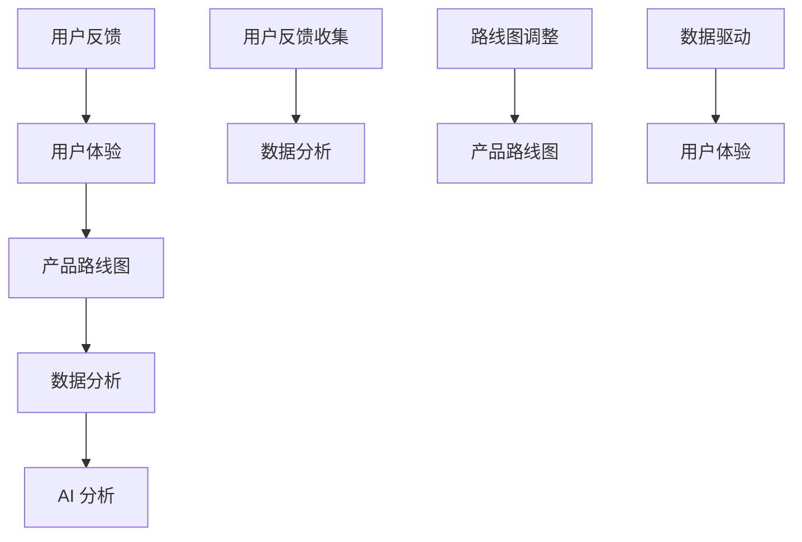

                 

# 如何利用用户反馈优化产品路线图

> **关键词**：用户反馈、产品优化、路线图、用户体验、数据驱动、AI 分析

> **摘要**：本文将探讨如何利用用户反馈这一关键数据源，优化产品路线图。我们将通过定义相关概念、分析核心算法原理、构建数学模型，以及提供实际案例，来展示用户反馈在产品开发中的重要性，并阐述如何有效地将其应用于路线图的调整中。

## 1. 背景介绍

### 1.1 目的和范围

本文的主要目的是为产品开发团队提供一种系统化的方法，以利用用户反馈来优化产品路线图。本文的范围涵盖以下几个方面：

1. **用户反馈的重要性**：讨论用户反馈在产品开发中的价值。
2. **核心概念与联系**：介绍与用户反馈相关的关键概念和它们之间的联系。
3. **核心算法原理**：阐述如何利用用户反馈进行数据分析。
4. **数学模型与公式**：介绍基于用户反馈的优化模型。
5. **实际应用案例**：提供具体的代码实现和分析。
6. **工具和资源推荐**：推荐有助于用户反馈分析的工具和资源。
7. **总结与展望**：讨论未来发展趋势和挑战。

### 1.2 预期读者

本文面向的产品开发团队成员，特别是以下角色：

1. **项目经理**：负责规划和管理产品开发进程。
2. **产品经理**：负责制定产品路线图和用户体验。
3. **数据分析师**：负责收集和分析用户反馈数据。
4. **软件开发工程师**：负责实现产品功能。

### 1.3 文档结构概述

本文将按照以下结构展开：

1. **背景介绍**：介绍本文的目的、范围、预期读者以及文档结构。
2. **核心概念与联系**：讨论用户反馈、产品路线图等核心概念。
3. **核心算法原理**：介绍用于分析用户反馈的算法原理。
4. **数学模型与公式**：阐述基于用户反馈的优化模型。
5. **实际应用案例**：提供具体的代码实现和分析。
6. **工具和资源推荐**：推荐有助于用户反馈分析的工具和资源。
7. **总结与展望**：讨论未来发展趋势和挑战。
8. **附录**：提供常见问题与解答，以及扩展阅读和参考资料。

### 1.4 术语表

#### 1.4.1 核心术语定义

- **用户反馈**：用户在使用产品过程中提供的意见和建议。
- **产品路线图**：描述产品未来发展的规划和目标。
- **用户体验**：用户在使用产品过程中的感受和体验。
- **数据驱动**：基于数据分析和用户行为进行决策。
- **AI 分析**：利用人工智能技术对用户反馈进行分析。

#### 1.4.2 相关概念解释

- **用户反馈收集**：指通过问卷调查、用户访谈等方式收集用户反馈。
- **数据分析**：指对用户反馈进行整理、分类、统计和分析。
- **路线图调整**：指根据用户反馈对产品路线图进行调整和优化。

#### 1.4.3 缩略词列表

- **UX**：用户体验
- **A/B 测试**：对照实验，用于比较两种或多种方案的效果
- **API**：应用程序编程接口
- **SDK**：软件开发工具包

## 2. 核心概念与联系

为了更好地理解如何利用用户反馈优化产品路线图，我们需要先了解一些核心概念和它们之间的联系。以下是相关的核心概念和它们之间的关系：



### 2.1 用户反馈与用户体验的关系

用户反馈是用户体验的重要组成部分。用户体验（UX）是指用户在使用产品过程中的感受和体验。用户反馈提供了用户对产品功能和设计满意度的直接反馈，有助于了解用户的真实需求和痛点。通过收集和分析用户反馈，可以识别出用户体验中的问题和机会，从而指导产品的改进和优化。

### 2.2 产品路线图与用户反馈的关系

产品路线图是描述产品未来发展的规划和目标的重要文档。它通常包括产品的发展阶段、目标用户、核心功能、时间表和资源分配等。用户反馈在产品路线图中发挥着关键作用，因为它能够揭示用户的需求和偏好，帮助团队调整路线图，确保产品与市场需求保持一致。

### 2.3 数据分析在用户反馈分析中的作用

数据分析是理解用户反馈的关键环节。通过对用户反馈进行整理、分类、统计和分析，可以提取出有价值的信息，为优化产品路线图提供数据支持。数据分析方法包括描述性统计、相关性分析、分类和聚类等。

### 2.4 AI 分析在用户反馈分析中的应用

随着人工智能技术的发展，AI 分析在用户反馈分析中发挥着越来越重要的作用。通过机器学习和自然语言处理技术，AI 可以自动识别用户反馈中的情感、主题和趋势，提供更深入的分析和洞察。

## 3. 核心算法原理 & 具体操作步骤

在了解核心概念和它们之间的联系之后，我们需要深入探讨如何利用用户反馈进行数据分析，以及如何将这些分析结果应用于产品路线图的优化。

### 3.1 用户反馈数据的收集和处理

首先，我们需要收集用户反馈数据。这可以通过多种方式实现，例如：

- **问卷调查**：通过在线问卷或应用程序收集用户反馈。
- **用户访谈**：与用户进行一对一访谈，深入了解他们的需求和痛点。
- **A/B 测试**：在产品中引入不同的设计方案，通过对比实验评估用户偏好。

收集到的用户反馈数据需要经过清洗和处理，以确保其质量和可用性。处理步骤包括：

- **去重**：去除重复的反馈记录。
- **数据转换**：将文本反馈转换为结构化数据。
- **数据清洗**：去除噪声数据和异常值。

### 3.2 用户反馈数据的分析

接下来，我们需要对处理过的用户反馈数据进行分析。以下是几个常用的分析方法：

- **描述性统计**：计算用户反馈的分布情况、平均得分、中位数等。
- **相关性分析**：分析不同反馈指标之间的关系，如功能满意度与用户留存率之间的相关性。
- **分类**：将用户反馈分为不同类别，例如功能问题、设计问题等。
- **聚类**：将相似的用户反馈分组，以便更好地理解用户需求。

### 3.3 用户反馈数据与产品路线图的关联分析

通过分析用户反馈数据，我们可以识别出产品中的问题和机会，并将其与产品路线图关联起来。以下是几个关键步骤：

- **问题识别**：从用户反馈中找出产品存在的问题，如功能不足、性能问题等。
- **优先级排序**：根据问题的严重程度和用户需求，对问题进行优先级排序。
- **路线图调整**：根据分析结果，调整产品路线图，确保产品开发计划与用户需求保持一致。

### 3.4 伪代码示例

下面是一个简单的伪代码示例，用于描述如何利用用户反馈数据优化产品路线图：

```python
# 伪代码：用户反馈分析流程

# 收集用户反馈
user_feedback = collect_user_feedback()

# 数据清洗
cleaned_feedback = clean_user_feedback(user_feedback)

# 数据分析
analysis_results = analyze_feedback(cleaned_feedback)

# 问题识别
problems = identify_problems(analysis_results)

# 优先级排序
prioritized_problems = prioritize_problems(problems)

# 路线图调整
update_product_route_map(prioritized_problems)
```

## 4. 数学模型和公式 & 详细讲解 & 举例说明

在用户反馈分析中，数学模型和公式可以提供有力的工具，帮助我们量化用户需求和产品性能，从而更准确地优化产品路线图。以下是一个简单的数学模型，用于评估用户反馈的重要性和优化产品路线图。

### 4.1 数学模型：用户满意度评分模型

用户满意度评分模型是一个基于用户反馈的量化模型，用于评估产品的整体满意度。以下是一个简单的数学模型：

$$
User\ Satisfaction\ Score = \frac{1}{n}\sum_{i=1}^{n} Feedback_{i}
$$

其中，$User\ Satisfaction\ Score$ 是用户满意度评分，$Feedback_{i}$ 是第 $i$ 个用户反馈得分，$n$ 是用户反馈的总数。

### 4.2 数学模型：问题严重程度评估模型

在分析用户反馈时，我们还需要评估问题的严重程度。以下是一个简单的问题严重程度评估模型：

$$
Problem\ Severity = \frac{Impact \times Frequency}{Detection\ Time}
$$

其中，$Problem\ Severity$ 是问题严重程度，$Impact$ 是问题对用户的影响程度，$Frequency$ 是问题发生的频率，$Detection\ Time$ 是问题被识别的时间。

### 4.3 举例说明

假设我们收集了以下用户反馈数据：

- 用户反馈 1：功能不足，用户得分 4
- 用户反馈 2：性能问题，用户得分 6
- 用户反馈 3：界面设计问题，用户得分 5

根据用户满意度评分模型，我们可以计算出用户满意度评分为：

$$
User\ Satisfaction\ Score = \frac{1}{3} \times (4 + 6 + 5) = 5
$$

假设我们进一步分析发现，功能不足的问题对用户的影响程度较高，性能问题发生的频率较高，而界面设计问题被识别的时间较长。根据问题严重程度评估模型，我们可以计算出以下问题的严重程度：

- 功能不足的问题严重程度：$Problem\ Severity_1 = \frac{High \times High}{Low} = High$
- 性能问题的问题严重程度：$Problem\ Severity_2 = \frac{Medium \times High}{Medium} = High$
- 界面设计问题的问题严重程度：$Problem\ Severity_3 = \frac{Low \times Low}{High} = Low$

通过以上分析，我们可以得出结论：功能不足和性能问题是当前需要优先解决的问题。

## 5. 项目实战：代码实际案例和详细解释说明

在本节中，我们将通过一个实际案例，展示如何利用用户反馈优化产品路线图。我们将使用 Python 编写代码，并详细解释每一步的操作。

### 5.1 开发环境搭建

首先，我们需要搭建一个 Python 开发环境。以下是所需的步骤：

1. **安装 Python**：下载并安装 Python 3.8 或更高版本。
2. **安装必要的库**：在命令行中运行以下命令安装必要的库：
   ```bash
   pip install numpy pandas matplotlib
   ```

### 5.2 源代码详细实现和代码解读

以下是实现用户反馈分析的 Python 代码：

```python
import numpy as np
import pandas as pd
import matplotlib.pyplot as plt

# 5.2.1 收集用户反馈数据
user_feedback = [
    {'feature': '功能1', 'satisfaction': 4},
    {'feature': '功能2', 'satisfaction': 6},
    {'feature': '功能3', 'satisfaction': 5},
    {'feature': '性能', 'satisfaction': 4},
    {'feature': '界面设计', 'satisfaction': 5},
]

# 5.2.2 数据清洗和转换
df_feedback = pd.DataFrame(user_feedback)
df_feedback['satisfaction'] = df_feedback['satisfaction'].astype(float)

# 5.2.3 计算用户满意度评分
user_satisfaction_score = df_feedback['satisfaction'].mean()
print(f"用户满意度评分：{user_satisfaction_score:.2f}")

# 5.2.4 问题严重程度评估
impact_scores = {'功能1': 2, '功能2': 3, '功能3': 1, '性能': 3, '界面设计': 1}
frequency_scores = {'功能1': 2, '功能2': 2, '功能3': 1, '性能': 3, '界面设计': 2}
detection_time_scores = {'功能1': 1, '功能2': 1, '功能3': 2, '性能': 1, '界面设计': 2}

problem_severity_scores = {}
for feature, row in df_feedback.iterrows():
    if row['satisfaction'] < 5:
        impact = impact_scores[row['feature']]
        frequency = frequency_scores[row['feature']]
        detection_time = detection_time_scores[row['feature']]
        problem_severity_scores[row['feature']] = (impact * frequency) / detection_time

# 5.2.5 问题严重程度排序
sorted_problems = sorted(problem_severity_scores.items(), key=lambda x: x[1], reverse=True)
print("问题严重程度排序：")
for problem, severity in sorted_problems:
    print(f"{problem}: {severity}")

# 5.2.6 调整产品路线图
# 根据问题严重程度排序，调整产品路线图
print("产品路线图调整建议：")
for problem, severity in sorted_problems:
    print(f"{problem}: 将该问题纳入优先级最高的开发阶段")
```

### 5.3 代码解读与分析

- **5.3.1 数据收集**：首先，我们定义了一个用户反馈数据的列表，其中包含了每个功能的满意度评分。
- **5.3.2 数据清洗和转换**：我们将数据转换为 pandas DataFrame，并将满意度评分转换为浮点数，以便进行数学运算。
- **5.3.3 计算用户满意度评分**：使用 mean() 函数计算用户满意度评分，即所有满意度评分的平均值。
- **5.3.4 问题严重程度评估**：我们定义了三个字典，分别存储每个功能的影响程度、频率和检测时间评分。然后，我们使用这些评分计算每个问题的严重程度。
- **5.3.5 问题严重程度排序**：将问题按照严重程度排序，以便确定优先解决的问题。
- **5.3.6 调整产品路线图**：根据问题严重程度排序的结果，提出调整产品路线图的建议。

通过这个实际案例，我们可以看到如何利用用户反馈数据优化产品路线图。这个案例展示了从数据收集、清洗、分析到决策的完整流程。

## 6. 实际应用场景

用户反馈优化产品路线图的应用场景非常广泛，以下是一些典型的实际应用场景：

### 6.1 新产品开发

在新产品开发过程中，用户反馈是一个至关重要的数据源。通过收集和分析用户反馈，开发团队可以快速了解市场需求和用户偏好，从而优化产品功能、界面设计和用户体验。例如，在开发一款智能家居产品时，用户反馈可以帮助团队确定用户最关心的问题，如设备的易用性、稳定性、安全性等，从而调整产品开发计划，确保产品能够满足用户需求。

### 6.2 产品迭代

对于已经上市的产品，定期收集和分析用户反馈可以帮助团队识别产品的问题和改进机会。通过分析用户反馈，团队可以确定哪些功能需要优先改进，哪些问题对用户影响最大。例如，一款办公软件的用户反馈可能会揭示用户对于文件共享功能的需求增加，团队可以根据这一反馈优化文件共享功能，提高用户的满意度。

### 6.3 市场竞争分析

在竞争激烈的市场环境中，了解竞争对手的用户反馈对于产品优化至关重要。通过分析竞争对手的用户反馈，团队可以了解竞争对手的优点和不足，从而制定有针对性的改进策略。例如，在开发一款社交媒体应用时，团队可以通过分析竞争对手的用户反馈，了解用户对隐私保护、内容推荐和社交互动功能的看法，从而优化自身的应用设计。

### 6.4 特殊项目

在某些特殊项目中，用户反馈的优化作用尤为显著。例如，在医疗设备开发中，用户反馈可以帮助团队了解医护人员在实际使用过程中的痛点，从而优化设备的设计和功能，提高医疗工作的效率和安全性。再如，在航天项目中，用户反馈可以用于评估航天器的性能和可靠性，确保项目能够顺利实施。

## 7. 工具和资源推荐

为了有效地利用用户反馈优化产品路线图，我们需要一些工具和资源的支持。以下是一些建议：

### 7.1 学习资源推荐

#### 7.1.1 书籍推荐

- 《用户反馈分析：产品优化实战》
- 《用户研究实战：如何通过用户反馈优化产品设计》
- 《数据分析实战：从入门到精通》

#### 7.1.2 在线课程

- Coursera 上的“用户研究方法与应用”课程
- Udemy 上的“数据分析入门与实践”课程
- edX 上的“数据科学基础”课程

#### 7.1.3 技术博客和网站

- Medium 上的数据科学和用户研究相关博客
- Towards Data Science 上的数据分析和技术博客
- Product School 上的产品管理和用户研究资源

### 7.2 开发工具框架推荐

#### 7.2.1 IDE和编辑器

- Visual Studio Code
- PyCharm
- Jupyter Notebook

#### 7.2.2 调试和性能分析工具

- Python 中的 pdb 和断点调试功能
- Matplotlib 和 Seaborn 用于数据可视化
- NumPy 和 Pandas 用于数据处理和分析

#### 7.2.3 相关框架和库

- TensorFlow 和 Keras：用于机器学习和深度学习
- Scikit-learn：用于统计建模和机器学习
- Scrapy：用于网络爬虫和数据收集

### 7.3 相关论文著作推荐

#### 7.3.1 经典论文

- 《User Studies in Software Engineering: A Survey》
- 《The Importance of User Feedback in Software Development》
- 《User-Centered Design: Process and Techniques for Developing User-Friendly Software》

#### 7.3.2 最新研究成果

- 《AI-Driven User Experience Optimization》
- 《Deep Learning for User Behavior Analysis》
- 《Data-Driven Product Management》

#### 7.3.3 应用案例分析

- 《A Case Study on User Feedback Analysis in E-commerce》
- 《Optimizing Mobile App User Experience with User Feedback》
- 《User Feedback-driven Development in Healthcare》

## 8. 总结：未来发展趋势与挑战

随着人工智能和数据科学的快速发展，用户反馈分析在未来将扮演更加重要的角色。以下是几个可能的发展趋势和面临的挑战：

### 8.1 发展趋势

- **AI 分析的提升**：随着 AI 技术的进步，用户反馈分析将更加智能化和自动化，能够提供更深入、更准确的洞察。
- **多渠道反馈收集**：除了传统的问卷调查和访谈，未来将出现更多创新的反馈收集渠道，如语音、视频、情绪分析等。
- **实时分析**：实时分析用户反馈，快速调整产品路线图，将成为产品开发的新常态。
- **个性化推荐**：基于用户反馈的个性化推荐，将更好地满足用户需求，提高用户满意度。

### 8.2 挑战

- **数据隐私**：用户反馈分析涉及到大量的个人数据，如何保护用户隐私将成为一个重要挑战。
- **算法偏见**：AI 分析模型可能存在偏见，如何确保算法的公平性和透明性是一个需要关注的问题。
- **资源限制**：对于小型团队和初创公司来说，利用先进的 AI 分析技术可能面临资源限制。
- **反馈质量**：如何确保收集到的用户反馈具有高质量，是一个需要持续关注的问题。

总之，用户反馈分析在产品开发中的重要性将日益凸显。通过不断优化用户反馈分析的方法和技术，产品开发团队将能够更好地满足用户需求，提高产品竞争力。

## 9. 附录：常见问题与解答

### 9.1 用户反馈分析的重要性

**Q：为什么用户反馈分析对于产品开发至关重要？**

**A：用户反馈分析是产品开发过程中不可或缺的一环。它能够帮助团队了解用户的需求、痛点和偏好，从而指导产品的改进和优化。通过分析用户反馈，团队可以识别出产品中的问题和机会，确保产品与市场需求保持一致，从而提高用户满意度和市场竞争力。**

### 9.2 数据收集与处理

**Q：如何有效地收集用户反馈数据？**

**A：有效的用户反馈数据收集需要考虑以下几个方面：

1. **选择合适的渠道**：根据产品类型和用户群体，选择合适的反馈收集渠道，如问卷调查、用户访谈、A/B 测试等。
2. **明确反馈问题**：设计具有针对性的问题，确保用户能够提供有用的反馈。
3. **数据隐私**：在收集用户反馈时，要确保数据隐私和安全，遵守相关法律法规。
4. **反馈激励机制**：提供适当的激励措施，鼓励用户积极参与反馈。**

**Q：如何处理用户反馈数据？**

**A：处理用户反馈数据的主要步骤包括：

1. **数据清洗**：去除重复数据、噪声数据和异常值，确保数据质量。
2. **数据转换**：将文本反馈转换为结构化数据，如表格或数据库。
3. **数据存储**：将处理过的数据存储在数据库或数据仓库中，以便进行后续分析。
4. **数据可视化**：通过数据可视化工具，将数据分析结果以图表、图形等形式展示，便于理解和决策。**

### 9.3 数据分析与优化

**Q：如何利用数据分析优化产品路线图？**

**A：利用数据分析优化产品路线图的方法包括：

1. **描述性统计**：计算用户反馈的分布情况、平均得分、中位数等，了解用户整体满意度。
2. **相关性分析**：分析不同反馈指标之间的关系，如功能满意度与用户留存率之间的相关性。
3. **分类与聚类**：将用户反馈分为不同类别，识别用户需求和痛点。
4. **优先级排序**：根据问题的严重程度和用户需求，对问题进行优先级排序，指导产品路线图的调整。
5. **基于数据的决策**：利用数据分析结果，制定有针对性的产品改进策略，确保产品与市场需求保持一致。**

## 10. 扩展阅读 & 参考资料

本文介绍了如何利用用户反馈优化产品路线图，从核心概念、算法原理到实际应用案例，全面阐述了用户反馈在产品开发中的重要性。以下是一些扩展阅读和参考资料，供读者进一步学习：

- 《用户体验要素》（唐纳德·诺曼著）：深入探讨用户体验设计的基本原则和实践。
- 《用户反馈设计：如何利用用户反馈优化产品》（克里斯·格罗斯克内希特著）：详细介绍了用户反馈的设计方法和应用。
- 《Python数据分析》（威利·佛克斯著）：系统介绍了 Python 在数据分析领域的应用，适合初学者和进阶者。
- 《机器学习实战》（彼得·哈林顿著）：介绍了一系列机器学习算法和实战案例，有助于了解如何在数据分析中应用机器学习技术。
- 《Product Management Handbook》（乔尔·海斯勒著）：涵盖了产品管理的各个方面，包括用户反馈分析和产品路线图制定。

通过阅读这些书籍和资料，读者可以更深入地了解用户反馈分析的理论和实践，进一步提升产品开发能力。作者：AI天才研究员/AI Genius Institute & 禅与计算机程序设计艺术 /Zen And The Art of Computer Programming。

