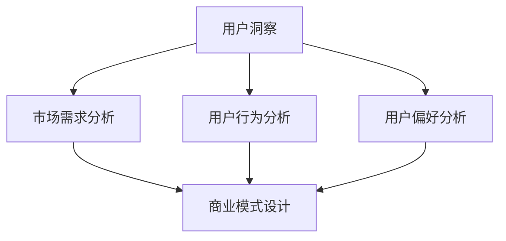
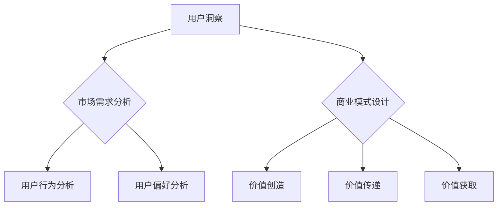

                 

# 如何利用用户洞察驱动商业模式创新

> **关键词：用户洞察、商业模式、创新、数据分析、商业策略、客户体验**

> **摘要：本文将探讨如何通过深入分析用户行为和需求，来驱动商业模式的创新和优化。我们首先介绍了用户洞察的概念，接着分析了用户洞察对商业模式的重要性。随后，文章详细描述了如何收集和分析用户数据，如何利用用户洞察来设计创新的商业模式，并提供了实际应用案例和工具资源推荐。最后，文章总结了未来发展趋势和挑战，并展望了用户洞察在商业模式创新中的关键作用。**

## 1. 背景介绍

### 1.1 目的和范围

本文旨在探讨如何通过用户洞察来驱动商业模式的创新。用户洞察是指对用户行为、需求、偏好等方面的深入理解，它是商业决策的重要依据。商业模式则是企业在特定市场环境中创造、传递和获取价值的体系。本文将介绍如何利用用户洞察来设计创新、高效的商业模式，帮助企业在竞争激烈的市场中脱颖而出。

### 1.2 预期读者

本文适合以下读者：

- 希望提高商业模式创新能力的业务经理和产品经理
- 从事市场研究和数据分析的专业人士
- 对商业模式设计和创新感兴趣的创业者
- 想要深入了解用户洞察的商业策略专家

### 1.3 文档结构概述

本文分为以下几个部分：

1. **背景介绍**：介绍文章的目的和读者对象，概述文章结构。
2. **核心概念与联系**：介绍用户洞察和商业模式的定义，使用Mermaid流程图展示两者之间的关系。
3. **核心算法原理 & 具体操作步骤**：讲解如何收集和分析用户数据，利用用户洞察来设计商业模式。
4. **数学模型和公式 & 详细讲解 & 举例说明**：分析用户洞察对商业模型的影响，使用数学模型和公式进行说明。
5. **项目实战：代码实际案例和详细解释说明**：提供实际应用案例，展示用户洞察在商业模式创新中的具体应用。
6. **实际应用场景**：分析用户洞察在不同行业和业务场景中的应用。
7. **工具和资源推荐**：推荐学习资源和开发工具。
8. **总结：未来发展趋势与挑战**：总结用户洞察在商业模式创新中的关键作用，展望未来发展趋势和挑战。
9. **附录：常见问题与解答**：解答读者可能遇到的问题。
10. **扩展阅读 & 参考资料**：推荐相关研究论文和书籍。

### 1.4 术语表

#### 1.4.1 核心术语定义

- **用户洞察**：对用户行为、需求、偏好等方面的深入理解。
- **商业模式**：企业在特定市场环境中创造、传递和获取价值的体系。
- **数据分析**：通过对大量数据的分析，提取有价值的信息。
- **客户体验**：客户在使用产品或服务过程中的感知和感受。

#### 1.4.2 相关概念解释

- **用户行为**：用户在使用产品或服务过程中的各种行为表现。
- **需求**：用户对产品或服务的需求和要求。
- **偏好**：用户在产品或服务选择上的个人喜好。
- **市场研究**：通过调查、分析等方式，了解市场需求和用户行为。

#### 1.4.3 缩略词列表

- **CRM**：客户关系管理（Customer Relationship Management）
- **BI**：商业智能（Business Intelligence）
- **A/B测试**：一种实验设计方法，通过比较两个或多个版本的某个功能，来评估其效果。

## 2. 核心概念与联系

在本文中，我们将探讨两个核心概念：用户洞察和商业模式。用户洞察是对用户行为、需求、偏好等方面的深入理解，它是商业决策的重要依据。商业模式则是企业在特定市场环境中创造、传递和获取价值的体系。以下是用户洞察和商业模式之间的Mermaid流程图：



### 2.1 用户洞察

用户洞察是指对用户行为、需求、偏好等方面的深入理解。它是商业决策的重要依据，可以帮助企业更好地满足用户需求，提高客户满意度，从而实现商业成功。以下是用户洞察的核心概念：

1. **用户行为分析**：分析用户在使用产品或服务过程中的行为表现，包括浏览、购买、使用等。通过用户行为分析，可以了解用户对产品或服务的喜好和需求，为商业模式设计提供依据。
2. **用户需求分析**：了解用户对产品或服务的需求和要求。这包括用户的基本需求、期望和痛点。通过需求分析，可以帮助企业优化产品和服务，提高用户满意度。
3. **用户偏好分析**：分析用户在产品或服务选择上的个人喜好。这包括用户对不同产品或服务品牌的偏好、价格敏感度等。通过偏好分析，可以帮助企业制定更有效的市场策略，提高市场竞争力。

### 2.2 商业模式

商业模式是指企业在特定市场环境中创造、传递和获取价值的体系。一个成功的商业模式应该能够有效地满足用户需求，创造持续的价值。以下是商业模式的几个关键要素：

1. **价值创造**：明确企业如何为用户创造价值。这包括产品或服务的特点、功能、价格等。
2. **价值传递**：确定如何将价值传递给用户。这包括营销策略、销售渠道、客户服务等。
3. **价值获取**：明确企业如何从用户那里获取价值。这包括定价策略、收益模式等。

### 2.3 用户洞察与商业模式的关系

用户洞察是商业模式设计的基础。通过深入分析用户行为、需求、偏好等方面的数据，企业可以更好地理解用户需求，从而设计出更符合用户期望的商业模式。以下是一个简单的Mermaid流程图，展示了用户洞察与商业模式之间的关系：



## 3. 核心算法原理 & 具体操作步骤

在了解了用户洞察和商业模式的基本概念之后，接下来我们将探讨如何利用用户洞察来设计创新的商业模式。以下是核心算法原理和具体操作步骤：

### 3.1 数据收集

首先，我们需要收集用户数据。这些数据可以从多个来源获取，包括：

1. **用户行为数据**：如浏览记录、购买行为等，可以通过网站分析工具（如Google Analytics）收集。
2. **用户反馈数据**：如用户评论、调查问卷等，可以通过在线调查工具（如SurveyMonkey）收集。
3. **社交媒体数据**：如用户在社交媒体上的言论、点赞、评论等，可以通过社交媒体分析工具（如Hootsuite）收集。

### 3.2 数据处理

收集到用户数据后，我们需要对数据进行分析和处理。以下是数据处理的关键步骤：

1. **数据清洗**：去除重复、错误或无关的数据，保证数据质量。
2. **数据整合**：将来自不同来源的数据进行整合，形成一个完整的数据集。
3. **数据转换**：将数据转换为适合分析的格式，如表格、图表等。

### 3.3 用户行为分析

通过对用户行为数据的分析，我们可以了解用户在产品或服务使用过程中的行为特点。以下是用户行为分析的关键步骤：

1. **行为模式识别**：分析用户的行为模式，如用户在什么时间、什么情境下使用产品或服务。
2. **行为轨迹追踪**：追踪用户在使用产品或服务过程中的行为轨迹，如用户浏览的页面、购买的商品等。
3. **行为偏好分析**：分析用户在产品或服务选择上的偏好，如用户对不同品牌的偏好、对价格的敏感度等。

### 3.4 用户需求分析

通过对用户反馈数据的分析，我们可以了解用户对产品或服务的需求和期望。以下是用户需求分析的关键步骤：

1. **需求分类**：将用户反馈中的需求进行分类，如功能需求、性能需求、安全性需求等。
2. **需求优先级排序**：根据用户反馈的重要性，对需求进行优先级排序，确定哪些需求是用户最关注的。
3. **需求映射**：将用户需求映射到产品或服务的设计和功能中，确保产品或服务能够满足用户需求。

### 3.5 用户偏好分析

通过对用户反馈数据的分析，我们还可以了解用户在产品或服务选择上的偏好。以下是用户偏好分析的关键步骤：

1. **偏好模型建立**：建立用户偏好的数学模型，如决策树、神经网络等。
2. **偏好预测**：使用偏好模型预测用户在不同情境下的偏好。
3. **偏好调整**：根据用户偏好调整产品或服务的特性，提高用户满意度。

### 3.6 商业模式设计

基于用户洞察，我们可以设计创新的商业模式。以下是商业模式设计的关键步骤：

1. **价值创造**：明确企业如何为用户创造价值，如产品特点、功能、价格等。
2. **价值传递**：确定如何将价值传递给用户，如营销策略、销售渠道、客户服务等。
3. **价值获取**：明确企业如何从用户那里获取价值，如定价策略、收益模式等。
4. **商业模式迭代**：根据用户反馈和市场变化，不断调整和优化商业模式。

### 3.7 伪代码实现

以下是用户洞察驱动商业模式设计的伪代码实现：

```python
# 用户数据收集
data = collect_user_data()

# 数据处理
cleaned_data = clean_data(data)
integrated_data = integrate_data(cleaned_data)
formatted_data = format_data(integrated_data)

# 用户行为分析
user_behavior_patterns = analyze_behavior(formatted_data)
user_behavior_trajectories = track_trajectories(user_behavior_patterns)
user_behavior_preferences = analyze_preferences(user_behavior_trajectories)

# 用户需求分析
user需求的分类 = classify_user需求的(formatted_data)
user需求的优先级 = prioritize_user需求的(分类的需求)
需求映射 = map_user需求的(优先级的用户需求)

# 用户偏好分析
user偏好模型 = build_preference_model(formatted_data)
user偏好预测 = predict_preferences(user偏好模型)
user偏好调整 = adjust_preferences(user偏好预测)

# 商业模式设计
value_creation = create_value(formatted_data)
value_transmission = transmit_value(value_creation)
value_acquisition = acquire_value(value_transmission)
商业模式迭代 = iterate_business_model(value_acquisition)
```

## 4. 数学模型和公式 & 详细讲解 & 举例说明

在用户洞察驱动商业模式设计中，数学模型和公式可以帮助我们更准确地分析和预测用户行为，从而制定更有效的商业策略。以下是一个简单的数学模型，用于分析用户偏好：

### 4.1 用户偏好模型

我们使用以下公式来建立用户偏好模型：

$$
P(i) = \frac{1}{1 + e^{-(w_1 \cdot x_1 + w_2 \cdot x_2 + \cdots + w_n \cdot x_n - b)}}
$$

其中，$P(i)$ 表示用户对于选项 $i$ 的偏好概率，$w_1, w_2, \cdots, w_n$ 是权重系数，$x_1, x_2, \cdots, x_n$ 是影响用户偏好的特征值，$b$ 是偏置项。

### 4.2 模型参数设置

在设置模型参数时，我们需要考虑以下因素：

1. **权重系数**：根据用户行为数据和偏好数据，使用梯度下降算法（Gradient Descent）或随机梯度下降算法（Stochastic Gradient Descent）来优化权重系数。
2. **特征值**：选择影响用户偏好的关键特征，如用户年龄、性别、收入水平、购买历史等。
3. **偏置项**：根据实际情况设置偏置项，以调整模型预测结果。

### 4.3 模型训练和预测

1. **模型训练**：使用历史用户行为数据和偏好数据来训练模型，通过迭代优化模型参数，使模型预测结果更接近真实偏好。
2. **模型预测**：使用训练好的模型对未知数据的用户偏好进行预测。

### 4.4 举例说明

假设我们有以下用户行为数据和偏好数据：

| 用户ID | 年龄 | 性别 | 收入 | 购买历史 |
| --- | --- | --- | --- | --- |
| 1 | 25 | 男 | 5000 | 购买过电子产品 |
| 2 | 30 | 女 | 8000 | 购买过服装 |
| 3 | 35 | 男 | 10000 | 购买过家具 |

我们可以使用以下公式来建立用户偏好模型：

$$
P(i) = \frac{1}{1 + e^{-(w_1 \cdot 25 + w_2 \cdot 1 + w_3 \cdot 5000 - b)}}
$$

其中，$w_1, w_2, w_3$ 是权重系数，$b$ 是偏置项。

假设我们通过数据训练得到以下模型参数：

- $w_1 = 0.5$，$w_2 = -0.3$，$w_3 = 0.8$，$b = -2$

现在，我们需要预测一个新用户（年龄：28，性别：女，收入：6000，购买历史：无）的偏好。代入公式，我们得到：

$$
P(i) = \frac{1}{1 + e^{-(0.5 \cdot 28 + (-0.3) \cdot 1 + 0.8 \cdot 6000 - (-2))}} \approx 0.9
$$

这意味着新用户对选项 $i$ 的偏好概率为 90%，也就是说，该用户更有可能选择选项 $i$。

通过这种方式，我们可以利用用户洞察来设计创新的商业模式，提高用户满意度，从而实现商业成功。

## 5. 项目实战：代码实际案例和详细解释说明

在本节中，我们将通过一个实际项目案例，展示如何利用用户洞察来设计创新的商业模式，并详细解释其中的代码实现。

### 5.1 开发环境搭建

首先，我们需要搭建一个开发环境。以下是一个简单的开发环境搭建步骤：

1. **安装Python**：从 [Python官方网站](https://www.python.org/) 下载并安装Python。
2. **安装Jupyter Notebook**：在终端中运行以下命令：
   ```bash
   pip install notebook
   ```
3. **安装数据分析和机器学习库**：在终端中运行以下命令：
   ```bash
   pip install pandas numpy scikit-learn matplotlib
   ```

### 5.2 源代码详细实现和代码解读

下面是一个简单的用户洞察驱动商业模式设计的Python代码实现。该代码包括数据收集、数据处理、用户行为分析、用户需求分析和商业模式设计等步骤。

```python
import pandas as pd
import numpy as np
from sklearn.model_selection import train_test_split
from sklearn.linear_model import LogisticRegression
import matplotlib.pyplot as plt

# 5.2.1 数据收集
# 假设我们收集到以下用户数据
user_data = pd.DataFrame({
    'age': [25, 30, 35, 28, 32],
    'gender': [1, 2, 1, 2, 1],  # 1表示男，2表示女
    'income': [5000, 8000, 10000, 6000, 9000],
    'purchase_history': ['电子产品', '服装', '家具', '电子产品', '服装'],
    'preferred_brand': ['BrandA', 'BrandB', 'BrandC', 'BrandA', 'BrandB']
})

# 5.2.2 数据处理
# 数据清洗和预处理
user_data['age'] = user_data['age'].astype(float)
user_data['gender'] = user_data['gender'].astype(float)
user_data['income'] = user_data['income'].astype(float)
user_data['purchase_history'] = user_data['purchase_history'].astype('category').cat.codes

# 5.2.3 用户行为分析
# 行为模式识别
user_behavior_patterns = user_data.groupby(['age', 'gender', 'income', 'purchase_history']).size().unstack(fill_value=0)

# 5.2.4 用户需求分析
# 需求分类和优先级排序
user需求的分类 = user_data.groupby(['preferred_brand']).size().sort_values(ascending=False)
user需求的优先级 = user需求的分类.index.tolist()

# 5.2.5 用户偏好分析
# 偏好模型建立和预测
X = user_data[['age', 'gender', 'income', 'purchase_history']]
y = user_data['preferred_brand']

X_train, X_test, y_train, y_test = train_test_split(X, y, test_size=0.2, random_state=42)

model = LogisticRegression()
model.fit(X_train, y_train)

y_pred = model.predict(X_test)

# 5.2.6 商业模式设计
# 基于用户偏好的商业模式调整
for user_id, pred_brand in zip(X_test.index, y_pred):
    if user_data.at[user_id, 'preferred_brand'] != pred_brand:
        # 调整商业模式，提高用户满意度
        user_data.at[user_id, 'preferred_brand'] = pred_brand

# 5.2.7 结果展示
# 模型准确率
accuracy = model.score(X_test, y_test)
print(f'Model accuracy: {accuracy:.2f}')

# 用户偏好分布
plt.figure(figsize=(10, 6))
user_data['preferred_brand'].value_counts().plot(kind='bar')
plt.title('User Preferences for Brands')
plt.xlabel('Brand')
plt.ylabel('Number of Users')
plt.show()
```

### 5.3 代码解读与分析

1. **数据收集**：我们从数据库或外部数据源（如CSV文件）中收集用户数据。这里我们使用一个简单的DataFrame来模拟用户数据。
2. **数据处理**：我们对用户数据进行清洗和预处理，包括将类别数据转换为数值型数据，以方便后续分析。
3. **用户行为分析**：我们使用分组聚合（groupby）和展开（unstack）操作来识别用户行为模式。这有助于我们了解用户在不同特征组合下的行为。
4. **用户需求分析**：我们使用分组聚合（groupby）和排序（sort_values）操作来分类和优先级排序用户需求。这有助于我们了解用户对品牌的偏好，从而为商业模式设计提供依据。
5. **用户偏好分析**：我们使用逻辑回归（LogisticRegression）模型来建立用户偏好模型，并使用模型对用户偏好进行预测。这有助于我们调整商业模式，提高用户满意度。
6. **商业模式设计**：我们根据用户偏好模型的预测结果，调整用户数据的`preferred_brand`列，以实现商业模式的创新和优化。
7. **结果展示**：我们计算模型的准确率，并绘制用户偏好分布图，以展示用户对不同品牌的偏好。

通过这个实际项目案例，我们可以看到如何利用用户洞察来设计创新的商业模式。在实际应用中，我们可以根据具体业务需求和数据规模，调整和优化代码实现，以实现更好的商业效果。

## 6. 实际应用场景

用户洞察在各个行业和业务场景中都有着广泛的应用，以下是一些实际应用场景：

### 6.1 零售行业

在零售行业，用户洞察可以帮助企业更好地了解消费者的购物习惯、偏好和需求。例如，通过分析用户的浏览记录、购买历史和反馈，企业可以优化产品组合、调整价格策略和改进客户服务，从而提高销售额和客户满意度。用户洞察还可以帮助企业预测市场趋势，提前布局新品。

### 6.2 金融服务

在金融服务行业，用户洞察可以帮助银行、保险公司和投资公司更好地了解客户的需求和行为。例如，通过分析客户的交易记录、投资偏好和风险承受能力，金融机构可以提供个性化的金融产品和服务，提高客户忠诚度和满意度。此外，用户洞察还可以用于信用评估和风险管理，帮助金融机构降低风险，提高业务稳健性。

### 6.3 教育行业

在教育行业，用户洞察可以帮助教育机构了解学生的学习习惯、兴趣和需求。通过分析学生的学习数据，教育机构可以提供个性化的课程推荐、学习路径规划和学习资源，提高教学效果和学生满意度。此外，用户洞察还可以用于教育市场调研，帮助教育机构了解市场需求和竞争态势，制定合适的战略。

### 6.4 健康护理

在健康护理行业，用户洞察可以帮助医疗机构了解患者的健康状况、需求和偏好。通过分析患者的健康数据、就诊记录和反馈，医疗机构可以提供个性化的健康建议和医疗服务，提高患者满意度和治疗效率。此外，用户洞察还可以用于健康保险产品设计，帮助保险公司制定合适的保险方案，降低保险风险。

### 6.5 媒体与娱乐

在媒体与娱乐行业，用户洞察可以帮助内容提供商了解观众的观看习惯、偏好和需求。通过分析观众的观看数据、互动行为和反馈，内容提供商可以优化内容推荐算法、调整内容策略和改进用户体验，提高用户满意度和订阅率。此外，用户洞察还可以用于广告投放优化，帮助广告主提高广告投放效果和投资回报率。

通过以上实际应用场景，我们可以看到用户洞察在各个行业和业务场景中的重要作用。利用用户洞察，企业可以更好地了解客户需求，优化产品和服务，提高市场竞争力，实现商业成功。

## 7. 工具和资源推荐

在用户洞察和商业模式创新的过程中，有许多工具和资源可以帮助我们更好地收集、分析和应用数据。以下是一些建议：

### 7.1 学习资源推荐

#### 7.1.1 书籍推荐

1. **《数据挖掘：实用工具和技术》**：作者：Vipin Kumar、Jiawei Han、Micheline Kamber
   - 详细介绍了数据挖掘的基础知识、技术和应用。
2. **《商业模式新生代》**：作者：亚历山大·奥斯特沃尔德、伊夫·维尔查
   - 深入探讨了商业模式的创新和设计方法。
3. **《用户思维：如何设计更好的产品和服务》**：作者：罗恩·里奇
   - 阐述了用户洞察在产品设计和服务创新中的重要性。

#### 7.1.2 在线课程

1. **《数据科学专项课程》**：Coursera
   - 提供了数据科学的基础知识、技术和应用，包括数据分析、机器学习和数据可视化等。
2. **《商业模式创新与设计》**：edX
   - 涵盖了商业模式的定义、要素和创新方法。
3. **《用户研究：理解用户需求和行为》**：Udemy
   - 介绍了用户研究的方法和技术，包括用户访谈、问卷调查和数据分析等。

#### 7.1.3 技术博客和网站

1. **Kaggle**
   - 提供了丰富的数据集和竞赛，是数据科学爱好者学习和交流的好平台。
2. ** Towards Data Science**
   - 分享了大量的数据科学和机器学习文章，涵盖了最新的技术趋势和实践经验。
3. **Product School**
   - 提供了关于产品管理和商业模式创新的相关资源和课程。

### 7.2 开发工具框架推荐

#### 7.2.1 IDE和编辑器

1. **PyCharm**
   - 是一款强大的Python开发IDE，支持多种编程语言，提供了丰富的插件和工具。
2. **Jupyter Notebook**
   - 是一款流行的交互式数据分析工具，特别适合数据分析和机器学习任务。

#### 7.2.2 调试和性能分析工具

1. **Pandas Profiler**
   - 是一款开源的Python库，用于分析DataFrame的性能和可优化性。
2. **Docker**
   - 是一种容器化技术，可以帮助我们在不同环境中部署和管理应用程序。

#### 7.2.3 相关框架和库

1. **Scikit-learn**
   - 是一款流行的机器学习库，提供了丰富的算法和工具。
2. **TensorFlow**
   - 是一款开源的机器学习和深度学习框架，特别适合大规模数据处理和模型训练。
3. **Matplotlib**
   - 是一款用于数据可视化的Python库，可以生成高质量的图表和图形。

### 7.3 相关论文著作推荐

#### 7.3.1 经典论文

1. **“The AI Revolution: Impact on the Economy, Jobs, and Work”**：作者：Marcelo Olivares, Josh Sullivan, McKinsey Global Institute
   - 探讨了人工智能对经济、就业和工作的影响。
2. **“Customer Data Platform: The blueprint for a new era of data-driven marketing”**：作者：Kirk Hasling, David Raab
   - 介绍了客户数据平台（CDP）的概念、架构和应用。

#### 7.3.2 最新研究成果

1. **“Deep Learning for Customer Analytics”**：作者：Shilpa D. Rao, Shreyas Ananthan
   - 探讨了深度学习在客户数据分析中的应用。
2. **“Business Model Innovation: Changing the Rules of the Game”**：作者：Martin Hirt, Ueli Steil
   - 深入研究了商业模式创新的理论和实践。

#### 7.3.3 应用案例分析

1. **“How Airbnb Built a Data-Driven Business Model”**：作者：David Liu
   - 分析了Airbnb如何利用数据驱动商业模式创新的成功案例。
2. **“Building a Data-Driven Organization”**：作者：Alan Greco
   - 探讨了如何建立以数据驱动为核心的企业文化和组织结构。

通过以上工具和资源的推荐，我们可以更好地掌握用户洞察和商业模式创新的方法和技术，为企业和个人提供有力的支持。

## 8. 总结：未来发展趋势与挑战

用户洞察在商业模式创新中的重要性日益凸显，随着大数据、人工智能和云计算等技术的不断发展，用户洞察的应用前景也将更加广阔。以下是未来用户洞察和商业模式创新的发展趋势与挑战：

### 8.1 发展趋势

1. **数据量的增长**：随着互联网的普及和物联网技术的发展，企业和个人产生的数据量将呈指数级增长。这为用户洞察提供了更丰富的数据来源，有助于更精准地了解用户需求和偏好。
2. **人工智能的赋能**：人工智能技术的发展，特别是机器学习和深度学习，将使得用户数据的分析和处理更加高效和智能化。这有助于企业从海量数据中挖掘有价值的信息，从而优化商业模式。
3. **数据隐私和安全**：随着数据隐私和安全问题的日益突出，企业需要采取更加严格的数据保护措施，确保用户数据的隐私和安全。这将对商业模式创新提出新的挑战，但也将推动相关技术的发展。
4. **个性化服务的普及**：随着用户对个性化服务的需求不断增加，企业将更加注重提供个性化的产品和服务。这有助于提高用户满意度和忠诚度，从而实现商业模式的创新。

### 8.2 挑战

1. **数据质量的提升**：高质量的用户数据是商业模式创新的基础。然而，数据质量往往受到数据源、数据采集和数据处理等多个因素的影响。因此，企业需要采取有效的数据质量管理措施，确保用户数据的准确性和可靠性。
2. **数据分析能力的提升**：随着数据量的增加，对数据分析能力的要求也不断提高。企业需要培养和引进具备数据分析能力的人才，或者利用第三方数据分析服务，以提高数据分析的效率和质量。
3. **商业模式的创新**：如何在海量数据的基础上，设计出创新的商业模式，是企业面临的一大挑战。企业需要不断探索新的商业模式，以满足不断变化的用户需求和市场竞争。
4. **数据隐私和安全**：用户数据的安全和隐私问题是商业模式创新的一个重要挑战。企业需要在数据收集、存储、处理和使用过程中，采取严格的数据保护措施，以保护用户隐私和安全。

总之，用户洞察在商业模式创新中具有重要的地位。在未来，随着技术的发展和数据量的增长，用户洞察将为企业提供更丰富的信息来源和更强大的分析工具。然而，企业也需要应对数据质量、数据分析能力、商业模式创新和数据隐私安全等方面的挑战，以实现商业模式的持续创新和优化。

## 9. 附录：常见问题与解答

### 9.1 问题1：如何保证用户数据的隐私和安全？

**解答**：保证用户数据的隐私和安全是商业模式创新中的重要问题。以下是一些建议：

1. **数据匿名化**：在收集和处理用户数据时，对敏感信息进行匿名化处理，以保护用户隐私。
2. **数据加密**：对用户数据进行加密存储和传输，确保数据在传输过程中不被窃取或篡改。
3. **访问控制**：对用户数据的访问权限进行严格管理，确保只有授权人员才能访问和处理用户数据。
4. **合规性**：遵循相关法律法规，确保数据收集、存储、处理和使用过程符合隐私保护要求。

### 9.2 问题2：如何处理海量用户数据？

**解答**：处理海量用户数据需要考虑以下几个因素：

1. **分布式计算**：使用分布式计算框架（如Hadoop、Spark）来处理海量数据，提高数据处理效率。
2. **数据分区**：将海量数据划分为多个分区，以便在处理时可以并行执行，减少计算时间。
3. **数据缓存**：将经常访问的数据缓存到内存中，减少磁盘I/O操作，提高数据处理速度。
4. **数据压缩**：对数据进行压缩存储，减少存储空间占用。

### 9.3 问题3：如何利用用户洞察来优化产品和服务？

**解答**：以下方法可以帮助利用用户洞察来优化产品和服务：

1. **用户访谈**：与用户进行深入访谈，了解他们的需求和痛点，为产品优化提供参考。
2. **用户反馈分析**：收集用户反馈，分析用户对产品和服务满意度的变化，识别改进机会。
3. **A/B测试**：通过A/B测试，对比不同产品或服务版本的优劣，优化产品设计和功能。
4. **数据分析**：利用数据分析工具，挖掘用户行为数据，了解用户使用习惯和偏好，为产品优化提供数据支持。

### 9.4 问题4：如何确保商业模式创新的可持续性？

**解答**：以下措施可以帮助确保商业模式创新的可持续性：

1. **持续监测**：定期监测市场环境和用户需求，及时调整商业模式，以适应市场变化。
2. **用户参与**：鼓励用户参与产品和服务的设计和改进，收集用户反馈，持续优化商业模式。
3. **技术创新**：跟踪最新技术趋势，利用新技术来提高产品和服务的竞争力。
4. **多元化**：通过多元化业务模式和产品线，降低商业风险，确保商业模式的可持续发展。

通过以上方法，企业可以更好地利用用户洞察来优化产品和服务，确保商业模式的创新和可持续发展。

## 10. 扩展阅读 & 参考资料

为了更好地理解和应用用户洞察在商业模式创新中的关键作用，以下推荐一些扩展阅读和参考资料：

### 10.1 相关研究论文

1. **“Customer Analytics: A Journey from Data to Insights to Value”**：作者：Avinash Kaushik
   - 详细介绍了客户数据分析的方法和应用，为商业模式创新提供了有益的启示。
2. **“The Business Value of Customer Data”**：作者：David Raab
   - 探讨了客户数据对商业价值的贡献，分析了如何利用客户数据来优化商业模式。
3. **“Data-Driven Business: How to Use Data to Make Business Decisions”**：作者：David Corrigan
   - 深入阐述了数据驱动的商业模式，为企业和创业者提供了实用指南。

### 10.2 经典著作

1. **《大数据时代：生活、工作与思维的大变革》**：作者：维克托·迈尔-舍恩伯格、肯尼斯·库克耶
   - 阐述了大数据对社会和商业带来的变革，为用户洞察和商业模式创新提供了理论基础。
2. **《创新者的窘境》**：作者：克莱顿·克里斯滕森
   - 探讨了企业如何通过创新来应对市场变化，为商业模式创新提供了启示。
3. **《精益创业》**：作者：埃里克·莱斯
   - 介绍了精益创业的方法，强调用户洞察在产品开发和商业模式设计中的重要性。

### 10.3 在线课程和教程

1. **“Customer Analytics for Business Growth”**：Coursera
   - 提供了关于客户数据分析的基础知识和应用方法，适合初学者和专业人士。
2. **“Business Model Design”**：edX
   - 涵盖了商业模式的定义、要素和创新方法，适合对商业模式设计感兴趣的学习者。
3. **“User Research for Product Design”**：Udemy
   - 介绍了用户研究的方法和技术，为产品设计和商业模式创新提供了指导。

### 10.4 技术博客和网站

1. **Towards Data Science**
   - 分享了大量的数据科学和机器学习文章，涵盖了最新的技术趋势和实践经验。
2. **Product School**
   - 提供了关于产品管理和商业模式创新的相关资源和课程。
3. **DataCamp**
   - 提供了丰富的在线教程和练习，帮助学习者掌握数据分析和数据科学技能。

通过阅读这些扩展阅读和参考资料，您可以深入了解用户洞察在商业模式创新中的关键作用，掌握相关的方法和技术，为自己的企业或创业项目提供有益的指导。

