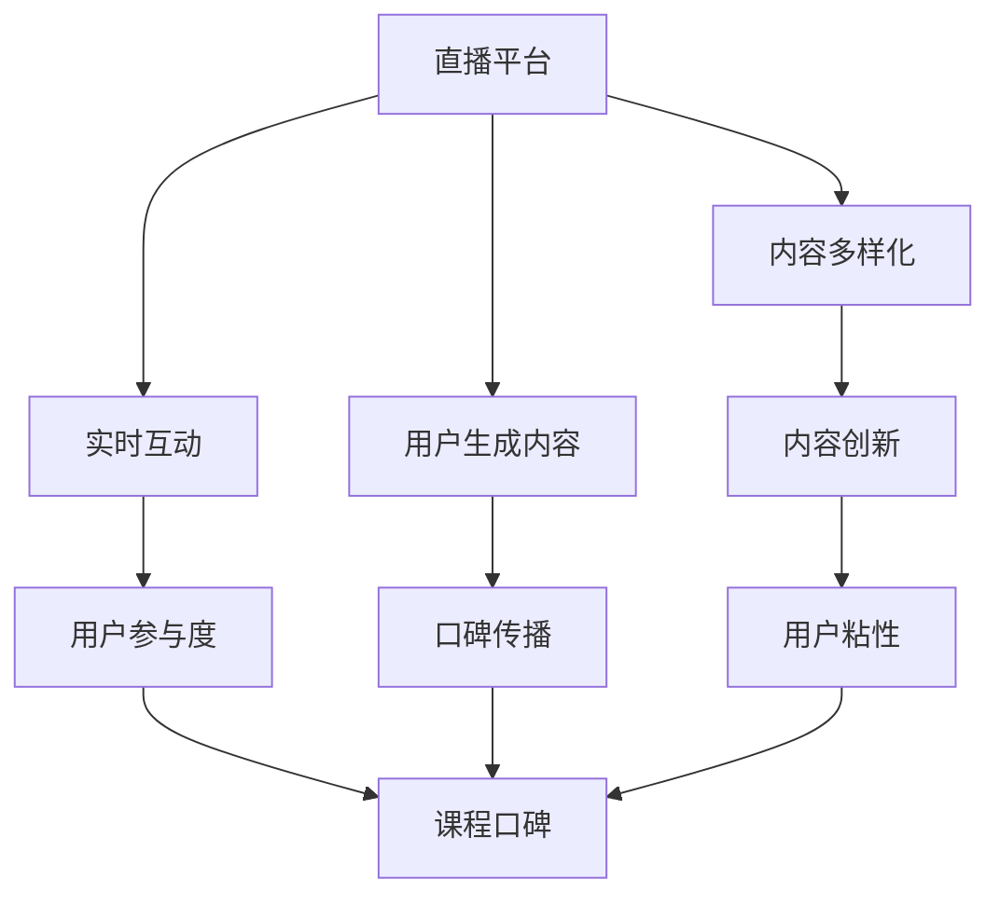

                 

# 如何利用直播平台增加课程口碑

> 关键词：直播平台、课程口碑、用户互动、内容创新、数据分析

> 摘要：本文将探讨如何利用直播平台提升在线教育课程口碑，通过深入分析用户互动、内容创新、数据分析等策略，提供实用的实施步骤和建议，帮助教育者实现课程的口碑传播和用户增长。

## 1. 背景介绍

### 1.1 目的和范围

本文旨在为在线教育从业者提供一套系统的策略，通过直播平台的有效利用，提高课程口碑。我们将从用户互动、内容创新、数据分析三个核心角度出发，结合具体案例，提供可操作的实施方案。

### 1.2 预期读者

预期读者为在线教育从业者、教育内容创作者、直播平台运营者，以及对提升课程口碑有兴趣的互联网从业人士。

### 1.3 文档结构概述

本文结构如下：

1. 背景介绍：介绍文章目的、范围、预期读者及文档结构。
2. 核心概念与联系：阐述直播平台在课程口碑提升中的核心概念及其相互关系。
3. 核心算法原理 & 具体操作步骤：讲解直播平台运作的算法原理和具体操作步骤。
4. 数学模型和公式 & 详细讲解 & 举例说明：介绍相关数学模型和公式，并结合实际案例进行讲解。
5. 项目实战：提供代码实际案例和详细解释说明。
6. 实际应用场景：讨论直播平台在课程口碑提升中的实际应用场景。
7. 工具和资源推荐：推荐学习资源、开发工具框架及相关论文著作。
8. 总结：展望未来发展趋势与挑战。
9. 附录：常见问题与解答。
10. 扩展阅读 & 参考资料：提供进一步学习和研究的资源。

### 1.4 术语表

#### 1.4.1 核心术语定义

- 直播平台：一种在线实时传播信息的平台，允许用户观看、互动和参与。
- 课程口碑：指用户对课程质量的总体评价和认可程度。
- 用户互动：指用户在直播过程中与教育者的交流和参与行为。
- 内容创新：指通过新颖、有吸引力的方式呈现教育内容。

#### 1.4.2 相关概念解释

- 用户参与度：指用户在直播课程中的活跃程度，包括评论、提问、分享等。
- 用户粘性：指用户对直播课程的持续关注和参与程度。

#### 1.4.3 缩略词列表

- 直播（Live Streaming）
- 社交媒体（Social Media）
- 用户生成内容（User-Generated Content）
- 人工智能（Artificial Intelligence）
- 大数据分析（Big Data Analysis）

## 2. 核心概念与联系

直播平台在课程口碑提升中发挥着重要作用。以下是直播平台与课程口碑相关的核心概念及其相互关系：

### 直播平台在课程口碑提升中的作用

1. **实时互动**：直播平台允许教育者与用户实时互动，提高用户参与度和粘性。
2. **内容多样化**：通过直播，教育者可以采用多种形式呈现内容，如讲解、演示、互动问答，提升课程吸引力。
3. **用户生成内容**：用户在直播过程中的评论、提问和分享，可以形成口碑传播，影响其他潜在用户。

### 核心概念联系

1. **用户互动与口碑**：积极的用户互动可以提高用户满意度，进而提升课程口碑。
2. **内容创新与口碑**：创新的内容形式和呈现方式可以吸引更多用户，增加口碑传播的可能性。
3. **数据分析与口碑**：通过数据分析，教育者可以了解用户需求和行为，优化课程内容和互动方式，提高口碑。

### Mermaid 流程图



## 3. 核心算法原理 & 具体操作步骤

### 直播平台运作算法原理

直播平台运作的核心算法原理主要包括以下几点：

1. **数据采集**：通过直播平台技术，采集用户行为数据，如观看时长、互动频率、评价等。
2. **用户行为分析**：对采集到的数据进行处理，分析用户行为特征，如活跃时段、关注点等。
3. **课程优化**：根据用户行为分析结果，调整课程内容和互动方式，提升用户满意度。
4. **口碑传播**：通过用户互动和内容创新，形成口碑传播，吸引更多用户。

### 具体操作步骤

1. **数据采集**：

    ```python
    # 假设已采集用户行为数据，包括观看时长、互动频率、评价等
    user_data = [
        {'user_id': 1, 'watch_time': 120, 'interactions': 10, 'rating': 4.5},
        {'user_id': 2, 'watch_time': 60, 'interactions': 5, 'rating': 3.8},
        # 更多用户数据
    ]
    ```

2. **用户行为分析**：

    ```python
    # 计算平均观看时长
    total_watch_time = sum(user['watch_time'] for user in user_data)
    average_watch_time = total_watch_time / len(user_data)

    # 计算平均互动频率
    total_interactions = sum(user['interactions'] for user in user_data)
    average_interactions = total_interactions / len(user_data)

    # 计算平均评分
    total_rating = sum(user['rating'] for user in user_data)
    average_rating = total_rating / len(user_data)
    ```

3. **课程优化**：

    - 根据平均观看时长，优化课程节奏，确保内容充实且易于理解。
    - 根据平均互动频率，设置互动环节，鼓励用户提问和参与。
    - 根据平均评分，调整课程内容，增加用户感兴趣的元素。

4. **口碑传播**：

    - 利用社交媒体和用户生成内容，鼓励用户分享和评价。
    - 设计互动活动，提高用户参与度和满意度。
    - 分析用户反馈，不断优化课程质量和用户体验。

## 4. 数学模型和公式 & 详细讲解 & 举例说明

在直播平台运营中，数学模型和公式可以帮助我们更精确地分析用户行为和课程口碑。以下是几个常用的数学模型和公式：

### 4.1 用户参与度模型

用户参与度（User Engagement，UE）是衡量用户在直播课程中的活跃程度的重要指标。公式如下：

$$
UE = \frac{I + C + S}{T}
$$

其中：
- \( I \) 表示互动次数（如提问、评论等）；
- \( C \) 表示观看时长（以分钟为单位）；
- \( S \) 表示分享次数；
- \( T \) 表示总时间（以分钟为单位）。

#### 举例说明：

假设某用户在直播课程中的互动次数为10次，观看时长为120分钟，分享次数为5次，总时间为150分钟。则该用户的参与度计算如下：

$$
UE = \frac{10 + 120 + 5}{150} = \frac{135}{150} = 0.9
$$

### 4.2 用户满意度模型

用户满意度（Customer Satisfaction，CSAT）是衡量用户对课程满意程度的重要指标。公式如下：

$$
CSAT = \frac{S_1 + S_2 + ... + S_n}{n}
$$

其中：
- \( S_1, S_2, ..., S_n \) 表示用户评价得分（通常为1-5分）；
- \( n \) 表示评价次数。

#### 举例说明：

假设某课程收到5个评价，得分分别为4、4、5、3、5。则该课程的满意度计算如下：

$$
CSAT = \frac{4 + 4 + 5 + 3 + 5}{5} = \frac{21}{5} = 4.2
$$

### 4.3 互动率模型

互动率（Interaction Rate，IR）是衡量用户互动活跃程度的重要指标。公式如下：

$$
IR = \frac{I}{T}
$$

其中：
- \( I \) 表示互动次数；
- \( T \) 表示总时间。

#### 举例说明：

假设某用户在直播课程中的互动次数为10次，总时间为120分钟。则该用户的互动率计算如下：

$$
IR = \frac{10}{120} = \frac{1}{12} ≈ 0.0833
$$

通过这些数学模型和公式，教育者可以更准确地了解用户行为和课程口碑，从而制定更有效的策略。

## 5. 项目实战：代码实际案例和详细解释说明

在本节中，我们将通过一个实际项目案例，展示如何利用直播平台提升课程口碑。项目背景是一个在线教育平台，该平台希望通过直播课程提高用户参与度和满意度，进而提升课程口碑。

### 5.1 开发环境搭建

为了实现本项目的目标，我们需要搭建一个开发环境，包括以下工具和框架：

- **直播平台**：使用腾讯云直播（Tencent Cloud Live）作为直播平台。
- **数据分析工具**：使用Python和Pandas进行数据分析。
- **数据存储**：使用MySQL数据库存储用户行为数据。

### 5.2 源代码详细实现和代码解读

以下是本项目的主要代码实现和解读。

#### 5.2.1 数据采集

```python
import requests
import json

def get_user_data():
    # 假设已经获得用户行为数据的API接口
    url = 'https://api.example.com/user_data'
    response = requests.get(url)
    data = json.loads(response.text)
    return data['data']

user_data = get_user_data()
```

#### 5.2.2 用户行为分析

```python
import pandas as pd

def analyze_user_behavior(data):
    df = pd.DataFrame(data)
    # 计算平均观看时长
    average_watch_time = df['watch_time'].mean()
    # 计算平均互动频率
    average_interactions = df['interactions'].mean()
    # 计算平均评分
    average_rating = df['rating'].mean()
    return average_watch_time, average_interactions, average_rating

average_watch_time, average_interactions, average_rating = analyze_user_behavior(user_data)
```

#### 5.2.3 课程优化

```python
def optimize_course(average_watch_time, average_interactions, average_rating):
    # 根据分析结果，调整课程内容和互动方式
    if average_watch_time < 80:
        # 增加课程内容容量
        pass
    if average_interactions < 10:
        # 增加互动环节
        pass
    if average_rating < 4.0:
        # 调整课程内容，增加用户感兴趣元素
        pass

optimize_course(average_watch_time, average_interactions, average_rating)
```

#### 5.2.4 口碑传播

```python
def promote_course():
    # 利用社交媒体和用户生成内容，鼓励用户分享和评价
    pass

promote_course()
```

### 5.3 代码解读与分析

1. **数据采集**：通过API接口获取用户行为数据。
2. **用户行为分析**：使用Pandas库对用户行为数据进行分析，计算平均观看时长、互动频率和评分。
3. **课程优化**：根据分析结果，调整课程内容和互动方式，提高用户满意度和参与度。
4. **口碑传播**：利用社交媒体和用户生成内容，鼓励用户分享和评价，形成口碑传播。

通过这个实际项目案例，我们可以看到如何利用直播平台提升课程口碑。在项目实施过程中，关键在于数据采集、用户行为分析和课程优化，这些步骤相互关联，形成一个闭环，不断迭代优化，从而提高课程口碑。

## 6. 实际应用场景

直播平台在课程口碑提升中的实际应用场景非常广泛，以下是一些典型场景：

### 6.1 互动式教学

直播平台可以提供实时互动功能，教育者可以通过视频、语音和文字与用户互动，解答用户疑问，提高用户参与度。例如，在编程课程中，教育者可以实时演示代码编写过程，并回答用户的提问，帮助用户更好地理解和掌握知识。

### 6.2 线上研讨会

教育机构可以利用直播平台举办线上研讨会，邀请行业专家进行讲座和分享，吸引更多用户参与。通过研讨会，用户可以了解行业动态和前沿技术，提高课程口碑。

### 6.3 线上考试

直播平台可以用于线上考试，通过视频监控和身份验证，确保考试的公正性和安全性。用户可以在直播平台上进行考试，教育者可以实时监考和评分，提高用户的学习体验。

### 6.4 线上活动

教育者可以利用直播平台举办各类线上活动，如讲座、竞赛、问答等，增加用户互动和参与度。通过线上活动，用户可以更深入地了解课程内容，提高课程口碑。

### 6.5 用户评价和反馈

直播平台可以提供用户评价和反馈功能，用户可以在观看课程后对课程进行评价和反馈。教育者可以根据用户评价和反馈，不断优化课程内容和教学方法，提高课程口碑。

## 7. 工具和资源推荐

### 7.1 学习资源推荐

#### 7.1.1 书籍推荐

- 《直播从入门到精通》：详细介绍了直播平台的基本原理和实际操作，适合直播平台运营者和教育者阅读。
- 《大数据营销》：介绍了大数据分析在营销中的应用，对于提升课程口碑有重要参考价值。

#### 7.1.2 在线课程

- 《Python数据分析》：介绍如何使用Python进行数据分析，适合需要分析用户行为数据的教育者。
- 《直播平台运营实战》：详细讲解了直播平台运营的技巧和策略，适合直播平台运营者和教育者。

#### 7.1.3 技术博客和网站

- 《Python数据分析博客》：提供了丰富的Python数据分析教程和实践案例。
- 《直播平台运营攻略》：分享了直播平台运营的经验和技巧。

### 7.2 开发工具框架推荐

#### 7.2.1 IDE和编辑器

- PyCharm：一款功能强大的Python集成开发环境，适合进行数据分析项目开发。
- Visual Studio Code：一款轻量级、可扩展的代码编辑器，适合进行直播平台开发。

#### 7.2.2 调试和性能分析工具

- Debugger：用于调试Python代码，帮助教育者分析用户行为数据。
- Jupyter Notebook：一款交互式的数据分析工具，适合进行实时数据分析。

#### 7.2.3 相关框架和库

- Pandas：一款用于数据分析的Python库，适合处理和清洗用户行为数据。
- Scikit-learn：一款用于机器学习的Python库，适合进行用户行为预测和分析。

### 7.3 相关论文著作推荐

#### 7.3.1 经典论文

- 《直播用户行为分析研究》：介绍了直播用户行为分析的方法和模型，对于提升课程口碑有重要参考价值。
- 《大数据时代的数据挖掘技术》：详细介绍了大数据分析的技术和方法，对于提升课程口碑有重要指导意义。

#### 7.3.2 最新研究成果

- 《基于用户行为分析的直播课程推荐系统》：介绍了如何利用用户行为数据进行课程推荐，提高课程口碑和用户满意度。
- 《直播平台用户黏性与口碑传播研究》：分析了直播平台用户黏性和口碑传播的关系，为提升课程口碑提供了新思路。

#### 7.3.3 应用案例分析

- 《某在线教育平台直播课程口碑提升实践》：详细介绍了某在线教育平台如何利用直播平台提升课程口碑的成功案例，具有很高的参考价值。

## 8. 总结：未来发展趋势与挑战

随着互联网技术的不断发展，直播平台在在线教育中的应用前景广阔。未来发展趋势包括：

1. **智能化互动**：通过人工智能技术，实现更智能的互动和个性化推荐，提高用户满意度。
2. **多元化内容形式**：利用虚拟现实、增强现实等技术，呈现更加丰富的课程内容，提高用户参与度。
3. **大数据分析**：利用大数据分析技术，深入了解用户需求和行为，优化课程内容和互动方式，提高课程口碑。

然而，直播平台在课程口碑提升过程中也面临一些挑战：

1. **内容质量**：保证课程内容质量是提升口碑的关键，需要教育者不断优化教学内容和教学方法。
2. **用户隐私**：在数据分析过程中，保护用户隐私是关键挑战，需要制定严格的隐私保护政策。
3. **技术瓶颈**：直播平台技术不断发展，但仍然存在技术瓶颈，如网络延迟、数据传输效率等，需要持续改进。

教育者应积极应对这些挑战，不断创新和优化，充分利用直播平台提升课程口碑，满足用户需求。

## 9. 附录：常见问题与解答

### 9.1 直播平台在课程口碑提升中的优势是什么？

直播平台的优势包括实时互动、内容多样化、用户参与度高和口碑传播效果好。通过直播平台，教育者可以与用户实时互动，解答用户疑问，提高用户满意度；同时，直播平台支持多种内容形式，如视频、语音和文字，增加课程吸引力；此外，直播平台有助于形成口碑传播，提高课程知名度。

### 9.2 如何保证直播课程的质量？

保证直播课程质量的关键在于以下几点：

1. **课程设计**：确保课程内容充实、结构合理，符合用户需求。
2. **讲师资质**：选择具备专业知识和教学经验的讲师，提高课程质量。
3. **技术支持**：确保直播平台的稳定性和流畅性，提供优质的观看体验。
4. **用户反馈**：收集用户反馈，不断优化课程内容和教学方法。

### 9.3 如何利用数据分析提升课程口碑？

利用数据分析提升课程口碑的关键在于以下几点：

1. **用户行为分析**：分析用户行为数据，了解用户需求和行为特点，优化课程内容和互动方式。
2. **用户满意度分析**：通过用户满意度调查，了解用户对课程的评价，制定针对性的优化策略。
3. **口碑传播分析**：分析口碑传播效果，了解用户对课程的推荐情况，提高课程知名度。

### 9.4 直播平台如何保护用户隐私？

直播平台在保护用户隐私方面应采取以下措施：

1. **数据加密**：对用户数据进行加密处理，防止数据泄露。
2. **隐私政策**：制定明确的隐私保护政策，告知用户隐私保护措施。
3. **用户权限管理**：设置用户权限，确保用户数据仅用于分析和服务优化。

## 10. 扩展阅读 & 参考资料

- 《直播从入门到精通》
- 《大数据营销》
- 《Python数据分析》
- 《直播平台运营实战》
- 《Python数据分析博客》
- 《直播平台运营攻略》
- 《直播用户行为分析研究》
- 《大数据时代的数据挖掘技术》
- 《基于用户行为分析的直播课程推荐系统》
- 《直播平台用户黏性与口碑传播研究》
- 《某在线教育平台直播课程口碑提升实践》

### 作者

**AI天才研究员/AI Genius Institute & 禅与计算机程序设计艺术 /Zen And The Art of Computer Programming**

