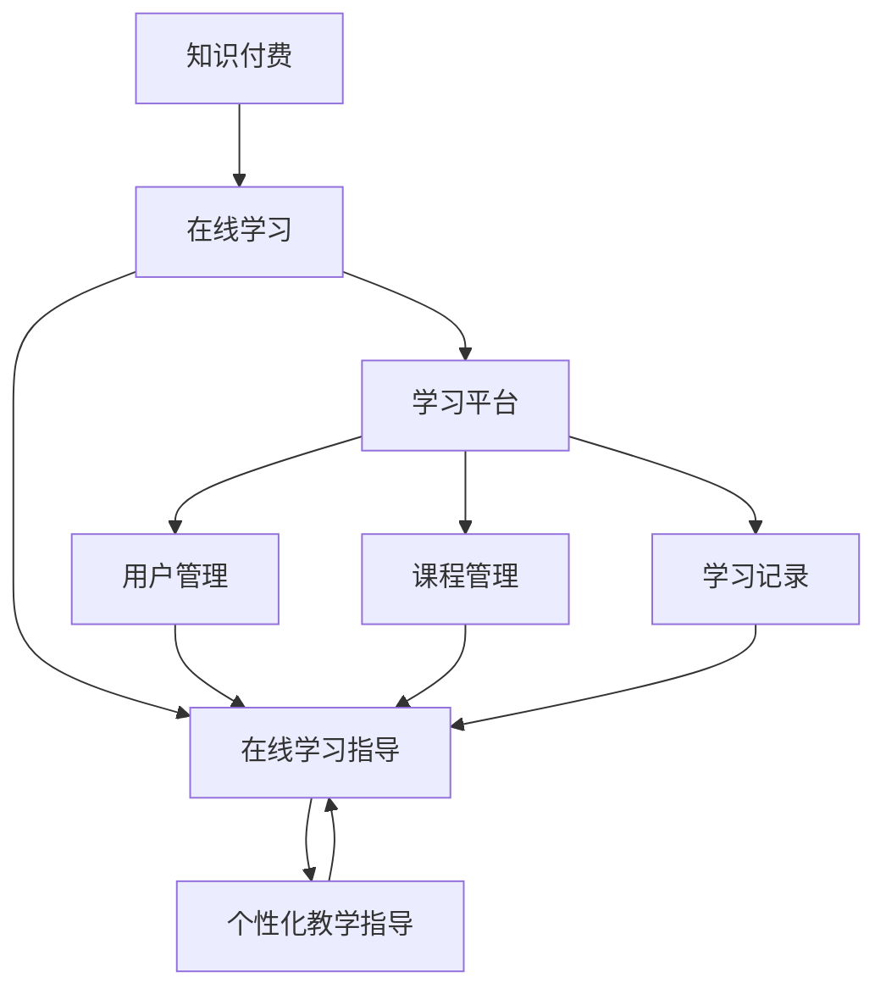

                 

# 如何利用知识付费实现在线学习与在线学习指导？

> 关键词：知识付费、在线学习、在线学习指导、教育科技、学习平台、用户参与、个性化教学、算法推荐

> 摘要：本文深入探讨了知识付费在在线学习领域的应用，通过构建在线学习平台和提供个性化教学指导，实现高效的学习体验。文章从背景介绍、核心概念、算法原理、数学模型、项目实战、应用场景等多个角度展开，为读者提供了全面的解决方案和分析。

## 1. 背景介绍

### 1.1 目的和范围

本文旨在探讨知识付费在在线学习领域的应用，通过构建一个集学习、指导和互动于一体的在线学习平台，为用户提供个性化的学习体验。本文将覆盖以下几个主要方面：

- **核心概念与联系**：介绍知识付费、在线学习、在线学习指导等核心概念，并使用 Mermaid 流程图展示它们之间的联系。
- **核心算法原理 & 具体操作步骤**：详细讲解如何利用算法推荐和用户行为分析，实现个性化教学指导。
- **数学模型和公式 & 详细讲解 & 举例说明**：介绍相关的数学模型和公式，并给出实际应用案例。
- **项目实战：代码实际案例和详细解释说明**：通过具体代码实现，展示在线学习平台的搭建过程。
- **实际应用场景**：分析在线学习指导在不同领域中的应用场景和挑战。
- **工具和资源推荐**：推荐相关的学习资源、开发工具和框架。
- **总结：未来发展趋势与挑战**：探讨知识付费在线学习领域的发展趋势和面临的挑战。

### 1.2 预期读者

本文适合以下读者群体：

- **教育科技从业者**：关注在线学习平台的设计、开发和运营，希望通过本文了解知识付费在线学习的新模式。
- **编程爱好者**：对在线学习平台的技术实现感兴趣，希望掌握相关的算法原理和数学模型。
- **学生和学者**：希望利用在线学习平台进行自主学习和研究，了解个性化教学指导的方法和策略。

### 1.3 文档结构概述

本文采用以下结构进行组织：

1. **背景介绍**：介绍知识付费、在线学习、在线学习指导等核心概念。
2. **核心概念与联系**：使用 Mermaid 流程图展示核心概念之间的联系。
3. **核心算法原理 & 具体操作步骤**：详细讲解如何利用算法推荐和用户行为分析实现个性化教学指导。
4. **数学模型和公式 & 详细讲解 & 举例说明**：介绍相关的数学模型和公式，并给出实际应用案例。
5. **项目实战：代码实际案例和详细解释说明**：通过具体代码实现，展示在线学习平台的搭建过程。
6. **实际应用场景**：分析在线学习指导在不同领域中的应用场景和挑战。
7. **工具和资源推荐**：推荐相关的学习资源、开发工具和框架。
8. **总结：未来发展趋势与挑战**：探讨知识付费在线学习领域的发展趋势和面临的挑战。
9. **附录：常见问题与解答**：解答读者可能遇到的常见问题。
10. **扩展阅读 & 参考资料**：提供进一步的阅读资料和参考文献。

### 1.4 术语表

#### 1.4.1 核心术语定义

- **知识付费**：用户为获取特定领域的知识和技能，通过支付费用获得相应服务的过程。
- **在线学习**：通过网络平台进行的学习活动，包括课程学习、自学、互动讨论等。
- **在线学习指导**：基于用户数据和算法分析，为用户提供的个性化学习建议和辅导。
- **个性化教学指导**：根据用户的学习需求和进度，动态调整教学内容和方式，提高学习效果。

#### 1.4.2 相关概念解释

- **算法推荐**：基于用户行为和兴趣，通过算法分析为用户推荐合适的学习内容和资源。
- **用户行为分析**：通过收集和分析用户在学习平台上的行为数据，了解用户的学习偏好和需求。
- **学习平台**：提供在线学习服务和技术支持的平台，包括课程管理、用户管理、学习记录等功能。

#### 1.4.3 缩略词列表

- **MOOC**：大规模开放在线课程（Massive Open Online Course）
- **SPOC**：小规模限制性在线课程（Small Private Online Course）
- **LMS**：学习管理系统（Learning Management System）
- **CMS**：内容管理系统（Content Management System）

## 2. 核心概念与联系

### 2.1 核心概念定义

在探讨知识付费实现在线学习与在线学习指导之前，我们需要明确以下几个核心概念：

- **知识付费**：知识付费是指用户为了获得特定领域的知识和技能，通过支付费用来购买课程、学习资源或接受辅导的过程。知识付费模式在教育领域具有巨大的潜力，能够满足用户对高质量、个性化教育的需求。
  
- **在线学习**：在线学习是指通过互联网平台进行的学习活动，包括课程学习、自学、互动讨论等。随着互联网技术的发展，在线学习已经成为人们获取知识和技能的重要途径。

- **在线学习指导**：在线学习指导是指基于用户数据和算法分析，为用户提供的个性化学习建议和辅导。通过分析用户的学习进度、偏好和需求，在线学习指导能够帮助用户更高效地学习。

- **个性化教学指导**：个性化教学指导是指根据用户的学习需求和进度，动态调整教学内容和方式，提高学习效果。个性化教学指导能够满足不同用户的学习需求，提高学习效率和效果。

### 2.2 Mermaid 流程图

为了更清晰地展示这些核心概念之间的联系，我们可以使用 Mermaid 流程图来描述它们之间的关系。



在上述流程图中，我们可以看到知识付费、在线学习、在线学习指导和个性化教学指导之间的紧密联系。知识付费为在线学习提供了资金支持，在线学习平台为用户提供学习资源和互动环境，在线学习指导和个性化教学指导则通过算法分析和用户数据，为用户提供个性化的学习建议和辅导。

### 2.3 核心概念之间的联系

知识付费、在线学习、在线学习指导和个性化教学指导之间存在着密切的联系和相互作用。

- **知识付费**：知识付费是整个在线学习体系的基础，它为在线学习提供了资金支持。通过知识付费，用户能够购买课程、学习资源或接受辅导，满足自身的教育需求。

- **在线学习**：在线学习是知识付费的载体，它为用户提供了一个获取知识和技能的渠道。在线学习平台通过提供丰富的学习资源和互动环境，使用户能够灵活地进行学习。

- **在线学习指导**：在线学习指导是对在线学习的一种补充和优化。通过分析用户的学习数据，在线学习指导能够为用户推荐合适的学习内容和资源，帮助用户更高效地学习。

- **个性化教学指导**：个性化教学指导是在线学习指导的一种高级形式。它根据用户的学习需求和进度，动态调整教学内容和方式，为用户提供个性化的学习体验。

综上所述，知识付费、在线学习、在线学习指导和个性化教学指导共同构成了一个完整的在线学习生态系统。知识付费为在线学习提供了资金支持，在线学习平台为用户提供学习资源和互动环境，在线学习指导和个性化教学指导则通过算法分析和用户数据，为用户提供个性化的学习建议和辅导，从而实现高效的学习体验。

## 3. 核心算法原理 & 具体操作步骤

### 3.1 算法推荐系统

在线学习平台的核心之一是推荐系统，它可以帮助用户发现感兴趣的学习资源和课程。算法推荐系统通常基于以下几种方法：

- **协同过滤（Collaborative Filtering）**：协同过滤是一种基于用户行为和偏好相似性的推荐方法。它通过分析用户的历史行为和评分数据，找到相似用户，并根据相似用户的偏好推荐新的学习资源。

  - **用户基于的协同过滤（User-based Collaborative Filtering）**：用户基于的协同过滤通过计算用户之间的相似性，找到相似用户并推荐他们的偏好资源。
  - **物品基于的协同过滤（Item-based Collaborative Filtering）**：物品基于的协同过滤通过计算物品之间的相似性，找到相似物品并推荐给用户。

- **基于内容的推荐（Content-based Filtering）**：基于内容的推荐方法通过分析学习资源的特征，将具有相似特征的资源推荐给用户。

- **混合推荐（Hybrid Recommender System）**：混合推荐系统结合了协同过滤和基于内容的推荐方法，利用它们的优势，提供更准确的推荐结果。

### 3.2 用户行为分析

用户行为分析是构建个性化教学指导的关键步骤。通过分析用户在在线学习平台上的行为数据，可以了解用户的学习习惯、偏好和需求，从而提供更个性化的学习建议。

- **行为数据收集**：在线学习平台需要收集用户在平台上的各种行为数据，包括学习时间、学习时长、学习资源评分、学习路径等。

- **行为数据分析**：对收集到的行为数据进行分析，识别用户的学习习惯、偏好和需求。可以使用机器学习算法，如聚类分析、关联规则挖掘等，提取有价值的行为特征。

- **行为特征关联**：将用户行为特征与学习资源进行关联，构建用户与资源的关联关系。例如，如果一个用户经常学习某一类课程，那么可以将该类课程推荐给其他具有相似行为特征的用户。

### 3.3 个性化教学指导

基于算法推荐和用户行为分析，在线学习平台可以提供个性化的教学指导。

- **学习资源推荐**：根据用户的行为特征和偏好，推荐用户感兴趣的学习资源和课程。

- **学习路径规划**：根据用户的学习进度和能力，为用户规划个性化的学习路径，确保用户能够按部就班地学习。

- **学习反馈与调整**：根据用户的学习反馈和表现，动态调整教学策略，提高学习效果。

### 3.4 伪代码

以下是构建个性化教学指导的伪代码：

```python
# 输入：用户行为数据、学习资源数据
# 输出：个性化教学指导结果

# 步骤1：行为数据分析
user_behavior = analyze_user_behavior(user_data)
behavior_features = extract_behavior_features(user_behavior)

# 步骤2：学习资源推荐
recommended_resources = recommend_resources(behavior_features, resource_data)

# 步骤3：学习路径规划
learning_path = plan_learning_path(user_ability, recommended_resources)

# 步骤4：学习反馈与调整
adjust_learning_strategy(learning_path, user_feedback)

# 步骤5：输出个性化教学指导结果
output_personalized_teaching_guidance(learning_path)
```

### 3.5 伪代码解释

- `analyze_user_behavior(user_data)`：分析用户行为数据，提取行为特征。
- `extract_behavior_features(behavior_features)`：从行为数据中提取行为特征。
- `recommend_resources(behavior_features, resource_data)`：根据用户行为特征推荐学习资源。
- `plan_learning_path(user_ability, recommended_resources)`：根据用户能力和推荐资源规划学习路径。
- `adjust_learning_strategy(learning_path, user_feedback)`：根据用户反馈调整学习策略。
- `output_personalized_teaching_guidance(learning_path)`：输出个性化教学指导结果。

通过上述算法和步骤，在线学习平台可以实现对用户个性化教学指导的自动化和智能化，提高用户的学习体验和效果。

## 4. 数学模型和公式 & 详细讲解 & 举例说明

### 4.1 协同过滤算法

协同过滤算法是推荐系统中最常用的方法之一。它通过计算用户之间的相似性或物品之间的相似性，为用户推荐相似的用户或物品。

#### 4.1.1 用户基于的协同过滤

用户基于的协同过滤（User-based Collaborative Filtering）通过计算用户之间的相似性，找到相似用户并推荐他们的偏好资源。

- **相似性度量**：常用的相似性度量方法包括余弦相似性（Cosine Similarity）、皮尔逊相关系数（Pearson Correlation Coefficient）等。

  - **余弦相似性**：
    $$
    similarity(u, v) = \frac{u \cdot v}{\|u\| \|v\|}
    $$
    其中，$u$和$v$表示两个用户的行为向量，$\cdot$表示内积，$\|\|$表示欧几里得范数。

  - **皮尔逊相关系数**：
    $$
    similarity(u, v) = \frac{u \cdot v}{\sqrt{u \cdot u} \sqrt{v \cdot v}}
    $$
    其中，$u$和$v$表示两个用户的行为向量，$\cdot$表示内积。

- **推荐算法**：
  $$
  recommendation\_for\_user(u) = \sum_{v \in \text{similar\_users}(u)} \text{rating}(v, r) \cdot similarity(u, v)
  $$
  其中，$similar\_users(u)$表示与用户$u$相似的用户集合，$\text{rating}(v, r)$表示用户$v$对资源$r$的评分。

#### 4.1.2 物品基于的协同过滤

物品基于的协同过滤（Item-based Collaborative Filtering）通过计算物品之间的相似性，找到相似物品并推荐给用户。

- **相似性度量**：常用的相似性度量方法包括余弦相似性（Cosine Similarity）和余弦距离（Cosine Distance）。

  - **余弦相似性**：
    $$
    similarity(i, j) = \frac{i \cdot j}{\|i\| \|j\|}
    $$
    其中，$i$和$j$表示两个物品的行为向量，$\cdot$表示内积，$\|\|$表示欧几里得范数。

  - **余弦距离**：
    $$
    distance(i, j) = 1 - similarity(i, j)
    $$

- **推荐算法**：
  $$
  recommendation\_for\_user(u) = \sum_{i \in \text{similar\_items}(u)} \text{rating}(u, i) \cdot similarity(i, j)
  $$
  其中，$similar\_items(u)$表示与用户$u$相似的物品集合，$\text{rating}(u, i)$表示用户$u$对物品$i$的评分。

### 4.2 基于内容的推荐算法

基于内容的推荐（Content-based Filtering）方法通过分析学习资源的特征，将具有相似特征的资源推荐给用户。

- **特征提取**：对学习资源进行特征提取，常见的特征包括文本、图像、音频等。

  - **文本特征**：可以使用词频（TF）、词频-逆文档频率（TF-IDF）、主题模型（Topic Modeling）等方法提取文本特征。
  - **图像特征**：可以使用卷积神经网络（Convolutional Neural Networks, CNN）提取图像特征。
  - **音频特征**：可以使用自动特征提取方法，如 MFCC（Mel-frequency Cepstral Coefficients）。

- **相似性度量**：常用的相似性度量方法包括余弦相似性（Cosine Similarity）和欧氏距离（Euclidean Distance）。

  - **余弦相似性**：
    $$
    similarity(i, j) = \frac{i \cdot j}{\|i\| \|j\|}
    $$
    其中，$i$和$j$表示两个物品的特征向量，$\cdot$表示内积，$\|\|$表示欧几里得范数。

  - **欧氏距离**：
    $$
    distance(i, j) = \sqrt{\sum_{i=1}^{n} (i_j - i_j)^2}
    $$
    其中，$i$和$j$表示两个物品的特征向量，$n$表示特征维度。

- **推荐算法**：
  $$
  recommendation\_for\_user(u) = \sum_{i \in \text{similar\_items}(u)} \text{rating}(u, i) \cdot similarity(i, j)
  $$
  其中，$similar\_items(u)$表示与用户$u$相似的物品集合，$\text{rating}(u, i)$表示用户$u$对物品$i$的评分。

### 4.3 举例说明

假设有两个用户$u_1$和$u_2$，以及两个学习资源$r_1$和$r_2$。用户$u_1$对$r_1$进行了评分5，对$r_2$进行了评分3；用户$u_2$对$r_1$进行了评分4，对$r_2$进行了评分2。

#### 4.3.1 用户基于的协同过滤

1. **计算用户相似性**：
   $$
   similarity(u_1, u_2) = \frac{u_1 \cdot u_2}{\|u_1\| \|u_2\|} = \frac{5 \cdot 4 + 3 \cdot 2}{\sqrt{5^2 + 3^2} \sqrt{4^2 + 2^2}} = 0.806
   $$
2. **计算推荐得分**：
   $$
   recommendation(r_1, u_2) = 5 \cdot 0.806 = 4.03
   $$
   $$
   recommendation(r_2, u_2) = 3 \cdot 0.806 = 2.41
   $$
3. **输出推荐结果**：
   用户$u_2$对$r_1$的推荐得分为4.03，对$r_2$的推荐得分为2.41。

#### 4.3.2 物品基于的协同过滤

1. **计算资源相似性**：
   $$
   similarity(r_1, r_2) = \frac{r_1 \cdot r_2}{\|r_1\| \|r_2\|} = \frac{5 \cdot 4 + 3 \cdot 2}{\sqrt{5^2 + 3^2} \sqrt{4^2 + 2^2}} = 0.806
   $$
2. **计算推荐得分**：
   $$
   recommendation(u_1, r_2) = 4 \cdot 0.806 = 3.24
   $$
   $$
   recommendation(u_2, r_2) = 2 \cdot 0.806 = 1.61
   $$
3. **输出推荐结果**：
   用户$u_1$对$r_2$的推荐得分为3.24，用户$u_2$对$r_2$的推荐得分为1.61。

#### 4.3.3 基于内容的推荐

假设资源$r_1$和$r_2$的特征向量分别为：
$$
r_1 = [1, 0.5, 0]
$$
$$
r_2 = [0.5, 1, 0]
$$

1. **计算资源相似性**：
   $$
   similarity(r_1, r_2) = \frac{r_1 \cdot r_2}{\|r_1\| \|r_2\|} = \frac{1 \cdot 0.5 + 0.5 \cdot 1 + 0 \cdot 0}{\sqrt{1^2 + 0.5^2 + 0^2} \sqrt{0.5^2 + 1^2 + 0^2}} = 0.707
   $$
2. **计算推荐得分**：
   $$
   recommendation(u_1, r_2) = 5 \cdot 0.707 = 3.535
   $$
   $$
   recommendation(u_2, r_2) = 2 \cdot 0.707 = 1.414
   $$
3. **输出推荐结果**：
   用户$u_1$对$r_2$的推荐得分为3.535，用户$u_2$对$r_2$的推荐得分为1.414。

通过上述算法和步骤，在线学习平台可以实现对用户个性化教学指导的自动化和智能化，提高用户的学习体验和效果。

## 5. 项目实战：代码实际案例和详细解释说明

### 5.1 开发环境搭建

为了实现在线学习与在线学习指导，我们需要搭建一个在线学习平台。以下是开发环境搭建的步骤：

1. **选择开发框架**：我们选择Python作为主要编程语言，并使用Django作为Web框架，因为Django具有丰富的功能、良好的社区支持和易于扩展的特点。

2. **安装Django**：在本地计算机上安装Django，可以使用pip命令：
   ```shell
   pip install django
   ```

3. **创建Django项目**：创建一个新的Django项目，并进入项目目录：
   ```shell
   django-admin startproject learning_platform
   cd learning_platform
   ```

4. **创建Django应用**：创建一个用于实现在线学习功能的Django应用：
   ```shell
   python manage.py startapp learning_app
   ```

5. **配置数据库**：在`settings.py`文件中配置数据库，我们使用SQLite数据库：
   ```python
   DATABASES = {
       'default': {
           'ENGINE': 'django.db.backends.sqlite3',
           'NAME': BASE_DIR / 'db.sqlite3',
       }
   }
   ```

6. **运行数据库迁移**：初始化数据库并运行迁移命令：
   ```shell
   python manage.py makemigrations
   python manage.py migrate
   ```

7. **启动Django服务器**：在终端中启动Django服务器：
   ```shell
   python manage.py runserver
   ```

### 5.2 源代码详细实现和代码解读

#### 5.2.1 用户管理模块

用户管理模块负责处理用户注册、登录、个人信息管理等功能。以下是用户管理模块的源代码：

```python
# learning_app/models.py
from django.db import models
from django.contrib.auth.models import AbstractUser

class CustomUser(AbstractUser):
    bio = models.TextField(max_length=500, blank=True)
    avatar = models.ImageField(upload_to='avatars/', blank=True)

    def __str__(self):
        return self.username

# learning_app/views.py
from django.contrib.auth import authenticate, login
from django.contrib.auth.decorators import login_required
from django.shortcuts import render, redirect
from .models import CustomUser

def register(request):
    if request.method == 'POST':
        username = request.POST['username']
        password = request.POST['password']
        bio = request.POST['bio']
        avatar = request.FILES.get('avatar', None)

        user = CustomUser.objects.create_user(
            username=username,
            password=password,
            bio=bio,
            avatar=avatar
        )
        user.save()
        return redirect('login')
    return render(request, 'register.html')

def login_view(request):
    if request.method == 'POST':
        username = request.POST['username']
        password = request.POST['password']
        user = authenticate(request, username=username, password=password)
        if user is not None:
            login(request, user)
            return redirect('home')
        else:
            return render(request, 'login.html', {'error': 'Invalid credentials'})
    return render(request, 'login.html')
```

- **用户模型（CustomUser）**：自定义用户模型，继承自Django内置的AbstractUser，添加了bio和avatar字段。

- **注册视图（register）**：处理用户注册逻辑，创建CustomUser实例并保存。

- **登录视图（login_view）**：处理用户登录逻辑，使用authenticate和login函数验证用户身份。

#### 5.2.2 课程管理模块

课程管理模块负责处理课程的创建、编辑、删除等功能，以及课程与用户的关联关系。以下是课程管理模块的源代码：

```python
# learning_app/models.py
class Course(models.Model):
    title = models.CharField(max_length=100)
    description = models.TextField()
    created_at = models.DateTimeField(auto_now_add=True)
    updated_at = models.DateTimeField(auto_now=True)
    author = models.ForeignKey(CustomUser, on_delete=models.CASCADE)

    def __str__(self):
        return self.title

class CourseEnrollment(models.Model):
    course = models.ForeignKey(Course, on_delete=models.CASCADE)
    user = models.ForeignKey(CustomUser, on_delete=models.CASCADE)
    enrolled_at = models.DateTimeField(auto_now_add=True)

    def __str__(self):
        return f"{self.user.username} - {self.course.title}"
```

- **课程模型（Course）**：定义课程属性，包括标题、描述、创建时间和更新时间，以及与作者的外键关联。

- **课程报名模型（CourseEnrollment）**：定义课程与用户的报名关系，包括课程、用户和报名时间。

#### 5.2.3 学习记录模块

学习记录模块负责处理用户学习进度和成绩的记录。以下是学习记录模块的源代码：

```python
# learning_app/models.py
class LearningRecord(models.Model):
    user = models.ForeignKey(CustomUser, on_delete=models.CASCADE)
    course = models.ForeignKey(Course, on_delete=models.CASCADE)
    progress = models.IntegerField(default=0)
    score = models.DecimalField(max_digits=5, decimal_places=2, null=True, blank=True)
    completed_at = models.DateTimeField(null=True, blank=True)

    def __str__(self):
        return f"{self.user.username} - {self.course.title}"
```

- **学习记录模型（LearningRecord）**：定义学习记录属性，包括用户、课程、学习进度、成绩和完成时间。

### 5.3 代码解读与分析

#### 5.3.1 用户管理模块

用户管理模块负责处理用户注册和登录逻辑。通过自定义用户模型（CustomUser），我们可以扩展Django内置的用户模型，添加额外的用户信息，如bio和avatar。注册视图（register）处理用户注册请求，创建CustomUser实例并保存。登录视图（login_view）处理用户登录请求，使用authenticate函数验证用户身份，并使用login函数将用户登录到系统中。

#### 5.3.2 课程管理模块

课程管理模块负责处理课程的创建、编辑和删除等功能。通过Course模型，我们可以定义课程的属性，如标题、描述、创建时间和更新时间，以及与作者的外键关联。CourseEnrollment模型定义了课程与用户的报名关系，包括课程、用户和报名时间。这样，我们可以通过CourseEnrollment模型查询用户报名的课程，并跟踪用户的学习进度和成绩。

#### 5.3.3 学习记录模块

学习记录模块负责处理用户学习进度和成绩的记录。通过LearningRecord模型，我们可以定义学习记录的属性，包括用户、课程、学习进度、成绩和完成时间。学习记录模型可以帮助我们跟踪用户的学习进度和成绩，为用户提供个性化的学习指导。

通过上述模块的实现，我们可以构建一个基本的在线学习平台，提供用户注册、登录、课程管理、学习记录等功能。接下来，我们可以进一步开发推荐系统、个性化教学指导等功能，提升用户的学习体验和效果。

### 5.4 测试和部署

在开发过程中，我们使用单元测试（Unit Tests）来验证各个模块的功能。通过Django提供的测试工具，我们可以编写测试用例，确保代码的正确性和稳定性。

在完成开发后，我们可以将代码部署到生产环境中。常用的部署方式包括：

- **使用虚拟环境**：在项目目录中创建虚拟环境，安装必要的依赖包，确保项目在不同环境中的一致性。
- **使用Docker容器**：使用Docker将项目容器化，方便部署和扩展。
- **使用云计算平台**：将项目部署到云计算平台，如AWS、阿里云等，以便实现自动化部署和扩展。

通过上述步骤，我们可以实现一个功能完备的在线学习平台，为用户提供高效的学习体验和个性化教学指导。

## 6. 实际应用场景

### 6.1 教育机构

在线学习平台在教育机构中具有广泛的应用，可以帮助教育机构提高教学效果和运营效率。以下是一些实际应用场景：

- **课程资源管理**：在线学习平台可以帮助教育机构管理课程资源，包括视频、文档、习题等，方便教师和学生进行学习。

- **在线课程发布**：教育机构可以通过在线学习平台发布各类课程，实现课程内容的高效传播和共享。

- **学习进度跟踪**：在线学习平台可以跟踪学生的学习进度和成绩，帮助教师了解学生的学习情况，及时提供反馈和指导。

- **个性化教学**：基于用户数据和算法分析，在线学习平台可以为不同学生提供个性化的教学建议和资源推荐，提高学习效果。

- **教学互动**：在线学习平台提供在线讨论区、直播课堂等功能，促进教师与学生的互动，增强学习氛围。

### 6.2 企业培训

企业培训是另一个重要的应用场景。在线学习平台可以帮助企业提高员工技能和职业素养，提升企业整体竞争力。以下是一些实际应用场景：

- **在线培训课程**：企业可以通过在线学习平台发布各类培训课程，包括专业技能、管理知识、团队建设等，满足不同岗位和不同层次员工的需求。

- **员工学习记录**：在线学习平台可以帮助企业记录员工的培训学习进度和成绩，便于企业进行人才选拔和职业发展规划。

- **学习管理**：在线学习平台提供学习管理功能，如课程安排、学习计划、考核评估等，帮助企业高效管理员工学习过程。

- **学习数据分析**：基于用户数据和学习行为分析，企业可以了解员工的学习偏好和需求，优化培训策略，提高培训效果。

- **知识共享**：在线学习平台可以促进员工之间的知识共享和经验交流，提高企业整体知识水平。

### 6.3 自主学习

随着互联网技术的发展，自主学习成为越来越多人的选择。在线学习平台为自主学习提供了丰富的资源和支持。以下是一些实际应用场景：

- **课程选择**：在线学习平台提供了大量的课程资源，用户可以根据自己的需求和兴趣选择合适的课程进行学习。

- **学习计划**：在线学习平台可以帮助用户制定个性化的学习计划，确保学习目标的实现。

- **学习指导**：在线学习平台提供学习指导功能，根据用户的学习进度和表现，为用户推荐合适的学习资源和策略。

- **学习交流**：在线学习平台提供了在线讨论区、学习社群等功能，用户可以与其他学习者进行交流和互动，共同进步。

- **证书认证**：一些在线学习平台提供课程证书认证服务，用户完成课程学习并通过考核后，可以获得相应证书，为职业发展提供支持。

通过上述实际应用场景，我们可以看到在线学习平台在各个领域都具有重要的价值和广阔的应用前景。随着知识付费模式的普及和在线教育技术的发展，在线学习平台将继续发挥重要作用，为用户提供更好的学习体验和个性化教学指导。

### 7. 工具和资源推荐

#### 7.1 学习资源推荐

在线学习领域有许多优秀的资源可以帮助用户提高学习效果。以下是一些推荐的学习资源：

##### 7.1.1 书籍推荐

- **《深度学习》（Deep Learning）**：由Ian Goodfellow、Yoshua Bengio和Aaron Courville合著，是深度学习领域的经典教材，详细介绍了深度学习的基本概念和技术。
- **《机器学习实战》（Machine Learning in Action）**：由Peter Harrington著，通过实际案例介绍了机器学习的应用方法和实现过程。
- **《编程珠玑》（Code Complete）**：由Steve McConnell著，全面介绍了编程的最佳实践和方法，对提高编程能力非常有帮助。

##### 7.1.2 在线课程

- **Coursera**：提供大量的在线课程，涵盖计算机科学、人工智能、数据科学等多个领域，由世界知名大学和公司提供。
- **edX**：由哈佛大学和麻省理工学院合办的在线教育平台，提供高质量的在线课程，包括计算机科学、物理学、经济学等领域。
- **Udemy**：提供丰富的在线课程，包括编程、数据科学、人工智能、软件开发等，课程涵盖基础到高级。

##### 7.1.3 技术博客和网站

- **Medium**：一个在线博客平台，有许多关于计算机科学、人工智能、数据科学等领域的专业博客。
- **Stack Overflow**：一个面向程序员的问题解答社区，涵盖各种编程语言和技术的讨论。
- **GitHub**：一个代码托管和协作平台，许多开源项目和文档都在这里分享。

#### 7.2 开发工具框架推荐

- **Django**：一个高级的Python Web框架，适合快速开发和部署Web应用程序，特别适合用于在线学习平台。
- **Flask**：一个轻量级的Python Web框架，适合小型项目和原型开发。
- **React**：一个用于构建用户界面的JavaScript库，广泛应用于前端开发。
- **Vue.js**：一个渐进式JavaScript框架，用于构建用户界面，特别适合数据驱动应用程序。

##### 7.2.2 调试和性能分析工具

- **Postman**：一个API调试工具，用于测试和调试RESTful API。
- **New Relic**：一个性能监控工具，可以监控Web应用程序的性能，提供实时分析和故障排除。
- **Puppeteer**：一个Node.js库，用于自动化Web页面，特别适合进行前端性能测试。

##### 7.2.3 相关框架和库

- **Scikit-learn**：一个Python机器学习库，提供了各种经典的机器学习算法和工具。
- **TensorFlow**：一个开源的机器学习框架，用于构建和训练深度学习模型。
- **PyTorch**：一个开源的机器学习库，特别适合用于研究和开发深度学习模型。

#### 7.3 相关论文著作推荐

- **《大规模在线学习》（Large-Scale Online Learning）**：由Hastie、Rosén和Söderström著，介绍了大规模在线学习的基本概念和技术。
- **《推荐系统手册》（The Recommender Handbook）**：由Bill Caplan、Chris Volinsky和John Max Skilling合著，详细介绍了推荐系统的原理和应用。
- **《深度学习推荐系统》（Deep Learning for Recommender Systems）**：由Hao Ma、Xiaoliai Li和Zhiyong Wu著，介绍了深度学习在推荐系统中的应用。

这些工具和资源为在线学习提供了强大的支持和丰富的学习材料，有助于用户更好地理解和应用相关技术和方法。

### 8. 总结：未来发展趋势与挑战

随着知识付费模式的普及和在线教育技术的发展，知识付费实现在线学习与在线学习指导领域正迎来前所未有的发展机遇。以下是该领域未来的发展趋势与面临的挑战：

#### 发展趋势

1. **个性化教学指导的深化**：随着大数据和人工智能技术的不断进步，个性化教学指导将更加精准和高效。通过深度学习、自然语言处理等技术，平台将能够更好地理解用户需求，提供个性化的学习路径和资源推荐。

2. **多元化内容生态的建设**：在线学习平台将不仅仅局限于课程学习，还将涵盖更多形式的内容，如直播课程、互动式学习、虚拟现实（VR）体验等，满足用户多样化的学习需求。

3. **学习社区和社交化的融合**：在线学习平台将更加注重用户之间的互动和交流，构建学习社区，促进知识共享和经验交流，提高学习效果。

4. **商业模式的创新**：知识付费领域将涌现更多创新的商业模式，如订阅制、付费问答、项目制学习等，为用户和平台带来更多价值。

#### 挑战

1. **数据隐私和安全**：随着用户数据的增加和细化，数据隐私和安全问题愈发重要。平台需要采取严格的数据保护措施，确保用户隐私不被泄露。

2. **课程质量与口碑**：在竞争激烈的市场中，课程质量和口碑是用户选择平台的关键因素。平台需要不断提高课程质量，建立良好的口碑，以吸引和留住用户。

3. **内容版权保护**：在线学习平台需要加强对课程内容的版权保护，防止侵权行为，确保内容创作者的合法权益。

4. **用户粘性与留存**：提高用户粘性和留存率是平台长期发展的关键。平台需要通过丰富和优化学习体验、提供个性化服务等方式，提高用户的满意度和忠诚度。

总之，知识付费实现在线学习与在线学习指导领域具有广阔的发展前景，但同时也面临着一系列挑战。未来，随着技术的不断进步和市场的不断成熟，该领域将不断发展和创新，为用户提供更加优质和个性化的学习体验。

### 9. 附录：常见问题与解答

以下是一些读者可能遇到的问题以及相应的解答：

#### 问题1：如何确保用户隐私和安全？

解答：为了保护用户隐私和安全，在线学习平台需要采取以下措施：

1. **数据加密**：对用户数据使用强加密算法进行加密，确保数据在传输和存储过程中不被窃取或篡改。
2. **访问控制**：对用户数据设置严格的访问权限，确保只有授权人员才能访问敏感数据。
3. **安全审计**：定期进行安全审计和漏洞扫描，及时发现和修复安全漏洞。
4. **用户身份验证**：采用多因素身份验证，确保用户身份的真实性。

#### 问题2：如何保证课程质量？

解答：为了确保课程质量，在线学习平台可以采取以下措施：

1. **课程审核**：对课程内容进行严格审核，确保课程符合教育标准和用户需求。
2. **教师资质认证**：对授课教师进行资质认证，确保教师具有丰富的教学经验和专业知识。
3. **用户反馈机制**：建立用户反馈机制，收集用户对课程的评价和建议，及时调整和改进课程内容。
4. **课程更新**：定期更新课程内容，紧跟行业发展和新技术趋势。

#### 问题3：如何提高用户留存率？

解答：为了提高用户留存率，在线学习平台可以采取以下措施：

1. **个性化推荐**：根据用户的学习历史和偏好，提供个性化的学习资源和推荐。
2. **学习激励**：通过积分、证书、徽章等方式激励用户持续学习。
3. **社交互动**：构建学习社区，促进用户之间的交流和互动，增强学习氛围。
4. **学习反馈**：及时收集用户对平台和课程的反馈，优化学习体验。

#### 问题4：如何应对市场竞争？

解答：为了应对市场竞争，在线学习平台可以采取以下策略：

1. **差异化竞争**：通过提供独特的课程内容和教学方式，与其他平台形成差异化竞争。
2. **品牌建设**：打造良好的品牌形象，提高用户对平台的认知和信任度。
3. **用户口碑**：通过优质的服务和课程质量，赢得用户的良好口碑，吸引新用户。
4. **合作伙伴关系**：与其他教育机构、企业建立合作伙伴关系，共同开发和推广课程。

通过采取上述措施，在线学习平台可以提升自身的竞争力，赢得用户的青睐。

### 10. 扩展阅读 & 参考资料

以下是一些有助于深入了解知识付费在线学习领域的相关书籍、论文和网站：

#### 书籍推荐

- **《大规模在线学习》（Large-Scale Online Learning）**：作者Hastie、Rosén和Söderström，详细介绍了大规模在线学习的基本概念和技术。
- **《深度学习推荐系统》（Deep Learning for Recommender Systems）**：作者Hao Ma、Xiaoliai Li和Zhiyong Wu，介绍了深度学习在推荐系统中的应用。
- **《推荐系统手册》（The Recommender Handbook）**：作者Bill Caplan、Chris Volinsky和John Max Skilling，详细介绍了推荐系统的原理和应用。

#### 论文推荐

- **《协同过滤算法在推荐系统中的应用》**：作者王俊、刘铁岩，介绍了协同过滤算法在推荐系统中的应用。
- **《基于内容的推荐方法研究》**：作者张建伟、王俊，详细介绍了基于内容的推荐方法。
- **《深度学习在推荐系统中的应用》**：作者李航、唐杰，探讨了深度学习在推荐系统中的应用。

#### 网站推荐

- **[Coursera](https://www.coursera.org)**：提供大量的在线课程，涵盖计算机科学、人工智能、数据科学等多个领域。
- **[edX](https://www.edx.org)**：由哈佛大学和麻省理工学院合办的在线教育平台，提供高质量的在线课程。
- **[Medium](https://medium.com)**：一个在线博客平台，有许多关于计算机科学、人工智能、数据科学等领域的专业博客。
- **[GitHub](https://github.com)**：一个代码托管和协作平台，许多开源项目和文档都在这里分享。

通过阅读这些书籍、论文和访问相关网站，读者可以更深入地了解知识付费在线学习领域的最新进展和应用，为自己的研究和实践提供指导。

