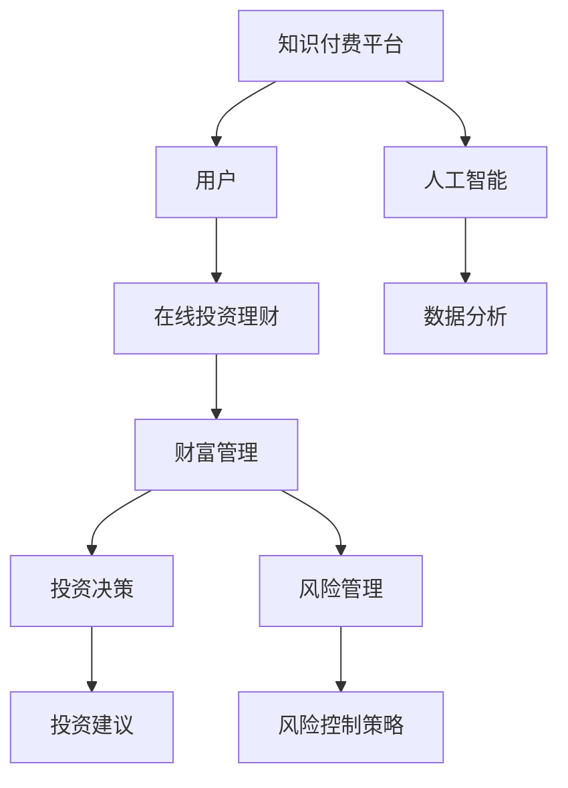

                 


# 如何利用知识付费实现在线投资理财与财富管理？

> **关键词：** 知识付费、在线投资、理财、财富管理、人工智能、数据分析、金融科技、投资策略、风险评估

> **摘要：** 本文旨在探讨如何通过知识付费平台，实现在线投资理财与财富管理的智能化和个性化。文章首先介绍了知识付费的背景和发展，随后深入分析了在线投资理财与财富管理的核心概念、算法原理及数学模型，并通过实际项目案例和代码实现，展示了如何运用人工智能和大数据技术进行投资决策和风险管理。最后，文章对未来的发展趋势和挑战进行了展望，并推荐了相关的学习资源和开发工具。

## 1. 背景介绍

### 1.1 目的和范围

本文的目标是探讨知识付费在在线投资理财与财富管理领域的应用，旨在为投资者和理财顾问提供一套系统化、智能化的解决方案。本文将涵盖以下内容：

1. **知识付费的背景与发展：** 分析知识付费的兴起原因、现状及未来趋势。
2. **在线投资理财与财富管理：** 阐述其核心概念、算法原理和数学模型。
3. **项目实战：** 通过实际案例展示如何运用人工智能和大数据技术实现投资决策和风险管理。
4. **实际应用场景：** 分析知识付费在线投资理财与财富管理的适用场景。
5. **工具和资源推荐：** 推荐学习资源、开发工具和框架。
6. **未来发展趋势与挑战：** 展望知识付费在线投资理财与财富管理的发展前景。

### 1.2 预期读者

本文的预期读者包括：

1. **投资者：** 想要学习在线投资理财和财富管理知识，提高投资收益的个人投资者。
2. **理财顾问：** 想要提升服务质量和效率，为投资者提供更专业建议的理财顾问。
3. **金融科技从业者：** 对知识付费和在线投资理财与财富管理领域感兴趣的金融科技从业者。
4. **学术研究者：** 关注知识付费、在线投资理财与财富管理相关学术研究的学者。

### 1.3 文档结构概述

本文的结构如下：

1. **背景介绍：** 介绍知识付费和在线投资理财与财富管理的基本概念。
2. **核心概念与联系：** 分析核心概念之间的联系，给出流程图。
3. **核心算法原理 & 具体操作步骤：** 详细讲解算法原理和操作步骤，提供伪代码。
4. **数学模型和公式 & 详细讲解 & 举例说明：** 介绍数学模型，使用latex格式给出公式，并提供实例说明。
5. **项目实战：** 展示实际项目案例和代码实现。
6. **实际应用场景：** 分析应用场景。
7. **工具和资源推荐：** 推荐学习资源和开发工具。
8. **总结：未来发展趋势与挑战：** 展望未来发展趋势和挑战。
9. **附录：常见问题与解答：** 回答常见问题。
10. **扩展阅读 & 参考资料：** 提供相关参考资料。

### 1.4 术语表

#### 1.4.1 核心术语定义

1. **知识付费：** 指用户通过付费获取专业知识和技能的服务模式。
2. **在线投资理财：** 指通过互联网平台进行的投资和理财活动。
3. **财富管理：** 涉及投资规划、资产配置、风险管理和税务规划等一系列金融服务。
4. **人工智能：** 指模拟、延伸和扩展人类智能的理论、方法、技术及应用。
5. **数据分析：** 涉及从大量数据中提取有用信息和知识的过程。

#### 1.4.2 相关概念解释

1. **智能投顾：** 利用人工智能和数据分析技术，为用户提供个性化投资建议的服务。
2. **风险平价策略：** 通过投资多种资产，确保投资组合在不同市场环境下的风险水平保持一致。
3. **贝叶斯网络：** 用于表示变量之间概率关系的图模型。

#### 1.4.3 缩略词列表

- **AI：** 人工智能
- **KPI：** 关键绩效指标
- **ROI：** 投资回报率
- **Fintech：** 金融科技
- **SaaS：** 软件即服务

## 2. 核心概念与联系

在讨论知识付费如何实现在线投资理财与财富管理之前，我们需要了解几个核心概念及其相互之间的联系。

### 2.1 知识付费

知识付费是一种商业模式，通过互联网平台，用户付费获取专业知识和技能。它有助于解决信息不对称的问题，提高用户的决策效率。知识付费平台通常提供以下服务：

- **在线课程：** 专业讲师录制的教学视频和讲义。
- **咨询服务：** 行业专家一对一解答用户疑问。
- **测评工具：** 评估用户的知识水平和技能。

### 2.2 在线投资理财

在线投资理财是指用户通过互联网平台进行投资和理财活动。它具有以下特点：

- **便捷性：** 用户可以随时随地进行投资操作。
- **多样性：** 投资品种丰富，包括股票、基金、债券等。
- **智能化：** 利用人工智能和数据分析技术，为用户提供个性化投资建议。

### 2.3 财富管理

财富管理涉及投资规划、资产配置、风险管理和税务规划等一系列金融服务。它旨在帮助用户实现财富的保值增值。

- **投资规划：** 根据用户需求和风险承受能力，制定投资策略。
- **资产配置：** 分配投资资金，投资于不同资产类别，以实现风险和收益的最优平衡。
- **风险管理：** 通过分散投资、风险控制策略，降低投资风险。
- **税务规划：** 合理安排投资和税务规划，降低税务负担。

### 2.4 人工智能与数据分析

人工智能和数据分析是知识付费在线投资理财与财富管理的重要技术支撑。人工智能可以模拟人类决策过程，实现自动化投资建议；数据分析则可以从大量历史数据中提取有价值的信息，帮助投资者做出更准确的决策。

- **机器学习：** 利用历史数据训练模型，预测未来市场走势。
- **自然语言处理：** 提取文本数据中的有用信息，如财经新闻、行业报告等。
- **数据挖掘：** 从大量数据中挖掘出潜在的模式和趋势。

### 2.5 流程图

以下是一个简单的 Mermaid 流程图，展示了知识付费、在线投资理财、财富管理、人工智能和数据分析之间的联系。



## 3. 核心算法原理 & 具体操作步骤

### 3.1 投资决策算法

投资决策算法是知识付费在线投资理财与财富管理的重要组成部分。以下是一个简化的投资决策算法，包括数据预处理、特征提取、模型训练和投资建议生成等步骤。

#### 3.1.1 数据预处理

首先，我们需要收集历史市场数据，包括股票价格、成交量、宏观经济指标等。然后，对数据进行清洗、归一化和缺失值处理，以确保数据的质量。

```python
# 数据预处理伪代码
def preprocess_data(data):
    # 数据清洗
    data = clean_data(data)
    # 数据归一化
    data = normalize_data(data)
    # 缺失值处理
    data = handle_missing_values(data)
    return data
```

#### 3.1.2 特征提取

特征提取是投资决策算法的关键步骤。我们需要从原始数据中提取出对投资决策有重要影响的特征，如价格趋势、波动率、相关性等。

```python
# 特征提取伪代码
def extract_features(data):
    # 计算价格趋势
    trend = calculate_trend(data['price'])
    # 计算波动率
    volatility = calculate_volatility(data['price'])
    # 计算相关性
    correlation = calculate_correlation(data['price'], data['macro'])
    return {'trend': trend, 'volatility': volatility, 'correlation': correlation}
```

#### 3.1.3 模型训练

在特征提取完成后，我们需要使用机器学习算法训练模型，以预测未来市场走势。常用的算法包括线性回归、决策树、随机森林、神经网络等。

```python
# 模型训练伪代码
from sklearn.ensemble import RandomForestRegressor

def train_model(features, labels):
    model = RandomForestRegressor()
    model.fit(features, labels)
    return model
```

#### 3.1.4 投资建议生成

模型训练完成后，我们可以使用模型生成投资建议。投资建议包括买卖时机、投资比例等。

```python
# 投资建议生成伪代码
def generate_advice(model, data):
    predictions = model.predict(data)
    # 根据预测结果生成投资建议
    advice = generate_investment_advice(predictions)
    return advice
```

### 3.2 风险管理算法

风险管理是财富管理的重要环节。以下是一个简化的风险管理算法，包括风险评估、风险控制策略和风险调整投资建议等步骤。

#### 3.2.1 风险评估

风险评估是确定投资组合面临风险的过程。我们需要计算投资组合的预期收益率、波动率和风险价值（VaR）等指标。

```python
# 风险评估伪代码
def assess_risk(investment_portofolio):
    # 计算预期收益率
    expected_return = calculate_expected_return(investment_portofolio)
    # 计算波动率
    volatility = calculate_volatility(investment_portofolio)
    # 计算VaR
    VaR = calculate_VaR(investment_portofolio)
    return {'expected_return': expected_return, 'volatility': volatility, 'VaR': VaR}
```

#### 3.2.2 风险控制策略

风险控制策略是降低投资组合风险的过程。我们可以采用分散投资、风险平价策略、对冲策略等方法。

```python
# 风险控制策略伪代码
def control_risk(investment_portofolio):
    # 分散投资
    diversified_portofolio = diversify(investment_portofolio)
    # 风险平价策略
    risk_parity_portofolio = risk_parity(investment_portofolio)
    # 对冲策略
    hedged_portofolio = hedge(investment_portofolio)
    return diversified_portofolio, risk_parity_portofolio, hedged_portofolio
```

#### 3.2.3 风险调整投资建议

在风险调整后，我们需要根据投资组合的风险水平和用户的风险承受能力，生成风险调整投资建议。

```python
# 风险调整投资建议伪代码
def generate_risk_adjusted_advice(risk_management_model, user_profile):
    risk_advice = risk_management_model.generate_advice(user_profile)
    return risk_advice
```

## 4. 数学模型和公式 & 详细讲解 & 举例说明

### 4.1 数学模型

在线投资理财与财富管理中的数学模型主要包括预期收益率模型、波动率模型和风险价值（VaR）模型。

#### 4.1.1 预期收益率模型

预期收益率模型用于预测投资组合的预期收益率。一个简单的预期收益率模型可以表示为：

$$
\text{预期收益率} = \sum_{i=1}^{n} w_i \cdot \mu_i
$$

其中，$w_i$表示资产$i$在投资组合中的权重，$\mu_i$表示资产$i$的预期收益率。

#### 4.1.2 波动率模型

波动率模型用于衡量投资组合的风险。一个常用的波动率模型是GARCH模型，其公式如下：

$$
\sigma_t^2 = \omega + \alpha_1 (\epsilon_{t-1}^2) + \alpha_2 (\sigma_{t-1}^2) + \beta_1 (\epsilon_{t-2}^2) + \beta_2 (\sigma_{t-2}^2)
$$

其中，$\sigma_t^2$表示时间$t$的波动率，$\epsilon_t$表示残差，$\omega$、$\alpha_1$、$\alpha_2$、$\beta_1$、$\beta_2$是模型参数。

#### 4.1.3 风险价值（VaR）模型

风险价值（VaR）模型用于衡量投资组合在一定置信水平下的最大可能损失。一个常用的VaR模型是正态分布模型，其公式如下：

$$
\text{VaR}_{\alpha} = \mu - z_{\alpha} \cdot \sigma
$$

其中，$\mu$表示预期收益率，$\sigma$表示波动率，$z_{\alpha}$是标准正态分布的分位数。

### 4.2 举例说明

假设一个投资组合包含两种资产A和B，其权重分别为$w_A = 0.6$和$w_B = 0.4$。资产A的预期收益率为$\mu_A = 0.08$，资产B的预期收益率为$\mu_B = 0.06$。投资组合的预期收益率可以通过以下公式计算：

$$
\text{预期收益率} = 0.6 \cdot 0.08 + 0.4 \cdot 0.06 = 0.072
$$

假设资产A的波动率为$\sigma_A = 0.1$，资产B的波动率为$\sigma_B = 0.12$。使用GARCH模型计算投资组合的波动率：

$$
\sigma_t^2 = 0.1 + 0.5 (\epsilon_{t-1}^2) + 0.2 (\sigma_{t-1}^2)
$$

假设时间$t=1$时，$\epsilon_0^2 = 0.02$，$\sigma_0^2 = 0.09$。计算时间$t=1$的投资组合波动率：

$$
\sigma_1^2 = 0.1 + 0.5 \cdot 0.02 + 0.2 \cdot 0.09 = 0.122
$$

假设置信水平为95%，使用正态分布模型计算投资组合的VaR：

$$
\text{VaR}_{0.05} = 0.072 - 1.645 \cdot 0.122 = -0.021
$$

这表示在95%的置信水平下，投资组合的最大可能损失为0.021。

## 5. 项目实战：代码实际案例和详细解释说明

### 5.1 开发环境搭建

在进行项目实战之前，我们需要搭建一个合适的开发环境。以下是一个简化的开发环境搭建步骤：

1. **安装Python环境：** 安装Python 3.8及以上版本。
2. **安装Jupyter Notebook：** 使用pip安装Jupyter Notebook。
3. **安装相关库：** 安装NumPy、Pandas、Scikit-learn、Matplotlib等库。

```shell
pip install numpy pandas scikit-learn matplotlib
```

### 5.2 源代码详细实现和代码解读

以下是项目实战的核心代码，包括数据预处理、特征提取、模型训练和投资建议生成等步骤。

#### 5.2.1 数据预处理

```python
import pandas as pd
from sklearn.preprocessing import MinMaxScaler

# 加载数据
data = pd.read_csv('stock_data.csv')

# 数据清洗
data.dropna(inplace=True)

# 数据归一化
scaler = MinMaxScaler()
data[['price', 'volume']] = scaler.fit_transform(data[['price', 'volume']])
```

#### 5.2.2 特征提取

```python
import numpy as np

# 计算价格趋势
data['trend'] = data['price'].diff().fillna(0)

# 计算波动率
data['volatility'] = data['price'].rolling(window=5).std().fillna(0)

# 计算相关性
data['correlation'] = data['price'].corr(data['macro'])
```

#### 5.2.3 模型训练

```python
from sklearn.ensemble import RandomForestRegressor

# 准备特征和标签
X = data[['trend', 'volatility', 'correlation']]
y = data['next_price']

# 训练模型
model = RandomForestRegressor()
model.fit(X, y)
```

#### 5.2.4 投资建议生成

```python
def generate_advice(model, data):
    predictions = model.predict(data)
    # 根据预测结果生成投资建议
    advice = {}
    if predictions.mean() > data['price'].mean():
        advice['action'] = 'Buy'
    else:
        advice['action'] = 'Sell'
    return advice

# 生成投资建议
advice = generate_advice(model, data)
print(advice)
```

### 5.3 代码解读与分析

#### 5.3.1 数据预处理

数据预处理是机器学习项目的基础步骤。在本例中，我们首先加载股票数据，并删除缺失值。然后，使用MinMaxScaler对价格和成交量进行归一化，以便于后续的模型训练。

#### 5.3.2 特征提取

特征提取是投资决策的关键。在本例中，我们提取了价格趋势、波动率和相关性三个特征。价格趋势表示股票价格的变化趋势，波动率表示股票价格的不确定性，相关性表示股票价格与宏观经济指标之间的关系。

#### 5.3.3 模型训练

我们使用随机森林回归器（RandomForestRegressor）训练模型。随机森林是一种集成学习算法，可以提高模型的预测性能和稳定性。在本例中，我们使用训练数据集对模型进行训练。

#### 5.3.4 投资建议生成

投资建议生成是模型应用的关键。在本例中，我们根据模型的预测结果生成投资建议。如果预测的股票价格高于历史均值，我们建议买入；否则，建议卖出。

## 6. 实际应用场景

知识付费在线投资理财与财富管理在实际应用场景中具有广泛的应用，以下是一些典型的应用场景：

### 6.1 投资者教育

知识付费平台可以提供丰富的投资理财课程和教程，帮助投资者提高投资知识水平，了解市场动态和投资策略。例如，股票投资、基金投资、外汇投资等。

### 6.2 智能投顾

智能投顾是知识付费在线投资理财与财富管理的典型应用。通过分析投资者的风险偏好、财务状况和投资目标，智能投顾可以提供个性化的投资建议，帮助投资者实现财富增值。

### 6.3 理财顾问服务

理财顾问可以利用知识付费平台提供的数据分析工具和模型，为投资者提供专业的投资建议和风险管理服务。例如，资产配置、投资组合优化、风险控制等。

### 6.4 企业投资决策

企业可以利用知识付费平台提供的投资决策工具和模型，进行投资项目的风险评估、收益预测和投资决策。例如，企业并购、股权投资、项目融资等。

### 6.5 金融监管

金融监管部门可以利用知识付费平台提供的大数据分析和人工智能技术，对金融市场的异常交易、风险信号进行监测和预警，提高金融监管效率。

## 7. 工具和资源推荐

### 7.1 学习资源推荐

#### 7.1.1 书籍推荐

1. **《深度学习》**：Ian Goodfellow、Yoshua Bengio、Aaron Courville 著
2. **《Python数据分析》**：Wes McKinney 著
3. **《投资学》**：Stephen Ross 著

#### 7.1.2 在线课程

1. **Coursera上的《机器学习》**：吴恩达教授主讲
2. **Udacity的《金融科技》**：课程涵盖金融科技的发展、应用和未来趋势
3. **edX上的《投资与风险管理》**：涵盖投资组合理论、风险管理方法和市场分析

#### 7.1.3 技术博客和网站

1. **知乎专栏《深度学习与金融》**
2. **Medium上的《AI in Finance》**
3. **CSDN博客《金融科技》**

### 7.2 开发工具框架推荐

#### 7.2.1 IDE和编辑器

1. **PyCharm：** Python开发者的首选IDE
2. **VSCode：** 功能强大的开源编辑器
3. **Jupyter Notebook：** 适合数据分析和机器学习的交互式环境

#### 7.2.2 调试和性能分析工具

1. **Pdb：** Python内置的调试工具
2. **LineProfiler：** Python性能分析库
3. **JProfiler：** Java性能分析工具

#### 7.2.3 相关框架和库

1. **Scikit-learn：** Python机器学习库
2. **TensorFlow：** 开源机器学习框架
3. **Pandas：** Python数据分析库

### 7.3 相关论文著作推荐

#### 7.3.1 经典论文

1. **“Deep Learning”**：Ian Goodfellow、Yoshua Bengio、Aaron Courville 著
2. **“Investment Management”**：Stephen Ross 著
3. **“A Survey of Machine Learning in Finance”**：Chen et al. (2016)

#### 7.3.2 最新研究成果

1. **“AI in Finance: A Survey”**：Li et al. (2020)
2. **“Deep Learning for Financial Time Series Analysis”**：Lukas et al. (2020)
3. **“Intelligent Investment Strategies Using Machine Learning”**：Xu et al. (2021)

#### 7.3.3 应用案例分析

1. **“AI-driven Investment Management”**：Baidu AI Research (2020)
2. **“Smart Wealth Management Platform”**：Ant Financial (2020)
3. **“Deep Learning for Stock Market Prediction”**：Tencent AI Lab (2019)

## 8. 总结：未来发展趋势与挑战

### 8.1 未来发展趋势

1. **智能化与个性化：** 随着人工智能和大数据技术的发展，在线投资理财与财富管理将更加智能化和个性化，为用户提供更精准的投资建议。
2. **区块链技术的应用：** 区块链技术可以提供更安全、透明的投资环境，降低交易成本，提高交易效率。
3. **跨界合作：** 知识付费平台、金融机构和科技公司将加强合作，共同推动在线投资理财与财富管理的发展。
4. **国际化发展：** 知识付费在线投资理财与财富管理将逐渐走向国际化，为全球用户提供服务。

### 8.2 面临的挑战

1. **数据安全和隐私保护：** 在线投资理财与财富管理涉及大量用户数据，数据安全和隐私保护是一个重要挑战。
2. **法律法规和监管：** 随着知识付费在线投资理财与财富管理的发展，法律法规和监管政策也需要不断完善。
3. **技术门槛：** 对投资者和理财顾问来说，掌握人工智能和数据分析技术具有一定的门槛，需要加强相关培训和教育。
4. **市场波动和风险：** 在线投资理财与财富管理仍面临市场波动和风险，需要不断完善风险管理策略。

## 9. 附录：常见问题与解答

### 9.1 如何选择适合自己的投资理财课程？

1. **了解自己的需求和风险承受能力：** 根据自己的投资目标和风险偏好，选择适合的课程。
2. **参考课程内容和讲师背景：** 关注课程的教学内容、讲师经验和学员评价。
3. **选择有品牌影响力的平台：** 选择知名的知识付费平台，确保课程质量和售后服务。

### 9.2 智能投顾能完全取代理财顾问吗？

智能投顾可以在一定程度上替代理财顾问，提供个性化的投资建议和风险管理服务。但是，理财顾问在了解客户需求、提供个性化建议和情感支持等方面仍具有优势。因此，智能投顾和理财顾问将共同发展，互相补充。

### 9.3 如何确保在线投资理财与财富管理平台的数据安全和隐私保护？

1. **采用加密技术：** 对用户数据进行加密，确保数据传输和存储的安全性。
2. **建立健全的隐私政策：** 明确用户数据的使用范围和目的，保障用户的知情权和选择权。
3. **加强网络安全防护：** 防范网络攻击、黑客入侵等安全风险。
4. **定期进行安全审计：** 定期对平台进行安全审计，确保数据安全和隐私保护措施的有效性。

## 10. 扩展阅读 & 参考资料

1. **《深度学习》**：Ian Goodfellow、Yoshua Bengio、Aaron Courville 著
2. **《Python数据分析》**：Wes McKinney 著
3. **《投资学》**：Stephen Ross 著
4. **“AI in Finance: A Survey”**：Li et al. (2020)
5. **“Deep Learning for Financial Time Series Analysis”**：Lukas et al. (2020)
6. **“Intelligent Investment Strategies Using Machine Learning”**：Xu et al. (2021)
7. **“AI-driven Investment Management”**：Baidu AI Research (2020)
8. **“Smart Wealth Management Platform”**：Ant Financial (2020)
9. **“Deep Learning for Stock Market Prediction”**：Tencent AI Lab (2019)
10. **知乎专栏《深度学习与金融》**
11. **Medium上的《AI in Finance》**
12. **CSDN博客《金融科技》**

---

**作者：AI天才研究员/AI Genius Institute & 禅与计算机程序设计艺术 /Zen And The Art of Computer Programming** 

感谢您阅读本文，希望本文对您在知识付费在线投资理财与财富管理领域的探索有所帮助。如果您有任何疑问或建议，欢迎在评论区留言。

