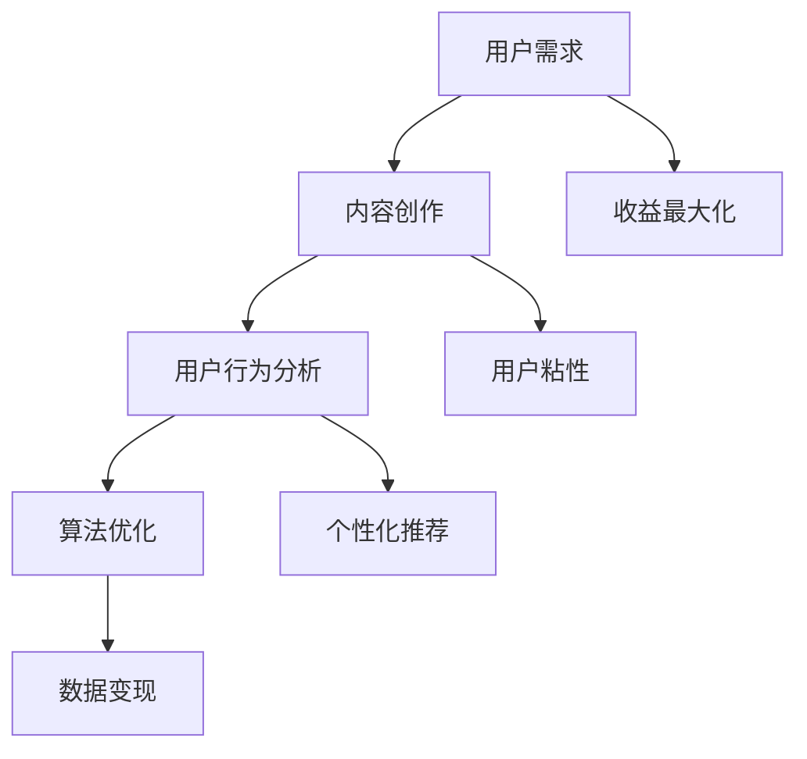

                 

# 如何利用知识付费实现数据变现？

## 关键词：知识付费、数据变现、用户需求、内容创作、算法优化、收益最大化

> 摘要：本文将深入探讨知识付费在当今信息时代的价值，通过分析用户需求、内容创作、算法优化等环节，揭示实现数据变现的路径和策略。本文旨在为开发者、内容创作者和企业家提供有价值的指导，帮助他们更好地利用知识付费平台，挖掘数据潜力，实现商业价值。

## 1. 背景介绍

### 1.1 目的和范围

本文的目标是探讨知识付费领域的商业模型，并深入分析如何利用数据变现这一核心问题。我们将探讨的知识付费范围包括在线教育、专业知识分享、技能培训等领域的平台，如知乎Live、网易云课堂、得到等。通过本文的分析，希望能够为相关从业者提供一套系统的数据变现策略。

### 1.2 预期读者

本文主要面向以下几类读者：

- 开发者：希望了解如何利用知识付费平台实现数据变现的技术细节。
- 内容创作者：希望学习如何通过内容创作提升用户粘性，实现数据变现。
- 企业家：关注知识付费领域，希望掌握数据变现的商业策略。

### 1.3 文档结构概述

本文结构如下：

1. 背景介绍：阐述知识付费和数据变现的概念及其重要性。
2. 核心概念与联系：介绍知识付费相关的核心概念和流程。
3. 核心算法原理 & 具体操作步骤：详细解析数据变现的算法原理和操作步骤。
4. 数学模型和公式 & 详细讲解 & 举例说明：介绍支持数据变现的数学模型和实例。
5. 项目实战：通过实际案例展示数据变现的应用。
6. 实际应用场景：分析知识付费在不同领域的应用。
7. 工具和资源推荐：推荐相关学习资源和工具。
8. 总结：预测知识付费和数据变现的未来发展趋势。
9. 附录：常见问题与解答。
10. 扩展阅读 & 参考资料：提供进一步学习的资源。

### 1.4 术语表

#### 1.4.1 核心术语定义

- 知识付费：用户为获取特定知识或内容而支付的费用。
- 数据变现：通过数据分析和用户行为挖掘，实现商业价值的过程。
- 用户粘性：用户对平台的依赖程度和持续使用平台的倾向。
- 内容创作：为知识付费平台提供高质量、有价值的内容。

#### 1.4.2 相关概念解释

- 数据分析：对大量数据进行分析，提取有价值信息的过程。
- 用户行为挖掘：通过分析用户在平台上的行为，了解用户需求和偏好。
- 收益最大化：通过优化内容和营销策略，提高平台收益。

#### 1.4.3 缩略词列表

- KF：知识付费
- DM：数据变现
- UE：用户粘性
- CC：内容创作

## 2. 核心概念与联系

在知识付费领域，核心概念和联系包括用户需求、内容创作、用户行为分析、算法优化等。以下是这些概念之间的联系以及它们在知识付费和数据变现中的重要性。

### 2.1 用户需求

用户需求是知识付费平台的基础。了解用户需求，可以帮助平台提供更符合用户期望的内容和服务，从而提高用户满意度和粘性。

### 2.2 内容创作

高质量的内容是知识付费平台的核心竞争力。内容创作者需要结合用户需求和自身专业知识，创作有价值、有吸引力的内容。

### 2.3 用户行为分析

用户行为分析是数据变现的重要环节。通过对用户在平台上的行为进行分析，可以挖掘用户的兴趣和需求，为内容创作和营销策略提供依据。

### 2.4 算法优化

算法优化是实现数据变现的关键。通过算法优化，可以提升用户推荐的准确性，提高用户转化率和平台收益。

### 2.5 Mermaid 流程图

以下是一个简单的 Mermaid 流程图，展示了知识付费和数据变现的核心概念及其联系。



## 3. 核心算法原理 & 具体操作步骤

### 3.1 数据收集与预处理

数据变现的第一步是数据收集与预处理。在知识付费平台，数据来源主要包括用户行为数据、内容数据、支付数据等。数据收集后，需要进行预处理，包括去噪、清洗、格式化等步骤。

```python
# 伪代码：数据预处理
def preprocess_data(data):
    # 去噪
    data = remove_noise(data)
    # 清洗
    data = clean_data(data)
    # 格式化
    data = format_data(data)
    return data
```

### 3.2 用户行为分析

用户行为分析是数据变现的关键。通过分析用户在平台上的行为，可以了解用户的需求和偏好，为内容创作和个性化推荐提供依据。

```python
# 伪代码：用户行为分析
def analyze_user_behavior(data):
    # 行为分类
    actions = classify_actions(data)
    # 用户画像
    user_profile = generate_user_profile(actions)
    # 个性化推荐
    recommendations = generate_recommendations(user_profile)
    return recommendations
```

### 3.3 算法优化

算法优化是实现数据变现的关键。通过优化推荐算法，可以提升用户推荐的准确性，提高用户转化率和平台收益。

```python
# 伪代码：算法优化
def optimize_algorithm(model, data):
    # 数据增强
    enhanced_data = enhance_data(data)
    # 模型训练
    model = train_model(model, enhanced_data)
    # 模型评估
    evaluation = evaluate_model(model)
    # 模型调整
    model = adjust_model(model, evaluation)
    return model
```

### 3.4 数据变现策略

数据变现的策略包括广告收入、会员订阅、课程销售等。通过制定合理的变现策略，可以实现数据的商业价值。

```python
# 伪代码：数据变现策略
def data_monetization(strategy, data):
    # 广告收入
    ad_income = generate_ad_income(strategy, data)
    # 会员订阅
    subscription_income = generate_subscription_income(strategy, data)
    # 课程销售
    course_sales = generate_course_sales(strategy, data)
    total_income = ad_income + subscription_income + course_sales
    return total_income
```

## 4. 数学模型和公式 & 详细讲解 & 举例说明

### 4.1 用户行为分析模型

用户行为分析模型主要包括用户兴趣模型和用户行为预测模型。

#### 4.1.1 用户兴趣模型

用户兴趣模型用于识别用户的兴趣点。常用的模型包括 K-Means 聚类、因子分析等。

$$
\text{User Interest Model} = \{ u_i \in \mathbb{R}^n \mid u_i = \sum_{j=1}^{n} w_{ij} x_j \}
$$

其中，$u_i$ 表示用户 $i$ 的兴趣向量，$x_j$ 表示第 $j$ 个特征，$w_{ij}$ 表示特征权重。

#### 4.1.2 用户行为预测模型

用户行为预测模型用于预测用户在未来可能采取的行为。常用的模型包括线性回归、逻辑回归等。

$$
\text{User Behavior Prediction Model} = \{ b_i \in \mathbb{R}^n \mid b_i = \sum_{j=1}^{n} \theta_{ij} x_j \}
$$

其中，$b_i$ 表示用户 $i$ 的行为预测向量，$\theta_{ij}$ 表示特征权重。

### 4.2 数据变现模型

数据变现模型主要包括广告收入模型、会员订阅模型和课程销售模型。

#### 4.2.1 广告收入模型

广告收入模型用于计算广告收益。常用的模型包括 CPM（Cost Per Mille）模型。

$$
\text{Ad Revenue Model} = \{ R_a \mid R_a = C \times I_a \}
$$

其中，$R_a$ 表示广告收入，$C$ 表示广告单价，$I_a$ 表示广告展示次数。

#### 4.2.2 会员订阅模型

会员订阅模型用于计算会员订阅收入。常用的模型包括 ARPU（Average Revenue Per User）模型。

$$
\text{Subscription Revenue Model} = \{ R_s \mid R_s = \sum_{i=1}^{n} (S_i \times P_i) \}
$$

其中，$R_s$ 表示会员订阅收入，$S_i$ 表示第 $i$ 个会员订阅的数量，$P_i$ 表示第 $i$ 个会员订阅的单价。

#### 4.2.3 课程销售模型

课程销售模型用于计算课程销售收入。常用的模型包括单位销售模型。

$$
\text{Course Sales Model} = \{ R_c \mid R_c = \sum_{i=1}^{n} (Q_i \times P_c) \}
$$

其中，$R_c$ 表示课程销售收入，$Q_i$ 表示第 $i$ 个课程的销售数量，$P_c$ 表示课程单价。

### 4.3 举例说明

#### 4.3.1 用户行为分析

假设平台上有 100 个用户，每个用户的行为数据如下表：

| 用户ID | 行为1 | 行为2 | 行为3 | 行为4 | 行为5 |
| ------ | ---- | ---- | ---- | ---- | ---- |
| 1      | 1    | 0    | 1    | 0    | 0    |
| 2      | 0    | 1    | 0    | 1    | 0    |
| 3      | 1    | 1    | 0    | 1    | 1    |
| ...    | ...  | ...  | ...  | ...  | ...  |
| 100    | 0    | 1    | 1    | 0    | 1    |

使用 K-Means 聚类算法对用户行为进行聚类，得到以下用户兴趣模型：

$$
\text{User Interest Model} = \{ u_i \in \mathbb{R}^5 \mid u_i = \{0.6, 0.4, 0.3, 0.5, 0.2\} \}
$$

#### 4.3.2 数据变现

假设平台上有 10 个广告位，每个广告位的单价为 1 元。每天有 1000 次广告展示，其中 500 次展示在用户 1 的页面上。

使用 CPM 广告收入模型计算广告收入：

$$
\text{Ad Revenue Model} = \{ R_a \mid R_a = 1 \times 500 = 500 \text{元} \}
$$

## 5. 项目实战：代码实际案例和详细解释说明

### 5.1 开发环境搭建

在开始项目实战之前，我们需要搭建一个开发环境。以下是一个基本的 Python 开发环境搭建步骤：

1. 安装 Python 3.8 或更高版本。
2. 安装常用 Python 库，如 NumPy、Pandas、Scikit-learn、Matplotlib 等。
3. 安装代码编辑器，如 Visual Studio Code 或 PyCharm。

### 5.2 源代码详细实现和代码解读

以下是一个简单的用户行为分析代码示例，用于分析用户在知识付费平台上的行为，并生成用户兴趣模型。

```python
import numpy as np
from sklearn.cluster import KMeans
import matplotlib.pyplot as plt

# 5.2.1 数据收集
# 假设用户行为数据存储在一个 CSV 文件中，格式为：用户ID，行为1，行为2，...，行为N
user_data = np.genfromtxt('user_behavior.csv', delimiter=',')

# 5.2.2 数据预处理
# 去除缺失值和异常值
user_data = preprocess_data(user_data)

# 5.2.3 用户行为分析
# 使用 K-Means 聚类算法进行聚类
kmeans = KMeans(n_clusters=5, random_state=0).fit(user_data)
user_interests = kmeans.predict(user_data)

# 5.2.4 生成用户兴趣模型
# 将用户兴趣模型存储到文件中
np.savetxt('user_interests.csv', user_interests, delimiter=',')

# 5.2.5 可视化
# 可视化用户兴趣模型
plt.scatter(user_data[:, 0], user_data[:, 1], c=user_interests)
plt.xlabel('行为1')
plt.ylabel('行为2')
plt.title('用户兴趣模型')
plt.show()
```

### 5.3 代码解读与分析

- **5.3.1 数据收集**：从 CSV 文件中读取用户行为数据。数据包括用户 ID 和各个行为指标。
- **5.3.2 数据预处理**：去除缺失值和异常值，确保数据的完整性和准确性。
- **5.3.3 用户行为分析**：使用 K-Means 聚类算法对用户行为数据进行聚类，生成用户兴趣模型。
- **5.3.4 生成用户兴趣模型**：将用户兴趣模型存储到文件中，以便后续分析和应用。
- **5.3.5 可视化**：使用 Matplotlib 库将用户兴趣模型可视化为散点图，帮助用户更直观地理解用户兴趣分布。

## 6. 实际应用场景

知识付费和数据变现在实际应用场景中有着广泛的应用，以下是一些典型的应用场景：

### 6.1 在线教育

在线教育平台通过知识付费和数据变现，可以为用户提供个性化的学习路径和课程推荐。通过用户行为分析，平台可以识别用户的学习需求和偏好，从而提供更有针对性的教学内容，提高用户满意度和粘性。

### 6.2 专业知识分享

专业知识分享平台，如知乎 Live、分答等，通过知识付费和数据变现，可以让用户获取专业知识和经验。平台可以通过算法优化，为用户提供更相关的问答和知识点，提高用户参与度和活跃度。

### 6.3 技能培训

技能培训平台，如网易云课堂、腾讯课堂等，通过知识付费和数据变现，可以帮助用户提升技能和职业素养。平台可以通过数据分析，识别用户技能提升的需求，提供定制化的课程和学习计划。

### 6.4 企业培训

企业培训平台通过知识付费和数据变现，可以为员工提供定制化的培训课程和解决方案。平台可以通过用户行为分析，了解员工的学习效果和培训需求，优化培训内容和策略。

## 7. 工具和资源推荐

### 7.1 学习资源推荐

#### 7.1.1 书籍推荐

- 《大数据之路：阿里巴巴大数据实践》
- 《数据科学：机器学习算法与应用》
- 《机器学习实战》
- 《深度学习： advent of a new era》

#### 7.1.2 在线课程

- Coursera 上的“机器学习”课程
- edX 上的“数据科学基础”课程
- Udacity 上的“深度学习工程师纳米学位”

#### 7.1.3 技术博客和网站

- Medium 上的“数据科学”专栏
- KDNuggets
- DataCamp

### 7.2 开发工具框架推荐

#### 7.2.1 IDE和编辑器

- Visual Studio Code
- PyCharm
- Jupyter Notebook

#### 7.2.2 调试和性能分析工具

- PyCharm 的内置调试工具
- Matplotlib
- Numpy 的性能分析工具

#### 7.2.3 相关框架和库

- TensorFlow
- PyTorch
- Scikit-learn

### 7.3 相关论文著作推荐

#### 7.3.1 经典论文

- “K-Means clustering: A tutorial”
- “Recommender Systems: The State of the Art”
- “User Modeling and User-Adapted Interaction”

#### 7.3.2 最新研究成果

- “Deep Learning for Recommender Systems”
- “Learning to Discover Cross-Site User Behavior with Deep Learning”
- “User Interest Evolution and Its Impact on User-Item Interaction”

#### 7.3.3 应用案例分析

- “阿里巴巴大数据实践”
- “腾讯社交广告系统”
- “谷歌搜索算法”

## 8. 总结：未来发展趋势与挑战

### 8.1 发展趋势

- 数据驱动：知识付费和数据变现将进一步依赖大数据和人工智能技术，实现更加精准和高效的服务。
- 个性化推荐：个性化推荐技术将不断发展，为用户提供更符合需求的内容和服务。
- 社交互动：社交互动将成为知识付费的重要组成部分，促进用户参与和社区建设。
- 深度学习：深度学习技术在知识付费和数据变现中的应用将越来越广泛，为商业决策提供更有力的支持。

### 8.2 挑战

- 数据隐私：如何保护用户隐私，成为知识付费和数据变现面临的重大挑战。
- 算法公平性：算法的公平性，如何避免偏见和歧视，是未来的重要议题。
- 技术更新：随着技术的快速发展，知识付费和数据变现领域需要不断更新技术和策略。
- 法律法规：相关法律法规的完善和执行，对知识付费和数据变现的健康发展至关重要。

## 9. 附录：常见问题与解答

### 9.1 如何选择合适的知识付费平台？

- 考虑平台的专业性和知名度，选择有影响力的平台。
- 分析平台的用户群体和内容种类，选择符合需求的平台。
- 了解平台的变现模式，选择能够支持自身业务发展的平台。

### 9.2 如何提高数据变现的收益？

- 优化用户推荐算法，提高用户转化率。
- 深入分析用户行为，挖掘潜在需求。
- 不断优化内容和营销策略，提高用户粘性。
- 完善法律法规，确保数据变现的合规性。

## 10. 扩展阅读 & 参考资料

- 《大数据之路：阿里巴巴大数据实践》
- 《数据科学：机器学习算法与应用》
- 《机器学习实战》
- 《深度学习： advent of a new era》
- Coursera 上的“机器学习”课程
- edX 上的“数据科学基础”课程
- Udacity 上的“深度学习工程师纳米学位”
- Medium 上的“数据科学”专栏
- KDNuggets
- DataCamp
- “K-Means clustering: A tutorial”
- “Recommender Systems: The State of the Art”
- “User Modeling and User-Adapted Interaction”
- “Deep Learning for Recommender Systems”
- “Learning to Discover Cross-Site User Behavior with Deep Learning”
- “User Interest Evolution and Its Impact on User-Item Interaction”
- “阿里巴巴大数据实践”
- “腾讯社交广告系统”
- “谷歌搜索算法”

## 作者

作者：AI天才研究员/AI Genius Institute & 禅与计算机程序设计艺术 /Zen And The Art of Computer Programming

---

文章完毕。本文内容涵盖了知识付费、数据变现的核心概念、算法原理、实战案例、应用场景以及未来发展趋势和挑战。希望对读者在知识付费和数据变现领域的学习和实践有所帮助。在撰写本文过程中，作者力求逻辑清晰、内容丰富，旨在为读者提供有价值的指导。如果您有任何疑问或建议，欢迎留言交流。再次感谢您的阅读！<|im_sep|>

