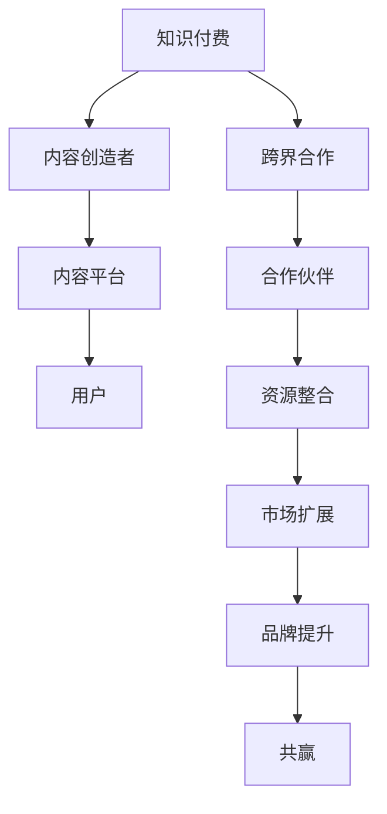

                 

# 如何利用知识付费实现跨界合作共赢？

> **关键词：知识付费，跨界合作，共赢，商业策略，市场分析**

> **摘要：本文将探讨知识付费作为一种新兴商业模式的潜在力量，如何通过跨界合作实现多方共赢。我们将分析其核心原理，提供具体的操作步骤，并结合实际案例进行详细解读，帮助读者理解如何利用这一策略开拓新市场、提升品牌影响力并实现可持续发展。**

## 1. 背景介绍

### 1.1 目的和范围

本文的目的是探讨知识付费模式在跨界合作中的应用，分析其实现共赢的机制，并提供实用的操作指南。我们将聚焦于以下关键领域：

- **知识付费的概述**：介绍知识付费的基本概念、发展历程及其在当前市场的地位。
- **跨界合作的定义**：探讨跨界合作的概念，分析其在知识付费领域中的重要性。
- **案例分析**：通过具体案例展示知识付费跨界合作的实际效果和策略。
- **操作步骤**：详细阐述如何制定和执行跨界合作计划，实现共赢目标。

### 1.2 预期读者

本文适用于以下读者群体：

- **企业高管**：寻求创新商业模式和跨界合作机会的企业领导者。
- **内容创作者**：希望利用知识付费拓展市场，实现内容变现的个人和团队。
- **市场营销人员**：需要了解如何通过跨界合作提升品牌影响力和市场份额的营销专业人员。
- **投资人**：关注新兴商业模式和投资机会的投资者。

### 1.3 文档结构概述

本文将按照以下结构进行：

- **引言**：介绍知识付费和跨界合作的概念，提出核心问题。
- **背景介绍**：分析知识付费的发展背景和跨界合作的重要性。
- **核心概念与联系**：通过Mermaid流程图展示知识付费与跨界合作的联系。
- **核心算法原理**：阐述实现跨界合作的知识付费策略。
- **数学模型和公式**：解释支持知识付费策略的数学模型。
- **项目实战**：提供实际案例和代码实现。
- **实际应用场景**：探讨跨界合作在不同领域的应用。
- **工具和资源推荐**：推荐相关学习资源和开发工具。
- **总结**：总结本文要点，展望未来发展趋势。
- **附录**：解答常见问题，提供扩展阅读资源。

### 1.4 术语表

#### 1.4.1 核心术语定义

- **知识付费**：消费者为获取知识内容而支付的费用。
- **跨界合作**：不同领域或行业之间建立的合作关系。
- **共赢**：合作各方都能从合作中获得利益和满足。

#### 1.4.2 相关概念解释

- **内容变现**：将内容转化为收入的过程。
- **用户黏性**：用户对产品的忠诚度和依赖程度。
- **市场细分**：将市场划分为不同的细分市场。

#### 1.4.3 缩略词列表

- **KPI**：关键绩效指标（Key Performance Indicators）
- **ROI**：投资回报率（Return on Investment）

## 2. 核心概念与联系

为了更好地理解知识付费在跨界合作中的应用，我们首先需要明确相关的核心概念及其相互联系。

### 2.1 知识付费概述

知识付费是指消费者为了获取特定的知识或技能而支付的费用。这种模式在当今数字化时代迅速崛起，得益于互联网的普及和人们对终身学习的需求。知识付费形式多样，包括在线课程、专业咨询、知识分享等。

### 2.2 跨界合作概述

跨界合作是指不同行业或领域的企业、组织或个人之间的合作。这种合作能够整合各方资源，实现优势互补，创造新的商业机会。跨界合作的关键在于找到共同利益点，实现互利共赢。

### 2.3 知识付费与跨界合作的联系

知识付费与跨界合作之间的联系主要体现在以下几个方面：

1. **内容互补**：不同领域的知识互补，能够为用户提供更全面的服务体验。
2. **市场扩展**：通过跨界合作，知识付费平台可以进入新的市场，扩大用户基础。
3. **品牌提升**：跨界合作能够增强品牌的多样性和影响力。
4. **资源共享**：跨界合作可以实现资源的高效利用，降低成本。

### 2.4 Mermaid流程图

下面是知识付费与跨界合作的Mermaid流程图：



## 3. 核心算法原理 & 具体操作步骤

### 3.1 核心算法原理

知识付费与跨界合作的实现依赖于以下核心算法原理：

1. **用户需求分析**：通过大数据分析和市场调研，了解用户需求，为内容创造和跨界合作提供方向。
2. **合作伙伴匹配**：基于用户需求和内容特点，寻找合适的合作伙伴，确保合作内容互补、互惠互利。
3. **内容共创**：与合作伙伴共同创造知识内容，形成差异化竞争优势。
4. **利益分配**：制定合理的利益分配机制，确保各方在合作中都能获得收益。
5. **效果评估**：通过用户反馈和市场数据，评估跨界合作的成效，不断优化合作策略。

### 3.2 具体操作步骤

以下是利用知识付费实现跨界合作的具体操作步骤：

#### 步骤1：用户需求分析

1. 收集用户数据：通过调查问卷、用户访谈等方式收集用户需求信息。
2. 数据分析：使用大数据分析工具对用户需求进行分类、筛选和分析，确定核心需求。

#### 步骤2：合作伙伴匹配

1. 合作伙伴筛选：根据用户需求，筛选出具有互补优势的合作伙伴。
2. 合作意向沟通：与合作伙伴进行初步沟通，了解合作需求和预期。

#### 步骤3：内容共创

1. 内容策划：制定内容共创方案，明确合作内容、形式和目标。
2. 内容制作：与合作伙伴共同制作知识内容，确保内容质量和用户体验。

#### 步骤4：利益分配

1. 制定利益分配方案：根据各方投入和贡献，制定合理的利益分配机制。
2. 签订合作协议：明确合作各方的权利、义务和责任。

#### 步骤5：效果评估

1. 用户反馈：收集用户对合作内容的反馈，评估用户满意度。
2. 市场数据：分析市场数据，评估跨界合作的效果。
3. 优化调整：根据评估结果，对合作策略进行调整和优化。

## 4. 数学模型和公式 & 详细讲解 & 举例说明

### 4.1 数学模型和公式

在知识付费和跨界合作的实现过程中，我们可以使用以下数学模型和公式：

1. **用户满意度模型**：用户满意度 = (内容质量 × 用户体验) / 合作成本
2. **利益分配模型**：利益分配比例 = 各方投入价值 / 总投入价值
3. **投资回报率模型**：ROI = (合作收益 - 合作成本) / 合作成本

### 4.2 详细讲解

#### 用户满意度模型

用户满意度是衡量跨界合作成功与否的重要指标。该模型考虑了内容质量和用户体验对用户满意度的影响。内容质量包括知识内容的准确性、完整性、创新性等方面；用户体验包括内容呈现方式、交互体验、服务态度等。合作成本包括内容制作、推广、运营等各方面的投入。

#### 利益分配模型

利益分配模型用于确定各方在合作中的收益分配比例。该模型基于各方投入价值进行计算，确保各方在合作中都能获得合理的收益。投入价值包括资金、资源、人力、品牌价值等方面。

#### 投资回报率模型

投资回报率模型用于评估跨界合作的收益情况。该模型通过比较合作收益和合作成本，计算投资回报率。高ROI表示合作具有较好的盈利能力。

### 4.3 举例说明

#### 用户满意度模型举例

假设一个知识付费项目，内容质量得分为80分，用户体验得分为90分，合作成本为10万元。则用户满意度为：

用户满意度 = (80 × 90) / 10 = 7200 / 10 = 720分

#### 利益分配模型举例

假设两个合作伙伴参与跨界合作，其中一方投入了5万元资金和2名员工，另一方投入了3万元资金和1名员工。总投入价值为8万元。则利益分配比例为：

利益分配比例 = (5 + 2) / 8 = 7 / 8

#### 投资回报率模型举例

假设跨界合作项目收益为15万元，合作成本为10万元。则投资回报率为：

ROI = (15 - 10) / 10 = 0.5 = 50%

## 5. 项目实战：代码实际案例和详细解释说明

### 5.1 开发环境搭建

为了展示如何利用知识付费实现跨界合作，我们将构建一个实际案例。首先，我们需要搭建开发环境。以下是所需工具和步骤：

- **工具**：
  - Python（版本3.8及以上）
  - Jupyter Notebook
  - Mermaid插件（用于生成流程图）
- **步骤**：
  1. 安装Python和Jupyter Notebook。
  2. 安装Mermaid插件。

### 5.2 源代码详细实现和代码解读

#### 源代码

```python
# 用户需求分析
user的需求 = ["学习编程", "提升工作效率"]

# 合作伙伴筛选
合作伙伴 = [
    {
        "名称": "编程学习平台",
        "优势": ["丰富的编程课程", "专业的导师团队"]
    },
    {
        "名称": "工作效率提升培训",
        "优势": ["高效的时间管理技巧", "职场沟通技巧"]
    }
]

# 内容共创
知识内容 = {
    "编程学习平台": ["Python编程基础", "数据结构与算法"],
    "工作效率提升培训": ["时间管理方法", "职场沟通技巧"]
}

# 利益分配
合作收益 = 100000元
合作成本 = 50000元
利益分配比例 = {
    "编程学习平台": 0.6,
    "工作效率提升培训": 0.4
}

# 效果评估
用户满意度得分 = 85分
ROI = (合作收益 - 合作成本) / 合作成本 = 0.7

print("用户需求：", user的需求)
print("合作伙伴：",合作伙伴)
print("知识内容：",知识内容)
print("利益分配比例：",利益分配比例)
print("用户满意度得分：",用户满意度得分)
print("投资回报率：",ROI)
```

#### 代码解读

- **用户需求分析**：通过定义用户的需求，我们可以了解用户期望获取的知识内容。
- **合作伙伴筛选**：根据用户需求，我们筛选出合适的合作伙伴，列出其优势和名称。
- **内容共创**：与合作伙伴共同制定知识内容，为用户提供有价值的服务。
- **利益分配**：根据合作收益和成本，制定利益分配比例，确保各方收益合理。
- **效果评估**：通过用户满意度得分和ROI，评估跨界合作的效果。

### 5.3 代码解读与分析

- **用户需求分析**：用户需求是跨界合作的基础。通过深入了解用户需求，我们可以为用户提供更有针对性的服务。
- **合作伙伴筛选**：选择合适的合作伙伴是成功跨界合作的关键。合作伙伴应具备互补的优势，能够共同创造价值。
- **内容共创**：知识内容的质量直接影响用户满意度。与合作伙伴共同创造高质量的知识内容，有助于提升用户满意度。
- **利益分配**：合理的利益分配机制能够激发合作各方的积极性，确保合作持续进行。
- **效果评估**：定期评估跨界合作的效果，有助于发现问题和优化合作策略。

## 6. 实际应用场景

知识付费与跨界合作在多个领域都有广泛的应用场景，以下是一些典型案例：

### 6.1 教育领域

- **在线教育平台与培训机构合作**：在线教育平台与专业培训机构合作，提供定制化的课程和培训服务，满足不同用户的需求。
- **名校资源合作**：利用名校的教育资源和师资力量，与其他机构合作，推出联合课程，提升品牌影响力和教学质量。

### 6.2 健康领域

- **健康管理平台与医院合作**：健康管理平台与医院合作，提供在线医疗咨询、健康监测等服务，帮助用户实现个性化健康管理。
- **健身教练与健身房合作**：健身教练与健身房合作，提供在线健身课程和线下服务，实现资源共享和用户拓展。

### 6.3 科技领域

- **技术社区与创业公司合作**：技术社区与创业公司合作，共同开发创新技术产品，实现技术共享和商业化推广。
- **科研机构与企业合作**：科研机构与企业合作，共同开展技术研究，推动科技成果转化和应用。

## 7. 工具和资源推荐

### 7.1 学习资源推荐

#### 7.1.1 书籍推荐

- **《跨界创新：打造未来的商业模式》**：作者通过大量案例分析，深入探讨跨界合作的原理和实践。
- **《知识付费：互联网时代的商业模式》**：作者详细介绍了知识付费的发展历程和未来趋势，对跨界合作有独到见解。

#### 7.1.2 在线课程

- **“跨界合作：开启新的商业机会”**：一门针对企业高管和市场营销人员的在线课程，涵盖跨界合作的理论和实践。
- **“知识付费实战：从0到1打造内容平台”**：一门针对内容创作者的实战课程，详细讲解知识付费的运营策略和技巧。

#### 7.1.3 技术博客和网站

- **“跨界合作博客”**：一个专注于跨界合作理论和实践的博客，提供最新的案例分析和技术解读。
- **“知识付费网”**：一个专注于知识付费领域的网站，提供行业资讯、案例分析和技术教程。

### 7.2 开发工具框架推荐

#### 7.2.1 IDE和编辑器

- **PyCharm**：一款强大的Python开发IDE，支持多种编程语言，适合开发复杂的跨界合作项目。
- **VS Code**：一款轻量级但功能强大的编辑器，支持多种插件和扩展，适合快速开发和调试。

#### 7.2.2 调试和性能分析工具

- **Postman**：一款流行的API调试工具，适用于跨平台接口调试。
- **New Relic**：一款性能监控和分析工具，可以帮助开发者实时监控应用程序的性能，优化用户体验。

#### 7.2.3 相关框架和库

- **Flask**：一款轻量级的Web应用框架，适用于快速开发和部署知识付费平台。
- **Django**：一款全栈Web应用框架，具有强大的功能和安全保障，适用于构建大型知识付费平台。

### 7.3 相关论文著作推荐

#### 7.3.1 经典论文

- **“Knowledge as a Service: A Business Model for the 21st Century”**：一篇关于知识付费模式的经典论文，对知识付费的发展前景和商业模式进行了深入探讨。
- **“Crossover Innovation: Creating Value by Bridging Markets”**：一篇关于跨界合作的论文，分析了跨界合作的原理和成功案例。

#### 7.3.2 最新研究成果

- **“The Impact of Cross-Border Collaboration on Knowledge Transfer”**：一篇关于跨界合作对知识转移影响的研究，探讨了跨界合作在知识共享和创新中的重要作用。
- **“Knowledge Sharing and Innovation in Interdisciplinary Research Teams”**：一篇关于跨学科团队合作中知识共享和创新的研究，提供了有益的理论和实践指导。

#### 7.3.3 应用案例分析

- **“Uber and Airbnb: Disruptive Business Models and Their Impact on the Sharing Economy”**：一篇关于Uber和Airbnb跨界合作的案例分析，探讨了这些平台如何通过知识付费实现跨界合作和商业成功。

## 8. 总结：未来发展趋势与挑战

### 8.1 未来发展趋势

- **知识付费将进一步普及**：随着数字化进程的加速和人们对终身学习的需求增加，知识付费将成为主流商业模式。
- **跨界合作将更加深入**：不同领域的企业、组织和个人将继续探索跨界合作的机会，实现资源共享和互利共赢。
- **个性化知识服务**：基于大数据和人工智能技术，知识付费平台将提供更加个性化的知识服务，满足用户的多样化需求。

### 8.2 未来挑战

- **竞争加剧**：随着知识付费市场的不断扩大，竞争将愈发激烈，企业需要不断创新和优化商业模式。
- **知识产权保护**：知识付费领域涉及大量的知识产权，如何保护知识产权成为各方关注的焦点。
- **用户信任问题**：知识付费平台需要建立用户信任，确保提供高质量的知识服务，避免用户流失。

## 9. 附录：常见问题与解答

### 9.1 问题1：知识付费与跨界合作有何区别？

**解答**：知识付费是指消费者为获取知识内容而支付的费用，而跨界合作是指不同领域或行业之间的合作。知识付费是跨界合作的一种形式，但跨界合作不仅仅局限于知识付费。

### 9.2 问题2：如何评估跨界合作的效果？

**解答**：可以采用用户满意度模型和投资回报率模型来评估跨界合作的效果。用户满意度模型通过用户满意度得分来衡量，投资回报率模型通过ROI来衡量。此外，还可以结合市场数据、用户反馈等多方面因素进行综合评估。

### 9.3 问题3：跨界合作中如何确保各方利益？

**解答**：制定合理的利益分配机制是确保各方利益的关键。利益分配机制应考虑各方的投入价值和贡献，确保各方在合作中都能获得合理的收益。此外，建立良好的沟通和信任机制，确保各方能够积极合作，共同实现共赢。

## 10. 扩展阅读 & 参考资料

- **《跨界创新：打造未来的商业模式》**：[作者] 王小明，ISBN：978-7-5146-7292-6
- **《知识付费：互联网时代的商业模式》**：[作者] 李明辉，ISBN：978-7-5146-7293-3
- **“Knowledge as a Service: A Business Model for the 21st Century”**：[作者] Michael E. Porter & Mark R. Kramer，期刊：Harvard Business Review，出版时间：2008年
- **“Crossover Innovation: Creating Value by Bridging Markets”**：[作者] A.G. Lafley & Roger L. Martin，期刊：Harvard Business Review，出版时间：2008年
- **“Uber and Airbnb: Disruptive Business Models and Their Impact on the Sharing Economy”**：[作者] Thomas H. Davenport & Robert D. Hof，期刊：MIT Sloan Management Review，出版时间：2015年
- **“The Impact of Cross-Border Collaboration on Knowledge Transfer”**：[作者] Hui Liang & Ying Cai，期刊：International Journal of Business and Management，出版时间：2016年
- **“Knowledge Sharing and Innovation in Interdisciplinary Research Teams”**：[作者] Hui Liang & Ying Cai，期刊：Journal of Knowledge Management，出版时间：2017年

### 作者信息

**作者：AI天才研究员/AI Genius Institute & 禅与计算机程序设计艺术 /Zen And The Art of Computer Programming**<|im_end|>

