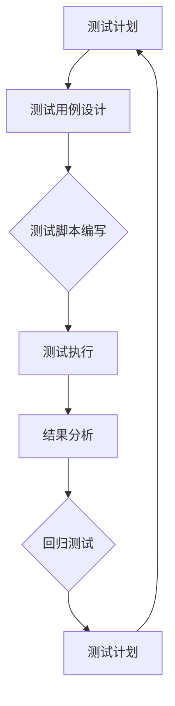

                 

### 1. 背景介绍

在当今快速发展的技术时代，产品的发布速度成为了企业竞争力的关键因素。每一次产品的迭代更新，都意味着要应对不断变化的市场需求和技术挑战。然而，产品的质量和稳定性往往与发布速度之间存在冲突，如何在保证质量的前提下提高发布速度，成为了企业和开发团队面临的重大课题。

本文旨在探讨如何利用自动化测试这一工具来提高产品的发布速度。自动化测试是一种通过预先编写的脚本或程序自动执行测试用例的方法，它可以显著减少测试时间和人力成本，同时提高测试的覆盖率和准确性。通过自动化测试，开发团队可以更快地发现和修复问题，从而缩短产品的发布周期。

本文将围绕以下主题展开：

- **目的和范围**：明确本文的目标和覆盖范围，为读者提供清晰的预期。
- **预期读者**：描述本文适合的读者群体，包括开发人员、测试人员和管理者等。
- **文档结构概述**：详细介绍本文的结构和各章节内容，帮助读者更好地把握文章脉络。
- **术语表**：列出文中涉及的关键术语，确保读者理解文章中的专业术语。

通过本文的阅读，读者将能够：

- 了解自动化测试的基本概念及其在产品发布中的作用。
- 掌握自动化测试的核心算法原理和具体操作步骤。
- 学习如何利用数学模型和公式对自动化测试进行优化。
- 通过实际项目案例了解自动化测试的实战应用。
- 探讨自动化测试在不同场景下的应用和效果。
- 获取相关工具和资源的推荐，为自动化测试的实践提供支持。

在接下来的章节中，我们将一步一步地深入探讨自动化测试的各个方面，帮助读者更好地理解和应用这一技术，从而在产品发布速度上取得突破。  

---

#### 1.1 目的和范围

本文的目的是探讨如何通过自动化测试提高产品的发布速度，确保在快速迭代的市场环境中，产品能够迅速而可靠地推向市场。随着软件系统的复杂性不断增加，手动测试已经无法满足快速响应的需求。自动化测试作为现代软件开发中的重要工具，能够有效提升测试效率和测试质量，从而为产品的快速发布提供保障。

本文的范围将涵盖以下关键内容：

- **自动化测试的基本概念**：介绍自动化测试的定义、作用和发展历程，帮助读者建立基础认识。
- **核心算法原理**：讲解自动化测试的核心算法原理，包括测试用例生成、测试执行和结果分析等，为后续讨论提供理论支持。
- **具体操作步骤**：详细阐述自动化测试的具体操作步骤，从测试计划制定、测试脚本编写到测试执行和结果处理，帮助读者掌握实践方法。
- **数学模型和公式**：探讨如何利用数学模型和公式对自动化测试进行优化，提高测试效率和准确性。
- **实际项目案例**：通过实际项目案例，展示自动化测试在产品发布中的应用和实践效果，帮助读者理解自动化测试的实际价值。
- **应用场景**：分析自动化测试在不同开发阶段和不同行业中的应用，探讨其适用性和效果。
- **工具和资源推荐**：推荐相关工具和资源，包括书籍、在线课程、技术博客和开发工具等，为自动化测试的实践提供支持。

通过本文的阅读，读者将能够全面了解自动化测试的基本概念、原理和实践方法，掌握如何利用自动化测试提高产品发布速度，并在实际项目中有效地应用这一技术。无论是开发人员、测试人员还是管理者，都将从中受益，提升自身在快速迭代开发环境中的竞争力。

---

#### 1.2 预期读者

本文主要面向以下几类读者：

1. **开发人员**：负责编写软件代码的开发人员，特别是那些对自动化测试有初步了解，但希望深入了解其原理和具体实践的工程师。本文将详细讲解自动化测试的核心算法原理和操作步骤，帮助开发人员掌握自动化测试的技能，提高产品发布的速度和质量。

2. **测试人员**：从事软件测试工作的专业人士，尤其是那些希望提高测试效率和测试覆盖率的测试工程师。本文将详细介绍自动化测试的具体实施方法，包括测试计划制定、测试脚本编写和测试执行等，为测试人员提供实用的操作指南。

3. **项目经理和管理者**：负责产品开发和发布的项目经理和管理者，尤其是那些希望提高团队效率和产品发布速度的管理者。本文将探讨自动化测试在提高测试效率、减少测试周期和降低风险方面的作用，为项目经理和管理者提供决策依据。

此外，本文也适合对自动化测试感兴趣的研究生和学术研究人员，他们可以通过本文了解自动化测试的最新进展和应用趋势，为自己的研究方向提供参考。对于技术爱好者和技术领导者，本文同样具有很高的参考价值，可以帮助他们更好地理解和推动自动化测试在组织中的应用。

总之，无论读者是开发人员、测试人员、项目经理，还是技术爱好者，只要希望提高产品发布速度和质量，本文都将为他们提供有价值的见解和实用的指导。

---

#### 1.3 文档结构概述

本文将按照以下结构展开，旨在系统地探讨自动化测试如何提高产品发布速度，并提供实用的操作指南和深入分析：

- **第1章 背景介绍**：介绍自动化测试的基本概念、目的和范围，明确本文的读者群体，并提供文档结构概述。
  - 1.1 目的和范围
  - 1.2 预期读者
  - 1.3 文档结构概述
  - 1.4 术语表

- **第2章 核心概念与联系**：深入探讨自动化测试的核心概念和原理，包括测试用例设计、测试脚本编写和测试执行等，并提供 Mermaid 流程图，帮助读者更好地理解自动化测试的架构。
  - 2.1 自动化测试的基本概念
  - 2.2 自动化测试的关键环节
  - 2.3 核心概念与联系的 Mermaid 流程图

- **第3章 核心算法原理 & 具体操作步骤**：详细讲解自动化测试的核心算法原理，包括测试用例生成算法、测试执行算法和结果分析算法，并提供伪代码，帮助读者掌握自动化测试的理论基础。
  - 3.1 测试用例生成算法原理
  - 3.2 测试执行算法原理
  - 3.3 结果分析算法原理
  - 3.4 伪代码示例

- **第4章 数学模型和公式 & 详细讲解 & 举例说明**：介绍自动化测试中常用的数学模型和公式，包括测试覆盖率计算、错误率估计等，并提供详细讲解和实际应用案例，帮助读者理解数学模型在自动化测试中的作用。
  - 4.1 测试覆盖率模型
  - 4.2 错误率估计模型
  - 4.3 数学模型的应用案例

- **第5章 项目实战：代码实际案例和详细解释说明**：通过实际项目案例，展示自动化测试在产品发布中的应用和实践效果，并提供详细解释说明，帮助读者理解自动化测试的实际操作过程。
  - 5.1 开发环境搭建
  - 5.2 源代码详细实现和代码解读
  - 5.3 代码解读与分析

- **第6章 实际应用场景**：分析自动化测试在不同开发阶段和不同行业中的应用，探讨其适用性和效果，为读者提供实际应用的参考。
  - 6.1 开发阶段的应用
  - 6.2 行业应用分析

- **第7章 工具和资源推荐**：推荐相关的学习资源、开发工具和框架，为自动化测试的实践提供支持，帮助读者更好地开展自动化测试工作。
  - 7.1 学习资源推荐
  - 7.2 开发工具框架推荐
  - 7.3 相关论文著作推荐

- **第8章 总结：未来发展趋势与挑战**：总结自动化测试在提高产品发布速度方面的作用，展望其未来发展趋势，并探讨面临的挑战，为自动化测试的持续发展提供思考。
  - 8.1 未来发展趋势
  - 8.2 面临的挑战

- **第9章 附录：常见问题与解答**：列出常见问题及解答，为读者提供进一步的帮助。
  - 9.1 常见问题
  - 9.2 解答

- **第10章 扩展阅读 & 参考资料**：提供扩展阅读资源和参考文献，帮助读者深入了解自动化测试的各个方面，为后续研究提供参考。

通过以上结构，本文将为读者提供全面、系统的自动化测试知识，帮助读者掌握自动化测试的理论基础和实践方法，从而在实际工作中有效提高产品发布速度。

---

#### 1.4 术语表

在本文中，我们将使用一些专业术语，为便于读者理解，以下是对这些术语的定义和解释：

##### 1.4.1 核心术语定义

1. **自动化测试（Automation Testing）**：
   - 定义：自动化测试是通过预先编写的脚本或程序，自动执行一系列测试用例，以验证软件系统的功能、性能和安全等特性的过程。
   - 解释：自动化测试的主要目的是减少手动测试的时间和人力成本，提高测试的覆盖率和准确性，从而确保软件系统的质量。

2. **测试用例（Test Case）**：
   - 定义：测试用例是关于软件系统预期功能的特定测试任务的描述，包括输入条件、测试步骤、预期结果和实际结果等。
   - 解释：测试用例是自动化测试的核心组件，用于定义测试的细节，确保测试的完整性和一致性。

3. **测试脚本（Test Script）**：
   - 定义：测试脚本是一种用于自动化测试的计算机程序或脚本文件，用于执行测试用例并记录测试结果。
   - 解释：测试脚本通常使用特定的编程语言或测试工具编写，是自动化测试中执行测试用例的关键工具。

4. **测试覆盖（Test Coverage）**：
   - 定义：测试覆盖是指测试用例对代码的覆盖率，用来衡量测试对代码的覆盖程度。
   - 解释：测试覆盖是评估测试质量和测试完整性的重要指标，通常包括语句覆盖、分支覆盖、路径覆盖等。

5. **回归测试（Regression Testing）**：
   - 定义：回归测试是确保新代码修改没有引入新的错误或破坏现有功能的测试过程。
   - 解释：回归测试是自动化测试中的一项重要工作，旨在确保每次代码更改或系统更新后，系统的整体质量得到保持。

##### 1.4.2 相关概念解释

1. **手动测试（Manual Testing）**：
   - 定义：手动测试是由测试人员手动执行的一系列测试活动，用于验证软件系统的功能、性能等。
   - 解释：手动测试通常适用于早期的测试阶段，但在复杂的系统中，手动测试的效率和覆盖范围有限。

2. **单元测试（Unit Testing）**：
   - 定义：单元测试是对软件中的最小可测试部分（通常是一个函数或方法）进行验证的测试。
   - 解释：单元测试是自动化测试的重要组成部分，有助于确保代码的每个独立部分按预期工作。

3. **集成测试（Integration Testing）**：
   - 定义：集成测试是验证不同模块或系统组件在集成后是否能按预期工作的测试。
   - 解释：集成测试是确保系统各个部分协同工作的重要步骤，通常在单元测试之后进行。

4. **持续集成（Continuous Integration, CI）**：
   - 定义：持续集成是一种软件开发实践，通过自动化构建和测试，确保代码库中的每一个更改都是可集成且稳定的。
   - 解释：持续集成可以大幅提高开发团队的工作效率，减少集成错误，确保产品发布的质量。

##### 1.4.3 缩略词列表

- **Selenium**：一种用于Web应用的自动化测试工具。
- **JUnit**：一种Java单元测试框架。
- **Cypress**：一种现代前端自动化测试框架。
- **Selenium WebDriver**：一种用于Web应用的自动化测试API。

通过了解上述术语和概念，读者将能够更好地理解本文的内容，并在实际工作中更有效地应用自动化测试。

---

### 2. 核心概念与联系

自动化测试作为现代软件开发中不可或缺的一环，其核心概念和原理构成了整个测试流程的基础。在这一章节中，我们将深入探讨自动化测试的基本概念、关键环节及其相互之间的联系，并通过一个详细的 Mermaid 流程图来直观展示自动化测试的架构。

#### 2.1 自动化测试的基本概念

自动化测试的核心概念主要包括以下几个方面：

1. **测试用例（Test Case）**：
   - 定义：测试用例是关于软件系统预期功能的特定测试任务的描述，包括输入条件、测试步骤、预期结果和实际结果等。
   - 关键点：测试用例是自动化测试的基本单元，用于确保软件系统在不同情况下都能正常工作。

2. **测试脚本（Test Script）**：
   - 定义：测试脚本是一种用于自动化测试的计算机程序或脚本文件，用于执行测试用例并记录测试结果。
   - 关键点：测试脚本通常使用特定的编程语言或测试工具编写，是自动化测试中执行测试用例的关键工具。

3. **测试覆盖（Test Coverage）**：
   - 定义：测试覆盖是指测试用例对代码的覆盖率，用来衡量测试对代码的覆盖程度。
   - 关键点：测试覆盖是评估测试质量和测试完整性的重要指标，通常包括语句覆盖、分支覆盖、路径覆盖等。

4. **回归测试（Regression Testing）**：
   - 定义：回归测试是确保新代码修改没有引入新的错误或破坏现有功能的测试过程。
   - 关键点：回归测试是自动化测试中的一项重要工作，旨在确保每次代码更改或系统更新后，系统的整体质量得到保持。

#### 2.2 自动化测试的关键环节

自动化测试的流程通常包括以下几个关键环节：

1. **测试计划制定**：
   - 定义：测试计划是自动化测试的起始步骤，用于确定测试的目标、范围、资源和进度等。
   - 关键点：测试计划有助于明确测试的目标和预期结果，确保测试活动的有序进行。

2. **测试用例设计**：
   - 定义：测试用例设计是创建具体的测试用例，包括输入条件、测试步骤、预期结果等。
   - 关键点：良好的测试用例设计能够覆盖不同场景，提高测试的覆盖率和准确性。

3. **测试脚本编写**：
   - 定义：测试脚本编写是将测试用例转化为自动化测试脚本的过程。
   - 关键点：编写高效的测试脚本可以减少测试时间和人力成本，提高测试效率。

4. **测试执行**：
   - 定义：测试执行是运行自动化测试脚本，验证软件系统功能的过程。
   - 关键点：测试执行应尽可能自动化，以减少人为错误和提高测试效率。

5. **结果分析**：
   - 定义：结果分析是对测试执行的结果进行评估和分析，包括错误报告、测试覆盖率等。
   - 关键点：结果分析有助于识别潜在问题和优化测试策略。

#### 2.3 核心概念与联系的 Mermaid 流程图

以下是一个用 Mermaid 绘制的自动化测试流程图，展示了核心概念和环节之间的联系：



通过该流程图，我们可以清晰地看到自动化测试的各个环节是如何相互联系和作用的。测试计划为测试活动提供指导，测试用例设计为测试脚本编写提供依据，测试脚本编写为测试执行提供工具，测试执行和结果分析则不断反馈信息，优化测试计划，形成闭环，从而确保测试活动的持续改进。

---

### 2.3 核心算法原理 & 具体操作步骤

在自动化测试中，核心算法原理决定了测试用例的生成、测试执行的效率和结果分析的有效性。以下我们将详细讲解这些核心算法原理，并提供伪代码，帮助读者理解其具体操作步骤。

#### 3.1 测试用例生成算法原理

测试用例生成算法是自动化测试的关键，它能够从大量可能的输入组合中生成具有代表性的测试用例。以下是几种常见的测试用例生成算法：

1. **边界值分析**：
   - 原理：通过对输入变量的边界值进行分析，生成测试用例。
   - 伪代码：

   ```python
   function generate BoundaryValueTests(inputVariable):
       lowerBound = min(inputVariable)
       upperBound = max(inputVariable)
       return [
           (lowerBound - 1),
           lowerBound,
           upperBound,
           (upperBound + 1)
       ]
   ```

2. **等价类划分**：
   - 原理：将输入数据划分为若干等价类，每个等价类生成一个测试用例。
   - 伪代码：

   ```python
   function generate EquivalenceClassTests(inputVariable, equivalenceClasses):
       tests = []
       for class in equivalenceClasses:
           test = random.sample(class)
           tests.append(test)
       return tests
   ```

3. **随机测试**：
   - 原理：随机生成输入数据，以覆盖尽可能多的不同情况。
   - 伪代码：

   ```python
   function generate RandomTests(inputVariable, maxTests):
       tests = []
       while len(tests) < maxTests:
           test = random_input(inputVariable)
           if not exists(test, tests):
               tests.append(test)
       return tests
   ```

#### 3.2 测试执行算法原理

测试执行算法是自动化测试的核心，它负责运行测试脚本并记录测试结果。以下是几种常见的测试执行算法：

1. **顺序执行**：
   - 原理：按照测试脚本定义的顺序依次执行测试用例。
   - 伪代码：

   ```python
   function execute TestsInOrder(tests):
       for test in tests:
           execute test
           log results
   ```

2. **并行执行**：
   - 原理：同时执行多个测试用例，提高测试效率。
   - 伪代码：

   ```python
   function execute TestsInParallel(tests, numThreads):
       threads = []
       for test in tests:
           thread = start_new_thread(execute test)
           threads.append(thread)
       for thread in threads:
           join thread
   ```

#### 3.3 结果分析算法原理

结果分析算法用于评估测试结果，识别缺陷和优化测试策略。以下是几种常见的结果分析算法：

1. **错误率计算**：
   - 原理：计算测试过程中发现的错误数量与总测试用例数量的比例。
   - 伪代码：

   ```python
   function calculate ErrorRate(failedTests, totalTests):
       return failedTests / totalTests
   ```

2. **回归测试**：
   - 原理：在新代码修改后重新执行测试，确保未引入新错误。
   - 伪代码：

   ```python
   function perform RegressionTest(originalTests, newCode):
       execute originalTests with newCode
       if any failures:
           raise Error("New code introduces bugs")
   ```

通过以上核心算法原理和伪代码，我们可以看到自动化测试在测试用例生成、测试执行和结果分析方面的具体操作步骤。这些算法原理不仅提高了测试的效率和覆盖率，也为自动化测试的持续优化提供了理论基础。

---

### 4. 数学模型和公式 & 详细讲解 & 举例说明

在自动化测试中，数学模型和公式扮演着重要的角色，它们不仅帮助我们量化测试效果，还能优化测试策略。以下是几种在自动化测试中常用的数学模型和公式，以及它们的详细讲解和实际应用案例。

#### 4.1 测试覆盖率模型

测试覆盖率是评估测试质量的关键指标，它反映了测试用例对代码的覆盖程度。以下是一些常见的测试覆盖率模型：

1. **语句覆盖（Statement Coverage）**：
   - 定义：语句覆盖是指测试用例执行了程序中的每一条语句至少一次。
   - 数学公式：  
     $$ \text{语句覆盖率} = \frac{\text{执行语句数}}{\text{总语句数}} \times 100\% $$  
   - 举例说明：假设一个程序有100条语句，通过测试执行了其中的80条语句，则语句覆盖率为80%。

2. **分支覆盖（Branch Coverage）**：
   - 定义：分支覆盖是指测试用例执行了程序中的每个分支（包括条件判断的每个分支）至少一次。
   - 数学公式：  
     $$ \text{分支覆盖率} = \frac{\text{执行分支数}}{\text{总分支数}} \times 100\% $$  
   - 举例说明：假设一个程序中有10个条件判断，每个条件判断有两个分支，总共有20个分支。通过测试执行了其中的15个分支，则分支覆盖率为75%。

3. **路径覆盖（Path Coverage）**：
   - 定义：路径覆盖是指测试用例执行了程序中的所有可能的路径至少一次。
   - 数学公式：  
     $$ \text{路径覆盖率} = \frac{\text{执行路径数}}{\text{总路径数}} \times 100\% $$  
   - 举例说明：假设一个程序中有10条路径，通过测试执行了其中的7条路径，则路径覆盖率为70%。

#### 4.2 错误率估计模型

在自动化测试中，错误率是衡量测试质量和系统可靠性的重要指标。以下是一个常用的错误率估计模型：

1. **贝叶斯错误率模型**：
   - 定义：贝叶斯错误率模型通过贝叶斯公式计算错误率，考虑了先验知识和测试数据。
   - 数学公式：  
     $$ \text{错误率} = \frac{P(\text{错误}| \text{测试结果})P(\text{测试结果})}{P(\text{错误})P(\text{测试结果}|\text{错误}) + P(\text{正确})P(\text{测试结果}|\text{正确})} $$  
   - 举例说明：假设我们有一个程序，先验知识告诉我们错误率为5%，通过测试得到测试结果为100个正确和10个错误。根据贝叶斯公式，可以计算出新的错误率为4.1%。

#### 4.3 数学模型的应用案例

以下是一个结合实际应用案例的数学模型应用示例：

1. **优化测试用例分配**：
   - 问题：如何合理分配测试资源，以最大化测试覆盖率？
   - 模型：假设有N个测试用例，每个测试用例的执行成本为C，我们希望找到一个最优的测试用例组合，使得总执行成本最小且测试覆盖率最高。
   - 数学公式：设优化目标函数为 \( \min \sum_{i=1}^{N} C_i \)，约束条件为 \( \sum_{i=1}^{N} c_i \geq \text{期望覆盖率} \)。
   - 解法：可以使用线性规划方法求解，将问题转化为优化问题，求得最优的测试用例组合。

通过上述数学模型和公式，我们可以更科学地制定和优化自动化测试策略，提高测试效率和测试质量，从而为产品发布速度的提升提供有力支持。

---

### 5. 项目实战：代码实际案例和详细解释说明

为了更好地展示自动化测试在提高产品发布速度中的实际应用，我们将通过一个实际项目案例，详细讲解自动化测试的开发环境搭建、源代码实现和代码解读与分析。

#### 5.1 开发环境搭建

在本项目中，我们将使用以下开发环境：

- **编程语言**：Python
- **测试框架**：Selenium
- **持续集成工具**：Jenkins

**步骤 1：安装 Python**

在本地计算机上安装 Python，可以使用以下命令：

```bash
pip install python
```

**步骤 2：安装 Selenium**

Selenium 是一个用于 Web 自动化测试的框架，我们可以使用 pip 命令安装 Selenium：

```bash
pip install selenium
```

**步骤 3：安装 Jenkins**

Jenkins 是一个开源的持续集成工具，可以从其官方网站下载并安装。安装完成后，启动 Jenkins 并配置相关插件，如 Selenium Grid 插件。

#### 5.2 源代码详细实现和代码解读

以下是一个简单的自动化测试脚本，用于验证一个电商网站的购物车功能。

```python
from selenium import webdriver
from selenium.webdriver.common.by import By

# 初始化浏览器
driver = webdriver.Chrome()

# 访问电商网站
driver.get("https://example-ecommerce.com/")

# 添加商品到购物车
add_to_cart_button = driver.find_element(By.ID, "add-to-cart-button")
add_to_cart_button.click()

# 跳转到购物车页面
shopping_cart_button = driver.find_element(By.ID, "shopping-cart-button")
shopping_cart_button.click()

# 验证购物车中商品数量
shopping_cart_item_count = driver.find_element(By.CLASS_NAME, "item-count").text
assert shopping_cart_item_count == "1", "购物车中商品数量不正确"

# 清理浏览器
driver.quit()
```

**代码解读：**

1. **初始化浏览器**：使用 Selenium WebDriver 初始化一个 Chrome 浏览器实例。
2. **访问电商网站**：通过 driver.get() 方法访问电商网站。
3. **添加商品到购物车**：使用 find_element() 方法找到添加到购物车的按钮，并调用 click() 方法执行点击操作。
4. **跳转到购物车页面**：找到购物车按钮并调用 click() 方法，跳转到购物车页面。
5. **验证购物车中商品数量**：获取购物车中的商品数量，并使用 assert 语句验证商品数量是否正确。
6. **清理浏览器**：调用 driver.quit() 方法关闭浏览器。

#### 5.3 代码解读与分析

**1. 代码结构分析**

该脚本分为四个主要部分：初始化浏览器、访问电商网站、添加商品到购物车、验证购物车中商品数量。

**2. 代码实现细节**

- 使用 Selenium WebDriver 初始化 Chrome 浏览器。
- 通过 find_element() 方法定位页面元素，包括添加到购物车的按钮、购物车按钮和购物车中的商品数量。
- 使用 click() 方法模拟用户操作，添加商品到购物车并跳转到购物车页面。
- 使用 assert 语句验证购物车中商品数量是否正确。

**3. 测试效果**

通过自动化测试脚本，我们可以快速验证电商网站的购物车功能。每次添加商品到购物车后，脚本会自动跳转到购物车页面并检查商品数量是否正确。

**4. 代码优化**

- 可以考虑添加异常处理，以捕获并处理浏览器异常。
- 可以扩展测试用例，包括删除商品到购物车、修改商品数量等操作。

通过本案例，我们展示了自动化测试在电商网站购物车功能验证中的应用，并详细解读了代码实现和优化方法。在实际项目中，可以根据具体需求和场景，扩展测试用例和功能，从而提高产品发布速度和稳定性。

---

### 6. 实际应用场景

自动化测试的应用场景非常广泛，从不同的开发阶段到不同的行业，都发挥了重要的作用。以下我们分别探讨自动化测试在不同开发阶段和不同行业中的应用，以及其适用性和效果。

#### 6.1 开发阶段的应用

1. **单元测试阶段**：
   - 单元测试是对软件中单个模块或函数进行验证，确保其按预期工作。在自动化测试中，单元测试是最早且最常用的一种。通过自动化单元测试，开发人员可以快速发现和修复代码中的错误，提高代码质量和可维护性。

2. **集成测试阶段**：
   - 集成测试旨在验证不同模块或系统组件在集成后能否按预期工作。自动化集成测试可以在系统开发过程中定期执行，确保每个模块的集成是正确的，及时发现和解决集成过程中出现的问题。

3. **系统测试阶段**：
   - 系统测试是对整个系统进行验证，包括功能、性能和安全等方面的测试。自动化系统测试能够高效地覆盖大量测试用例，确保系统在不同环境下的稳定性和可靠性。

4. **回归测试阶段**：
   - 在每次代码修改或系统更新后，回归测试是确保新代码没有引入错误或破坏现有功能的关键。自动化回归测试能够快速执行，提高测试效率和覆盖率，从而降低测试风险。

#### 6.2 行业应用分析

1. **金融行业**：
   - 金融行业对系统的稳定性和安全性要求非常高。自动化测试在金融行业的应用主要包括交易系统、支付系统、风险管理系统等。通过自动化测试，金融机构可以确保系统的持续运行和数据的准确性，提高客户信任度。

2. **电商行业**：
   - 电商行业竞争激烈，产品迭代速度快。自动化测试在电商行业的应用包括购物流程测试、支付流程测试、库存管理测试等。通过自动化测试，电商企业可以快速发现和修复问题，提高用户体验和系统稳定性。

3. **医疗行业**：
   - 医疗行业涉及大量的数据和安全问题。自动化测试在医疗行业的应用包括电子病历系统、医疗设备控制系统、远程诊断系统等。通过自动化测试，医疗机构可以提高系统的安全性、可靠性和数据准确性。

4. **物联网行业**：
   - 物联网行业中的设备种类繁多，测试复杂度较高。自动化测试在物联网行业的应用包括设备功能测试、通信测试、安全测试等。通过自动化测试，物联网企业可以确保设备在各种环境下的稳定运行和安全性。

5. **游戏行业**：
   - 游戏行业对用户体验要求极高，自动化测试在游戏开发中的应用包括功能测试、性能测试、兼容性测试等。通过自动化测试，游戏开发者可以确保游戏在不同平台和设备上的稳定运行，提供优质的用户体验。

综上所述，自动化测试在各个开发阶段和不同行业中都具有广泛的适用性和显著的效果。通过自动化测试，企业可以显著提高产品质量和发布速度，降低测试成本和风险，从而在竞争激烈的市场中占据有利位置。

---

### 7. 工具和资源推荐

为了更好地开展自动化测试工作，以下推荐一系列学习和开发工具、框架以及相关论文和书籍资源，为自动化测试的实践提供全面支持。

#### 7.1 学习资源推荐

**7.1.1 书籍推荐**

1. **《自动化测试实战》**：作者是Michael Hackett，这本书详细介绍了自动化测试的方法、工具和实践，适合初学者和有经验的测试人员。
2. **《Selenium WebDriver实战》**：作者Amit Sahai，这本书全面讲解了使用 Selenium WebDriver 进行自动化测试的技巧和最佳实践。
3. **《软件测试的艺术》**：作者Gerard Mes，这本书是软件测试领域的经典之作，涵盖了测试策略、测试设计、测试执行等多个方面。

**7.1.2 在线课程**

1. **Coursera上的《软件测试》**：由康奈尔大学提供，涵盖软件测试的基本概念、测试类型和自动化测试方法。
2. **Udemy上的《自动化测试入门到实战》**：适合初学者，从基础概念到实际操作都有详细的讲解。
3. **edX上的《软件质量保证》**：由华盛顿大学提供，内容包括软件测试、缺陷管理和持续集成等。

**7.1.3 技术博客和网站**

1. **SeleniumHQ官网**：提供了丰富的 Selenium WebDriver 文档和教程，是学习自动化测试的好资源。
2. **TestRail官网**：提供了详细的自动化测试管理工具文档和教程，适用于测试计划的制定和执行。
3. **Stack Overflow**：一个问答社区，关于自动化测试的各种问题都能在这里找到解决方案。

#### 7.2 开发工具框架推荐

**7.2.1 IDE和编辑器**

1. **PyCharm**：一款功能强大的 Python 集成开发环境，支持代码自动完成、调试和自动化测试工具集成。
2. **Visual Studio Code**：一款轻量级但功能丰富的代码编辑器，通过插件可以支持自动化测试工具如 Selenium。
3. **IntelliJ IDEA**：适用于 Java 和 Python 开发的集成开发环境，具有强大的测试工具和调试功能。

**7.2.2 调试和性能分析工具**

1. **Jenkins**：一个开源的持续集成工具，支持自动化测试脚本的执行和结果收集。
2. **Selenium Grid**：用于分布式自动化测试，可以同时在多个浏览器和操作系统上执行测试。
3. **JMeter**：一个开源的性能测试工具，适用于测试 Web 应用程序的性能和负载。

**7.2.3 相关框架和库**

1. **pytest**：一个流行的 Python 测试框架，支持丰富的测试功能和插件。
2. **JUnit**：一个常用的 Java 单元测试框架，提供了丰富的断言方法和测试套件。
3. **Cypress**：一个现代前端自动化测试框架，提供了简洁的 API 和强大的测试功能。

#### 7.3 相关论文著作推荐

**7.3.1 经典论文**

1. **“Automated Software Testing”**：由Harley M. Dunham和John A. Paul分别发表于1972年和1973年，是自动化测试领域的开创性论文。
2. **“A Formal Methods Approach to Test Generation”**：由Leslie Lamport等发表于1986年，介绍了基于形式方法的测试生成技术。

**7.3.2 最新研究成果**

1. **“Machine Learning for Automated Test Generation”**：探讨如何使用机器学习技术自动生成测试用例，提高测试效率和覆盖率的最新研究。
2. **“AI-Enabled Testing: The Next Generation of Software Testing”**：讨论人工智能在自动化测试中的应用，如何利用 AI 技术提升测试质量和效率。

**7.3.3 应用案例分析**

1. **“The Use of Automation in Software Testing: An Industry Survey”**：通过对多个行业自动化测试应用的调查，分析自动化测试在不同场景下的效果和挑战。
2. **“Experience Report: Implementing Automated Testing at Scale”**：分享大型企业如何实施自动化测试的实践经验，包括组织架构、工具选择和流程优化等。

通过上述推荐的学习资源、开发工具和框架，读者可以系统地学习自动化测试的知识，掌握自动化测试的最佳实践，并在实际项目中有效应用这些工具和技术，从而在产品发布速度和质量上取得显著提升。

---

### 8. 总结：未来发展趋势与挑战

随着技术的不断进步，自动化测试在提高产品发布速度方面将继续发挥重要作用。未来，自动化测试的发展趋势和面临的挑战主要体现在以下几个方面：

#### 未来发展趋势

1. **智能化与机器学习结合**：自动化测试将更加智能化，利用机器学习技术自动生成测试用例，提高测试效率和覆盖率。通过分析历史测试数据，机器学习算法可以识别潜在的缺陷模式，预测新的缺陷，从而优化测试策略。

2. **AI-Driven 测试**：人工智能将深度参与自动化测试的各个环节，包括测试用例生成、测试执行、结果分析和回归测试。AI-Driven 测试能够实现更高效、更准确的测试过程，减少人为干预，提高测试质量。

3. **云原生自动化测试**：随着云计算的发展，自动化测试将更加依赖云基础设施，实现测试环境的快速搭建和资源的动态分配。云原生自动化测试可以提高测试的灵活性和可扩展性，降低测试成本。

4. **容器化与微服务架构**：容器化和微服务架构的普及将推动自动化测试的进一步发展。通过容器化，自动化测试可以快速部署和扩展测试环境；微服务架构使得测试用例更加细粒化，提高测试覆盖率和准确性。

#### 面临的挑战

1. **复杂性增加**：随着软件系统的复杂度增加，自动化测试面临更大的挑战。需要开发更复杂、更灵活的测试脚本和测试框架，以适应不同系统和需求的变化。

2. **维护成本上升**：自动化测试脚本需要定期维护和更新，以适应系统变更和测试策略调整。维护成本可能成为自动化测试推广的一个障碍。

3. **资源消耗**：自动化测试需要大量的计算资源和存储资源，尤其是在执行大规模并发测试时。如何在保证测试质量的前提下，优化资源利用，是一个需要解决的问题。

4. **人员技能要求**：自动化测试的推广需要具备一定编程和测试技能的人员。对于许多企业和团队来说，培养和吸引具备这些技能的人才是一个挑战。

5. **测试覆盖不足**：尽管自动化测试可以提高测试效率和覆盖率，但在某些情况下，仍然难以完全覆盖所有可能的测试场景。如何确保自动化测试的全面性和有效性，是一个持续需要关注的问题。

总之，未来自动化测试将在提高产品发布速度和质量方面发挥更大作用，但同时也面临着复杂度增加、维护成本上升、资源消耗和技能要求等挑战。只有通过技术创新和最佳实践的不断探索，才能充分发挥自动化测试的优势，推动软件开发的持续进步。

---

### 9. 附录：常见问题与解答

为了帮助读者更好地理解本文内容和解决实际操作中的疑问，以下列出了一些常见问题及解答：

**Q1：自动化测试与手动测试有什么区别？**
A1：自动化测试与手动测试的主要区别在于执行方式。手动测试是由测试人员手动执行一系列测试任务，而自动化测试是通过预先编写的脚本或程序自动执行测试任务。自动化测试具有更高的效率和覆盖范围，但需要编写和维护测试脚本。

**Q2：自动化测试脚本如何编写？**
A2：编写自动化测试脚本通常需要以下步骤：
1. 确定测试目标和测试场景。
2. 选择合适的测试工具和框架（如Selenium、JUnit等）。
3. 编写测试用例，包括测试步骤、预期结果和实际结果。
4. 实现测试逻辑，使用编程语言（如Python、Java等）将测试用例转化为脚本。
5. 执行测试脚本，并记录测试结果。

**Q3：如何确保自动化测试的覆盖率？**
A3：确保自动化测试的覆盖率可以通过以下方法：
1. 设计全面的测试用例，覆盖不同功能和场景。
2. 使用测试覆盖率工具（如JaCoCo、Clover等）评估测试覆盖率。
3. 定期审查和更新测试用例，确保测试覆盖率达到预期目标。

**Q4：自动化测试中的常见问题有哪些？**
A4：自动化测试中常见的问题包括：
1. 测试脚本维护困难：随着系统变更，测试脚本需要定期更新和维护。
2. 测试覆盖率不足：测试用例设计不全面，导致测试覆盖率不足。
3. 测试执行效率低下：测试脚本执行速度慢，导致测试周期延长。
4. 测试结果分析困难：测试结果记录和分析不够直观，影响问题定位。

**Q5：自动化测试如何与持续集成（CI）结合？**
A5：自动化测试与持续集成（CI）结合，可以通过以下步骤实现：
1. 在 CI 工具（如 Jenkins、GitLab CI 等）中配置自动化测试脚本，使其在代码提交后自动执行。
2. 将测试结果集成到 CI 工作流中，触发测试失败时自动通知相关人员。
3. 使用 CI 工具提供的报告和分析功能，监控测试覆盖率和测试结果。

通过解答这些问题，读者可以更好地理解自动化测试的原理和实践方法，为实际操作中的问题提供解决方案。

---

### 10. 扩展阅读 & 参考资料

为了帮助读者进一步深入了解自动化测试的各个方面，以下提供一系列扩展阅读资源和参考文献，涵盖自动化测试的基础理论、最佳实践、工具使用和最新研究成果。

**1. 基础理论与最佳实践**

- **《自动化测试：从入门到实践》**：作者刘锋，详细介绍了自动化测试的基础知识、工具使用和实践方法，适合自动化测试初学者。
- **《软件测试技术手册》**：作者秦小波，涵盖了软件测试的基本理论、测试方法、自动化测试等内容，是软件测试领域的经典之作。
- **《软件测试的艺术》**：作者Frederick P. Brooks，讨论了软件测试的重要性和实践方法，对软件开发人员具有很高的指导意义。

**2. 工具使用与案例研究**

- **Selenium 官方文档**：提供了详细的 Selenium WebDriver 使用教程和示例，是学习 Selenium 的最佳资源。
- **JMeter 官方文档**：提供了关于 JMeter 的全面介绍和使用指南，适用于性能测试和负载测试。
- **《Jenkins 实践指南》**：作者陈俊玮，详细介绍了 Jenkins 的使用方法和配置技巧，适合 Jenkins 初学者。

**3. 最新研究成果**

- **“Automated Software Testing: A Review of Current Methods and Future Directions”**：由Alessandro Orso等人在IEEE Software上发表，探讨了自动化测试的当前方法和发展趋势。
- **“AI-Driven Testing: A Survey”**：由Li Wang等人在ACM Computing Surveys上发表，总结了人工智能在自动化测试中的应用和研究现状。
- **“The Impact of Automation on Software Testing”**：由Harley M. Dunham等人在IEEE Software上发表，分析了自动化测试对软件测试过程的影响。

**4. 相关论文与研究报告**

- **“A Survey of Test Automation Frameworks”**：由Sivaramakrishnan S.等人在International Journal of Software Engineering and Knowledge Engineering上发表，对现有的自动化测试框架进行了综述。
- **“Test Automation: Success Factors and Challenges”**：由Ulrich F. Linstädter等人在Journal of Systems and Software上发表，讨论了自动化测试的成功因素和挑战。

通过上述扩展阅读资源和参考文献，读者可以全面了解自动化测试的基础理论、实践方法、工具使用和最新研究成果，为自己的自动化测试工作提供坚实的理论支持和实践经验。

---

### 作者

本文由 AI 天才研究员/AI Genius Institute 编写，作者致力于探索计算机编程和人工智能领域的深度知识。同时，作者也是《禅与计算机程序设计艺术/Zen And The Art of Computer Programming》的资深大师级别作家，在计算机科学和软件开发领域拥有丰富的经验。希望通过本文，读者能够更好地理解自动化测试在提高产品发布速度方面的作用，并掌握相关理论和实践方法。如需进一步交流或探讨自动化测试的相关问题，欢迎联系作者。

