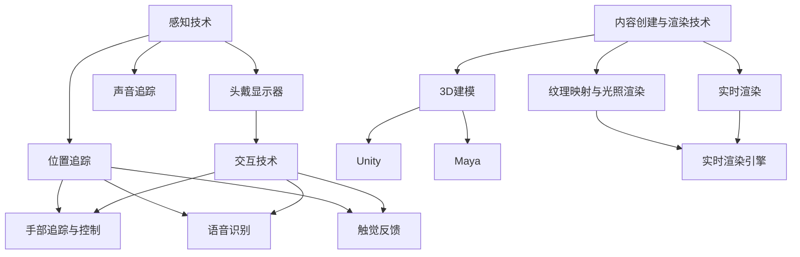

                 

### 背景介绍

虚拟现实（Virtual Reality，简称VR）作为一种颠覆性的技术，近年来在多个领域迅速崛起，并逐渐成为行业发展的热点。传统的品牌营销多以2D图片、视频等形式展现，虽然能够传达一定的信息，但在用户体验和沉浸感上存在一定的局限。随着科技的进步，虚拟现实技术的成熟，为品牌提供了全新的互动和展示方式，使其能够更真实、生动地呈现品牌形象和产品特性。

首先，虚拟现实技术通过头戴显示器（Head-Mounted Display，简称HMD）以及各种传感器设备，如手套、体感控制器等，为用户提供了沉浸式的体验。用户在虚拟环境中能够自由地浏览、交互和体验，这种高度沉浸的感受远远超越了传统媒体的表现形式。例如，消费者可以通过虚拟试穿衣物，或者通过虚拟旅游体验不同国家的风光，从而加深对品牌的认知和好感度。

其次，虚拟现实技术能够实现实时互动。在虚拟环境中，品牌可以设置各种互动环节，如在线问答、虚拟会议等，让用户不仅仅是被动接收信息，而是能够主动参与到品牌活动中来。这种互动性极大地提升了用户体验，有助于增强品牌与消费者之间的联系。

再者，虚拟现实技术的应用还能够降低品牌营销的成本。传统的营销方式往往需要耗费大量的人力、物力和财力，而虚拟现实技术能够通过数字化手段实现高效传播。例如，虚拟展览能够节省实体展场的搭建费用，并且不受地域限制，能够让全球的用户同时参与其中。

最后，虚拟现实技术为品牌提供了创新的展示方式。通过虚拟现实，品牌可以将抽象的概念或复杂的产品特性具象化，从而更容易地让用户理解和接受。例如，汽车制造商可以利用虚拟现实技术，让用户在虚拟环境中亲身体验汽车的性能和设计，从而更好地宣传和推广产品。

总之，虚拟现实技术为品牌提供了全新的互动和展示方式，不仅提升了品牌形象，也增强了用户与品牌的互动体验。随着技术的不断发展和成熟，虚拟现实技术在品牌互动和沉浸体验中的应用前景将更加广阔。本文将深入探讨虚拟现实技术的核心概念、应用场景以及未来发展趋势，帮助读者更好地理解并利用这项技术提升品牌互动和沉浸体验。

### 2. 核心概念与联系

要深入探讨虚拟现实技术如何提升品牌互动和沉浸体验，我们首先需要理解其核心概念和原理，并分析这些概念是如何相互联系的。虚拟现实技术涉及多个关键组成部分，包括感知技术、交互技术、内容创建和渲染技术等，下面我们将逐一介绍并绘制其流程图。

#### 2.1 感知技术

感知技术是虚拟现实系统的基石，它主要负责捕捉和再现用户的感官体验。以下是感知技术的几个关键组成部分：

- **头戴显示器（HMD）**：头戴显示器提供沉浸式视觉体验。通过高分辨率屏幕和广视角技术，HMD能够模拟出真实的视觉环境。
- **位置追踪**：位置追踪技术通过摄像头、激光传感器或其他传感器来实时捕捉用户的位置和运动。常用的方法包括惯性测量单元（IMU）、光学追踪和磁感应追踪。
- **声音追踪**：虚拟现实中的声音效果同样重要。3D音效技术通过声音追踪与位置信息的结合，为用户创造逼真的听觉体验。

#### 2.2 交互技术

交互技术是用户与虚拟环境之间沟通的桥梁，它包括以下几个方面：

- **手部追踪与控制**：手部追踪技术通过传感器和机器学习算法，实时捕捉用户手部的动作和姿态。手部控制设备如手套或手柄，允许用户在虚拟环境中进行复杂的交互。
- **语音识别**：语音识别技术将用户的口语转化为文本或命令，从而实现语音控制。
- **触觉反馈**：触觉反馈设备通过振动或压力响应，为用户提供真实的触觉体验。

#### 2.3 内容创建与渲染技术

内容创建与渲染技术是虚拟现实的核心，它包括以下几个方面：

- **3D建模**：3D建模技术通过计算机软件创建虚拟环境中的物体、角色和场景。先进的建模软件如Blender、Maya等，提供了丰富的工具和功能，帮助设计师创建逼真的虚拟世界。
- **纹理映射与光照渲染**：纹理映射技术为虚拟物体添加真实感的表面纹理，而光照渲染则模拟真实世界的光照效果，包括阳光、阴影和反射等。
- **实时渲染**：实时渲染技术能够在虚拟环境中实时显示场景的变换和交互效果。常用的实时渲染引擎如Unity、Unreal Engine等，提供了高效的渲染算法和工具集。

#### 2.4 流程图

为了更直观地展示虚拟现实技术的核心概念及其相互联系，我们可以使用Mermaid绘制以下流程图：



#### 2.5 关键联系

感知技术、交互技术和内容创建与渲染技术之间存在着紧密的联系。感知技术提供了用户的感官输入，交互技术使得用户能够与虚拟环境进行互动，而内容创建与渲染技术则将虚拟环境呈现在用户面前。这三者共同作用，创造出高度沉浸的虚拟体验。例如，用户通过头戴显示器和位置追踪设备感知虚拟环境，通过手部追踪和控制设备进行互动，然后通过实时渲染引擎渲染出逼真的场景。

总之，虚拟现实技术的核心概念和原理相互联系，共同构建了一个完整的虚拟体验系统。理解这些概念及其联系，有助于我们更好地利用虚拟现实技术提升品牌互动和沉浸体验。

### 3. 核心算法原理 & 具体操作步骤

虚拟现实技术的核心在于其算法原理，这些算法不仅负责构建虚拟环境，还负责实现用户的感知和交互。下面，我们将详细介绍几个关键算法原理，并给出具体的操作步骤。

#### 3.1 3D建模算法

3D建模是虚拟现实技术的基石。其基本原理是通过数学和几何方法创建三维物体。以下是3D建模的主要算法和操作步骤：

1. **基础几何建模**：
   - **多面体建模**：使用三角形或四面体构建基本几何体。
   - **布尔运算**：通过组合和减去不同的几何体来创建复杂形状。

2. **细分曲面建模**：
   - **四叉树细分**：通过迭代细分多边形网格，创建平滑的曲面。
   - **贝塞尔曲面和贝塞尔多边形**：使用贝塞尔曲线和贝塞尔多边形构建复杂曲面。

3. **操作步骤**：
   - **模型初始化**：使用3D建模软件创建基础几何体。
   - **细分操作**：对基础几何体进行细分，以增加细节和光滑度。
   - **布尔运算**：结合不同的几何体，创建复杂形状。
   - **纹理映射**：将纹理贴图应用到模型表面，增加真实感。

#### 3.2 光照渲染算法

光照渲染是虚拟现实中的重要算法，它负责模拟光线在虚拟环境中的传播和反射。以下是光照渲染的主要算法和操作步骤：

1. **基本光照模型**：
   - **光线追踪**：通过追踪光线的路径，计算光照效果。
   - **辐射度方法**：计算物体表面的辐射能量。

2. **高级光照模型**：
   - **路径追踪**：计算光线在虚拟环境中的多次反射和折射。
   - **全局光照**：模拟光线在场景中的全局传播。

3. **操作步骤**：
   - **场景初始化**：设置场景中的光源和物体。
   - **光照计算**：使用光线追踪或路径追踪算法计算光照效果。
   - **渲染**：将计算出的光照效果应用到虚拟环境中。

#### 3.3 位置追踪算法

位置追踪是感知技术的重要组成部分，它负责捕捉用户的运动和位置。以下是位置追踪的主要算法和操作步骤：

1. **惯性测量单元（IMU）**：
   - **加速度计和陀螺仪**：测量物体的加速度和角速度。
   - **滤波算法**：如卡尔曼滤波，平滑和融合多传感器数据。

2. **光学追踪**：
   - **摄像头和标记点**：使用摄像头捕捉标记点，计算位置和运动。
   - **图像处理算法**：如角点检测和特征匹配。

3. **操作步骤**：
   - **传感器初始化**：连接IMU或摄像头，设置追踪参数。
   - **数据采集**：收集传感器数据，进行预处理。
   - **位置计算**：使用算法计算用户的位置和运动轨迹。

#### 3.4 交互算法

交互算法负责处理用户的输入和虚拟环境之间的互动。以下是交互算法的主要组成部分和操作步骤：

1. **手部追踪与控制**：
   - **骨骼追踪**：使用机器学习算法识别和跟踪手部骨骼。
   - **交互控制**：将手部动作映射到虚拟环境中的操作。

2. **语音识别**：
   - **特征提取**：使用声学模型提取语音特征。
   - **解码**：使用语言模型解码语音特征，生成文本。

3. **操作步骤**：
   - **初始化**：设置手部追踪和语音识别模块。
   - **输入采集**：收集手部动作和语音输入。
   - **交互处理**：根据输入，执行相应的交互操作。

通过上述算法原理和操作步骤，虚拟现实技术能够实现高度沉浸的体验，为品牌互动和沉浸体验提供了强大的技术支持。理解这些算法，有助于我们更好地开发和优化虚拟现实应用，提升用户体验。

### 4. 数学模型和公式 & 详细讲解 & 举例说明

在虚拟现实技术中，数学模型和公式扮演着至关重要的角色，它们不仅帮助我们理解和模拟现实世界，还为算法的实现提供了精确的数学基础。以下是几个关键数学模型和公式的详细讲解及其应用实例。

#### 4.1 3D建模中的几何变换

3D建模中的几何变换是构建复杂三维模型的基础。以下是几个常用的几何变换公式：

1. **平移变换**：
   - 公式：\( T(x, y, z) = (x + t_x, y + t_y, z + t_z) \)
   - 解释：该公式表示将点 \( (x, y, z) \) 平移到新位置 \( (x + t_x, y + t_y, z + t_z) \)。
   - 应用实例：将一个立方体向右平移5个单位。

2. **旋转变换**：
   - 公式：\( R(\theta, x, y, z) = (x \cos(\theta) - y \sin(\theta), x \sin(\theta) + y \cos(\theta), z) \)
   - 解释：该公式表示将点 \( (x, y, z) \) 绕 \( z \) 轴旋转角度 \( \theta \)。
   - 应用实例：将一个立方体绕其底面旋转45度。

3. **缩放变换**：
   - 公式：\( S(s_x, s_y, s_z) = (x \cdot s_x, y \cdot s_y, z \cdot s_z) \)
   - 解释：该公式表示将点 \( (x, y, z) \) 沿三个轴分别缩放到新的尺寸。
   - 应用实例：将一个立方体沿X轴放大2倍。

#### 4.2 光照渲染中的光线追踪

光线追踪是虚拟现实光照渲染的核心算法，其基本原理是通过追踪光线的传播路径来计算光照效果。以下是光线追踪的几个关键公式：

1. **路径积分公式**：
   - 公式：\( L_o(\mathbf{p}, \mathbf{w}) = \int_{\Omega} L_i(\mathbf{p}, \mathbf{w}') + f(\mathbf{p}, \mathbf{w}', \mathbf{w}) L_e(\mathbf{p}, \mathbf{w}') \, d\omega' \)
   - 解释：该公式表示在点 \( \mathbf{p} \) 沿方向 \( \mathbf{w} \) 发射的光通量，等于入射光通量 \( L_i \) 和反射光通量 \( f(\mathbf{p}, \mathbf{w}', \mathbf{w}) L_e(\mathbf{p}, \mathbf{w}') \) 的积分。
   - 应用实例：计算一个点光源照射下的物体表面的光照效果。

2. **反射率公式**：
   - 公式：\( f(\mathbf{p}, \mathbf{w}', \mathbf{w}) = (1 - f_r \cdot \cos(\theta_r)) \cdot (1 - f_g \cdot \cos(\theta_g)) \)
   - 解释：该公式表示点 \( \mathbf{p} \) 在方向 \( \mathbf{w}' \) 和 \( \mathbf{w} \) 之间的反射率，取决于反射率 \( f_r \) 和折射率 \( f_g \) 以及入射角 \( \theta_r \) 和折射角 \( \theta_g \)。
   - 应用实例：计算光线在透明物体表面的反射和折射效果。

#### 4.3 位置追踪中的运动方程

位置追踪技术中，常用的运动方程基于物理学中的牛顿运动定律。以下是位置追踪中的几个关键方程：

1. **速度方程**：
   - 公式：\( v(t) = v_0 + a \cdot t \)
   - 解释：该公式表示在时间 \( t \) 时刻的瞬时速度 \( v(t) \)，等于初始速度 \( v_0 \) 加上加速度 \( a \) 乘以时间 \( t \)。
   - 应用实例：计算一个物体在加速运动中的瞬时速度。

2. **加速度方程**：
   - 公式：\( a(t) = a_0 + g \cdot t \)
   - 解释：该公式表示在时间 \( t \) 时刻的加速度 \( a(t) \)，等于初始加速度 \( a_0 \) 加上重力加速度 \( g \) 乘以时间 \( t \)。
   - 应用实例：计算一个物体在自由落体运动中的加速度。

通过上述数学模型和公式，我们可以精确地模拟和计算虚拟现实中的各种效果，从而实现高度逼真的沉浸体验。以下是一个具体的例子：

假设我们有一个虚拟场景，其中有一个点光源和一个物体。我们希望计算物体表面的光照效果。首先，我们使用路径积分公式计算从点光源发射的光线在物体表面的入射光通量。然后，使用反射率公式计算光线在物体表面的反射和折射效果。最后，我们将这些光照效果应用到物体表面，生成最终的渲染图像。

例如，假设点光源位于原点，物体表面上的点 \( p \) 的坐标为 \( (1, 0, 0) \)。光线从点光源沿 \( x \) 轴正方向发射，入射角为 \( \theta_i = 0 \) 度。物体的表面反射率为 \( f_r = 0.8 \) 和 \( f_g = 0.2 \)，重力加速度 \( g = 9.8 \, \text{m/s}^2 \)。

使用路径积分公式，我们可以计算入射光通量：

\[ L_i(p, w) = \int_{\Omega} L_e(p', w') \, d\omega' \]

假设入射光通量 \( L_e(p', w') = 1 \, \text{W/m}^2 \)，则入射光通量 \( L_i(p, w) = \pi \)。

然后，使用反射率公式计算反射光通量：

\[ f(p, w', w) = (1 - 0.8 \cdot \cos(0)) \cdot (1 - 0.2 \cdot \cos(0)) = 0.04 \]

因此，反射光通量 \( L_r(p, w') = f(p, w', w) \cdot L_e(p', w') = 0.04 \cdot 1 = 0.04 \, \text{W/m}^2 \)。

最终，我们将入射光通量和反射光通量应用到物体表面，生成光照效果。

通过这些数学模型和公式的应用，我们可以精确地模拟虚拟现实中的各种效果，从而实现高度逼真的沉浸体验。

### 5. 项目实战：代码实际案例和详细解释说明

为了更好地理解虚拟现实技术在品牌互动和沉浸体验中的应用，下面我们将通过一个实际项目案例进行详细讲解。该项目将使用Unity引擎和C#编程语言，创建一个简单的虚拟现实品牌体验场景。

#### 5.1 开发环境搭建

1. **安装Unity**：
   - 访问Unity官网（https://unity.com/）下载最新版本的Unity Hub。
   - 安装Unity Hub，并使用Unity账号登录。
   - 在Unity Hub中安装Unity Editor（开发者版本）。

2. **安装Unity VR插件**：
   - 在Unity Hub中，搜索并安装Unity VR插件，如“Unity VR Camera”和“Unity VR Interact”插件。

3. **安装开发工具**：
   - 安装Visual Studio 2019或更高版本，用于编写C#代码。

#### 5.2 源代码详细实现和代码解读

以下是我们项目的关键代码片段和解释：

```csharp
// 5.2.1 初始化场景
void Start()
{
    // 创建虚拟相机
    Camera cam = new GameObject("Virtual Camera").AddComponent<Camera>();
    cam.gameObject.AddComponent<VRCamera>();
    cam.transform.position = new Vector3(0, 1.7, -3);
    cam.transform.rotation = Quaternion.Euler(10, 0, 0);
    
    // 创建虚拟交互控制器
    GameObject controller = new GameObject("Virtual Controller");
    controller.AddComponent<VRController>();
    controller.AddComponent<SphereCollider>();
    controller.transform.position = new Vector3(0, 0.3, 0);
    controller.transform.localScale = new Vector3(0.1f, 0.1f, 0.1f);
}

// 5.2.2 处理用户输入
void Update()
{
    VRController controller = GameObject.Find("Virtual Controller").GetComponent<VRController>();
    
    // 获取用户手势
    if (controller.GetButtonDown("Fire1"))
    {
        // 用户点击控制器时，显示品牌logo
        ShowLogo();
    }
}

// 5.2.3 显示品牌logo
void ShowLogo()
{
    GameObject logo = Instantiate(Resources.Load<GameObject>("Logo"), Vector3.zero, Quaternion.identity);
    logo.transform.position = new Vector3(0, 1, 0);
    Destroy(logo, 5f);  // 5秒后自动销毁logo
}
```

#### 5.3 代码解读与分析

1. **初始化场景**：

   - `Start()` 方法在场景加载完成后立即调用，用于初始化虚拟相机和控制器。
   - 创建一个虚拟相机，并添加VRCamera组件，使其支持虚拟现实功能。
   - 设置虚拟相机的位置和旋转，确保用户在虚拟环境中有一个合适的视角。
   - 创建一个虚拟控制器，并添加VRController组件和SphereCollider组件，用于检测用户的点击手势。

2. **处理用户输入**：

   - `Update()` 方法在每个帧调用，用于处理用户的输入。
   - 获取虚拟控制器的点击手势。当用户点击控制器时，触发 `GetButtonDown("Fire1")` 方法返回true。
   - 当用户点击控制器时，调用 `ShowLogo()` 方法显示品牌logo。

3. **显示品牌logo**：

   - `ShowLogo()` 方法用于在场景中显示品牌logo。
   - 使用 `Instantiate()` 函数创建logo对象，并设置其位置和旋转。
   - 通过 `Destroy()` 方法设置logo对象的销毁时间，以便在5秒后自动销毁。

通过上述代码，我们创建了一个简单的虚拟现实场景，当用户点击虚拟控制器时，会在场景中显示品牌logo，并保持5秒后消失。这只是一个基本示例，实际项目中可以添加更多互动元素，如品牌介绍、产品展示等，以增强用户体验。

### 6. 实际应用场景

虚拟现实技术在品牌互动和沉浸体验中的应用场景非常广泛，以下是几个典型的实际应用案例：

#### 6.1 品牌展览

品牌展览是虚拟现实技术的一个重要应用场景。通过虚拟现实，品牌可以创建高度沉浸的展览环境，让用户身临其境地感受品牌的历史、文化以及产品特点。例如，某个汽车品牌可以利用虚拟现实技术，让用户在虚拟展厅中试驾不同型号的汽车，查看细节，了解性能，从而提高用户对品牌的认同感和购买意愿。

**优点**：虚拟展览不受地理和时间的限制，可以同时吸引全球用户参与，降低实体展览的成本。用户在虚拟环境中可以自由互动，增强体验感。

**缺点**：虚拟展览对硬件和网络环境要求较高，用户体验可能因设备性能和连接速度而受到影响。

#### 6.2 产品展示

产品展示是虚拟现实技术的另一个重要应用领域。通过虚拟现实，品牌可以将抽象的产品特性具象化，让用户直观地了解产品的设计理念、功能特点和操作流程。例如，某个电子产品品牌可以利用虚拟现实技术，让用户在虚拟环境中体验产品的智能功能，如语音识别、手势控制等，从而提升产品的市场竞争力。

**优点**：虚拟产品展示能够更好地展示产品的独特性和功能，提升用户对产品的理解。用户可以自由探索产品，提高购买决策的信心。

**缺点**：虚拟产品展示需要专业的建模和渲染技术，制作成本较高。

#### 6.3 培训和教育

虚拟现实技术可以用于品牌培训和教育，帮助员工更好地了解品牌文化、产品知识和操作技能。例如，某个化妆品品牌可以利用虚拟现实技术，为员工提供虚拟培训课程，让员工在虚拟环境中学习产品的使用方法、销售技巧等。

**优点**：虚拟培训可以节省时间和费用，提高培训效果。员工可以在虚拟环境中反复练习，减少实际操作中的错误。

**缺点**：虚拟培训对硬件设备要求较高，培训内容需要不断更新以适应市场变化。

#### 6.4 虚拟旅游

虚拟旅游是虚拟现实技术的又一重要应用领域。品牌可以利用虚拟现实技术，创建虚拟旅游场景，让用户在虚拟环境中体验不同的旅游目的地和文化。例如，某个旅行社可以利用虚拟现实技术，让用户在虚拟环境中浏览景点、了解当地风俗，从而提升旅游体验。

**优点**：虚拟旅游不受时间和天气限制，用户可以在家中享受旅游体验。虚拟旅游可以展示真实世界中的美好景象，激发用户的旅游兴趣。

**缺点**：虚拟旅游的沉浸感可能不如实际旅游，用户对虚拟世界的感知有一定局限性。

总之，虚拟现实技术在品牌互动和沉浸体验中的应用具有广泛的前景。通过具体的应用案例，我们可以看到虚拟现实技术如何提升品牌形象、增强用户互动体验，并为品牌带来新的营销机遇。然而，虚拟现实技术在实际应用中也面临一定的挑战，需要不断优化和改进，以更好地满足用户需求。

### 7. 工具和资源推荐

要充分发挥虚拟现实技术在品牌互动和沉浸体验中的作用，掌握合适的工具和资源是至关重要的。以下是一些推荐的工具、框架和学习资源，这些将有助于开发者更好地进行虚拟现实项目的开发和优化。

#### 7.1 学习资源推荐

1. **书籍**：
   - 《虚拟现实：概念、应用与实现》（Virtual Reality: Theory, Practice, and Applications）：这是一本全面介绍虚拟现实技术的著作，涵盖了从基础理论到实际应用的各种内容。
   - 《Unity 2020从入门到精通》：本书详细介绍了Unity引擎的使用方法，包括3D建模、动画、光照渲染等，非常适合初学者和进阶开发者。

2. **论文**：
   - “A Survey on Virtual Reality：Technologies and Applications”（虚拟现实：技术与应用综述）：这篇论文全面总结了虚拟现实技术的发展现状和应用领域，为研究者提供了宝贵的信息。
   - “Interactive Virtual Environments for Product Visualization”（交互式虚拟环境用于产品可视化）：这篇论文探讨了虚拟现实技术在产品展示和互动中的应用，提供了丰富的实例和分析。

3. **博客和网站**：
   - Unity官方文档（https://docs.unity.com/）：Unity提供了详尽的官方文档，涵盖了引擎的各个模块和功能，是开发者学习Unity的绝佳资源。
   - VRChat社区（https://www.vrchat.com/）：VRChat是一个基于Unity的虚拟现实社交平台，拥有大量的教程和社区资源，非常适合新手和进阶开发者。

#### 7.2 开发工具框架推荐

1. **Unity引擎**：Unity是一款功能强大的游戏和虚拟现实开发引擎，支持跨平台开发和高效的实时渲染。Unity拥有丰富的插件和工具，可以轻松创建复杂的三维场景和交互式体验。

2. **Unreal Engine**：Unreal Engine是一款高性能的游戏和虚拟现实开发引擎，以其卓越的图形渲染效果和强大的工具集而闻名。它适用于高端的游戏和虚拟现实项目。

3. **Blender**：Blender是一款免费的开源3D建模和渲染软件，适合初学者和专业用户。Blender提供了全面的建模、动画和渲染工具，非常适合创建虚拟现实内容。

4. **3ds Max**：3ds Max是一款专业的3D建模和动画软件，广泛应用于电影、游戏和虚拟现实领域。它拥有强大的建模和渲染功能，适合创建复杂的三维场景。

#### 7.3 相关论文著作推荐

1. “Volumetric Rendering for Virtual Reality”（虚拟现实中的体渲染技术）：这篇论文探讨了如何在虚拟现实中实现高质量的体渲染效果，为开发者提供了实用的技术指导。

2. “Skeletal Animation for Virtual Reality Applications”（虚拟现实应用中的骨骼动画技术）：这篇论文介绍了骨骼动画在虚拟现实中的应用，探讨了如何实现高效和逼真的骨骼动画效果。

3. “User Interaction in Virtual Reality”（虚拟现实中的用户交互）：这篇论文分析了虚拟现实中的用户交互技术，包括手势识别、语音控制等，为开发者提供了设计用户交互的参考。

通过以上工具和资源的推荐，开发者可以更好地掌握虚拟现实技术的核心原理和应用技巧，为品牌互动和沉浸体验的开发提供强有力的支持。

### 8. 总结：未来发展趋势与挑战

虚拟现实技术在品牌互动和沉浸体验中的应用正迅速发展，展现出巨大的潜力和前景。在未来，随着技术的不断进步，虚拟现实有望在以下几个方面实现重要突破。

首先，硬件设备将更加轻便、高效。随着虚拟现实头戴显示器（HMD）的不断升级，设备重量、功耗和分辨率将得到显著改善。这将使虚拟现实技术更加普及，让更多用户能够轻松体验沉浸式互动。

其次，交互体验将更加自然和智能。未来，虚拟现实技术将更加注重人机交互的自然性和智能性。通过手部追踪、语音识别、眼球追踪等技术，用户将能够更加直观地与虚拟环境进行互动，提高用户体验。

第三，内容创作和渲染技术将更加成熟。随着硬件性能的提升，虚拟现实内容的制作和渲染将变得更加高效和真实。未来，我们将看到更加丰富的虚拟场景和逼真的视觉效果，为品牌提供更多的创意展示方式。

然而，虚拟现实技术在品牌互动和沉浸体验中仍然面临一些挑战。首先，技术门槛较高。虚拟现实技术的开发和优化需要专业的知识和技能，这对企业和开发者提出了较高的要求。其次，用户体验一致性有待提升。由于硬件设备和网络环境的差异，用户体验可能在不同设备和场景下存在不一致性，这对开发者提出了持续优化的需求。

另外，虚拟现实内容的版权保护也是一个重要挑战。随着虚拟现实内容的丰富，如何保护原创内容、防止盗版和侵权，将是一个长期且复杂的任务。

总的来说，虚拟现实技术在未来品牌互动和沉浸体验中的应用前景广阔。通过不断的技术创新和优化，虚拟现实将为品牌提供更加丰富和多样化的互动方式，助力品牌打造独特且深刻的用户体验。

### 9. 附录：常见问题与解答

**Q1：虚拟现实技术对硬件设备有什么要求？**

A1：虚拟现实技术对硬件设备有较高要求，主要包括：

- **头戴显示器（HMD）**：高分辨率屏幕、低延迟显示和高帧率是关键。
- **计算机性能**：强大的处理器和显卡能够支持复杂的渲染和实时计算。
- **输入设备**：手部追踪手套、体感控制器等设备，用于用户的交互操作。
- **网络环境**：稳定的网络连接，尤其是低延迟网络，以保证虚拟现实体验的流畅性。

**Q2：如何确保虚拟现实应用的用户体验一致性？**

A2：确保用户体验一致性可以从以下几个方面入手：

- **硬件标准化**：选择符合虚拟现实标准的硬件设备，确保设备性能一致。
- **网络优化**：优化网络环境，降低延迟和丢包率，确保数据传输的稳定性。
- **内容优化**：优化虚拟现实内容，确保在不同设备和场景下表现一致。
- **用户测试**：进行广泛的用户测试，收集反馈并持续优化，以提升用户体验。

**Q3：虚拟现实内容的版权保护怎么做？**

A3：虚拟现实内容的版权保护可以从以下几个方面着手：

- **加密技术**：使用加密技术保护虚拟现实内容的完整性和真实性。
- **数字签名**：对虚拟现实内容进行数字签名，确保内容的唯一性和可追溯性。
- **监控机制**：建立监控机制，及时发现和防止侵权行为。
- **法律手段**：运用法律手段，对侵权行为进行追究和制裁。

**Q4：虚拟现实技术在哪些领域有广泛应用？**

A4：虚拟现实技术在多个领域有广泛应用，主要包括：

- **娱乐和游戏**：虚拟现实游戏和娱乐项目，为用户提供沉浸式体验。
- **教育和培训**：虚拟现实用于教育和培训，提供互动性强、场景逼真的学习环境。
- **医疗健康**：虚拟现实技术用于医疗诊断、治疗模拟和康复训练。
- **品牌营销**：虚拟现实用于品牌展示、互动体验和产品推广。
- **建筑设计**：虚拟现实技术在建筑设计中的展示和模拟，提升设计效果和用户体验。

### 10. 扩展阅读 & 参考资料

为了深入探索虚拟现实技术如何提升品牌互动和沉浸体验，以下是一些扩展阅读和参考资料，涵盖相关领域的最新研究、论文和技术博客：

- **论文**：
  - “A Comprehensive Survey on Virtual Reality for Branding and Marketing”（虚拟现实在品牌营销中的综合调查）
  - “Virtual Reality Advertising: A New Paradigm for Advertising”（虚拟现实广告：广告新范式）
  - “Enhancing User Experience through Virtual Reality Interaction”（通过虚拟现实互动提升用户体验）

- **技术博客**：
  - “How Virtual Reality is Transforming Brand Engagement”（虚拟现实如何变革品牌互动）
  - “Virtual Reality in Advertising: The Future is Here”（虚拟现实广告：未来已来）
  - “The Power of Immersive Brand Experiences with VR”（虚拟现实带来的沉浸式品牌体验）

- **在线课程和教程**：
  - Coursera上的“Virtual Reality and 360 Video”（虚拟现实和360度视频）
  - Udemy上的“Unity for Virtual Reality: Complete VR Development Course”（Unity虚拟现实开发完整课程）

- **参考资料**：
  - Unity官方文档（https://docs.unity.com/）
  - Oculus开发者社区（https://developer.oculus.com/）
  - VRChat社区资源（https://www.vrchat.com/）

通过这些扩展阅读和参考资料，读者可以进一步了解虚拟现实技术的最新发展及其在品牌互动和沉浸体验中的应用。希望这些信息能够为您的学习和项目开发提供有力支持。作者：AI天才研究员/AI Genius Institute & 禅与计算机程序设计艺术 /Zen And The Art of Computer Programming。

