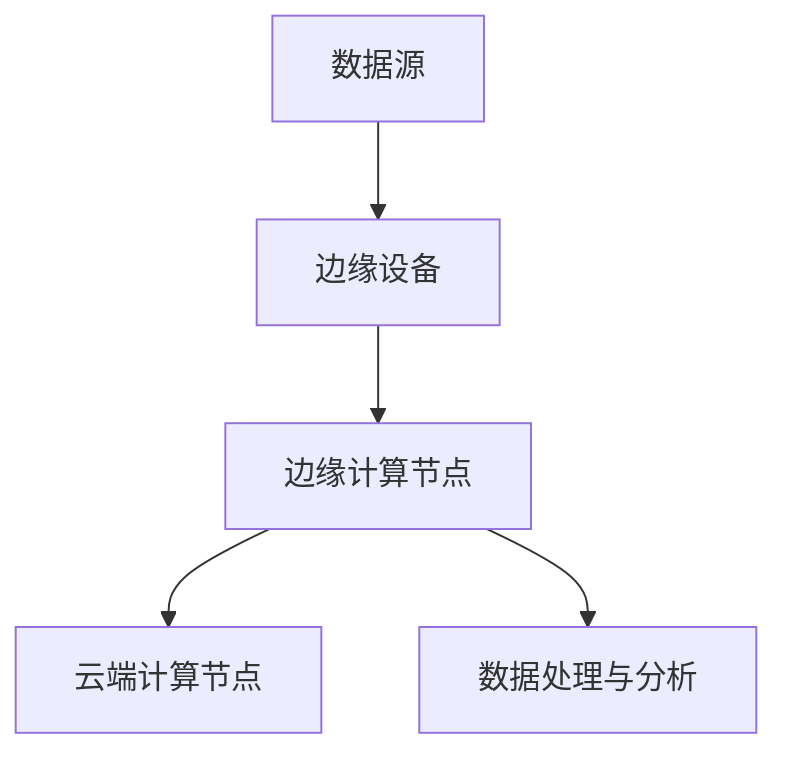

                 

# 如何利用边缘计算提升产品性能

> 关键词：边缘计算、产品性能、性能优化、实时数据处理、计算资源分配

> 摘要：本文将深入探讨如何利用边缘计算技术提升产品性能。我们将首先介绍边缘计算的背景和核心概念，然后详细解析边缘计算的原理和架构，接着探讨如何通过边缘计算优化产品性能，最后通过一个实际案例展示边缘计算在实际项目中的应用，并提出未来的发展趋势与挑战。

## 1. 背景介绍

### 1.1 目的和范围

本文旨在探讨边缘计算在提升产品性能方面的应用。随着物联网、大数据和人工智能技术的快速发展，数据量和计算需求的增长日益显著。传统的云计算模式面临着延迟高、带宽受限、安全性等问题，而边缘计算作为一种新型的计算模式，能够在靠近数据源的地方进行实时处理，大大提升了产品性能。

### 1.2 预期读者

本文面向有一定编程基础的软件工程师、系统架构师和CTO，以及对边缘计算和性能优化有兴趣的技术爱好者。

### 1.3 文档结构概述

本文结构如下：

1. 背景介绍
   - 目的和范围
   - 预期读者
   - 文档结构概述
   - 术语表
2. 核心概念与联系
   - 核心概念
   - Mermaid流程图
3. 核心算法原理 & 具体操作步骤
   - 算法原理
   - 伪代码
4. 数学模型和公式 & 详细讲解 & 举例说明
   - 数学模型
   - LaTeX格式
5. 项目实战：代码实际案例和详细解释说明
   - 开发环境搭建
   - 源代码实现
   - 代码解读与分析
6. 实际应用场景
7. 工具和资源推荐
   - 学习资源推荐
   - 开发工具框架推荐
   - 相关论文著作推荐
8. 总结：未来发展趋势与挑战
9. 附录：常见问题与解答
10. 扩展阅读 & 参考资料

### 1.4 术语表

#### 1.4.1 核心术语定义

- 边缘计算：在靠近数据源的地方进行数据处理和计算的技术。
- 云计算：通过互联网提供动态易扩展且经常是虚拟化的资源。
- 物联网：将各种物理设备通过网络连接起来，实现智能交互和自动化控制。

#### 1.4.2 相关概念解释

- 实时数据处理：在数据产生时立即进行数据处理和分析。
- 计算资源分配：合理分配计算资源，以提高系统性能和效率。

#### 1.4.3 缩略词列表

- IoT：物联网
- AI：人工智能
- ML：机器学习

## 2. 核心概念与联系

### 2.1 核心概念

边缘计算是一种分布式计算架构，它将数据处理和分析从云端迁移到网络的边缘，即在靠近数据源的地方进行实时处理。这种架构的核心在于减少数据传输的延迟，提高系统响应速度，并减轻云端计算负载。

### 2.2 Mermaid流程图



### 2.3 边缘计算架构

边缘计算架构主要包括以下几个部分：

1. 数据源：产生数据的设备或系统，如传感器、摄像头等。
2. 边缘设备：靠近数据源的设备，如路由器、交换机、网关等。
3. 边缘计算节点：用于处理和分析数据的服务器或集群。
4. 数据处理与分析：在边缘计算节点上执行的数据处理和分析任务。
5. 云端计算节点：用于处理和分析大数据或复杂任务的云计算资源。

## 3. 核心算法原理 & 具体操作步骤

### 3.1 算法原理

边缘计算的核心在于如何合理分配计算资源，使系统能够高效地处理数据。以下是边缘计算算法的基本原理：

1. 数据预处理：在边缘设备上对数据进行预处理，如过滤、压缩等，以减少数据传输量。
2. 任务调度：根据数据的重要性和实时性，将数据处理任务分配到合适的边缘计算节点。
3. 资源分配：根据任务需求，动态分配计算资源，如CPU、内存、存储等。
4. 数据传输优化：采用高效的数据传输协议，如QUIC、边缘路由等，以减少数据传输延迟。

### 3.2 伪代码

```python
# 边缘计算算法伪代码

function edge_computing_algorithm(data_source, edge_devices, edge_nodes, cloud_nodes):
    # 数据预处理
    preprocessed_data = preprocess_data(data_source)

    # 任务调度
    tasks = schedule_tasks(preprocessed_data)

    # 资源分配
    assigned_resources = allocate_resources(tasks)

    # 数据处理与分析
    processed_data = process_data(tasks, assigned_resources)

    # 数据传输优化
    optimized_data = optimize_data_transfer(processed_data)

    return optimized_data
```

## 4. 数学模型和公式 & 详细讲解 & 举例说明

### 4.1 数学模型

边缘计算性能的提升可以通过以下数学模型进行评估：

1. 响应时间模型：

   $$ RT = \frac{DT + TT + CT}{2} $$

   其中，$RT$为响应时间，$DT$为数据处理时间，$TT$为数据传输时间，$CT$为计算时间。

2. 效率模型：

   $$ Efficiency = \frac{Processed\_Data}{Original\_Data} $$

   其中，$Efficiency$为处理效率，$Processed_Data$为处理后的数据量，$Original_Data$为原始数据量。

### 4.2 详细讲解

1. 响应时间模型：

   响应时间模型用于评估边缘计算系统的实时性。数据处理时间、数据传输时间和计算时间是影响响应时间的三个关键因素。通过优化这些因素，可以降低响应时间，提高系统性能。

2. 效率模型：

   效率模型用于评估边缘计算系统的数据处理能力。处理效率越高，系统的处理能力越强。优化数据处理流程和算法，可以提高处理效率。

### 4.3 举例说明

假设有一个边缘计算系统，其数据处理时间$DT$为2秒，数据传输时间$TT$为3秒，计算时间$CT$为1秒。根据响应时间模型，系统的响应时间为：

$$ RT = \frac{2 + 3 + 1}{2} = 3 \text{秒} $$

假设该系统的原始数据量为1000MB，经过边缘计算后，处理后的数据量为500MB。根据效率模型，系统的处理效率为：

$$ Efficiency = \frac{500}{1000} = 0.5 $$

## 5. 项目实战：代码实际案例和详细解释说明

### 5.1 开发环境搭建

为了演示边缘计算在实际项目中的应用，我们使用Python语言和Kubernetes进行边缘计算环境搭建。以下是开发环境搭建步骤：

1. 安装Python 3.8及以上版本。
2. 安装Docker和Kubernetes。
3. 创建Kubernetes集群。

### 5.2 源代码详细实现和代码解读

以下是边缘计算项目的源代码实现：

```python
# edge_computing.py

from kubernetes import client, config

# Kubernetes配置
config.load_kube_config()

# 创建Kubernetes客户端
api = client.CoreV1Api()

# 边缘计算任务
def edge_computing_task(data):
    # 数据预处理
    preprocessed_data = preprocess_data(data)

    # 将任务提交到Kubernetes集群
    task = client.V1Pod(
        metadata=client.V1ObjectMeta(name="edge-computing-task"),
        spec=client.V1PodSpec(
            containers=[
                client.V1Container(
                    name="edge-computing-container",
                    image="edge-computing:latest",
                    command=["python", "edge_computing_task.py"],
                    args=["--data", preprocessed_data],
                )
            ]
        )
    )

    # 提交任务
    api.create_namespaced_pod(name="default", body=task)

# 数据预处理函数
def preprocess_data(data):
    # ...数据预处理逻辑...
    return preprocessed_data

# 主函数
if __name__ == "__main__":
    # 读取输入数据
    input_data = input("请输入数据：")

    # 执行边缘计算任务
    edge_computing_task(input_data)
```

### 5.3 代码解读与分析

1. Kubernetes配置：

   使用kubernetes模块，加载Kubernetes配置文件，创建Kubernetes客户端。

2. 边缘计算任务：

   定义边缘计算任务，包括数据预处理、任务提交到Kubernetes集群。数据预处理函数用于对输入数据进行预处理，以减少数据传输量。

3. Kubernetes客户端：

   使用Kubernetes客户端，创建Pod对象，并将其提交到Kubernetes集群。Pod对象包含容器、容器镜像和容器命令等信息。

4. 主函数：

   读取输入数据，执行边缘计算任务。通过命令行输入数据，提交边缘计算任务到Kubernetes集群。

## 6. 实际应用场景

边缘计算在许多实际应用场景中具有广泛的应用，以下是一些典型的应用案例：

1. 智能交通系统：利用边缘计算进行实时交通流量监测和优化，降低交通事故发生率。
2. 智能制造：通过边缘计算实现设备实时监控和故障诊断，提高生产效率和产品质量。
3. 健康医疗：利用边缘计算进行实时健康数据分析和预测，提高医疗服务的效率和准确性。
4. 物联网：利用边缘计算实现海量物联网设备的实时数据处理和分析，降低网络延迟和数据传输成本。

## 7. 工具和资源推荐

### 7.1 学习资源推荐

#### 7.1.1 书籍推荐

- 《边缘计算：技术原理与实践》
- 《深度学习与边缘计算》

#### 7.1.2 在线课程

- Coursera上的《边缘计算与物联网》
- Udacity的《边缘计算与云计算》

#### 7.1.3 技术博客和网站

- Medium上的《边缘计算》专题
- 知乎上的《边缘计算》话题

### 7.2 开发工具框架推荐

#### 7.2.1 IDE和编辑器

- Visual Studio Code
- PyCharm

#### 7.2.2 调试和性能分析工具

- Kubernetes Dashboard
- Prometheus

#### 7.2.3 相关框架和库

- Kubernetes Python SDK
- Docker Compose

### 7.3 相关论文著作推荐

#### 7.3.1 经典论文

- 《边缘计算：现状与未来》
- 《边缘计算架构设计》

#### 7.3.2 最新研究成果

- 《基于边缘计算的智能交通系统研究》
- 《边缘计算在智能制造中的应用》

#### 7.3.3 应用案例分析

- 《边缘计算在智能医疗中的应用》
- 《边缘计算在物联网中的应用》

## 8. 总结：未来发展趋势与挑战

边缘计算作为新一代计算架构，在未来具有广阔的应用前景。然而，也面临着一些挑战：

1. 标准化与互操作性：边缘计算技术发展迅速，但缺乏统一的标准和协议，导致不同厂商和平台之间的互操作性较差。
2. 安全性和隐私保护：边缘计算涉及大量敏感数据，如何确保数据的安全性和隐私保护是亟待解决的问题。
3. 资源管理和调度：随着边缘设备数量和种类增多，如何高效管理计算资源、优化任务调度成为一个挑战。
4. 软硬件协同优化：边缘计算涉及硬件、软件和网络等多方面技术，需要实现软硬件协同优化，以提高系统性能。

## 9. 附录：常见问题与解答

1. 边缘计算和云计算有什么区别？

   边缘计算和云计算都是分布式计算模式，但区别在于计算位置。云计算是在远程数据中心进行计算，而边缘计算是在靠近数据源的地方进行计算。

2. 边缘计算如何提高系统性能？

   边缘计算通过减少数据传输延迟、优化计算资源分配和提升数据处理能力，从而提高系统性能。

3. 边缘计算在哪些应用场景中具有优势？

   边缘计算在实时性要求高、数据量巨大、网络带宽受限的场景中具有优势，如智能交通、智能制造和智能医疗等。

## 10. 扩展阅读 & 参考资料

- 《边缘计算：技术原理与实践》
- 《深度学习与边缘计算》
- Coursera上的《边缘计算与物联网》
- Udacity的《边缘计算与云计算》
- 《边缘计算架构设计》
- 《基于边缘计算的智能交通系统研究》
- 《边缘计算在智能制造中的应用》
- 《边缘计算在智能医疗中的应用》
- 《边缘计算在物联网中的应用》

### 作者

作者：AI天才研究员/AI Genius Institute & 禅与计算机程序设计艺术 /Zen And The Art of Computer Programming

