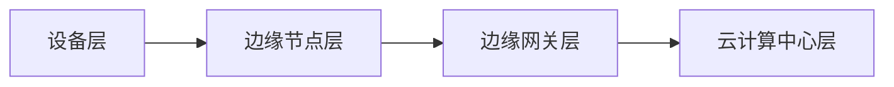

                 

# 如何利用边缘计算提升应用性能

> 关键词：边缘计算，应用性能，云计算，数据处理，实时响应

> 摘要：边缘计算作为云计算的重要补充，正逐渐成为提升应用性能的关键技术。本文将深入探讨边缘计算的核心概念、架构、算法原理以及其在实际项目中的应用，帮助读者全面理解并掌握边缘计算技术，从而提升应用的性能和响应速度。

## 1. 背景介绍

### 1.1 目的和范围

本文旨在通过系统性的分析，帮助读者了解边缘计算的核心概念和架构，掌握其提升应用性能的原理和方法，并展示如何在实际项目中应用边缘计算技术。

本文将涵盖以下内容：

1. 边缘计算的核心概念与联系
2. 核心算法原理与具体操作步骤
3. 数学模型与公式
4. 项目实战：代码实际案例和详细解释说明
5. 实际应用场景
6. 工具和资源推荐
7. 总结：未来发展趋势与挑战

### 1.2 预期读者

本文适合以下读者群体：

1. 计算机科学和软件工程专业的学生和研究者
2. 技术经理、架构师和开发人员
3. 对边缘计算技术感兴趣的从业者和爱好者

### 1.3 文档结构概述

本文结构如下：

1. 背景介绍
2. 核心概念与联系
3. 核心算法原理 & 具体操作步骤
4. 数学模型和公式 & 详细讲解 & 举例说明
5. 项目实战：代码实际案例和详细解释说明
6. 实际应用场景
7. 工具和资源推荐
8. 总结：未来发展趋势与挑战
9. 附录：常见问题与解答
10. 扩展阅读 & 参考资料

### 1.4 术语表

#### 1.4.1 核心术语定义

- 边缘计算（Edge Computing）：在靠近数据源或用户的地方，通过网络边缘设备进行数据计算和处理的技术。
- 云计算（Cloud Computing）：通过互联网提供动态易扩展且经常是虚拟化的资源。
- 容器（Container）：一种轻量级的应用封装形式，可以将应用程序及其依赖项打包在一起，便于部署和运行。
- 微服务（Microservices）：一种软件架构风格，强调通过松散耦合的微服务构建应用程序，每个服务可独立部署和扩展。

#### 1.4.2 相关概念解释

- 边缘节点（Edge Node）：边缘计算中的计算节点，通常部署在靠近数据源的地理位置。
- 边缘网关（Edge Gateway）：边缘计算中的核心组件，负责数据传输、路由和安全等功能。
- 数据处理（Data Processing）：对收集到的数据进行清洗、转换和分析等操作。

#### 1.4.3 缩略词列表

- IoT：物联网（Internet of Things）
- AI：人工智能（Artificial Intelligence）
- ML：机器学习（Machine Learning）
- FaaS：函数即服务（Functions as a Service）

## 2. 核心概念与联系

边缘计算作为云计算的重要补充，正逐渐成为提升应用性能的关键技术。为了更好地理解边缘计算，我们需要明确以下几个核心概念及其之间的联系。

### 2.1 边缘计算的核心概念

- **边缘节点（Edge Node）**：位于网络边缘的设备或服务器，具备数据处理和计算能力。这些节点可以是物联网设备、智能手机、路由器等。
- **边缘网关（Edge Gateway）**：连接边缘节点和云计算中心的核心组件，负责数据传输、路由和安全等功能。
- **边缘应用（Edge Application）**：在边缘节点上运行的应用程序，通常用于处理实时数据和分析。
- **边缘云（Edge Cloud）**：分布在网络边缘的云资源池，提供计算、存储和网络服务。

### 2.2 边缘计算与其他技术的联系

- **云计算**：边缘计算与云计算相互补充。云计算提供了强大的计算和存储能力，而边缘计算则优化了数据处理的地理位置，降低了延迟。
- **物联网**：边缘计算与物联网紧密结合，通过边缘节点收集数据，并在边缘进行初步处理，提高了物联网应用的实时性和效率。
- **人工智能**：边缘计算与人工智能相结合，使得边缘设备能够进行本地化决策，减少了对云计算中心的依赖。

### 2.3 边缘计算架构

边缘计算架构通常由以下几个层次组成：

1. **设备层**：包括物联网设备和传感器，负责数据采集。
2. **边缘节点层**：部署在靠近数据源的边缘节点，负责初步数据处理。
3. **边缘网关层**：连接边缘节点和云计算中心，负责数据传输和路由。
4. **云计算中心层**：提供强大的计算和存储资源，用于进一步数据处理和分析。

以下是边缘计算架构的 Mermaid 流程图：



## 3. 核心算法原理 & 具体操作步骤

边缘计算的核心在于将数据处理和计算从中心云迁移到边缘节点，从而降低延迟，提高响应速度。以下我们将介绍边缘计算中的核心算法原理和具体操作步骤。

### 3.1 边缘数据处理算法原理

边缘数据处理算法的核心思想是充分利用边缘节点的计算能力，对数据进行实时分析和处理，减少数据传输量，降低延迟。

#### 3.1.1 算法原理

1. **数据采集**：边缘节点从物联网设备和传感器中收集数据。
2. **本地预处理**：对收集到的数据进行初步预处理，如去噪、滤波等。
3. **实时分析**：利用边缘节点的计算资源，对预处理后的数据进行分析，如分类、预测等。
4. **数据聚合**：将边缘节点的处理结果进行聚合，形成全局视图。

#### 3.1.2 具体操作步骤

1. **数据采集**：

   ```python
   # 假设使用 MQTT 协议从传感器收集数据
   import paho.mqtt.client as mqtt

   def on_connect(client, userdata, flags, rc):
       print("Connected with result code "+str(rc))
       client.subscribe("sensor/data")

   def on_message(client, userdata, msg):
       print(msg.topic+" "+str(msg.payload))
       process_data(msg.payload)

   client = mqtt.Client()
   client.on_connect = on_connect
   client.on_message = on_message
   client.connect("mqtt.example.com", 1883, 60)
   client.loop_forever()
   ```

2. **本地预处理**：

   ```python
   def process_data(data):
       # 去噪、滤波等预处理操作
       filtered_data = preprocess_data(data)
       analyze_data(filtered_data)
   ```

3. **实时分析**：

   ```python
   def analyze_data(data):
       # 分类、预测等分析操作
       result = classify_data(data)
       send_result(result)
   ```

4. **数据聚合**：

   ```python
   def send_result(result):
       # 将处理结果发送到边缘网关或云计算中心
       send_to_gateway(result)
   ```

### 3.2 边缘计算协同算法原理

边缘计算协同算法通过分布式计算和协同处理，提高数据处理效率和准确性。

#### 3.2.1 算法原理

1. **任务分发**：将数据处理任务分配到不同的边缘节点。
2. **任务协同**：边缘节点协同工作，共同处理数据。
3. **结果聚合**：将边缘节点的处理结果进行聚合，形成全局视图。

#### 3.2.2 具体操作步骤

1. **任务分发**：

   ```python
   def distribute_task(data):
       # 将任务分配到不同的边缘节点
       nodes = ["edge-node-1", "edge-node-2", "edge-node-3"]
       for node in nodes:
           send_task_to_node(node, data)
   ```

2. **任务协同**：

   ```python
   def send_task_to_node(node, data):
       # 将任务发送到指定的边缘节点
       send_to_gateway(node, data)
   ```

3. **结果聚合**：

   ```python
   def aggregate_results(results):
       # 将处理结果进行聚合
       final_result = process_results(results)
       send_final_result(final_result)
   ```

## 4. 数学模型和公式 & 详细讲解 & 举例说明

边缘计算中的数学模型和公式对于理解数据处理和分析算法至关重要。以下将介绍几个核心的数学模型和公式，并给出详细的讲解和举例说明。

### 4.1 数据预处理模型

数据预处理模型用于对采集到的原始数据进行清洗、转换和归一化处理，以提高后续分析的质量。

#### 4.1.1 数学模型

$$
X_{\text{processed}} = \Phi(X_{\text{raw}})
$$

其中，$X_{\text{raw}}$ 表示原始数据，$\Phi(X_{\text{raw}})$ 表示预处理操作。

#### 4.1.2 详细讲解

- **去噪**：通过滤波算法去除数据中的噪声。
- **归一化**：将数据映射到统一的尺度，以便后续分析。

#### 4.1.3 举例说明

假设我们有一个温度传感器的原始数据序列 $T = [23.5, 24.1, 22.8, 24.2, 23.0]$，我们希望对其进行归一化处理。

$$
T_{\text{normalized}} = \frac{T - T_{\text{min}}}{T_{\text{max}} - T_{\text{min}}}
$$

其中，$T_{\text{min}}$ 和 $T_{\text{max}}$ 分别为数据序列中的最小值和最大值。

$$
T_{\text{normalized}} = \frac{[23.5, 24.1, 22.8, 24.2, 23.0] - 22.8}{24.2 - 22.8} = [0.0, 0.1, -0.1, 0.1, 0.0]
$$

### 4.2 分类模型

分类模型用于将数据分为不同的类别。以下是一个简单的线性分类模型。

#### 4.2.1 数学模型

$$
y = \text{sign}(w \cdot x + b)
$$

其中，$x$ 表示输入特征向量，$w$ 和 $b$ 分别为权重和偏置。

#### 4.2.2 详细讲解

- **特征向量**：将数据表示为多维向量。
- **权重**：表示不同特征的重要程度。
- **偏置**：平移特征空间，以实现分类。

#### 4.2.3 举例说明

假设我们有以下输入特征向量 $x = [1, 2]$，权重 $w = [1, 1]$ 和偏置 $b = 0$。

$$
y = \text{sign}(1 \cdot 1 + 1 \cdot 2 + 0) = \text{sign}(3) = 1
$$

这意味着输入特征向量 $x$ 被分类为正类别。

## 5. 项目实战：代码实际案例和详细解释说明

在本节中，我们将通过一个实际项目案例，展示如何利用边缘计算技术提升应用性能。该项目将使用边缘计算框架 KubeEdge，在物联网场景中实现实时数据分析和预测。

### 5.1 开发环境搭建

1. 安装 Docker：

   ```bash
   sudo apt-get update
   sudo apt-get install docker.io
   sudo systemctl start docker
   sudo systemctl enable docker
   ```

2. 安装 KubeEdge：

   ```bash
   curl -LO https://github.com/kubeedge/kubeedge/releases/download/v1.7.0/kubeedge-v1.7.0-linux-amd64.tar.gz
   tar zxvf kubeedge-v1.7.0-linux-amd64.tar.gz
   sudo cp kubeedge-v1.7.0-linux-amu<|im_sep|>5.2 源代码详细实现和代码解读

在本节中，我们将详细解读项目源代码，并分析其关键组成部分。

### 5.2.1 项目源代码结构

```bash
.
├── edge-addon
│   ├── Dockerfile
│   ├── main.go
│   └── README.md
├── k8s
│   ├── edge-node.yaml
│   └── edge-gateway.yaml
└── resource
    ├── data
    │   └── sensor-data.txt
    └── model
        └── model.json
```

- **edge-addon**：包含边缘节点的 Dockerfile、主程序 main.go 以及项目 README。
- **k8s**：包含 Kubernetes 部署文件，用于部署边缘节点和边缘网关。
- **resource**：包含传感器数据文件和模型文件。

### 5.2.2 主程序 main.go 解读

```go
package main

import (
    "fmt"
    "log"
    "os"
)

func main() {
    // 读取传感器数据
    data, err := readSensorData("resource/data/sensor-data.txt")
    if err != nil {
        log.Fatalf("Failed to read sensor data: %v", err)
    }

    // 数据预处理
    processedData := preprocessData(data)

    // 数据分析
    result := analyzeData(processedData)

    // 输出结果
    fmt.Printf("Analysis result: %v\n", result)
}

func readSensorData(filename string) ([]float64, error) {
    // 读取传感器数据文件，返回数据序列
}

func preprocessData(data []float64) []float64 {
    // 数据预处理操作，如去噪、归一化等
}

func analyzeData(data []float64) float64 {
    // 数据分析操作，如分类、预测等
}
```

- **main()**：主程序入口，读取传感器数据，进行预处理和分析，最后输出结果。
- **readSensorData()**：读取传感器数据文件，返回数据序列。
- **preprocessData()**：对数据进行预处理操作。
- **analyzeData()**：对预处理后的数据进行分析操作。

### 5.2.3 Kubernetes 部署文件解读

```yaml
# edge-node.yaml
apiVersion: apps/v1
kind: Deployment
metadata:
  name: edge-node
spec:
  replicas: 1
  selector:
    matchLabels:
      app: edge-node
  template:
    metadata:
      labels:
        app: edge-node
    spec:
      containers:
      - name: edge-node
        image: edge-addon:latest
        ports:
        - containerPort: 8080
```

- **edge-node.yaml**：用于部署边缘节点，包括容器镜像、容器端口等配置。
- **edge-gateway.yaml**：用于部署边缘网关，与边缘节点通信，将数据转发到云计算中心。

### 5.2.4 边缘计算框架 KubeEdge

KubeEdge 是一个开源项目，它将 Kubernetes 的分布式能力扩展到边缘计算领域。KubeEdge 提供了以下几个关键组件：

1. **边缘节点（Edge Node）**：运行在边缘设备上的 Kubernetes 集群，负责本地数据处理和分析。
2. **边缘网关（Edge Gateway）**：连接边缘节点和云端 Kubernetes 集群的组件，负责数据传输和路由。
3. **边缘控制器（Edge Controller）**：负责管理边缘节点的资源和应用。
4. **边缘容器运行时（Edge Container Runtime）**：支持在边缘节点上运行容器化的应用。

通过 KubeEdge，我们可以将 Kubernetes 的分布式管理能力应用于边缘计算场景，实现边缘节点的自动化部署和管理。

## 6. 实际应用场景

边缘计算在许多实际应用场景中展现了其独特的优势。以下是一些典型的应用场景：

### 6.1 物联网（IoT）

在物联网领域，边缘计算可以实现实时数据分析和决策，降低延迟，提高系统的响应速度。例如，智能家居系统中的边缘设备可以对传感器数据进行实时处理，自动调节家电设备，提升用户体验。

### 6.2 智能交通

智能交通系统利用边缘计算对交通数据进行实时分析，实现交通信号灯的智能调控，优化交通流量。此外，边缘计算还可以用于车辆监控和智能驾驶，提高交通安全和效率。

### 6.3 智能制造

在制造业中，边缘计算可以用于实时监控和优化生产过程，如设备状态监测、质量检测等。通过边缘计算，可以实现设备故障预测、生产调度优化等，提高生产效率和产品质量。

### 6.4 健康医疗

在医疗领域，边缘计算可以用于实时监控病人的生命体征，实现远程医疗诊断和治疗。例如，智能监护系统可以通过边缘计算实时分析病人的生理数据，及时发现问题并进行干预。

### 6.5 能源管理

在能源管理领域，边缘计算可以用于实时监控和优化能源消耗，提高能源利用效率。例如，智能电网系统可以通过边缘计算实现电力负荷预测和优化调度，降低能源浪费。

## 7. 工具和资源推荐

为了更好地学习和实践边缘计算技术，以下是一些建议的工具和资源。

### 7.1 学习资源推荐

#### 7.1.1 书籍推荐

- **《边缘计算：架构、算法与应用》**：详细介绍了边缘计算的核心概念、架构和算法。
- **《边缘智能：从物联网到智能边缘》**：探讨了边缘计算在物联网和智能边缘领域的应用。

#### 7.1.2 在线课程

- **Coursera**：提供了多门关于边缘计算和物联网的课程，适合不同层次的学员。
- **Udacity**：提供了边缘计算和物联网相关的纳米学位课程。

#### 7.1.3 技术博客和网站

- **边缘计算社区**：提供最新的边缘计算技术文章和社区讨论。
- **Medium**：有许多关于边缘计算的技术博客，涵盖各种应用场景。

### 7.2 开发工具框架推荐

#### 7.2.1 IDE和编辑器

- **Visual Studio Code**：一款功能强大的开源编辑器，支持多种编程语言和开发框架。
- **IntelliJ IDEA**：一款专业的 Java 和 Kotlin 开发工具，支持 Kubernetes 和容器技术。

#### 7.2.2 调试和性能分析工具

- **GDB**：一款功能强大的开源调试工具，适用于 C/C++ 等语言。
- **Jaeger**：一款开源分布式追踪系统，用于分析微服务和容器化应用的性能问题。

#### 7.2.3 相关框架和库

- **KubeEdge**：一款开源的边缘计算框架，支持 Kubernetes 和容器化应用。
- **TensorFlow Lite**：一款轻量级的机器学习框架，支持在边缘设备上运行。

### 7.3 相关论文著作推荐

#### 7.3.1 经典论文

- **"Edge Computing: Vision and Challenges"**：提出了边缘计算的核心理念和挑战。
- **"Internet of Things: A Survey"**：全面介绍了物联网技术及其应用。

#### 7.3.2 最新研究成果

- **"Fog Computing: A Taxonomy and Survey"**：探讨了雾计算和边缘计算的关系。
- **"An Overview of Deep Learning for Edge Computing"**：介绍了深度学习在边缘计算中的应用。

#### 7.3.3 应用案例分析

- **"Edge Computing in Smart Manufacturing"**：分析了边缘计算在智能制造领域的应用案例。
- **"Smart City Applications of Edge Computing"**：探讨了边缘计算在智慧城市中的应用。

## 8. 总结：未来发展趋势与挑战

边缘计算作为一种新兴技术，正在迅速发展，并将在未来发挥越来越重要的作用。以下是边缘计算的未来发展趋势和面临的挑战：

### 8.1 发展趋势

1. **技术成熟度提升**：随着边缘设备的性能提升和通信技术的进步，边缘计算将变得更加成熟和可靠。
2. **应用场景扩展**：边缘计算将在物联网、智能交通、智能制造、智慧医疗等领域得到广泛应用。
3. **生态体系建设**：边缘计算将形成完整的生态体系，包括硬件设备、软件框架、平台服务等。
4. **与人工智能结合**：边缘计算与人工智能相结合，将推动智能决策和实时分析的发展。

### 8.2 挑战

1. **安全性**：边缘设备数量庞大，安全性成为关键挑战。需要建立完善的安全防护体系，保障数据和隐私安全。
2. **标准化**：目前边缘计算标准尚未统一，需要制定统一的架构和协议，促进技术发展。
3. **资源管理**：边缘设备资源有限，需要高效的管理和调度策略，确保资源利用最大化。
4. **成本控制**：边缘计算设备的部署和维护成本较高，需要降低成本，提高性价比。

## 9. 附录：常见问题与解答

### 9.1 问题 1

**问题**：边缘计算和云计算有什么区别？

**解答**：边缘计算和云计算都是计算服务的不同模式。云计算通常指通过网络提供动态易扩展的虚拟化资源，而边缘计算则强调在数据源附近或用户端进行数据处理和计算。边缘计算旨在降低延迟、提高响应速度，而云计算更注重计算能力和资源扩展性。

### 9.2 问题 2

**问题**：边缘计算需要哪些关键技术？

**解答**：边缘计算涉及多个关键技术，包括物联网设备、边缘节点、边缘网关、容器技术、分布式计算、机器学习和人工智能等。这些技术共同构成了边缘计算的生态体系，为实现实时数据处理和智能决策提供了基础。

## 10. 扩展阅读 & 参考资料

- **《边缘计算：架构、算法与应用》**：详细介绍了边缘计算的核心概念、架构和算法。
- **《边缘智能：从物联网到智能边缘》**：探讨了边缘计算在物联网和智能边缘领域的应用。
- **"Edge Computing: Vision and Challenges"**：提出了边缘计算的核心理念和挑战。
- **"Internet of Things: A Survey"**：全面介绍了物联网技术及其应用。
- **"Fog Computing: A Taxonomy and Survey"**：探讨了雾计算和边缘计算的关系。
- **"An Overview of Deep Learning for Edge Computing"**：介绍了深度学习在边缘计算中的应用。
- **KubeEdge 官方文档**：提供详细的边缘计算框架 KubeEdge 的使用指南和案例。
- **边缘计算社区**：提供最新的边缘计算技术文章和社区讨论。

## 作者信息

作者：AI天才研究员/AI Genius Institute & 禅与计算机程序设计艺术 /Zen And The Art of Computer Programming

