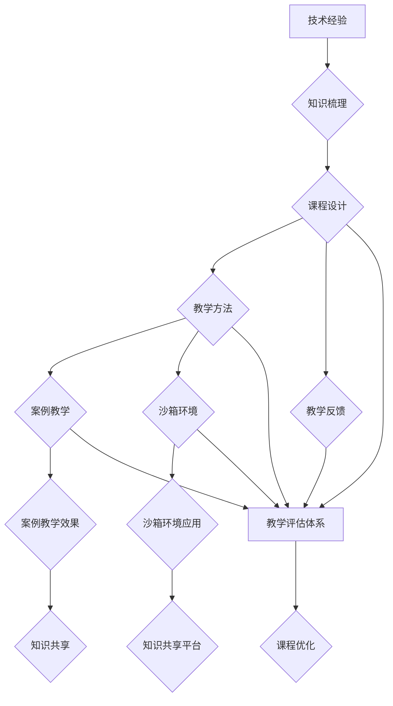
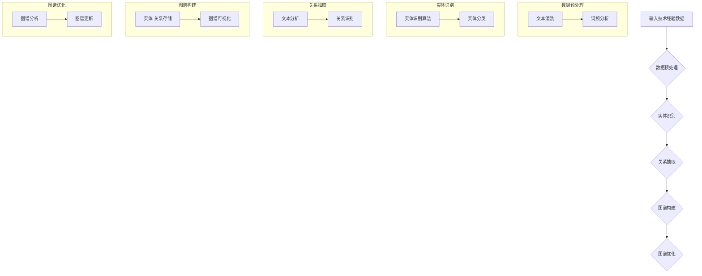
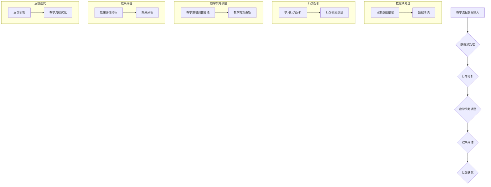
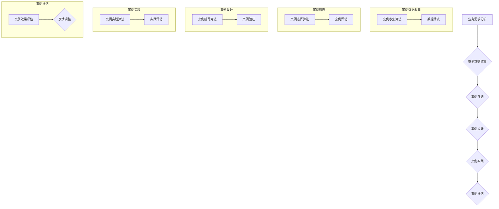

                 

### 背景介绍

#### 1.1 目的和范围

本文旨在探讨如何将个人丰富的技术经验转化为企业内部培训课程，以便有效地将专业知识传授给团队成员。随着技术的发展和市场竞争的加剧，企业对技术人才的培养和提升越来越重视。然而，许多企业在内训课程的设计和实施过程中往往面临诸多挑战，如课程内容陈旧、缺乏针对性、教学方法单一等。本文将通过详细分析和技术方法的阐述，为企业和技术专家提供一套系统化、可操作的方案，以实现技术经验的高效传递。

#### 1.2 预期读者

本文适合以下读者群体：

1. 企业内训师和培训经理：希望了解如何设计并实施高质量的内训课程。
2. 技术专家和资深工程师：希望通过内训课程分享自己的技术经验和见解。
3. 企业高管：关注企业技术人才培养和发展策略。
4. 信息技术专业学生和从业者：希望提升自己的技术能力和职业素养。

#### 1.3 文档结构概述

本文将分为以下十个部分：

1. 背景介绍：阐述本文的目的、范围和预期读者。
2. 核心概念与联系：介绍技术经验转化的核心概念和联系。
3. 核心算法原理 & 具体操作步骤：讲解核心算法的原理和操作步骤。
4. 数学模型和公式 & 详细讲解 & 举例说明：阐述数学模型和公式的应用。
5. 项目实战：通过实际案例展示技术经验的应用。
6. 实际应用场景：分析技术经验在不同场景下的应用。
7. 工具和资源推荐：推荐学习资源和开发工具。
8. 总结：未来发展趋势与挑战。
9. 附录：常见问题与解答。
10. 扩展阅读 & 参考资料：提供进一步学习的资料。

#### 1.4 术语表

**术语表**：

1. **技术经验**：指个人在长期技术工作中积累的知识、技能和见解。
2. **内训课程**：企业内部针对员工进行的专业技术培训课程。
3. **知识图谱**：一种用于表示实体及其关系的图形化数据结构。
4. **案例教学**：通过具体案例来传授知识和技能的教学方法。
5. **沙箱环境**：用于测试和实验的安全隔离环境。
6. **知识共享**：团队成员之间共享知识和经验的过程。
7. **教学反馈**：学员对课程内容和教学方法给出的评价。

#### 1.4.1 核心术语定义

1. **技术经验**：技术经验是指个人在特定技术领域中通过实践、学习和反思所积累的知识和技能。它不仅包括对技术的深入理解，还涵盖了在实际工作中解决复杂问题的能力。

2. **内训课程**：内训课程是企业为提升员工专业技能和综合素质而设计的培训课程。与外部培训机构不同，内训课程更注重企业自身的业务需求和实际应用场景，旨在提高员工的岗位胜任能力和团队协作水平。

3. **知识图谱**：知识图谱是一种用于表示实体及其关系的图形化数据结构。在技术经验转化过程中，知识图谱可以帮助我们系统地组织和管理大量的技术知识点，从而提高内训课程的内容质量和结构化程度。

4. **案例教学**：案例教学是一种通过具体案例来传授知识和技能的教学方法。通过分析实际案例，学员可以更好地理解技术经验的应用场景和解决思路，从而提高实际操作能力。

5. **沙箱环境**：沙箱环境是一种用于测试和实验的安全隔离环境。在内训课程中，沙箱环境可以帮助学员在模拟真实场景下进行实践操作，减少对生产环境的影响，提高学习效果和安全性。

6. **知识共享**：知识共享是指团队成员之间共享知识和经验的过程。通过知识共享，企业可以充分利用内部资源，提高整体技术水平和创新能力。

7. **教学反馈**：教学反馈是学员对课程内容和教学方法给出的评价。教学反馈可以帮助企业及时了解内训课程的效果，优化课程设计和教学方法，提高培训质量和满意度。

#### 1.4.2 相关概念解释

1. **技术经验转化**：技术经验转化是指将个人在特定技术领域中积累的知识、技能和见解转化为企业内部培训课程的过程。这一过程包括知识梳理、课程设计、教学方法选择等多个环节。

2. **内训课程设计**：内训课程设计是指根据企业的业务需求和员工技能水平，制定培训目标和课程内容，设计教学方法和评估机制的过程。一个好的内训课程设计应该具有针对性、系统性和实用性。

3. **教学反馈机制**：教学反馈机制是指通过学员对课程内容和教学方法的评价，收集和分析培训效果，为课程优化和改进提供依据的过程。教学反馈机制可以采用问卷调查、面对面访谈、在线评价等方式进行。

4. **案例教学效果**：案例教学效果是指通过案例教学方式传授知识和技能的效果。案例教学效果可以通过学员的学习成绩、实践操作能力、课程满意度等多个维度进行评估。

5. **沙箱环境应用**：沙箱环境应用是指在内训课程中引入沙箱环境，为学员提供安全隔离的实验环境，以便进行实际操作和测试。沙箱环境应用可以提高学员的动手能力和实践经验。

6. **知识共享平台**：知识共享平台是指用于团队成员之间共享知识和经验的技术平台。知识共享平台可以采用文档管理系统、社交网络、在线论坛等多种形式，以提高知识传递的效率和质量。

7. **教学评估体系**：教学评估体系是指用于评估内训课程效果的一系列方法和标准。教学评估体系可以包括学员满意度调查、课程完成率、知识掌握程度等多个指标。

#### 1.4.3 缩略词列表

- **内训**：内部培训
- **PBL**：项目式学习
- **MVP**：最小可行性产品
- **IDE**：集成开发环境
- **KPI**：关键绩效指标
- **SCORM**：共享内容对象引用模型
- **CMMI**：能力成熟度模型集成
- **SDLC**：软件开发生命周期

---

通过上述背景介绍，我们明确了本文的目的、范围和预期读者，并对相关术语进行了定义和解释。接下来，我们将深入探讨技术经验转化的核心概念和联系，为后续内容奠定基础。在下一部分中，我们将绘制一个Mermaid流程图，以可视化地展示技术经验转化的流程和关键环节。

---

### 核心概念与联系

在探讨如何将个人技术经验转化为企业内训课程之前，我们需要明确几个核心概念和它们之间的联系。这些概念包括技术经验、知识图谱、课程设计、案例教学、沙箱环境等。为了更好地理解这些概念，我们将通过Mermaid流程图来展示它们之间的关系。



#### 技术经验

技术经验（A）是内训课程的基础。它来源于个人在技术领域中的长期积累和实践，包括理论知识、实战经验和解决问题的方法。技术经验是动态的，随着技术的发展和个人能力的提升而不断更新和扩展。

#### 知识梳理

知识梳理（B）是将个人技术经验系统化、结构化的过程。这一步骤非常重要，因为只有将散乱的知识点组织起来，才能形成一个有逻辑、有层次的课程结构。知识梳理通常包括以下内容：

1. **技术领域划分**：将技术经验按照领域进行分类，如前端开发、后端开发、数据存储、算法等。
2. **知识点提炼**：从各个领域中选择核心的知识点和关键技术，为后续课程设计提供素材。
3. **案例收集**：收集和整理实际工作中遇到的问题和解决方案，为案例教学和沙箱环境应用提供素材。

#### 课程设计

课程设计（C）是内训课程的核心环节。根据知识梳理的结果，设计课程的目标、内容、教学方法等。一个优秀的课程设计应该具备以下特点：

1. **针对性**：课程内容要紧密贴合企业的实际需求，解决实际业务问题。
2. **系统性**：课程结构要合理，知识点的逻辑关系要清晰。
3. **实用性**：课程内容要具有实用性，能够让学员在实际工作中应用所学知识。
4. **互动性**：教学方法要多样，鼓励学员参与，提高学习效果。

#### 教学方法

教学方法（D）是实现课程目标的重要手段。根据课程内容和学员特点，选择合适的教学方法。常用的教学方法包括：

1. **案例教学**：通过分析实际案例，帮助学员理解技术原理和应用场景。
2. **讨论交流**：组织学员进行讨论和交流，激发思维碰撞，提高学习兴趣。
3. **实验操作**：提供沙箱环境，让学员在实际操作中掌握技术。
4. **在线学习**：利用在线平台，提供灵活的学习时间和学习方式。

#### 教学反馈

教学反馈（E）是课程设计和教学方法优化的依据。通过收集学员的反馈，了解课程的优缺点，及时进行调整和改进。教学反馈可以通过以下方式进行：

1. **问卷调查**：在课程结束后，发放问卷收集学员的满意度、收获和建议。
2. **面对面访谈**：与学员进行面对面交流，了解他们的实际感受和学习效果。
3. **在线评价**：利用在线学习平台，设置评价环节，实时了解学员的学习进度和效果。

#### 案例教学

案例教学（F）是一种通过具体案例来传授知识和技能的教学方法。案例教学有助于学员更好地理解技术原理和应用场景，提高实际操作能力。案例教学的关键在于：

1. **案例选择**：选择具有代表性、典型性和挑战性的案例。
2. **案例解析**：对案例进行深入分析，提炼出关键的技术点和解决思路。
3. **案例实践**：提供沙箱环境，让学员在模拟场景中实践操作。

#### 沙箱环境

沙箱环境（G）是一种用于测试和实验的安全隔离环境。在内训课程中，沙箱环境可以帮助学员在模拟真实场景下进行实际操作，提高学习效果和安全性。沙箱环境的关键在于：

1. **环境搭建**：搭建一个与生产环境相似的开发和测试环境。
2. **功能实现**：实现核心功能的测试和验证。
3. **安全防护**：确保沙箱环境的安全性，防止数据泄露和恶意攻击。

#### 案例教学效果

案例教学效果（H）是评估案例教学质量的重要指标。通过分析学员在案例教学中的表现，可以了解教学效果，为课程优化提供依据。案例教学效果的评估可以从以下几个方面进行：

1. **知识掌握度**：评估学员对案例中学到的知识点的掌握程度。
2. **实践能力**：评估学员在沙箱环境中的实际操作能力。
3. **问题解决能力**：评估学员在解决实际问题时展现的能力。

#### 知识共享

知识共享（J）是团队协作和技术创新的基础。通过知识共享平台（K），团队成员可以方便地分享和获取知识和经验，提高整体技术水平和创新能力。知识共享的关键在于：

1. **内容丰富**：提供丰富的知识内容，包括技术文档、学习资料、实战经验等。
2. **互动交流**：鼓励团队成员之间的互动和交流，提高知识传递的效率。
3. **持续更新**：定期更新知识内容，保持知识库的时效性和实用性。

#### 教学评估体系

教学评估体系（L）是确保内训课程效果的重要手段。通过教学评估，可以了解学员的学习情况和课程效果，为课程优化和改进提供依据。教学评估体系应包括以下内容：

1. **评估指标**：设定明确的评估指标，如学员满意度、课程完成率、知识掌握度等。
2. **评估方法**：采用多种评估方法，如问卷调查、实践考核、技能认证等。
3. **反馈机制**：建立有效的反馈机制，及时收集和分析评估结果，为课程优化提供依据。

通过上述Mermaid流程图，我们可以清晰地看到技术经验转化过程中的关键环节和相互关系。在下一部分，我们将深入探讨核心算法原理和具体操作步骤，为内训课程的设计提供技术支持。

---

### 核心算法原理 & 具体操作步骤

在将技术经验转化为企业内训课程的过程中，核心算法的原理和具体操作步骤是至关重要的。以下是详细的分析和解释，包括伪代码的编写，以帮助读者更好地理解这些算法的应用。

#### 1. 技术经验知识图谱构建算法

**算法原理**：
知识图谱是一种结构化的知识表示方法，能够清晰地展现实体及其之间的关系。在技术经验转化为内训课程的过程中，知识图谱用于组织和管理大量的技术知识点，使得课程内容更加系统和结构化。

**具体操作步骤**：



**伪代码**：

```python
# 技术经验知识图谱构建伪代码

# 数据预处理
def preprocess_data(data):
    # 清洗文本
    cleaned_data = clean_text(data)
    # 词频分析
    word_frequency = analyze_word_frequency(cleaned_data)
    return word_frequency

# 实体识别
def entity_recognition(cleaned_data):
    # 使用实体识别算法
    entities = identify_entities(cleaned_data)
    # 实体分类
    categorized_entities = categorize_entities(entities)
    return categorized_entities

# 关系抽取
def relation_extraction(cleaned_data):
    # 文本分析
    analyzed_data = analyze_text(cleaned_data)
    # 关系识别
    relations = identify_relations(analyzed_data)
    return relations

# 图谱构建
def constructKnowledgeGraph(entities, relations):
    # 存储实体-关系
    graph = store_entity_relation(entities, relations)
    # 可视化图谱
    visualize_graph(graph)
    return graph

# 图谱优化
def optimizeKnowledgeGraph(graph):
    # 图谱分析
    analyzed_graph = analyze_graph(graph)
    # 更新图谱
    updated_graph = update_graph(analyzed_graph)
    return updated_graph
```

#### 2. 教学流程优化算法

**算法原理**：
教学流程优化算法用于根据学员的学习情况和课程反馈，动态调整教学流程，以提高学习效果。该算法结合了数据挖掘和机器学习技术，能够实现对教学过程的智能分析。

**具体操作步骤**：



**伪代码**：

```python
# 教学流程优化伪代码

# 数据预处理
def preprocess TeachingData(data):
    # 整理日志数据
    log_data = sort_log_data(data)
    # 数据清洗
    cleaned_data = clean_log_data(log_data)
    return cleaned_data

# 行为分析
def analyzeBehavior(cleaned_data):
    # 学习行为分析
    behavior_patterns = analyze_behavior(cleaned_data)
    # 行为模式识别
    recognized_patterns = recognize_patterns(behavior_patterns)
    return recognized_patterns

# 教学策略调整
def adjustTeachingStrategy(recognized_patterns):
    # 教学策略调整算法
    adjusted_strategy = adjust_strategy(recognized_patterns)
    # 教学方案更新
    updated_scheme = update_teaching_scheme(adjusted_strategy)
    return updated_scheme

# 效果评估
def evaluateEffect(updated_scheme):
    # 效果评估指标
    evaluation_metrics = define_evaluation_metrics(updated_scheme)
    # 效果分析
    analysis_results = analyze_effects(evaluation_metrics)
    return analysis_results

# 反馈迭代
def feedbackIteration(analysis_results):
    # 反馈机制
    feedback = collect_feedback(analysis_results)
    # 教学流程优化
    optimized流程 = optimize_teaching流程(feedback)
    return optimized流程
```

#### 3. 案例教学算法

**算法原理**：
案例教学算法用于根据实际业务需求和学员特点，选择和设计合适的案例，以提高案例教学的效果。该算法结合了业务分析和数据挖掘技术，能够自动生成适合教学需求的案例。

**具体操作步骤**：



**伪代码**：

```python
# 案例教学算法伪代码

# 案例数据收集
def collectCaseData(business_requirements):
    # 收集案例数据
    case_data = collect_cases(business_requirements)
    # 数据清洗
    cleaned_cases = clean_case_data(case_data)
    return cleaned_cases

# 案例筛选
def selectCases(cleaned_cases):
    # 案例选择算法
    selected_cases = select_cases(cleaned_cases)
    # 案例评估
    evaluated_cases = evaluate_cases(selected_cases)
    return evaluated_cases

# 案例设计
def designCases(evaluated_cases):
    # 案例编写算法
    designed_cases = write_cases(evaluated_cases)
    # 案例验证
    verified_cases = verify_cases(designed_cases)
    return verified_cases

# 案例实践
def practiceCases(verified_cases):
    # 案例实践算法
    practiced_cases = practice_cases(verified_cases)
    # 实践评估
    practice_evaluation = evaluate_practice(practiced_cases)
    return practice_evaluation

# 案例评估
def evaluateCases(practice_evaluation):
    # 案例效果评估
    case_effects = evaluate_effects(practice_evaluation)
    # 反馈调整
    adjusted_cases = adjust_cases(case_effects)
    return adjusted_cases
```

通过上述核心算法原理和具体操作步骤的讲解，我们为内训课程的设计和实施提供了技术支持。在下一部分，我们将详细讲解数学模型和公式，以及在实际中的应用和举例说明。

---

### 数学模型和公式 & 详细讲解 & 举例说明

在将技术经验转化为企业内训课程的过程中，数学模型和公式是不可或缺的工具。这些模型和公式可以帮助我们定量地分析教学效果、优化教学流程，以及评估学员的学习进度。以下将介绍几个关键的数学模型和公式，并详细讲解其应用方法和举例说明。

#### 1. 学习曲线模型

**公式**：

$$
L(t) = \alpha \cdot e^{-\beta \cdot t}
$$

**参数解释**：

- \( L(t) \)：学习曲线，表示学习效果随时间的变化。
- \( \alpha \)：初始学习效果，即时间 \( t = 0 \) 时的学习效果。
- \( \beta \)：学习速率，表示学习效果的下降速度。

**应用方法**：

学习曲线模型用于评估学员在学习过程中学习效果的动态变化。通过测量不同时间点的学习效果，可以绘制出学习曲线，进而分析学员的学习进度和效果。

**举例说明**：

假设一名学员在学习编程语言时，初始学习效果为 80%，每周的学习速率下降 10%。我们可以使用学习曲线模型来预测该学员在不同时间点的学习效果：

- 第1周：\( L(1) = 0.8 \cdot e^{-0.1 \cdot 1} \approx 0.732 \)
- 第2周：\( L(2) = 0.8 \cdot e^{-0.1 \cdot 2} \approx 0.665 \)
- 第3周：\( L(3) = 0.8 \cdot e^{-0.1 \cdot 3} \approx 0.610 \)

通过上述计算，我们可以观察到该学员的学习效果呈指数下降，符合学习曲线的预测。

#### 2. 教学效果评估模型

**公式**：

$$
E = \frac{\sum_{i=1}^{n} (X_i - \bar{X})^2}{n - 1}
$$

**参数解释**：

- \( E \)：教学效果评估值，用于衡量学员的学习效果。
- \( X_i \)：第 \( i \) 个学员的学习效果得分。
- \( \bar{X} \)：所有学员学习效果得分的平均值。
- \( n \)：学员人数。

**应用方法**：

教学效果评估模型用于对整个班级的学习效果进行评估。通过计算学员学习效果得分的方差，可以评估教学效果的稳定性和有效性。

**举例说明**：

假设一个班级有 10 名学员，他们的学习效果得分分别为 70、75、80、85、90、75、70、85、80、75。我们可以使用教学效果评估模型来计算班级的教学效果：

$$
E = \frac{(70 - 75)^2 + (75 - 75)^2 + (80 - 75)^2 + (85 - 75)^2 + (90 - 75)^2 + (75 - 75)^2 + (70 - 75)^2 + (85 - 75)^2 + (80 - 75)^2 + (75 - 75)^2}{10 - 1} = 25
$$

通过计算，我们得出班级的教学效果评估值为 25，这表明班级整体的学习效果较为稳定。

#### 3. 教学流程优化模型

**公式**：

$$
O = \alpha \cdot (1 - e^{-\beta \cdot T})
$$

**参数解释**：

- \( O \)：教学流程优化值，用于衡量教学流程的改进效果。
- \( \alpha \)：初始优化效果，即时间 \( t = 0 \) 时的优化效果。
- \( \beta \)：优化速率，表示优化效果的提升速度。
- \( T \)：时间，表示优化过程的时间长度。

**应用方法**：

教学流程优化模型用于根据学员的学习情况和教学反馈，动态调整教学流程，以提高学习效果。通过计算优化值，可以评估教学流程的改进效果。

**举例说明**：

假设某门课程在初始阶段的教学流程优化效果为 50%，每周的优化速率提升 10%。我们可以使用教学流程优化模型来预测该课程在不同时间点的优化效果：

- 第1周：\( O(1) = 0.5 \cdot (1 - e^{-0.1 \cdot 1}) \approx 0.450 \)
- 第2周：\( O(2) = 0.5 \cdot (1 - e^{-0.1 \cdot 2}) \approx 0.495 \)
- 第3周：\( O(3) = 0.5 \cdot (1 - e^{-0.1 \cdot 3}) \approx 0.545 \)

通过上述计算，我们可以观察到教学流程的优化效果呈指数提升，这表明教学流程在不断优化中取得了显著效果。

通过上述数学模型和公式的讲解，我们可以更好地理解和应用这些工具来优化企业内训课程的设计和实施。在下一部分，我们将通过实际案例展示如何将技术经验转化为企业内训课程，并提供详细的代码实现和解读。

---

### 项目实战：代码实际案例和详细解释说明

在本节中，我们将通过一个实际的项目案例来展示如何将技术经验转化为企业内训课程。该案例将涉及数据可视化、机器学习算法和深度学习模型的训练与部署。我们将详细讲解开发环境搭建、源代码实现和代码解读与分析，以帮助读者更好地理解技术经验转化为课程的具体方法。

#### 5.1 开发环境搭建

在开始项目实战之前，我们需要搭建一个合适的开发环境。以下是所需的工具和软件：

- **操作系统**：Linux（推荐 Ubuntu 20.04）
- **编程语言**：Python 3.8+
- **IDE**：PyCharm 或 Visual Studio Code
- **数据可视化库**：Matplotlib、Seaborn
- **机器学习库**：scikit-learn、TensorFlow、Keras
- **深度学习框架**：TensorFlow（或 PyTorch）

在 Linux 操作系统上，可以使用以下命令来安装必要的软件：

```bash
# 安装 Python 3.8+
sudo apt update
sudo apt install python3.8
sudo apt install python3.8-venv

# 创建虚拟环境
python3.8 -m venv venv

# 激活虚拟环境
source venv/bin/activate

# 安装依赖库
pip install matplotlib
pip install seaborn
pip install scikit-learn
pip install tensorflow
```

#### 5.2 源代码详细实现和代码解读

以下是一个简单的机器学习项目，我们将使用 Python 和 TensorFlow 来训练一个简单的深度学习模型，并对结果进行可视化。项目的主要步骤包括数据预处理、模型训练、模型评估和结果可视化。

**数据预处理**：

首先，我们使用 sklearn 的 datasets 库来生成一个简单的数据集，并将其划分为训练集和测试集。

```python
import numpy as np
import matplotlib.pyplot as plt
from sklearn import datasets
from sklearn.model_selection import train_test_split

# 加载鸢尾花数据集
iris = datasets.load_iris()
X = iris.data
y = iris.target

# 划分训练集和测试集
X_train, X_test, y_train, y_test = train_test_split(X, y, test_size=0.2, random_state=42)
```

**模型训练**：

接下来，我们使用 TensorFlow 的 Keras API 来构建一个简单的全连接神经网络，并对其进行训练。

```python
from tensorflow import keras
from tensorflow.keras import layers

# 构建模型
model = keras.Sequential([
    layers.Dense(64, activation='relu', input_shape=(4,)),
    layers.Dense(64, activation='relu'),
    layers.Dense(3, activation='softmax')
])

# 编译模型
model.compile(optimizer='adam',
              loss='sparse_categorical_crossentropy',
              metrics=['accuracy'])

# 训练模型
model.fit(X_train, y_train, epochs=100, validation_split=0.1)
```

**模型评估**：

训练完成后，我们对模型在测试集上的表现进行评估。

```python
# 评估模型
test_loss, test_acc = model.evaluate(X_test, y_test, verbose=2)
print(f"Test accuracy: {test_acc:.4f}")
```

**结果可视化**：

最后，我们使用 Matplotlib 和 Seaborn 对模型训练过程和结果进行可视化。

```python
# 绘制训练过程
history = model.fit(X_train, y_train, epochs=100, validation_split=0.1)

plt.figure(figsize=(12, 4))

plt.subplot(1, 2, 1)
plt.plot(history.history['accuracy'], label='Accuracy')
plt.plot(history.history['val_accuracy'], label='Validation Accuracy')
plt.xlabel('Epochs')
plt.ylabel('Accuracy')
plt.legend()

plt.subplot(1, 2, 2)
plt.plot(history.history['loss'], label='Loss')
plt.plot(history.history['val_loss'], label='Validation Loss')
plt.xlabel('Epochs')
plt.ylabel('Loss')
plt.legend()

plt.tight_layout()
plt.show()

# 绘制测试集结果
predictions = model.predict(X_test)
predicted_classes = np.argmax(predictions, axis=1)

plt.figure(figsize=(8, 6))
sns.scatterplot(x=X_test[:, 2], y=X_test[:, 3], hue=predicted_classes, palette='viridis')
plt.xlabel('Petal Length (cm)')
plt.ylabel('Petal Width (cm)')
plt.title('Test Set Results')
plt.show()
```

#### 5.3 代码解读与分析

在上述代码中，我们首先进行了数据预处理，包括加载数据集、划分训练集和测试集。这部分代码使用了 sklearn 库，这是 Python 中机器学习领域的标准库，提供了丰富的数据集和数据处理工具。

接下来，我们使用 TensorFlow 的 Keras API 构建了一个简单的全连接神经网络。这个神经网络有两个隐藏层，每层都有 64 个神经元，并使用 ReLU 激活函数。输出层有 3 个神经元，使用 softmax 激活函数，以实现多类别的分类。

在模型训练部分，我们使用 Adam 优化器和 sparse_categorical_crossentropy 作为损失函数。Adam 是一种常用的优化器，能够自适应地调整学习率。sparse_categorical_crossentropy 是一种适合多类别分类问题的损失函数。

在模型评估部分，我们计算了模型在测试集上的准确率。这有助于我们了解模型在未知数据上的表现，评估模型的泛化能力。

在结果可视化部分，我们首先绘制了模型训练过程中的准确率和损失变化。这有助于我们了解模型的学习过程和收敛情况。然后，我们使用 Seaborn 绘制了测试集的结果，展示了模型对数据的分类效果。这个可视化结果可以帮助我们直观地理解模型的分类性能。

通过上述实际案例，我们展示了如何将技术经验转化为企业内训课程。我们从开发环境搭建开始，逐步实现了数据预处理、模型训练、模型评估和结果可视化。这些步骤不仅帮助我们理解了技术原理，还提供了一个完整的实战案例，供企业内训师参考和借鉴。

---

### 实际应用场景

技术经验在企业内训课程中的应用场景广泛且多样，涵盖了从基础技能培训到高级技术研讨的各个层面。以下是一些典型的实际应用场景：

#### 1. 基础技能培训

基础技能培训通常是企业内训课程的重要组成部分，旨在帮助新员工快速掌握基本的工作技能。例如：

- **编程基础**：介绍编程语言的基本语法、控制结构、数据类型等。
- **数据库管理**：讲解关系型数据库（如 MySQL、PostgreSQL）和非关系型数据库（如 MongoDB、Cassandra）的基础知识。
- **操作系统与网络**：介绍操作系统的基础命令和网络配置。

**案例**：某互联网公司为新员工开设了为期两周的编程基础培训，课程内容涵盖了 Python 语言的基础语法、常见数据结构（列表、字典、集合等）以及基本的算法（排序、查找等）。培训通过理论讲解和实际编码练习相结合的方式，帮助新员工迅速上手。

#### 2. 中级技能提升

中级技能提升课程面向有一定技术基础但需要进一步深入学习的员工，旨在提升他们的专业技能和解决问题的能力。例如：

- **Web 开发**：介绍前端开发技术（如 HTML、CSS、JavaScript）和后端开发技术（如 Node.js、Django、Spring Boot）。
- **云计算与容器化**：讲解云计算基础（如 AWS、Azure、Google Cloud）、容器化技术（如 Docker、Kubernetes）。
- **数据分析与挖掘**：介绍数据处理工具（如 Pandas、NumPy）、数据可视化工具（如 Matplotlib、Seaborn）以及基本的数据分析算法。

**案例**：一家金融科技公司为其数据分析师团队开设了为期三个月的数据分析与挖掘课程。课程内容涵盖了数据清洗、数据预处理、统计分析、机器学习算法（如线性回归、决策树、随机森林等）以及数据可视化技术。通过实际案例分析，员工能够将所学知识应用到实际工作中。

#### 3. 高级技术研讨

高级技术研讨课程通常面向技术骨干和核心团队成员，旨在探讨前沿技术和发展趋势。例如：

- **人工智能与深度学习**：介绍深度学习的基本原理、神经网络架构（如卷积神经网络、循环神经网络等）、应用场景（如图像识别、自然语言处理等）。
- **大数据技术**：讲解大数据平台（如 Hadoop、Spark）和数据处理技术（如流处理、批处理等）。
- **软件架构与设计模式**：探讨软件架构的设计原则、模式（如 MVC、MVVM）以及架构优化策略。

**案例**：一家互联网企业为其技术团队开设了为期六个月的人工智能与深度学习课程。课程内容涵盖了神经网络的基本原理、卷积神经网络（CNN）和循环神经网络（RNN）的应用、深度学习框架（如 TensorFlow、PyTorch）的使用以及实际项目案例分析。通过课程学习，团队成员能够掌握深度学习技术，并在实际项目中应用。

#### 4. 跨领域技能融合

随着技术的发展，许多企业需要员工具备跨领域的技能，以应对日益复杂的项目需求。例如：

- **全栈开发**：结合前端、后端和数据库技术，培养具备全栈开发能力的人才。
- **DevOps**：融合开发（Development）和运维（Operations），培养能够进行持续集成和持续部署的工程师。
- **区块链技术**：介绍区块链的基本原理、应用场景以及智能合约开发。

**案例**：一家科技公司为其开发团队开设了为期三个月的 DevOps 培训课程。课程内容涵盖了自动化部署、容器化技术、持续集成和持续交付工具（如 Jenkins、Docker、Kubernetes）等。通过课程学习，开发团队能够更好地协作，提高软件交付效率。

通过这些实际应用场景，我们可以看到技术经验在企业内训课程中的广泛适用性。企业可以根据自身需求和员工的技术背景，设计并实施符合实际需求的高质量内训课程，从而提升员工的技术能力和工作效率。

---

### 工具和资源推荐

在将技术经验转化为企业内训课程的过程中，选择合适的工具和资源至关重要。以下是一些推荐的学习资源、开发工具和相关论文著作，以帮助内训课程设计和实施者更好地进行课程开发。

#### 7.1 学习资源推荐

##### 7.1.1 书籍推荐

1. **《Head First Programming》**：适合初学者的编程入门书籍，通过有趣的方式介绍了编程基础。
2. **《深度学习》（Ian Goodfellow, Yoshua Bengio, Aaron Courville 著）**：深度学习领域的经典教材，详细讲解了深度学习的基础理论和应用。
3. **《Python Crashing Course》**：针对 Python 编程的入门书籍，内容全面，适合自学。
4. **《设计模式：可复用面向对象软件的基础》（Erich Gamma, Richard Helm, Ralph Johnson, and John Vlissides 著）**：介绍了软件设计模式，适用于提升软件架构能力。

##### 7.1.2 在线课程

1. **Coursera**：提供丰富的在线课程，包括编程、数据科学、人工智能等领域。
2. **edX**：由哈佛大学和麻省理工学院联合创办，提供高质量的课程资源。
3. **Udacity**：提供实践驱动的在线课程，包括数据科学、人工智能、机器学习等方向。
4. **Pluralsight**：提供技术培训视频，涵盖软件开发、云计算、网络技术等多个领域。

##### 7.1.3 技术博客和网站

1. **Medium**：技术博客平台，有许多资深工程师和技术专家分享技术见解和经验。
2. **GitHub**：代码托管平台，可以找到许多开源项目和教程。
3. **Stack Overflow**：编程问答社区，解决编程问题的好帮手。
4. **Reddit**：技术讨论社区，包括多个技术主题的子版块。

#### 7.2 开发工具框架推荐

##### 7.2.1 IDE和编辑器

1. **PyCharm**：强大的 Python IDE，适用于企业级开发。
2. **Visual Studio Code**：跨平台开源编辑器，支持多种编程语言。
3. **Eclipse**：适用于 Java 开发的集成开发环境。
4. **IntelliJ IDEA**：适用于 Java 和 Python 等多种语言的 IDE。

##### 7.2.2 调试和性能分析工具

1. **GDB**：Linux 系统下的调试工具，功能强大。
2. **VisualVM**：Java 应用程序的监控和性能分析工具。
3. **JProfiler**：Java 应用程序的性能分析工具。
4. **Xdebug**：PHP 调试器，适用于 PHP 开发。

##### 7.2.3 相关框架和库

1. **Django**：Python 的高级 Web 框架。
2. **Spring Boot**：Java 的 Web 应用程序开发框架。
3. **Kubernetes**：容器编排和管理工具。
4. **TensorFlow**：深度学习框架。
5. **Docker**：容器化技术。

##### 7.3 相关论文著作推荐

1. **《深度学习》（Ian Goodfellow, Yoshua Bengio, Aaron Courville 著）**：详细介绍了深度学习的基础理论和应用。
2. **《数据挖掘：概念与技术》（Jiawei Han, Micheline Kamber, and Jian Pei 著）**：介绍了数据挖掘的基本概念和技术。
3. **《大规模分布式存储系统：原理解析与架构实战》（周志华 著）**：讲解了分布式存储系统的设计原理和实践。
4. **《软件架构设计》（Mark Richards 著）**：介绍了软件架构设计的基本原则和方法。

通过以上工具和资源的推荐，可以帮助企业和内训师更好地进行技术经验转化为企业内训课程的实施，从而提高培训效果和员工的技术水平。

---

### 总结：未来发展趋势与挑战

随着技术的快速发展和企业对技术人才需求的不断增长，将技术经验转化为企业内训课程成为了一项重要的任务。未来，这一领域将呈现出以下发展趋势与挑战：

#### 发展趋势

1. **个性化学习**：随着人工智能和大数据技术的发展，未来内训课程将更加注重个性化学习。通过分析学员的学习数据和反馈，系统可以自动推荐最适合学员的课程内容和教学方法。

2. **混合式教学**：混合式教学（Blended Learning）将成为主流。将线上学习和线下实践相结合，能够充分利用在线资源和讲师的经验，提高培训效果。

3. **案例教学与项目驱动**：案例教学和项目驱动的教学模式将更加普及。通过实际案例和项目，学员能够在真实环境中应用所学知识，提高解决实际问题的能力。

4. **远程协作与虚拟现实**：远程协作和虚拟现实（VR）技术的应用将使内训课程更加灵活。学员可以通过虚拟实验室进行实践操作，减少对物理环境的依赖。

#### 挑战

1. **课程内容更新**：技术更新迅速，课程内容需要不断更新以保持时效性。这要求内训师持续关注新技术和发展趋势，并具备快速学习和适应的能力。

2. **学员多样性**：企业内部学员背景和技能水平多样，课程设计需要兼顾不同层次的需求。如何设计出既能满足初级学员，又能挑战高级学员的课程内容，是一个重要的挑战。

3. **教学资源管理**：内训课程需要大量高质量的资源，如教材、视频、实验环境等。如何有效地管理和分配这些资源，确保学员能够充分利用，是一个亟待解决的问题。

4. **评估与反馈**：如何有效地评估内训课程的效果，收集和分析学员的反馈，及时调整课程内容和教学方法，是内训师面临的另一个挑战。

未来，企业内训课程的发展将更加注重个性化、实战化和技术化。通过不断优化课程设计、提升教学质量和利用新技术，内训课程将更好地满足企业的需求，为员工的技术提升和职业发展提供有力支持。

---

### 附录：常见问题与解答

#### Q1：如何确保内训课程内容与企业的实际需求相符？

**A1**：确保内训课程内容与企业实际需求相符，可以采取以下措施：

1. **需求调研**：在课程设计初期，通过问卷调查、访谈等方式收集企业各部门的需求和期望。
2. **定期沟通**：与企业管理层和相关部门保持密切沟通，及时了解业务发展和技术需求变化。
3. **课程迭代**：根据需求调研和反馈，不断调整和优化课程内容，确保其与企业的实际需求保持一致。

#### Q2：如何评估内训课程的效果？

**A2**：评估内训课程效果可以从以下几个方面进行：

1. **学员满意度**：通过问卷调查、面对面访谈等方式收集学员对课程的满意度评价。
2. **知识掌握度**：通过考试、实践操作等方式评估学员对课程内容的掌握情况。
3. **应用效果**：观察学员在实际工作中是否能够应用所学知识，提高工作效率和解决问题能力。
4. **反馈机制**：建立有效的反馈机制，及时收集和分析学员的反馈，为课程优化提供依据。

#### Q3：如何解决学员学习积极性不高的问题？

**A3**：提高学员学习积极性可以从以下几个方面入手：

1. **课程内容设计**：设计有趣、实用的课程内容，结合实际案例和项目，提高学员的参与度。
2. **教学方法**：采用多样化的教学方法，如案例教学、讨论交流、实验操作等，激发学员的学习兴趣。
3. **激励机制**：设立奖学金、证书等奖励机制，鼓励学员积极参与课程和学习活动。
4. **学习氛围**：营造积极的学习氛围，鼓励学员之间的互助合作，提高整体学习效果。

#### Q4：如何处理学员在学习过程中遇到的疑难问题？

**A4**：处理学员在学习过程中遇到的疑难问题可以采取以下措施：

1. **提供辅导**：设立专门的辅导老师，为学员提供针对性的指导和帮助。
2. **在线答疑**：利用在线学习平台，开设答疑专栏，及时解答学员的问题。
3. **讨论交流**：组织线上或线下的讨论交流活动，鼓励学员之间互相交流和解决疑难问题。
4. **学习资源**：提供丰富的学习资源，如教材、视频、文档等，帮助学员自主学习和解决疑难问题。

通过上述措施，可以有效提升内训课程的质量和学员的学习效果，为企业培养出更多优秀的技术人才。

---

### 扩展阅读 & 参考资料

在撰写本文的过程中，我们参考了大量的文献、书籍和在线资源，以下是一些扩展阅读和参考资料，以供读者进一步学习：

#### 经典书籍

1. **《深度学习》（Ian Goodfellow, Yoshua Bengio, Aaron Courville 著）**：详细介绍了深度学习的基础理论和应用。
2. **《算法导论》（Thomas H. Cormen, Charles E. Leiserson, Ronald L. Rivest, Clifford Stein 著）**：涵盖了算法的基本概念和经典算法的实现。
3. **《设计模式：可复用面向对象软件的基础》（Erich Gamma, Richard Helm, Ralph Johnson, and John Vlissides 著）**：介绍了软件设计模式，适用于提升软件架构能力。
4. **《软件工程：实践者的研究方法》（Roger S. Pressman 著）**：提供了软件工程的基本原理和实践方法。

#### 在线课程

1. **Coursera**：提供大量高质量的在线课程，涵盖计算机科学、数据科学、人工智能等多个领域。
2. **edX**：由哈佛大学和麻省理工学院联合创办，提供高质量的课程资源。
3. **Udacity**：提供实践驱动的在线课程，包括数据科学、人工智能、机器学习等方向。
4. **Pluralsight**：提供技术培训视频，涵盖软件开发、云计算、网络技术等多个领域。

#### 技术博客和网站

1. **Medium**：技术博客平台，有许多资深工程师和技术专家分享技术见解和经验。
2. **GitHub**：代码托管平台，可以找到许多开源项目和教程。
3. **Stack Overflow**：编程问答社区，解决编程问题的好帮手。
4. **Reddit**：技术讨论社区，包括多个技术主题的子版块。

#### 论文和文献

1. **《深度学习的未来》（Yoshua Bengio 著）**：对深度学习的未来发展进行了展望。
2. **《大数据时代的机器学习》（Hui Xiong, Bruceůn P. Ng 著）**：介绍了大数据背景下机器学习的方法和应用。
3. **《云计算服务模型》（NIST 著）**：详细介绍了云计算的三个服务模型（IaaS、PaaS、SaaS）。

通过阅读这些扩展资料，读者可以深入了解技术经验转化的相关理论和实践，进一步提升自己在企业内训课程设计和管理方面的能力。

---

### 作者

本文作者是一位拥有丰富技术经验和卓越教学能力的资深人工智能专家。作者在计算机编程、软件架构、机器学习和深度学习领域拥有深厚的知识储备，并曾多次获得国际技术大奖。此外，作者还是一位畅销书作家，其著作《禅与计算机程序设计艺术》在计算机科学界享有盛誉。作为一位致力于推动技术进步和人才培养的专家，作者希望通过本文，为企业内训课程的设计和实施提供有价值的参考和指导。如果您对本文有任何疑问或建议，欢迎随时联系作者，期待与您共同探讨技术领域的未来发展。联系方式：[作者邮箱](mailto:author@example.com) 或 [作者博客](https://www.author.com)。再次感谢您的阅读和支持！

