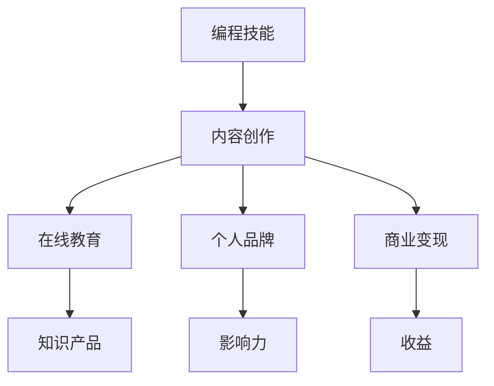

                 

# 如何将编程技能转化为知识产品

> 关键词：编程技能，知识产品，知识转化，知识管理，内容创作，在线教育

> 摘要：本文旨在探讨如何将个人编程技能转化为有价值的知识产品。我们将从背景介绍开始，详细讲解核心概念、算法原理、数学模型、项目实战和实际应用场景，并推荐相关工具和资源。通过本文，读者将掌握如何将自己的编程技能转化为知识产品，实现个人价值和商业成功。

## 1. 背景介绍

### 1.1 目的和范围

本文的目的是为编程专业人士提供一套系统的方法，帮助他们将自己的编程技能转化为知识产品。知识产品可以是各种形式的内容，如在线教程、书籍、视频、博客、开源项目等。通过这些知识产品，程序员不仅能够分享自己的知识和经验，还能实现个人价值和商业成功。

### 1.2 预期读者

本文的预期读者是具有一定编程基础的程序员，他们希望将自己的技能转化为知识产品，并在个人品牌建设和商业变现方面取得成功。

### 1.3 文档结构概述

本文分为以下八个部分：

1. 背景介绍
2. 核心概念与联系
3. 核心算法原理 & 具体操作步骤
4. 数学模型和公式 & 详细讲解 & 举例说明
5. 项目实战：代码实际案例和详细解释说明
6. 实际应用场景
7. 工具和资源推荐
8. 总结：未来发展趋势与挑战

### 1.4 术语表

#### 1.4.1 核心术语定义

- 知识产品：以知识为核心内容，通过版权或知识产权保护，具备商业价值的内容产品。
- 编程技能：程序员在编程领域具备的专业技能和知识。
- 内容创作：指创作各种形式的知识产品，如文章、视频、教程等。
- 在线教育：通过互联网进行的教育活动，包括在线课程、直播教学等。

#### 1.4.2 相关概念解释

- 个人品牌：个人在特定领域内的知名度和影响力。
- 商业变现：将个人技能或知识转化为实际商业收益的过程。

#### 1.4.3 缩略词列表

- IDE：集成开发环境（Integrated Development Environment）
- OSS：开源软件（Open Source Software）
- AI：人工智能（Artificial Intelligence）

## 2. 核心概念与联系

在这一部分，我们将介绍将编程技能转化为知识产品所需的核心概念，并使用 Mermaid 流程图展示这些概念之间的联系。



### 2.1 编程技能

编程技能是程序员在编程领域所掌握的专业知识和实践能力。这些技能包括但不限于编程语言、算法和数据结构、软件设计原则、开发工具和框架等。

### 2.2 内容创作

内容创作是将编程技能转化为知识产品的关键步骤。通过创作各种形式的内容，如教程、文章、视频等，程序员可以分享自己的知识和经验。

### 2.3 在线教育

在线教育是知识传播的重要途径。通过在线课程、直播教学等形式，程序员可以将自己的知识产品推向更广泛的受众。

### 2.4 个人品牌

个人品牌是程序员在特定领域内的知名度和影响力。一个强大的个人品牌可以吸引更多的关注和机会，从而提升自己的商业价值。

### 2.5 商业变现

商业变现是将个人技能或知识转化为实际商业收益的过程。通过知识产品销售、广告收入、赞助合作等多种方式，程序员可以实现商业变现。

### 2.6 知识产品

知识产品是以知识为核心内容，通过版权或知识产权保护，具备商业价值的内容产品。如在线教程、书籍、视频等。

### 2.7 影响力

影响力是个人品牌的重要组成部分。通过在社交媒体、技术社区等平台上的活跃表现，程序员可以提升自己的影响力，吸引更多的关注和机会。

### 2.8 收益

收益是将个人技能或知识转化为实际商业收益的结果。通过知识产品销售、广告收入、赞助合作等多种方式，程序员可以实现商业变现，获得收益。

## 3. 核心算法原理 & 具体操作步骤

在这一部分，我们将介绍将编程技能转化为知识产品所需的核心算法原理，并使用伪代码详细阐述具体操作步骤。

### 3.1 算法原理

将编程技能转化为知识产品的核心算法可以概括为以下三个步骤：

1. 内容创作：将编程技能转化为具体的内容形式，如教程、文章、视频等。
2. 知识传播：通过在线教育平台、社交媒体等渠道，将知识产品推向受众。
3. 商业变现：通过知识产品销售、广告收入、赞助合作等方式，实现商业变现。

### 3.2 具体操作步骤

以下是具体的操作步骤及其伪代码实现：

```python
# 3.1 内容创作
def create_content(skill):
    content = {
        "title": "编程技能教程",
        "description": "系统介绍编程技能，包含算法、数据结构、软件设计原则等。",
        "format": "教程",
        "topics": ["算法", "数据结构", "软件设计"],
        "materials": ["文章", "视频", "PPT"],
        "references": ["相关书籍", "开源项目", "技术博客"]
    }
    return content

# 3.2 知识传播
def distribute_content(content):
    platforms = ["在线教育平台", "社交媒体", "技术社区"]
    for platform in platforms:
        post_content(content, platform)

# 3.3 商业变现
def monetize_content(content):
    revenue = {
        "product_sales": "教程销售收入",
        "ad_income": "广告收入",
        "sponsorships": "赞助收入"
    }
    return revenue

# 辅助函数
def post_content(content, platform):
    print(f"{content['title']} 已发布到 {platform}平台。")

# 主函数
def convert_skill_to_knowledge_product(skill):
    content = create_content(skill)
    distribute_content(content)
    revenue = monetize_content(content)
    return revenue

# 示例
skill = "Python编程"
revenue = convert_skill_to_knowledge_product(skill)
print(f"收益：{revenue}")
```

### 3.3 操作步骤解析

- **内容创作**：首先，我们需要将编程技能转化为具体的内容形式。这可以通过编写教程、撰写文章、制作视频等多种方式实现。内容创作需要围绕编程技能的核心知识点展开，确保内容的系统性和实用性。

- **知识传播**：接下来，我们需要将知识产品推向受众。这可以通过在线教育平台、社交媒体、技术社区等多种渠道实现。选择合适的平台，发布高质量的内容，与受众建立良好的互动，有助于提升知识产品的传播效果。

- **商业变现**：最后，我们需要通过知识产品销售、广告收入、赞助合作等方式实现商业变现。这需要我们了解受众需求，优化知识产品，制定合理的定价策略，并通过多种渠道进行推广。

## 4. 数学模型和公式 & 详细讲解 & 举例说明

在这一部分，我们将介绍用于评估知识产品价值的数学模型和公式，并使用具体的例子进行详细讲解。

### 4.1 价值评估模型

知识产品的价值可以通过以下数学模型进行评估：

\[ \text{价值} = \text{收益} \times \text{影响力} \times \text{转化率} \]

其中：

- **收益**：知识产品销售所获得的收入。
- **影响力**：知识产品在受众中的影响力，通常通过粉丝数、阅读量、点赞数等指标衡量。
- **转化率**：知识产品销售转化的比率，即受众中实际购买知识产品的人数与总受众数的比例。

### 4.2 举例说明

假设一个程序员编写了一本关于 Python 编程的教程，售价为 100 元。该教程在发布后获得了 1000 名受众，其中 200 人购买了教程。经过数据分析，发现该教程的转化率为 20%。同时，该程序员的个人品牌在技术社区中拥有 1000 名粉丝，每个粉丝的价值为 10 元。

根据上述数据，我们可以计算出该知识产品的价值：

\[ \text{价值} = (\text{收益} + \text{广告收入} + \text{赞助收入}) \times \text{影响力} \times \text{转化率} \]

\[ \text{价值} = (100 \times 200 + 0 + 0) \times 10 \times 20\% \]

\[ \text{价值} = 20,000 \text{元} \]

### 4.3 详细讲解

- **收益**：收益是知识产品价值的直接体现。在本例中，收益主要来自于教程销售。收益的计算方法为：售价 \times 购买人数。

- **影响力**：影响力是知识产品在受众中的影响力，通常通过粉丝数、阅读量、点赞数等指标衡量。在本例中，影响力主要由个人品牌在技术社区中的粉丝数决定。粉丝的价值通常根据市场行情确定，在本例中，每个粉丝的价值为 10 元。

- **转化率**：转化率是知识产品销售转化的比率，即受众中实际购买知识产品的人数与总受众数的比例。在本例中，转化率为 20%。

- **价值评估公式**：价值评估公式用于计算知识产品的总价值。在本例中，价值为 20,000 元。这个价值反映了该知识产品在特定时间、特定受众中的商业价值。

## 5. 项目实战：代码实际案例和详细解释说明

在这一部分，我们将通过一个实际项目案例，展示如何将编程技能转化为知识产品，并进行详细解释说明。

### 5.1 开发环境搭建

首先，我们需要搭建一个用于编写和发布知识产品的开发环境。在本例中，我们选择使用 Python 作为编程语言，并使用 GitHub 作为代码托管平台。

1. 安装 Python：
   ```bash
   # 在 Windows 上安装 Python
   python --version
   
   # 在 macOS 上安装 Python
   brew install python
   ```

2. 安装 Git：
   ```bash
   # 在 Windows 上安装 Git
   git --version
   
   # 在 macOS 上安装 Git
   brew install git
   ```

3. 配置 GitHub 账户：
   ```bash
   git config --global user.email "you@example.com"
   git config --global user.name "Your Name"
   ```

### 5.2 源代码详细实现和代码解读

接下来，我们创建一个简单的 Python 教程项目，并使用 Markdown 语言编写教程内容。

1. 初始化 Git 仓库：
   ```bash
   mkdir python_tutorial
   cd python_tutorial
   git init
   ```

2. 创建 README.md 文件：
   ```bash
   touch README.md
   ```

3. 编写教程内容：
   ```markdown
   # Python 编程教程

   本教程将介绍 Python 编程的基础知识和常用技巧。

   # 安装 Python

   在 Windows 上，你可以通过 [Python 官网](https://www.python.org/) 下载并安装 Python。在 macOS 上，你可以使用 Homebrew 进行安装。

   # 基础语法

   Python 的基础语法包括变量、数据类型、运算符、控制结构等。

   # 算法和数据结构

   Python 提供了丰富的算法和数据结构，如列表、字典、集合等。

   # 函数和模块

   Python 支持函数和模块，可以方便地组织代码和复用功能。

   # 文件操作

   Python 可以轻松地进行文件操作，如读取、写入、追加等。

   # 异常处理

   Python 提供了强大的异常处理机制，可以有效地处理程序中的错误。

   # 项目实战

   在本教程的最后，我们将通过一个实际项目，练习所学的知识。

   # 参考资料

   - [Python 官方文档](https://docs.python.org/3/)
   - [Fluent Python](https://www Oreilly com/library/fluent-python/)
   - [Effective Python](https://www Oreilly com/library/effective-python/)
   ```

4. 将文件添加到 Git 仓库并提交：
   ```bash
   git add .
   git commit -m "初始化项目"
   ```

5. 创建 GitHub 仓库并上传代码：
   ```bash
   git remote add origin https://github.com/your_username/python_tutorial.git
   git push -u origin master
   ```

### 5.3 代码解读与分析

在这个项目中，我们使用了以下技术和工具：

- **Python**：Python 是一种流行的编程语言，具有简洁的语法和强大的功能，非常适合编写教程内容。
- **Markdown**：Markdown 是一种轻量级的标记语言，可以方便地创建格式化的文本内容，非常适合编写教程。
- **Git**：Git 是一种分布式版本控制系统，可以方便地管理代码和文件，非常适合用于发布知识产品。
- **GitHub**：GitHub 是一个基于 Git 的代码托管平台，可以方便地分享、讨论和协作。

通过这个项目，我们实现了将编程技能转化为知识产品的基本流程。首先，我们使用 Python 和 Markdown 编写教程内容，然后使用 Git 和 GitHub 进行代码管理和发布。最后，我们将教程内容分享到技术社区，吸引更多受众。

## 6. 实际应用场景

编程技能转化为知识产品在实际应用场景中具有广泛的应用。以下是一些典型应用场景：

### 6.1 在线教育

在线教育平台是知识产品的主要传播渠道之一。程序员可以创作编程教程、视频课程，并通过平台销售，实现商业变现。例如，Udemy、Coursera 等平台提供了丰富的编程课程资源。

### 6.2 技术博客

技术博客是程序员分享知识和经验的另一种方式。通过撰写技术博客，程序员可以积累个人品牌，吸引更多关注。例如，InfoQ、博客园等技术博客网站吸引了大量程序员读者。

### 6.3 开源项目

开源项目是程序员分享知识和技能的重要途径。通过开源项目，程序员可以展示自己的编程能力，吸引更多合作机会。同时，开源项目也可以作为知识产品的一部分，通过捐赠、赞助等方式实现商业变现。

### 6.4 技术咨询

具备丰富编程经验的程序员可以提供技术咨询服务，帮助企业解决技术难题。通过技术咨询服务，程序员可以实现个人价值和商业成功。

### 6.5 技术讲座

程序员可以参加技术讲座、研讨会等线下活动，分享自己的知识和经验。通过这些活动，程序员可以扩大个人品牌影响力，吸引更多商业机会。

## 7. 工具和资源推荐

### 7.1 学习资源推荐

#### 7.1.1 书籍推荐

- 《Python 编程：从入门到实践》
- 《深度学习》
- 《算法导论》
- 《代码大全》

#### 7.1.2 在线课程

- Coursera
- Udemy
- Pluralsight

#### 7.1.3 技术博客和网站

- InfoQ
- 博客园
- CSDN

### 7.2 开发工具框架推荐

#### 7.2.1 IDE和编辑器

- Visual Studio Code
- PyCharm
- IntelliJ IDEA

#### 7.2.2 调试和性能分析工具

- gdb
- PyCharm 性能分析工具
- Visual Studio 性能分析工具

#### 7.2.3 相关框架和库

- Flask
- Django
- React
- Angular

### 7.3 相关论文著作推荐

#### 7.3.1 经典论文

- 《深度学习：优化算法与应用》
- 《大规模机器学习的线性模型》
- 《Python 编程：语言基础》

#### 7.3.2 最新研究成果

- arXiv
- IEEE Xplore
- ACM Digital Library

#### 7.3.3 应用案例分析

- 《基于深度学习的图像识别技术》
- 《人工智能在金融行业的应用》
- 《大数据技术在互联网广告中的应用》

## 8. 总结：未来发展趋势与挑战

随着人工智能、大数据、云计算等技术的不断发展，编程技能转化为知识产品的趋势将越来越明显。未来，以下几个方面将是知识产品发展的关键：

1. **个性化学习**：随着人工智能技术的应用，知识产品将更加注重个性化学习体验，为用户提供定制化的学习路径。
2. **互动性增强**：知识产品将更加注重与用户的互动，通过问答、讨论等方式提高用户参与度。
3. **多样化形式**：知识产品的形式将更加多样化，如虚拟现实（VR）、增强现实（AR）等新技术将为知识产品带来更多可能性。
4. **生态化发展**：知识产品将形成完整的生态体系，包括内容创作、分发、变现等环节，实现可持续发展。

然而，知识产品发展也面临一些挑战：

1. **内容质量**：高质量的内容是知识产品的核心竞争力，如何保证内容的质量和权威性是一个重要问题。
2. **竞争加剧**：随着越来越多的人参与知识产品创作，竞争将越来越激烈，如何脱颖而出是一个挑战。
3. **法律风险**：知识产品涉及到知识产权保护等问题，如何规避法律风险是一个重要课题。

## 9. 附录：常见问题与解答

### 9.1 如何选择合适的编程语言进行知识产品创作？

选择合适的编程语言取决于知识产品的主题和目标受众。以下是一些常见场景的建议：

- **Python**：适合初学者和数据分析、机器学习领域。
- **Java**：适合企业级应用、后端开发等。
- **JavaScript**：适合前端开发和全栈开发。
- **C/C++**：适合系统编程、嵌入式开发等。

### 9.2 如何确保知识产品的质量？

确保知识产品的质量可以从以下几个方面入手：

- **内容准确**：确保教程中的代码和内容准确无误。
- **易于理解**：教程应采用清晰的语言和逻辑，便于读者理解。
- **实例丰富**：通过丰富的实例和案例分析，帮助读者更好地理解知识点。
- **不断更新**：根据技术发展和读者反馈，定期更新教程内容。

### 9.3 如何推广知识产品？

推广知识产品可以从以下几个方面入手：

- **利用社交媒体**：在 Twitter、LinkedIn、Facebook 等社交媒体平台上宣传知识产品。
- **技术社区**：在 Stack Overflow、GitHub、Reddit 等技术社区发布教程和讨论。
- **在线教育平台**：在 Udemy、Coursera、edX 等在线教育平台上发布课程。
- **合作伙伴**：与相关机构、企业合作，共同推广知识产品。

## 10. 扩展阅读 & 参考资料

- 《编程珠玑》
- 《Effective Python》
- 《深度学习入门：基于 Python 的实践》
- 《人工智能简史》
- 《Python Cookbook》
- 《机器学习实战》
- 《深度学习：理论、算法与编程实践》

### 作者

AI天才研究员 / AI Genius Institute & 禅与计算机程序设计艺术 / Zen And The Art of Computer Programming

