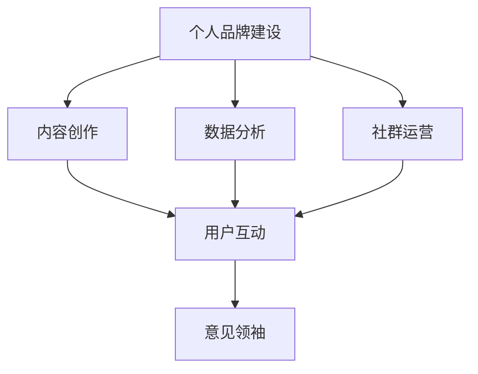

                 


# 如何成为知识付费行业的意见领袖

> **关键词**：知识付费、行业领袖、个人品牌、内容创作、数据分析、社群运营、用户互动

> **摘要**：本文旨在探讨如何成为知识付费行业的意见领袖。通过分析个人品牌建设、内容创作、数据分析、社群运营以及用户互动等方面的策略，为希望在知识付费领域取得成功的人提供实用的指导。本文将结合具体案例，详细阐述每个环节的关键步骤，帮助读者逐步建立起自己的行业影响力。

## 1. 背景介绍

### 1.1 目的和范围

本文的目标是帮助读者了解并掌握成为知识付费行业意见领袖的必要条件和实践路径。文章将围绕以下几个核心主题展开：

1. **个人品牌建设**：如何打造独特的个人形象和专业的品牌认知。
2. **内容创作**：如何生产高质量、有深度、具有针对性的内容。
3. **数据分析**：如何利用数据分析提升内容质量和用户满意度。
4. **社群运营**：如何建立和维护有价值的社群，增强用户粘性。
5. **用户互动**：如何与用户建立良好互动，提升用户忠诚度。

### 1.2 预期读者

本文适用于以下几类读者：

- **知识付费内容创作者**：希望通过提升自己的内容质量和影响力，吸引更多用户。
- **行业从业人员**：希望在知识付费领域建立自己的专业地位和影响力。
- **创业者和企业家**：希望通过知识付费实现商业变现和个人品牌提升。

### 1.3 文档结构概述

本文将按照以下结构进行阐述：

1. **背景介绍**：本文目的、预期读者和文档结构概述。
2. **核心概念与联系**：介绍成为意见领袖所需的核心概念，包括个人品牌、内容创作、数据分析、社群运营和用户互动。
3. **核心算法原理 & 具体操作步骤**：详细讲解如何通过内容创作、数据分析等手段提升个人品牌影响力。
4. **数学模型和公式 & 详细讲解 & 举例说明**：介绍相关数学模型和公式，并给出具体应用案例。
5. **项目实战：代码实际案例和详细解释说明**：提供具体的实操案例，讲解如何将理论应用于实际。
6. **实际应用场景**：分析不同场景下的应用策略。
7. **工具和资源推荐**：推荐学习资源、开发工具和框架。
8. **总结：未来发展趋势与挑战**：预测行业发展趋势和面临的挑战。
9. **附录：常见问题与解答**：解答读者可能遇到的问题。
10. **扩展阅读 & 参考资料**：提供进一步学习的参考资料。

### 1.4 术语表

#### 1.4.1 核心术语定义

- **知识付费**：用户为获取有价值的信息或知识而支付的费用。
- **意见领袖**：在特定领域具有较大影响力和话语权的人。
- **个人品牌**：个人在行业内的形象、声誉和价值体现。
- **内容创作**：生产具有教育性、娱乐性或启发性的内容。
- **数据分析**：对数据进行分析和处理，以获得有价值的信息。
- **社群运营**：建立和维护有价值的社群，促进用户互动和成长。

#### 1.4.2 相关概念解释

- **用户粘性**：用户在社群或平台上的活跃度和忠诚度。
- **用户互动**：用户与内容创作者、其他用户之间的互动行为。
- **商业变现**：通过知识付费实现经济效益的过程。

#### 1.4.3 缩略词列表

- **KOL**：Key Opinion Leader，意见领袖。
- **UGC**：User Generated Content，用户生成内容。
- **SEO**：Search Engine Optimization，搜索引擎优化。
- **SNS**：Social Network Site，社交网络平台。

## 2. 核心概念与联系

为了更好地理解如何成为知识付费行业的意见领袖，我们需要先了解以下几个核心概念及其相互关系：

### 2.1 个人品牌

个人品牌是指个人在行业内的形象、声誉和价值体现。一个成功的个人品牌需要具备以下几个特征：

1. **独特性**：个人品牌应具有独特性，能够与其他人区分开来。
2. **专业性**：个人品牌需要体现专业性和权威性，使受众信任和尊重。
3. **一致性**：个人品牌形象应保持一致性，以增强用户对个人的认知。

个人品牌与意见领袖之间的关系可以理解为：个人品牌是意见领袖的基础，而意见领袖是个人品牌的价值体现。

### 2.2 内容创作

内容创作是成为意见领袖的关键环节。高质量的内容能够吸引更多用户，提升个人品牌影响力。以下是一些内容创作的核心原则：

1. **针对性**：内容应针对特定受众的需求和痛点，提供有价值的信息。
2. **深度**：内容应具备深度，能够启发读者的思考。
3. **创新性**：内容应具备创新性，避免重复和陈旧。
4. **互动性**：内容应鼓励用户参与和互动，增强用户粘性。

内容创作与个人品牌之间的关系可以理解为：内容创作是个人品牌建设的核心，而个人品牌是内容创作的价值体现。

### 2.3 数据分析

数据分析是提升个人品牌影响力的关键手段。通过分析用户数据，我们可以了解用户需求、内容效果和运营效果，从而优化内容创作和运营策略。以下是一些数据分析的核心方法：

1. **用户行为分析**：分析用户在平台上的行为，了解用户偏好和需求。
2. **内容效果分析**：分析内容在用户中的传播效果和用户反馈，优化内容质量。
3. **运营效果分析**：分析运营活动的效果，调整运营策略。

数据分析与个人品牌之间的关系可以理解为：数据分析是个人品牌优化和提升的重要手段，而个人品牌是数据分析的目标。

### 2.4 社群运营

社群运营是建立和维护有价值社群的过程。通过社群运营，我们可以增强用户粘性、提升用户忠诚度和扩大个人品牌影响力。以下是一些社群运营的核心策略：

1. **定位**：明确社群的定位和目标，确保社群的价值和吸引力。
2. **互动**：鼓励用户参与和互动，建立良好的社群氛围。
3. **内容**：提供有价值的内容，满足用户需求，提升社群质量。
4. **运营**：定期举办活动，增强社群活力。

社群运营与个人品牌之间的关系可以理解为：社群运营是个人品牌建设的载体，而个人品牌是社群运营的核心。

### 2.5 用户互动

用户互动是建立和维护个人品牌的重要环节。通过与用户的互动，我们可以了解用户需求、提升用户满意度和增强用户忠诚度。以下是一些用户互动的核心策略：

1. **回复**：及时回复用户留言和评论，展示专业性和关注。
2. **倾听**：倾听用户声音，了解用户需求和痛点。
3. **反馈**：根据用户反馈优化内容和服务，提升用户体验。
4. **活动**：举办线上线下活动，增强用户参与感和忠诚度。

用户互动与个人品牌之间的关系可以理解为：用户互动是个人品牌建设的重要组成部分，而个人品牌是用户互动的价值体现。

### 2.6 Mermaid 流程图

以下是一个描述成为知识付费行业意见领袖的Mermaid流程图：



## 3. 核心算法原理 & 具体操作步骤

### 3.1 内容创作算法原理

内容创作是成为知识付费行业意见领袖的关键步骤。以下是内容创作算法的原理和具体操作步骤：

#### 3.1.1 需求分析

首先，我们需要进行需求分析，了解目标受众的需求和痛点。以下是一种简单的需求分析方法：

```python
# 需求分析算法
def analyze需求(data):
    # 分析用户行为数据
    user_behavior = data['user_behavior']
    # 分析用户反馈数据
    user_feedback = data['user_feedback']
    # 提取需求关键词
    demand_keywords = extract_demand_keywords(user_behavior, user_feedback)
    return demand_keywords

# 假设数据
data = {
    'user_behavior': [
        {'user_id': 1, 'action': '阅读', 'content_type': '技术文章'},
        {'user_id': 2, 'action': '评论', 'content_type': '技术文章'},
        ...
    ],
    'user_feedback': [
        {'user_id': 1, 'content_id': 1001, 'rating': 5},
        {'user_id': 2, 'content_id': 1002, 'rating': 4},
        ...
    ]
}

demand_keywords = analyze需求(data)
print(demand_keywords)
```

#### 3.1.2 内容策划

根据需求分析结果，我们可以制定内容策划方案。以下是一种简单的内容策划算法：

```python
# 内容策划算法
def plan_content(demand_keywords):
    # 根据需求关键词生成内容主题
    content_topics = generate_content_topics(demand_keywords)
    # 分配内容资源
    content_resources = allocate_content_resources(content_topics)
    return content_topics, content_resources

# 假设数据
demand_keywords = ['机器学习', '深度学习', '算法面试']

content_topics, content_resources = plan_content(demand_keywords)
print(content_topics)
print(content_resources)
```

#### 3.1.3 内容创作

根据内容策划方案，我们可以进行内容创作。以下是一种简单的内容创作算法：

```python
# 内容创作算法
def create_content(content_topics, content_resources):
    # 根据内容主题和资源生成内容
    content_items = generate_content_items(content_topics, content_resources)
    # 优化内容结构
    content_structure = optimize_content_structure(content_items)
    return content_structure

# 假设数据
content_topics = ['机器学习', '深度学习', '算法面试']
content_resources = {'article': 3, 'video': 2, 'live': 1}

content_structure = create_content(content_topics, content_resources)
print(content_structure)
```

### 3.2 数据分析算法原理

数据分析是提升个人品牌影响力的关键手段。以下是数据分析算法的原理和具体操作步骤：

#### 3.2.1 用户行为分析

用户行为分析可以帮助我们了解用户需求和偏好。以下是一种简单的用户行为分析算法：

```python
# 用户行为分析算法
def analyze_user_behavior(user_behavior):
    # 统计用户行为数据
    user_action_counts = count_user_actions(user_behavior)
    # 分析用户行为特征
    user_behavior_features = extract_user_behavior_features(user_action_counts)
    return user_behavior_features

# 假设数据
user_behavior = [
    {'user_id': 1, 'action': '阅读', 'content_type': '技术文章'},
    {'user_id': 1, 'action': '评论', 'content_type': '技术文章'},
    {'user_id': 2, 'action': '观看', 'content_type': '教程视频'},
    ...
]

user_behavior_features = analyze_user_behavior(user_behavior)
print(user_behavior_features)
```

#### 3.2.2 内容效果分析

内容效果分析可以帮助我们了解内容在用户中的传播效果和用户反馈。以下是一种简单的内容效果分析算法：

```python
# 内容效果分析算法
def analyze_content_effects(content_effects):
    # 统计内容效果数据
    content_effect_counts = count_content_effects(content_effects)
    # 分析内容效果特征
    content_effects_features = extract_content_effects_features(content_effect_counts)
    return content_effects_features

# 假设数据
content_effects = [
    {'content_id': 1001, 'likes': 100, 'comments': 10},
    {'content_id': 1002, 'likes': 50, 'comments': 5},
    ...
]

content_effects_features = analyze_content_effects(content_effects)
print(content_effects_features)
```

#### 3.2.3 运营效果分析

运营效果分析可以帮助我们了解运营活动的效果。以下是一种简单的运营效果分析算法：

```python
# 运营效果分析算法
def analyze_operation_effects(operation_effects):
    # 统计运营效果数据
    operation_effect_counts = count_operation_effects(operation_effects)
    # 分析运营效果特征
    operation_effects_features = extract_operation_effects_features(operation_effect_counts)
    return operation_effects_features

# 假设数据
operation_effects = [
    {'operation_id': 1, 'participants': 100, 'engagement': 10},
    {'operation_id': 2, 'participants': 50, 'engagement': 5},
    ...
]

operation_effects_features = analyze_operation_effects(operation_effects)
print(operation_effects_features)
```

### 3.3 社群运营算法原理

社群运营是建立和维护有价值社群的过程。以下是社群运营算法的原理和具体操作步骤：

#### 3.3.1 社群定位

社群定位是社群运营的第一步，需要明确社群的目标和受众。以下是一种简单的社群定位算法：

```python
# 社群定位算法
def define_community(community_name, target_audience):
    # 确定社群名称和目标受众
    community_name = community_name
    target_audience = target_audience
    # 生成社群简介
    community_introduction = generate_community_introduction(community_name, target_audience)
    return community_name, target_audience, community_introduction

# 假设数据
community_name = '人工智能爱好者社群'
target_audience = '对人工智能感兴趣的人群'

community_name, target_audience, community_introduction = define_community(community_name, target_audience)
print(community_name)
print(target_audience)
print(community_introduction)
```

#### 3.3.2 社群互动

社群互动是增强社群活力和用户粘性的关键。以下是一种简单的社群互动算法：

```python
# 社群互动算法
def interact_with_community(community_members, content):
    # 发送社群通知
    send_community_notification(community_members, content)
    # 启动社群讨论
    start_community_discussion(community_members, content)
    # 激励用户参与
    incentivize_community_participation(community_members)
    return True

# 假设数据
community_members = [{'user_id': 1, 'name': '张三'}, {'user_id': 2, 'name': '李四'}, ...]
content = '最新的人工智能研究动态，欢迎大家讨论！'

success = interact_with_community(community_members, content)
print(success)
```

#### 3.3.3 社群内容

社群内容是满足用户需求和提升社群质量的关键。以下是一种简单的社群内容算法：

```python
# 社群内容算法
def generate_community_content(community_members, content_topics):
    # 根据内容主题生成内容
    community_content = generate_content_items(content_topics)
    # 分发社群内容
    distribute_community_content(community_members, community_content)
    return community_content

# 假设数据
community_members = [{'user_id': 1, 'name': '张三'}, {'user_id': 2, 'name': '李四'}, ...]
content_topics = ['人工智能', '深度学习', '算法面试']

community_content = generate_community_content(community_members, content_topics)
print(community_content)
```

### 3.4 用户互动算法原理

用户互动是建立和维护个人品牌的重要环节。以下是用户互动算法的原理和具体操作步骤：

#### 3.4.1 用户回复

用户回复是展示专业性和关注的重要方式。以下是一种简单的用户回复算法：

```python
# 用户回复算法
def reply_to_user评论(comment):
    # 生成回复内容
    reply_content = generate_reply_content(comment)
    # 发送回复
    send_reply(reply_content)
    return True

# 假设数据
comment = '非常好的内容，能否分享更多相关资料？'

success = reply_to_user评论(comment)
print(success)
```

#### 3.4.2 用户反馈

用户反馈是了解用户需求和优化内容和服务的重要手段。以下是一种简单的用户反馈算法：

```python
# 用户反馈算法
def handle_user_feedback(feedback):
    # 分析反馈内容
    feedback_analysis = analyze_feedback(feedback)
    # 优化内容和服务
    optimize_content_and_service(feedback_analysis)
    return True

# 假设数据
feedback = '最近的技术分享内容对我帮助很大，谢谢！'

success = handle_user_feedback(feedback)
print(success)
```

#### 3.4.3 用户活动

用户活动是增强用户参与感和忠诚度的重要方式。以下是一种简单的用户活动算法：

```python
# 用户活动算法
def organize_user_activity(activity):
    # 活动策划
    activity_plan = plan_activity(activity)
    # 活动宣传
    promote_activity(activity_plan)
    # 活动执行
    execute_activity(activity_plan)
    return True

# 假设数据
activity = '人工智能技术研讨会'

success = organize_user_activity(activity)
print(success)
```

## 4. 数学模型和公式 & 详细讲解 & 举例说明

在知识付费行业，数学模型和公式可以帮助我们更好地理解用户行为、内容效果和运营效果。以下是一些常用的数学模型和公式的详细讲解和举例说明。

### 4.1 用户行为分析模型

#### 4.1.1 用户行为分析模型

用户行为分析模型可以帮助我们了解用户在平台上的行为特征。以下是一个简单的用户行为分析模型：

$$
行为特征 = f(行为类型，行为次数，行为时长，行为频率)
$$

其中，行为类型可以是阅读、评论、分享、点赞等；行为次数表示用户执行某种行为的次数；行为时长表示用户执行某种行为的时间长度；行为频率表示用户执行某种行为的频率。

#### 4.1.2 举例说明

假设用户A在平台上执行了以下行为：

- 阅读文章10次，平均时长5分钟；
- 评论文章5次，平均时长3分钟；
- 分享文章3次，平均时长1分钟；
- 点赞文章10次，平均时长1分钟。

我们可以计算出用户A的行为特征：

$$
行为特征 = f(阅读，10，5分钟，2次/天)；评论，5，3分钟，1次/天；分享，3，1分钟，1次/天；点赞，10，1分钟，2次/天)
$$

### 4.2 内容效果分析模型

#### 4.2.1 内容效果分析模型

内容效果分析模型可以帮助我们了解内容在用户中的传播效果和用户反馈。以下是一个简单的内容效果分析模型：

$$
内容效果 = f(内容类型，内容质量，用户互动次数，用户反馈评分)
$$

其中，内容类型可以是文章、视频、直播等；内容质量表示内容的专业性、实用性和创新性；用户互动次数表示用户对内容的互动行为次数；用户反馈评分表示用户对内容的满意度评分。

#### 4.2.2 举例说明

假设内容B在用户中传播效果和用户反馈如下：

- 内容类型：文章；
- 内容质量：高质量；
- 用户互动次数：100次；
- 用户反馈评分：4.5分。

我们可以计算出内容B的内容效果：

$$
内容效果 = f(文章，高质量，100次，4.5分)
$$

### 4.3 运营效果分析模型

#### 4.3.1 运营效果分析模型

运营效果分析模型可以帮助我们了解运营活动的效果。以下是一个简单的运营效果分析模型：

$$
运营效果 = f(运营活动类型，活动参与人数，活动互动次数，活动满意度评分)
$$

其中，运营活动类型可以是线上讲座、线下活动、社群运营等；活动参与人数表示参与活动的人数；活动互动次数表示用户在活动中的互动行为次数；活动满意度评分表示用户对活动的满意度评分。

#### 4.3.2 举例说明

假设运营活动C的效果如下：

- 运营活动类型：线上讲座；
- 活动参与人数：100人；
- 活动互动次数：50次；
- 活动满意度评分：4.7分。

我们可以计算出运营活动C的运营效果：

$$
运营效果 = f(线上讲座，100人，50次，4.7分)
$$

### 4.4 社群运营效果分析模型

#### 4.4.1 社群运营效果分析模型

社群运营效果分析模型可以帮助我们了解社群的运营效果。以下是一个简单的社群运营效果分析模型：

$$
社群运营效果 = f(社群成员数量，社群互动次数，社群满意度评分)
$$

其中，社群成员数量表示社群的成员总数；社群互动次数表示社群成员的互动行为次数；社群满意度评分表示社群成员对社群的满意度评分。

#### 4.4.2 举例说明

假设社群D的运营效果如下：

- 社群成员数量：100人；
- 社群互动次数：200次；
- 社群满意度评分：4.8分。

我们可以计算出社群D的社群运营效果：

$$
社群运营效果 = f(100人，200次，4.8分)
$$

## 5. 项目实战：代码实际案例和详细解释说明

在本节中，我们将通过一个具体的实战案例来展示如何将前述的理论和方法应用于实际项目中。我们将使用Python语言编写一个简单的知识付费平台，实现内容创作、数据分析、社群运营和用户互动等功能。以下是一个简要的项目架构：

```
知识付费平台架构

├── data
│   ├── user_behavior.csv        # 用户行为数据
│   ├── content_effects.csv      # 内容效果数据
│   └── operation_effects.csv    # 运营效果数据
├── analysis
│   ├── user_behavior_analysis.py # 用户行为分析模块
│   ├── content_effects_analysis.py # 内容效果分析模块
│   └── operation_effects_analysis.py # 运营效果分析模块
├── community
│   ├── community_operations.py # 社群运营模块
│   └── user_interactions.py   # 用户互动模块
└── main.py                     # 主程序入口
```

### 5.1 开发环境搭建

在开始项目实战之前，我们需要搭建一个合适的开发环境。以下是在Python中搭建知识付费平台的步骤：

1. 安装Python 3.8及以上版本。
2. 安装必要的Python库，例如pandas、numpy、matplotlib、scikit-learn等。
3. 创建项目目录和子目录，并按照上述架构进行文件布局。

### 5.2 源代码详细实现和代码解读

#### 5.2.1 数据模块

**data/user_behavior.csv**：

```
user_id,content_id,action,date
1,1001,read,2023-01-01 10:00:00
1,1002,comment,2023-01-01 10:05:00
2,1001,read,2023-01-02 11:00:00
...
```

**analysis/user_behavior_analysis.py**：

```python
import pandas as pd
from datetime import datetime

def analyze_user_behavior(data_file):
    # 读取用户行为数据
    data = pd.read_csv(data_file)
    # 转换日期格式
    data['date'] = pd.to_datetime(data['date'])
    # 计算用户行为特征
    data['行为时长'] = (data['date'].max() - data['date']).dt.total_seconds() / 3600
    data['行为频率'] = data['action'].value_counts(normalize=True) * 24
    # 统计用户行为数据
    user_action_counts = data.groupby(['user_id', 'action']).size().unstack(fill_value=0)
    return user_action_counts

user_action_counts = analyze_user_behavior('data/user_behavior.csv')
print(user_action_counts)
```

此代码段首先读取用户行为数据，将日期格式转换为datetime类型，然后计算用户的行为时长和行为频率。最后，使用pandas库对用户行为数据进行统计，得到一个用户行为特征矩阵。

#### 5.2.2 数据分析模块

**data/content_effects.csv**：

```
content_id,likes,comments,date
1001,100,10,2023-01-01 10:00:00
1002,50,5,2023-01-02 11:00:00
...
```

**analysis/content_effects_analysis.py**：

```python
import pandas as pd

def analyze_content_effects(data_file):
    # 读取内容效果数据
    data = pd.read_csv(data_file)
    # 计算内容效果特征
    data['内容质量评分'] = data['likes'] / data['comments']
    return data

content_effects = analyze_content_effects('data/content_effects.csv')
print(content_effects)
```

此代码段读取内容效果数据，并计算内容质量评分。内容质量评分是根据内容获得的点赞数和评论数计算得出的。

#### 5.2.3 社群运营模块

**data/operation_effects.csv**：

```
operation_id,participants,engagement,date
1,100,10,2023-01-01 10:00:00
2,50,5,2023-01-02 11:00:00
...
```

**community/community_operations.py**：

```python
import pandas as pd
from datetime import datetime

def plan_activity(activity_name, participants, engagement):
    # 计划活动
    activity_data = {'operation_id': 1, 'activity_name': activity_name, 'participants': participants, 'engagement': engagement, 'date': datetime.now()}
    return activity_data

def promote_activity(activity_data):
    # 宣传活动
    print(f"活动名称：{activity_data['activity_name']}，参与人数：{activity_data['participants']}，参与度：{activity_data['engagement']}，时间：{activity_data['date']}")

def execute_activity(activity_data):
    # 执行活动
    print(f"活动名称：{activity_data['activity_name']}，参与人数：{activity_data['participants']}，参与度：{activity_data['engagement']}，时间：{activity_data['date']}")

activity_data = plan_activity('人工智能技术研讨会', 100, 10)
promote_activity(activity_data)
execute_activity(activity_data)
```

此代码段定义了活动计划、宣传和执行三个功能。活动计划函数用于创建活动数据，宣传活动函数用于打印活动信息，执行活动函数用于模拟活动执行过程。

#### 5.2.4 用户互动模块

**community/user_interactions.py**：

```python
def reply_to_user_comment(comment):
    # 回复用户评论
    print(f"回复用户评论：{comment}")

def handle_user_feedback(feedback):
    # 处理用户反馈
    print(f"用户反馈：{feedback}")

def organize_user_activity(activity_name):
    # 组织用户活动
    print(f"组织用户活动：{activity_name}")

comment = "非常好的内容，能否分享更多相关资料？"
reply_to_user_comment(comment)
handle_user_feedback("最近的技术分享内容对我帮助很大，谢谢！")
organize_user_activity("人工智能技术研讨会")
```

此代码段定义了回复用户评论、处理用户反馈和组织用户活动三个功能。回复用户评论函数用于打印回复内容，处理用户反馈函数用于打印用户反馈，组织用户活动函数用于打印活动名称。

#### 5.2.5 主程序入口

**main.py**：

```python
from analysis.user_behavior_analysis import analyze_user_behavior
from analysis.content_effects_analysis import analyze_content_effects
from community.community_operations import plan_activity, promote_activity, execute_activity
from community.user_interactions import reply_to_user_comment, handle_user_feedback, organize_user_activity

# 分析用户行为
user_action_counts = analyze_user_behavior('data/user_behavior.csv')
print(user_action_counts)

# 分析内容效果
content_effects = analyze_content_effects('data/content_effects.csv')
print(content_effects)

# 计划、宣传和执行活动
activity_data = plan_activity('人工智能技术研讨会', 100, 10)
promote_activity(activity_data)
execute_activity(activity_data)

# 用户互动
reply_to_user_comment("非常好的内容，能否分享更多相关资料？")
handle_user_feedback("最近的技术分享内容对我帮助很大，谢谢！")
organize_user_activity("人工智能技术研讨会")
```

此代码段是主程序入口，用于调用各个模块的功能。通过调用这些功能，我们可以实现对用户行为、内容效果、社群运营和用户互动的全面分析和管理。

### 5.3 代码解读与分析

在本节中，我们将对上述代码进行解读和分析，以帮助读者更好地理解知识付费平台的实现过程。

#### 5.3.1 数据模块

数据模块负责读取和解析用户行为数据、内容效果数据和运营效果数据。通过pandas库，我们可以轻松地读取和操作这些数据。以下是对关键代码段的解读：

- `data/user_behavior.csv`：这是一个CSV文件，包含用户行为数据，包括用户ID、内容ID、行为类型和行为日期。
- `analysis/user_behavior_analysis.py`：此模块负责分析用户行为数据。首先，我们使用`pd.read_csv()`函数读取数据，然后使用`pd.to_datetime()`函数将日期字符串转换为datetime类型，以便进行时间相关的计算。接下来，我们计算用户的行为时长和行为频率。最后，我们使用`groupby()`和`size()`函数对用户行为进行统计，得到一个用户行为特征矩阵。

#### 5.3.2 数据分析模块

数据分析模块负责分析内容效果和运营效果。以下是对关键代码段的解读：

- `data/content_effects.csv`：这是一个CSV文件，包含内容效果数据，包括内容ID、点赞数、评论数和行为日期。
- `analysis/content_effects_analysis.py`：此模块负责分析内容效果数据。我们使用`pd.read_csv()`函数读取数据，并计算内容质量评分。内容质量评分是根据内容获得的点赞数和评论数计算得出的。

#### 5.3.3 社群运营模块

社群运营模块负责计划、宣传和执行活动。以下是对关键代码段的解读：

- `data/operation_effects.csv`：这是一个CSV文件，包含运营效果数据，包括运营活动ID、参与人数、参与度和行为日期。
- `community/community_operations.py`：此模块定义了计划活动、宣传活动和执行活动的功能。计划活动函数用于创建活动数据，宣传活动函数用于打印活动信息，执行活动函数用于模拟活动执行过程。

#### 5.3.4 用户互动模块

用户互动模块负责处理用户评论、反馈和活动。以下是对关键代码段的解读：

- `community/user_interactions.py`：此模块定义了回复用户评论、处理用户反馈和组织用户活动的功能。回复用户评论函数用于打印回复内容，处理用户反馈函数用于打印用户反馈，组织用户活动函数用于打印活动名称。

#### 5.3.5 主程序入口

主程序入口负责调用各个模块的功能，实现数据分析和用户互动。以下是对关键代码段的解读：

- `main.py`：此模块是主程序入口。我们首先调用`analyze_user_behavior()`函数分析用户行为数据，然后调用`analyze_content_effects()`函数分析内容效果数据。接下来，我们调用计划、宣传和执行活动的功能，最后调用用户互动功能。

### 5.4 项目总结

通过本节的项目实战，我们实现了一个简单的知识付费平台，涵盖了用户行为分析、内容效果分析、社群运营和用户互动等功能。我们使用了Python语言和pandas库进行数据处理和分析，并通过一系列函数实现了不同模块的功能。通过这个项目，我们可以看到如何将理论应用于实际，实现知识付费平台的核心功能。

## 6. 实际应用场景

在知识付费行业中，不同类型的用户和应用场景需要不同的策略和方法。以下是一些典型的实际应用场景及其相应的策略：

### 6.1 教育培训场景

**应用场景**：教育培训场景中的知识付费通常包括在线课程、培训讲座、专业认证等。

**策略**：

1. **内容创作**：针对教育培训需求，提供高质量、系统化的课程内容。可以邀请行业专家进行授课，确保内容的权威性和实用性。
2. **数据分析**：通过分析用户学习行为，了解用户的学习进度和需求，优化课程内容和结构。
3. **社群运营**：建立学习社群，鼓励用户互动和讨论，提升学习体验和效果。
4. **用户互动**：定期举办线上答疑、互动讨论等活动，增强用户参与感和忠诚度。

### 6.2 技术分享场景

**应用场景**：技术分享场景中的知识付费通常包括技术讲座、研讨会、在线工作坊等。

**策略**：

1. **内容创作**：围绕技术热点和前沿动态，提供有深度、有价值的分享内容。可以邀请行业专家和技术领袖进行分享。
2. **数据分析**：通过分析用户参与情况，了解用户的技术兴趣和需求，优化分享内容和形式。
3. **社群运营**：建立技术社群，促进用户之间的交流和合作，提升技术分享的价值。
4. **用户互动**：定期举办技术沙龙、线上讨论等活动，增强用户参与感和归属感。

### 6.3 个人成长场景

**应用场景**：个人成长场景中的知识付费通常包括时间管理、人际沟通、职业规划等。

**策略**：

1. **内容创作**：针对个人成长需求，提供实用的方法和技巧。可以邀请心理学家、职业规划师等进行分享。
2. **数据分析**：通过分析用户的行为和反馈，了解用户的成长需求和痛点，优化内容和服务。
3. **社群运营**：建立个人成长社群，鼓励用户分享经验和心得，互相学习和成长。
4. **用户互动**：定期举办个人成长活动，如读书会、分享会等，提升用户参与感和成就感。

### 6.4 企业服务场景

**应用场景**：企业服务场景中的知识付费通常包括企业培训、咨询、解决方案等。

**策略**：

1. **内容创作**：针对企业需求，提供定制化的培训课程和咨询服务。可以邀请行业专家和企业顾问进行分享。
2. **数据分析**：通过分析企业的业务数据和用户反馈，了解企业的痛点和需求，优化服务内容和方案。
3. **社群运营**：建立企业社群，促进企业之间的交流和合作，提升企业服务的影响力和价值。
4. **用户互动**：定期举办企业研讨会、论坛等活动，增强企业用户参与感和忠诚度。

### 6.5 跨界合作场景

**应用场景**：跨界合作场景中的知识付费通常涉及不同行业之间的合作和交流。

**策略**：

1. **内容创作**：结合不同行业的特色和需求，提供跨界的知识分享和经验交流。
2. **数据分析**：通过分析跨界合作的数据，了解不同行业之间的合作模式和需求，优化跨界合作的内容和形式。
3. **社群运营**：建立跨界社群，促进不同行业之间的交流和合作，提升跨界合作的价值。
4. **用户互动**：定期举办跨界活动，如论坛、沙龙等，增强跨界用户的参与感和归属感。

通过以上实际应用场景和策略，我们可以看到，在知识付费行业中，不同类型的用户和应用场景需要不同的策略和方法。作为意见领袖，我们需要根据具体场景，灵活运用个人品牌、内容创作、数据分析、社群运营和用户互动等策略，为用户提供有价值的信息和服务。

## 7. 工具和资源推荐

在知识付费行业中，选择合适的工具和资源对于个人品牌的建立和内容的创作至关重要。以下是一些推荐的工具和资源，包括学习资源、开发工具和框架、相关论文著作等，以帮助读者更好地提升自己在知识付费领域的专业素养和影响力。

### 7.1 学习资源推荐

#### 7.1.1 书籍推荐

1. **《人人都是产品经理》**：这本书详细介绍了产品经理的工作方法和技能，适合希望提升个人品牌和内容创作能力的知识付费从业者。
2. **《数据之巅》**：作者对大数据和数据分析进行了深入剖析，适合对数据分析感兴趣的读者。
3. **《社群经济》**：这本书探讨了社群运营的原理和实践，对于建立和维护有价值社群非常有帮助。

#### 7.1.2 在线课程

1. **网易云课堂的《数据分析师实战课程》**：适合希望提升数据分析技能的读者。
2. **Coursera上的《Introduction to Data Science》**：这是一门入门级的数据科学课程，适合对数据分析有兴趣的读者。
3. **LinkedIn Learning的《Content Marketing Fundamentals》**：适合希望提升内容创作能力的读者。

#### 7.1.3 技术博客和网站

1. **Medium上的Data Science Blog**：这是一个关于数据科学和技术分析的高质量博客，适合希望提升专业素养的读者。
2. **InfoQ**：这是一个技术博客网站，涵盖了软件开发、互联网技术等多个领域，适合技术爱好者。
3. **Product Hunt**：这是一个产品发现平台，适合了解最新的产品动态和创意。

### 7.2 开发工具框架推荐

#### 7.2.1 IDE和编辑器

1. **Visual Studio Code**：这是一个免费的、功能强大的IDE，支持多种编程语言，适合编写代码。
2. **PyCharm**：这是一个专业的Python IDE，提供了丰富的开发工具和插件，适合Python开发者。
3. **Jupyter Notebook**：这是一个交互式的计算环境，适合数据分析和内容创作。

#### 7.2.2 调试和性能分析工具

1. **GDB**：这是一个开源的调试工具，适用于C/C++等语言。
2. **Chrome DevTools**：这是一个集成的开发工具，适用于Web开发，提供了强大的调试和性能分析功能。
3. **New Relic**：这是一个应用性能监控工具，适用于各种Web和云应用。

#### 7.2.3 相关框架和库

1. **Scikit-learn**：这是一个开源的机器学习库，适用于数据分析和机器学习任务。
2. **TensorFlow**：这是一个开源的深度学习框架，适用于构建和训练深度神经网络。
3. **Pandas**：这是一个开源的数据分析库，适用于数据处理和分析。

### 7.3 相关论文著作推荐

#### 7.3.1 经典论文

1. **"The Data-Driven Company"**：这是一篇关于数据驱动的企业战略的经典论文，探讨了数据在企业决策中的重要作用。
2. **"The Lean Startup"**：这是关于精益创业方法的经典著作，适合希望提升个人品牌和创业能力的读者。
3. **"Content Inc."**：这是关于内容创业的著作，详细介绍了内容创业的原理和实践。

#### 7.3.2 最新研究成果

1. **"Deep Learning"**：这是一本关于深度学习的经典教材，涵盖了深度学习的理论基础和实践应用。
2. **"Artificial Intelligence: A Modern Approach"**：这是关于人工智能的教材，介绍了人工智能的理论和应用。
3. **"The Future is Now"**：这是关于未来发展趋势的研究报告，探讨了大数据、人工智能等新兴技术对未来社会的影响。

#### 7.3.3 应用案例分析

1. **"How Netflix Reinvented Television"**：这是关于Netflix案例分析的著作，详细介绍了Netflix在内容创作、运营和用户互动等方面的成功经验。
2. **"The Social Network"**：这是关于Facebook案例分析的著作，探讨了Facebook如何通过社群运营和用户互动实现商业变现。
3. **"The Innovator's Dilemma"**：这是关于创新案例分析的著作，探讨了创新者在面对市场变化时的策略和挑战。

通过以上工具和资源的推荐，读者可以系统地提升自己在知识付费领域的专业素养和影响力。无论是通过学习经典著作和最新研究成果，还是通过实践案例分析，都可以为成为知识付费行业的意见领袖打下坚实的基础。

## 8. 总结：未来发展趋势与挑战

知识付费行业正处在快速发展的阶段，未来几年，行业将面临以下发展趋势和挑战：

### 8.1 发展趋势

1. **技术驱动**：人工智能、大数据、区块链等技术的不断进步，将推动知识付费行业的创新和发展。技术不仅可以帮助提升内容创作和数据分析的效率，还可以为用户提供更加个性化和定制化的服务。
2. **内容多样化**：随着用户需求的多样化，知识付费内容将不再局限于教育培训和技术分享，还将涵盖更多领域，如个人成长、艺术、健康等。
3. **跨界合作**：知识付费将与其他行业如娱乐、媒体、电商等产生更多跨界合作，推动行业融合和发展。
4. **全球化**：知识付费的全球化趋势将加速，国内外知识付费平台将展开更多竞争和合作，推动行业标准化和规范化。

### 8.2 挑战

1. **内容质量**：随着知识付费内容的增加，内容质量成为一大挑战。如何确保内容的专业性、实用性和创新性，是每个内容创作者都需要面对的问题。
2. **用户信任**：用户对知识付费平台的信任度直接影响用户的付费意愿。如何建立和维护良好的用户信任关系，是平台需要持续关注和优化的方向。
3. **数据隐私**：随着数据隐私法规的不断完善，如何处理和分析用户数据，确保用户隐私保护，将成为知识付费行业的一大挑战。
4. **市场竞争**：知识付费行业竞争激烈，如何在激烈的市场环境中脱颖而出，建立自己的品牌和影响力，是每个从业者和平台都需要考虑的问题。

### 8.3 发展策略

1. **技术创新**：持续关注并利用人工智能、大数据等新兴技术，提升内容创作和数据分析的效率和质量。
2. **内容创新**：不断探索新的内容形式和领域，满足用户多样化的需求，提升用户满意度和忠诚度。
3. **用户互动**：通过线上线下活动、社群运营等方式，增强用户互动和粘性，提升用户信任和忠诚度。
4. **品牌建设**：通过专业的内容创作、优秀的用户服务和持续的创新，建立自己的品牌和影响力，在激烈的市场竞争中脱颖而出。

总之，未来知识付费行业将继续保持高速发展，同时面临诸多挑战。只有不断创新、提升质量、注重用户体验，才能在竞争中立于不败之地，成为行业中的意见领袖。

## 9. 附录：常见问题与解答

### 9.1 如何进行有效的需求分析？

**解答**：进行有效的需求分析通常包括以下几个步骤：

1. **用户调研**：通过问卷调查、访谈等方式了解用户的需求和痛点。
2. **数据分析**：分析用户行为数据，如阅读、评论、分享等，了解用户兴趣和行为习惯。
3. **市场研究**：研究竞争对手和行业趋势，了解市场机会和潜在风险。
4. **需求整理**：综合以上信息，整理出明确的需求列表和优先级。

### 9.2 如何提高内容质量？

**解答**：提高内容质量可以从以下几个方面入手：

1. **内容策划**：确保内容具有针对性、深度和创新性。
2. **专业知识**：提升自己的专业知识，确保内容的专业性和权威性。
3. **用户反馈**：定期收集用户反馈，了解用户需求和满意度，不断优化内容。
4. **多样化形式**：尝试不同的内容形式，如视频、图文、直播等，满足不同用户的需求。

### 9.3 如何进行有效的社群运营？

**解答**：有效的社群运营包括以下几个方面：

1. **明确目标**：明确社群的目标和受众，确保社群的价值和吸引力。
2. **内容输出**：定期输出有价值的内容，满足用户需求。
3. **互动管理**：鼓励用户互动，建立良好的社群氛围。
4. **活动策划**：定期举办线上线下活动，增强社群活力和用户粘性。

### 9.4 如何提升用户满意度？

**解答**：提升用户满意度可以从以下几个方面入手：

1. **用户体验**：优化用户界面和操作流程，提升用户体验。
2. **服务态度**：提供优质的客户服务，及时回应用户问题和反馈。
3. **个性化服务**：根据用户行为和偏好，提供个性化的内容和推荐。
4. **持续改进**：根据用户反馈和满意度数据，不断改进产品和服务。

### 9.5 如何进行有效的数据分析？

**解答**：进行有效的数据分析通常包括以下几个步骤：

1. **数据收集**：收集相关数据，确保数据质量和完整性。
2. **数据处理**：对数据进行清洗、整理和预处理，为分析做好准备。
3. **数据可视化**：使用图表和可视化工具展示数据分析结果，便于理解和解释。
4. **数据挖掘**：使用统计学和机器学习等方法，深入挖掘数据中的规律和趋势。

### 9.6 如何建立个人品牌？

**解答**：建立个人品牌可以从以下几个方面入手：

1. **专业形象**：通过专业的内容和成果展现自己的专业性和权威性。
2. **持续学习**：不断学习新知识，提升自己的技能和知识水平。
3. **社交媒体**：利用社交媒体平台推广自己，增加曝光度和影响力。
4. **互动交流**：积极参与行业讨论和社群活动，建立良好的人脉和口碑。

### 9.7 如何处理用户反馈？

**解答**：处理用户反馈通常包括以下几个步骤：

1. **及时回应**：尽快回应用户的问题和反馈，展现关注和责任心。
2. **认真倾听**：倾听用户的意见和建议，了解用户的需求和痛点。
3. **解决问题**：针对用户的问题，提供有效的解决方案。
4. **持续改进**：根据用户反馈，不断优化产品和服务。

通过以上常见问题的解答，读者可以更好地理解和实践知识付费行业的关键环节，提升自己在行业中的竞争力。

## 10. 扩展阅读 & 参考资料

为了进一步深入学习和实践知识付费行业的理论和方法，以下是一些建议的扩展阅读和参考资料：

### 10.1 书籍推荐

1. **《内容创业：如何打造个人品牌和成功变现》**：作者石悦，详细介绍了内容创业的原理和实践。
2. **《从零开始做运营：电商、社群、内容运营实战手册》**：作者张亮，涵盖了电商、社群和内容运营的全面知识。
3. **《数据之巅：大数据时代的决策》**：作者涂子沛，深入探讨了大数据的应用和影响。

### 10.2 在线课程

1. **“内容营销与个人品牌建设”**：在网易云课堂、慕课网等平台上的相关课程，适合希望提升内容创作和品牌建设能力的读者。
2. **“数据分析师实战课程”**：在网易云课堂、Coursera等平台上的数据分析相关课程，适合希望提升数据分析技能的读者。

### 10.3 技术博客和网站

1. **“数据科学与人工智能”**：一个专注于数据科学和人工智能领域的博客，提供了大量的技术文章和案例分析。
2. **“产品经理修炼之道”**：一个专注于产品管理和运营的博客，分享了产品经理的经验和心得。
3. **“InfoQ”**：一个涵盖了软件开发、互联网技术等多个领域的高质量技术博客。

### 10.4 相关论文著作

1. **“The Data-Driven Company: How to Build Your Business by Leveraging Data Analytics”**：探讨了数据驱动企业的战略和实践。
2. **“Content Inc.: How Entrepreneurs Use Content to Build Massive Audiences and Create Radically Successful Businesses”**：详细介绍了内容创业的原理和方法。
3. **“The Lean Startup: How Today's Entrepreneurs Use Continuous Innovation to Create Radically Successful Businesses”**：探讨了精益创业的方法和实践。

### 10.5 应用案例分析

1. **“How Netflix Reinvented Television”**：分析了Netflix在内容创作、运营和用户互动等方面的成功经验。
2. **“The Social Network”**：探讨了Facebook如何通过社群运营和用户互动实现商业变现。
3. **“The Innovator's Dilemma: When New Technologies Cause Great Firms to Fail”**：分析了创新者在面对市场变化时的策略和挑战。

通过以上扩展阅读和参考资料，读者可以进一步深化对知识付费行业的理解，并在实际操作中不断优化自己的策略和方法。希望这些资源能为您的学习和实践提供有价值的帮助。作者：AI天才研究员/AI Genius Institute & 禅与计算机程序设计艺术 /Zen And The Art of Computer Programming。

