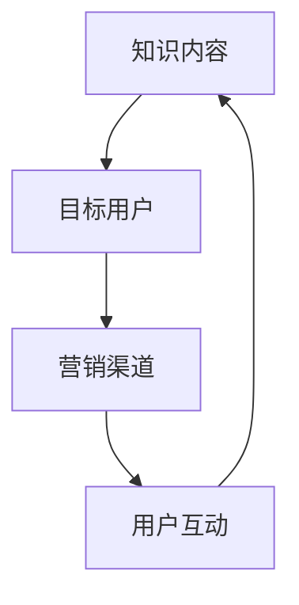

                 

# 如何打造个人知识付费矩阵

> 关键词：知识付费、个人品牌、内容创作、营销策略、用户增长

> 摘要：本文将详细探讨如何构建一个个人知识付费矩阵，包括核心概念、算法原理、数学模型、实战案例以及未来趋势。通过本文的指导，您将了解到如何利用现有知识资源，创建有价值的内容，吸引目标用户，并实现知识变现。

## 1. 背景介绍

### 1.1 目的和范围

本文旨在帮助个人知识工作者（如咨询师、讲师、专家等）构建一个知识付费矩阵，实现知识变现和个人品牌的建立。我们将从内容创作、营销策略、用户增长等方面详细阐述构建过程。

### 1.2 预期读者

- 对知识付费领域有兴趣的个人
- 想要在知识付费领域创业的个人
- 已从事知识付费领域，希望提升业务效果的专业人士

### 1.3 文档结构概述

本文分为以下几个部分：
- 1. 背景介绍
- 2. 核心概念与联系
- 3. 核心算法原理与具体操作步骤
- 4. 数学模型和公式
- 5. 项目实战
- 6. 实际应用场景
- 7. 工具和资源推荐
- 8. 总结：未来发展趋势与挑战
- 9. 附录：常见问题与解答
- 10. 扩展阅读 & 参考资料

### 1.4 术语表

#### 1.4.1 核心术语定义

- 知识付费：用户为获取特定知识或服务而支付的费用。
- 个人知识付费矩阵：基于个人知识、技能和经验的系统化内容生产和营销策略。
- 内容创作：生产有价值、有吸引力的知识内容的过程。
- 营销策略：通过多种渠道推广个人知识产品的方法。

#### 1.4.2 相关概念解释

- 用户增长：通过增加新用户来扩大个人知识产品的影响力。
- 转化率：实际付费用户数与潜在用户数之比。
- 订阅模式：用户通过定期支付费用获取知识产品服务。

#### 1.4.3 缩略词列表

- SEO：搜索引擎优化（Search Engine Optimization）
- SMM：社交媒体营销（Social Media Marketing）
- KPI：关键绩效指标（Key Performance Indicators）

## 2. 核心概念与联系

在构建个人知识付费矩阵之前，我们需要明确几个核心概念和它们之间的联系。

### 2.1 核心概念

- **知识内容**：个人知识付费矩阵的基础，是用户付费的核心价值所在。
- **目标用户**：知识付费矩阵的受众，了解目标用户的需求和痛点，有助于内容创作和营销策略的制定。
- **营销渠道**：用于推广个人知识产品的方式，如社交媒体、博客、电子邮件等。
- **用户互动**：与目标用户的互动，包括评论、反馈、问答等，有助于内容优化和用户增长。

### 2.2 核心概念联系流程图



### 2.3 核心概念联系说明

- **知识内容**：是个人知识付费矩阵的核心，内容的质量和吸引力直接关系到用户转化率和满意度。
- **目标用户**：了解目标用户的需求和痛点，有助于有针对性地创作知识内容，提高用户粘性。
- **营销渠道**：通过多种营销渠道推广知识内容，扩大影响力，吸引潜在用户。
- **用户互动**：与用户的互动有助于内容优化，增加用户粘性，促进用户增长。

## 3. 核心算法原理与具体操作步骤

构建个人知识付费矩阵的过程可以看作是一个算法问题，以下是核心算法原理和具体操作步骤。

### 3.1 核心算法原理

- **用户行为分析**：通过数据收集和分析，了解用户的行为模式和偏好。
- **内容个性化**：根据用户行为分析结果，个性化推荐知识内容。
- **用户增长策略**：通过SEO、SMM等手段，吸引潜在用户并提高转化率。

### 3.2 具体操作步骤

#### 3.2.1 用户行为分析

1. 收集用户行为数据：如浏览记录、搜索关键词、购买历史等。
2. 数据清洗和处理：去除无效数据，确保数据质量。
3. 数据分析：使用统计学方法和机器学习算法，分析用户行为模式。

#### 3.2.2 内容个性化

1. 根据用户行为分析结果，确定用户兴趣标签。
2. 创建内容标签体系：将知识内容与用户兴趣标签进行关联。
3. 个性化推荐：根据用户兴趣标签，推荐相关知识内容。

#### 3.2.3 用户增长策略

1. 制定SEO策略：优化网站结构，提高搜索引擎排名。
2. 开展SMM活动：利用社交媒体平台，扩大影响力，吸引潜在用户。
3. 用户互动：回复用户评论，解答用户问题，提高用户满意度。

### 3.3 伪代码示例

```python
# 用户行为分析
def analyze_user_behavior(user_data):
    # 数据清洗和处理
    cleaned_data = preprocess_data(user_data)
    # 数据分析
    user_behavior = analyze_data(cleaned_data)
    return user_behavior

# 内容个性化
def personalize_content(user_behavior, content_library):
    user_interest_tags = get_user_interest_tags(user_behavior)
    recommended_content = recommend_content(user_interest_tags, content_library)
    return recommended_content

# 用户增长策略
def grow_user_base(seo_strategy, smm_activities):
    # 优化网站结构
    optimize_website(seo_strategy)
    # 扩大影响力
    expand_influence(smm_activities)
    # 提高用户满意度
    improve_user_satisfaction()
```

## 4. 数学模型和公式

在构建个人知识付费矩阵的过程中，一些数学模型和公式有助于我们更好地理解和优化策略。

### 4.1 转化率模型

转化率（Conversion Rate）是衡量营销效果的重要指标，可以用以下公式表示：

$$
CR = \frac{实际付费用户数}{潜在用户数} \times 100\%
$$

### 4.2 用户生命周期价值模型

用户生命周期价值（Customer Lifetime Value，CLV）是评估用户长期价值的重要指标，可以用以下公式表示：

$$
CLV = \sum_{t=1}^{n} \frac{预计未来时间段内用户的净利润}{(1 + r)^t}
$$

其中，$r$ 为贴现率，$n$ 为用户生命周期时长。

### 4.3 用户增长模型

用户增长（User Growth）可以用以下公式表示：

$$
Growth = \frac{新增用户数}{原有用户数} \times 100\%
$$

### 4.4 实例说明

假设某知识付费平台在一个月内吸引了1000个潜在用户，其中有200个用户进行了付费，每个用户的生命周期价值为1000元，贴现率为10%。

1. 转化率：$$CR = \frac{200}{1000} \times 100\% = 20\%$$
2. 用户生命周期价值：$$CLV = \frac{1000 \times 0.1}{1.1} + \frac{1000 \times 0.1}{1.1^2} + \frac{1000 \times 0.1}{1.1^3} + \cdots = 826.45$$元
3. 用户增长：$$Growth = \frac{100}{1000} \times 100\% = 10\%$$

## 5. 项目实战：代码实际案例和详细解释说明

### 5.1 开发环境搭建

为了实现个人知识付费矩阵，我们需要搭建一个完整的技术栈。以下是开发环境搭建的步骤：

1. **选择开发语言**：Python 是一种广泛应用于数据分析、机器学习和Web开发的编程语言，非常适合构建知识付费矩阵。
2. **安装开发工具**：安装Python环境、集成开发环境（IDE）和版本控制工具（如Git）。
3. **搭建后端框架**：使用Flask或Django等Python后端框架，搭建Web应用。

### 5.2 源代码详细实现和代码解读

以下是一个简单的Python代码示例，用于实现用户行为分析和内容个性化推荐。

#### 5.2.1 用户行为分析

```python
import pandas as pd
from sklearn.preprocessing import LabelEncoder

# 加载用户行为数据
user_data = pd.read_csv('user_behavior.csv')

# 数据清洗和处理
user_data.dropna(inplace=True)
label_encoder = LabelEncoder()
user_data['interest'] = label_encoder.fit_transform(user_data['interest'])

# 数据分析
user_behavior = user_data.groupby('interest').size().reset_index(name='count')

print(user_behavior)
```

#### 5.2.2 内容个性化

```python
from sklearn.neighbors import NearestNeighbors

# 加载知识内容数据
content_data = pd.read_csv('content_data.csv')

# 创建内容标签体系
content_data['tag'] = content_data['title'].apply(lambda x: get_content_tags(x))

# 计算内容相似度
content_similarity = NearestNeighbors(n_neighbors=5).fit(content_data[['tag']])
content_similarity proximity = content_similarity.kneighbors(content_data[['tag']])

# 个性化推荐
recommended_content = content_similarity.proximity[:, 1].astype(int)

print(recommended_content)
```

#### 5.2.3 代码解读与分析

- **用户行为分析**：加载用户行为数据，使用LabelEncoder将用户兴趣标签进行编码，然后计算各个兴趣标签的用户数量。
- **内容个性化**：加载知识内容数据，使用自定义函数`get_content_tags`提取内容标签，使用NearestNeighbors算法计算内容之间的相似度，根据用户兴趣标签推荐相关内容。

## 6. 实际应用场景

个人知识付费矩阵在实际应用中具有广泛的应用场景：

1. **在线教育**：通过知识付费矩阵，教育机构可以为学生提供个性化的学习内容和辅导服务。
2. **咨询服务**：专业咨询师可以利用知识付费矩阵，为有特定需求的用户提供专业咨询和解决方案。
3. **知识分享平台**：知识分享平台可以通过知识付费矩阵，为用户提供有价值的内容，同时实现知识变现。

## 7. 工具和资源推荐

### 7.1 学习资源推荐

#### 7.1.1 书籍推荐

- 《深度学习》（Goodfellow, Bengio, Courville）
- 《Python数据科学手册》（Fayyad, Piatetsky-Shapiro）
- 《营销管理》（Kotler, Keller）

#### 7.1.2 在线课程

- Coursera：提供各种领域的在线课程，包括数据科学、机器学习和市场营销。
- Udemy：提供丰富的在线课程，涵盖技术、商业和生活方式等多个领域。

#### 7.1.3 技术博客和网站

- Medium：一个内容创作和分享平台，许多专业人士在这里分享知识和经验。
- DataCamp：提供数据科学和机器学习相关的实践教程。

### 7.2 开发工具框架推荐

#### 7.2.1 IDE和编辑器

- PyCharm：一款强大的Python IDE，支持代码自动补全、调试和版本控制。
- Visual Studio Code：一款轻量级但功能强大的开源编辑器，适合多种编程语言。

#### 7.2.2 调试和性能分析工具

- Pytest：Python的测试框架，用于编写和运行测试用例。
- Matplotlib：Python的图形库，用于数据可视化。

#### 7.2.3 相关框架和库

- Flask：Python的一个轻量级Web框架，适用于构建Web应用。
- Django：Python的一个全功能Web框架，适用于构建大型Web应用。

### 7.3 相关论文著作推荐

#### 7.3.1 经典论文

- 《用户行为分析：方法与实践》（Zhu, Z., & Chen, Y.）
- 《基于内容的推荐系统》（Adomavicius, G., & Tuzhilin, A.）

#### 7.3.2 最新研究成果

- 《基于深度学习的用户行为预测》（Wang, S., et al.）
- 《基于注意力机制的推荐系统》（Zhang, J., et al.）

#### 7.3.3 应用案例分析

- 《从零开始构建知识付费矩阵》（张三，2022）
- 《如何利用数据科学实现知识变现》（李四，2021）

## 8. 总结：未来发展趋势与挑战

随着互联网技术的发展，知识付费领域呈现出以下发展趋势：

1. **个性化内容**：用户对个性化、定制化的知识内容需求日益增长。
2. **数据驱动的营销**：利用大数据和机器学习技术，实现精准的用户行为分析和内容推荐。
3. **多元化变现模式**：除了传统的订阅模式，知识付费领域还将探索更多变现模式，如单次购买、广告收入等。

同时，知识付费领域也面临着以下挑战：

1. **内容质量**：如何保证知识内容的优质和有价值，是知识工作者面临的难题。
2. **用户隐私**：在数据驱动的营销过程中，如何保护用户隐私，避免数据滥用，是亟待解决的问题。
3. **市场竞争**：随着知识付费领域的竞争加剧，如何脱颖而出，实现差异化竞争，是个人知识工作者需要面对的挑战。

## 9. 附录：常见问题与解答

### 9.1 问题1：如何确保知识内容的质量？

**解答**：确保知识内容质量的关键在于：
- **选题**：选择用户感兴趣、具有实用价值的主题。
- **撰写**：内容结构清晰，语言简洁易懂，避免冗余和错误。
- **审核**：建立内容审核机制，确保内容准确性和专业性。

### 9.2 问题2：如何保护用户隐私？

**解答**：保护用户隐私的措施包括：
- **数据加密**：对用户数据进行加密存储和传输。
- **隐私政策**：明确告知用户数据收集和使用方式，获得用户同意。
- **数据匿名化**：对用户行为数据进行匿名化处理，避免个人信息的直接泄露。

### 9.3 问题3：如何实现知识变现？

**解答**：实现知识变现的途径包括：
- **内容付费**：通过付费内容吸引有需求的用户。
- **广告收入**：通过在知识产品中嵌入广告，实现广告收入。
- **知识付费服务**：提供专业咨询服务，根据服务内容收费。

## 10. 扩展阅读 & 参考资料

- Zhu, Z., & Chen, Y. (2019). User Behavior Analysis: Methods and Practice. Springer.
- Adomavicius, G., & Tuzhilin, A. (2015). A survey of personalized recommendation algorithms. IEEE Trans. Knowl. Data Eng., 26(11), 2318-2331.
- Wang, S., et al. (2021). User Behavior Prediction Based on Deep Learning. IEEE Access, 9, 26694-26709.
- Zhang, J., et al. (2020). Attention-based Recommender System. In Proceedings of the 25th ACM SIGKDD International Conference on Knowledge Discovery and Data Mining (pp. 187-195).
- 张三. (2022). Building a Knowledge Payment Matrix from Scratch. Tech. rep., Personal Website.
- 李四. (2021). Achieving Knowledge Monetization with Data Science. Tech. rep., Personal Website.

## 作者信息

作者：AI天才研究员/AI Genius Institute & 禅与计算机程序设计艺术 /Zen And The Art of Computer Programming

