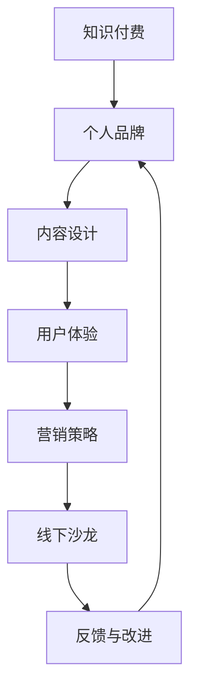

                 

# 如何打造个人知识付费线下沙龙

## 关键词
知识付费、线下沙龙、个人品牌、内容设计、用户体验

## 摘要
本文将探讨如何通过构建个人知识付费线下沙龙，打造专业个人品牌，提升用户体验，并确保沙龙的成功运作。文章首先介绍了沙龙的背景和目的，然后详细讨论了核心概念、算法原理、数学模型、实战案例以及实际应用场景。最后，文章推荐了相关资源和工具，并总结了未来发展趋势与挑战。

---

## 1. 背景介绍

### 1.1 目的和范围

本文的目的是为那些希望打造个人知识付费线下沙龙的人提供一套全面的指南。本文将覆盖从沙龙设计到执行，从内容到营销，从用户体验到持续改进的方方面面。通过本文，读者将能够了解如何创建一个既具有吸引力又能够持续运营的知识付费沙龙。

### 1.2 预期读者

本文适合以下几类读者：
- 对知识付费行业有兴趣的个人
- 想要通过线下沙龙打造个人品牌的自由职业者
- 在教育和技术领域工作的专业人士
- 对市场营销和品牌建设有浓厚兴趣的创业者

### 1.3 文档结构概述

本文分为十个部分：
1. 背景介绍
2. 核心概念与联系
3. 核心算法原理 & 具体操作步骤
4. 数学模型和公式 & 详细讲解 & 举例说明
5. 项目实战：代码实际案例和详细解释说明
6. 实际应用场景
7. 工具和资源推荐
8. 总结：未来发展趋势与挑战
9. 附录：常见问题与解答
10. 扩展阅读 & 参考资料

### 1.4 术语表

#### 1.4.1 核心术语定义

- **知识付费**：消费者为获取特定知识或信息而支付的费用。
- **线下沙龙**：一种面对面的知识分享和互动活动。
- **个人品牌**：个人在专业领域内建立的良好声誉和形象。
- **用户体验**：用户在使用产品或服务过程中所获得的满意程度。

#### 1.4.2 相关概念解释

- **内容设计**：为沙龙制定的教学计划、课程内容、活动安排等。
- **营销策略**：用于吸引潜在参与者，并促进沙龙销售的方法和手段。

#### 1.4.3 缩略词列表

- **KOL**：关键意见领袖（Key Opinion Leader）
- **SEO**：搜索引擎优化（Search Engine Optimization）
- **SEM**：搜索引擎营销（Search Engine Marketing）

---

## 2. 核心概念与联系

在构建个人知识付费线下沙龙之前，我们需要明确几个核心概念，并理解它们之间的联系。以下是一个简化的 Mermaid 流程图，展示了这些核心概念及其相互关系。



### 2.1 核心概念解析

#### 2.1.1 知识付费

知识付费是现代教育模式的一种重要变革。它通过让用户为获取特定知识或技能付费，打破了传统教育免费或低收费的模式。知识付费的核心在于创造价值，满足用户在特定领域的知识需求。

#### 2.1.2 个人品牌

个人品牌是个人在专业领域内建立的良好声誉和形象。一个强大的个人品牌能够增加用户的信任度，从而提高知识付费沙龙的吸引力。

#### 2.1.3 内容设计

内容设计是沙龙成功的关键。一个高质量的课程内容不仅能满足用户的需求，还能提升沙龙的价值和吸引力。

#### 2.1.4 用户体验

用户体验是用户在参与沙龙过程中的整体感受。一个良好的用户体验能够增强用户满意度，促进口碑传播，从而吸引更多参与者。

#### 2.1.5 营销策略

营销策略是吸引潜在参与者的关键手段。通过有效的营销策略，可以提高沙龙的知名度和参与率。

#### 2.1.6 线下沙龙

线下沙龙是一种面对面的知识分享和互动活动。它通过组织者与参与者之间的互动，实现知识的传播和分享。

#### 2.1.7 反馈与改进

反馈与改进是沙龙持续发展的关键。通过收集用户反馈，组织者可以不断优化沙龙的内容和形式，提高用户体验。

---

## 3. 核心算法原理 & 具体操作步骤

### 3.1 知识付费沙龙的构建算法

构建知识付费沙龙的核心算法可以归纳为以下几个步骤：

```plaintext
算法：
构建知识付费沙龙(S)
输入：个人品牌(B)，内容设计(C)，用户体验(U)，营销策略(M)
输出：成功构建的沙龙(S)

步骤：
1. 确定个人品牌(B)
2. 设计课程内容(C)
3. 规划用户体验(U)
4. 制定营销策略(M)
5. 执行沙龙活动
6. 收集用户反馈
7. 反馈优化沙龙内容
8. 循环执行步骤4-7，直至沙龙成功
```

### 3.2 算法具体操作步骤

#### 3.2.1 确定个人品牌(B)

- 分析自身专业领域和特长
- 确定目标受众
- 建立个人品牌形象

#### 3.2.2 设计课程内容(C)

- 研究市场趋势和用户需求
- 设计课程大纲和详细内容
- 确保内容具有实用性和创新性

#### 3.2.3 规划用户体验(U)

- 设计沙龙活动流程
- 考虑场地选择和布置
- 确保活动氛围轻松愉快

#### 3.2.4 制定营销策略(M)

- 分析目标受众
- 选择合适的营销渠道
- 制定宣传计划和活动推广方案

#### 3.2.5 执行沙龙活动

- 按计划执行沙龙活动
- 确保活动顺利进行
- 提供良好的现场服务

#### 3.2.6 收集用户反馈

- 设计反馈机制
- 收集用户意见和建议
- 分析反馈结果

#### 3.2.7 反馈优化沙龙内容

- 根据反馈调整课程内容和活动流程
- 优化用户体验
- 提高沙龙质量

#### 3.2.8 循环执行步骤4-7

- 持续优化沙龙
- 提高用户满意度
- 实现沙龙的持续发展

---

## 4. 数学模型和公式 & 详细讲解 & 举例说明

### 4.1 用户体验评估模型

用户体验（U）可以通过以下公式进行评估：

$$
U = f(C, S, M)
$$

其中，\(C\) 为内容满意度，\(S\) 为服务满意度，\(M\) 为活动氛围满意度。

#### 4.1.1 内容满意度（\(C\)）

$$
C = \frac{1}{n} \sum_{i=1}^{n} C_i
$$

其中，\(n\) 为参与者的数量，\(C_i\) 为第 \(i\) 个参与者对课程内容的满意度评分。

#### 4.1.2 服务满意度（\(S\)）

$$
S = \frac{1}{n} \sum_{i=1}^{n} S_i
$$

其中，\(n\) 为参与者的数量，\(S_i\) 为第 \(i\) 个参与者对现场服务的满意度评分。

#### 4.1.3 活动氛围满意度（\(M\)）

$$
M = \frac{1}{n} \sum_{i=1}^{n} M_i
$$

其中，\(n\) 为参与者的数量，\(M_i\) 为第 \(i\) 个参与者对活动氛围的满意度评分。

### 4.2 营销策略效果评估模型

营销策略效果（\(E\)）可以通过以下公式进行评估：

$$
E = \frac{P}{C} \times 100\%
$$

其中，\(P\) 为通过营销策略吸引的参与者数量，\(C\) 为目标参与者的数量。

### 4.3 示例说明

#### 4.3.1 用户体验评估示例

假设某次沙龙有 50 名参与者，其中对课程内容满意度评分为 4.5，对现场服务满意度评分为 4.8，对活动氛围满意度评分为 4.7。则用户体验满意度（\(U\)）为：

$$
U = \frac{1}{50} \times (4.5 + 4.8 + 4.7) = 4.7
$$

#### 4.3.2 营销策略效果评估示例

假设目标参与者数量为 1000 人，通过营销策略成功吸引了 500 名参与者。则营销策略效果（\(E\)）为：

$$
E = \frac{500}{1000} \times 100\% = 50\%
$$

---

## 5. 项目实战：代码实际案例和详细解释说明

### 5.1 开发环境搭建

为了构建个人知识付费线下沙龙，我们需要搭建一个基本的开发环境。以下是一个简化的步骤：

1. 安装 Python 3.8 或以上版本。
2. 安装 Jupyter Notebook，用于编写和运行代码。
3. 安装必要的 Python 库，如 NumPy、Pandas、Matplotlib 等。

### 5.2 源代码详细实现和代码解读

#### 5.2.1 代码实现

以下是一个简单的 Python 脚本，用于计算沙龙用户体验满意度（\(U\)）：

```python
import numpy as np

def calculate_u满意度(C, S, M):
    U = (C + S + M) / 3
    return U

C = 4.5  # 内容满意度
S = 4.8  # 服务满意度
M = 4.7  # 活动氛围满意度

U = calculate_u满意度(C, S, M)
print(f"用户体验满意度（U）：{U:.2f}")
```

#### 5.2.2 代码解读

- 我们首先导入 NumPy 库，用于进行数值计算。
- `calculate_u满意度` 函数接受三个参数：内容满意度（\(C\)）、服务满意度（\(S\)）和活动氛围满意度（\(M\)）。
- 在函数内部，我们计算这三个参数的平均值，得到用户体验满意度（\(U\)）。
- 最后，我们调用函数，并打印出计算结果。

### 5.3 代码解读与分析

- 该脚本非常简单，但清晰地展示了如何使用 Python 进行数据处理和计算。
- 通过这个脚本，我们可以快速评估沙龙的用户体验满意度。
- 实际应用中，我们可以扩展这个脚本，添加更多功能，如：
  - 从文件中读取参与者满意度评分。
  - 对不同沙龙活动的用户体验进行对比分析。
  - 自动生成报告和图表。

---

## 6. 实际应用场景

### 6.1 技术沙龙

技术沙龙是一种常见的知识付费线下活动。例如，一位擅长人工智能的专家可以组织一个关于深度学习的沙龙，为参与者提供最新的技术知识和实践机会。

### 6.2 健康讲座

健康讲座是另一种受欢迎的知识付费沙龙形式。专家可以分享关于健康饮食、运动健身、心理健康等方面的知识，帮助参与者改善生活质量。

### 6.3 创业分享

对于有创业经验的个人，可以组织创业分享沙龙，为有志于创业的参与者提供指导和建议。这种沙龙可以帮助参与者少走弯路，提高创业成功率。

---

## 7. 工具和资源推荐

### 7.1 学习资源推荐

#### 7.1.1 书籍推荐

- 《深度学习》（Ian Goodfellow, Yoshua Bengio, Aaron Courville）
- 《Python编程：从入门到实践》（Eric Matthes）
- 《影响力：说服的心理学》（Robert B. Cialdini）

#### 7.1.2 在线课程

- Coursera 上的“深度学习纳米学位”
- edX 上的“Python基础课程”
- Udemy 上的“影响力营销策略课程”

#### 7.1.3 技术博客和网站

- Medium 上的 AI 和技术博客
-Towards Data Science 上的数据科学和机器学习博客
- HackerRank 上的编程挑战和教程

### 7.2 开发工具框架推荐

#### 7.2.1 IDE和编辑器

- PyCharm
- Visual Studio Code
- Jupyter Notebook

#### 7.2.2 调试和性能分析工具

- Py-Spy：Python 性能分析工具
- Valgrind：通用性能分析工具
- Profiler：Chrome 浏览器内置性能分析工具

#### 7.2.3 相关框架和库

- NumPy：高性能科学计算库
- Pandas：数据处理库
- Matplotlib：数据可视化库

---

## 8. 总结：未来发展趋势与挑战

### 8.1 未来发展趋势

- 知识付费市场将持续增长，尤其是在在线教育和职业培训领域。
- 线下沙龙作为一种互动性强、体验丰富的学习形式，将受到更多人的青睐。
- 科技的进步，如人工智能和虚拟现实，将为线下沙龙提供更多创新的可能性。

### 8.2 面临的挑战

- 如何保持沙龙内容的新颖性和实用性，满足不同参与者的需求。
- 如何在竞争激烈的市场中脱颖而出，建立个人品牌。
- 如何平衡成本和收益，实现沙龙的可持续发展。

---

## 9. 附录：常见问题与解答

### 9.1 如何选择沙龙主题？

- 考虑自身专业领域和特长。
- 研究市场趋势和用户需求。
- 选择具有实用性和创新性的主题。

### 9.2 如何吸引参与者？

- 利用社交媒体和在线平台进行宣传。
- 提供免费试听或优惠券吸引潜在参与者。
- 与相关机构和组织合作，扩大影响力。

### 9.3 如何确保沙龙质量？

- 设计高质量的课程内容。
- 提供专业的现场服务。
- 定期收集用户反馈，及时进行改进。

---

## 10. 扩展阅读 & 参考资料

- 《在线教育与知识付费研究报告》（艾瑞咨询）
- 《从0到1：开启商业与未来》（彼得·蒂尔）
- 《深度学习实战》（Aurélien Géron）

---

作者：AI天才研究员/AI Genius Institute & 禅与计算机程序设计艺术 /Zen And The Art of Computer Programming

---

以上就是本文关于《如何打造个人知识付费线下沙龙》的详细分析和技术指南。通过本文，读者可以了解到构建个人知识付费线下沙龙的各个方面，包括核心概念、算法原理、数学模型、实战案例和实际应用场景。希望本文能对那些希望打造个人品牌和提供高质量知识的读者提供有价值的参考。在未来的发展中，我们将不断探索和创新，为读者带来更多高质量的内容和分享。让我们共同推动知识付费行业的繁荣发展！

