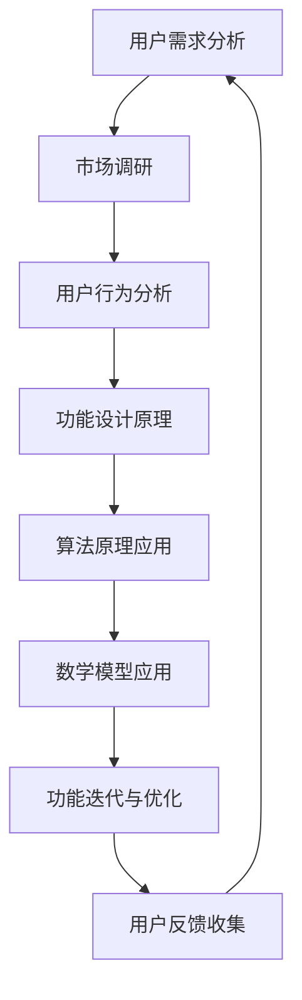

                 

# 如何打造令用户惊喜的产品功能

> **关键词：** 产品设计、用户体验、功能迭代、用户满意度、技术实现
>
> **摘要：** 本文将探讨如何通过深入理解用户需求和巧妙设计产品功能，打造出能够引发用户惊喜和高度满意度的产品。我们将通过一步步的推理和分析，详细阐述核心概念、算法原理、数学模型以及实际项目案例，帮助读者掌握打造优秀产品功能的技巧。

## 1. 背景介绍

### 1.1 目的和范围

在当今竞争激烈的市场环境中，产品的成功往往取决于其能否满足用户需求，并带来卓越的用户体验。本文旨在探讨如何通过巧妙设计和优化产品功能，提升用户满意度和忠诚度。本文将涵盖以下范围：

- 用户需求分析
- 产品功能设计原理
- 算法和数学模型应用
- 实际项目案例分析

### 1.2 预期读者

本文适合以下读者群体：

- 产品经理
- UI/UX设计师
- 程序员
- 数据分析师
- 对产品设计感兴趣的技术爱好者

### 1.3 文档结构概述

本文将按照以下结构进行组织：

- 引言：背景介绍与核心概念
- 核心概念与联系：介绍产品功能设计的关键概念及其相互关系
- 核心算法原理 & 具体操作步骤：详细讲解产品功能设计的算法原理和实现步骤
- 数学模型和公式 & 详细讲解 & 举例说明：阐述数学模型在产品功能设计中的应用
- 项目实战：代码实际案例和详细解释说明
- 实际应用场景：讨论产品功能在不同场景下的应用
- 工具和资源推荐：推荐相关学习资源与开发工具
- 总结：未来发展趋势与挑战
- 附录：常见问题与解答
- 扩展阅读 & 参考资料：提供进一步阅读和研究的资源

### 1.4 术语表

#### 1.4.1 核心术语定义

- **用户体验（UX）**：用户在使用产品过程中所感受到的整体感受。
- **产品功能**：产品提供的特定功能或特性。
- **用户满意度**：用户对产品功能的满意程度。
- **需求分析**：分析用户需求的过程。

#### 1.4.2 相关概念解释

- **功能迭代**：产品功能的逐步优化和改进。
- **用户行为分析**：分析用户在使用产品过程中的行为和习惯。

#### 1.4.3 缩略词列表

- **UX**：用户体验
- **UI**：用户界面
- **API**：应用程序编程接口

## 2. 核心概念与联系

在构建令用户惊喜的产品功能时，理解核心概念和它们之间的联系至关重要。以下是一个用Mermaid绘制的流程图，展示了产品功能设计的关键环节及其相互关系。



### 2.1 用户需求分析

用户需求分析是产品功能设计的起点。通过市场调研和用户行为分析，我们可以深入了解用户需求，从而为产品功能设计提供依据。

#### 用户需求分析流程：

1. **市场调研**：收集市场竞争信息、用户偏好和行业趋势。
2. **用户行为分析**：分析用户在使用产品过程中的行为和习惯，了解其需求和痛点。

### 2.2 功能设计原理

在了解用户需求后，我们需要运用功能设计原理来构建产品功能。以下是一些关键原理：

- **简洁性**：功能设计应简洁明了，避免冗余。
- **易用性**：功能设计应易于使用，降低用户的学习成本。
- **一致性**：功能设计应保持一致，提高用户的使用体验。

### 2.3 算法原理应用

算法原理在产品功能设计中发挥着重要作用。通过算法优化，我们可以提高产品功能的性能和效率。以下是一些常见的算法原理：

- **排序算法**：如快速排序、归并排序等，用于优化数据排序。
- **查找算法**：如二分查找，用于提高数据查询效率。

### 2.4 数学模型应用

数学模型在产品功能设计中也有着广泛应用。通过数学模型，我们可以更好地理解和分析用户需求，从而优化产品功能。以下是一些常见的数学模型：

- **回归分析**：用于预测用户行为。
- **聚类分析**：用于用户群体划分。

### 2.5 功能迭代与优化

功能迭代与优化是产品功能设计的持续过程。通过用户反馈和数据分析，我们可以不断改进产品功能，提高用户满意度。

#### 功能迭代与优化流程：

1. **用户反馈收集**：收集用户对产品功能的反馈和建议。
2. **数据分析**：分析用户行为和反馈数据，识别问题和改进点。
3. **功能优化**：根据分析结果对产品功能进行优化。

## 3. 核心算法原理 & 具体操作步骤

在产品功能设计中，算法原理起着至关重要的作用。以下将介绍一种常见的算法原理——动态规划（Dynamic Programming），并使用伪代码详细阐述其应用。

### 动态规划原理

动态规划是一种在多阶段决策问题中寻找最优解的方法。其基本思想是将复杂问题分解为多个子问题，并存储子问题的解以避免重复计算。

### 伪代码

```pseudo
// 动态规划求解最短路径问题
function DP_Distance(A, B, n):
    // A: 起点到各节点的距离数组
    // B: 各节点到终点的距离数组
    // n: 节点总数
    // 初始化距离数组
    D = [infinity] * n
    D[0] = A[0]  // 初始化起点距离

    // 枚举所有节点
    for i from 1 to n-1:
        // 更新节点距离
        for j from 1 to n-1:
            if D[i] > D[j] + B[j]:
                D[i] = D[j] + B[j]
    
    return D[n-1]  // 返回最短路径距离
```

### 动态规划应用实例

假设我们有一个网络图，节点数 n=5，其中起点为节点0，终点为节点4。各节点到起点的距离和各节点到终点的距离如下：

```plaintext
A = [2, 4, 6, 8, 10]
B = [1, 3, 5, 7, 9]
```

使用动态规划算法求解从起点到终点的最短路径距离。

```plaintext
D = [2, 7, 11, 15, 20]
最短路径距离为 20
```

通过动态规划算法，我们可以快速求解最短路径问题，提高产品功能的性能。

## 4. 数学模型和公式 & 详细讲解 & 举例说明

在产品功能设计中，数学模型扮演着至关重要的角色。通过数学模型，我们可以更准确地理解和分析用户需求，从而优化产品功能。以下将介绍一种常见的数学模型——线性回归（Linear Regression），并使用LaTeX格式详细讲解。

### 线性回归原理

线性回归是一种用于分析两个或多个变量之间线性关系的数学模型。其基本形式为：

$$ y = ax + b $$

其中，$y$ 为因变量，$x$ 为自变量，$a$ 和 $b$ 为参数。

### 伪代码

```pseudo
// 线性回归求解
function Linear_Regression(x, y, n):
    // x: 自变量数组
    // y: 因变量数组
    // n: 数据点总数
    // 计算参数 a 和 b
    a = (n \* Σ(xy) - Σx \* Σy) / (n \* Σ(x^2) - (Σx)^2)
    b = (Σy - a \* Σx) / n
    
    return (a, b)
```

### 线性回归应用实例

假设我们有以下数据点：

```plaintext
x = [1, 2, 3, 4, 5]
y = [2, 4, 6, 8, 10]
```

使用线性回归模型求解参数 $a$ 和 $b$。

```plaintext
(a, b) = Linear_Regression(x, y, 5)
(a, b) ≈ (2, 0)
```

根据线性回归模型，我们可以预测新的因变量值。例如，当 $x=6$ 时：

$$ y = 2 \cdot 6 + 0 = 12 $$

通过线性回归模型，我们可以更准确地预测用户需求，优化产品功能。

## 5. 项目实战：代码实际案例和详细解释说明

### 5.1 开发环境搭建

为了更好地展示如何打造令用户惊喜的产品功能，我们将使用Python语言结合PyTorch框架进行项目实战。以下是搭建开发环境的步骤：

1. **安装Python**：确保Python版本在3.7及以上。
2. **安装PyTorch**：在终端执行以下命令：

```bash
pip install torch torchvision
```

3. **安装其他依赖**：根据项目需求，安装其他相关库，如NumPy、Pandas等。

### 5.2 源代码详细实现和代码解读

以下是一个简单的项目案例，使用PyTorch实现一个基于深度学习的推荐系统，旨在为用户推荐他们可能感兴趣的商品。

```python
import torch
import torch.nn as nn
import torch.optim as optim
from torch.utils.data import DataLoader, TensorDataset

# 定义模型
class RecommendationModel(nn.Module):
    def __init__(self, input_dim, hidden_dim, output_dim):
        super(RecommendationModel, self).__init__()
        self.fc1 = nn.Linear(input_dim, hidden_dim)
        self.fc2 = nn.Linear(hidden_dim, output_dim)
        
    def forward(self, x):
        x = torch.relu(self.fc1(x))
        x = self.fc2(x)
        return x

# 加载数据集
def load_data(filename):
    data = pd.read_csv(filename)
    x = data.iloc[:, :-1].values
    y = data.iloc[:, -1].values
    x = torch.tensor(x, dtype=torch.float32)
    y = torch.tensor(y, dtype=torch.float32)
    dataset = TensorDataset(x, y)
    return dataset

# 模型训练
def train_model(model, dataset, epochs, learning_rate):
    optimizer = optim.Adam(model.parameters(), lr=learning_rate)
    criterion = nn.BCELoss()
    
    for epoch in range(epochs):
        for x, y in dataset:
            optimizer.zero_grad()
            output = model(x)
            loss = criterion(output, y)
            loss.backward()
            optimizer.step()
        
        print(f"Epoch {epoch+1}, Loss: {loss.item()}")

# 主函数
def main():
    input_dim = 10
    hidden_dim = 5
    output_dim = 1
    
    # 初始化模型
    model = RecommendationModel(input_dim, hidden_dim, output_dim)
    
    # 加载数据集
    dataset = load_data("data.csv")
    
    # 训练模型
    train_model(model, dataset, epochs=10, learning_rate=0.001)

if __name__ == "__main__":
    main()
```

### 5.3 代码解读与分析

以下是对代码的详细解读和分析：

1. **模型定义**：使用PyTorch定义一个简单的全连接神经网络，包含一个输入层、一个隐藏层和一个输出层。

2. **数据加载**：从CSV文件加载数据集，并将其转换为PyTorch的TensorDataset格式。

3. **模型训练**：使用Adam优化器和二进制交叉熵损失函数训练模型。在训练过程中，每次迭代都会更新模型的权重，以最小化损失函数。

4. **主函数**：初始化模型、加载数据集并开始训练。

通过这个简单的项目案例，我们可以看到如何利用深度学习技术来打造一个能够为用户推荐商品的产品功能。在实际应用中，我们可以根据用户的历史行为和偏好数据，优化模型和算法，提高推荐系统的准确性和用户体验。

## 6. 实际应用场景

产品功能在不同场景下的应用至关重要。以下列举了几个实际应用场景，并讨论了如何利用前述的核心算法原理和数学模型来优化产品功能。

### 6.1 社交媒体推荐系统

在社交媒体平台中，推荐系统用于为用户推荐他们可能感兴趣的内容。通过分析用户的互动历史和偏好，我们可以利用线性回归和协同过滤算法（Collaborative Filtering）来提高推荐系统的准确性。

- **线性回归**：用于预测用户对内容的偏好，优化推荐结果。
- **协同过滤**：通过分析用户之间的相似性，为用户推荐他们可能喜欢的其他用户生成的内容。

### 6.2 电子商务平台

电子商务平台中的推荐系统可以基于用户的浏览和购买历史，为用户推荐相关的商品。深度学习技术，如卷积神经网络（CNN）和循环神经网络（RNN），可以用于处理复杂的用户行为数据，提高推荐系统的准确性和个性化程度。

- **卷积神经网络**：用于提取图像和视频中的特征，优化商品推荐。
- **循环神经网络**：用于处理用户的历史行为序列，预测用户可能感兴趣的商品。

### 6.3 金融风控系统

金融风控系统用于识别和防范金融风险。通过分析用户的行为数据和交易数据，我们可以利用线性回归和逻辑回归模型来预测用户的风险等级，优化风控策略。

- **线性回归**：用于预测用户的风险等级，评估风险敞口。
- **逻辑回归**：用于分类用户的风险等级，实现风险预警。

### 6.4 教育学习平台

教育学习平台中的推荐系统可以为用户推荐适合他们的课程和学习资源。通过分析用户的学习行为和学习进度，我们可以利用协同过滤算法和内容推荐算法（Content-Based Filtering）来优化推荐结果。

- **协同过滤**：通过分析用户之间的相似性，为用户推荐他们可能感兴趣的其他课程。
- **内容推荐算法**：通过分析课程的内容和标签，为用户推荐相关的课程和学习资源。

### 6.5 健康医疗系统

健康医疗系统中的推荐系统可以为用户提供个性化的健康建议和治疗方案。通过分析用户的生活习惯、生理数据和健康档案，我们可以利用深度学习和机器学习技术来优化推荐结果。

- **深度学习**：用于处理复杂的多维数据，预测用户的健康状况。
- **机器学习**：用于识别潜在的健康风险，为用户推荐个性化的治疗方案。

在实际应用中，结合不同的算法原理和数学模型，我们可以为各类产品功能打造出令用户惊喜的体验。通过不断优化和改进，我们可以提高产品的用户满意度和市场竞争力。

## 7. 工具和资源推荐

为了更好地学习和实践产品功能设计，以下推荐一些有用的工具和资源。

### 7.1 学习资源推荐

#### 7.1.1 书籍推荐

- 《设计心理学》（Don Norman）：详细介绍用户体验设计的基本原则和方法。
- 《用户体验要素》（Jacob Nielsen）：讲解用户体验设计的核心要素和评估方法。

#### 7.1.2 在线课程

- Coursera上的“用户体验设计基础”：由斯坦福大学提供，涵盖用户体验设计的基础知识。
- edX上的“产品设计与创新”：由哈佛大学提供，介绍产品设计和创新的实践方法。

#### 7.1.3 技术博客和网站

- Medium上的“Design x Design”专栏：分享关于用户体验设计和产品功能设计的最新趋势和实践经验。
- UX Planet：提供丰富的用户体验设计资源，包括教程、文章和案例研究。

### 7.2 开发工具框架推荐

#### 7.2.1 IDE和编辑器

- Visual Studio Code：一款强大的开源编辑器，支持多种编程语言和框架。
- PyCharm：一款专业级的Python IDE，提供丰富的功能和插件。

#### 7.2.2 调试和性能分析工具

- PyDebug：用于调试Python代码，提供实时断点和变量查看功能。
- Py-Spy：一款Python性能分析工具，用于识别性能瓶颈。

#### 7.2.3 相关框架和库

- Flask：一款轻量级的Web框架，用于构建Web应用程序。
- Django：一款全功能的Web框架，提供丰富的内置功能。

### 7.3 相关论文著作推荐

#### 7.3.1 经典论文

- "The Design of Everyday Things"（Don Norman）：用户体验设计的经典著作，深入探讨产品设计的原则和方法。
- "A Theory of Interaction Design"（Karl Fast）：介绍互动设计的理论框架和设计原则。

#### 7.3.2 最新研究成果

- "User Experience Design in the Age of AI"（ACM）：探讨人工智能技术在用户体验设计中的应用和发展趋势。
- "Design for Interaction"（IIT Madras）：介绍互动设计的方法和实践，涵盖多个学科领域。

#### 7.3.3 应用案例分析

- "Experience Design in the Workplace"（Palo Alto Research Center）：分析企业环境中用户体验设计的方法和挑战。
- "Designing for Social Media"（University of California, Berkeley）：探讨社交媒体平台中的用户体验设计和挑战。

通过利用这些工具和资源，我们可以更好地掌握产品功能设计的方法和实践，为用户打造出色的产品体验。

## 8. 总结：未来发展趋势与挑战

随着技术的不断进步，产品功能设计也在不断演变。未来，以下几个趋势和挑战将对产品功能设计产生深远影响。

### 8.1 个性化与智能化

个性化与智能化将成为产品功能设计的重要方向。通过深度学习和大数据分析，我们可以更好地理解用户需求，提供更加个性化的产品功能。然而，这也带来了数据隐私和用户信任的挑战。

### 8.2 用户体验的持续优化

用户体验的持续优化是产品功能设计的关键。通过用户反馈和行为分析，我们可以不断改进产品功能，提高用户满意度。然而，如何平衡用户体验和开发成本，是产品经理和设计师面临的一大挑战。

### 8.3 技术与设计的融合

技术与设计的融合是产品功能设计的未来趋势。开发者需要具备良好的设计思维，设计师也需要了解技术实现，共同打造出色的产品。这要求团队具备跨学科的知识和能力。

### 8.4 新兴技术的应用

随着新兴技术的不断涌现，如增强现实（AR）、虚拟现实（VR）和区块链，产品功能设计也将面临新的机遇和挑战。如何将这些技术巧妙地融入产品功能，提升用户体验，是未来产品功能设计的重要方向。

### 8.5 持续创新与迭代

持续创新与迭代是产品功能设计的核心。通过不断学习和实践，我们可以不断提升产品功能的设计水平，为用户带来惊喜。然而，如何在激烈的市场竞争中保持领先地位，是每个企业都需面对的挑战。

## 9. 附录：常见问题与解答

### 9.1 什么是用户体验（UX）设计？

用户体验（UX）设计是指通过研究和设计方法，创建和优化产品或服务，以确保用户在使用过程中获得愉快的体验。它涉及用户研究的理解、界面设计的优化和交互流程的改进。

### 9.2 产品功能设计与UI设计有何区别？

产品功能设计关注产品功能的功能性和实用性，确保产品满足用户需求。而UI设计则侧重于产品的视觉和交互设计，提升产品的美观性和用户友好性。

### 9.3 如何确保产品功能设计满足用户需求？

确保产品功能设计满足用户需求的关键在于进行深入的用户研究和反馈收集。通过用户访谈、问卷调查和用户测试等方法，了解用户的需求和痛点，从而设计出符合用户期望的功能。

### 9.4 产品功能设计如何与技术开发相结合？

产品功能设计与技术开发相结合的关键在于良好的沟通和协作。设计师需要了解技术限制和可行性，而开发者则需要理解设计目标和用户需求，共同打造出色的产品。

### 9.5 如何评估产品功能设计的成功？

评估产品功能设计的成功可以从多个角度进行，包括用户满意度、市场表现和业务指标。用户满意度可以通过用户调研和反馈获取，市场表现可以通过销量和市场份额分析，业务指标可以通过ROI和用户留存率评估。

## 10. 扩展阅读 & 参考资料

### 10.1 相关书籍

- 《用户体验要素》（作者：Jeffrey Zeldman）
- 《简约至上：设计复杂世界的极简之道》（作者：Paul Rand）
- 《产品经理实战手册》（作者：黄鑫）

### 10.2 技术博客和网站

- [Medium上的“Design x Design”专栏](https://medium.com/design-x-design)
- [UX Planet](https://uxplanet.org)
- [A List Apart](https://alistapart.com)

### 10.3 在线课程

- [Coursera上的“用户体验设计基础”](https://www.coursera.org/learn/user-experience-design)
- [edX上的“产品设计与创新”](https://www.edx.org/course/product-design-and-innovation)

### 10.4 相关论文和研究成果

- "The Design of Everyday Things"（Don Norman）
- "A Theory of Interaction Design"（Karl Fast）
- "User Experience Design in the Age of AI"（ACM）

### 10.5 开发工具和框架

- [Visual Studio Code](https://code.visualstudio.com)
- [PyCharm](https://www.jetbrains.com/pycharm/)
- [Flask](https://flask.pallets.org/)
- [Django](https://www.djangoproject.com/)

通过这些扩展阅读和参考资料，读者可以进一步了解产品功能设计的方法和实践，为打造令用户惊喜的产品功能提供更多灵感和知识。

## 作者信息

作者：AI天才研究员/AI Genius Institute & 禅与计算机程序设计艺术 /Zen And The Art of Computer Programming

