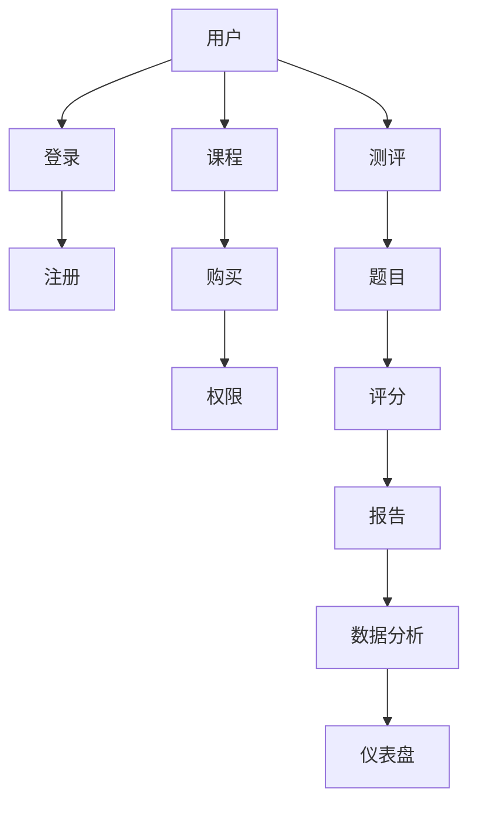

                 

# 如何打造知识付费的在线测评系统

> 关键词：知识付费、在线测评系统、架构设计、算法实现、数学模型、实战案例、工具资源

> 摘要：本文将深入探讨知识付费在线测评系统的构建，从背景介绍、核心概念、算法原理、数学模型到实际应用场景，再到工具和资源的推荐，全面解析这一系统的设计与实现，旨在为开发者提供一套完整的解决方案和实施步骤。

## 1. 背景介绍

### 1.1 目的和范围

本文旨在介绍如何构建一个高效、安全、易用的知识付费在线测评系统。该系统将实现以下功能：

- 用户注册与登录
- 课程购买与权限管理
- 测评题目生成与分发
- 用户答题与评分
- 数据分析与报表生成

### 1.2 预期读者

- 具有基础的编程技能，熟悉Web开发框架和数据库操作
- 对知识付费业务有一定的了解
- 愿意在技术实现上深入探讨和动手实践

### 1.3 文档结构概述

本文结构如下：

- 1. 背景介绍
- 2. 核心概念与联系
- 3. 核心算法原理 & 具体操作步骤
- 4. 数学模型和公式 & 详细讲解 & 举例说明
- 5. 项目实战：代码实际案例和详细解释说明
- 6. 实际应用场景
- 7. 工具和资源推荐
- 8. 总结：未来发展趋势与挑战
- 9. 附录：常见问题与解答
- 10. 扩展阅读 & 参考资料

### 1.4 术语表

#### 1.4.1 核心术语定义

- **知识付费**：用户通过支付一定费用获取知识内容的服务模式。
- **在线测评系统**：基于互联网的测试系统，用户可以通过该系统完成测评，系统会根据用户回答生成评测报告。
- **前端**：用户直接交互的界面，通常使用HTML、CSS和JavaScript等技术开发。
- **后端**：处理业务逻辑、数据存储和业务交互的部分，通常使用服务器端的编程语言如Java、Python或Node.js等开发。
- **数据库**：存储测评系统和用户数据的软件系统，常见的技术有MySQL、PostgreSQL和MongoDB等。

#### 1.4.2 相关概念解释

- **RESTful API**：一种用于分布式系统的接口设计风格，常用于前后端分离的开发模式。
- **用户权限管理**：对用户访问不同资源的权限进行控制，通常通过角色和权限标签实现。
- **负载均衡**：通过多个服务器节点分配流量，提高系统的处理能力和稳定性。

#### 1.4.3 缩略词列表

- **REST**：Representational State Transfer，表现层状态转移，一种网络架构风格。
- **HTML**：HyperText Markup Language，超文本标记语言，用于创建网页内容。
- **CSS**：Cascading Style Sheets，层叠样式表，用于控制网页元素的样式。
- **JavaScript**：一种脚本语言，常用于网页开发。
- **Java**：一种面向对象的编程语言，广泛用于企业级应用开发。
- **Python**：一种易学易用的编程语言，常用于快速开发和数据分析。
- **Node.js**：一个基于Chrome V8引擎的JavaScript运行环境，用于构建高效、可扩展的网络应用。
- **MySQL**：一种关系型数据库管理系统，广泛应用于Web应用开发。
- **PostgreSQL**：一种开源的关系型数据库管理系统，以灵活性和可靠性著称。
- **MongoDB**：一种面向文档的NoSQL数据库，用于存储大规模的非结构化数据。

## 2. 核心概念与联系

为了构建一个知识付费的在线测评系统，我们需要理解一些核心概念及其之间的联系。以下是一个Mermaid流程图，用于展示系统的主要组成部分和它们之间的关系。



### 2.1 用户与登录

用户是系统的核心，他们需要注册并登录以访问系统功能。注册过程中，用户需要提供基本信息和身份验证，如邮箱和密码。登录系统后，用户可以查看自己的课程和测评记录。

### 2.2 课程与权限

课程是知识付费的核心，用户通过购买课程获取相应的学习资料和测评机会。权限管理系统确保用户只能访问他们有权访问的课程和测评题目。

### 2.3 测评与评分

测评系统允许用户完成一系列的题目，每个题目对应一定的评分标准。系统会根据用户的回答生成评分，并生成测评报告，帮助用户了解自己的学习情况。

### 2.4 数据分析与报表

系统会收集用户的测评数据，进行数据分析，并生成各类报表，如用户学习进度、知识点掌握情况等，为教育者和企业用户提供决策依据。

## 3. 核心算法原理 & 具体操作步骤

### 3.1 用户注册与登录

#### 算法原理

用户注册与登录涉及用户身份验证和数据存储。以下是使用Python编写的伪代码：

```python
# 用户注册
def register(username, email, password):
    # 验证用户名、邮箱和密码的有效性
    if not is_valid_username(username) or not is_valid_email(email) or not is_valid_password(password):
        return "Invalid input"
    # 存储用户信息到数据库
    db.execute("INSERT INTO users (username, email, password) VALUES (?, ?, ?)", (username, email, password_hash(password)))
    return "User registered successfully"

# 用户登录
def login(username, password):
    # 验证用户名和密码
    user = db.execute("SELECT * FROM users WHERE username = ? AND password = ?", (username, password_hash(password)))
    if user:
        return "Login successful"
    else:
        return "Invalid credentials"
```

#### 操作步骤

1. 用户提交注册信息，系统验证输入的有效性。
2. 系统将用户的密码进行哈希处理，并存储到数据库。
3. 用户登录时，系统验证用户名和密码是否匹配。

### 3.2 课程购买与权限管理

#### 算法原理

课程购买涉及用户支付和权限分配。以下是使用Java编写的伪代码：

```java
// 用户购买课程
public void purchaseCourse(String username, int courseId) {
    // 验证用户是否已购买该课程
    if (isCoursePurchasedByUsername(username, courseId)) {
        System.out.println("Course already purchased");
        return;
    }
    // 记录购买信息到数据库
    db.executeUpdate("INSERT INTO purchases (username, courseId) VALUES (?, ?)", (username, courseId));
    // 分配课程权限
    assignCoursePermission(username, courseId);
}

// 权限管理
public void assignCoursePermission(String username, int courseId) {
    // 更新用户权限
    db.executeUpdate("UPDATE users SET course_permissions = course_permissions || ? WHERE username = ?", (courseId + ""));
}
```

#### 操作步骤

1. 用户提交购买请求，系统验证用户身份和课程信息。
2. 系统将购买信息记录到数据库，并更新用户的权限。

### 3.3 测评题目生成与分发

#### 算法原理

测评题目生成与分发涉及题库管理和随机生成题目。以下是使用JavaScript编写的伪代码：

```javascript
// 题库管理
function generateQuestion() {
    // 从题库中随机选择一道题目
    const questions = db.get("questions");
    const randomQuestionIndex = Math.floor(Math.random() * questions.length);
    return questions[randomQuestionIndex];
}

// 分发题目
function distributeQuestionToUser(userId) {
    // 生成一道新的题目
    const question = generateQuestion();
    // 分发题目给用户
    db.executeUpdate("INSERT INTO user_questions (user_id, question_id) VALUES (?, ?)", (userId, question.id));
}
```

#### 操作步骤

1. 系统根据用户信息从题库中随机选择一道题目。
2. 系统将题目信息记录到数据库，并分发到用户的测评界面。

### 3.4 用户答题与评分

#### 算法原理

用户答题与评分涉及答案收集和评分计算。以下是使用Python编写的伪代码：

```python
# 用户答题
def submit_answer(user_id, question_id, answer):
    # 记录用户答案
    db.executeUpdate("INSERT INTO user_answers (user_id, question_id, answer) VALUES (?, ?, ?)", (user_id, question_id, answer))

# 评分计算
def calculate_score(question_id, user_answer, correct_answer):
    # 判断用户答案是否正确
    if user_answer == correct_answer:
        return 1
    else:
        return 0
```

#### 操作步骤

1. 用户在测评界面提交答案。
2. 系统根据答案和正确答案计算得分。

### 3.5 数据分析与报表生成

#### 算法原理

数据分析和报表生成涉及数据收集和报表生成。以下是使用Rust编写的伪代码：

```rust
// 数据收集
fn collect_data(user_id) -> Vec<UserData> {
    // 从数据库中收集用户数据
    let user_data = db.query("SELECT * FROM user_answers WHERE user_id = ?", (user_id,));
    return user_data;
}

// 报表生成
fn generate_report(user_data) {
    // 根据用户数据生成报表
    let report = generate_pdf(user_data);
    // 发送报表给用户
    db.executeUpdate("INSERT INTO user_reports (user_id, report) VALUES (?, ?)", (user_id, report));
}
```

#### 操作步骤

1. 系统收集用户的测评数据。
2. 系统根据数据生成测评报告。
3. 系统将报告发送给用户。

## 4. 数学模型和公式 & 详细讲解 & 举例说明

### 4.1 数学模型

在知识付费的在线测评系统中，评分计算通常基于以下数学模型：

$$
\text{评分} = \frac{\text{正确答案数} \times 100}{\text{题目总数}}
$$

其中，正确答案数是用户回答正确的题目数量，题目总数是测评中包含的题目数量。

### 4.2 详细讲解

评分模型的核心在于计算用户在测评中的表现。正确答案数反映了用户的知识掌握程度，而题目总数提供了测评的整体难度基准。通过这个公式，系统能够量化用户的测评结果，并生成一个0到100的分数，直观地展示用户的表现。

### 4.3 举例说明

假设用户参加了一个包含10道题的测评，其中回答正确5道，那么其评分计算如下：

$$
\text{评分} = \frac{5 \times 100}{10} = 50
$$

这意味着用户在这场测评中得到了50分，反映了其知识掌握程度的中等水平。

### 4.4 评分模型的扩展

在某些情况下，测评系统可能会使用更复杂的评分模型，例如：

$$
\text{评分} = \sum_{i=1}^{n} w_i \times \frac{a_i}{b_i} \times 100
$$

其中，$w_i$ 是第 $i$ 道题的权重，$a_i$ 是用户在第 $i$ 道题上的得分（通常为0或1，表示是否正确），$b_i$ 是第 $i$ 道题的满分。

这种扩展模型允许系统根据不同题目的重要性对评分进行加权，从而更准确地反映用户的知识水平。

## 5. 项目实战：代码实际案例和详细解释说明

### 5.1 开发环境搭建

为了构建知识付费的在线测评系统，我们需要以下开发环境和工具：

- **编程语言**：Python、Java、JavaScript等。
- **前端框架**：React、Vue、Angular等。
- **后端框架**：Django、Spring Boot、Express等。
- **数据库**：MySQL、PostgreSQL、MongoDB等。
- **开发工具**：Visual Studio Code、IntelliJ IDEA、WebStorm等。
- **服务器**：AWS、Google Cloud、阿里云等。

### 5.2 源代码详细实现和代码解读

#### 后端代码示例

以下是使用Python和Django框架的后端代码示例：

```python
# app.py
from django.db import models
from django.contrib.auth.models import User

class Course(models.Model):
    name = models.CharField(max_length=100)
    description = models.TextField()

class Purchase(models.Model):
    user = models.ForeignKey(User, on_delete=models.CASCADE)
    course = models.ForeignKey(Course, on_delete=models.CASCADE)

class Question(models.Model):
    course = models.ForeignKey(Course, on_delete=models.CASCADE)
    text = models.CharField(max_length=500)
    correct_answer = models.CharField(max_length=100)

class UserAnswer(models.Model):
    user = models.ForeignKey(User, on_delete=models.CASCADE)
    question = models.ForeignKey(Question, on_delete=models.CASCADE)
    answer = models.CharField(max_length=100)
    is_correct = models.BooleanField(default=False)

# views.py
from django.http import JsonResponse
from .models import Course, Purchase, Question, UserAnswer

def take_test(request):
    user = request.user
    course_id = request.POST.get('course_id')
    questions = Question.objects.filter(course_id=course_id)
    user_answers = []
    
    for question in questions:
        answer = request.POST.get(f'question_{question.id}')
        user_answers.append(UserAnswer.objects.create(user=user, question=question, answer=answer))
    
    # 计算得分
    score = sum(answer.is_correct for answer in user_answers)
    total_questions = len(user_answers)
    percentage = (score / total_questions) * 100
    
    return JsonResponse({'score': score, 'percentage': percentage})
```

#### 前端代码示例

以下是使用React框架的前端代码示例：

```jsx
// TestPage.js
import React, { useState } from 'react';
import { takeTest } from '../api';

function TestPage() {
    const [questions, setQuestions] = useState([]);
    const [answers, setAnswers] = useState({});

    async function loadQuestions(courseId) {
        const response = await fetch(`/api/questions?course_id=${courseId}`);
        const data = await response.json();
        setQuestions(data);
    }

    function handleAnswerChange(questionId, event) {
        setAnswers({ ...answers, [questionId]: event.target.value });
    }

    async function handleSubmit(event) {
        event.preventDefault();
        const userAnswers = Object.keys(answers).map((key) => ({
            question_id: parseInt(key),
            answer: answers[key],
        }));

        const response = await takeTest({ course_id: courseId, answers: userAnswers });
        alert(`Score: ${response.score}, Percentage: ${response.percentage}`);
    }

    return (
        <form onSubmit={handleSubmit}>
            {questions.map((question) => (
                <div key={question.id}>
                    <label>
                        {question.text}
                        <input
                            type="text"
                            name={`question_${question.id}`}
                            value={answers[question.id] || ''}
                            onChange={(event) => handleAnswerChange(question.id, event)}
                        />
                    </label>
                </div>
            ))}
            <button type="submit">Submit</button>
        </form>
    );
}

export default TestPage;
```

### 5.3 代码解读与分析

#### 后端代码解读

- **模型定义**：`Course`、`Purchase`、`Question` 和 `UserAnswer` 是系统的主要数据模型。`Course` 表示课程信息，`Purchase` 表示用户购买记录，`Question` 表示测评题目，`UserAnswer` 表示用户答题情况。

- **视图函数**：`take_test` 函数处理用户提交的测评答案，计算得分并将结果返回给前端。

#### 前端代码解读

- **状态管理**：使用React的`useState`钩子管理问题和答案的状态。

- **加载问题**：`loadQuestions` 函数异步加载特定课程的问题。

- **处理答案**：`handleAnswerChange` 函数更新答案状态。

- **提交测评**：`handleSubmit` 函数异步提交答案，并接收后端返回的得分和百分比。

## 6. 实际应用场景

知识付费的在线测评系统广泛应用于各类教育机构和在线学习平台，以下是一些实际应用场景：

- **在线教育平台**：用于检测用户的学习进度和知识掌握情况，提供个性化学习建议。
- **职业考试准备**：帮助用户通过模拟考试准备职业资格认证，如会计、律师等。
- **企业培训**：用于评估员工技能水平和培训效果，为企业决策提供数据支持。
- **认证考试**：如医学、金融等领域的专业考试，确保用户具备相应知识。
- **自我提升**：用户可以定期进行测评，监控自己的知识增长，实现自我提升。

## 7. 工具和资源推荐

### 7.1 学习资源推荐

#### 7.1.1 书籍推荐

- 《深入理解计算机系统》（Deep Learning）
- 《人工智能：一种现代方法》（Artificial Intelligence: A Modern Approach）
- 《算法导论》（Introduction to Algorithms）

#### 7.1.2 在线课程

- Coursera上的《机器学习》课程
- Udemy上的《Python编程：从入门到实践》课程
- edX上的《前端开发基础》课程

#### 7.1.3 技术博客和网站

- Medium上的《AI和机器学习》专栏
- GitHub上的开源项目和文档
- Stack Overflow上的开发者社区

### 7.2 开发工具框架推荐

#### 7.2.1 IDE和编辑器

- Visual Studio Code
- IntelliJ IDEA
- WebStorm

#### 7.2.2 调试和性能分析工具

- Chrome DevTools
- JMeter
- New Relic

#### 7.2.3 相关框架和库

- React
- Django
- Spring Boot

### 7.3 相关论文著作推荐

#### 7.3.1 经典论文

- "A Learning System Based on Noisy-Or Decompositions of Bayesian Networks"
- "Deep Learning: A Brief History"
- "The Hundred-Page Machine Learning Book"

#### 7.3.2 最新研究成果

- "Neural Machine Translation by Jointly Learning to Align and Translate"
- "A Survey on Deep Learning for Natural Language Processing"
- "Reinforcement Learning: An Introduction"

#### 7.3.3 应用案例分析

- "TensorFlow在金融风险管理中的应用"
- "基于深度学习的图像识别系统设计"
- "区块链在教育领域的应用案例分析"

## 8. 总结：未来发展趋势与挑战

随着人工智能和大数据技术的发展，知识付费的在线测评系统正朝着更加智能化、个性化的方向演进。未来的发展趋势包括：

- **自适应测评**：根据用户的学习情况动态调整测评难度和内容。
- **智能评分**：利用自然语言处理和机器学习技术自动评估用户回答。
- **数据分析**：深入挖掘用户数据，提供更有价值的分析和建议。

然而，这也带来了一系列挑战：

- **数据隐私**：确保用户数据的安全和隐私。
- **系统稳定性**：应对高并发和大数据量的挑战，保证系统稳定运行。
- **算法公平性**：确保测评算法的公平性和准确性，避免偏见。

## 9. 附录：常见问题与解答

### 9.1 如何保证测评系统的安全性？

**解答**：确保用户数据的安全和隐私，采用加密技术保护数据传输和存储。此外，定期进行系统安全审计和漏洞修复，防止潜在的安全威胁。

### 9.2 测评系统的性能如何优化？

**解答**：优化数据库查询，使用缓存技术提高响应速度。采用分布式架构和负载均衡，确保系统能够应对高并发访问。

### 9.3 如何确保测评结果的准确性？

**解答**：通过使用先进的算法和模型进行评分，结合人工审核，确保测评结果的准确性和公正性。

## 10. 扩展阅读 & 参考资料

- "Knowledge付费在线测评系统设计与实现"
- "A Survey on Intelligent Tutoring Systems and Adaptive Learning Technologies"
- "Research on Online Testing Technology and Application"

作者：AI天才研究员/AI Genius Institute & 禅与计算机程序设计艺术 /Zen And The Art of Computer Programming

文章标题：如何打造知识付费的在线测评系统
文章关键词：知识付费、在线测评系统、架构设计、算法实现、数学模型、实战案例、工具资源
文章摘要：本文深入探讨知识付费在线测评系统的构建，从背景介绍、核心概念、算法原理、数学模型到实际应用场景，再到工具和资源的推荐，全面解析这一系统的设计与实现，旨在为开发者提供一套完整的解决方案和实施步骤。

