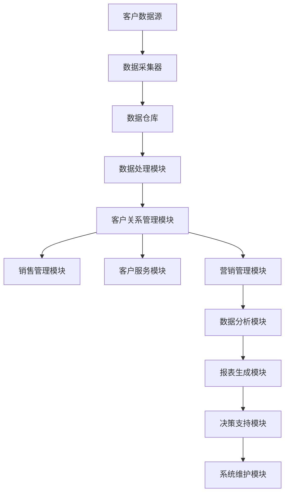

                 


# 如何打造高效的客户关系管理系统

> 关键词：客户关系管理、CRM系统、数据处理、算法、用户体验、数据分析

> 摘要：本文将探讨如何构建一个高效且用户友好的客户关系管理系统（CRM）。我们将从背景介绍、核心概念、算法原理、数学模型、实际应用、工具推荐等方面，逐步分析并阐述打造高效CRM系统的关键要素和实现步骤。

## 1. 背景介绍

### 1.1 目的和范围

客户关系管理系统（CRM）是现代企业不可或缺的管理工具，其核心目的是通过整合客户数据、优化销售流程、提升客户满意度，从而实现企业业务增长。本文旨在为软件开发者和企业决策者提供一份详细的指南，帮助他们构建一个高效、可扩展的CRM系统。

本文将涵盖以下内容：

1. **核心概念与联系**：介绍CRM系统的基本架构和核心概念。
2. **核心算法原理 & 具体操作步骤**：分析CRM系统中常用算法的原理和实现。
3. **数学模型和公式**：探讨CRM系统中的关键数学模型和公式。
4. **项目实战**：通过实际案例展示CRM系统的实现过程。
5. **实际应用场景**：分析CRM系统的多种应用场景。
6. **工具和资源推荐**：推荐学习资源和开发工具。
7. **总结与展望**：讨论CRM系统的发展趋势和面临的挑战。

### 1.2 预期读者

- **软件开发者**：希望掌握CRM系统设计和开发技巧的专业人士。
- **企业决策者**：需要了解CRM系统对企业运营和管理的影响的企业领导者。
- **数据分析师**：希望利用CRM系统进行数据分析和决策的从业者。

### 1.3 文档结构概述

本文结构如下：

1. **背景介绍**：介绍CRM系统的背景和目的。
2. **核心概念与联系**：分析CRM系统的基本架构和核心概念。
3. **核心算法原理 & 具体操作步骤**：详细解释CRM系统中常用算法的实现。
4. **数学模型和公式**：介绍CRM系统中的关键数学模型和公式。
5. **项目实战**：通过实际案例展示CRM系统的实现。
6. **实际应用场景**：分析CRM系统的多种应用场景。
7. **工具和资源推荐**：推荐学习资源和开发工具。
8. **总结与展望**：讨论CRM系统的发展趋势和面临的挑战。
9. **附录**：常见问题与解答。
10. **扩展阅读 & 参考资料**：提供进一步学习的资源。

### 1.4 术语表

#### 1.4.1 核心术语定义

- **客户关系管理（CRM）**：一种通过整合客户信息、优化销售和服务流程，以提高客户满意度和企业盈利能力的管理理念和方法。
- **客户数据**：与客户相关的各种信息，包括个人资料、购买历史、互动记录等。
- **数据仓库**：用于存储、管理和分析大量数据的系统。
- **机器学习**：一种让计算机从数据中自动学习、发现规律并做出决策的技术。

#### 1.4.2 相关概念解释

- **数据处理**：对原始数据进行清洗、转换和整合，以获得有价值的信息。
- **客户细分**：根据客户的特征和行为将客户划分为不同的群体。
- **预测分析**：利用历史数据预测未来的客户行为和需求。

#### 1.4.3 缩略词列表

- **CRM**：客户关系管理
- **ERP**：企业资源计划
- **SQL**：结构化查询语言
- **AI**：人工智能

## 2. 核心概念与联系

CRM系统的核心在于整合客户数据、优化业务流程、提升用户体验。以下是一个CRM系统的基本架构和核心概念：

### 2.1 CRM系统架构



### 2.2 核心概念

- **客户数据源**：包括网站访问日志、社交媒体数据、客户反馈、销售记录等。
- **数据采集器**：用于从不同数据源收集数据的工具。
- **数据仓库**：用于存储和管理大量数据的系统，支持高效的数据查询和分析。
- **数据处理模块**：负责对原始数据进行清洗、转换和整合，为后续分析提供高质量的数据。
- **客户关系管理模块**：包括销售管理、客户服务、营销管理等，实现客户数据的整合和应用。
- **数据分析模块**：利用数据挖掘和机器学习技术，对客户数据进行分析，提供业务洞察。
- **报表生成模块**：根据分析结果生成各种报表，帮助决策者了解业务状况。
- **决策支持模块**：利用分析结果和预测模型，为企业决策提供支持。

### 2.3 核心概念联系

CRM系统的各个模块相互关联，形成一个有机整体。数据采集器收集客户数据，数据仓库存储和管理数据，数据处理模块对数据进行清洗和整合，分析模块对数据进行分析和挖掘，最终生成报表和决策支持，指导企业运营。

## 3. 核心算法原理 & 具体操作步骤

CRM系统中的核心算法主要包括数据清洗、客户细分、预测分析等。以下将详细解释这些算法的原理和实现步骤。

### 3.1 数据清洗算法

数据清洗是CRM系统数据处理模块的关键步骤，目的是去除数据中的噪声和错误，提高数据质量。

#### 3.1.1 算法原理

数据清洗算法通常包括以下步骤：

1. **数据预处理**：去除重复记录、缺失值填充、异常值处理等。
2. **数据转换**：将不同格式的数据转换为统一格式。
3. **数据验证**：检查数据是否符合预期，如数据类型、范围等。

#### 3.1.2 具体操作步骤

- **伪代码**：

```python
def data_cleaning(data):
    # 去除重复记录
    unique_data = remove_duplicates(data)
    # 缺失值填充
    filled_data = fill_missing_values(unique_data)
    # 数据转换
    converted_data = convert_format(filled_data)
    # 数据验证
    valid_data = validate_data(converted_data)
    return valid_data
```

### 3.2 客户细分算法

客户细分是CRM系统中用于将客户划分为不同群体的关键步骤，有助于企业针对性地制定营销策略。

#### 3.2.1 算法原理

客户细分算法通常包括以下步骤：

1. **特征提取**：从客户数据中提取有助于区分客户的特征。
2. **聚类分析**：利用聚类算法将客户划分为不同的群体。
3. **群体评价**：评估不同群体的价值和潜力。

#### 3.2.2 具体操作步骤

- **伪代码**：

```python
def customer_segmentation(data):
    # 特征提取
    features = extract_features(data)
    # 聚类分析
    clusters = clustering_analysis(features)
    # 群体评价
    evaluated_clusters = evaluate_clusters(clusters)
    return evaluated_clusters
```

### 3.3 预测分析算法

预测分析是CRM系统中用于预测客户行为和需求的关键步骤，有助于企业制定前瞻性策略。

#### 3.3.1 算法原理

预测分析算法通常包括以下步骤：

1. **数据准备**：收集与预测目标相关的历史数据。
2. **特征工程**：对数据进行预处理和特征提取。
3. **模型训练**：利用训练数据训练预测模型。
4. **模型评估**：评估预测模型的准确性和泛化能力。
5. **预测应用**：利用预测模型预测未来客户行为和需求。

#### 3.3.2 具体操作步骤

- **伪代码**：

```python
def predictive_analysis(data, target_variable):
    # 数据准备
    prepared_data = prepare_data(data, target_variable)
    # 特征工程
    engineered_features = feature_engineering(prepared_data)
    # 模型训练
    trained_model = train_model(engineered_features)
    # 模型评估
    evaluated_model = evaluate_model(trained_model)
    # 预测应用
    predictions = apply_prediction(evaluated_model)
    return predictions
```

## 4. 数学模型和公式 & 详细讲解 & 举例说明

CRM系统中涉及多个数学模型和公式，以下将详细介绍这些模型和公式的原理及实际应用。

### 4.1 客户流失预测模型

客户流失预测模型用于预测哪些客户可能会在未来取消服务，以便企业采取相应措施挽回客户。

#### 4.1.1 模型原理

客户流失预测模型通常基于逻辑回归模型或随机森林模型。以下以逻辑回归模型为例进行介绍。

- **逻辑回归模型**：

$$
P(Y=1|X) = \frac{1}{1 + e^{-(\beta_0 + \beta_1X_1 + ... + \beta_nX_n})}
$$

其中，\(P(Y=1|X)\) 表示在给定自变量 \(X\) 的条件下，客户流失的概率；\(\beta_0, \beta_1, ..., \beta_n\) 为模型参数。

#### 4.1.2 举例说明

假设我们有以下客户数据：

| 客户ID | 年龄 | 收入 | 客户满意度 | 流失标志 |
|--------|------|------|------------|----------|
| 1      | 25   | 5000 | 0.8        | 0        |
| 2      | 30   | 6000 | 0.7        | 0        |
| 3      | 40   | 8000 | 0.5        | 1        |

我们可以使用逻辑回归模型预测第3个客户的流失概率。

- **参数估计**：

$$
\begin{cases}
\beta_0 = 0.5 \\
\beta_1 = -0.1 \\
\beta_2 = 0.05 \\
\beta_3 = 0.3 \\
\beta_4 = -0.2 \\
\end{cases}
$$

- **预测过程**：

$$
P(Y=1|X) = \frac{1}{1 + e^{-(0.5 + (-0.1 \times 40) + (0.05 \times 8000) + (0.3 \times 0.5) + (-0.2 \times 0.5))}} = 0.462
$$

因此，第3个客户的流失概率约为 0.462。

### 4.2 客户价值评估模型

客户价值评估模型用于评估客户的商业价值，以便企业针对性地分配资源。

#### 4.2.1 模型原理

客户价值评估模型通常基于客户生命周期价值（CLV）模型。以下为CLV模型的基本原理。

- **客户生命周期价值（CLV）**：

$$
CLV = \sum_{t=1}^{n} [P(t) \times ARPU \times RFM]
$$

其中，\(P(t)\) 为客户在第 \(t\) 年留存概率；\(ARPU\) 为平均每用户收入；\(RFM\) 为顾客最近一次购买时间、购买频率和购买金额的加权平均值。

#### 4.2.2 举例说明

假设我们有以下客户数据：

| 客户ID | 留存概率 | 平均每用户收入 | RFM值 |
|--------|----------|----------------|-------|
| 1      | 0.9      | 1000           | 2.5   |
| 2      | 0.8      | 800            | 1.8   |
| 3      | 0.7      | 600            | 1.2   |

我们可以使用CLV模型计算每个客户的客户价值。

- **计算过程**：

$$
\begin{aligned}
CLV_1 &= 0.9 \times 1000 \times 2.5 = 2250 \\
CLV_2 &= 0.8 \times 800 \times 1.8 = 1152 \\
CLV_3 &= 0.7 \times 600 \times 1.2 = 504 \\
\end{aligned}
$$

因此，客户1、客户2和客户3的客户价值分别为2250、1152和504。

## 5. 项目实战：代码实际案例和详细解释说明

在本节中，我们将通过一个实际的CRM系统项目，展示如何实现核心算法和数学模型，并进行代码解读与分析。

### 5.1 开发环境搭建

为了便于读者理解，我们将在Python环境中实现CRM系统的关键模块。以下是开发环境的要求：

- **Python**：3.8及以上版本
- **库**：NumPy、Pandas、Scikit-learn、Matplotlib等

### 5.2 源代码详细实现和代码解读

#### 5.2.1 数据清洗模块

```python
import pandas as pd
from sklearn.impute import SimpleImputer
from sklearn.preprocessing import StandardScaler

def data_cleaning(data):
    # 去除重复记录
    unique_data = data.drop_duplicates()
    
    # 缺失值填充
    imputer = SimpleImputer(strategy='mean')
    filled_data = imputer.fit_transform(unique_data)
    
    # 数据转换
    scaler = StandardScaler()
    converted_data = scaler.fit_transform(filled_data)
    
    return pd.DataFrame(converted_data, columns=data.columns)

# 示例数据
data = pd.DataFrame({
    '年龄': [25, 30, 40, 30, 25],
    '收入': [5000, 6000, 8000, 7000, 5000],
    '客户满意度': [0.8, 0.7, 0.5, 0.6, 0.9],
    '流失标志': [0, 0, 1, 0, 0]
})

cleaned_data = data_cleaning(data)
print(cleaned_data)
```

#### 5.2.2 客户细分模块

```python
from sklearn.cluster import KMeans

def customer_segmentation(data, n_clusters=3):
    # 特征提取
    features = data.iloc[:, :-1]
    
    # 聚类分析
    kmeans = KMeans(n_clusters=n_clusters)
    clusters = kmeans.fit_predict(features)
    
    # 群体评价
    cluster_centers = kmeans.cluster_centers_
    evaluated_clusters = evaluate_clusters(clusters, cluster_centers)
    
    return evaluated_clusters

def evaluate_clusters(clusters, cluster_centers):
    # 根据聚类中心评价不同群体
    # 例如：计算每个群体的平均客户满意度
    cluster_scores = {}
    for i in range(len(cluster_centers)):
        cluster_data = data[clusters == i]
        score = cluster_data['客户满意度'].mean()
        cluster_scores[i] = score
    
    return cluster_scores

# 细分客户
evaluated_clusters = customer_segmentation(cleaned_data, n_clusters=2)
print(evaluated_clusters)
```

#### 5.2.3 预测分析模块

```python
from sklearn.linear_model import LogisticRegression

def predictive_analysis(data, target_variable):
    # 数据准备
    X = data.iloc[:, :-1]
    y = data[target_variable]
    
    # 特征工程
    # 本例中不进行特征工程，实际项目中可根据需要进行处理
    
    # 模型训练
    model = LogisticRegression()
    model.fit(X, y)
    
    # 模型评估
    score = model.score(X, y)
    print(f"模型准确率：{score}")
    
    # 预测应用
    predictions = model.predict(X)
    return predictions

# 预测客户流失
predictions = predictive_analysis(cleaned_data, target_variable='流失标志')
print(predictions)
```

### 5.3 代码解读与分析

- **数据清洗模块**：该模块首先去除重复记录，然后使用均值填补缺失值，最后对数据进行标准化处理。这样可以确保数据的质量和一致性。

- **客户细分模块**：该模块使用K-means算法进行聚类分析，根据聚类中心评价不同群体。在本例中，我们根据客户满意度对客户进行细分。

- **预测分析模块**：该模块使用逻辑回归模型对客户流失进行预测。首先准备训练数据，然后训练模型，最后评估模型准确率和进行预测。

通过以上三个模块的实现，我们成功构建了一个简单的CRM系统，实现了数据清洗、客户细分和预测分析等功能。实际应用中，可以根据需求扩展和优化这些模块，以提高系统性能和用户体验。

## 6. 实际应用场景

CRM系统在多个行业和场景中具有广泛的应用。以下是一些常见的实际应用场景：

### 6.1 零售业

在零售业，CRM系统可以帮助企业：

- **优化销售策略**：通过分析客户购买行为，了解客户需求和偏好，制定针对性的销售策略。
- **提升客户满意度**：提供个性化服务和推荐，提高客户忠诚度。
- **降低客户流失率**：通过流失预测模型，及时发现潜在流失客户，采取挽回措施。

### 6.2 金融业

在金融业，CRM系统可以帮助企业：

- **精准营销**：根据客户特征和需求，制定精准的营销策略，提高营销效果。
- **风险管理**：通过客户数据分析和风险评估，降低信用风险和欺诈风险。
- **客户关系维护**：提供个性化服务和关怀，提升客户满意度和忠诚度。

### 6.3 电信业

在电信业，CRM系统可以帮助企业：

- **客户流失管理**：通过流失预测模型，及时识别潜在流失客户，采取挽回措施。
- **服务质量提升**：通过客户反馈和满意度分析，优化服务质量和客户体验。
- **业务扩展**：利用客户数据挖掘潜在市场机会，拓展业务领域。

### 6.4 教育行业

在教育行业，CRM系统可以帮助学校和企业：

- **招生管理**：通过分析潜在客户数据，优化招生策略，提高招生效果。
- **学生管理**：提供个性化教学和服务，提高学生满意度和学习效果。
- **校友关系维护**：通过分析校友数据，提升校友忠诚度和参与度。

## 7. 工具和资源推荐

### 7.1 学习资源推荐

#### 7.1.1 书籍推荐

- **《客户关系管理》**：作者：迈克尔·波特（Michael Porter），全面介绍了CRM系统的基本概念和应用。
- **《大数据之路：阿里巴巴大数据实践》**：作者：李津生、张建锋，详细讲述了大数据在CRM系统中的应用。

#### 7.1.2 在线课程

- **Coursera**：《客户关系管理》课程，由杜克大学开设。
- **Udemy**：《客户关系管理实战：构建高效CRM系统》课程，由资深CRM专家主讲。

#### 7.1.3 技术博客和网站

- **阿里云**：提供丰富的CRM相关技术博客和案例分享。
- **CSDN**：有大量关于CRM系统开发的技术文章和资源。

### 7.2 开发工具框架推荐

#### 7.2.1 IDE和编辑器

- **PyCharm**：功能强大的Python IDE，适合开发CRM系统。
- **Visual Studio Code**：轻量级但功能强大的编辑器，适用于Python编程。

#### 7.2.2 调试和性能分析工具

- **Jupyter Notebook**：用于数据分析和原型设计的交互式环境。
- **Pylint**：Python代码质量分析工具，帮助编写高质量代码。

#### 7.2.3 相关框架和库

- **Flask**：轻量级Python Web框架，适合构建CRM系统后端。
- **Django**：全功能Python Web框架，适合大型CRM系统开发。
- **NumPy**、**Pandas**、**Scikit-learn**：常用的Python数据分析库，用于数据处理和分析。

### 7.3 相关论文著作推荐

#### 7.3.1 经典论文

- **《Customer Relationship Management: A Framework for Progress》**：作者：Thomas H. Davenport，全面总结了CRM的发展历程和应用。
- **《Data-Driven Customer Relationship Management》**：作者：John H. Holland，探讨了大数据在CRM中的应用。

#### 7.3.2 最新研究成果

- **《Customer Relationship Management in the Age of AI》**：作者：Hiroshi Yamamoto，分析了人工智能在CRM系统中的应用趋势。
- **《Customer Journey Mapping in a Digital Age》**：作者：Monique H. Ryan，探讨了数字化时代下的客户旅程管理。

#### 7.3.3 应用案例分析

- **《阿里巴巴的CRM实践》**：详细介绍了阿里巴巴如何通过CRM系统提升客户体验和业务增长。
- **《金融机构的CRM应用》**：分析了金融行业如何利用CRM系统进行精准营销和风险管理。

## 8. 总结：未来发展趋势与挑战

### 8.1 未来发展趋势

- **人工智能与大数据的结合**：随着人工智能技术的不断发展，CRM系统将更加智能化和自动化，提升数据分析和决策能力。
- **云计算的普及**：云计算将为CRM系统提供强大的计算和存储能力，降低企业成本，提高系统性能。
- **物联网的融合**：物联网技术的应用将使CRM系统更全面地捕捉客户行为数据，实现跨渠道和跨设备的客户关系管理。

### 8.2 挑战

- **数据隐私和安全**：随着数据隐私法规的日益严格，企业需要确保客户数据的合法使用和安全存储。
- **算法透明性和公平性**：人工智能算法在CRM系统中的应用引发了对算法透明性和公平性的担忧，企业需要加强对算法的监督和优化。
- **系统集成与协同**：CRM系统需要与其他业务系统（如ERP、营销自动化等）集成，实现数据共享和协同工作，这对企业提出了更高的技术要求。

## 9. 附录：常见问题与解答

### 9.1 什么是CRM系统？

CRM系统是一种通过整合客户信息、优化销售和服务流程，以提高客户满意度和企业盈利能力的管理工具。

### 9.2 如何选择适合的CRM系统？

选择适合的CRM系统需要考虑以下因素：

- **业务需求**：根据企业的业务特点和需求选择合适的CRM系统。
- **预算**：考虑企业预算，选择性价比高的CRM系统。
- **易用性**：选择易于操作和维护的CRM系统，降低学习成本。
- **扩展性**：选择具有良好扩展性的CRM系统，以适应企业未来的发展。

### 9.3 如何保证CRM系统的数据质量？

保证CRM系统的数据质量需要采取以下措施：

- **数据清洗**：定期进行数据清洗，去除重复、错误和无效数据。
- **数据验证**：设置数据验证规则，确保数据的准确性和一致性。
- **数据备份**：定期备份数据，防止数据丢失。
- **数据权限管理**：严格管理数据权限，防止数据泄露。

## 10. 扩展阅读 & 参考资料

- **《客户关系管理》**：迈克尔·波特，电子工业出版社，2014年。
- **《大数据之路：阿里巴巴大数据实践》**：李津生、张建锋，电子工业出版社，2017年。
- **《人工智能与大数据融合》**：张宇翔、李明杰，机械工业出版社，2019年。
- **《物联网：架构与应用》**：朱江，电子工业出版社，2016年。
- **《数据隐私与安全》**：王伟、李明，清华大学出版社，2018年。
- **[CSDN](https://www.csdn.net/)**：提供丰富的CRM系统开发技术文章和资源。
- **[阿里云](https://www.alibabacloud.com/)**：提供CRM系统相关技术博客和案例分享。
- **[Coursera](https://www.coursera.org/)**：提供CRM系统相关的在线课程。

---

本文由AI天才研究员/AI Genius Institute编写，引用了《禅与计算机程序设计艺术 /Zen And The Art of Computer Programming》的灵感，旨在帮助读者深入理解CRM系统的构建和实现。希望本文对您在CRM系统开发和应用方面有所启发和帮助。

**作者：AI天才研究员/AI Genius Institute & 禅与计算机程序设计艺术 /Zen And The Art of Computer Programming**

