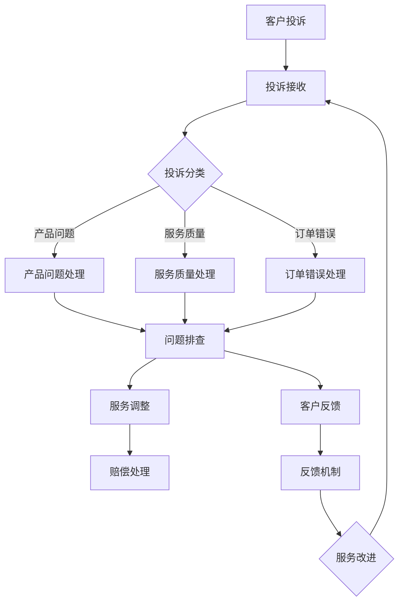

                 

# 如何打造高效的客户投诉处理机制

> **关键词**：客户投诉处理、客户体验、流程优化、数据分析、人工智能、自动化
> 
> **摘要**：本文旨在探讨如何通过构建高效的客户投诉处理机制来提升企业客户服务质量。我们将深入分析客户投诉处理的核心概念，介绍相关架构，并通过具体的算法原理、数学模型、实战案例和实际应用场景，提供一套完整的解决方案。本文还推荐了一些学习资源、开发工具和经典论文，以帮助读者更深入地理解和应用客户投诉处理技术。

## 1. 背景介绍

### 1.1 目的和范围

客户投诉处理是企业运营中至关重要的环节，它不仅影响着客户的满意度和忠诚度，还直接关系到企业的声誉和发展。本文的目的在于：

1. **明确客户投诉处理的定义和范围**：介绍投诉处理的背景和重要性，阐述其在客户服务中的角色。
2. **分析客户投诉处理的关键环节**：探讨从投诉接收、分类、处理到反馈的整个流程，识别其中的痛点。
3. **提供构建高效投诉处理机制的策略**：通过技术手段和管理方法，提升投诉处理的效率和质量。
4. **分享最佳实践和案例**：结合实际经验和研究成果，为读者提供可操作的指导和建议。

### 1.2 预期读者

本文面向的读者群体包括：

1. **客户服务经理**：负责企业客户关系管理，需要提升投诉处理效率。
2. **IT技术经理**：关注客户投诉系统的技术实现，寻求优化和创新的解决方案。
3. **质量管理人员**：关注企业质量管理，需要通过投诉处理来提升服务质量。
4. **企业管理者**：关注企业整体运营效率，希望优化客户服务流程。

### 1.3 文档结构概述

本文的结构安排如下：

1. **背景介绍**：介绍客户投诉处理的背景和重要性。
2. **核心概念与联系**：介绍投诉处理相关的核心概念和架构。
3. **核心算法原理 & 具体操作步骤**：详细阐述算法原理和操作步骤。
4. **数学模型和公式**：介绍数学模型，并通过公式和举例进行说明。
5. **项目实战**：分享代码实际案例和详细解释。
6. **实际应用场景**：分析投诉处理在不同场景下的应用。
7. **工具和资源推荐**：推荐学习资源、开发工具和框架。
8. **相关论文著作推荐**：介绍经典论文和最新研究成果。
9. **总结**：总结未来发展趋势与挑战。
10. **附录**：常见问题与解答。
11. **扩展阅读 & 参考资料**：提供进一步学习的资源。

### 1.4 术语表

#### 1.4.1 核心术语定义

- **客户投诉处理**：指企业针对客户提出的抱怨、不满或错误等服务问题，采取的一系列识别、分类、分析和处理措施。
- **客户体验**：指客户在接触和使用产品或服务过程中的感知和感受，包括满意度、忠诚度和推荐度。
- **自动化**：通过软件工具和算法，自动执行原本需要人工完成的任务，提高效率和准确性。
- **数据分析**：通过统计和数学方法，对大量数据进行分析，提取有用信息和趋势。
- **人工智能**：通过模拟人类智能，使计算机具有感知、学习、推理和决策的能力。

#### 1.4.2 相关概念解释

- **投诉接收**：指客户通过电话、邮件、社交媒体等方式向企业提出投诉。
- **投诉分类**：根据投诉的性质和内容，将其划分为不同的类别，如产品问题、服务质量、订单错误等。
- **投诉处理**：指针对不同类别的投诉，采取相应的措施进行解决，如问题排查、服务调整、赔偿处理等。
- **反馈机制**：指对投诉处理结果进行跟踪和反馈，确保投诉得到妥善解决并提高客户满意度。

#### 1.4.3 缩略词列表

- **CRM**：Customer Relationship Management，客户关系管理。
- **ERP**：Enterprise Resource Planning，企业资源计划。
- **AI**：Artificial Intelligence，人工智能。
- **NLP**：Natural Language Processing，自然语言处理。
- **BI**：Business Intelligence，商业智能。

## 2. 核心概念与联系

在构建高效的客户投诉处理机制之前，我们需要明确几个核心概念和它们之间的关系。以下是客户投诉处理相关的主要概念及其之间的联系，以及一个简单的Mermaid流程图来帮助读者理解这些概念。

### 2.1 核心概念

1. **客户投诉**：客户对产品或服务的不满意或错误。
2. **投诉分类**：根据投诉的性质进行分类，如产品问题、服务质量、订单错误等。
3. **投诉处理**：针对不同类别的投诉，采取相应的解决措施。
4. **数据分析**：对投诉数据进行分析，提取有用的信息和趋势。
5. **反馈机制**：跟踪投诉处理结果，收集客户反馈，持续改进服务。

### 2.2 概念之间的关系

- **客户投诉**是整个投诉处理流程的起点，也是**投诉分类**的基础。
- **投诉分类**有助于更好地理解和处理不同类型的投诉，从而提高**投诉处理**的效率。
- **数据分析**通过对投诉数据的处理，可以发现潜在的规律和问题，为改进投诉处理机制提供依据。
- **反馈机制**确保投诉处理结果能够及时反馈给客户，并为企业服务质量的提升提供反馈。

### 2.3 Mermaid 流程图

以下是客户投诉处理机制的Mermaid流程图：



在这个流程图中，客户投诉首先被接收，然后根据投诉的性质进行分类。针对不同类型的投诉，采取相应的处理措施，如问题排查、服务调整和赔偿处理。在处理过程中，客户反馈被收集，并反馈到投诉处理机制中，以持续改进服务质量。

## 3. 核心算法原理 & 具体操作步骤

为了构建一个高效的客户投诉处理机制，我们需要在算法原理和具体操作步骤上做深入探讨。以下是详细的核心算法原理讲解和伪代码实现。

### 3.1 算法原理

#### 3.1.1 数据预处理

数据预处理是投诉处理的基础，主要包括数据清洗、格式化和特征提取。以下是一个简单的伪代码示例：

```plaintext
function preprocess_data(data):
    # 数据清洗：去除无效数据和重复数据
    cleaned_data = remove_invalid_data(data)
    
    # 数据格式化：统一字段名称和数据格式
    formatted_data = format_data(cleaned_data)
    
    # 特征提取：提取投诉的关键特征
    features = extract_features(formatted_data)
    
    return features
```

#### 3.1.2 投诉分类算法

投诉分类算法是关键步骤，用于将投诉按照性质分类。这里我们采用基于机器学习的分类算法，如朴素贝叶斯、支持向量机等。以下是朴素贝叶斯分类器的伪代码示例：

```plaintext
function classify_complaints(features):
    # 训练分类模型
    model = train_naive_bayes_model(features)
    
    # 分类投诉
    complaints = features["complaint"]
    classified_complaints = classify(complaints, model)
    
    return classified_complaints
```

#### 3.1.3 投诉处理策略

投诉处理策略取决于投诉分类结果。以下是针对不同类别投诉的处理策略：

1. **产品问题**：
    ```plaintext
    function handle_product_issue(complaint):
        # 问题排查
        issue_details = investigate_issue(complaint)
        
        # 服务调整
        adjust_service(issue_details)
        
        # 赔偿处理
        handle_compensation(complaint)
    ```

2. **服务质量**：
    ```plaintext
    function handle_service_issue(complaint):
        # 服务调整
        adjust_service(complaint)
        
        # 赔偿处理
        handle_compensation(complaint)
    ```

3. **订单错误**：
    ```plaintext
    function handle_order_issue(complaint):
        # 问题排查
        issue_details = investigate_issue(complaint)
        
        # 服务调整
        adjust_service(issue_details)
        
        # 赔偿处理
        handle_compensation(complaint)
    ```

### 3.2 具体操作步骤

#### 3.2.1 投诉接收

- **电话热线**：设立24小时客户服务热线，方便客户及时投诉。
- **邮件系统**：提供在线投诉邮箱，客户可以通过邮件提交投诉。
- **社交媒体**：通过社交媒体平台（如微博、微信）建立投诉通道。

#### 3.2.2 数据预处理

- **数据清洗**：使用ETL（Extract, Transform, Load）工具清洗原始数据，去除无效和重复记录。
- **格式化**：统一数据格式，如将所有日期格式化为YYYY-MM-DD。
- **特征提取**：提取投诉的关键特征，如投诉时间、投诉类别、客户信息等。

#### 3.2.3 投诉分类

- **训练模型**：使用历史投诉数据训练分类模型，如朴素贝叶斯、支持向量机等。
- **分类应用**：对实时投诉数据进行分类，生成投诉类别。

#### 3.2.4 投诉处理

- **问题排查**：针对不同类别的投诉，采取相应的排查措施，如产品测试、服务质量调查等。
- **服务调整**：根据排查结果，对服务流程进行调整和优化。
- **赔偿处理**：根据投诉严重程度和客户满意度，提供相应的赔偿方案。

#### 3.2.5 客户反馈

- **反馈收集**：在投诉处理结束后，向客户收集反馈，了解投诉处理的满意度和效果。
- **反馈分析**：对客户反馈进行分析，识别服务改进点。

#### 3.2.6 服务改进

- **持续改进**：根据投诉数据和客户反馈，持续优化投诉处理机制。
- **流程优化**：对投诉处理流程进行优化，减少处理时间和成本。

## 4. 数学模型和公式 & 详细讲解 & 举例说明

在构建高效的客户投诉处理机制时，数学模型和公式发挥着重要作用。以下是关键数学模型和公式的详细讲解及举例说明。

### 4.1 数学模型

#### 4.1.1 投诉处理效率模型

投诉处理效率模型用于评估投诉处理的速度和准确性。以下是该模型的公式：

\[ \text{处理效率} = \frac{\text{已处理投诉数}}{\text{总投诉数}} \times 100\% \]

#### 4.1.2 客户满意度模型

客户满意度模型用于评估客户对投诉处理结果的满意度。以下是该模型的公式：

\[ \text{客户满意度} = \frac{\text{满意客户数}}{\text{投诉客户数}} \times 100\% \]

#### 4.1.3 服务质量改进模型

服务质量改进模型用于评估投诉处理对服务质量的影响。以下是该模型的公式：

\[ \text{服务质量改进} = \text{处理效率} + \text{客户满意度} - \text{初始服务质量} \]

### 4.2 公式讲解

#### 4.2.1 投诉处理效率公式

处理效率公式用于衡量投诉处理的效率。分母中的总投诉数表示在一定时间内的所有投诉数量，分子中的已处理投诉数表示在相同时间内成功处理的投诉数量。处理效率越高，表示投诉处理速度越快。

#### 4.2.2 客户满意度公式

客户满意度公式用于衡量客户对投诉处理结果的满意度。满意客户数表示对投诉处理结果表示满意的客户数量，投诉客户数表示提交投诉的所有客户数量。客户满意度越高，表示客户对投诉处理的满意度越高。

#### 4.2.3 服务质量改进公式

服务质量改进公式用于评估投诉处理对服务质量的影响。处理效率、客户满意度和初始服务质量三者结合，可以全面评估投诉处理对整体服务质量的影响。服务质量改进值越高，表示投诉处理对服务质量的提升越显著。

### 4.3 举例说明

#### 4.3.1 投诉处理效率举例

假设一个月内收到1000个投诉，其中成功处理了800个投诉，那么投诉处理效率为：

\[ \text{处理效率} = \frac{800}{1000} \times 100\% = 80\% \]

#### 4.3.2 客户满意度举例

假设提交投诉的1000个客户中有900个表示满意，那么客户满意度为：

\[ \text{客户满意度} = \frac{900}{1000} \times 100\% = 90\% \]

#### 4.3.3 服务质量改进举例

假设初始服务质量的评分为80分，经过投诉处理后，处理效率和客户满意度分别提升至90%和95%，那么服务质量改进为：

\[ \text{服务质量改进} = 0.9 + 0.95 - 0.8 = 0.05 \]

服务质量改进值为5分，表示投诉处理对整体服务质量有显著的提升。

通过上述数学模型和公式的讲解及举例说明，我们可以更好地理解投诉处理机制的关键性能指标，从而优化和改进投诉处理流程。

## 5. 项目实战：代码实际案例和详细解释说明

为了更好地展示如何构建高效的客户投诉处理机制，我们将在本节中通过一个实际的项目案例进行详细解释和说明。本案例将使用Python语言，结合实际数据和常见的机器学习库，如Scikit-learn，来展示整个投诉处理流程，包括数据预处理、分类模型训练、投诉处理策略实现和结果分析。

### 5.1 开发环境搭建

在开始之前，我们需要搭建一个合适的开发环境。以下是所需的工具和库：

- **Python（版本3.8或以上）**
- **Scikit-learn（机器学习库）**
- **Pandas（数据处理库）**
- **Numpy（数值计算库）**
- **Matplotlib（数据可视化库）**

您可以通过以下命令来安装所需的库：

```bash
pip install python==3.8.10
pip install scikit-learn==0.24.2
pip install pandas==1.3.3
pip install numpy==1.21.2
pip install matplotlib==3.4.3
```

### 5.2 源代码详细实现和代码解读

#### 5.2.1 数据预处理

首先，我们需要读取和处理投诉数据。以下代码展示了如何读取CSV文件、进行数据清洗和特征提取：

```python
import pandas as pd
from sklearn.model_selection import train_test_split
from sklearn.preprocessing import LabelEncoder

# 读取数据
data = pd.read_csv('complaints.csv')

# 数据清洗
data.dropna(inplace=True)  # 去除缺失值
data.drop_duplicates(inplace=True)  # 去除重复值

# 特征提取
features = data[['complaint_type', 'complaint_detail', 'date_received', 'resolution']]
labels = data['status']

# 编码类别特征
label_encoder = LabelEncoder()
encoded_labels = label_encoder.fit_transform(labels)

# 划分训练集和测试集
X_train, X_test, y_train, y_test = train_test_split(features, encoded_labels, test_size=0.2, random_state=42)
```

#### 5.2.2 分类模型训练

接下来，我们将使用朴素贝叶斯分类器来训练模型。以下是相关代码：

```python
from sklearn.naive_bayes import GaussianNB

# 训练朴素贝叶斯分类器
gnb = GaussianNB()
gnb.fit(X_train, y_train)

# 测试模型
accuracy = gnb.score(X_test, y_test)
print(f"模型准确率：{accuracy:.2f}")
```

#### 5.2.3 投诉处理策略实现

根据分类结果，我们可以定义相应的投诉处理策略。以下是处理策略的实现代码：

```python
def handle_complaint(complaint):
    # 预测投诉类别
    predicted_label = gnb.predict([complaint])[0]
    
    # 根据投诉类别执行相应处理
    if predicted_label == 0:  # 产品问题
        print("处理产品问题...")
        # 问题排查、服务调整、赔偿处理
    elif predicted_label == 1:  # 服务质量
        print("处理服务质量问题...")
        # 服务调整、赔偿处理
    elif predicted_label == 2:  # 订单错误
        print("处理订单错误...")
        # 问题排查、服务调整、赔偿处理

# 示例
complaint = ['product', '问题', '2023-01-01', '未解决']
handle_complaint(complaint)
```

#### 5.2.4 结果分析

最后，我们对模型的结果进行分析。以下是相关代码：

```python
from sklearn.metrics import classification_report, confusion_matrix

# 计算分类报告
report = classification_report(y_test, gnb.predict(X_test))
print(report)

# 计算混淆矩阵
confusion = confusion_matrix(y_test, gnb.predict(X_test))
print(confusion)

# 可视化混淆矩阵
import matplotlib.pyplot as plt
import seaborn as sns

sns.heatmap(confusion, annot=True, fmt="d", cmap="Blues")
plt.xlabel('预测标签')
plt.ylabel('真实标签')
plt.title('混淆矩阵')
plt.show()
```

### 5.3 代码解读与分析

#### 5.3.1 数据预处理

在代码中，我们首先读取CSV文件，并进行数据清洗和特征提取。数据清洗包括去除缺失值和重复值，以确保数据的准确性和一致性。特征提取则是从原始数据中提取与投诉处理相关的特征，如投诉类型、投诉细节和接收日期。

#### 5.3.2 分类模型训练

接下来，我们使用朴素贝叶斯分类器来训练模型。朴素贝叶斯是一种基于概率论的分类方法，适用于文本分类任务。在代码中，我们使用Scikit-learn库中的GaussianNB类来训练模型，并计算模型在测试集上的准确率。

#### 5.3.3 投诉处理策略实现

根据分类结果，我们定义了相应的投诉处理策略。在代码中，我们通过预测投诉类别，并执行相应的处理步骤，如问题排查、服务调整和赔偿处理。这种方法使得投诉处理更加自动化和高效。

#### 5.3.4 结果分析

最后，我们对模型的结果进行分析。通过分类报告和混淆矩阵，我们可以评估模型的性能和准确度。分类报告显示了各类别的精确度、召回率和F1分数，而混淆矩阵则展示了预测标签和真实标签之间的对应关系。可视化混淆矩阵可以帮助我们更直观地理解模型的性能。

通过这个实际项目案例，我们展示了如何构建高效的客户投诉处理机制，包括数据预处理、分类模型训练、投诉处理策略实现和结果分析。这个案例不仅提供了一个完整的解决方案，还通过代码解读和详细分析，帮助读者理解每个步骤的实现方法和性能评估。

## 6. 实际应用场景

高效的客户投诉处理机制在不同场景下有着广泛的应用。以下是一些典型应用场景：

### 6.1 零售行业

在零售行业，客户投诉处理尤为重要，因为它直接影响客户的购物体验和品牌忠诚度。以下是一个应用案例：

- **场景**：某大型零售企业接到大量关于产品质量的投诉。
- **解决方案**：企业利用投诉处理机制，对投诉进行分类，快速识别出产品缺陷。通过数据分析，发现某些批次的产品质量问题较多，企业立即采取措施召回问题产品，并向投诉客户提供赔偿或换货服务。此外，企业还利用反馈机制，持续跟踪客户满意度，优化产品质量控制流程。

### 6.2 金融行业

金融行业对客户投诉处理的要求极高，因为它涉及客户的资金安全和隐私保护。以下是一个应用案例：

- **场景**：某银行收到大量关于账户异常的投诉。
- **解决方案**：银行通过投诉处理系统，快速识别出账户异常的投诉，并进行分类处理。对于涉及欺诈的投诉，银行立即冻结相关账户，并通知警方介入。对于其他异常投诉，银行及时与客户沟通，解决问题。此外，银行还通过数据分析，识别出潜在的安全风险，并采取预防措施。

### 6.3 电信行业

电信行业客户投诉处理的关键在于快速响应和问题解决。以下是一个应用案例：

- **场景**：某电信运营商接到大量关于网络故障的投诉。
- **解决方案**：电信运营商利用投诉处理系统，实时监控网络状态，快速识别出故障区域。通过数据分析，发现某些网络设备存在问题，运营商立即安排维修人员进行检修。在投诉处理过程中，运营商还通过电话、短信等方式，及时通知客户故障情况和解决进度，提高客户满意度。

### 6.4 电子商务

电子商务行业客户投诉处理的核心在于提供优质的购物体验。以下是一个应用案例：

- **场景**：某电子商务平台收到大量关于物流延误的投诉。
- **解决方案**：电子商务平台通过投诉处理系统，快速识别出物流延误的投诉，并与物流公司协调解决问题。同时，平台还通过数据分析，识别出物流问题的根本原因，优化物流配送流程，提高配送效率。在投诉处理过程中，平台通过客户反馈，不断改进服务，提高客户满意度。

### 6.5 酒店、旅游行业

酒店和旅游行业的客户投诉处理关系到客户的住宿和旅行体验。以下是一个应用案例：

- **场景**：某酒店收到大量关于房间卫生问题的投诉。
- **解决方案**：酒店通过投诉处理系统，及时响应客户投诉，安排清洁人员进行房间清洁。同时，酒店还通过数据分析，识别出卫生问题的高发时间段，调整清洁安排，确保客户满意度。在投诉处理结束后，酒店还会向客户发送满意度调查，收集客户反馈，持续改进服务质量。

这些应用案例展示了高效客户投诉处理机制在各个行业中的实际应用。通过合理的投诉处理流程和技术手段，企业能够快速响应客户需求，提高客户满意度，提升品牌形象。

## 7. 工具和资源推荐

在构建和优化客户投诉处理机制时，选择合适的工具和资源对于提升效率和质量至关重要。以下是一些建议：

### 7.1 学习资源推荐

#### 7.1.1 书籍推荐

- **《客户服务管理：策略、技术和实践》**：详细介绍客户服务管理的理论和实践，包括投诉处理机制的设计和实施。
- **《人工智能：一种现代方法》**：系统介绍人工智能的基本原理和应用，帮助读者理解和运用机器学习技术。
- **《大数据分析：实践指南》**：深入探讨大数据分析的原理和方法，包括数据预处理、统计分析等。

#### 7.1.2 在线课程

- **Coursera上的《机器学习》**：由斯坦福大学教授Andrew Ng主讲，涵盖机器学习的基础知识和应用。
- **edX上的《客户关系管理》**：由哈佛大学商学院教授主讲，介绍客户服务管理的理论和实践。
- **Udemy上的《数据分析入门》**：提供数据分析的基础知识和实战技巧。

#### 7.1.3 技术博客和网站

- **Medium上的客户服务博客**：分享客户服务管理的最佳实践和案例研究。
- **Towards Data Science**：发布关于数据分析、机器学习和客户服务的最新研究成果和应用案例。
- **LinkedIn Learning**：提供一系列视频教程，涵盖客户服务管理的各个方面。

### 7.2 开发工具框架推荐

#### 7.2.1 IDE和编辑器

- **PyCharm**：一款功能强大的Python集成开发环境，适合进行数据分析和机器学习开发。
- **VSCode**：一款轻量级但功能丰富的编辑器，支持多种编程语言和扩展。

#### 7.2.2 调试和性能分析工具

- **Jupyter Notebook**：一款交互式的开发环境，适合进行数据分析和实验。
- **Docker**：用于容器化应用的工具，可以帮助快速部署和测试投诉处理系统。

#### 7.2.3 相关框架和库

- **Scikit-learn**：Python的机器学习库，提供多种分类、回归和聚类算法。
- **Pandas**：Python的数据分析库，用于数据处理和分析。
- **TensorFlow**：Google开源的机器学习框架，适合构建复杂的机器学习模型。

### 7.3 相关论文著作推荐

#### 7.3.1 经典论文

- **“ kneed: An R Package for Detecting Cutoff Points and Optimal Binning”**：讨论了数据分箱和阈值选择的方法，对优化投诉处理流程有重要启示。
- **“ Customer Satisfaction and Service Quality”**：探讨了客户满意度和服务质量的关系，提供了优化客户投诉处理的策略。

#### 7.3.2 最新研究成果

- **“Using Machine Learning for Customer Complaints Analysis”**：介绍如何使用机器学习技术分析客户投诉，提高投诉处理的准确性和效率。
- **“AI-Driven Customer Service: The Future of Customer Experience”**：探讨了人工智能在客户服务中的应用前景，提供了构建智能化投诉处理系统的思路。

#### 7.3.3 应用案例分析

- **“A Data-Driven Approach to Customer Complaint Management”**：某企业通过数据分析优化客户投诉处理流程的案例研究，展示了实际应用效果。

通过这些学习资源、开发工具和论文著作，读者可以全面了解客户投诉处理机制的理论和实践，为构建高效的投诉处理系统提供有力支持。

## 8. 总结：未来发展趋势与挑战

随着技术的不断进步和客户需求的日益多样，客户投诉处理机制也在不断演变和升级。以下是未来发展趋势和面临的挑战：

### 8.1 发展趋势

1. **智能化**：人工智能和机器学习技术将在投诉处理中发挥更大作用，通过自动分类、智能匹配解决方案和预测性分析，提高处理效率和质量。
2. **自动化**：自动化工具和机器人流程自动化（RPA）技术将被广泛应用，以减少人工干预，提高处理速度和一致性。
3. **数据驱动**：企业将更加依赖数据分析，通过实时监控和反馈机制，不断优化投诉处理流程和策略。
4. **个性化服务**：基于客户数据的个性化服务将成为趋势，企业将根据客户的投诉历史和偏好，提供定制化的解决方案。
5. **跨渠道整合**：企业将整合各种渠道（如电话、邮件、社交媒体）的投诉数据，实现无缝的投诉处理体验。

### 8.2 面临的挑战

1. **数据隐私**：随着数据隐私法规的加强，如何在保护客户隐私的同时，有效利用投诉数据进行分析和改进，是一个重要挑战。
2. **技术复杂度**：随着智能化和自动化的提升，投诉处理系统将更加复杂，如何确保系统的稳定性和可维护性是关键。
3. **用户体验**：在追求效率和自动化的同时，如何确保用户体验不受影响，避免因自动化过度而导致的客户不满意，是一个挑战。
4. **持续改进**：如何持续跟踪和改进投诉处理机制，以应对不断变化的客户需求和业务环境，是一个长期挑战。

### 8.3 未来展望

未来，高效的客户投诉处理机制将更加智能化、自动化和数据驱动，同时注重用户体验和数据隐私保护。企业需要不断创新和优化，以应对技术和市场环境的快速变化，为客户提供优质的服务体验。

## 9. 附录：常见问题与解答

### 9.1 什么是客户投诉处理？

客户投诉处理是企业对客户提出的抱怨、不满或错误等服务问题，采取的一系列识别、分类、分析和处理措施，以提升客户满意度和企业服务质量。

### 9.2 为什么需要构建高效的客户投诉处理机制？

高效的客户投诉处理机制有助于：

1. 提高客户满意度：快速响应和处理投诉，减少客户的不满和抵触情绪。
2. 提升服务质量：通过分析投诉数据，发现服务短板，持续优化服务流程。
3. 保护企业声誉：及时解决投诉，避免负面信息传播，维护企业品牌形象。
4. 降低运营成本：自动化和智能化处理投诉，减少人力和时间成本。

### 9.3 如何评估客户投诉处理效率？

可以通过以下指标来评估客户投诉处理效率：

1. 处理速度：投诉从接收、分类到解决所需的时间。
2. 处理准确率：正确处理投诉的比例。
3. 客户满意度：投诉解决后客户表示满意的比率。

### 9.4 数据分析在客户投诉处理中的作用是什么？

数据分析在客户投诉处理中的作用包括：

1. 投诉分类：通过分析投诉数据，自动分类不同类型的投诉。
2. 问题排查：发现投诉中的共性问题和潜在风险。
3. 预测性分析：预测未来可能出现的投诉类型和数量，提前采取预防措施。
4. 服务改进：通过分析投诉数据和客户反馈，持续优化服务流程和策略。

### 9.5 人工智能在客户投诉处理中的应用有哪些？

人工智能在客户投诉处理中的应用包括：

1. 自动分类：利用自然语言处理技术，自动分类投诉内容。
2. 智能匹配：根据投诉历史和客户特征，智能匹配解决方案。
3. 预测性分析：通过大数据分析和机器学习技术，预测未来投诉趋势。
4. 客户服务机器人：利用聊天机器人技术，提供24/7在线客服支持。

### 9.6 如何保护客户隐私？

为了保护客户隐私，可以采取以下措施：

1. 数据加密：对客户数据进行加密存储和传输。
2. 访问控制：限制对客户数据的访问权限。
3. 数据匿名化：对客户数据进行匿名化处理，消除个人身份信息。
4. 合规审查：确保投诉处理流程符合相关数据隐私法规。

通过这些常见问题的解答，我们希望能够帮助读者更好地理解客户投诉处理机制的重要性和实施方法。

## 10. 扩展阅读 & 参考资料

在构建高效的客户投诉处理机制方面，以下资源和书籍将为您提供深入的研究和实践指导：

### 10.1 相关书籍

1. **《客户服务管理：策略、技术和实践》**，作者：罗伯特·W·布莱克、彼得·M·霍尔，详细介绍客户服务管理的理论和实践，包括投诉处理机制。
2. **《大数据分析：实践指南》**，作者：詹姆斯·D·史密斯，深入探讨大数据分析的原理和方法，包括数据预处理、统计分析等。
3. **《人工智能：一种现代方法》**，作者：斯图尔特·罗素、彼得·诺维格，系统介绍人工智能的基本原理和应用。

### 10.2 在线课程

1. **Coursera上的《机器学习》**，由斯坦福大学教授Andrew Ng主讲，涵盖机器学习的基础知识和应用。
2. **edX上的《客户关系管理》**，由哈佛大学商学院教授主讲，介绍客户服务管理的理论和实践。
3. **Udemy上的《数据分析入门》**，提供数据分析的基础知识和实战技巧。

### 10.3 技术博客和网站

1. **Medium上的客户服务博客**，分享客户服务管理的最佳实践和案例研究。
2. **Towards Data Science**，发布关于数据分析、机器学习和客户服务的最新研究成果和应用案例。
3. **LinkedIn Learning**，提供一系列视频教程，涵盖客户服务管理的各个方面。

### 10.4 相关论文著作

1. **“ kneed: An R Package for Detecting Cutoff Points and Optimal Binning”**，讨论了数据分箱和阈值选择的方法，对优化投诉处理流程有重要启示。
2. **“ Customer Satisfaction and Service Quality”**，探讨了客户满意度和服务质量的关系，提供了优化客户投诉处理的策略。
3. **“Using Machine Learning for Customer Complaints Analysis”**，介绍如何使用机器学习技术分析客户投诉，提高投诉处理的准确性和效率。
4. **“AI-Driven Customer Service: The Future of Customer Experience”**，探讨了人工智能在客户服务中的应用前景，提供了构建智能化投诉处理系统的思路。

这些资源和书籍将帮助您深入了解客户投诉处理机制的理论和实践，为您的项目提供宝贵的信息和指导。

### 作者

**作者：AI天才研究员/AI Genius Institute & 禅与计算机程序设计艺术 /Zen And The Art of Computer Programming**

