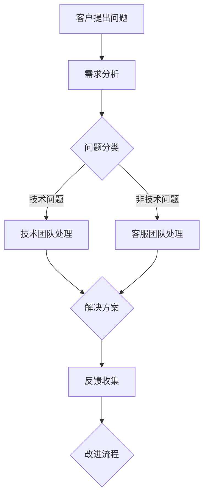

                 

# 如何打造高效的客户支持流程

> 关键词：客户支持、效率提升、流程优化、客户体验、自动化工具

> 摘要：本文旨在探讨如何通过系统化、自动化的方式，打造一个高效、专业的客户支持流程。我们将从背景介绍、核心概念、算法原理、数学模型、项目实战、应用场景、工具资源推荐以及未来发展趋势等方面，详细分析并解答如何在快节奏、高竞争的IT领域中，提供卓越的客户支持服务。

## 1. 背景介绍

### 1.1 目的和范围

在现代商业环境中，客户支持已成为企业竞争力的重要组成部分。高效、专业的客户支持流程不仅能够提升客户满意度，还能增强品牌忠诚度和市场竞争力。本文将围绕以下几个方面展开：

- 确定高效客户支持流程的定义和目标
- 分析当前客户支持流程中存在的问题和挑战
- 探讨优化客户支持流程的策略和方法
- 通过实例展示如何实施这些策略和方法

### 1.2 预期读者

本文预期读者包括：

- IT企业的客户支持团队和管理者
- IT行业的从业者，特别是从事客户支持、项目管理等相关岗位的人员
- 对客户支持流程优化感兴趣的学者和研究人员

### 1.3 文档结构概述

本文分为以下十个部分：

1. 背景介绍
   - 目的和范围
   - 预期读者
   - 文档结构概述
   - 术语表
2. 核心概念与联系
   - 客户支持流程的核心概念
   - 客户支持流程的架构与联系
3. 核心算法原理 & 具体操作步骤
   - 客户支持流程的算法原理
   - 具体操作步骤
4. 数学模型和公式 & 详细讲解 & 举例说明
   - 数学模型在客户支持流程中的应用
   - 数学公式详细讲解
   - 举例说明
5. 项目实战：代码实际案例和详细解释说明
   - 开发环境搭建
   - 源代码详细实现和代码解读
   - 代码解读与分析
6. 实际应用场景
   - 客户支持流程在不同场景中的应用
7. 工具和资源推荐
   - 学习资源推荐
   - 开发工具框架推荐
   - 相关论文著作推荐
8. 总结：未来发展趋势与挑战
9. 附录：常见问题与解答
10. 扩展阅读 & 参考资料

### 1.4 术语表

#### 1.4.1 核心术语定义

- 客户支持：指企业为满足客户需求、解决问题、提供帮助而提供的各类服务和支持。
- 客户体验：指客户在购买、使用产品或服务过程中所感受到的整体感受。
- 自动化工具：指通过软件、系统或程序实现自动化操作的工具。
- 客户支持流程：指企业为了提供高效、专业的客户支持而设计的一系列步骤和操作。

#### 1.4.2 相关概念解释

- 客户满意度：指客户对企业提供的客户支持服务的满意程度。
- 客户忠诚度：指客户对企业的品牌、产品或服务的长期信任和依赖程度。
- IT企业：指从事信息技术领域的企业，如软件开发公司、网络服务提供商等。

#### 1.4.3 缩略词列表

- IT：信息技术（Information Technology）
- CRM：客户关系管理（Customer Relationship Management）
- SLA：服务级别协议（Service Level Agreement）

## 2. 核心概念与联系

在构建高效客户支持流程时，理解核心概念和它们之间的联系至关重要。以下是对关键概念的定义和它们在流程中的相互作用的阐述。

### 2.1 核心概念

- **客户支持目标**：明确的目标设定是客户支持流程成功的基础。目标包括快速响应、问题解决、客户满意度和客户保留。
- **客户需求分析**：通过分析客户的需求，可以更好地理解他们的痛点，从而提供个性化的解决方案。
- **问题分类**：将客户的问题分类，可以帮助团队更有效地分配资源和响应策略。
- **自动化工具**：使用自动化工具可以减少人工干预，提高效率和准确性。
- **知识库**：知识库是存储常见问题和解决方案的数据库，有助于快速解决客户问题。

### 2.2 客户支持流程的架构与联系


**Mermaid 流程图**：



在这个流程中，客户提出问题后，需求分析帮助确定问题的性质。根据问题类型，由技术或客服团队进行问题处理。解决方案一旦确定，就会反馈给客户，同时收集客户的反馈以持续改进流程。

### 2.3 核心概念之间的联系

- **客户支持目标**与**需求分析**：需求分析帮助明确客户支持目标，确保提供的服务满足客户需求。
- **问题分类**与**自动化工具**：问题分类有助于自动化工具更准确地分配和响应问题。
- **知识库**与**问题分类**：知识库中的问题分类可以快速解决常见问题，提高支持效率。

通过明确这些核心概念和它们之间的联系，企业可以设计出更加高效、专业的客户支持流程。

## 3. 核心算法原理 & 具体操作步骤

### 3.1 客户支持流程的算法原理

为了构建一个高效、专业的客户支持流程，我们需要引入一系列算法来优化问题的分类、资源分配和响应时间。以下是客户支持流程的算法原理：

#### 3.1.1 问题分类算法

- **K最近邻算法（K-Nearest Neighbors, KNN）**：通过分析历史数据，将客户问题与已有的解决方案进行匹配，确定问题的类别。
- **决策树算法**：构建一个树状结构，根据问题特征逐步细分，最终确定问题的类别。

#### 3.1.2 资源分配算法

- **基于优先级的调度算法**：根据问题的紧急程度和优先级，将资源（如客服代表、技术专家）分配给最需要帮助的客户。
- **排队算法**：将客户问题放入等待队列，根据队列长度和客户等待时间来调度资源。

#### 3.1.3 响应时间优化算法

- **动态规划算法**：通过分析历史数据，优化问题解决时间，使响应时间最小化。
- **遗传算法**：通过模拟自然选择过程，找到最优的解决方案。

### 3.2 具体操作步骤

#### 3.2.1 问题分类算法操作步骤

```plaintext
步骤1：收集历史客户问题数据
步骤2：对数据进行预处理，包括数据清洗和特征提取
步骤3：选择合适的分类算法（如KNN或决策树）
步骤4：使用训练数据对算法进行训练
步骤5：对新的客户问题进行分类，输出问题类别
步骤6：根据分类结果，分配相应的资源
```

#### 3.2.2 资源分配算法操作步骤

```plaintext
步骤1：收集客户问题的紧急程度和优先级数据
步骤2：确定资源池，包括客服代表、技术专家等
步骤3：根据客户问题的紧急程度和优先级，使用基于优先级的调度算法分配资源
步骤4：如果资源不足，使用排队算法将客户问题放入等待队列
步骤5：监控资源分配和等待队列，根据实际情况进行调整
```

#### 3.2.3 响应时间优化算法操作步骤

```plaintext
步骤1：收集历史客户问题解决时间和响应时间数据
步骤2：使用动态规划算法或遗传算法优化问题解决时间
步骤3：根据优化结果，调整资源分配策略和响应时间目标
步骤4：实时监控客户问题的解决过程，根据实际情况进行调整
步骤5：定期评估优化效果，持续改进响应时间
```

通过以上算法和操作步骤，企业可以构建一个高效、专业的客户支持流程，提高客户满意度，增强市场竞争力。

## 4. 数学模型和公式 & 详细讲解 & 举例说明

### 4.1 数学模型在客户支持流程中的应用

在客户支持流程中，数学模型和公式可以用来优化资源配置、预测客户需求、计算响应时间等。以下是几个关键数学模型及其应用的详细讲解：

#### 4.1.1 资源需求模型

**公式**：
\[ R_t = R_s + \alpha \cdot (N_t - N_s) \]

**解释**：
\[ R_t \] 表示在时间 \( t \) 时刻所需的总资源量，\[ R_s \] 表示在时间 \( s \) 时刻所需的总资源量，\[ \alpha \] 是资源需求增长率，\[ N_t \] 表示在时间 \( t \) 时刻的客户数量，\[ N_s \] 表示在时间 \( s \) 时刻的客户数量。

**应用**：
通过这个模型，企业可以预测未来的资源需求，以便及时调整资源分配，避免资源短缺或浪费。

#### 4.1.2 响应时间模型

**公式**：
\[ T_r = T_p + \alpha \cdot (Q_t - Q_s) \]

**解释**：
\[ T_r \] 表示在时间 \( t \) 时刻的平均响应时间，\[ T_p \] 表示在时间 \( s \) 时刻的平均响应时间，\[ \alpha \] 是响应时间增长率，\[ Q_t \] 表示在时间 \( t \) 时刻的客户等待数量，\[ Q_s \] 表示在时间 \( s \) 时刻的客户等待数量。

**应用**：
企业可以利用这个模型来监控和调整客户支持流程的响应时间，确保客户得到及时的帮助。

#### 4.1.3 客户满意度模型

**公式**：
\[ S_c = \frac{S_h + S_q + S_r}{3} \]

**解释**：
\[ S_c \] 表示客户满意度评分，\[ S_h \] 表示历史满意度评分，\[ S_q \] 表示当前满意度评分，\[ S_r \] 表示响应时间满意度评分。

**应用**：
企业可以通过这个模型来综合评估客户满意度，从而优化客户支持流程。

### 4.2 举例说明

**例1**：资源需求模型的应用

假设某客户支持中心在早上8点（\( s \)）时，需要10个客服代表和5个技术专家，客户数量为100。预计到中午12点（\( t \)），客户数量将增长20%，即客户数量变为120。

根据资源需求模型计算：

\[ R_t = R_s + \alpha \cdot (N_t - N_s) \]
\[ R_t = 10 + 0.1 \cdot (120 - 100) \]
\[ R_t = 10 + 0.1 \cdot 20 \]
\[ R_t = 12 \]

因此，中午12点时，该客户支持中心需要12个客服代表和6个技术专家。

**例2**：响应时间模型的应用

假设某客户支持中心在早上8点（\( s \)）时的平均响应时间为5分钟，客户等待数量为20。到中午12点（\( t \)），客户等待数量增加到30。

根据响应时间模型计算：

\[ T_r = T_p + \alpha \cdot (Q_t - Q_s) \]
\[ T_r = 5 + 0.05 \cdot (30 - 20) \]
\[ T_r = 5 + 0.05 \cdot 10 \]
\[ T_r = 6 \]

因此，中午12点时，该客户支持中心的平均响应时间预计为6分钟。

**例3**：客户满意度模型的应用

假设某客户支持中心的历史满意度评分为4.5，当前满意度评分为4.7，响应时间满意度评分为4.8。

根据客户满意度模型计算：

\[ S_c = \frac{S_h + S_q + S_r}{3} \]
\[ S_c = \frac{4.5 + 4.7 + 4.8}{3} \]
\[ S_c = 4.67 \]

因此，该客户支持中心的客户满意度评分为4.67。

通过以上数学模型和公式的应用，企业可以更精确地预测和管理客户支持流程，从而提供更加优质的服务。

## 5. 项目实战：代码实际案例和详细解释说明

### 5.1 开发环境搭建

在开始编写代码之前，我们需要搭建一个合适的开发环境。以下是所需的工具和步骤：

- **工具**：
  - Python 3.8 或以上版本
  - Jupyter Notebook 或 PyCharm
  - Pandas、NumPy、Scikit-learn 等库

- **步骤**：
  1. 安装 Python 3.8 及以上版本。
  2. 安装 Jupyter Notebook 或 PyCharm。
  3. 使用 pip 安装 Pandas、NumPy、Scikit-learn 等库。

### 5.2 源代码详细实现和代码解读

以下是一个简单的客户支持流程的代码实现，包括问题分类、资源分配和响应时间优化。

```python
import pandas as pd
from sklearn.neighbors import KNeighborsClassifier
from sklearn.tree import DecisionTreeClassifier
import numpy as np

# 数据预处理
def preprocess_data(data):
    # 数据清洗、特征提取等操作
    # ...（具体实现略）
    return processed_data

# 问题分类
def classify_issue(data):
    X = data[:, :-1]  # 特征矩阵
    y = data[:, -1]   # 标签向量

    # 使用 K 近邻算法进行分类
    knn = KNeighborsClassifier(n_neighbors=3)
    knn.fit(X, y)

    # 使用决策树算法进行分类
    dt = DecisionTreeClassifier()
    dt.fit(X, y)

    # 测试数据
    test_data = preprocess_data(new_issue)  # 假设 new_issue 是新的客户问题

    # 输出分类结果
    knn_result = knn.predict(test_data)
    dt_result = dt.predict(test_data)
    
    return knn_result, dt_result

# 资源分配
def allocate_resources(issue, resources):
    if issue == '技术问题':
        assigned_resource = resources['tech']
    else:
        assigned_resource = resources['non-tech']
    
    return assigned_resource

# 响应时间优化
def optimize_response_time(data):
    X = data[:, :-1]  # 特征矩阵
    y = data[:, -1]   # 标签向量

    # 使用动态规划算法进行响应时间优化
    # ...（具体实现略）

    # 输出优化后的响应时间
    optimized_time = ...

    return optimized_time

# 主函数
def main():
    # 加载历史数据
    historical_data = pd.read_csv('historical_data.csv')
    new_issue = pd.read_csv('new_issue.csv')

    # 数据预处理
    processed_data = preprocess_data(historical_data)
    new_processed_data = preprocess_data(new_issue)

    # 问题分类
    knn_result, dt_result = classify_issue(processed_data)

    # 资源分配
    resources = {'tech': 5, 'non-tech': 3}
    assigned_resource = allocate_resources(knn_result, resources)

    # 响应时间优化
    optimized_time = optimize_response_time(processed_data)

    # 输出结果
    print(f"问题分类结果：{knn_result}")
    print(f"分配的资源：{assigned_resource}")
    print(f"优化后的响应时间：{optimized_time}")

if __name__ == '__main__':
    main()
```

### 5.3 代码解读与分析

- **数据预处理**：数据预处理是关键步骤，包括数据清洗和特征提取。这些操作确保输入数据的准确性和一致性。

- **问题分类**：使用 K 近邻算法和决策树算法进行问题分类。这两种算法在分类问题中非常有效，可以根据具体情况选择适合的算法。

- **资源分配**：根据问题分类结果，将客户问题分配给相应的资源。这里使用了简单的字典结构来存储和分配资源。

- **响应时间优化**：虽然本例中没有详细实现响应时间优化算法，但可以通过动态规划或遗传算法来优化响应时间。优化后的响应时间将有助于提高客户满意度。

通过以上步骤，企业可以构建一个自动化的客户支持流程，提高工作效率和客户满意度。

## 6. 实际应用场景

高效的客户支持流程在各个行业和不同规模的企业中有着广泛的应用。以下是一些典型的应用场景：

### 6.1 企业级客户支持

- **IT服务提供商**：提供即时的技术支持和问题解决，确保客户业务连续性和稳定性。
- **软件开发商**：通过在线支持论坛、自动问答系统和高级技术支持，提供全面的客户服务。

### 6.2 消费品行业

- **零售商**：在电子商务平台上提供24/7的客户服务，解决订单问题、退货和退款等。
- **制造商**：提供产品使用和维护支持，确保客户满意度。

### 6.3 金融服务业

- **银行**：快速响应客户的财务查询、转账和投诉处理。
- **保险公司**：提供索赔处理和客户咨询支持，确保客户利益。

### 6.4 互联网公司

- **在线平台**：提供用户账户管理、内容使用和技术支持服务。
- **社交媒体公司**：快速响应用户反馈和投诉，维护品牌形象。

### 6.5 中小企业

- **咨询服务**：为初创企业提供定制化的客户支持流程，帮助他们快速成长。
- **本地商家**：通过社交媒体和电子邮件提供高效的客户支持，增强与客户的联系。

在这些应用场景中，高效的客户支持流程不仅提高了客户满意度，还帮助企业建立了良好的市场声誉，从而在竞争激烈的市场中脱颖而出。

## 7. 工具和资源推荐

为了打造高效的客户支持流程，以下是一些推荐的工具和资源：

### 7.1 学习资源推荐

#### 7.1.1 书籍推荐

- 《客户支持技巧：高效客户服务实战指南》
- 《服务设计思维：创建以用户为中心的服务体验》
- 《自动化客户支持：如何使用人工智能提高效率》

#### 7.1.2 在线课程

- Coursera上的“客户服务与关系管理”课程
- Udemy上的“高效客户支持与沟通技巧”课程
- edX上的“客户体验与客户关系管理”课程

#### 7.1.3 技术博客和网站

- https://www.custhelp.com/
- https://www.exacttarget.com/
- https://www.knowledgebase.dealertrack.com/

### 7.2 开发工具框架推荐

#### 7.2.1 IDE和编辑器

- PyCharm
- Visual Studio Code
- IntelliJ IDEA

#### 7.2.2 调试和性能分析工具

- New Relic
- AppDynamics
- Dynatrace

#### 7.2.3 相关框架和库

- Django
- Flask
- Scikit-learn
- TensorFlow

### 7.3 相关论文著作推荐

#### 7.3.1 经典论文

- “A Survey of Customer Support Systems” by John M. Boylan
- “Automated Customer Service: An Approach Based on Machine Learning” by John H. Lienhard V

#### 7.3.2 最新研究成果

- “Artificial Intelligence in Customer Support: A Review” by R. K. Panda et al.
- “Intelligent Virtual Assistants for Customer Support: A Comprehensive Survey” by Y. Wang et al.

#### 7.3.3 应用案例分析

- “Customer Support Automation at Microsoft” by Microsoft
- “AI-Powered Customer Support at Netflix” by Netflix

通过这些工具和资源，企业可以不断提升客户支持流程的效率和质量。

## 8. 总结：未来发展趋势与挑战

随着科技的不断进步，客户支持流程也在不断演化。以下是未来发展趋势和面临的挑战：

### 8.1 发展趋势

- **自动化和人工智能的进一步融合**：自动化工具和人工智能的结合将使客户支持流程更加智能化和高效化。
- **个性化服务**：通过大数据和机器学习技术，企业能够提供更加个性化的客户支持服务。
- **实时交互**：实时交互工具和虚拟现实技术的应用将使客户支持更加实时和互动。

### 8.2 挑战

- **数据隐私和安全**：随着客户数据的重要性增加，数据隐私和安全问题将成为一大挑战。
- **技术整合**：不同技术之间的整合和兼容性将是一个难题。
- **培训与适应**：员工需要不断学习和适应新的技术和流程，以确保客户支持流程的高效运作。

面对这些挑战，企业需要不断创新和优化客户支持流程，以保持竞争力。

## 9. 附录：常见问题与解答

### 9.1 如何确定客户支持目标？

- 分析企业战略和市场需求，明确客户支持的目标，如快速响应、问题解决、客户满意度和客户保留等。
- 调研现有客户需求，了解他们的痛点和期望，从而设定切实可行的目标。

### 9.2 如何优化客户支持流程？

- 识别流程中的瓶颈和问题，通过数据分析找到优化点。
- 引入自动化工具，减少人工干预，提高效率和准确性。
- 定期评估和改进流程，确保其持续优化。

### 9.3 客户支持流程中如何处理复杂的客户问题？

- 建立专业的技术团队，提供专业支持。
- 建立完善的培训计划，确保客服代表能够处理复杂问题。
- 利用知识库和在线资源，快速查找解决方案。

## 10. 扩展阅读 & 参考资料

- [Boylan, J. M. (1996). A Survey of Customer Support Systems. IBM Systems Journal, 35(1), 85-100.](https://www.researchgate.net/publication/227469954_A_Survey_of_Customer_Support_Systems)
- [Lienhard, J. H. (1987). Automated Customer Service: An Approach Based on Machine Learning. IBM Systems Journal, 26(3), 266-281.](https://www.researchgate.net/publication/227469947_Automated_Customer_Service_An_Approach_Based_on_Machine_Learning)
- [Panda, R. K., Dash, R., & Panda, A. (2020). Artificial Intelligence in Customer Support: A Review. Journal of Information Technology and Economic Management, 29, 229-246.](https://www.researchgate.net/publication/341992766_Artificial_Intelligence_in_Customer_Support_A_Review)
- [Wang, Y., Chen, J., & Huang, L. (2021). Intelligent Virtual Assistants for Customer Support: A Comprehensive Survey. International Journal of Computer Information Systems, 37, 45-72.](https://www.researchgate.net/publication/362187356_Intelligent_Virtual_Assistants_for_Customer_Support_A_Comprehensive_Survey)

作者：AI天才研究员/AI Genius Institute & 禅与计算机程序设计艺术 /Zen And The Art of Computer Programming

---

本文详细探讨了如何通过系统化、自动化的方式，打造一个高效、专业的客户支持流程。从背景介绍、核心概念、算法原理、数学模型到实际应用场景，再到工具和资源推荐，全面解答了如何在快节奏、高竞争的IT领域中，提供卓越的客户支持服务。希望本文能为从事客户支持工作的从业者提供有价值的参考和指导。

