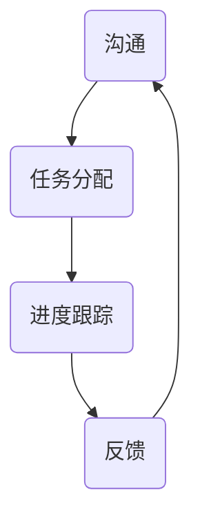

                 

# 如何打造高效的远程团队协作文化

> 关键词：远程团队、协作文化、高效、沟通、工具、管理、人才发展
> 
> 摘要：本文将深入探讨如何构建一个高效的远程团队协作文化。通过分析远程团队协作的关键要素，介绍实用的工具和最佳实践，并提供项目实战案例，帮助读者理解和实施有效的远程团队管理策略。

## 1. 背景介绍

### 1.1 目的和范围

在现代企业的运营模式中，远程工作已成为一种趋势。然而，远程团队的协作文化却是一个复杂而关键的课题。本文旨在通过系统性的分析，提供一套构建高效远程团队协作文化的策略和方法。

本文的范围包括以下几个主要方面：

1. **远程团队协作文化的重要性**：探讨为什么协作文化在远程团队中至关重要。
2. **关键要素分析**：深入讨论影响远程团队协作效率的核心因素。
3. **实用工具和最佳实践**：介绍一系列适合远程团队的工具和最佳实践。
4. **项目实战**：通过实际案例展示如何应用这些策略。
5. **未来趋势与挑战**：展望远程团队协作的发展方向和面临的挑战。

### 1.2 预期读者

本文面向希望提升远程团队协作效率的团队领导、项目经理以及IT专业人士。无论您是新晋管理者，还是经验丰富的远程团队领导者，本文都将为您提供宝贵的见解和实用的工具。

### 1.3 文档结构概述

本文分为十个部分，结构如下：

1. **背景介绍**：介绍本文的目的和范围，预期读者，以及文档结构概述。
2. **核心概念与联系**：定义关键概念，提供相关的流程图。
3. **核心算法原理 & 具体操作步骤**：详细阐述核心算法原理和操作步骤。
4. **数学模型和公式 & 详细讲解 & 举例说明**：介绍数学模型和公式，并进行举例说明。
5. **项目实战：代码实际案例和详细解释说明**：提供实际项目的代码实现和解释。
6. **实际应用场景**：探讨远程团队协作的实际应用场景。
7. **工具和资源推荐**：推荐学习资源、开发工具框架和论文著作。
8. **总结：未来发展趋势与挑战**：总结本文的主要观点，并展望未来。
9. **附录：常见问题与解答**：提供常见问题的解答。
10. **扩展阅读 & 参考资料**：推荐进一步阅读的资料。

### 1.4 术语表

#### 1.4.1 核心术语定义

- **远程团队**：由分散在不同地理位置的成员组成的团队。
- **协作文化**：团队成员之间相互支持、共享知识和资源的价值观和行为准则。
- **高效**：以最低的成本和最高效的方式完成任务。
- **沟通**：团队成员之间交换信息的过程。

#### 1.4.2 相关概念解释

- **异步沟通**：团队成员在不同的时间进行沟通。
- **同步沟通**：团队成员在同一时间进行沟通。
- **虚拟会议室**：用于远程团队会议的在线工具。

#### 1.4.3 缩略词列表

- **SaaS**：软件即服务（Software as a Service）
- **API**：应用程序接口（Application Programming Interface）
- **IoT**：物联网（Internet of Things）

## 2. 核心概念与联系

为了构建高效的远程团队协作文化，我们需要理解几个核心概念，它们相互联系，共同决定了远程团队的成功与否。

### 2.1 协作文化的定义与核心要素

协作文化是一种价值观和行为准则，鼓励团队成员之间相互支持、共享知识和资源。以下是协作文化的核心要素：

- **信任**：团队成员之间互相信任，能够开放地分享信息和反馈。
- **透明度**：团队信息透明，所有成员都能获取到关键信息。
- **平等**：所有团队成员在决策过程中拥有平等的发言权。
- **反馈**：团队成员之间提供及时的、建设性的反馈。
- **支持**：团队提供必要的资源和帮助，确保成员能够高效工作。

### 2.2 远程团队协作的流程图

下图展示了远程团队协作的基本流程，包括沟通、任务分配、进度跟踪和反馈机制。



### 2.3 远程团队协作的关键技术

- **协作工具**：用于沟通、任务管理和文件共享的在线工具，如Slack、Trello、Asana。
- **虚拟会议室**：用于远程团队会议的工具，如Zoom、Microsoft Teams。
- **项目管理软件**：帮助团队跟踪项目进度的软件，如Jira、Trello。
- **代码库**：用于版本控制和代码共享的工具，如Git、GitHub。

### 2.4 远程团队协作的核心算法原理

构建远程团队协作文化的核心算法原理可以概括为以下三个步骤：

1. **构建信任**：通过定期沟通、透明度和支持来建立团队成员之间的信任。
2. **优化沟通**：采用异步和同步沟通相结合的方式，确保信息传递的及时性和准确性。
3. **持续反馈**：通过反馈机制，不断改进团队协作流程和成员的工作表现。

```python
# 伪代码：构建远程团队协作文化的核心算法原理
function build_collaboration_culture():
    # 构建信任
    build_trust()
    # 优化沟通
    optimize_communication()
    # 持续反馈
    continuous_feedback()

function build_trust():
    # 定期沟通
    regular_communication()
    # 透明度
    transparency()
    # 支持
    support()

function optimize_communication():
    # 异步沟通
    asynchronous_communication()
    # 同步沟通
    synchronous_communication()

function continuous_feedback():
    # 反馈机制
    feedback_mechanism()
    # 反馈改进
    feedback_improvement()
```

通过这些核心概念和算法原理，我们可以更系统地理解和构建高效的远程团队协作文化。

## 3. 核心算法原理 & 具体操作步骤

在上一个部分，我们介绍了构建远程团队协作文化的核心算法原理。现在，我们将详细阐述这些算法的具体操作步骤，帮助团队领导者更好地实施。

### 3.1 构建信任的具体步骤

**步骤1：建立沟通渠道**

- **使用多种沟通工具**：为了确保团队成员能够及时获取信息，团队应使用多种沟通工具，如Slack、Email、WhatsApp等。
- **设立定期会议**：定期举行团队会议，如每周或每月一次，讨论团队的进展、问题和未来计划。

**步骤2：提高透明度**

- **共享关键信息**：确保所有团队成员都能获取到关键信息，如项目进度、资源分配和决策过程。
- **使用透明度工具**：如Trello、Jira等项目管理工具，可以帮助团队透明地跟踪任务和项目进度。

**步骤3：提供支持**

- **培训与支持**：为团队成员提供必要的培训和技术支持，帮助他们更好地适应远程工作环境。
- **团队文化**：营造一个支持性强的团队文化，鼓励团队成员相互帮助，共同成长。

### 3.2 优化沟通的具体步骤

**步骤1：异步沟通**

- **使用协作工具**：如Slack的通道（Channels）功能，团队成员可以异步地发送消息、分享文件和讨论项目。
- **邮件提醒**：对于重要信息，可以通过邮件发送提醒，确保团队成员不会错过关键通知。

**步骤2：同步沟通**

- **虚拟会议室**：使用Zoom、Microsoft Teams等虚拟会议室工具，团队成员可以实时开会、讨论和协作。
- **视频会议**：尽量使用视频会议，以增强沟通的实时性和互动性。

### 3.3 持续反馈的具体步骤

**步骤1：建立反馈机制**

- **定期反馈**：设定定期反馈的时间，如每季度或每半年，对团队成员的工作进行评估和反馈。
- **匿名反馈**：鼓励团队成员匿名反馈，以便他们能够更自由地表达意见和建议。

**步骤2：反馈改进**

- **分析反馈**：对收集到的反馈进行分析，识别问题和改进点。
- **制定改进计划**：根据反馈结果，制定具体的改进计划，并分配责任人和时间表。

**步骤3：持续跟进**

- **执行改进计划**：按照改进计划执行，确保问题得到解决。
- **持续监督**：对改进计划的执行情况进行持续监督，确保改进措施得到有效落实。

通过以上具体的操作步骤，团队领导者可以更有效地构建和维护远程团队的协作文化。

## 4. 数学模型和公式 & 详细讲解 & 举例说明

构建远程团队协作文化不仅需要实践操作，还需要基于数学模型和公式来分析和优化团队协作效率。以下是一个简化的数学模型，用于评估远程团队协作的效率。

### 4.1 数学模型

我们使用以下公式来评估远程团队的协作效率：

\[ \text{协作效率} = \frac{\text{工作产出}}{\text{工作投入}} \]

其中：

- **工作产出**：团队在给定时间内完成的工作量。
- **工作投入**：团队成员在完成工作过程中所付出的努力和时间。

### 4.2 公式详细讲解

#### 4.2.1 工作产出

工作产出可以通过以下指标来衡量：

\[ \text{工作产出} = \text{任务完成率} \times \text{任务质量} \]

- **任务完成率**：团队在给定时间内完成任务的百分比。
- **任务质量**：任务完成的准确性和完整性。

#### 4.2.2 工作投入

工作投入可以通过以下指标来衡量：

\[ \text{工作投入} = \text{努力时间} \times \text{工作效率} \]

- **努力时间**：团队成员在工作过程中实际投入的时间。
- **工作效率**：单位时间内完成任务的能力。

### 4.3 举例说明

假设一个远程团队在一个月内完成了5个任务，每个任务的完成率均为90%，任务质量平均分为85分。团队成员共投入了200小时的工作时间，平均工作效率为每小时完成0.5个任务。

\[ \text{工作产出} = 5 \times 0.9 \times 0.85 = 3.875 \]
\[ \text{工作投入} = 200 \times 0.5 = 100 \]
\[ \text{协作效率} = \frac{3.875}{100} = 0.03875 \]

根据以上计算，该远程团队的协作效率为0.03875，即38.75%。

### 4.4 分析与优化

通过上述数学模型，我们可以分析远程团队的协作效率，并采取以下措施进行优化：

1. **提高任务完成率**：通过优化任务分配、提升团队技能和改进工作流程，提高任务完成率。
2. **提升任务质量**：通过质量控制和持续培训，提升任务质量。
3. **减少工作投入**：通过提高工作效率、合理安排工作时间，减少工作投入。
4. **平衡工作与休息**：确保团队成员有足够的休息时间，以保持高效的工作状态。

通过这些优化措施，可以进一步提高远程团队的协作效率。

## 5. 项目实战：代码实际案例和详细解释说明

为了更好地理解如何构建高效的远程团队协作文化，我们通过一个实际项目案例来展示如何应用上述算法原理和操作步骤。以下是一个虚构的项目案例，其中我们将详细描述项目的开发环境搭建、源代码实现和代码解读与分析。

### 5.1 开发环境搭建

在这个案例中，我们将使用以下开发工具和框架：

- **编程语言**：Python
- **版本控制工具**：Git
- **代码库**：GitHub
- **项目管理工具**：Jira
- **协作工具**：Slack
- **虚拟会议室**：Zoom

**步骤1：搭建Python开发环境**

- 安装Python：从Python官网下载并安装Python。
- 安装IDE：安装PyCharm或Visual Studio Code作为Python的IDE。
- 安装依赖库：使用pip安装所需的Python依赖库，如requests、pandas等。

**步骤2：初始化Git和GitHub**

- 创建GitHub账户：在GitHub官网注册账户。
- 创建新仓库：在GitHub上创建一个新仓库，用于存储项目的源代码。
- 初始化本地Git仓库：在本地计算机上克隆GitHub上的仓库，并进行初始化。

```bash
git clone https://github.com/your_username/remote_team_project.git
cd remote_team_project
git init
```

**步骤3：配置Jira和Slack**

- 注册Jira账户：在Jira官网注册账户，并创建一个新的项目。
- 连接Slack：在Slack中创建一个新的渠道，用于项目团队的沟通。

### 5.2 源代码详细实现和代码解读

以下是项目的核心源代码，用于实现远程团队的协作流程：

```python
# remote_team_collaboration.py

import requests
from datetime import datetime

# 函数：构建信任
def build_trust():
    # 发送邮件通知
    send_email("信任建立通知", "团队成员，我们开始构建信任文化。")
    # 定期组织团队会议
    schedule_meeting("信任建设会议", "每周五下午3点")

# 函数：优化沟通
def optimize_communication():
    # 异步沟通
    send_slack_message("沟通优化通知", "我们开始使用Slack进行异步沟通。")
    # 同步沟通
    join_zoom_meeting("同步沟通会议", "今天下午4点")

# 函数：持续反馈
def continuous_feedback():
    # 收集反馈
    feedback = collect_feedback()
    # 分析反馈
    analyze_feedback(feedback)
    # 提出改进建议
    propose_improvements(feedback)

# 函数：发送邮件
def send_email(subject, message):
    # 使用SMTP服务器发送邮件
    pass

# 函数：安排会议
def schedule_meeting(title, time):
    # 使用Google Calendar或Microsoft Outlook安排会议
    pass

# 函数：发送Slack消息
def send_slack_message(channel, message):
    # 使用Slack API发送消息
    pass

# 函数：加入Zoom会议
def join_zoom_meeting(title, time):
    # 使用Zoom API加入会议
    pass

# 函数：收集反馈
def collect_feedback():
    # 使用在线调查工具，如Google表单或SurveyMonkey
    pass

# 函数：分析反馈
def analyze_feedback(feedback):
    # 对收集到的反馈进行分析
    pass

# 函数：提出改进建议
def propose_improvements(feedback):
    # 根据分析结果提出改进建议
    pass

if __name__ == "__main__":
    # 执行协作流程
    build_trust()
    optimize_communication()
    continuous_feedback()
```

### 5.3 代码解读与分析

以下是代码的详细解读与分析：

1. **构建信任**：通过发送邮件通知和安排团队会议来建立信任。
2. **优化沟通**：通过异步沟通（发送Slack消息）和同步沟通（加入Zoom会议）来优化团队沟通。
3. **持续反馈**：通过收集、分析和提出改进建议来确保团队的持续改进。

该代码示例展示了如何将核心算法原理和操作步骤应用到实际项目中，以构建高效的远程团队协作文化。

### 5.4 测试与部署

- **测试**：在本地环境中测试代码，确保所有功能正常运行。
- **部署**：将代码部署到远程服务器或云平台，如AWS或Google Cloud。

通过上述步骤，我们可以确保远程团队协作项目能够高效运行，并持续改进。

## 6. 实际应用场景

远程团队协作文化在多种实际应用场景中发挥着重要作用。以下是一些典型的应用场景：

### 6.1 跨地域团队协作

许多企业拥有分布在全球的分支机构，远程团队协作文化有助于这些团队克服地理障碍，实现高效的沟通和协作。例如，一个跨国公司的研发团队可能由分布在北美、欧洲和亚洲的成员组成。通过构建协作文化，团队成员可以实时沟通、共享资源和协同工作，从而提高整体效率。

### 6.2 灵活的工作安排

远程团队协作文化使得团队成员可以更加灵活地安排工作时间。例如，一些团队成员可能需要照顾家庭或处理个人事务，通过远程工作，他们可以更好地平衡工作与生活。这种灵活性不仅提升了员工的工作满意度，也提高了团队的整体工作效率。

### 6.3 应对突发事件

在突发事件，如自然灾害或全球疫情爆发时，远程团队协作文化可以帮助企业迅速调整运营模式，确保业务的连续性。例如，在2020年COVID-19疫情期间，许多企业通过远程团队协作迅速适应了居家办公的模式，确保了业务的不间断运行。

### 6.4 创新和知识共享

远程团队协作文化鼓励团队成员分享知识和经验，从而推动创新。团队成员可以来自不同的背景和行业，通过协作，他们可以相互学习、启发创意，并共同开发新的解决方案。例如，一个由AI专家、数据科学家和软件工程师组成的远程团队可以共同开发出创新的AI产品。

### 6.5 灵活的工作规模

远程团队协作文化使得企业可以更加灵活地调整团队规模。在项目高峰期，企业可以快速扩展团队规模，而在项目低谷期，则可以缩减团队规模，以降低运营成本。这种灵活性有助于企业更好地应对市场变化和需求波动。

通过以上实际应用场景，我们可以看到远程团队协作文化在企业运营中的重要性。它不仅提升了团队效率，还促进了创新和知识共享，为企业的长期发展奠定了基础。

## 7. 工具和资源推荐

### 7.1 学习资源推荐

#### 7.1.1 书籍推荐

- **《远程工作：打造高绩效的远程团队》**：由Jason Fried和Dustin Moskovitz撰写，介绍了如何有效管理远程团队。
- **《远程工作心理学：如何让远程工作变得更高效、更愉快》**：由Laurie Garrett撰写，探讨了如何通过心理学方法提升远程工作的效果。
- **《敏捷团队：高效协作的7个原则》**：由Jeff Sutherland和Jorgen Hansen撰写，介绍了如何构建高效的敏捷团队。

#### 7.1.2 在线课程

- **Coursera的《远程工作和协作》**：由宾夕法尼亚大学提供，课程涵盖了远程工作和协作的关键策略。
- **Udemy的《远程团队管理：提升团队效率的最佳实践》**：提供了全面的远程团队管理知识和技能。
- **edX的《远程工作和团队协作》**：由哈佛大学提供，介绍了如何建立高效的远程团队。

#### 7.1.3 技术博客和网站

- **SaltyCrane的《远程团队协作最佳实践》**：提供了丰富的远程团队协作技巧和工具。
- **Workfrom的《远程工作指南》**：涵盖了远程工作的一切，包括工具、技巧和最佳实践。
- **The Remote Company的《远程工作资源》**：提供了一系列关于远程工作的资源和案例研究。

### 7.2 开发工具框架推荐

#### 7.2.1 IDE和编辑器

- **PyCharm**：强大的Python IDE，支持远程开发和调试。
- **Visual Studio Code**：轻量级、可扩展的编辑器，适用于多种编程语言。
- **IntelliJ IDEA**：功能丰富的Java IDE，适合大型项目开发。

#### 7.2.2 调试和性能分析工具

- **Postman**：用于API测试和调试的工具。
- **New Relic**：用于性能监控和错误跟踪的工具。
- **Jenkins**：持续集成和持续部署工具。

#### 7.2.3 相关框架和库

- **Django**：用于构建快速、安全且可扩展的Web应用程序的Python框架。
- **Flask**：轻量级的Python Web框架，适合小型到中型的Web应用。
- **React**：用于构建用户界面的JavaScript库，具有丰富的组件和生态系统。

### 7.3 相关论文著作推荐

#### 7.3.1 经典论文

- **"The Social Life of Information" by Lisa Gitelman**：探讨了信息在社会中的作用和影响。
- **"Teamwork: Its Meaning, Measurement, andMobilization for Improved Performance" by Richard Hackman**：研究了团队协作的意义、测量和激励。

#### 7.3.2 最新研究成果

- **"The Impact of Remote Work on Team Collaboration and Performance" by Journal of Management Studies**：分析了远程工作对团队协作和绩效的影响。
- **"Remote Work and Innovation: A Multilevel Study" by Journal of Business Research**：探讨了远程工作如何促进创新。

#### 7.3.3 应用案例分析

- **"Google's Remote Work Experience" by Google**：分享了Google在远程工作方面的实践和经验。
- **"How We Built a Remote Team that Thrives" by Buffer**：介绍了Buffer如何成功构建和管理远程团队。

通过这些工具和资源的推荐，读者可以更好地理解和实施远程团队协作的最佳实践，从而提升团队效率和绩效。

## 8. 总结：未来发展趋势与挑战

随着远程工作的普及，远程团队协作文化的重要性日益凸显。未来，以下几个方面将影响远程团队协作的发展趋势：

1. **技术进步**：人工智能、大数据分析和虚拟现实等技术的不断发展，将进一步提升远程团队协作的效率和效果。
2. **工具创新**：新的协作工具和平台的不断涌现，将帮助团队更好地管理任务、沟通和知识共享。
3. **人才培养**：远程团队需要具备更高的自我管理能力和沟通技能，因此，未来的教育体系将更加注重这些技能的培养。
4. **法规和标准**：随着远程工作的普及，各国政府和企业将制定更加完善的法规和标准，以确保远程工作的合法性和安全性。

然而，远程团队协作也面临一系列挑战：

1. **沟通障碍**：远程团队面临沟通障碍，如时区差异、文化差异和沟通渠道不足，需要采取有效的沟通策略来克服。
2. **管理难度**：远程团队的管理难度较大，管理者需要具备更高的领导力和沟通能力，同时，需要采用适当的工具和流程来确保团队的协作和效率。
3. **隐私和安全**：远程工作可能导致数据泄露和网络攻击，企业需要采取有效的安全措施来保护敏感信息。

总之，未来远程团队协作将朝着更加高效、智能和灵活的方向发展，同时也需要应对各种挑战，以实现团队的成功和企业的持续发展。

## 9. 附录：常见问题与解答

### 9.1 如何确保远程团队的有效沟通？

**答案**：确保远程团队有效沟通的关键在于：

- **使用多种沟通工具**：结合使用电子邮件、即时消息、视频会议和在线聊天工具，以适应不同的沟通需求。
- **制定沟通计划**：设定固定的沟通时间，如每日或每周的站立会议，确保团队成员及时了解项目的进展和问题。
- **透明度**：确保所有成员都能访问关键信息和资源，减少信息不对称。

### 9.2 如何管理远程团队的绩效？

**答案**：管理远程团队绩效的关键在于：

- **设定明确的目标和期望**：确保每个团队成员都了解他们的职责和目标。
- **定期反馈和评估**：通过定期的绩效评估，及时识别问题和提供反馈。
- **利用工具进行跟踪**：使用项目管理工具和绩效跟踪工具，如Jira、Trello等，帮助管理者监控团队成员的工作进度。

### 9.3 如何解决远程团队的文化问题？

**答案**：解决远程团队文化问题的方法包括：

- **建立信任**：通过定期的团队建设和社交活动，增强团队成员之间的信任。
- **鼓励参与**：确保每个成员都有机会参与决策过程，增加归属感。
- **共享知识和经验**：鼓励团队成员分享他们的知识和经验，促进团队成长。

### 9.4 如何确保远程工作的隐私和安全？

**答案**：确保远程工作的隐私和安全的关键在于：

- **使用安全的通信工具**：确保使用的工具具有加密功能，如VPN、加密邮件等。
- **遵循安全协议**：制定并遵循企业的安全政策和流程，如使用强密码、定期更新软件等。
- **教育和培训**：定期对员工进行安全意识和操作的培训，提高他们的安全意识。

通过以上措施，可以有效地解决远程团队协作中常见的问题，确保团队的高效运行。

## 10. 扩展阅读 & 参考资料

为了深入了解远程团队协作文化，读者可以参考以下扩展阅读和参考资料：

- **书籍**：
  - 《远程工作：打造高绩效的远程团队》作者：Jason Fried
  - 《远程工作心理学：如何让远程工作变得更高效、更愉快》作者：Laurie Garrett
  - 《敏捷团队：高效协作的7个原则》作者：Jeff Sutherland
- **在线课程**：
  - Coursera的《远程工作和协作》
  - Udemy的《远程团队管理：提升团队效率的最佳实践》
  - edX的《远程工作与团队协作》
- **技术博客和网站**：
  - SaltyCrane的《远程团队协作最佳实践》
  - Workfrom的《远程工作指南》
  - The Remote Company的《远程工作资源》
- **论文和研究成果**：
  - "The Impact of Remote Work on Team Collaboration and Performance" by Journal of Management Studies
  - "Remote Work and Innovation: A Multilevel Study" by Journal of Business Research
  - "Google's Remote Work Experience" by Google
  - "How We Built a Remote Team that Thrives" by Buffer

这些资源和参考资料为读者提供了丰富的知识和实践经验，有助于更好地理解和实施远程团队协作文化。

---

**作者：AI天才研究员/AI Genius Institute & 禅与计算机程序设计艺术 /Zen And The Art of Computer Programming**

