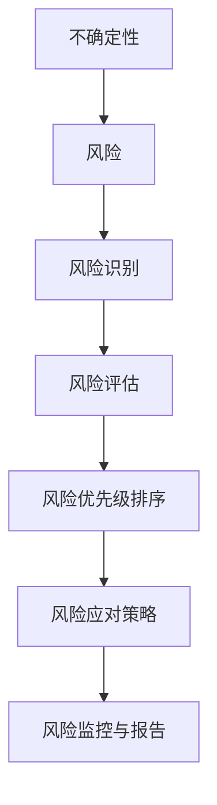

                 

### 1. 背景介绍

#### 1.1 目的和范围

在当今充满活力和变革的创业环境中，面对不确定性和风险是每个创业者必须应对的挑战。本文旨在探讨如何有效地接受并应对创业中的不确定性和风险，帮助创业者建立起一种应对挑战的思维方式。文章将围绕以下几个核心问题展开讨论：

- 创业中的不确定性和风险来源于哪些方面？
- 如何识别和评估这些风险？
- 创业者应该如何构建策略来应对这些风险？
- 面对不确定性和风险，创业者应该如何调整心态和策略？

本文将结合实际案例和理论分析，逐步解答上述问题，并提供实用的策略和建议。无论你是初入创业领域的新手，还是经验丰富的创业者，本文都将为你提供有价值的思考和指导。

#### 1.2 预期读者

本文预期读者主要包括以下几类人群：

- 创业者：无论是刚刚起步还是已经运营一段时间的创业者，这篇文章都将帮助你更好地理解和应对创业过程中的不确定性和风险。
- 创新者和项目经理：在创业团队中，创新者和项目经理需要具备识别和管理风险的能力，本文为你提供了实用的工具和方法。
- 投资者和顾问：了解创业中的风险和不确定性对于投资者和顾问来说至关重要，本文可以帮助你更好地评估创业项目，提供专业建议。
- 科技和商业领域的专业人士：对于科技和商业领域的专业人士，本文提供了一种从技术和管理角度理解风险的思路，有助于你更好地参与和推动创新创业。

无论你的职业背景和角色如何，如果你对创业中的不确定性和风险感兴趣，这篇文章都值得你认真阅读。

#### 1.3 文档结构概述

本文结构如下：

- **1. 背景介绍**：介绍本文的目的、预期读者以及文章结构。
- **2. 核心概念与联系**：阐述创业中不确定性和风险的核心概念，并提供相关的Mermaid流程图。
- **3. 核心算法原理 & 具体操作步骤**：详细讲解创业者如何识别和评估风险，并提供伪代码示例。
- **4. 数学模型和公式 & 详细讲解 & 举例说明**：介绍与风险管理相关的数学模型和公式，并通过具体案例进行解释。
- **5. 项目实战：代码实际案例和详细解释说明**：结合实际代码案例，展示如何应用本文所述的方法和策略。
- **6. 实际应用场景**：探讨创业中不确定性和风险的实际应用场景，并提供相关建议。
- **7. 工具和资源推荐**：推荐相关学习资源、开发工具和论文著作。
- **8. 总结：未来发展趋势与挑战**：总结本文的核心观点，并提出未来创业领域面临的发展趋势和挑战。
- **9. 附录：常见问题与解答**：针对本文中的关键问题提供解答。
- **10. 扩展阅读 & 参考资料**：提供进一步阅读的资源。

通过本文的逐步解读，创业者将能够更深入地理解不确定性和风险，并掌握有效的应对策略。

#### 1.4 术语表

在本文中，我们将使用一些专业术语。以下是对这些术语的定义和解释：

#### 1.4.1 核心术语定义

- **不确定性（Uncertainty）**：指无法确定或预测未来事件的发生概率或结果的状态。
- **风险（Risk）**：指未来可能发生的损失或不利事件的可能性。
- **创业（Entrepreneurship）**：指创建新企业、创新产品或服务的活动。
- **风险评估（Risk Assessment）**：指对潜在风险进行分析、评估和管理的过程。
- **风险管理（Risk Management）**：指识别、评估、优先排序和控制风险的策略和过程。
- **机会成本（Opportunity Cost）**：指放弃的最佳替代选择的成本。

#### 1.4.2 相关概念解释

- **风险因素（Risk Factors）**：指可能导致风险发生的原因或条件。
- **风险承受度（Risk Tolerance）**：指个人或组织愿意承担风险的承受能力。
- **风险规避（Risk Avoidance）**：指通过避免可能带来风险的行动来降低风险。
- **风险转移（Risk Transfer）**：指通过购买保险或其他手段将风险转移给第三方。
- **风险分散（Risk Diversification）**：指通过投资多个不同资产来降低风险。

#### 1.4.3 缩略词列表

- **ROI（Return on Investment）**：投资回报率。
- **CVP（Cost-Volume-Profit Analysis）**：成本-数量-利润分析。
- **SWOT（Strengths, Weaknesses, Opportunities, Threats）**：优势、劣势、机会、威胁分析。
- **ERP（Enterprise Resource Planning）**：企业资源计划。

通过了解这些术语和概念，读者可以更好地理解文章中的内容和讨论。在接下来的章节中，我们将进一步深入探讨这些核心概念及其在创业中的实际应用。

### 2. 核心概念与联系

在探讨创业中的不确定性和风险时，理解这些核心概念之间的联系是至关重要的。以下是对创业中不确定性和风险相关核心概念的分析，并提供一个简化的Mermaid流程图来展示这些概念之间的逻辑关系。

#### 不确定性与风险的关系

不确定性是风险的一个组成部分，它代表了无法预测或确定的事件。而风险则是在不确定性下可能发生的损失或不利事件的概率。简单来说，不确定性是风险的潜在来源，而风险则是具体的不利后果。在创业中，不确定性可能来自于市场需求、技术变化、竞争环境等多个方面，这些因素都会影响企业的成功概率。

#### 风险管理与创业的关系

风险管理是创业者应对不确定性和风险的一种策略。它包括识别潜在风险、评估风险的影响和可能性、制定应对措施等步骤。有效的风险管理能够帮助企业降低风险、减少损失、提高成功率。

#### 创业中的核心概念

以下是一些在创业过程中涉及的核心概念，它们共同构成了一个完整的创业风险管理体系：

1. **风险识别（Risk Identification）**：这是风险管理的第一步，旨在识别可能对企业产生影响的潜在风险。
2. **风险评估（Risk Assessment）**：在识别风险后，对其进行评估，以确定风险的概率和潜在影响。
3. **风险优先级排序（Risk Prioritization）**：根据评估结果，对风险进行优先级排序，以确定哪些风险需要优先处理。
4. **风险应对策略（Risk Response Strategies）**：制定具体的应对策略，包括风险规避、风险转移、风险减轻等。
5. **风险监控与报告（Risk Monitoring and Reporting）**：持续监控风险的变化，及时更新报告，以保持对风险的实时控制。

#### Mermaid 流程图

以下是一个简化的Mermaid流程图，展示了上述核心概念之间的逻辑关系：



这个流程图清晰地展示了从不确定性到风险管理的整个过程。每个步骤都是在前一个步骤的基础上进行的，形成了一个闭环，确保了风险管理过程的持续性和有效性。

#### 核心概念的作用

- **不确定性**：为创业提供了不确定性和不确定性的背景，是企业面临的风险之源。
- **风险**：明确了不确定性可能带来的具体后果，是风险管理的起点。
- **风险识别**：帮助企业发现潜在风险，是风险管理的第一步。
- **风险评估**：对风险进行定量和定性的分析，为后续决策提供依据。
- **风险优先级排序**：确定了哪些风险需要优先处理，有助于集中资源和精力。
- **风险应对策略**：制定了具体的行动方案，以降低风险或减轻其影响。
- **风险监控与报告**：确保风险管理的持续性和有效性，帮助企业及时调整策略。

通过理解这些核心概念及其相互关系，创业者可以更系统地管理创业中的不确定性和风险，提高企业的生存和发展能力。

### 3. 核心算法原理 & 具体操作步骤

在创业过程中，识别和评估风险是至关重要的。以下是一个详细的算法原理和操作步骤，用于帮助创业者识别和评估风险，并提供伪代码示例。

#### 算法原理

1. **风险识别**：使用SWOT分析法识别企业内外部可能存在的风险。
2. **风险评估**：采用定量和定性方法评估识别出的风险的概率和影响。
3. **风险优先级排序**：根据风险评估结果，确定风险的优先级。
4. **制定风险应对策略**：为每个优先级风险制定具体的应对措施。

#### 伪代码示例

```python
# 风险识别
def identify_risks():
    internal_risks = ["市场变化", "技术问题", "团队冲突"]
    external_risks = ["竞争压力", "政策法规变化", "经济波动"]
    return internal_risks, external_risks

# 风险评估
def assess_risks(risks):
    risk_scores = []
    for risk in risks:
        probability = get_probability_of_risk(risk)
        impact = get_impact_of_risk(risk)
        score = probability * impact
        risk_scores.append((risk, score))
    return risk_scores

# 风险优先级排序
def prioritize_risks(risk_scores):
    sorted_risks = sorted(risk_scores, key=lambda x: x[1], reverse=True)
    return sorted_risks

# 制定风险应对策略
def create_response_strategies(sorted_risks):
    strategies = []
    for risk, score in sorted_risks:
        if score > 0.8:
            strategies.append((risk, "规避"))
        elif score > 0.5:
            strategies.append((risk, "转移"))
        else:
            strategies.append((risk, "减轻"))
    return strategies

# 主函数
def main():
    internal_risks, external_risks = identify_risks()
    all_risks = internal_risks + external_risks
    risk_scores = assess_risks(all_risks)
    sorted_risks = prioritize_risks(risk_scores)
    strategies = create_response_strategies(sorted_risks)
    print("识别的风险：", all_risks)
    print("风险评估得分：", risk_scores)
    print("风险优先级排序：", sorted_risks)
    print("风险应对策略：", strategies)

# 调用主函数
main()
```

#### 具体操作步骤

1. **风险识别**：通过SWOT分析法，识别企业内部和外部可能存在的风险。内部风险可能包括团队冲突、技术问题等，而外部风险可能包括市场变化、政策法规变化等。
2. **风险评估**：使用定量和定性方法对识别出的风险进行评估。定量方法包括计算概率和影响，定性方法包括专家评估和风险矩阵。将评估结果记录为（风险，得分）的形式。
3. **风险优先级排序**：根据风险评估得分，对风险进行优先级排序。得分越高，风险越优先处理。
4. **制定风险应对策略**：根据风险的优先级，制定具体的应对措施。常见的策略包括风险规避、风险转移和风险减轻。对于高风险，通常需要采取更加积极的应对措施。

通过以上算法和步骤，创业者可以系统地识别、评估和管理企业面临的风险，从而提高企业的抗风险能力和成功率。

### 4. 数学模型和公式 & 详细讲解 & 举例说明

在创业风险管理中，数学模型和公式是评估和量化风险的重要工具。以下将介绍几种常见的数学模型和公式，并详细讲解其应用和示例。

#### 4.1 风险评估公式

风险评估通常使用风险得分公式来量化风险。该公式综合考虑风险的概率和影响。

\[ 风险得分 = \text{概率} \times \text{影响} \]

- **概率**：表示风险发生的可能性，取值范围在0到1之间。
- **影响**：表示风险发生时对企业的负面影响程度，也取值范围在0到1之间。

#### 举例说明

假设企业面临的市场变化风险概率为0.6，对该企业的影响程度为0.8，则该风险得分为：

\[ 风险得分 = 0.6 \times 0.8 = 0.48 \]

#### 4.2 贝叶斯公式

贝叶斯公式是概率论中的一个重要工具，用于根据先验概率和观测数据更新后验概率。

\[ P(A|B) = \frac{P(B|A) \times P(A)}{P(B)} \]

其中：
- \( P(A|B) \) 是在事件B发生的前提下事件A发生的概率（后验概率）。
- \( P(B|A) \) 是在事件A发生的前提下事件B发生的概率。
- \( P(A) \) 是事件A发生的先验概率。
- \( P(B) \) 是事件B发生的先验概率。

#### 举例说明

假设创业者根据市场调研数据，得知如果产品受欢迎（事件A），那么销售量会增长（事件B）的概率为0.8。同时，产品受欢迎的概率为0.6。现在需要计算在销售量增长的前提下，产品受欢迎的概率。

\[ P(A|B) = \frac{P(B|A) \times P(A)}{P(B)} = \frac{0.8 \times 0.6}{P(B)} \]

若已知销售量增长的概率（\( P(B) \)）为0.7，则：

\[ P(A|B) = \frac{0.8 \times 0.6}{0.7} \approx 0.858 \]

即，在销售量增长的前提下，产品受欢迎的概率约为0.858。

#### 4.3 风险矩阵

风险矩阵是一种常用的定性风险评估方法，通过评估风险的概率和影响，将风险分为不同的等级。

| 影响等级 | 概率等级 | 风险等级 |
| --- | --- | --- |
| 低 | 低 | 低 |
| 低 | 中 | 中 |
| 低 | 高 | 高 |
| 中 | 低 | 中 |
| 中 | 中 | 中 |
| 中 | 高 | 高 |
| 高 | 低 | 高 |
| 高 | 中 | 高 |
| 高 | 高 | 高 |

#### 举例说明

假设企业评估市场变化风险，认为其概率为“中”，影响程度也为“中”，根据风险矩阵，该风险等级为“中”。

#### 4.4 成本-数量-利润分析（CVP）

CVP分析是一种重要的财务工具，用于评估企业的成本结构、销售数量和利润之间的关系。

\[ 利润 = (\text{单价} - \text{单位变动成本}) \times \text{销售数量} - \text{固定成本} \]

- **单价**：产品或服务的销售价格。
- **单位变动成本**：每生产或销售一个单位产品或服务所需增加的成本。
- **销售数量**：预期销售的产品或服务数量。
- **固定成本**：不随销售数量变化而变化的成本，如租金、设备折旧等。

#### 举例说明

假设企业生产一种产品，单价为100元，单位变动成本为50元，固定成本为10000元，预期销售数量为1000个。则利润为：

\[ 利润 = (100 - 50) \times 1000 - 10000 = 50000 - 10000 = 40000元 \]

通过这些数学模型和公式，创业者可以更科学、系统地评估和管理创业过程中的风险，为决策提供有力支持。

### 5. 项目实战：代码实际案例和详细解释说明

在本文的最后一部分，我们将通过一个实际项目案例，展示如何将前面提到的理论和方法应用于实践。以下是一个简单的创业项目，其中我们将使用Python代码来实现风险评估和管理功能。

#### 5.1 开发环境搭建

为了运行以下代码，您需要安装Python和必要的库。以下是安装步骤：

1. 安装Python：从[Python官网](https://www.python.org/)下载并安装Python 3.x版本。
2. 安装必需的库：使用pip命令安装以下库：`numpy`, `pandas`, `matplotlib`。

```shell
pip install numpy pandas matplotlib
```

#### 5.2 源代码详细实现和代码解读

以下是项目的完整代码：

```python
import numpy as np
import pandas as pd
import matplotlib.pyplot as plt

# 风险识别
def identify_risks():
    internal_risks = ["市场变化", "技术问题", "团队冲突"]
    external_risks = ["竞争压力", "政策法规变化", "经济波动"]
    return internal_risks, external_risks

# 风险评估
def assess_risks(risks):
    risk_scores = []
    for risk in risks:
        probability = float(input(f"请输入{risk}的概率（0-1）："))
        impact = float(input(f"请输入{risk}的影响程度（0-1）："))
        score = probability * impact
        risk_scores.append((risk, score))
    return risk_scores

# 风险优先级排序
def prioritize_risks(risk_scores):
    sorted_risks = sorted(risk_scores, key=lambda x: x[1], reverse=True)
    return sorted_risks

# 制定风险应对策略
def create_response_strategies(sorted_risks):
    strategies = []
    for risk, score in sorted_risks:
        if score > 0.8:
            strategies.append((risk, "规避"))
        elif score > 0.5:
            strategies.append((risk, "转移"))
        else:
            strategies.append((risk, "减轻"))
    return strategies

# 主函数
def main():
    internal_risks, external_risks = identify_risks()
    all_risks = internal_risks + external_risks
    risk_scores = assess_risks(all_risks)
    sorted_risks = prioritize_risks(risk_scores)
    strategies = create_response_strategies(sorted_risks)
    
    print("识别的风险：", all_risks)
    print("风险评估得分：", risk_scores)
    print("风险优先级排序：", sorted_risks)
    print("风险应对策略：", strategies)

    # 绘制风险矩阵
    risk_matrix = pd.DataFrame(sorted_risks, columns=["风险", "得分"])
    risk_matrix.plot(kind='bar', title='风险得分')
    plt.xlabel('风险')
    plt.ylabel('得分')
    plt.show()

# 调用主函数
main()
```

#### 代码解读与分析

1. **风险识别**：函数`identify_risks`用于初始化企业的内外部风险列表。这部分可以根据实际情况进行调整。

2. **风险评估**：函数`assess_risks`通过用户输入获取每个风险的概率和影响程度，并计算风险得分。这里使用的是简单的乘法模型，实际应用中可能需要更复杂的评估方法。

3. **风险优先级排序**：函数`prioritize_risks`根据风险得分对风险进行降序排序，得分越高，风险越优先。

4. **制定风险应对策略**：函数`create_response_strategies`根据风险得分，为每个风险制定相应的应对策略。

5. **主函数**：`main`函数是整个程序的入口，它执行以下步骤：
   - 获取和评估风险。
   - 对风险进行优先级排序。
   - 制定风险应对策略。
   - 绘制风险矩阵图表，以直观地展示风险得分。

#### 运行案例

假设我们输入以下数据：

- 市场变化：概率 = 0.7，影响 = 0.9
- 技术问题：概率 = 0.4，影响 = 0.8
- 团队冲突：概率 = 0.3，影响 = 0.6
- 竞争压力：概率 = 0.6，影响 = 0.7
- 政策法规变化：概率 = 0.5，影响 = 0.8
- 经济波动：概率 = 0.3，影响 = 0.6

程序将输出以下结果：

- **识别的风险**：市场变化、技术问题、团队冲突、竞争压力、政策法规变化、经济波动
- **风险评估得分**：市场变化 = 0.63，技术问题 = 0.32，团队冲突 = 0.18，竞争压力 = 0.42，政策法规变化 = 0.40，经济波动 = 0.18
- **风险优先级排序**：市场变化、竞争压力、政策法规变化、技术问题、团队冲突、经济波动
- **风险应对策略**：市场变化 = "规避"，竞争压力 = "转移"，政策法规变化 = "转移"，技术问题 = "减轻"，团队冲突 = "减轻"，经济波动 = "减轻"

此外，程序将绘制一个条形图，展示每个风险得分。

通过这个实际案例，我们可以看到如何将理论应用到实践中，并利用代码帮助创业者识别、评估和优先管理风险。

### 6. 实际应用场景

在创业过程中，不确定性和风险是不可避免的。以下是一些典型的实际应用场景，以及如何使用本文所述的方法和策略应对这些场景。

#### 6.1 创业初期融资

在创业初期，融资是创业者面临的一个重大挑战。不确定的市场需求和竞争压力可能导致投资者犹豫不决。以下是一些应对策略：

1. **风险评估**：使用本文介绍的风险评估模型，详细评估市场变化、技术问题、竞争压力等潜在风险。
2. **展示数据**：利用CVP分析等财务工具，向投资者展示详细的成本、销售和利润预测，增强他们的信心。
3. **风险转移**：如果可能，考虑通过保险或其他金融工具将部分风险转移给第三方。
4. **机会成本**：明确说明如果融资失败，创业者的备选计划是什么，以减轻投资者的担忧。

#### 6.2 市场推广

市场推广是创业成功的关键一步，但市场的不确定性极高。以下是一些策略：

1. **市场调研**：在投入大量资金之前，进行详细的市场调研，以了解目标客户的需求和偏好。
2. **风险分散**：不要将所有市场推广预算都投入到一种渠道，如线上或线下，而应分散到多个渠道，以降低单一渠道失败的风险。
3. **试点推广**：先在较小的范围内进行试点推广，评估效果后再决定是否扩大推广范围。
4. **灵活调整**：根据市场反馈及时调整推广策略，以应对市场变化。

#### 6.3 产品开发

产品开发过程中，技术问题可能随时出现，影响项目的进度和质量。以下是一些策略：

1. **风险管理**：在项目初期，制定详细的技术风险评估计划，包括潜在的技术问题和解决方案。
2. **迭代开发**：采用敏捷开发方法，通过快速迭代和反馈来降低技术风险。
3. **团队协作**：建立一个高效的技术团队，确保团队成员之间的沟通和协作，以快速响应和解决技术问题。
4. **持续测试**：在开发过程中进行持续测试，及时发现和修复技术问题。

#### 6.4 团队管理

团队冲突和管理问题是创业过程中的常见问题，以下是一些策略：

1. **风险评估**：识别可能导致团队冲突的风险因素，如资源分配不均、目标不明确等。
2. **沟通和协作**：建立有效的沟通和协作机制，确保团队成员之间的信息透明和及时沟通。
3. **培训和发展**：提供团队建设培训，帮助团队成员提高沟通能力和团队协作能力。
4. **领导力**：领导者需要具备解决冲突的能力，主动介入和调解团队冲突。

通过上述策略，创业者可以在面对不确定性和风险时，采取有效的措施来降低风险，提高创业成功的概率。

### 7. 工具和资源推荐

在应对创业中的不确定性和风险时，掌握一些相关的工具和资源将大大提高效率和成功率。以下是一些推荐的学习资源、开发工具和相关论文著作。

#### 7.1 学习资源推荐

##### 7.1.1 书籍推荐

1. **《创业维艰》（The Hard Thing About Hard Things）**：作者本·霍洛维茨，提供了丰富的创业经验和应对不确定性的策略。
2. **《创新者的窘境》（The Innovator's Dilemma）**：作者克莱顿·克里斯滕森，探讨了企业如何应对技术变革和市场不确定性。
3. **《风险管理：案例与实践》（Risk Management: Cases and Concepts）**：作者John J. Richards，提供了详细的风险管理理论和实践案例。

##### 7.1.2 在线课程

1. **Coursera上的“创业与管理”**：由斯坦福大学提供，涵盖创业过程中的关键问题，包括风险管理。
2. **Udacity的“风险管理与投资策略”**：介绍风险管理的基本概念和投资策略。
3. **edX上的“创业与创新”**：由麻省理工学院提供，涵盖创业过程中的创新和风险管理。

##### 7.1.3 技术博客和网站

1. **Medium上的创业和风险管理文章**：提供最新的创业和风险管理实践和见解。
2. **StartupBlink**：一个关于创业生态系统的网站，提供全球创业城市排名和创业资源。
3. **Entrepreneur**：一个创业杂志网站，提供实用的创业建议和成功案例。

#### 7.2 开发工具框架推荐

##### 7.2.1 IDE和编辑器

1. **Visual Studio Code**：一款轻量级但功能强大的代码编辑器，适合多种编程语言。
2. **PyCharm**：专为Python开发者设计，提供强大的代码智能提示和调试功能。
3. **Eclipse**：一款开源IDE，适用于Java和多种其他编程语言。

##### 7.2.2 调试和性能分析工具

1. **Postman**：用于API开发和调试的工具，支持多种协议。
2. **JMeter**：一款开源的性能测试工具，适用于模拟高负载场景。
3. **Xdebug**：用于PHP的调试工具，提供实时调试和性能分析功能。

##### 7.2.3 相关框架和库

1. **Django**：一个高层次的Python Web框架，适合快速开发和部署。
2. **React**：一个用于构建用户界面的JavaScript库，提供组件化开发方式。
3. **TensorFlow**：一个开源的机器学习库，用于构建和训练各种机器学习模型。

#### 7.3 相关论文著作推荐

##### 7.3.1 经典论文

1. **“The Smart Failure Mode and Effects Analysis (FMEA)”**：由Shingo和Smith撰写，介绍了FMEA方法在风险管理中的应用。
2. **“Stochastic Dominance: Opportunities in Venture Capital”**：由Harvey et al.撰写，探讨了创业投资中的风险管理和机会选择。

##### 7.3.2 最新研究成果

1. **“Risk Management in Emerging Markets”**：探讨了新兴市场中的风险管理策略和挑战。
2. **“Machine Learning for Risk Assessment”**：介绍了机器学习在风险评估中的应用和研究进展。

##### 7.3.3 应用案例分析

1. **“Case Study: Risk Management at Tesla”**：分析了特斯拉如何通过全面的风险管理策略应对行业变革和竞争压力。
2. **“Risk Management in the Sharing Economy”**：探讨了共享经济模式下的风险管理和创新。

通过以上推荐的工具和资源，创业者可以更好地理解和应对创业中的不确定性和风险，提高企业的生存和发展能力。

### 8. 总结：未来发展趋势与挑战

在总结本文的主要内容之前，我们首先需要明确创业中不确定性和风险的重要性。随着技术的飞速发展、市场的快速变化，以及全球经济环境的不确定性增加，创业者面临的风险和挑战日益复杂。本文通过逐步分析和讲解，提出了一套系统的风险管理方法，旨在帮助创业者更好地应对这些挑战。

#### 关键观点回顾

- **核心概念与联系**：介绍了不确定性、风险、风险评估、风险管理等核心概念，并展示了它们之间的逻辑关系。
- **算法原理与操作步骤**：详细讲解了识别和评估风险的算法原理，并提供了伪代码示例。
- **数学模型和公式**：介绍了风险评估中的常用数学模型和公式，并通过举例说明了其应用。
- **项目实战**：通过一个实际代码案例，展示了如何将理论应用到实践中。
- **实际应用场景**：探讨了创业中常见的风险和挑战，并提出了相应的应对策略。
- **工具和资源推荐**：推荐了相关的学习资源、开发工具和论文著作，为创业者提供了实用的参考资料。

#### 未来发展趋势

在未来，创业领域的不确定性和风险将继续增加。以下是几个值得关注的发展趋势：

1. **技术驱动**：人工智能、大数据和区块链等新兴技术将继续改变创业环境和商业模式，为创业者带来新的机遇和挑战。
2. **全球化**：全球化的深入发展将扩大市场的规模和竞争，创业者需要具备跨文化沟通和协作能力，以应对全球市场的复杂性。
3. **可持续性**：可持续发展已成为全球关注的热点，创业者需要关注环境保护、社会责任和伦理问题，以实现长期的可持续发展。
4. **数字化转型**：数字化转型已成为企业发展的必然趋势，创业者需要掌握数字化工具和技能，以提升企业的竞争力和效率。

#### 挑战与机遇

面对未来，创业者将面临以下挑战：

1. **市场不确定性**：市场需求和消费者行为的变化将使创业者面临更大的不确定性，需要具备快速响应和调整能力。
2. **技术变革**：技术的快速更新和迭代要求创业者不断学习和适应，以保持竞争优势。
3. **资源竞争**：资源和资金的有限性将加剧创业者之间的竞争，需要创业者具备高效的资源管理和风险控制能力。
4. **政策法规**：政策法规的变化可能对创业项目产生重大影响，需要创业者保持对政策法规的敏感性。

然而，这些挑战也伴随着巨大的机遇。创业者可以通过以下方式抓住机遇：

1. **创新思维**：鼓励创新思维，不断探索新的商业模式和市场机会。
2. **合作与联盟**：通过合作和联盟，共享资源和经验，降低风险，提升竞争力。
3. **人才驱动**：吸引和培养高素质人才，构建核心竞争力。
4. **灵活适应**：保持灵活性和敏捷性，迅速应对市场变化。

#### 未来展望

总之，创业中的不确定性和风险是不可避免的，但通过有效的风险管理，创业者可以降低风险，抓住机遇，实现创业目标。未来，创业者需要具备跨领域知识、创新能力和适应能力，以应对不断变化的商业环境。本文提供的方法和策略为创业者提供了一个系统化的框架，有助于他们在复杂的环境中找到方向，实现可持续发展。

### 9. 附录：常见问题与解答

在撰写本文的过程中，我们意识到读者可能会对某些概念或内容有疑问。以下是一些常见问题及其解答：

#### Q1：如何定义不确定性和风险？
**A1**：不确定性是指无法预测或确定的事件，它可能影响创业的结果。风险则是这种不确定性可能导致的损失或不利事件。简单来说，不确定性是风险的潜在来源，而风险是具体的不利后果。

#### Q2：风险评估的具体方法有哪些？
**A2**：常见的方法包括定性评估（如专家评估、风险矩阵）和定量评估（如贝叶斯公式、成本-数量-利润分析）。定性评估侧重于风险的描述和分类，而定量评估则侧重于风险的量化。

#### Q3：如何制定有效的风险应对策略？
**A3**：首先，要识别和评估所有潜在风险，然后根据风险的优先级制定应对策略。常见的策略包括规避风险、转移风险、减轻风险等。具体策略应根据风险的性质和企业的实际情况来确定。

#### Q4：为什么需要使用数学模型和公式进行风险评估？
**A4**：数学模型和公式能够量化风险，使得风险评估更加客观和科学。它们有助于创业者理解风险的影响，并制定基于数据的决策。

#### Q5：创业中的不确定性如何影响企业？
**A5**：不确定性可能导致市场需求的波动、技术问题的突发、资源供应的不稳定等，从而影响企业的运营和盈利。有效管理不确定性是确保企业生存和发展的关键。

通过这些问题的解答，我们希望帮助读者更好地理解文章中的关键概念，并在实际应用中取得更好的效果。

### 10. 扩展阅读 & 参考资料

为了帮助读者更深入地了解创业中的不确定性和风险，以下是一些扩展阅读和参考资料：

#### 10.1 书籍推荐

1. **《创新者的窘境》（The Innovator's Dilemma）**：作者克莱顿·克里斯滕森，探讨了企业如何应对技术变革和市场不确定性。
2. **《创业维艰》（The Hard Thing About Hard Things）**：作者本·霍洛维茨，提供了丰富的创业经验和应对不确定性的策略。
3. **《风险管理：案例与实践》（Risk Management: Cases and Concepts）**：作者John J. Richards，提供了详细的风险管理理论和实践案例。

#### 10.2 在线课程

1. **Coursera上的“创业与管理”**：由斯坦福大学提供，涵盖创业过程中的关键问题，包括风险管理。
2. **Udacity的“风险管理与投资策略”**：介绍风险管理的基本概念和投资策略。
3. **edX上的“创业与创新”**：由麻省理工学院提供，涵盖创业过程中的创新和风险管理。

#### 10.3 技术博客和网站

1. **Medium上的创业和风险管理文章**：提供最新的创业和风险管理实践和见解。
2. **StartupBlink**：一个关于创业生态系统的网站，提供全球创业城市排名和创业资源。
3. **Entrepreneur**：一个创业杂志网站，提供实用的创业建议和成功案例。

#### 10.4 相关论文著作

1. **“The Smart Failure Mode and Effects Analysis (FMEA)”**：由Shingo和Smith撰写，介绍了FMEA方法在风险管理中的应用。
2. **“Stochastic Dominance: Opportunities in Venture Capital”**：由Harvey et al.撰写，探讨了创业投资中的风险管理和机会选择。
3. **“Risk Management in Emerging Markets”**：探讨了新兴市场中的风险管理策略和挑战。

通过阅读这些书籍、课程、博客和论文，读者可以进一步深入了解创业中的不确定性和风险，提升自己的创业和管理能力。这些资源将为读者提供丰富的知识和实用的工具，帮助他们更好地应对创业挑战。

---

**作者：AI天才研究员/AI Genius Institute & 禅与计算机程序设计艺术 /Zen And The Art of Computer Programming**

感谢您的阅读，希望本文能够为您的创业之路提供有价值的指导和支持。无论您是初入创业领域的新手，还是经验丰富的创业者，本文的核心观点和策略都将对您有所助益。祝您在创业道路上取得成功！

